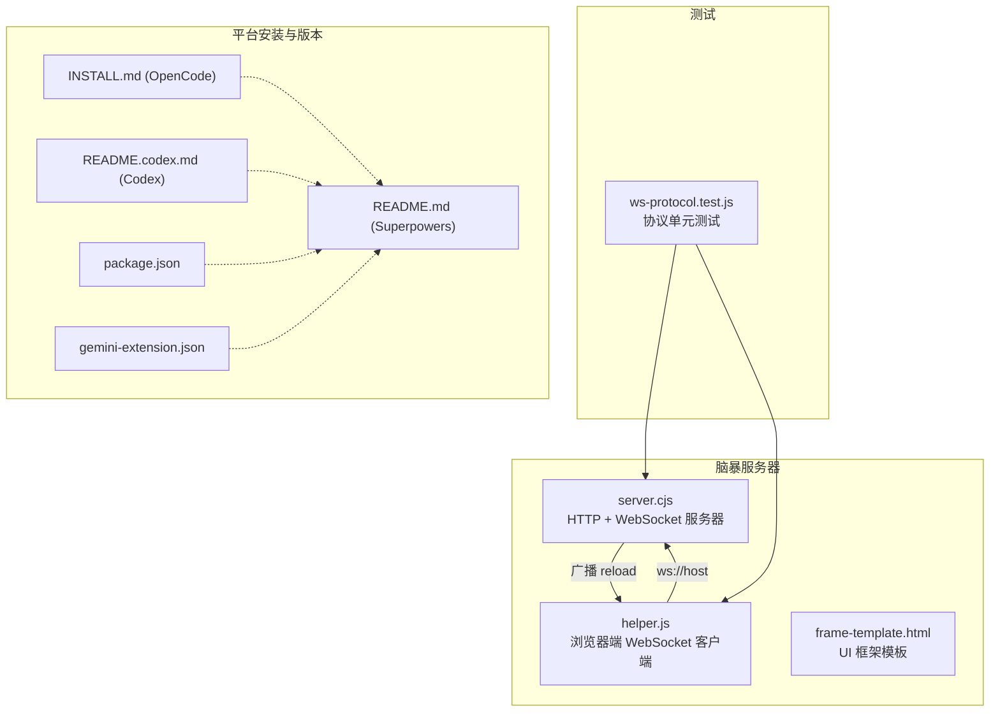
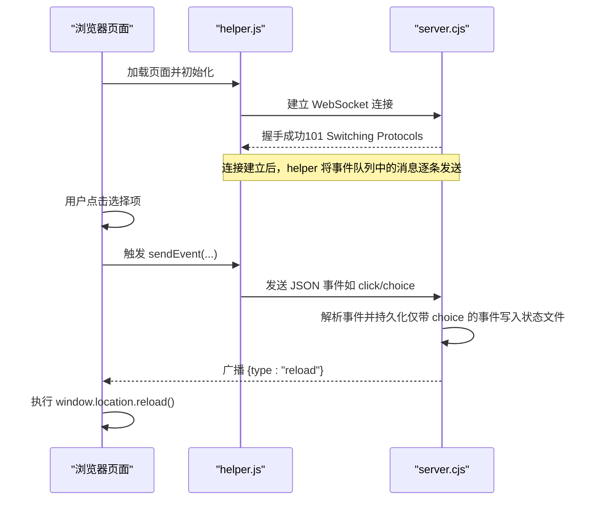
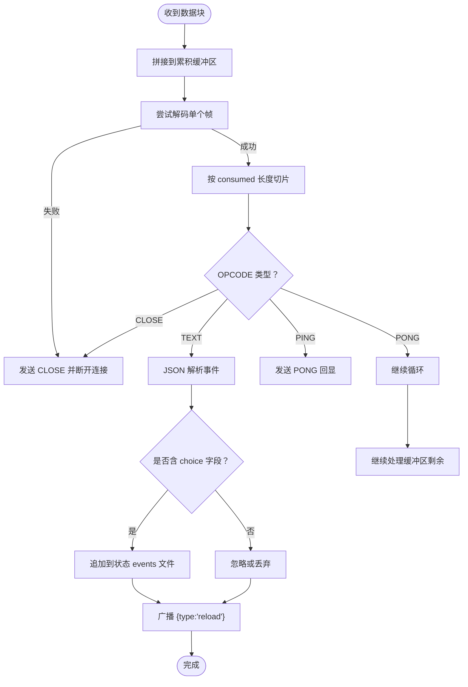
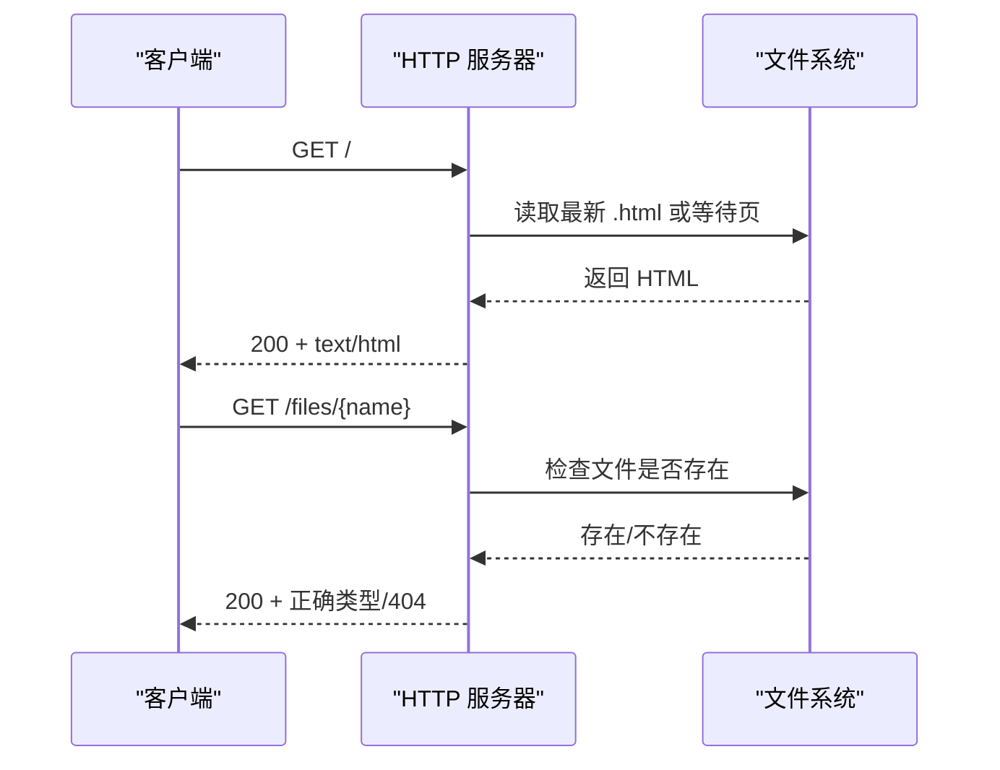
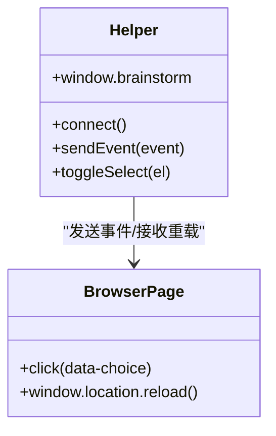
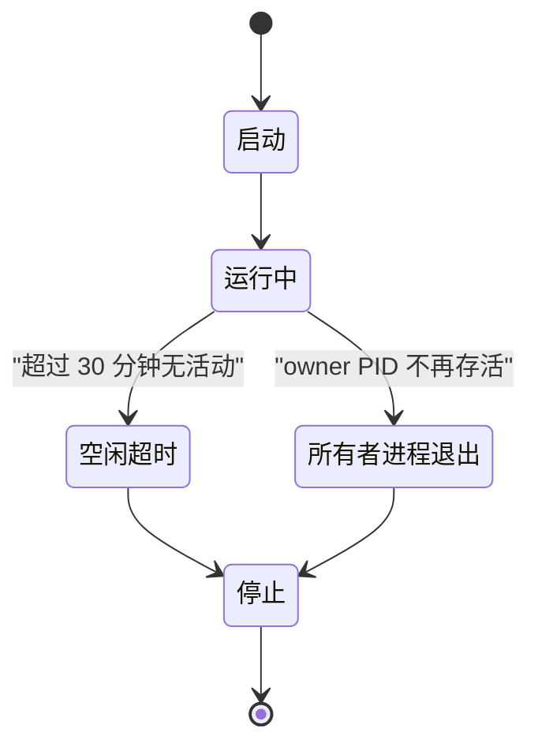
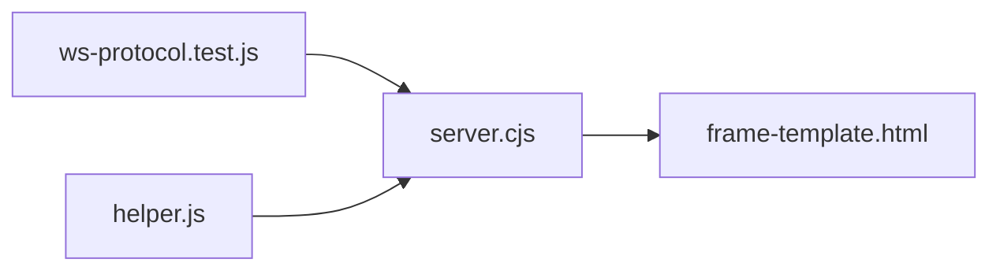

# API 参考

<cite>
**本文引用的文件**
- [skills/brainstorming/scripts/server.cjs](file://skills/brainstorming/scripts/server.cjs)
- [skills/brainstorming/scripts/helper.js](file://skills/brainstorming/scripts/helper.js)
- [skills/brainstorming/scripts/frame-template.html](file://skills/brainstorming/scripts/frame-template.html)
- [tests/brainstorm-server/ws-protocol.test.js](file://tests/brainstorm-server/ws-protocol.test.js)
- [.opencode/INSTALL.md](file://.opencode/INSTALL.md)
- [docs/README.codex.md](file://docs/README.codex.md)
- [README.md](file://README.md)
- [package.json](file://package.json)
- [gemini-extension.json](file://gemini-extension.json)
</cite>

## 目录
1. [简介](#简介)
2. [项目结构](#项目结构)
3. [核心组件](#核心组件)
4. [架构总览](#架构总览)
5. [详细组件分析](#详细组件分析)
6. [依赖关系分析](#依赖关系分析)
7. [性能考量](#性能考量)
8. [故障排查指南](#故障排查指南)
9. [结论](#结论)
10. [附录](#附录)

## 简介
本参考文档面向 Superpowers 的 API 使用与集成，重点覆盖以下方面：
- WebSocket API：握手流程、帧编解码、消息格式、事件类型与实时交互模式
- REST API（静态资源）：HTTP 方法、URL 模式、内容协商与文件服务
- 客户端集成：浏览器端 helper 脚本如何连接、发送事件与接收重载指令
- 协议细节：RFC 6455 兼容性、帧长度边界、掩码要求、关闭码语义
- 错误处理与生命周期：空闲超时、所有者进程监控、异常关闭与重连
- 版本与平台：插件版本、安装与更新方式（OpenCode、Codex、Gemini CLI）

## 项目结构
与 API 直接相关的核心文件位于 brainstorming 技能脚本目录，并通过单元测试验证 WebSocket 协议实现。

**图表来源**
- [skills/brainstorming/scripts/server.cjs](file://skills/brainstorming/scripts/server.cjs)
- [skills/brainstorming/scripts/helper.js](file://skills/brainstorming/scripts/helper.js)
- [skills/brainstorming/scripts/frame-template.html](file://skills/brainstorming/scripts/frame-template.html)
- [tests/brainstorm-server/ws-protocol.test.js](file://tests/brainstorm-server/ws-protocol.test.js)
- [.opencode/INSTALL.md](file://.opencode/INSTALL.md)
- [docs/README.codex.md](file://docs/README.codex.md)
- [README.md](file://README.md)
- [package.json](file://package.json)
- [gemini-extension.json](file://gemini-extension.json)

**章节来源**
- [README.md](file://README.md)
- [.opencode/INSTALL.md](file://.opencode/INSTALL.md)
- [docs/README.codex.md](file://docs/README.codex.md)
- [package.json](file://package.json)
- [gemini-extension.json](file://gemini-extension.json)

## 核心组件
- WebSocket 协议实现：包含握手计算、帧编码/解码、OPCODE 常量与掩码规则
- HTTP 静态资源服务：根路径返回 UI 框架包裹的内容，/files/* 提供静态文件下载
- 浏览器端 helper：自动连接、事件队列、点击选择上报、收到 reload 后刷新
- 生命周期与健康：空闲超时、所有者进程存活检测、优雅退出与 server-info 写盘

**章节来源**
- [skills/brainstorming/scripts/server.cjs](file://skills/brainstorming/scripts/server.cjs)
- [skills/brainstorming/scripts/helper.js](file://skills/brainstorming/scripts/helper.js)
- [skills/brainstorming/scripts/frame-template.html](file://skills/brainstorming/scripts/frame-template.html)

## 架构总览
下图展示从浏览器到服务器的消息流与事件类型：

**图表来源**
- [skills/brainstorming/scripts/helper.js](file://skills/brainstorming/scripts/helper.js)
- [skills/brainstorming/scripts/server.cjs](file://skills/brainstorming/scripts/server.cjs)

## 详细组件分析

### WebSocket API（RFC 6455 兼容）
- 握手
  - 计算 Accept 值：基于 Sec-WebSocket-Key 与固定魔术字符串进行 SHA-1 哈希并 Base64 编码
  - 成功后返回 101 Switching Protocols
- 帧编解码
  - 服务器帧不掩码；客户端帧必须掩码
  - 支持小/中/大帧长度：小于 126、126 扩展、127 扩展（64 位）
  - PING/PONG 自动回显；CLOSE 帧可携带状态码
- 消息与事件
  - 文本帧承载 JSON 事件对象
  - 服务器解析事件并记录带 choice 的用户选择到状态文件
  - 服务器向所有已连接客户端广播 {type:"reload"} 以触发页面刷新

**图表来源**
- [skills/brainstorming/scripts/server.cjs](file://skills/brainstorming/scripts/server.cjs)
- [tests/brainstorm-server/ws-protocol.test.js](file://tests/brainstorm-server/ws-protocol.test.js)

**章节来源**
- [skills/brainstorming/scripts/server.cjs](file://skills/brainstorming/scripts/server.cjs)
- [tests/brainstorm-server/ws-protocol.test.js](file://tests/brainstorm-server/ws-protocol.test.js)

### REST API（静态资源）
- GET /
  - 返回 UI 框架包裹的最新 HTML 屏幕内容
  - 若无屏幕文件则返回等待页
  - 自动注入 helper 脚本
- GET /files/{file}
  - 从内容目录返回静态文件
  - 基于扩展名设置 Content-Type
  - 404 未找到

**图表来源**
- [skills/brainstorming/scripts/server.cjs](file://skills/brainstorming/scripts/server.cjs)

**章节来源**
- [skills/brainstorming/scripts/server.cjs](file://skills/brainstorming/scripts/server.cjs)

### 浏览器端 WebSocket 客户端（helper.js）
- 连接
  - 使用当前主机的 ws:// 地址连接
  - 连接建立后将事件队列中的事件逐条发送
  - 断线自动每秒重连一次
- 事件上报
  - 捕获带有 data-choice 的元素点击，构造事件对象并发送
  - 提供 window.brainstorm API：send(...) 与 choice(value, metadata)
- 交互反馈
  - 监听 {type:"reload"} 并执行页面刷新
  - 更新指示栏文本显示当前选中数量与标签

**图表来源**
- [skills/brainstorming/scripts/helper.js](file://skills/brainstorming/scripts/helper.js)
- [skills/brainstorming/scripts/frame-template.html](file://skills/brainstorming/scripts/frame-template.html)

**章节来源**
- [skills/brainstorming/scripts/helper.js](file://skills/brainstorming/scripts/helper.js)
- [skills/brainstorming/scripts/frame-template.html](file://skills/brainstorming/scripts/frame-template.html)

### 协议与数据模型
- 帧字段与长度
  - FIN + OPCODE（例如 TEXT=0x01, CLOSE=0x08, PING=0x09, PONG=0x0A）
  - 长度字段：0-125（直接）、126（16 位扩展）、127（64 位扩展）
  - 掩码：客户端帧必须掩码；服务器帧不掩码
- 事件对象
  - 示例字段：type、choice、text、id、timestamp 等
  - 服务器仅对带 choice 的事件进行持久化
- 关闭码
  - CLOSE 帧可携带 2 字节状态码与可选原因
  - 单元测试覆盖了状态码与原因解析

**章节来源**
- [skills/brainstorming/scripts/server.cjs](file://skills/brainstorming/scripts/server.cjs)
- [tests/brainstorm-server/ws-protocol.test.js](file://tests/brainstorm-server/ws-protocol.test.js)

### 生命周期与健康检查
- 空闲超时：默认 30 分钟无活动则优雅退出
- 所有者进程监控：若配置了 owner PID，定期检查其存活；启动时若已死亡则禁用监控
- 服务器信息：启动时写入 server-info 文件，停止时写入 server-stopped
- 文件变更：监听内容目录变化，去抖后广播 reload

**图表来源**
- [skills/brainstorming/scripts/server.cjs](file://skills/brainstorming/scripts/server.cjs)

**章节来源**
- [skills/brainstorming/scripts/server.cjs](file://skills/brainstorming/scripts/server.cjs)

## 依赖关系分析
- server.cjs 导出协议工具函数，供测试模块使用
- helper.js 依赖当前页面 host 动态构建 ws:// 地址
- frame-template.html 作为 UI 框架模板被 HTTP 服务返回
- 单元测试独立验证协议实现，不依赖 HTTP 服务器运行

**图表来源**
- [tests/brainstorm-server/ws-protocol.test.js](file://tests/brainstorm-server/ws-protocol.test.js)
- [skills/brainstorming/scripts/server.cjs](file://skills/brainstorming/scripts/server.cjs)
- [skills/brainstorming/scripts/helper.js](file://skills/brainstorming/scripts/helper.js)
- [skills/brainstorming/scripts/frame-template.html](file://skills/brainstorming/scripts/frame-template.html)

**章节来源**
- [tests/brainstorm-server/ws-protocol.test.js](file://tests/brainstorm-server/ws-protocol.test.js)
- [skills/brainstorming/scripts/server.cjs](file://skills/brainstorming/scripts/server.cjs)
- [skills/brainstorming/scripts/helper.js](file://skills/brainstorming/scripts/helper.js)
- [skills/brainstorming/scripts/frame-template.html](file://skills/brainstorming/scripts/frame-template.html)

## 性能考量
- 帧大小边界
  - 小帧（<126）：头部短、CPU 开销低
  - 中帧（126 扩展）与大帧（127 扩展）：注意内存分配与拷贝成本
- 掩码与解码
  - 客户端帧必须掩码，服务器严格校验；避免错误帧导致连接关闭
- 广播策略
  - 广播 reload 会触发所有客户端刷新，建议在必要时才触发
- 文件监听与去抖
  - 对同一文件的多次变更合并为一次广播，降低抖动

[本节提供通用指导，无需具体文件分析]

## 故障排查指南
- 握手失败
  - 检查 Sec-WebSocket-Key 是否存在；确认 Accept 计算正确
- 帧解码错误
  - 确保客户端帧掩码位正确；检查长度字段与扩展长度字节
  - 处理不完整帧：等待更多数据或抛出异常并关闭连接
- 连接断开与重连
  - helper.js 在 onclose 后每秒重连；检查网络与服务器日志
- 404 文件访问
  - 确认 /files/* 请求的文件存在于内容目录且路径正确
- 空闲退出
  - 若长时间无活动或 owner 进程退出，服务器会优雅关闭；可通过重新启动恢复

**章节来源**
- [skills/brainstorming/scripts/server.cjs](file://skills/brainstorming/scripts/server.cjs)
- [skills/brainstorming/scripts/helper.js](file://skills/brainstorming/scripts/helper.js)
- [tests/brainstorm-server/ws-protocol.test.js](file://tests/brainstorm-server/ws-protocol.test.js)

## 结论
Superpowers 的 WebSocket API 采用纯 JavaScript 实现，严格遵循 RFC 6455，具备完整的握手、帧编解码与事件广播能力。配合 HTTP 静态资源服务与浏览器端 helper，形成从 UI 到服务器的闭环交互。通过单元测试保障协议正确性，结合生命周期监控确保稳定性。

[本节为总结，无需具体文件分析]

## 附录

### 版本与平台信息
- 版本
  - package.json：主版本号
  - gemini-extension.json：扩展版本号
- 安装与更新
  - OpenCode：通过插件配置自动安装与更新
  - Codex：通过本地技能发现机制加载
  - Gemini CLI：通过扩展命令安装与更新

**章节来源**
- [package.json](file://package.json)
- [gemini-extension.json](file://gemini-extension.json)
- [.opencode/INSTALL.md](file://.opencode/INSTALL.md)
- [docs/README.codex.md](file://docs/README.codex.md)
- [README.md](file://README.md)

### 常见用例与最佳实践
- 用例
  - 在 UI 中提供选项卡片，用户点击后上报 choice 事件
  - 服务器检测到新屏幕文件后广播 reload，页面自动刷新
- 最佳实践
  - 客户端事件统一带上 timestamp
  - 仅在必要时广播 reload，避免频繁刷新
  - 保持 owner PID 配置正确以启用进程监控

[本节为概念性内容，无需具体文件分析]