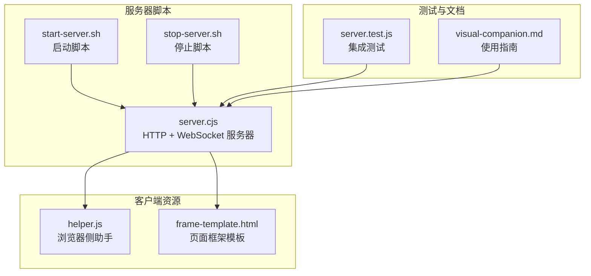
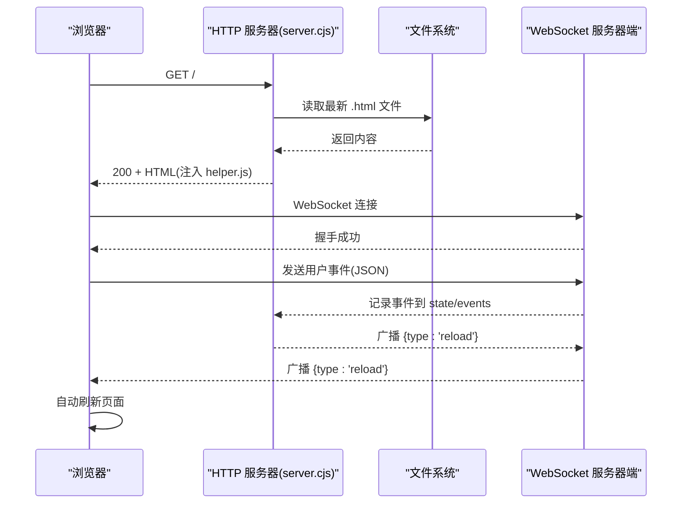
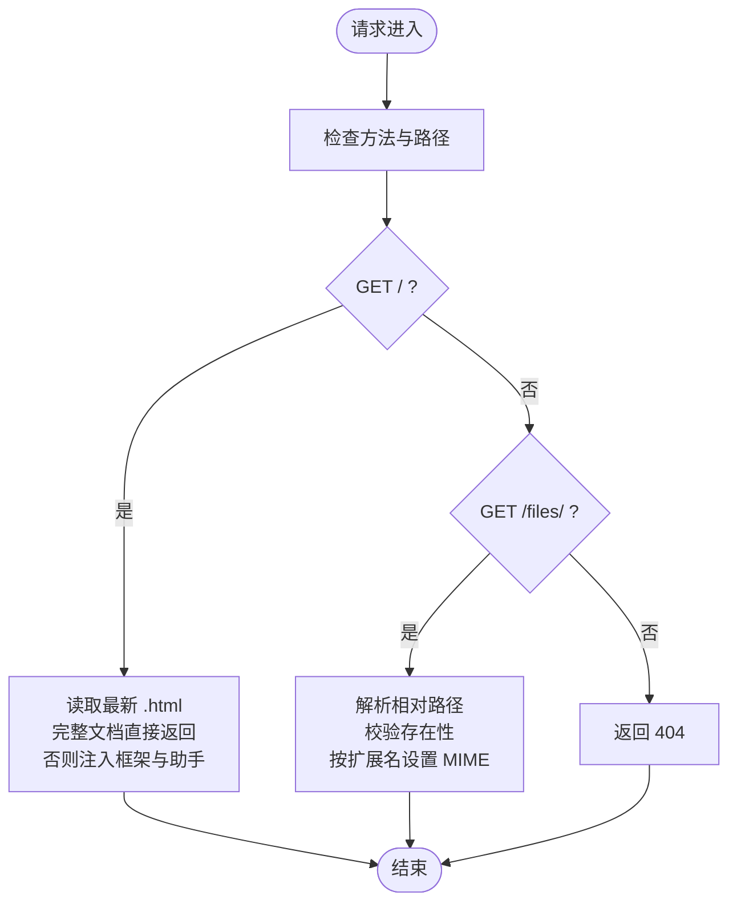
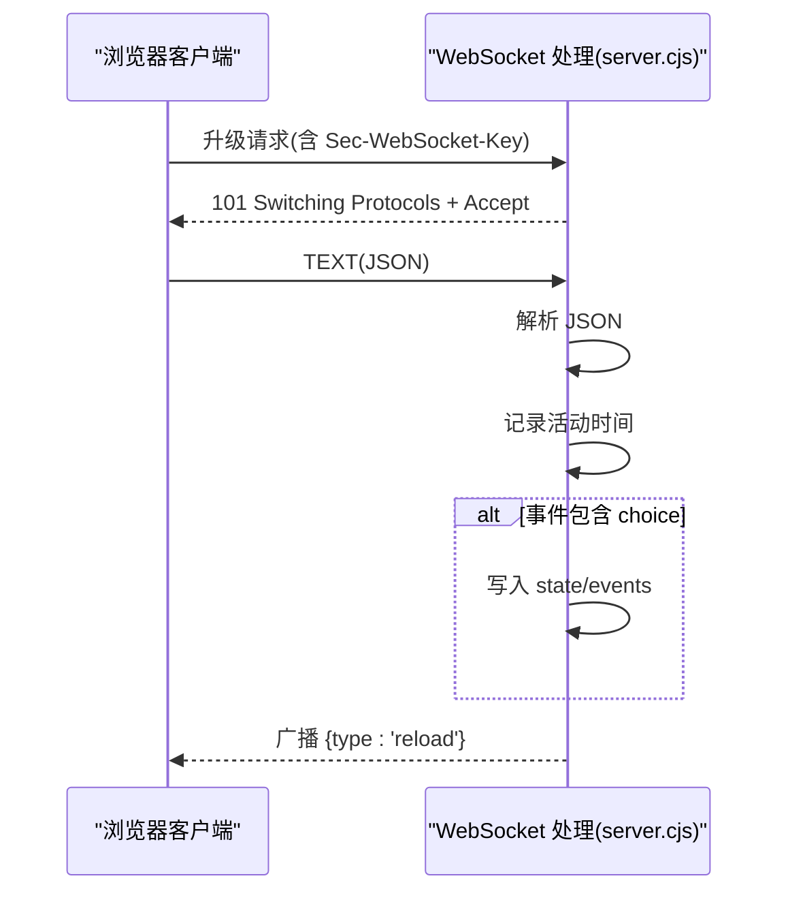
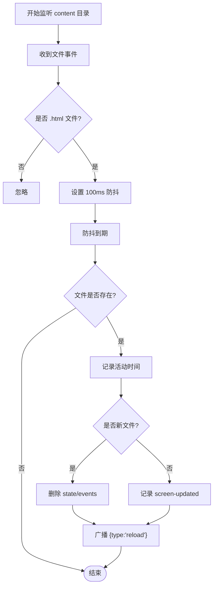
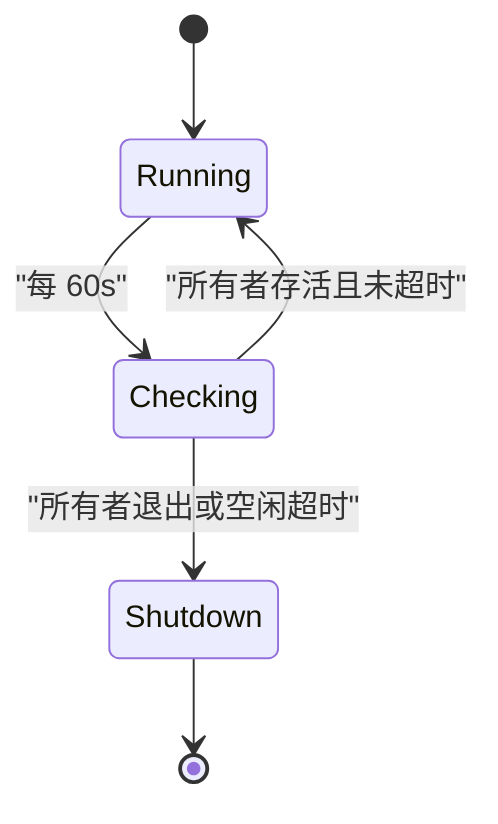
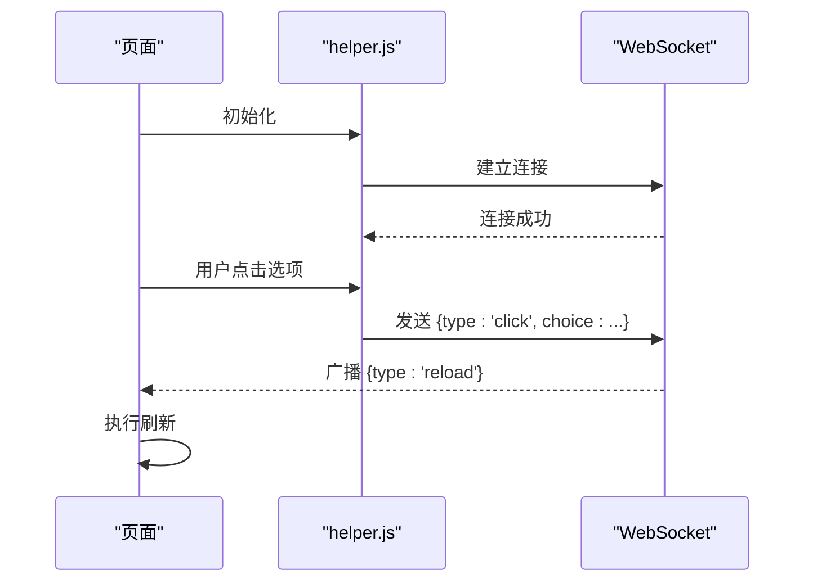
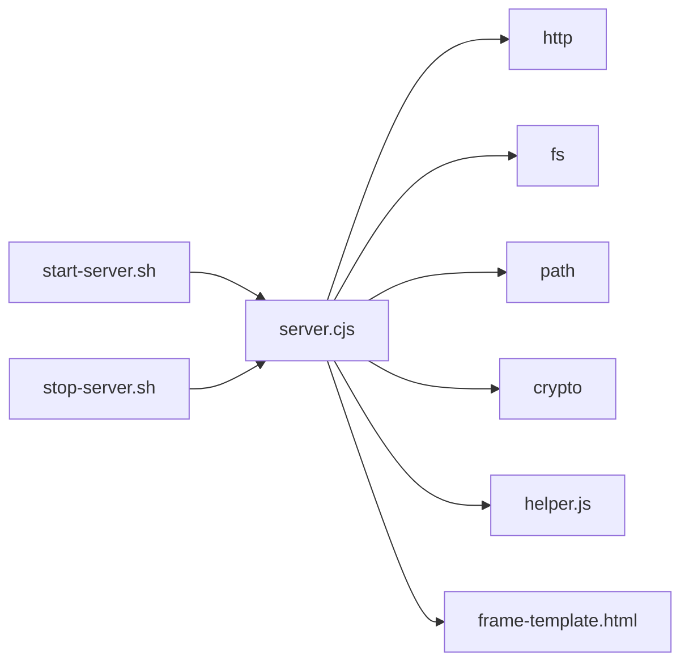

# HTTP API

<cite>
**本文引用的文件**
- [server.cjs](file://skills/brainstorming/scripts/server.cjs)
- [start-server.sh](file://skills/brainstorming/scripts/start-server.sh)
- [stop-server.sh](file://skills/brainstorming/scripts/stop-server.sh)
- [helper.js](file://skills/brainstorming/scripts/helper.js)
- [frame-template.html](file://skills/brainstorming/scripts/frame-template.html)
- [server.test.js](file://tests/brainstorm-server/server.test.js)
- [visual-companion.md](file://skills/brainstorming/visual-companion.md)
</cite>

## 目录
1. [简介](#简介)
2. [项目结构](#项目结构)
3. [核心组件](#核心组件)
4. [架构总览](#架构总览)
5. [详细组件分析](#详细组件分析)
6. [依赖关系分析](#依赖关系分析)
7. [性能考量](#性能考量)
8. [故障排查指南](#故障排查指南)
9. [结论](#结论)
10. [附录](#附录)

## 简介
本文件为 Superpowers 的 HTTP API 详细文档，聚焦于基于 Node.js http 模块的 HTTP 服务器实现。该服务器提供：
- GET /：根路径返回最新 HTML 屏幕内容，支持完整文档与片段两种模式
- GET /files/：静态资源访问，按扩展名映射 MIME 类型
- WebSocket 升级：用于浏览器与服务器之间的事件通信与自动刷新
- 文件系统监听：检测屏幕内容更新并触发客户端自动刷新
- 配置参数：端口、主机、URL 主机、会话目录等
- 活动跟踪与生命周期管理：空闲超时与所有者进程监控

## 项目结构
围绕 HTTP API 的关键文件组织如下：
- 服务器实现：skills/brainstorming/scripts/server.cjs
- 启停脚本：skills/brainstorming/scripts/start-server.sh、skills/brainstorming/scripts/stop-server.sh
- 客户端辅助：skills/brainstorming/scripts/helper.js、skills/brainstorming/scripts/frame-template.html
- 测试用例：tests/brainstorm-server/server.test.js
- 使用指南：skills/brainstorming/visual-companion.md

图表来源
- [server.cjs:129-161](file://skills/brainstorming/scripts/server.cjs#L129-L161)
- [start-server.sh:100-122](file://skills/brainstorming/scripts/start-server.sh#L100-L122)
- [stop-server.sh:19-46](file://skills/brainstorming/scripts/stop-server.sh#L19-L46)
- [helper.js:1-89](file://skills/brainstorming/scripts/helper.js#L1-L89)
- [frame-template.html:1-215](file://skills/brainstorming/scripts/frame-template.html#L1-L215)
- [server.test.js:18-52](file://tests/brainstorm-server/server.test.js#L18-L52)
- [visual-companion.md:33-48](file://skills/brainstorming/visual-companion.md#L33-L48)

章节来源
- [server.cjs:129-161](file://skills/brainstorming/scripts/server.cjs#L129-L161)
- [start-server.sh:17-122](file://skills/brainstorming/scripts/start-server.sh#L17-L122)
- [stop-server.sh:9-56](file://skills/brainstorming/scripts/stop-server.sh#L9-L56)
- [helper.js:1-89](file://skills/brainstorming/scripts/helper.js#L1-L89)
- [frame-template.html:1-215](file://skills/brainstorming/scripts/frame-template.html#L1-L215)
- [server.test.js:18-52](file://tests/brainstorm-server/server.test.js#L18-L52)
- [visual-companion.md:33-48](file://skills/brainstorming/visual-companion.md#L33-L48)

## 核心组件
- HTTP 请求处理器：处理 GET / 与 GET /files/，并注入浏览器助手脚本
- WebSocket 升级与消息处理：建立连接、解析消息、广播刷新指令
- 文件系统监听：检测 content 目录中 .html 文件变化，触发自动刷新
- 活动跟踪与生命周期：空闲超时与所有者进程存活检查
- 静态文件服务与 MIME 类型：基于扩展名选择 Content-Type

章节来源
- [server.cjs:129-161](file://skills/brainstorming/scripts/server.cjs#L129-L161)
- [server.cjs:167-222](file://skills/brainstorming/scripts/server.cjs#L167-L222)
- [server.cjs:256-298](file://skills/brainstorming/scripts/server.cjs#L256-L298)
- [server.cjs:247-254](file://skills/brainstorming/scripts/server.cjs#L247-L254)
- [server.cjs:84-88](file://skills/brainstorming/scripts/server.cjs#L84-L88)

## 架构总览
下图展示从浏览器到服务器再到文件系统的端到端流程，包括 HTTP 请求、WebSocket 事件与文件监听刷新。

图表来源
- [server.cjs:129-161](file://skills/brainstorming/scripts/server.cjs#L129-L161)
- [server.cjs:167-222](file://skills/brainstorming/scripts/server.cjs#L167-L222)
- [server.cjs:240-245](file://skills/brainstorming/scripts/server.cjs#L240-L245)
- [server.cjs:276-298](file://skills/brainstorming/scripts/server.cjs#L276-L298)
- [helper.js:6-24](file://skills/brainstorming/scripts/helper.js#L6-L24)

## 详细组件分析

### HTTP 请求处理
- GET /：返回最新 .html 文件内容；若文件是完整文档则直接返回，否则注入框架模板与助手脚本
- GET /files/{path}：安全地解析相对路径，仅允许访问 content 目录下的文件，并按扩展名设置 MIME 类型
- 其他路径：返回 404

图表来源
- [server.cjs:129-161](file://skills/brainstorming/scripts/server.cjs#L129-L161)
- [server.cjs:145-156](file://skills/brainstorming/scripts/server.cjs#L145-L156)

章节来源
- [server.cjs:129-161](file://skills/brainstorming/scripts/server.cjs#L129-L161)

### WebSocket 协议与消息处理
- RFC 6455 协议实现：握手计算、帧编解码、OPCODES 常量
- 升级处理：验证 Sec-WebSocket-Key，返回 101 Switching Protocols
- 消息处理：TEXT 消息解析为 JSON，记录用户事件，仅 choice 事件写入 state/events
- 广播：向所有连接的客户端发送 {type:'reload'} 以触发自动刷新

图表来源
- [server.cjs:11-13](file://skills/brainstorming/scripts/server.cjs#L11-L13)
- [server.cjs:167-222](file://skills/brainstorming/scripts/server.cjs#L167-L222)
- [server.cjs:224-238](file://skills/brainstorming/scripts/server.cjs#L224-L238)
- [server.cjs:240-245](file://skills/brainstorming/scripts/server.cjs#L240-L245)

章节来源
- [server.cjs:11-13](file://skills/brainstorming/scripts/server.cjs#L11-L13)
- [server.cjs:167-222](file://skills/brainstorming/scripts/server.cjs#L167-L222)
- [server.cjs:224-238](file://skills/brainstorming/scripts/server.cjs#L224-L238)
- [server.cjs:240-245](file://skills/brainstorming/scripts/server.cjs#L240-L245)

### 文件系统监听与自动刷新
- 监听 content 目录中的 .html 文件变更
- 防抖：同一文件在 100ms 内多次变更合并为一次处理
- 区分“新增屏幕”与“屏幕更新”，并清空 state/events
- 广播 {type:'reload'}，浏览器收到后自动刷新

图表来源
- [server.cjs:256-298](file://skills/brainstorming/scripts/server.cjs#L256-L298)

章节来源
- [server.cjs:256-298](file://skills/brainstorming/scripts/server.cjs#L256-L298)

### 活动跟踪与生命周期管理
- 活动跟踪：每次 HTTP 请求与 WebSocket 消息都会更新最后活动时间
- 生命周期：每 60 秒检查一次，若所有者进程不存在或空闲超过 30 分钟则优雅关闭
- 启动信息：启动时输出 server-started JSON 到 stdout 与 state/server-info 文件

图表来源
- [server.cjs:247-254](file://skills/brainstorming/scripts/server.cjs#L247-L254)
- [server.cjs:319-324](file://skills/brainstorming/scripts/server.cjs#L319-L324)
- [server.cjs:339-347](file://skills/brainstorming/scripts/server.cjs#L339-L347)

章节来源
- [server.cjs:247-254](file://skills/brainstorming/scripts/server.cjs#L247-L254)
- [server.cjs:319-324](file://skills/brainstorming/scripts/server.cjs#L319-L324)
- [server.cjs:339-347](file://skills/brainstorming/scripts/server.cjs#L339-L347)

### 客户端自动刷新与交互
- 浏览器通过 helper.js 连接 WebSocket，发送点击事件
- 服务器将 {type:'reload'} 广播给所有客户端，客户端收到后刷新页面
- 支持多选与指示条显示当前选择状态

图表来源
- [helper.js:6-24](file://skills/brainstorming/scripts/helper.js#L6-L24)
- [helper.js:26-33](file://skills/brainstorming/scripts/helper.js#L26-L33)
- [server.cjs:240-245](file://skills/brainstorming/scripts/server.cjs#L240-L245)

章节来源
- [helper.js:1-89](file://skills/brainstorming/scripts/helper.js#L1-L89)
- [server.cjs:240-245](file://skills/brainstorming/scripts/server.cjs#L240-L245)

## 依赖关系分析
- server.cjs 依赖 Node.js 内置模块：http、fs、path、crypto
- WebSocket 协议实现自包含，不依赖第三方库
- 客户端 helper.js 通过原生 WebSocket 与服务器通信
- 启停脚本通过环境变量控制服务器行为

图表来源
- [server.cjs:1-5](file://skills/brainstorming/scripts/server.cjs#L1-L5)
- [start-server.sh:100-122](file://skills/brainstorming/scripts/start-server.sh#L100-L122)
- [stop-server.sh:19-46](file://skills/brainstorming/scripts/stop-server.sh#L19-L46)

章节来源
- [server.cjs:1-5](file://skills/brainstorming/scripts/server.cjs#L1-L5)
- [start-server.sh:100-122](file://skills/brainstorming/scripts/start-server.sh#L100-L122)
- [stop-server.sh:19-46](file://skills/brainstorming/scripts/stop-server.sh#L19-L46)

## 性能考量
- 文件监听防抖：100ms 防抖减少频繁刷新带来的开销
- 最小化广播：仅在 .html 文件变更时广播刷新
- 静态文件缓存：浏览器负责缓存静态资源，服务器仅做简单 MIME 映射
- WebSocket 轻量：仅传输事件与刷新指令，避免大体积数据

## 故障排查指南
- 无法访问服务器
  - 检查启动脚本输出的 server-info 文件，确认 URL 与端口
  - 若远程访问不可达，使用 --host 0.0.0.0 与 --url-host 指定可访问的主机名
- 服务器自动退出
  - 空闲超时为 30 分钟；确保定期发送用户事件或保持活跃
  - 检查所有者进程是否仍在运行
- 浏览器无法接收刷新
  - 确认 helper.js 已被正确注入到页面
  - 检查 WebSocket 是否正常连接与断线重连逻辑
- 静态资源 404
  - 确保请求路径位于 /files/ 下，且文件存在于 content 目录
  - 检查扩展名是否在 MIME 映射表中

章节来源
- [visual-companion.md:83-93](file://skills/brainstorming/visual-companion.md#L83-L93)
- [server.cjs:247-254](file://skills/brainstorming/scripts/server.cjs#L247-L254)
- [server.cjs:319-324](file://skills/brainstorming/scripts/server.cjs#L319-L324)
- [server.cjs:145-156](file://skills/brainstorming/scripts/server.cjs#L145-L156)

## 结论
该 HTTP API 以最小依赖实现了完整的可视化协作能力：简洁的 HTTP 服务、轻量的 WebSocket 事件通道、智能的文件监听与自动刷新，以及完善的生命周期管理。配合启动/停止脚本与使用指南，可在多种平台环境中稳定运行。

## 附录

### 服务器配置参数
- 环境变量
  - BRAINSTORM_PORT：服务器端口，默认随机高区端口
  - BRAINSTORM_HOST：绑定地址，默认 127.0.0.1
  - BRAINSTORM_URL_HOST：URL 中显示的主机名，默认根据 HOST 推断
  - BRAINSTORM_DIR：会话目录，默认 /tmp/brainstorm
  - BRAINSTORM_OWNER_PID：所有者进程 PID，用于生命周期监控
- 目录结构
  - CONTENT_DIR：content 子目录，存放待展示的 HTML 屏幕
  - STATE_DIR：state 子目录，存放 server-info、server-stopped、events 等状态文件

章节来源
- [server.cjs:76-82](file://skills/brainstorming/scripts/server.cjs#L76-L82)
- [server.cjs:80-81](file://skills/brainstorming/scripts/server.cjs#L80-L81)
- [start-server.sh:77-84](file://skills/brainstorming/scripts/start-server.sh#L77-L84)

### MIME 类型映射
- .html：text/html
- .css：text/css
- .js：application/javascript
- .json：application/json
- .png：image/png
- .jpg/.jpeg：image/jpeg
- .gif：image/gif
- .svg：image/svg+xml
- 其他：application/octet-stream

章节来源
- [server.cjs:84-88](file://skills/brainstorming/scripts/server.cjs#L84-L88)

### HTTP 请求示例与响应格式
- GET /
  - 成功：200 OK，Content-Type: text/html; charset=utf-8
  - 无屏幕：返回等待页
  - 有屏幕：返回最新 .html 内容，注入 helper.js
- GET /files/{path}
  - 成功：200 OK，Content-Type: 根据扩展名
  - 失败：404 Not Found
- WebSocket
  - 握手：101 Switching Protocols
  - 消息：TEXT(JSON)，如 {type:'click', choice:'a', text:'...'}
  - 广播：{type:'reload'} 触发页面刷新

章节来源
- [server.cjs:129-161](file://skills/brainstorming/scripts/server.cjs#L129-L161)
- [server.cjs:167-222](file://skills/brainstorming/scripts/server.cjs#L167-L222)
- [server.cjs:240-245](file://skills/brainstorming/scripts/server.cjs#L240-L245)
- [server.test.js:121-185](file://tests/brainstorm-server/server.test.js#L121-L185)

### 生命周期与状态文件
- 启动：输出 server-started JSON 至 stdout 与 state/server-info
- 停止：写入 state/server-stopped，清理监听与定时器
- 状态文件
  - server-info：服务器启动信息
  - server-stopped：服务器停止原因与时间戳
  - events：用户选择事件流（JSON Lines）

章节来源
- [server.cjs:301-312](file://skills/brainstorming/scripts/server.cjs#L301-L312)
- [server.cjs:340-347](file://skills/brainstorming/scripts/server.cjs#L340-L347)
- [server.cjs:234-237](file://skills/brainstorming/scripts/server.cjs#L234-L237)
- [visual-companion.md:246-258](file://skills/brainstorming/visual-companion.md#L246-L258)