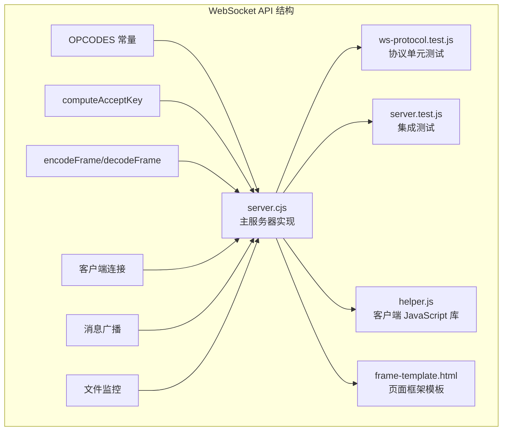
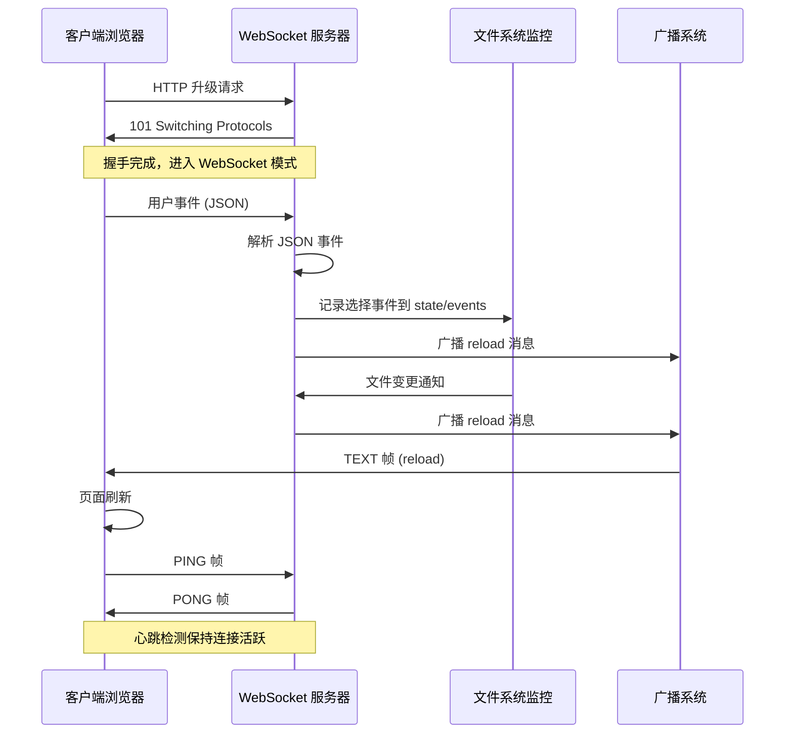
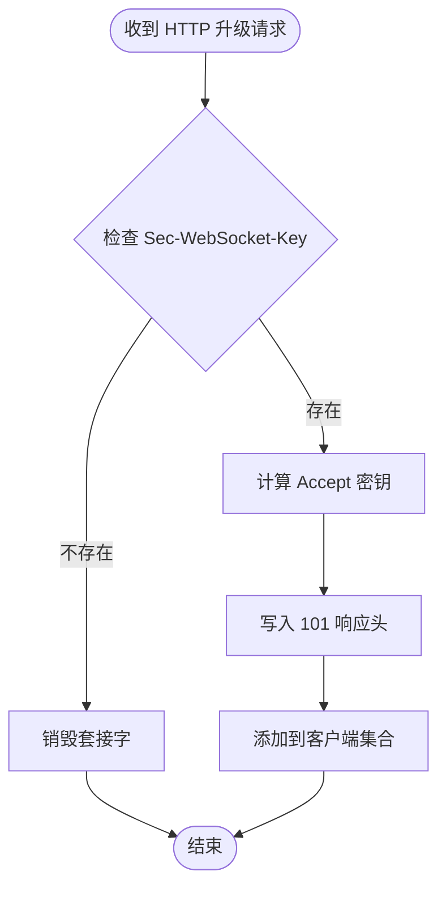
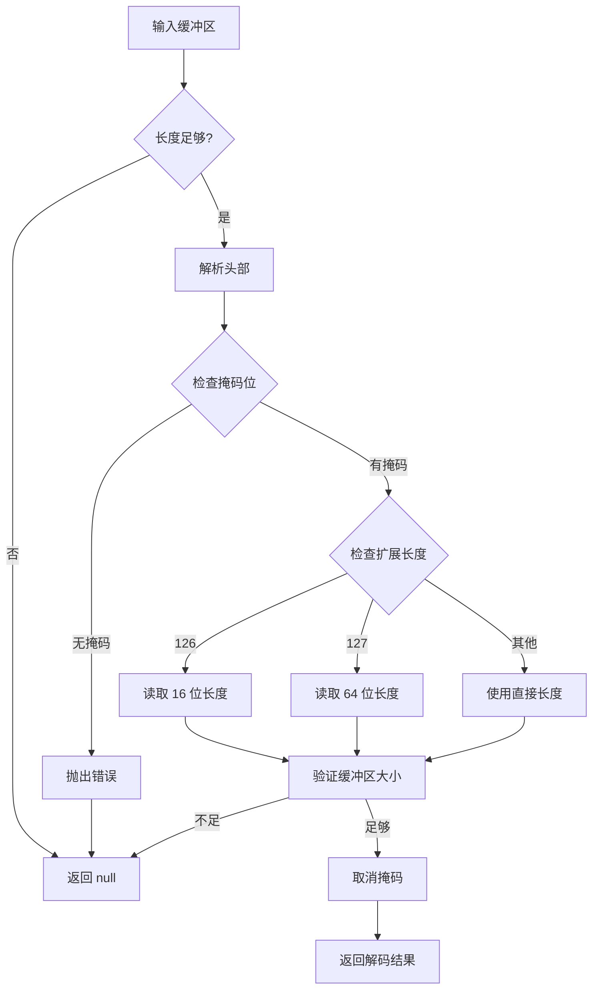
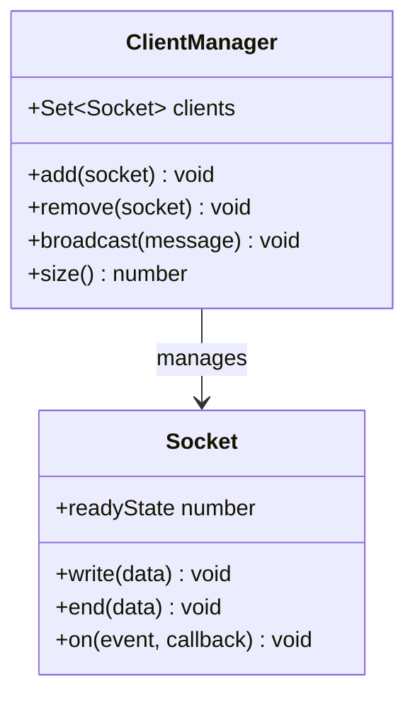
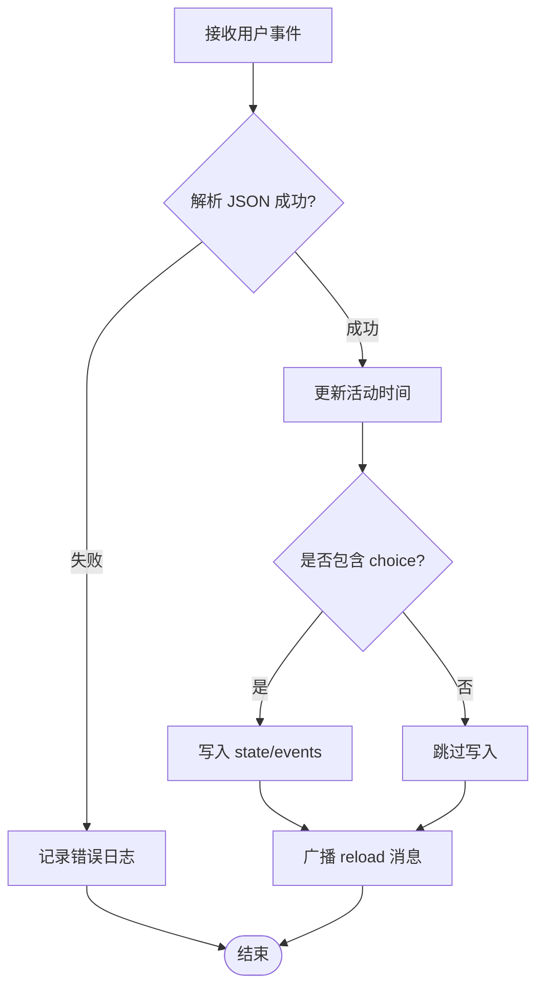
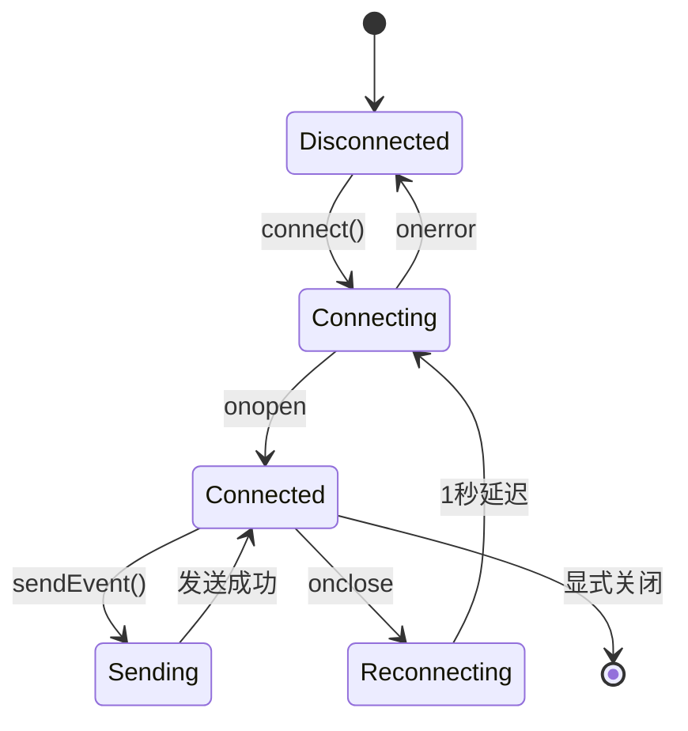
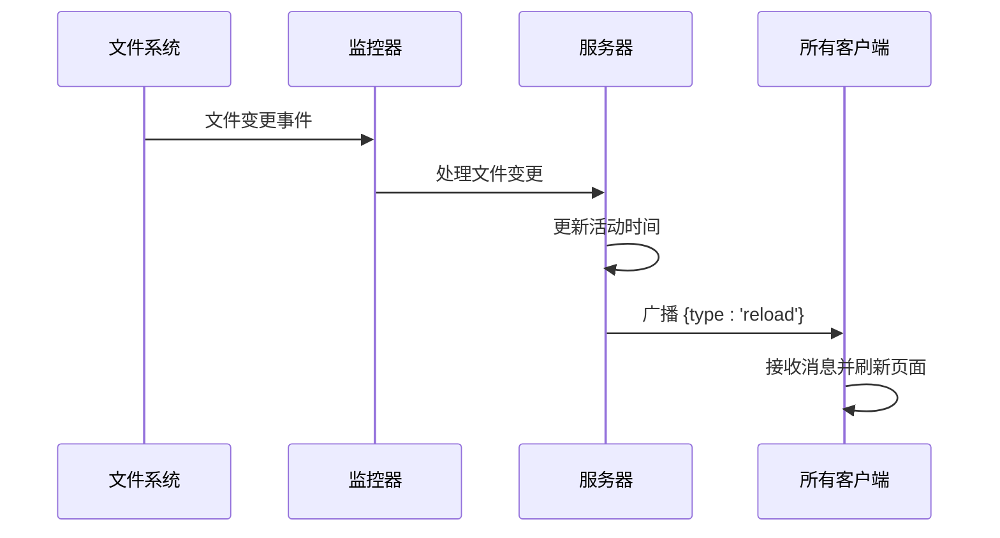
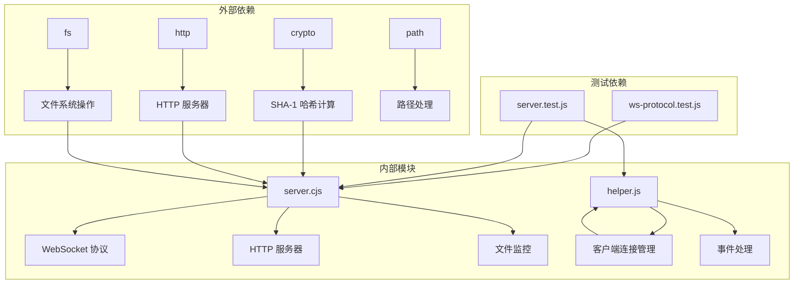

# WebSocket API

<cite>
**本文档引用的文件**
- [server.cjs](file://skills/brainstorming/scripts/server.cjs)
- [helper.js](file://skills/brainstorming/scripts/helper.js)
- [ws-protocol.test.js](file://tests/brainstorm-server/ws-protocol.test.js)
- [server.test.js](file://tests/brainstorm-server/server.test.js)
- [frame-template.html](file://skills/brainstorming/scripts/frame-template.html)
</cite>

## 目录
1. [简介](#简介)
2. [项目结构](#项目结构)
3. [核心组件](#核心组件)
4. [架构概览](#架构概览)
5. [详细组件分析](#详细组件分析)
6. [依赖关系分析](#依赖关系分析)
7. [性能考虑](#性能考虑)
8. [故障排除指南](#故障排除指南)
9. [结论](#结论)
10. [附录](#附录)

## 简介

Superpowers 的 WebSocket API 是一个基于 RFC 6455 标准实现的实时通信协议，主要用于支持创意头脑风暴技能中的客户端-服务器通信。该实现提供了完整的 WebSocket 握手过程、帧编码解码、消息广播机制以及心跳检测功能。

该 API 支持多种事件类型，包括屏幕添加、屏幕更新和用户事件，并通过 JSON 格式的消息进行数据交换。客户端通过 JavaScript 客户端库实现自动重连、事件队列管理和界面状态同步。

## 项目结构

Superpowers 的 WebSocket API 实现位于 brainstorming 技能的脚本目录中，主要包含以下关键文件：



**图表来源**
- [server.cjs:1-355](file://skills/brainstorming/scripts/server.cjs#L1-L355)
- [helper.js:1-89](file://skills/brainstorming/scripts/helper.js#L1-L89)

**章节来源**
- [server.cjs:1-355](file://skills/brainstorming/scripts/server.cjs#L1-L355)
- [helper.js:1-89](file://skills/brainstorming/scripts/helper.js#L1-L89)

## 核心组件

### WebSocket 协议实现

系统实现了完整的 RFC 6455 WebSocket 协议，包括：

- **握手过程**: 使用标准的 HTTP 升级请求进行协议切换
- **帧编码/解码**: 支持 8 位、16 位和 64 位扩展长度字段
- **OPCODES 支持**: TEXT (0x01)、CLOSE (0x08)、PING (0x09)、PONG (0x0A)
- **掩码处理**: 客户端帧必须使用掩码，服务器帧不使用掩码

### 连接管理

系统维护了一个客户端集合，支持多客户端连接和广播消息：

- **客户端集合**: 使用 Set 数据结构跟踪所有活跃连接
- **连接生命周期**: 自动清理断开的连接
- **广播机制**: 向所有已连接客户端发送消息

### 消息格式

消息采用 JSON 格式进行序列化和反序列化：

- **用户事件**: 包含类型、选择、文本等字段
- **系统消息**: 屏幕状态变更通知
- **控制消息**: 心跳检测和连接管理

**章节来源**
- [server.cjs:8-13](file://skills/brainstorming/scripts/server.cjs#L8-L13)
- [server.cjs:15-37](file://skills/brainstorming/scripts/server.cjs#L15-L37)
- [server.cjs:39-72](file://skills/brainstorming/scripts/server.cjs#L39-L72)

## 架构概览



**图表来源**
- [server.cjs:167-222](file://skills/brainstorming/scripts/server.cjs#L167-L222)
- [server.cjs:240-245](file://skills/brainstorming/scripts/server.cjs#L240-L245)
- [server.cjs:276-298](file://skills/brainstorming/scripts/server.cjs#L276-L298)

## 详细组件分析

### WebSocket 协议实现

#### 握手过程

WebSocket 握手遵循 RFC 6455 标准，使用固定的魔法字符串进行安全密钥计算：



**图表来源**
- [server.cjs:167-177](file://skills/brainstorming/scripts/server.cjs#L167-L177)

#### 帧编码算法

系统支持三种长度类型的帧编码：

- **小帧 (< 126 字节)**: 使用 2 字节头部
- **中等帧 (126-65535 字节)**: 使用 16 位扩展长度
- **大帧 (> 65535 字节)**: 使用 64 位扩展长度

#### 帧解码算法

解码过程验证客户端帧的完整性并处理不同长度类型的帧：



**图表来源**
- [server.cjs:39-72](file://skills/brainstorming/scripts/server.cjs#L39-L72)

**章节来源**
- [server.cjs:11-13](file://skills/brainstorming/scripts/server.cjs#L11-L13)
- [server.cjs:15-37](file://skills/brainstorming/scripts/server.cjs#L15-L37)
- [server.cjs:39-72](file://skills/brainstorming/scripts/server.cjs#L39-L72)

### 连接管理

#### 客户端集合管理

系统使用 Set 数据结构维护活跃连接：



**图表来源**
- [server.cjs:165](file://skills/brainstorming/scripts/server.cjs#L165)
- [server.cjs:240-245](file://skills/brainstorming/scripts/server.cjs#L240-L245)

#### 生命周期监控

系统实现 30 分钟空闲超时机制：

- **活动跟踪**: 每次收到消息或文件变更时更新最后活动时间
- **定期检查**: 每 60 秒检查一次进程存活状态和空闲时间
- **优雅关闭**: 超时后清理资源并关闭服务器

**章节来源**
- [server.cjs:249-254](file://skills/brainstorming/scripts/server.cjs#L249-L254)
- [server.cjs:320-324](file://skills/brainstorming/scripts/server.cjs#L320-L324)

### 消息处理系统

#### 事件类型定义

系统支持以下事件类型：

| 事件类型 | 用途 | JSON 字段 |
|---------|------|-----------|
| screen-added | 新屏幕创建 | `{ type: 'screen-added', file: string }` |
| screen-updated | 屏幕内容更新 | `{ type: 'screen-updated', file: string }` |
| user-event | 用户交互事件 | `{ type: string, choice?: string, text?: string, ... }` |

#### 用户事件处理

用户事件通过以下流程处理：



**图表来源**
- [server.cjs:224-238](file://skills/brainstorming/scripts/server.cjs#L224-L238)

**章节来源**
- [server.cjs:224-238](file://skills/brainstorming/scripts/server.cjs#L224-L238)

### 客户端 JavaScript 库

#### 连接管理

客户端库实现了智能连接管理：



**图表来源**
- [helper.js:6-24](file://skills/brainstorming/scripts/helper.js#L6-L24)

#### 事件队列机制

客户端实现事件队列确保在网络不稳定时的数据完整性：

- **队列存储**: 断线时将事件存储在内存队列中
- **自动重发**: 连接恢复后按顺序发送队列中的事件
- **即时发送**: 连接正常时立即发送事件

**章节来源**
- [helper.js:26-33](file://skills/brainstorming/scripts/helper.js#L26-L33)
- [helper.js:6-24](file://skills/brainstorming/scripts/helper.js#L6-L24)

### 广播机制

#### 文件变更触发

系统通过文件监控触发广播消息：



**图表来源**
- [server.cjs:276-298](file://skills/brainstorming/scripts/server.cjs#L276-L298)

**章节来源**
- [server.cjs:240-245](file://skills/brainstorming/scripts/server.cjs#L240-L245)
- [server.cjs:276-298](file://skills/brainstorming/scripts/server.cjs#L276-L298)

## 依赖关系分析



**图表来源**
- [server.cjs:1-5](file://skills/brainstorming/scripts/server.cjs#L1-L5)
- [helper.js:1](file://skills/brainstorming/scripts/helper.js#L1)

**章节来源**
- [server.cjs:1-5](file://skills/brainstorming/scripts/server.cjs#L1-L5)
- [helper.js:1](file://skills/brainstorming/scripts/helper.js#L1)

## 性能考虑

### 内存管理

- **缓冲区管理**: 使用 Buffer.concat() 合并数据块，避免内存碎片
- **客户端集合**: Set 数据结构提供 O(1) 查找和删除操作
- **事件队列**: 限制队列大小防止内存泄漏

### 网络优化

- **帧大小优化**: 根据数据大小选择最优的帧编码方式
- **批量广播**: 单次编码后向所有客户端发送相同帧
- **连接复用**: 避免频繁创建和销毁连接

### 文件监控

- **防抖机制**: 100ms 防抖减少频繁的文件变更通知
- **文件类型过滤**: 仅监控 .html 文件，忽略其他文件类型
- **增量更新**: 通过文件名集合跟踪已知文件，区分新增和更新

## 故障排除指南

### 常见问题诊断

#### 握手失败

**症状**: 客户端无法连接到服务器
**原因**: 缺少 Sec-WebSocket-Key 或密钥格式错误
**解决方案**: 
- 确保客户端发送正确的握手请求头
- 验证服务器端的密钥计算逻辑

#### 帧解码错误

**症状**: 服务器拒绝连接或抛出异常
**原因**: 客户端帧未正确掩码或格式错误
**解决方案**:
- 确保客户端实现正确的帧掩码算法
- 验证帧长度字段的编码方式

#### 连接超时

**症状**: 连接在空闲一段时间后断开
**原因**: 30 分钟空闲超时或父进程退出
**解决方案**:
- 定期发送心跳消息保持连接活跃
- 检查父进程 PID 设置

**章节来源**
- [server.cjs:48](file://skills/brainstorming/scripts/server.cjs#L48)
- [server.cjs:319-324](file://skills/brainstorming/scripts/server.cjs#L319-L324)

### 错误处理机制

系统实现了多层次的错误处理：

- **协议层**: 捕获帧解码异常并优雅关闭连接
- **网络层**: 监听套接字错误事件并清理资源
- **应用层**: 捕获 JSON 解析错误并记录日志

**章节来源**
- [server.cjs:186-192](file://skills/brainstorming/scripts/server.cjs#L186-L192)
- [server.cjs:227-231](file://skills/brainstorming/scripts/server.cjs#L227-L231)

## 结论

Superpowers 的 WebSocket API 提供了一个完整、高效的实时通信解决方案，具有以下特点：

- **完全符合 RFC 6455 标准**: 实现了标准的握手过程和帧格式
- **健壮的错误处理**: 多层次的异常捕获和优雅降级
- **高效的广播机制**: 支持多客户端实时消息分发
- **智能连接管理**: 自动重连、事件队列和生命周期监控
- **完善的测试覆盖**: 单元测试和集成测试确保代码质量

该实现为创意头脑风暴技能提供了可靠的实时通信基础，支持复杂的用户交互场景和动态内容更新需求。

## 附录

### 客户端实现示例

#### JavaScript 客户端使用模式

```javascript
// 基本连接
const ws = new WebSocket('ws://localhost:port');

// 发送用户事件
window.brainstorm.send({
    type: 'click',
    choice: 'option_a',
    text: '选项 A'
});

// 监听服务器消息
ws.onmessage = function(event) {
    const message = JSON.parse(event.data);
    if (message.type === 'reload') {
        location.reload();
    }
};
```

#### 心跳检测实现

客户端实现自动重连机制：

```javascript
ws.onclose = function() {
    // 1 秒后重试连接
    setTimeout(connect, 1000);
};
```

**章节来源**
- [helper.js:6-24](file://skills/brainstorming/scripts/helper.js#L6-L24)
- [helper.js:26-33](file://skills/brainstorming/scripts/helper.js#L26-L33)

### 测试用例参考

#### 单元测试覆盖范围

- **握手测试**: 验证 Accept 密钥计算的正确性
- **帧编码测试**: 覆盖小、中、大三种帧类型的编码
- **帧解码测试**: 验证边界条件和错误处理
- **JSON 转换测试**: 确保消息格式的正确性

#### 集成测试场景

- **服务器启动**: 验证服务器启动和配置
- **HTTP 服务**: 测试静态文件服务和页面注入
- **WebSocket 通信**: 验证双向通信和广播机制
- **文件监控**: 测试文件变更触发的消息分发

**章节来源**
- [ws-protocol.test.js:1-393](file://tests/brainstorm-server/ws-protocol.test.js#L1-L393)
- [server.test.js:1-428](file://tests/brainstorm-server/server.test.js#L1-L428)