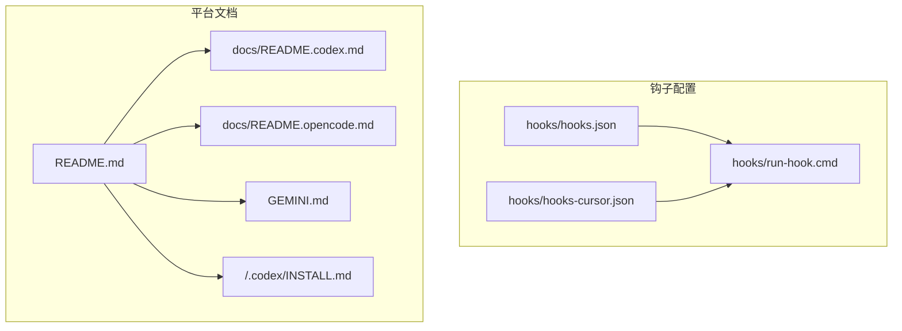
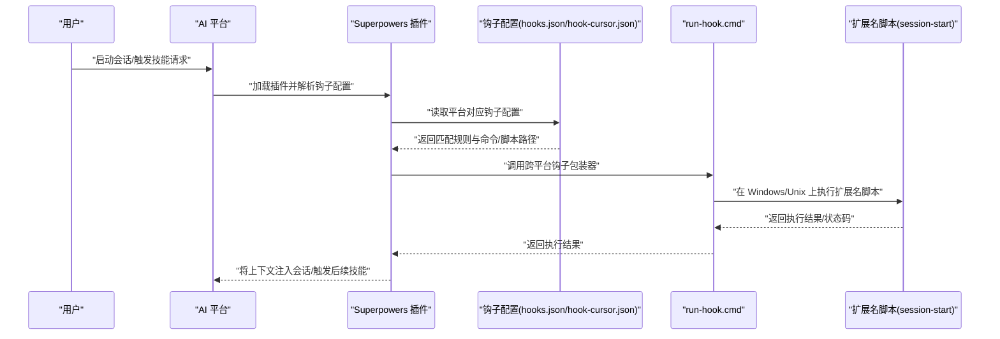
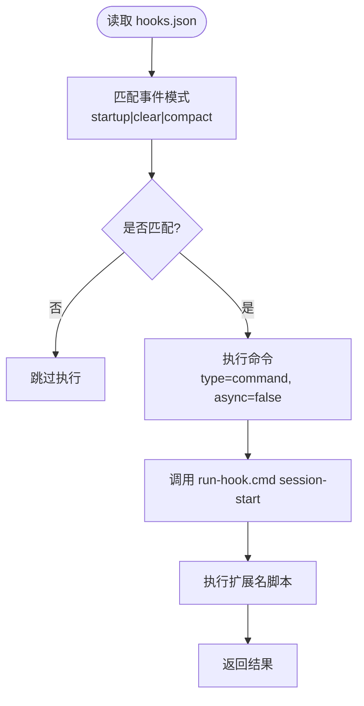
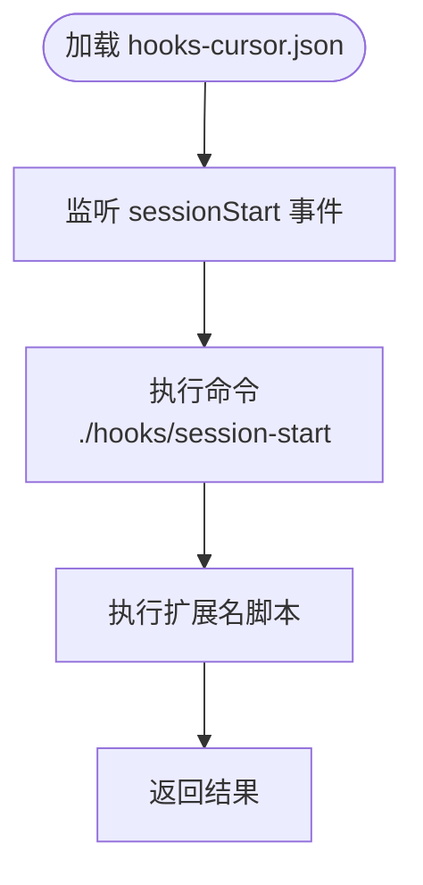
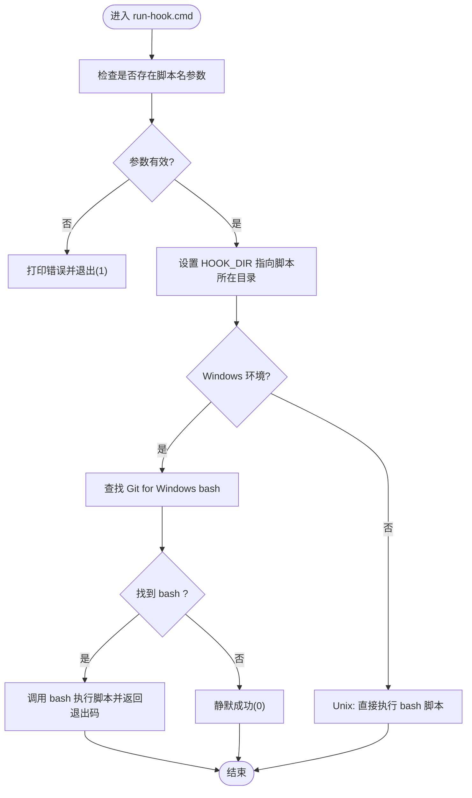
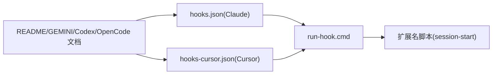

# 平台钩子 API

<cite>
**本文引用的文件**
- [hooks.json](file://hooks/hooks.json)
- [hooks-cursor.json](file://hooks/hooks-cursor.json)
- [run-hook.cmd](file://hooks/run-hook.cmd)
- [README.md](file://README.md)
- [GEMINI.md](file://GEMINI.md)
- [.codex/INSTALL.md](file://.codex/INSTALL.md)
- [docs/README.codex.md](file://docs/README.codex.md)
- [docs/README.opencode.md](file://docs/README.opencode.md)
</cite>

## 目录
1. [简介](#简介)
2. [项目结构](#项目结构)
3. [核心组件](#核心组件)
4. [架构总览](#架构总览)
5. [详细组件分析](#详细组件分析)
6. [依赖关系分析](#依赖关系分析)
7. [性能考量](#性能考量)
8. [故障排查指南](#故障排查指南)
9. [结论](#结论)
10. [附录](#附录)

## 简介
本文件系统性梳理 Superpowers 的“平台钩子 API”，聚焦以下目标：
- 记录 hooks.json 配置文件结构与平台特定钩子配置
- 解释事件触发机制与插件集成方式
- 对比不同 AI 平台（Claude、Cursor、Codex、OpenCode、Gemini）的钩子实现差异、事件类型与数据格式
- 说明钩子注册流程、回调执行、错误传播与调试机制
- 提供各平台的配置示例与集成指引

Superpowers 通过“钩子”在平台会话生命周期的关键节点注入上下文或执行命令，从而驱动技能系统的自动触发与工作流编排。

## 项目结构
与钩子 API 直接相关的文件集中在 hooks 目录，并辅以平台安装与使用文档：
- hooks/hooks.json：Claude Code 插件的钩子配置（当前包含 SessionStart）
- hooks/hooks-cursor.json：Cursor 插件的钩子配置（当前包含 sessionStart）
- hooks/run-hook.cmd：跨平台钩子脚本包装器（Windows/cmd + Unix/bash）
- README.md：平台安装与使用总览
- GEMINI.md：Gemini 扩展集成入口
- docs/README.codex.md、docs/README.opencode.md：Codex/OpenCode 平台集成文档
- .codex/INSTALL.md：Codex 安装说明

图表来源
- [hooks.json:1-17](file://hooks/hooks.json#L1-L17)
- [hooks-cursor.json:1-11](file://hooks/hooks-cursor.json#L1-L11)
- [run-hook.cmd:1-47](file://hooks/run-hook.cmd#L1-L47)
- [README.md:27-106](file://README.md#L27-L106)
- [GEMINI.md:1-3](file://GEMINI.md#L1-L3)
- [docs/README.codex.md](file://docs/README.codex.md)
- [docs/README.opencode.md](file://docs/README.opencode.md)
- [.codex/INSTALL.md](file://.codex/INSTALL.md)

章节来源
- [README.md:27-106](file://README.md#L27-L106)

## 核心组件
- 钩子配置文件
  - hooks/hooks.json：定义 Claude Code 插件的钩子映射，当前包含 SessionStart 事件，匹配模式与命令执行策略在此配置。
  - hooks/hooks-cursor.json：定义 Cursor 插件的钩子映射，当前包含 sessionStart 事件，指向本地脚本路径。
- 跨平台钩子执行器
  - hooks/run-hook.cmd：统一的钩子脚本包装器，负责在 Windows（cmd + Git for Windows bash）与 Unix（bash）环境下调用同名扩展名脚本，确保跨平台兼容。
- 平台集成文档
  - README.md：提供各平台安装与验证步骤，说明如何在不同平台启用 Superpowers。
  - GEMINI.md：指向 Gemini 扩展工具参考与使用说明。
  - docs/README.codex.md、docs/README.opencode.md：分别面向 Codex 与 OpenCode 的安装与使用说明。
  - .codex/INSTALL.md：Codex 的安装指引。

章节来源
- [hooks.json:1-17](file://hooks/hooks.json#L1-L17)
- [hooks-cursor.json:1-11](file://hooks/hooks-cursor.json#L1-L11)
- [run-hook.cmd:1-47](file://hooks/run-hook.cmd#L1-L47)
- [README.md:27-106](file://README.md#L27-L106)
- [GEMINI.md:1-3](file://GEMINI.md#L1-L3)
- [docs/README.codex.md](file://docs/README.codex.md)
- [docs/README.opencode.md](file://docs/README.opencode.md)
- [.codex/INSTALL.md](file://.codex/INSTALL.md)

## 架构总览
下图展示钩子从配置到执行的整体流程，以及与平台的集成关系：

图表来源
- [hooks.json:1-17](file://hooks/hooks.json#L1-L17)
- [hooks-cursor.json:1-11](file://hooks/hooks-cursor.json#L1-L11)
- [run-hook.cmd:1-47](file://hooks/run-hook.cmd#L1-L47)

## 详细组件分析

### 组件一：Claude Code 钩子配置（hooks.json）
- 事件类型：SessionStart
- 匹配规则：字符串模式 startup|clear|compact
- 执行策略：type=command，同步执行（async=false），通过 run-hook.cmd 传递参数 session-start
- 数据格式：配置为 JSON 对象，包含 hooks 数组；每项包含 matcher、hooks 列表，列表内含 type/command/async 字段
- 触发时机：当平台检测到会话开始且匹配指定模式时，执行对应命令

图表来源
- [hooks.json:1-17](file://hooks/hooks.json#L1-L17)
- [run-hook.cmd:1-47](file://hooks/run-hook.cmd#L1-L47)

章节来源
- [hooks.json:1-17](file://hooks/hooks.json#L1-L17)

### 组件二：Cursor 钩子配置（hooks-cursor.json）
- 事件类型：sessionStart
- 执行策略：直接指向本地脚本 ./hooks/session-start
- 数据格式：包含版本号、hooks 映射，每个事件对应命令数组
- 触发时机：Cursor 插件加载后，在会话开始阶段执行

图表来源
- [hooks-cursor.json:1-11](file://hooks/hooks-cursor.json#L1-L11)

章节来源
- [hooks-cursor.json:1-11](file://hooks/hooks-cursor.json#L1-L11)

### 组件三：跨平台钩子执行器（run-hook.cmd）
- 功能：统一 Windows（cmd + Git for Windows bash）与 Unix（bash）环境下的钩子脚本执行
- 行为：
  - Windows：优先查找标准路径下的 bash（Git for Windows），若存在则调用；否则回退静默成功（插件仍可用）
  - Unix：直接执行脚本
- 参数：第一个参数为脚本名称（不含扩展名），其余参数透传
- 返回码：Windows 下将 bash 的退出码传递给 cmd；Unix 下直接由 bash 返回

图表来源
- [run-hook.cmd:1-47](file://hooks/run-hook.cmd#L1-L47)

章节来源
- [run-hook.cmd:1-47](file://hooks/run-hook.cmd#L1-L47)

### 组件四：平台集成与事件映射
- Claude Code
  - 通过 hooks.json 定义 SessionStart 钩子，匹配模式与命令执行策略见上文
  - README.md 提供安装与验证步骤
- Cursor
  - 通过 hooks-cursor.json 定义 sessionStart 钩子，指向本地脚本
  - README.md 提供安装与验证步骤
- Codex
  - README.md 指向 docs/README.codex.md 获取安装与使用说明
  - .codex/INSTALL.md 提供安装指引
- OpenCode
  - README.md 指向 docs/README.opencode.md 获取安装与使用说明
- Gemini
  - GEMINI.md 指向使用参考与工具说明

章节来源
- [README.md:27-106](file://README.md#L27-L106)
- [GEMINI.md:1-3](file://GEMINI.md#L1-L3)
- [docs/README.codex.md](file://docs/README.codex.md)
- [docs/README.opencode.md](file://docs/README.opencode.md)
- [.codex/INSTALL.md](file://.codex/INSTALL.md)

## 依赖关系分析
- 配置到执行的依赖
  - hooks.json 与 hooks-cursor.json 分别决定事件类型与执行命令/脚本路径
  - run-hook.cmd 作为跨平台执行器，被插件调用以执行扩展名脚本
- 平台到配置的依赖
  - 不同平台使用各自的钩子配置文件（Claude 使用 hooks.json，Cursor 使用 hooks-cursor.json）
  - README/GEMINI 文档指导平台安装与验证，间接影响钩子是否生效

图表来源
- [hooks.json:1-17](file://hooks/hooks.json#L1-L17)
- [hooks-cursor.json:1-11](file://hooks/hooks-cursor.json#L1-L11)
- [run-hook.cmd:1-47](file://hooks/run-hook.cmd#L1-L47)
- [README.md:27-106](file://README.md#L27-L106)
- [GEMINI.md:1-3](file://GEMINI.md#L1-L3)
- [docs/README.codex.md](file://docs/README.codex.md)
- [docs/README.opencode.md](file://docs/README.opencode.md)

章节来源
- [hooks.json:1-17](file://hooks/hooks.json#L1-L17)
- [hooks-cursor.json:1-11](file://hooks/hooks-cursor.json#L1-L11)
- [run-hook.cmd:1-47](file://hooks/run-hook.cmd#L1-L47)
- [README.md:27-106](file://README.md#L27-L106)
- [GEMINI.md:1-3](file://GEMINI.md#L1-L3)
- [docs/README.codex.md](file://docs/README.codex.md)
- [docs/README.opencode.md](file://docs/README.opencode.md)

## 性能考量
- 同步执行策略：Claude 的 SessionStart 配置中 async=false，意味着钩子执行会阻塞插件响应，需确保钩子脚本轻量快速
- 跨平台开销：run-hook.cmd 在 Windows 上需要定位 bash，若未安装 bash 将静默成功，避免阻塞但可能跳过上下文注入
- 命令解析与参数透传：确保命令行参数正确传递，避免额外解析成本

## 故障排查指南
- 问题：Windows 环境下钩子未执行
  - 排查：确认 Git for Windows 已安装且 bash 可用；检查 run-hook.cmd 是否被正确调用
  - 参考：run-hook.cmd 中的 bash 查找逻辑与静默返回策略
- 问题：脚本未按预期执行
  - 排查：确认脚本扩展名与 run-hook.cmd 的约定一致（扩展名脚本，不带 .sh 后缀）
  - 参考：run-hook.cmd 注释说明
- 问题：平台未触发钩子
  - 排查：确认平台已正确安装 Superpowers 插件；核对 hooks.json/hook-cursor.json 的事件类型与匹配规则
  - 参考：README.md 的安装与验证步骤
- 问题：Gemini 平台集成异常
  - 排查：根据 GEMINI.md 指向的参考文档进行验证
  - 参考：GEMINI.md

章节来源
- [run-hook.cmd:1-47](file://hooks/run-hook.cmd#L1-L47)
- [hooks.json:1-17](file://hooks/hooks.json#L1-L17)
- [hooks-cursor.json:1-11](file://hooks/hooks-cursor.json#L1-L11)
- [README.md:27-106](file://README.md#L27-L106)
- [GEMINI.md:1-3](file://GEMINI.md#L1-L3)

## 结论
Superpowers 的钩子 API 通过简洁的 JSON 配置与跨平台执行器，实现了在多平台会话生命周期中的自动化注入与触发。Claude 与 Cursor 的钩子配置分别针对其平台事件模型进行适配，配合 run-hook.cmd 的跨平台执行能力，保证了在不同开发环境中的稳定性与可维护性。建议在新增钩子时遵循同步/异步策略权衡、脚本命名规范与平台事件映射一致性，以获得最佳的集成体验。

## 附录

### 平台钩子配置与事件对照
- Claude Code
  - 事件：SessionStart
  - 配置文件：hooks.json
  - 执行策略：同步命令执行
- Cursor
  - 事件：sessionStart
  - 配置文件：hooks-cursor.json
  - 执行策略：本地脚本命令
- Codex/OpenCode
  - 安装与使用：参阅 docs/README.codex.md、docs/README.opencode.md 与 .codex/INSTALL.md
- Gemini
  - 集成：参阅 GEMINI.md

章节来源
- [hooks.json:1-17](file://hooks/hooks.json#L1-L17)
- [hooks-cursor.json:1-11](file://hooks/hooks-cursor.json#L1-L11)
- [README.md:27-106](file://README.md#L27-L106)
- [GEMINI.md:1-3](file://GEMINI.md#L1-L3)
- [docs/README.codex.md](file://docs/README.codex.md)
- [docs/README.opencode.md](file://docs/README.opencode.md)
- [.codex/INSTALL.md](file://.codex/INSTALL.md)