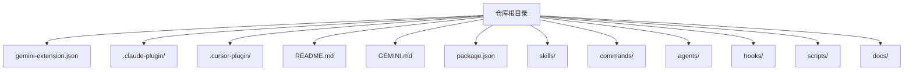
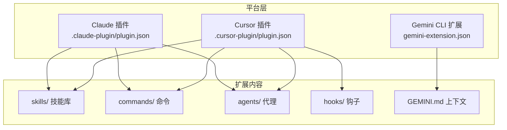
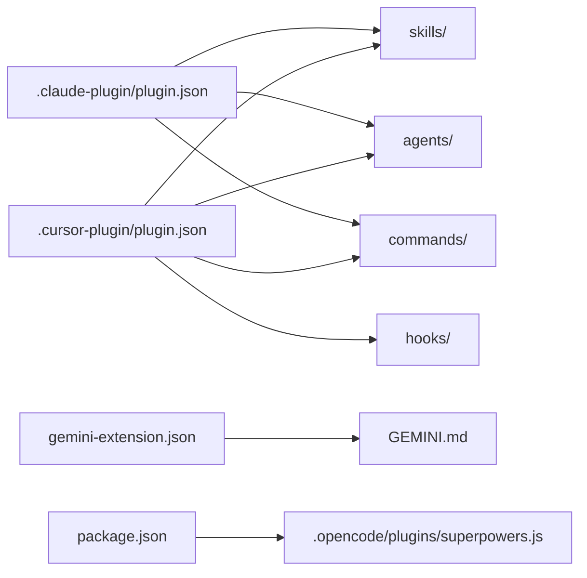

# 扩展 API

<cite>
**本文引用的文件**
- [gemini-extension.json](file://gemini-extension.json)
- [.claude-plugin/plugin.json](file://.claude-plugin/plugin.json)
- [.claude-plugin/marketplace.json](file://.claude-plugin/marketplace.json)
- [.cursor-plugin/plugin.json](file://.cursor-plugin/plugin.json)
- [GEMINI.md](file://GEMINI.md)
- [README.md](file://README.md)
- [hooks/hooks-cursor.json](file://hooks/hooks-cursor.json)
- [skills/写作技能/SKILL.md](file://skills/writing-skills/SKILL.md)
- [commands/头脑风暴.md](file://commands/brainstorm.md)
- [agents/代码审查员.md](file://agents/code-reviewer.md)
- [package.json](file://package.json)
- [docs/测试.md](file://docs/testing.md)
- [scripts/bump-version.sh](file://scripts/bump-version.sh)
</cite>

## 目录
1. [简介](#简介)
2. [项目结构](#项目结构)
3. [核心组件](#核心组件)
4. [架构总览](#架构总览)
5. [详细组件分析](#详细组件分析)
6. [依赖关系分析](#依赖关系分析)
7. [性能考量](#性能考量)
8. [故障排除指南](#故障排除指南)
9. [结论](#结论)
10. [附录](#附录)

## 简介
本文件系统性梳理 Superpowers 的扩展 API，覆盖多平台扩展配置文件格式与字段定义（gemini-extension.json、.claude-plugin/plugin.json、.cursor-plugin/plugin.json），说明扩展元数据、权限与平台特定配置、版本管理策略，并给出安装流程、配置验证、热重载机制与故障排除建议。同时提供扩展开发指南与最佳实践，帮助开发者在不同平台上正确发布与维护 Superpowers 扩展。

## 项目结构
Superpowers 在仓库根目录提供面向不同平台的扩展配置文件，分别用于注册扩展元数据、平台市场清单以及上下文引导文件。此外，仓库包含技能、命令、代理等可被扩展加载的内容目录，以及版本管理脚本与测试文档。

图表来源
- [gemini-extension.json](file://gemini-extension.json)
- [.claude-plugin/plugin.json](file://.claude-plugin/plugin.json)
- [.cursor-plugin/plugin.json](file://.cursor-plugin/plugin.json)
- [README.md](file://README.md)
- [GEMINI.md](file://GEMINI.md)
- [package.json](file://package.json)

章节来源
- [README.md](file://README.md)
- [gemini-extension.json](file://gemini-extension.json)
- [.claude-plugin/plugin.json](file://.claude-plugin/plugin.json)
- [.cursor-plugin/plugin.json](file://.cursor-plugin/plugin.json)

## 核心组件
- 平台扩展配置
  - Gemini CLI 扩展：gemini-extension.json，用于注册扩展名称、描述、版本与上下文文件。
  - Claude 插件：.claude-plugin/plugin.json，用于注册扩展元数据与市场清单；.claude-plugin/marketplace.json 定义市场内插件集合。
  - Cursor 插件：.cursor-plugin/plugin.json，用于注册扩展元数据、资源路径映射（skills、agents、commands、hooks）。
- 上下文与入口
  - GEMINI.md：作为 Gemini CLI 扩展的上下文引导文件，指向技能与工具参考。
- 内容组织
  - skills/：技能库，每个技能以独立目录与 SKILL.md 组织。
  - commands/：命令定义与说明。
  - agents/：代理定义与角色说明。
  - hooks/：平台钩子配置（如 Cursor 的会话开始钩子）。
- 版本与发布
  - package.json：OpenCode 插件入口与模块类型声明。
  - scripts/bump-version.sh：统一版本号管理与审计脚本。
- 测试与验证
  - docs/测试.md：集成测试方法与会话转录解析示例，用于验证扩展行为。

章节来源
- [gemini-extension.json](file://gemini-extension.json)
- [.claude-plugin/plugin.json](file://.claude-plugin/plugin.json)
- [.claude-plugin/marketplace.json](file://.claude-plugin/marketplace.json)
- [.cursor-plugin/plugin.json](file://.cursor-plugin/plugin.json)
- [GEMINI.md](file://GEMINI.md)
- [package.json](file://package.json)
- [docs/测试.md](file://docs/testing.md)
- [scripts/bump-version.sh](file://scripts/bump-version.sh)

## 架构总览
Superpowers 扩展 API 的运行时由“平台扩展配置 + 内容目录 + 上下文引导”三部分组成。平台通过各自的扩展配置文件加载扩展元数据与资源映射，扩展内容目录提供技能、命令、代理与钩子，Gemini 的上下文文件负责注入初始提示与参考材料。

图表来源
- [gemini-extension.json](file://gemini-extension.json)
- [.claude-plugin/plugin.json](file://.claude-plugin/plugin.json)
- [.cursor-plugin/plugin.json](file://.cursor-plugin/plugin.json)
- [GEMINI.md](file://GEMINI.md)

## 详细组件分析

### Gemini 扩展配置（gemini-extension.json）
- 文件用途
  - 注册扩展名称、描述、版本与上下文文件名，供 Gemini CLI 加载扩展时使用。
- 关键字段
  - name：扩展名称（字符串）
  - description：扩展描述（字符串）
  - version：扩展版本（字符串）
  - contextFileName：上下文文件名（字符串，指向仓库中的 GEMINI.md）
- 典型用法
  - 安装与更新：通过 CLI 命令安装与更新扩展，版本由配置文件与仓库版本保持一致。
- 版本管理
  - 使用统一版本号管理脚本进行同步与审计，确保扩展配置与仓库版本一致。

章节来源
- [gemini-extension.json](file://gemini-extension.json)
- [GEMINI.md](file://GEMINI.md)
- [scripts/bump-version.sh](file://scripts/bump-version.sh)

### Claude 插件配置（.claude-plugin/plugin.json 与 marketplace.json）
- 文件用途
  - plugin.json：注册扩展元数据（名称、描述、版本、作者、主页、仓库、许可证、关键词等）。
  - marketplace.json：定义市场清单，包含市场名称、所有者与插件列表（含源码位置与作者信息）。
- 关键字段
  - name、description、version：扩展基础信息
  - author：对象，包含 name 与 email
  - homepage、repository、license：项目与许可信息
  - keywords：关键词数组，提升搜索与发现能力
  - marketplace.plugins[].source：插件源路径（例如 "./" 指向当前仓库）
- 安装与市场
  - 支持官方市场与自建市场两种方式，通过 marketplace add 与 install 命令完成安装。
- 版本管理
  - 与扩展配置文件版本保持一致，使用统一脚本进行同步与审计。

章节来源
- [.claude-plugin/plugin.json](file://.claude-plugin/plugin.json)
- [.claude-plugin/marketplace.json](file://.claude-plugin/marketplace.json)
- [README.md](file://README.md)
- [scripts/bump-version.sh](file://scripts/bump-version.sh)

### Cursor 插件配置（.cursor-plugin/plugin.json）
- 文件用途
  - 注册扩展元数据与资源路径映射，使 Cursor 能够加载技能、代理、命令与钩子。
- 关键字段
  - name、displayName、description、version：扩展基础信息
  - author、homepage、repository、license：项目与许可信息
  - keywords：关键词数组
  - skills、agents、commands、hooks：资源路径映射（相对路径）
- 资源映射
  - skills：指向 skills/ 目录
  - agents：指向 agents/ 目录
  - commands：指向 commands/ 目录
  - hooks：指向 hooks/hooks-cursor.json
- 安装与市场
  - 支持从 Cursor 插件市场直接安装，或通过 marketplace add 与 install 命令完成安装。

章节来源
- [.cursor-plugin/plugin.json](file://.cursor-plugin/plugin.json)
- [hooks/hooks-cursor.json](file://hooks/hooks-cursor.json)
- [README.md](file://README.md)

### 上下文与入口（GEMINI.md）
- 文件用途
  - 作为 Gemini CLI 扩展的上下文引导文件，指向技能与工具参考，帮助扩展在会话中注入初始提示。
- 结构要点
  - 使用包含语法引用技能与工具文档，便于在会话中按需加载相关内容。

章节来源
- [GEMINI.md](file://GEMINI.md)

### 内容组织（skills/、commands/、agents/、hooks/）
- skills/
  - 每个技能以独立目录存放，主文档为 SKILL.md，支持可选的辅助文件。
  - 写作技能指南提供了技能文档结构、触发条件描述、关键词覆盖、跨引用与图示化流程等最佳实践。
- commands/
  - 命令定义与说明，示例中包含废弃命令的迁移指引。
- agents/
  - 代理定义与角色说明，明确职责范围与输出结构。
- hooks/
  - 平台钩子配置（如 Cursor 的会话开始钩子），用于在特定生命周期事件触发命令。

章节来源
- [skills/写作技能/SKILL.md](file://skills/writing-skills/SKILL.md)
- [commands/头脑风暴.md](file://commands/brainstorm.md)
- [agents/代码审查员.md](file://agents/code-reviewer.md)
- [hooks/hooks-cursor.json](file://hooks/hooks-cursor.json)

### 版本管理（package.json 与 bump-version.sh）
- package.json
  - OpenCode 插件入口与模块类型声明，指向 .opencode/plugins/superpowers.js。
- bump-version.sh
  - 统一版本号管理与审计脚本，支持检查版本漂移、审计未声明文件中的版本字符串、批量更新版本号并再次审计。

章节来源
- [package.json](file://package.json)
- [scripts/bump-version.sh](file://scripts/bump-version.sh)

## 依赖关系分析
- 平台扩展配置与内容目录的耦合
  - Cursor 与 Claude 插件通过资源路径映射（skills、agents、commands、hooks）依赖内容目录结构。
  - Gemini 扩展通过 contextFileName 依赖 GEMINI.md。
- 版本一致性
  - 各平台配置文件与 package.json 的 version 字段应与统一脚本管理的版本保持一致，避免版本漂移。
- 外部依赖
  - OpenCode 插件入口指向 .opencode/plugins/superpowers.js，表明其运行时依赖该模块。

图表来源
- [.claude-plugin/plugin.json](file://.claude-plugin/plugin.json)
- [.cursor-plugin/plugin.json](file://.cursor-plugin/plugin.json)
- [gemini-extension.json](file://gemini-extension.json)
- [GEMINI.md](file://GEMINI.md)
- [package.json](file://package.json)

章节来源
- [.claude-plugin/plugin.json](file://.claude-plugin/plugin.json)
- [.cursor-plugin/plugin.json](file://.cursor-plugin/plugin.json)
- [gemini-extension.json](file://gemini-extension.json)
- [GEMINI.md](file://GEMINI.md)
- [package.json](file://package.json)

## 性能考量
- Token 使用与成本控制
  - 集成测试文档提供了会话转录解析与 Token 分析工具，可用于评估扩展执行的成本与效率。
- 缓存与上下文
  - 通过会话转录中的缓存读取统计，可评估提示缓存效果，优化上下文注入与技能加载策略。
- 资源加载
  - Cursor 与 Claude 插件通过资源路径映射加载内容，建议保持目录扁平与文件体积合理，减少加载开销。

章节来源
- [docs/测试.md](file://docs/testing.md)

## 故障排除指南
- 安装与更新
  - 平台差异：Claude Code/Cursor 有内置市场；Codex/OpenCode 需要手动设置；Gemini CLI 使用 extensions install/update 命令。
  - 验证安装：在新会话中触发一个应激活技能的请求，确认扩展已生效。
- 技能未加载
  - 确保在扩展目录运行测试或会话，且启用相应插件；检查技能文件是否存在。
- 权限问题
  - Cursor/CLI 可能需要显式授予目录访问权限与工具使用权限，必要时使用绕过权限模式与添加目录参数。
- 超时与文件查找
  - 若测试超时，适当增加超时时间；若找不到会话文件，检查项目目录编码与最近会话文件定位。
- 版本不一致
  - 使用版本管理脚本检查与审计版本漂移，确保各配置文件版本一致。

章节来源
- [README.md](file://README.md)
- [docs/测试.md](file://docs/testing.md)
- [scripts/bump-version.sh](file://scripts/bump-version.sh)

## 结论
Superpowers 的扩展 API 通过标准化的平台配置文件与内容目录组织，实现了跨平台的一致体验。Gemini、Claude 与 Cursor 的扩展配置各有侧重，但共享统一的版本管理与内容结构。遵循本文档的安装流程、配置验证、热重载与故障排除建议，可有效提升扩展的稳定性与可维护性。同时，基于写作技能指南的最佳实践，有助于构建高质量、可发现、可维护的技能体系。

## 附录

### 扩展安装流程（概览）
- Gemini CLI
  - 安装：使用 extensions install 命令安装仓库地址
  - 更新：使用 extensions update 命令更新扩展
- Claude Code
  - 官方市场：通过 /plugin install 安装
  - 自建市场：先添加市场，再安装插件
- Cursor
  - 市场安装：/add-plugin 或在市场搜索安装
- Codex/OpenCode
  - 手动安装：根据对应 README 指引执行安装脚本
- GitHub Copilot CLI
  - 添加市场并安装插件

章节来源
- [README.md](file://README.md)

### 配置验证清单
- 字段完整性：name、description、version、author、homepage、repository、license、keywords（如适用）
- 资源路径：skills、agents、commands、hooks（如适用）是否正确映射
- 上下文文件：Gemini 的 contextFileName 是否存在且可加载
- 版本一致性：各配置文件与 package.json 的 version 是否一致
- 市场清单：Claude 的 marketplace.json 是否包含正确的插件条目与源路径

章节来源
- [.claude-plugin/plugin.json](file://.claude-plugin/plugin.json)
- [.claude-plugin/marketplace.json](file://.claude-plugin/marketplace.json)
- [.cursor-plugin/plugin.json](file://.cursor-plugin/plugin.json)
- [gemini-extension.json](file://gemini-extension.json)
- [GEMINI.md](file://GEMINI.md)
- [package.json](file://package.json)

### 热重载机制（概念性说明）
- Cursor 钩子
  - 通过 hooks/hooks-cursor.json 中的会话开始钩子，在会话启动时执行指定命令，实现扩展初始化与环境准备。
- 文件变更通知（概念）
  - 在开发阶段，可通过文件监控与消息推送机制（如 WebSocket）向客户端发送重载信号，实现前端或可视化组件的热更新（此为通用机制说明，非仓库现有实现）。

章节来源
- [hooks/hooks-cursor.json](file://hooks/hooks-cursor.json)

### 扩展开发指南与最佳实践
- 技能文档规范
  - 使用 SKILL.md 结构，明确触发条件描述、关键词覆盖、快速参考与常见误区。
  - 采用 TDD 思维编写与验证技能，确保在压力场景下仍能正确执行。
- 命令与代理
  - 命令应简洁明确，必要时提供废弃迁移指引；代理应清晰界定职责与输出格式。
- 资源组织
  - 保持 skills/ 目录扁平与命名规范，避免过度嵌套；将重型参考材料拆分为单独文件。
- 发现性优化
  - 在描述字段中聚焦触发条件而非流程总结，提升搜索与发现效率。
- 版本与发布
  - 使用统一版本管理脚本同步版本，发布前进行审计，确保无遗漏版本字符串。

章节来源
- [skills/写作技能/SKILL.md](file://skills/writing-skills/SKILL.md)
- [commands/头脑风暴.md](file://commands/brainstorm.md)
- [agents/代码审查员.md](file://agents/code-reviewer.md)
- [scripts/bump-version.sh](file://scripts/bump-version.sh)