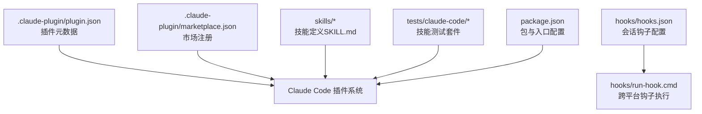
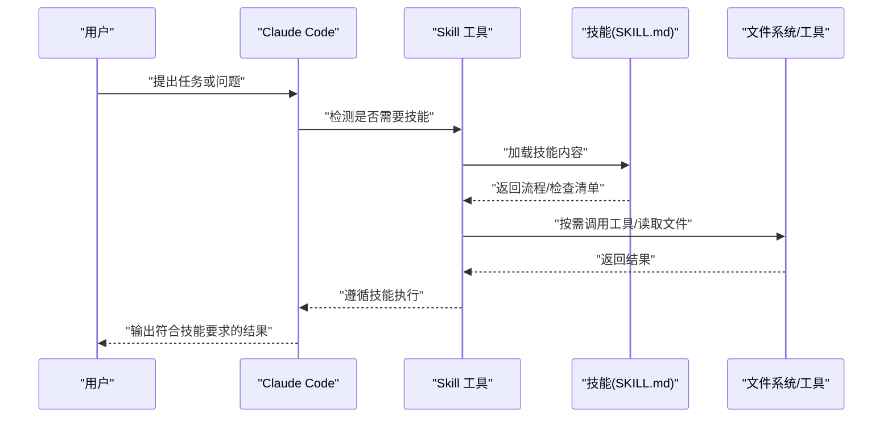
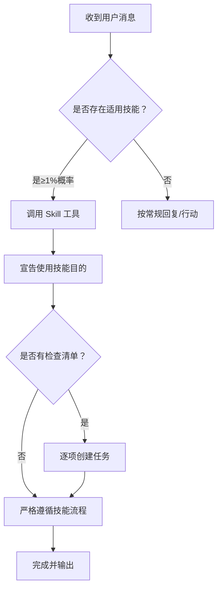
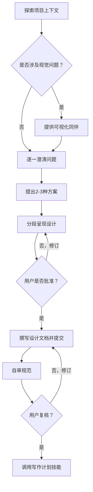
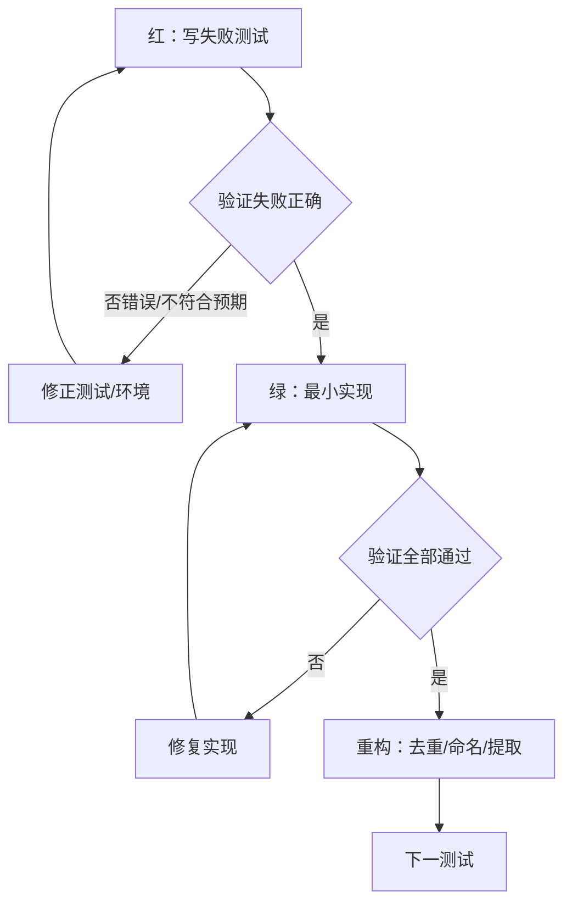
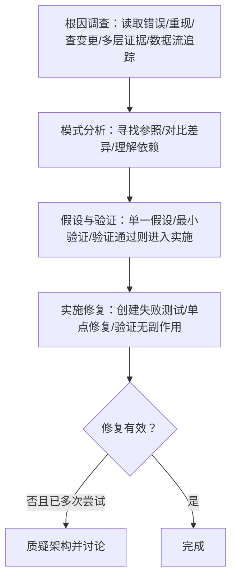
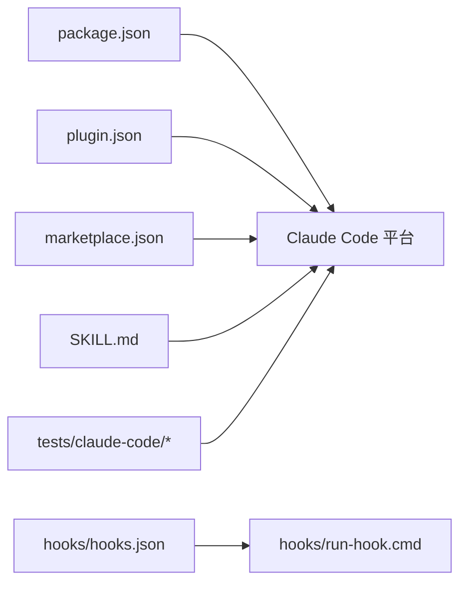

# Claude Code 集成

<cite>
**本文引用的文件**
- [README.md](file://README.md)
- [CLAUDE.md](file://CLAUDE.md)
- [AGENTS.md](file://AGENTS.md)
- [.claude-plugin/plugin.json](file://.claude-plugin/plugin.json)
- [.claude-plugin/marketplace.json](file://.claude-plugin/marketplace.json)
- [hooks/hooks.json](file://hooks/hooks.json)
- [hooks/run-hook.cmd](file://hooks/run-hook.cmd)
- [skills/using-superpowers/SKILL.md](file://skills/using-superpowers/SKILL.md)
- [skills/brainstorming/SKILL.md](file://skills/brainstorming/SKILL.md)
- [skills/test-driven-development/SKILL.md](file://skills/test-driven-development/SKILL.md)
- [skills/systematic-debugging/SKILL.md](file://skills/systematic-debugging/SKILL.md)
- [skills/writing-skills/SKILL.md](file://skills/writing-skills/SKILL.md)
- [skills/writing-skills/examples/CLAUDE_MD_TESTING.md](file://skills/writing-skills/examples/CLAUDE_MD_TESTING.md)
- [tests/claude-code/README.md](file://tests/claude-code/README.md)
- [package.json](file://package.json)
</cite>

## 目录
1. [简介](#简介)
2. [项目结构](#项目结构)
3. [核心组件](#核心组件)
4. [架构总览](#架构总览)
5. [详细组件分析](#详细组件分析)
6. [依赖关系分析](#依赖关系分析)
7. [性能考虑](#性能考虑)
8. [故障排查指南](#故障排查指南)
9. [结论](#结论)
10. [附录](#附录)

## 简介
本文件面向在 Claude Code 平台上使用 Superpowers 的用户与平台集成者，提供从安装到配置、从技能触发到对话管理、从工作流集成到性能优化的完整指南。内容基于仓库中的官方插件清单、技能文档与测试脚本，确保可操作性与可验证性。

## 项目结构
Superpowers 以“技能”为核心组织单元，通过 Claude Code 的 Skill 工具自动发现与加载。插件元数据与市场注册信息位于 .claude-plugin 目录；技能定义位于 skills 子目录；会话钩子与跨平台启动脚本位于 hooks 目录；测试用例位于 tests/claude-code 目录。

图表来源
- [.claude-plugin/plugin.json:1-21](file://.claude-plugin/plugin.json#L1-L21)
- [.claude-plugin/marketplace.json:1-21](file://.claude-plugin/marketplace.json#L1-L21)
- [hooks/hooks.json:1-17](file://hooks/hooks.json#L1-L17)
- [hooks/run-hook.cmd:1-47](file://hooks/run-hook.cmd#L1-L47)
- [package.json:1-7](file://package.json#L1-L7)

章节来源
- [.claude-plugin/plugin.json:1-21](file://.claude-plugin/plugin.json#L1-L21)
- [.claude-plugin/marketplace.json:1-21](file://.claude-plugin/marketplace.json#L1-L21)
- [hooks/hooks.json:1-17](file://hooks/hooks.json#L1-L17)
- [hooks/run-hook.cmd:1-47](file://hooks/run-hook.cmd#L1-L47)
- [package.json:1-7](file://package.json#L1-L7)

## 核心组件
- 插件元数据与市场注册：定义插件名称、描述、版本、关键词等，用于在 Claude Code 官方市场与自建市场中被发现与安装。
- 技能系统：以 SKILL.md 为载体，定义触发条件、流程图、检查清单与行为约束，由 Claude Code 的 Skill 工具按需加载。
- 会话钩子：在会话开始时执行本地脚本，支持跨平台（Windows/Unix）。
- 测试框架：基于 Claude Code CLI 的自动化测试，验证技能加载与流程合规性。

章节来源
- [.claude-plugin/plugin.json:1-21](file://.claude-plugin/plugin.json#L1-L21)
- [.claude-plugin/marketplace.json:1-21](file://.claude-plugin/marketplace.json#L1-L21)
- [hooks/hooks.json:1-17](file://hooks/hooks.json#L1-L17)
- [hooks/run-hook.cmd:1-47](file://hooks/run-hook.cmd#L1-L47)
- [tests/claude-code/README.md:1-159](file://tests/claude-code/README.md#L1-L159)

## 架构总览
Superpowers 在 Claude Code 中的运行路径如下：用户发起请求 → Claude Code 检测是否需要技能 → 通过 Skill 工具加载对应 SKILL.md → 执行技能流程（如头脑风暴、TDD、系统化调试）→ 生成中间产物（设计文档、实现计划、测试）→ 进入后续工作流阶段。

图表来源
- [skills/using-superpowers/SKILL.md:28-76](file://skills/using-superpowers/SKILL.md#L28-L76)
- [skills/brainstorming/SKILL.md:34-64](file://skills/brainstorming/SKILL.md#L34-L64)
- [skills/test-driven-development/SKILL.md:47-69](file://skills/test-driven-development/SKILL.md#L47-L69)
- [skills/systematic-debugging/SKILL.md:46-87](file://skills/systematic-debugging/SKILL.md#L46-L87)

## 详细组件分析

### 安装与配置
- 官方市场安装（Claude Code）：通过官方插件市场直接安装。
- 自建市场安装（Claude Code）：先添加市场源，再从市场安装。
- 其他平台：Codex、OpenCode、GitHub Copilot CLI、Gemini CLI 等有各自的安装命令与步骤。
- 验证安装：在新会话中触发一个应激活技能的任务，观察是否自动进入相应技能流程。

章节来源
- [README.md:27-106](file://README.md#L27-L106)

### 插件配置参数与权限
- 插件元数据：包含名称、描述、版本、作者、主页、仓库、许可证、关键词等，用于市场展示与识别。
- 市场注册：定义市场所有者、插件列表及其来源路径，便于自建市场分发。
- 会话钩子：在会话开始时执行本地脚本，支持跨平台（Windows 使用批处理包装器，Unix 直接执行）。

章节来源
- [.claude-plugin/plugin.json:1-21](file://.claude-plugin/plugin.json#L1-L21)
- [.claude-plugin/marketplace.json:1-21](file://.claude-plugin/marketplace.json#L1-L21)
- [hooks/hooks.json:1-17](file://hooks/hooks.json#L1-L17)
- [hooks/run-hook.cmd:1-47](file://hooks/run-hook.cmd#L1-L47)

### 技能触发与对话管理
- 触发规则：在任何可能适用的情况下，即使概率只有 1%，也必须调用 Skill 工具进行检查；若技能不适用则无需使用。
- 优先级：用户显式指令 > Superpowers 技能 > 默认系统提示。
- 技能类型：刚性（如 TDD、系统化调试）严格遵循流程；灵活（如协作模式）强调原则适配情境。
- 技能加载：Claude Code 使用 Skill 工具加载技能内容；其他平台参考各平台工具映射。

图表来源
- [skills/using-superpowers/SKILL.md:44-76](file://skills/using-superpowers/SKILL.md#L44-L76)

章节来源
- [skills/using-superpowers/SKILL.md:18-76](file://skills/using-superpowers/SKILL.md#L18-L76)

### 头脑风暴（设计前置）
- 核心原则：在任何创意工作前必须完成设计，不得直接进入实现。
- 流程要点：探索项目上下文、视觉辅助、澄清问题、提出方案、分段呈现设计、撰写并自审规范、等待用户批准后转入实现计划。
- 可视化同伴：针对涉及视觉内容的问题，可提供浏览器内可视化辅助，但需单独提示且仅在必要时使用。

图表来源
- [skills/brainstorming/SKILL.md:34-64](file://skills/brainstorming/SKILL.md#L34-L64)

章节来源
- [skills/brainstorming/SKILL.md:10-66](file://skills/brainstorming/SKILL.md#L10-L66)

### 测试驱动开发（TDD）
- 核心循环：红（写失败测试）→ 绿（最小实现）→ 重构（清理），循环推进。
- 行为约束：严禁在测试前编写生产代码；测试必须先失败再通过；不允许“事后补测试”。
- 常见误区与红线：跳过 TDD、测试通过即止、已有手工验证、删除代码后“稍后再改”等均属违规。

图表来源
- [skills/test-driven-development/SKILL.md:47-69](file://skills/test-driven-development/SKILL.md#L47-L69)

章节来源
- [skills/test-driven-development/SKILL.md:16-372](file://skills/test-driven-development/SKILL.md#L16-L372)

### 系统化调试
- 四阶段流程：根因调查 → 模式分析 → 假设与验证 → 实施修复。
- 关键要求：在尝试任何修复前必须完成根因调查；修复必须基于可重现的失败测试；多次无效修复需重新审视架构。
- 支持技术：根因追溯、纵深防御、基于条件的等待等。

图表来源
- [skills/systematic-debugging/SKILL.md:46-87](file://skills/systematic-debugging/SKILL.md#L46-L87)
- [skills/systematic-debugging/SKILL.md:170-214](file://skills/systematic-debugging/SKILL.md#L170-L214)

章节来源
- [skills/systematic-debugging/SKILL.md:24-297](file://skills/systematic-debugging/SKILL.md#L24-L297)

### 技能创作与质量保障
- 写作技能（TDD 于文档）：以压力场景（子代理）为“测试用例”，在没有技能时观察“失败行为”，然后编写技能并在有技能时验证“通过行为”，最后反复重构消除漏洞。
- 搜索优化（CSO）：描述字段只写“何时使用”，避免总结流程；关键词覆盖症状、错误、工具；命名采用动词开头；内容压缩以降低 token 消耗。
- 跨引用策略：仅使用技能名并标注“必需背景/子技能”，避免强制加载导致上下文膨胀。

章节来源
- [skills/writing-skills/SKILL.md:30-46](file://skills/writing-skills/SKILL.md#L30-L46)
- [skills/writing-skills/SKILL.md:140-198](file://skills/writing-skills/SKILL.md#L140-L198)
- [skills/writing-skills/SKILL.md:278-290](file://skills/writing-skills/SKILL.md#L278-L290)
- [skills/writing-skills/examples/CLAUDE_MD_TESTING.md:64-190](file://skills/writing-skills/examples/CLAUDE_MD_TESTING.md#L64-L190)

## 依赖关系分析
- 插件入口与平台适配：package.json 指定模块类型与入口，供不同平台加载；Claude Code 使用 Skill 工具加载技能；其他平台参考技能文档中的工具映射。
- 钩子链路：hooks.json 定义会话开始钩子，run-hook.cmd 提供跨平台执行能力（Windows 使用批处理包装器，Unix 直接执行）。
- 测试链路：tests/claude-code/README.md 描述了基于 Claude Code CLI 的自动化测试方法，验证技能加载与流程合规性。

图表来源
- [package.json:1-7](file://package.json#L1-L7)
- [hooks/hooks.json:1-17](file://hooks/hooks.json#L1-L17)
- [hooks/run-hook.cmd:1-47](file://hooks/run-hook.cmd#L1-L47)
- [.claude-plugin/plugin.json:1-21](file://.claude-plugin/plugin.json#L1-L21)
- [.claude-plugin/marketplace.json:1-21](file://.claude-plugin/marketplace.json#L1-L21)
- [tests/claude-code/README.md:1-159](file://tests/claude-code/README.md#L1-L159)

章节来源
- [package.json:1-7](file://package.json#L1-L7)
- [hooks/hooks.json:1-17](file://hooks/hooks.json#L1-L17)
- [hooks/run-hook.cmd:1-47](file://hooks/run-hook.cmd#L1-L47)
- [.claude-plugin/plugin.json:1-21](file://.claude-plugin/plugin.json#L1-L21)
- [.claude-plugin/marketplace.json:1-21](file://.claude-plugin/marketplace.json#L1-L21)
- [tests/claude-code/README.md:1-159](file://tests/claude-code/README.md#L1-L159)

## 性能考虑
- 技能加载效率：常用技能与入门工作流应控制字数，减少 token 消耗；将细节移至工具帮助或外部文件。
- 会话钩子开销：钩子脚本应在必要时执行，避免不必要的跨平台查找与执行。
- 测试执行时间：默认每测试约 5 分钟，集成测试可达 30 分钟；可通过参数调整超时，CI 环境建议明确超时值。
- 交互延迟：在 Claude Code 中，技能加载与工具调用会增加响应时间，建议在复杂任务前预留充足时间。

章节来源
- [skills/writing-skills/SKILL.md:213-277](file://skills/writing-skills/SKILL.md#L213-L277)
- [tests/claude-code/README.md:126-159](file://tests/claude-code/README.md#L126-L159)

## 故障排查指南
- 安装问题
  - 确认平台支持：不同平台安装命令不同；官方市场与自建市场安装路径不同。
  - 验证加载：在新会话中触发应激活技能的任务，确认技能被加载并遵循。
- 技能未触发
  - 检查触发条件：即使概率很低也应调用 Skill 工具；若技能不适用则无需使用。
  - 用户指令优先：若用户明确指示不使用某技能，应优先遵循用户指令。
- 流程异常
  - TDD 违规：在测试前写入生产代码、测试立即通过、事后补测试等均属违规。
  - 调试跳步：未完成根因调查即尝试修复、多次无效修复未质疑架构。
- 会话钩子失败
  - Windows：确认 Git for Windows 的 bash 路径存在；否则静默失败但仍不影响插件工作。
  - Unix：确认 bash 在 PATH 中可用。

章节来源
- [README.md:27-106](file://README.md#L27-L106)
- [skills/using-superpowers/SKILL.md:18-26](file://skills/using-superpowers/SKILL.md#L18-L26)
- [skills/test-driven-development/SKILL.md:24-45](file://skills/test-driven-development/SKILL.md#L24-L45)
- [skills/systematic-debugging/SKILL.md:16-23](file://skills/systematic-debugging/SKILL.md#L16-L23)
- [hooks/run-hook.cmd:20-39](file://hooks/run-hook.cmd#L20-L39)

## 结论
Superpowers 将成熟的工程实践（TDD、系统化调试、协作模式）沉淀为可发现、可遵循的技能，配合 Claude Code 的 Skill 工具实现“自动触发、自动执行”。通过规范的安装与配置、严格的流程约束与持续的测试验证，可在 Claude Code 上稳定地构建高质量软件开发工作流。

## 附录
- 平台适配与工具映射：Claude Code 使用 Skill 工具；其他平台参考技能文档中的工具映射。
- 贡献与治理：遵循 CLAUDE.md 的贡献要求，保持高质与可验证性。
- 社区与支持：加入社区 Discord 获取支持与分享经验。

章节来源
- [skills/using-superpowers/SKILL.md:38-41](file://skills/using-superpowers/SKILL.md#L38-L41)
- [CLAUDE.md:1-86](file://CLAUDE.md#L1-L86)
- [AGENTS.md:1-1](file://AGENTS.md#L1-L1)