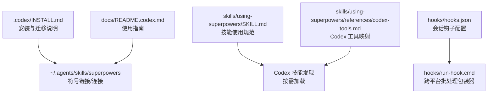
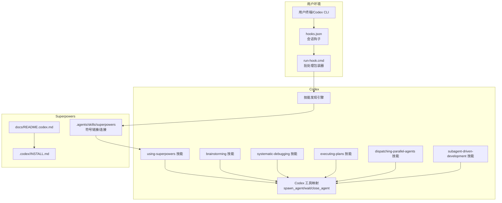
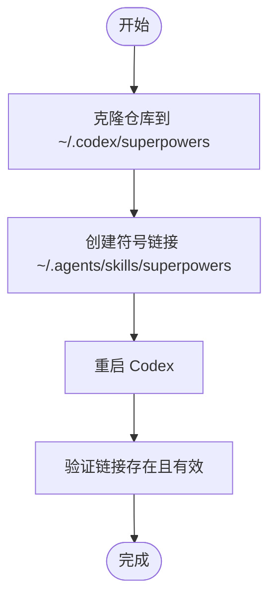
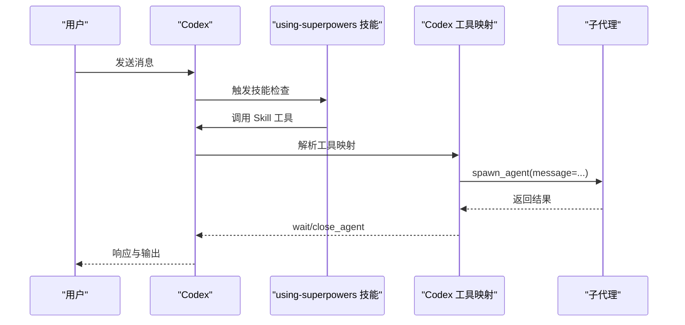
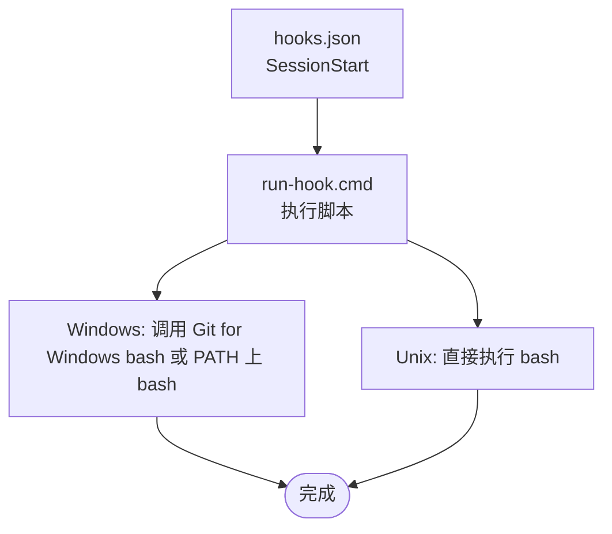
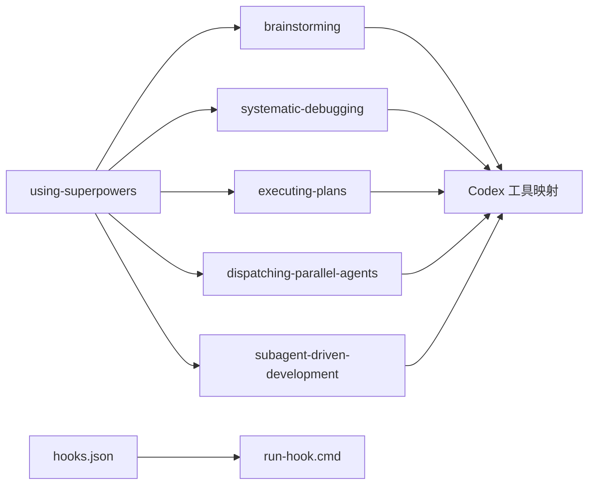

# Codex 集成

<cite>
**本文引用的文件**
- [.codex/INSTALL.md](file://.codex/INSTALL.md)
- [docs/README.codex.md](file://docs/README.codex.md)
- [skills/using-superpowers/SKILL.md](file://skills/using-superpowers/SKILL.md)
- [skills/using-superpowers/references/codex-tools.md](file://skills/using-superpowers/references/codex-tools.md)
- [skills/using-superpowers/references/copilot-tools.md](file://skills/using-superpowers/references/copilot-tools.md)
- [skills/using-superpowers/references/gemini-tools.md](file://skills/using-superpowers/references/gemini-tools.md)
- [skills/brainstorming/SKILL.md](file://skills/brainstorming/SKILL.md)
- [skills/systematic-debugging/SKILL.md](file://skills/systematic-debugging/SKILL.md)
- [skills/executing-plans/SKILL.md](file://skills/executing-plans/SKILL.md)
- [skills/dispatching-parallel-agents/SKILL.md](file://skills/dispatching-parallel-agents/SKILL.md)
- [skills/subagent-driven-development/SKILL.md](file://skills/subagent-driven-development/SKILL.md)
- [hooks/hooks.json](file://hooks/hooks.json)
- [hooks/run-hook.cmd](file://hooks/run-hook.cmd)
</cite>

## 目录
1. [简介](#简介)
2. [项目结构](#项目结构)
3. [核心组件](#核心组件)
4. [架构总览](#架构总览)
5. [详细组件分析](#详细组件分析)
6. [依赖关系分析](#依赖关系分析)
7. [性能考虑](#性能考虑)
8. [故障排除指南](#故障排除指南)
9. [结论](#结论)
10. [附录](#附录)

## 简介
本文件面向在 OpenAI Codex 中使用 Superpowers 的用户与平台集成者，系统性说明手动安装流程、CLI 使用方法、配置优化、命令行与批处理能力、平台工具映射（特别是 Codex 特有工具调用方式）、API 集成要点、性能调优策略、错误处理与故障排除方法。内容基于仓库中关于 Codex 集成的官方文档与技能定义，确保可操作、可验证。

## 项目结构
Superpowers 在 Codex 中通过“原生技能发现”机制加载：将技能目录以符号链接（或 Windows 的 junction）指向 Codex 的技能目录，Codex 启动时扫描并按需加载技能。核心文件与位置如下：
- 安装与迁移说明：.codex/INSTALL.md
- 使用指南与快速上手：docs/README.codex.md
- 技能发现与使用规范：skills/using-superpowers/SKILL.md
- 平台工具映射（含 Codex 等）：skills/using-superpowers/references/*.md
- 典型技能：brainstorming、systematic-debugging、executing-plans、dispatching-parallel-agents、subagent-driven-development
- 会话钩子与批处理：hooks/*

图表来源
- [.codex/INSTALL.md:1-68](file://.codex/INSTALL.md#L1-L68)
- [docs/README.codex.md:1-127](file://docs/README.codex.md#L1-L127)
- [skills/using-superpowers/SKILL.md:1-118](file://skills/using-superpowers/SKILL.md#L1-L118)
- [skills/using-superpowers/references/codex-tools.md:1-101](file://skills/using-superpowers/references/codex-tools.md#L1-L101)
- [hooks/hooks.json:1-17](file://hooks/hooks.json#L1-L17)
- [hooks/run-hook.cmd:1-47](file://hooks/run-hook.cmd#L1-L47)

章节来源
- [.codex/INSTALL.md:1-68](file://.codex/INSTALL.md#L1-L68)
- [docs/README.codex.md:1-127](file://docs/README.codex.md#L1-L127)

## 核心组件
- 安装与迁移
  - 通过克隆仓库并在用户主目录下创建符号链接/连接，使 Codex 能发现并加载 Superpowers 技能。
  - 迁移旧安装时需更新仓库、创建新链接并移除旧引导块。
- 技能发现与使用
  - Codex 在启动时扫描 ~/.agents/skills/，解析 SKILL.md 前言元数据，按需加载技能。
  - using-superpowers 技能负责建立“先调用技能再行动”的纪律，明确优先级与触发条件。
- 平台工具映射
  - 不同平台（Codex、Copilot CLI、Gemini CLI）使用不同的工具名称；Codex 对应 spawn_agent/wait/close_agent 等。
- 典型技能
  - brainstorming：创意到设计再到计划的完整流程。
  - systematic-debugging：系统化调试四阶段，强调根因调查与最小修复。
  - executing-plans：加载并执行实现计划，配合 finishing-a-development-branch 完成收尾。
  - dispatching-parallel-agents：独立任务并行分派，提升多问题排查效率。
  - subagent-driven-development：同一会话内以子代理驱动开发，两阶段评审保障质量。
- 钩子与批处理
  - hooks.json 定义会话开始事件，run-hook.cmd 提供跨平台批处理脚本执行包装（Windows/cmd + Git for Windows bash 或 PATH 上的 bash）。

章节来源
- [.codex/INSTALL.md:10-68](file://.codex/INSTALL.md#L10-L68)
- [skills/using-superpowers/SKILL.md:18-118](file://skills/using-superpowers/SKILL.md#L18-L118)
- [skills/using-superpowers/references/codex-tools.md:1-101](file://skills/using-superpowers/references/codex-tools.md#L1-L101)
- [hooks/hooks.json:1-17](file://hooks/hooks.json#L1-L17)
- [hooks/run-hook.cmd:1-47](file://hooks/run-hook.cmd#L1-L47)

## 架构总览
下图展示 Codex 与 Superpowers 的集成关系：安装后通过符号链接/连接暴露技能；Codex 按需加载 using-superpowers 与其他技能；技能内部根据平台工具映射调用 Codex 的 spawn_agent/wait/close_agent 等能力；钩子在会话生命周期中注入批处理脚本。

图表来源
- [docs/README.codex.md:1-127](file://docs/README.codex.md#L1-L127)
- [.codex/INSTALL.md:1-68](file://.codex/INSTALL.md#L1-L68)
- [skills/using-superpowers/SKILL.md:1-118](file://skills/using-superpowers/SKILL.md#L1-L118)
- [skills/using-superpowers/references/codex-tools.md:1-101](file://skills/using-superpowers/references/codex-tools.md#L1-L101)
- [hooks/hooks.json:1-17](file://hooks/hooks.json#L1-L17)
- [hooks/run-hook.cmd:1-47](file://hooks/run-hook.cmd#L1-L47)

## 详细组件分析

### 手动安装流程（Codex）
- 步骤概要
  - 克隆仓库至 ~/.codex/superpowers
  - 在 ~/.agents/skills 下创建指向 skills 的符号链接（Windows 使用 junction）
  - 重启 Codex 以触发技能发现
  - 如从旧安装迁移，需更新仓库、创建新链接并移除旧引导块
- 验证与卸载
  - ls -la ~/.agents/skills/superpowers 验证链接
  - 卸载时删除链接，可选删除克隆目录

图表来源
- [.codex/INSTALL.md:10-68](file://.codex/INSTALL.md#L10-L68)

章节来源
- [.codex/INSTALL.md:10-68](file://.codex/INSTALL.md#L10-L68)
- [docs/README.codex.md:13-127](file://docs/README.codex.md#L13-L127)

### CLI 使用方法与配置优化
- 技能发现与激活
  - Codex 自动扫描 ~/.agents/skills/，解析 SKILL.md 前言元数据，按需加载技能
  - using-superpowers 技能要求在任何响应或行动前调用合适的技能，即使概率仅为 1%
- 平台工具映射（Codex）
  - 子代理调度：spawn_agent（按角色创建通用子代理）、wait（等待结果）、close_agent（释放槽位）
  - 文件与命令：使用平台原生命令工具替代 Read/Write/Edit/Bash
  - 多代理支持：如需并行子代理，需在 Codex 配置中启用 multi_agent
- 环境检测与应用适配
  - 使用只读 git 命令检测工作树与分支状态，避免在不合适的环境中进行分支/推送等操作
  - 当沙箱阻止分支/推送时，提交所有工作并通过应用原生界面完成后续步骤

图表来源
- [skills/using-superpowers/SKILL.md:28-118](file://skills/using-superpowers/SKILL.md#L28-L118)
- [skills/using-superpowers/references/codex-tools.md:1-101](file://skills/using-superpowers/references/codex-tools.md#L1-L101)

章节来源
- [skills/using-superpowers/SKILL.md:18-118](file://skills/using-superpowers/SKILL.md#L18-L118)
- [skills/using-superpowers/references/codex-tools.md:16-101](file://skills/using-superpowers/references/codex-tools.md#L16-L101)

### 命令行接口与批处理功能
- 会话钩子
  - hooks.json 定义 SessionStart 事件，匹配 startup|clear|compact 关键词
  - 同步执行 run-hook.cmd，传入脚本名（如 session-start）
- 批处理包装器
  - run-hook.cmd 支持 Windows（cmd + Git for Windows bash）与 Unix（直接 bash）两种路径
  - 若未找到 bash，则静默退出（不影响插件工作）

图表来源
- [hooks/hooks.json:1-17](file://hooks/hooks.json#L1-L17)
- [hooks/run-hook.cmd:1-47](file://hooks/run-hook.cmd#L1-L47)

章节来源
- [hooks/hooks.json:1-17](file://hooks/hooks.json#L1-L17)
- [hooks/run-hook.cmd:1-47](file://hooks/run-hook.cmd#L1-L47)

### API 集成方法（Codex 特有）
- 子代理调度
  - spawn_agent：创建通用子代理（默认/探索者/工人），消息参数用于精确指令
  - wait：等待子代理返回结果
  - close_agent：释放子代理槽位
- 命名子代理补偿
  - 由于 Codex 插件系统暂不支持 agents 字段，需要通过填充 prompt 内容并以 worker 角色执行的方式模拟命名类型
- 环境检测
  - 使用只读 git 命令检测是否处于链接工作树、当前分支是否为空等，避免在不合适的环境中执行分支/推送

章节来源
- [skills/using-superpowers/references/codex-tools.md:27-101](file://skills/using-superpowers/references/codex-tools.md#L27-L101)

### 性能调优
- 子代理模型选择
  - 机械实现类任务：使用较弱模型以降低成本与提高速度
  - 集成与判断类任务：使用标准模型
  - 架构/设计/评审类任务：使用最强模型
- 并行与隔离
  - 并行子代理排查多个独立问题，显著缩短总耗时
  - 每个子代理拥有独立上下文，减少干扰
- 两阶段评审
  - 先 spec 合规评审，再代码质量评审，减少返工与后期调试成本

章节来源
- [skills/subagent-driven-development/SKILL.md:87-120](file://skills/subagent-driven-development/SKILL.md#L87-L120)
- [skills/dispatching-parallel-agents/SKILL.md:160-183](file://skills/dispatching-parallel-agents/SKILL.md#L160-L183)

### 错误处理与故障排除
- 技能未显示
  - 检查符号链接是否存在与有效
  - 确认技能目录存在
  - 重启 Codex 以重新扫描
- Windows junction 问题
  - 默认无需开发者模式即可使用 junction；若失败，尝试以管理员权限运行 PowerShell
- 子代理调度失败
  - 确认 Codex 配置已启用 multi_agent
  - 检查 spawn_agent/message 组合是否符合预期
- 环境限制
  - 若处于外部管理的工作树且处于分离头指针状态，无法直接分支/推送/发起 PR，应在沙箱内提交并使用应用原生界面完成后续步骤

章节来源
- [docs/README.codex.md:111-127](file://docs/README.codex.md#L111-L127)
- [.codex/INSTALL.md:30-68](file://.codex/INSTALL.md#L30-L68)
- [skills/using-superpowers/references/codex-tools.md:16-25](file://skills/using-superpowers/references/codex-tools.md#L16-L25)
- [skills/using-superpowers/references/codex-tools.md:90-101](file://skills/using-superpowers/references/codex-tools.md#L90-L101)

## 依赖关系分析
- 组件耦合
  - using-superpowers 是中枢技能，约束所有技能的调用时机与优先级
  - 各具体技能依赖 Codex 工具映射（spawn_agent/wait/close_agent）实现子代理编排
  - hooks 与 run-hook.cmd 为可选增强，提供会话生命周期内的批处理能力
- 外部依赖
  - Git（用于工作树/分支检测与更新）
  - Bash（跨平台批处理执行）
  - Codex 配置（multi_agent 开关）

图表来源
- [skills/using-superpowers/SKILL.md:1-118](file://skills/using-superpowers/SKILL.md#L1-L118)
- [skills/using-superpowers/references/codex-tools.md:1-101](file://skills/using-superpowers/references/codex-tools.md#L1-L101)
- [hooks/hooks.json:1-17](file://hooks/hooks.json#L1-L17)
- [hooks/run-hook.cmd:1-47](file://hooks/run-hook.cmd#L1-L47)

章节来源
- [skills/using-superpowers/SKILL.md:1-118](file://skills/using-superpowers/SKILL.md#L1-L118)
- [skills/using-superpowers/references/codex-tools.md:1-101](file://skills/using-superpowers/references/codex-tools.md#L1-L101)
- [hooks/hooks.json:1-17](file://hooks/hooks.json#L1-L17)
- [hooks/run-hook.cmd:1-47](file://hooks/run-hook.cmd#L1-L47)

## 性能考虑
- 降低 Token 与成本
  - 为机械任务选择更低成本模型，为复杂评审与设计选择更强模型
  - 通过两阶段评审减少后期返工，避免多次人工介入
- 提升吞吐
  - 并行子代理排查多个独立问题，缩短总时间
  - 子代理隔离上下文，减少沟通与协调开销
- 可靠性与一致性
  - 使用只读 git 命令进行环境检测，避免在不安全状态下执行高风险操作
  - 将子代理提示模板化，确保一致的执行与评审流程

## 故障排除指南
- 安装与发现
  - 确认 ~/.agents/skills/superpowers 指向正确
  - 重启 Codex 以触发扫描
- 平台差异
  - Codex 需启用 multi_agent 才能使用 spawn_agent/wait/close_agent
  - Windows 用户使用 junction 替代符号链接，必要时以管理员权限执行
- 环境限制
  - 在分离头指针或外部管理的工作树中，遵循“提交并交由应用原生界面处理”的流程

章节来源
- [docs/README.codex.md:111-127](file://docs/README.codex.md#L111-L127)
- [.codex/INSTALL.md:30-68](file://.codex/INSTALL.md#L30-L68)
- [skills/using-superpowers/references/codex-tools.md:16-25](file://skills/using-superpowers/references/codex-tools.md#L16-L25)
- [skills/using-superpowers/references/codex-tools.md:90-101](file://skills/using-superpowers/references/codex-tools.md#L90-L101)

## 结论
通过符号链接/连接实现的原生技能发现机制，使得 Superpowers 能无缝融入 Codex 的工作流。借助 using-superpowers 的纪律与工具映射，用户可在 Codex 中高效地调用各类技能，包括并行子代理、系统化调试与从设计到实现的完整流程。结合钩子与批处理能力，Superpowers 在保证质量的同时，实现了可观的成本与时间收益。建议在生产使用中启用 multi_agent、合理选择模型、严格遵循环境检测与两阶段评审流程，并在遇到问题时依据本文提供的故障排除清单逐项验证。

## 附录
- 快速参考
  - 安装与迁移：见 .codex/INSTALL.md
  - 使用指南：见 docs/README.codex.md
  - 技能使用规范：见 skills/using-superpowers/SKILL.md
  - 平台工具映射（Codex）：见 skills/using-superpowers/references/codex-tools.md
  - 典型技能：brainstorming、systematic-debugging、executing-plans、dispatching-parallel-agents、subagent-driven-development
  - 钩子与批处理：hooks/hooks.json、hooks/run-hook.cmd