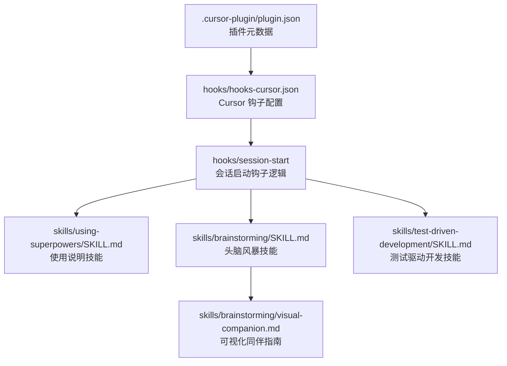
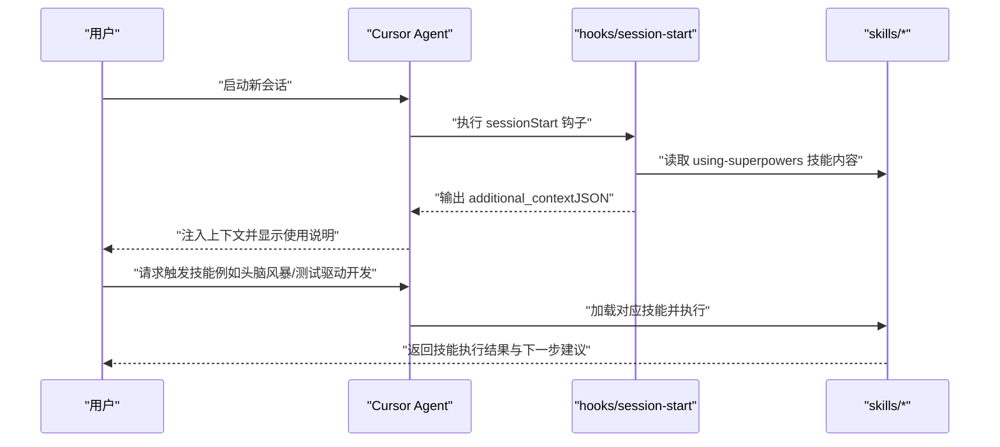
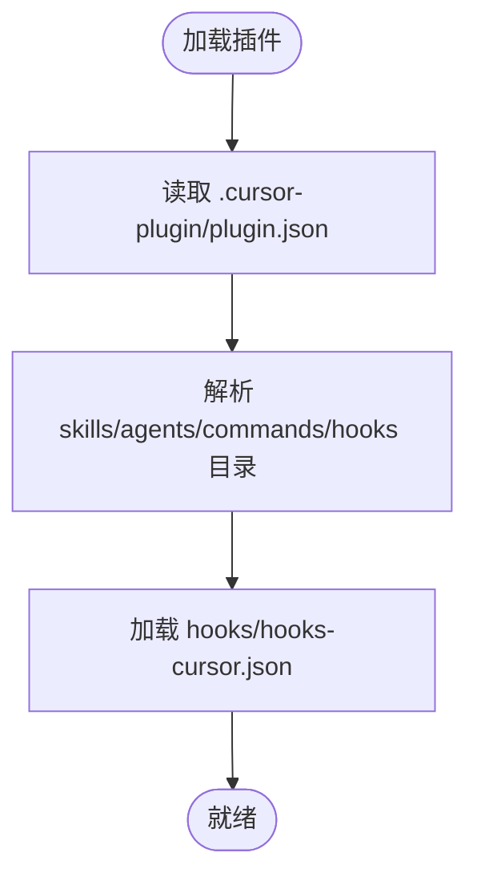
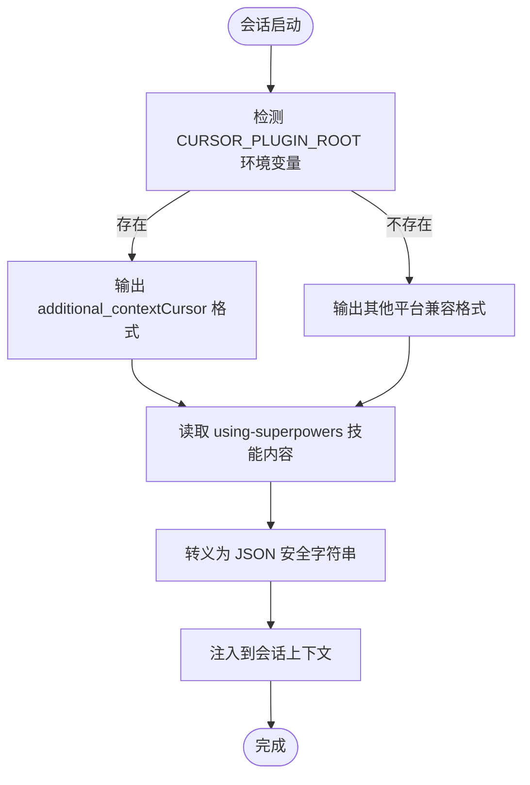
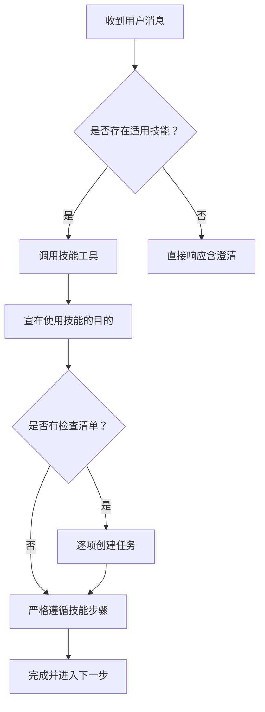
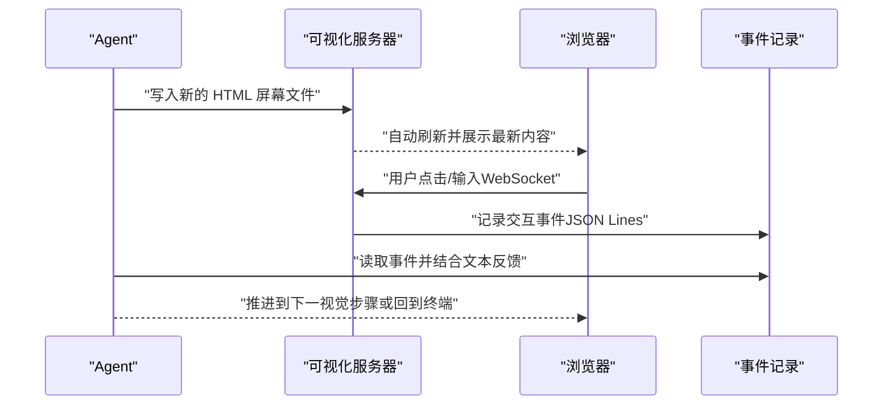
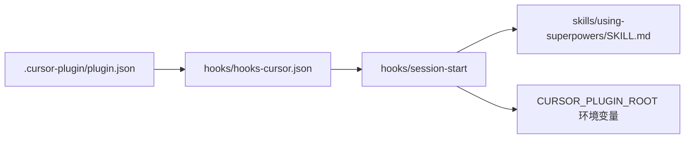

# Cursor 集成

<cite>
**本文档引用的文件**
- [README.md](file://README.md)
- [.cursor-plugin/plugin.json](file://.cursor-plugin/plugin.json)
- [hooks/hooks-cursor.json](file://hooks/hooks-cursor.json)
- [hooks/session-start](file://hooks/session-start)
- [hooks/run-hook.cmd](file://hooks/run-hook.cmd)
- [skills/using-superpowers/SKILL.md](file://skills/using-superpowers/SKILL.md)
- [skills/brainstorming/SKILL.md](file://skills/brainstorming/SKILL.md)
- [skills/test-driven-development/SKILL.md](file://skills/test-driven-development/SKILL.md)
- [skills/brainstorming/visual-companion.md](file://skills/brainstorming/visual-companion.md)
- [RELEASE-NOTES.md](file://RELEASE-NOTES.md)
</cite>

## 目录
1. [简介](#简介)
2. [项目结构](#项目结构)
3. [核心组件](#核心组件)
4. [架构总览](#架构总览)
5. [详细组件分析](#详细组件分析)
6. [依赖关系分析](#依赖关系分析)
7. [性能考虑](#性能考虑)
8. [故障排除指南](#故障排除指南)
9. [结论](#结论)
10. [附录](#附录)

## 简介
本指南面向在 Cursor 中使用 Superpowers 的用户，提供从安装到使用的完整流程，涵盖 Cursor 特有的编辑器集成特性（如会话钩子、上下文注入）、技能触发方式与工作流优化建议。Superpowers 在 Cursor 中通过插件系统加载，利用会话启动钩子自动注入使用说明与上下文，确保用户在每次对话开始时即获得一致的技能使用体验。

## 项目结构
Superpowers 在 Cursor 下的集成主要由以下部分组成：
- 插件元数据：定义插件名称、描述、版本、入口路径等
- 钩子配置：声明 Cursor 侧的会话启动钩子
- 启动脚本：在会话开始时读取技能内容并以平台兼容格式输出上下文
- 技能与工具：提供设计、测试驱动开发等可触发的工作流
- 可视化辅助：支持在头脑风暴阶段提供浏览器端可视化同伴

**图表来源**
- [.cursor-plugin/plugin.json:1-26](file://.cursor-plugin/plugin.json#L1-L26)
- [hooks/hooks-cursor.json:1-11](file://hooks/hooks-cursor.json#L1-L11)
- [hooks/session-start:1-58](file://hooks/session-start#L1-L58)
- [skills/using-superpowers/SKILL.md:1-118](file://skills/using-superpowers/SKILL.md#L1-L118)
- [skills/brainstorming/SKILL.md:1-165](file://skills/brainstorming/SKILL.md#L1-L165)
- [skills/test-driven-development/SKILL.md:1-372](file://skills/test-driven-development/SKILL.md#L1-L372)
- [skills/brainstorming/visual-companion.md:1-288](file://skills/brainstorming/visual-companion.md#L1-L288)

**章节来源**
- [.cursor-plugin/plugin.json:1-26](file://.cursor-plugin/plugin.json#L1-L26)
- [hooks/hooks-cursor.json:1-11](file://hooks/hooks-cursor.json#L1-L11)
- [hooks/session-start:1-58](file://hooks/session-start#L1-L58)
- [README.md:27-64](file://README.md#L27-L64)

## 核心组件
- 插件元数据（.cursor-plugin/plugin.json）
  - 定义插件名称、显示名、描述、版本、作者、主页、仓库、许可证、关键词、技能目录、代理目录、命令目录与钩子文件位置
  - 关键字段：name、displayName、description、version、skills、agents、commands、hooks
- Cursor 钩子配置（hooks/hooks-cursor.json）
  - 声明 Cursor 平台的会话启动钩子，指向本地 hooks 目录下的 session-start 脚本
  - 使用 Cursor 的驼峰命名格式（如 sessionStart）与版本号
- 会话启动钩子（hooks/session-start）
  - 读取 using-superpowers 技能内容，进行 JSON 转义处理
  - 根据环境变量判断平台（CURSOR_PLUGIN_ROOT），输出 Cursor 兼容的 additional_context 字段
  - 在 Windows 上通过 run-hook.cmd 适配 Git Bash 执行环境
- 技能与工具
  - using-superpowers：指导如何发现与调用技能，强调在任何响应前必须先调用适用技能
  - brainstorming：在实现前必须完成的设计与规范产出流程
  - test-driven-development：实施任何功能或修复前的测试优先流程
- 可视化同伴（skills/brainstorming/visual-companion.md）
  - 提供浏览器端可视化同伴的使用指南，支持在需要视觉呈现时临时切换到浏览器界面

**章节来源**
- [.cursor-plugin/plugin.json:1-26](file://.cursor-plugin/plugin.json#L1-L26)
- [hooks/hooks-cursor.json:1-11](file://hooks/hooks-cursor.json#L1-L11)
- [hooks/session-start:1-58](file://hooks/session-start#L1-L58)
- [skills/using-superpowers/SKILL.md:1-118](file://skills/using-superpowers/SKILL.md#L1-L118)
- [skills/brainstorming/SKILL.md:1-165](file://skills/brainstorming/SKILL.md#L1-L165)
- [skills/test-driven-development/SKILL.md:1-372](file://skills/test-driven-development/SKILL.md#L1-L372)
- [skills/brainstorming/visual-companion.md:1-288](file://skills/brainstorming/visual-companion.md#L1-L288)

## 架构总览
下图展示了 Cursor 中 Superpowers 的整体交互流程：用户在 Cursor Agent 聊天中安装插件后，每次会话启动时触发 session-start 钩子；该钩子读取技能内容并通过 additional_context 注入到会话上下文中，随后用户可按需调用技能工具执行相应工作流。

**图表来源**
- [hooks/session-start:1-58](file://hooks/session-start#L1-L58)
- [skills/using-superpowers/SKILL.md:1-118](file://skills/using-superpowers/SKILL.md#L1-L118)
- [skills/brainstorming/SKILL.md:1-165](file://skills/brainstorming/SKILL.md#L1-L165)
- [skills/test-driven-development/SKILL.md:1-372](file://skills/test-driven-development/SKILL.md#L1-L372)

## 详细组件分析

### 插件元数据与目录映射
- 插件根目录通过 .cursor-plugin/plugin.json 指定，其中 skills、agents、commands、hooks 字段分别指向技能、代理、命令与钩子目录
- Cursor 会根据 hooks 字段定位到 hooks/hooks-cursor.json，从而加载会话启动钩子

**图表来源**
- [.cursor-plugin/plugin.json:21-24](file://.cursor-plugin/plugin.json#L21-L24)
- [hooks/hooks-cursor.json:1-11](file://hooks/hooks-cursor.json#L1-L11)

**章节来源**
- [.cursor-plugin/plugin.json:1-26](file://.cursor-plugin/plugin.json#L1-L26)
- [hooks/hooks-cursor.json:1-11](file://hooks/hooks-cursor.json#L1-L11)

### 会话启动钩子（SessionStart）
- 作用：在会话启动时注入上下文，向用户提示如何使用 Superpowers 技能
- 平台适配：通过检测 CURSOR_PLUGIN_ROOT 判断是否为 Cursor 环境，输出 Cursor 兼容的 additional_context
- 跨平台执行：在 Windows 上通过 run-hook.cmd 查找 Git Bash 并执行 session-start 脚本

**图表来源**
- [hooks/session-start:46-55](file://hooks/session-start#L46-L55)
- [hooks/session-start:17-35](file://hooks/session-start#L17-L35)
- [hooks/run-hook.cmd:1-47](file://hooks/run-hook.cmd#L1-L47)

**章节来源**
- [hooks/session-start:1-58](file://hooks/session-start#L1-L58)
- [hooks/run-hook.cmd:1-47](file://hooks/run-hook.cmd#L1-L47)

### 技能触发与工作流
- 使用说明（using-superpowers）
  - 强调在任何响应或行动之前必须先调用适用技能，即使只有 1% 的可能性
  - 用户指令优先于技能，技能覆盖默认系统行为
- 头脑风暴（brainstorming）
  - 在实现前必须产出设计与规范，包含探索上下文、可视化同伴、提出方案、分段展示与自审、用户评审等步骤
- 测试驱动开发（test-driven-development）
  - 实施任何功能或修复前的测试优先流程，严格遵循红-绿-重构循环

**图表来源**
- [skills/using-superpowers/SKILL.md:44-76](file://skills/using-superpowers/SKILL.md#L44-L76)
- [skills/brainstorming/SKILL.md:20-66](file://skills/brainstorming/SKILL.md#L20-L66)
- [skills/test-driven-development/SKILL.md:47-69](file://skills/test-driven-development/SKILL.md#L47-L69)

**章节来源**
- [skills/using-superpowers/SKILL.md:1-118](file://skills/using-superpowers/SKILL.md#L1-L118)
- [skills/brainstorming/SKILL.md:1-165](file://skills/brainstorming/SKILL.md#L1-L165)
- [skills/test-driven-development/SKILL.md:1-372](file://skills/test-driven-development/SKILL.md#L1-L372)

### 可视化同伴（Brainstorming Visual Companion）
- 适用场景：当问题涉及视觉内容（布局、原型、对比）时，可临时切换到浏览器界面进行交互
- 工作方式：服务监听屏幕文件变化，自动刷新浏览器；用户交互通过 WebSocket 回传到后台任务输出
- 使用指南：提供启动服务器、推送页面、读取事件、清理会话等操作说明

**图表来源**
- [skills/brainstorming/visual-companion.md:94-127](file://skills/brainstorming/visual-companion.md#L94-L127)
- [skills/brainstorming/visual-companion.md:246-259](file://skills/brainstorming/visual-companion.md#L246-L259)

**章节来源**
- [skills/brainstorming/visual-companion.md:1-288](file://skills/brainstorming/visual-companion.md#L1-L288)

## 依赖关系分析
- 插件元数据依赖钩子配置：.cursor-plugin/plugin.json 中的 hooks 字段指向 hooks/hooks-cursor.json
- 钩子配置依赖启动脚本：hooks/hooks-cursor.json 指向 hooks/session-start
- 启动脚本依赖技能内容：读取 skills/using-superpowers/SKILL.md 作为上下文注入
- Cursor 平台特有：通过 CURSOR_PLUGIN_ROOT 区分输出格式，确保 additional_context 正确传递

**图表来源**
- [.cursor-plugin/plugin.json:21-24](file://.cursor-plugin/plugin.json#L21-L24)
- [hooks/hooks-cursor.json:4-8](file://hooks/hooks-cursor.json#L4-L8)
- [hooks/session-start:46-55](file://hooks/session-start#L46-L55)
- [skills/using-superpowers/SKILL.md:1-118](file://skills/using-superpowers/SKILL.md#L1-L118)

**章节来源**
- [.cursor-plugin/plugin.json:1-26](file://.cursor-plugin/plugin.json#L1-L26)
- [hooks/hooks-cursor.json:1-11](file://hooks/hooks-cursor.json#L1-L11)
- [hooks/session-start:1-58](file://hooks/session-start#L1-L58)

## 性能考虑
- 钩子脚本采用 POSIX 兼容与跨平台执行策略，避免在 Windows 上因 bash 版本导致的卡顿或错误
- 会话启动钩子仅在必要时注入上下文，减少对会话历史的重复注入
- 可视化同伴服务按需启动，避免长时间占用资源

[本节为通用建议，不直接分析特定文件]

## 故障排除指南
- Cursor 未显示上下文
  - 检查 .cursor-plugin/plugin.json 是否正确设置 hooks 字段
  - 确认 hooks/hooks-cursor.json 存在且包含 sessionStart 配置
  - 验证 hooks/session-start 是否可执行且无语法错误
- Windows 环境无法执行钩子
  - 确保已安装 Git for Windows 并在 PATH 中可用
  - 运行 hooks/run-hook.cmd 以验证 Git Bash 路径与执行权限
- Cursor 钩子格式不匹配
  - 确认 hooks/hooks-cursor.json 使用 Cursor 的驼峰命名（如 sessionStart）与版本号
- 更新与兼容性
  - 参考发布说明中的 Cursor 支持更新，确保钩子格式与平台检测逻辑正确

**章节来源**
- [hooks/run-hook.cmd:1-47](file://hooks/run-hook.cmd#L1-L47)
- [hooks/hooks-cursor.json:1-11](file://hooks/hooks-cursor.json#L1-L11)
- [RELEASE-NOTES.md:77-88](file://RELEASE-NOTES.md#L77-L88)

## 结论
通过上述配置与流程，Superpowers 在 Cursor 中实现了无缝集成：会话启动时自动注入使用说明，用户可在任何时刻调用技能工具执行标准化工作流。配合可视化同伴，可在需要时快速达成共识并推动实现。建议在实际使用中遵循“先调用技能再行动”的原则，并根据项目需求选择合适的技能组合。

[本节为总结性内容，不直接分析特定文件]

## 附录

### 安装与配置步骤（Cursor）
- 在 Cursor Agent 聊天中安装插件
  - 在聊天窗口输入：/add-plugin superpowers
  - 或在插件市场搜索 “superpowers” 并安装
- 验证安装
  - 启动新会话并请求触发技能（例如“帮助我规划这个功能”或“让我们调试这个问题”）
  - Agent 应自动调用相关 Superpowers 技能

**章节来源**
- [README.md:55-64](file://README.md#L55-L64)

### 技能触发方式与快捷键
- 触发方式
  - 在 Cursor 中使用技能工具调用（例如头脑风暴、测试驱动开发等）
  - 在任何可能的情况下，先调用技能工具确认适用性，再进行后续操作
- 快捷键
  - Cursor 编辑器内未提供 Superpowers 专属快捷键绑定；请通过聊天窗口的技能工具进行调用

**章节来源**
- [skills/using-superpowers/SKILL.md:28-41](file://skills/using-superpowers/SKILL.md#L28-L41)

### 工作流优化技巧
- 在实现前先调用头脑风暴技能，确保设计与规范到位
- 在实施任何功能或修复前先调用测试驱动开发技能，严格遵循红-绿-重构循环
- 需要视觉呈现时，使用可视化同伴临时切换到浏览器界面进行交互与决策

**章节来源**
- [skills/brainstorming/SKILL.md:1-165](file://skills/brainstorming/SKILL.md#L1-L165)
- [skills/test-driven-development/SKILL.md:1-372](file://skills/test-driven-development/SKILL.md#L1-L372)
- [skills/brainstorming/visual-companion.md:1-288](file://skills/brainstorming/visual-companion.md#L1-L288)