# Gemini 集成

<cite>
**本文档引用的文件**
- [GEMINI.md](file://GEMINI.md)
- [gemini-extension.json](file://gemini-extension.json)
- [README.md](file://README.md)
- [skills/using-superpowers/SKILL.md](file://skills/using-superpowers/SKILL.md)
- [skills/using-superpowers/references/gemini-tools.md](file://skills/using-superpowers/references/gemini-tools.md)
- [skills/brainstorming/SKILL.md](file://skills/brainstorming/SKILL.md)
- [skills/test-driven-development/SKILL.md](file://skills/test-driven-development/SKILL.md)
- [.version-bump.json](file://.version-bump.json)
- [scripts/bump-version.sh](file://scripts/bump-version.sh)
- [hooks/hooks.json](file://hooks/hooks.json)
- [hooks/run-hook.cmd](file://hooks/run-hook.cmd)
- [CHANGELOG.md](file://CHANGELOG.md)
- [RELEASE-NOTES.md](file://RELEASE-NOTES.md)
</cite>

## 目录
1. [简介](#简介)
2. [项目结构](#项目结构)
3. [核心组件](#核心组件)
4. [架构概览](#架构概览)
5. [详细组件分析](#详细组件分析)
6. [依赖关系分析](#依赖关系分析)
7. [性能考虑](#性能考虑)
8. [故障排除指南](#故障排除指南)
9. [结论](#结论)
10. [附录](#附录)

## 简介

Gemini 集成是 Superpowers 项目的重要组成部分，为 Google Gemini 平台提供了完整的扩展支持。该集成允许开发者在 Gemini CLI 中使用 Superpowers 的技能系统，包括设计思维、测试驱动开发、调试等核心能力。

Superpowers 是一个完整的软件开发工作流程，基于一组可组合的"技能"构建，旨在确保代理能够正确使用这些技能。该系统特别针对 Gemini 平台进行了优化，提供了平台特定的工具映射和工作流程适配。

## 项目结构

Superpowers 项目采用模块化架构，专门为不同平台提供定制化的集成方案：

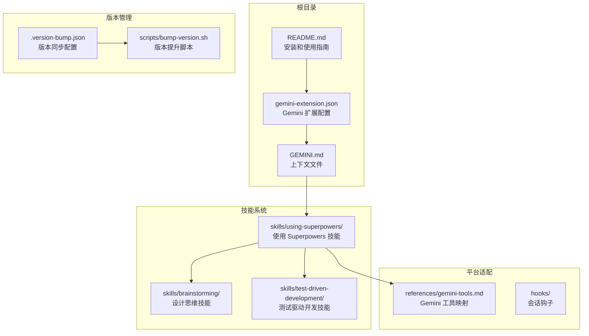

**图表来源**
- [gemini-extension.json:1-7](file://gemini-extension.json#L1-L7)
- [GEMINI.md:1-3](file://GEMINI.md#L1-L3)
- [README.md:92-102](file://README.md#L92-L102)

**章节来源**
- [gemini-extension.json:1-7](file://gemini-extension.json#L1-L7)
- [GEMINI.md:1-3](file://GEMINI.md#L1-L3)
- [README.md:92-102](file://README.md#L92-L102)

## 核心组件

### Gemini 扩展配置

Gemini 扩展通过 `gemini-extension.json` 文件进行配置，该文件定义了扩展的基本元数据和上下文文件关联：

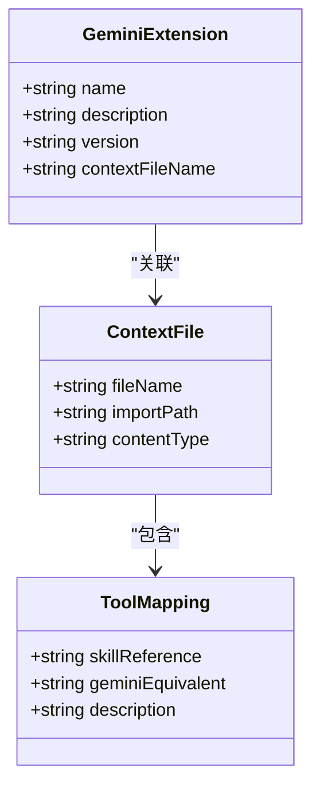

**图表来源**
- [gemini-extension.json:1-7](file://gemini-extension.json#L1-L7)
- [GEMINI.md:1-3](file://GEMINI.md#L1-L3)

### 技能系统架构

Superpowers 的技能系统采用分层设计，每个技能都有明确的职责边界：

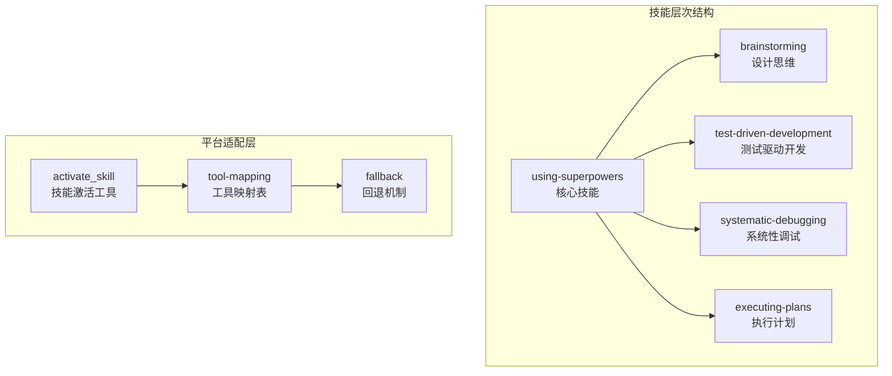

**图表来源**
- [skills/using-superpowers/SKILL.md:1-118](file://skills/using-superpowers/SKILL.md#L1-L118)
- [skills/brainstorming/SKILL.md:1-165](file://skills/brainstorming/SKILL.md#L1-L165)
- [skills/test-driven-development/SKILL.md:1-372](file://skills/test-driven-development/SKILL.md#L1-L372)

**章节来源**
- [gemini-extension.json:1-7](file://gemini-extension.json#L1-L7)
- [skills/using-superpowers/SKILL.md:1-118](file://skills/using-superpowers/SKILL.md#L1-L118)
- [skills/brainstorming/SKILL.md:1-165](file://skills/brainstorming/SKILL.md#L1-L165)
- [skills/test-driven-development/SKILL.md:1-372](file://skills/test-driven-development/SKILL.md#L1-L372)

## 架构概览

### Gemini 集成架构

Superpowers 在 Gemini 平台上的集成采用了渐进式加载和按需激活的设计模式：

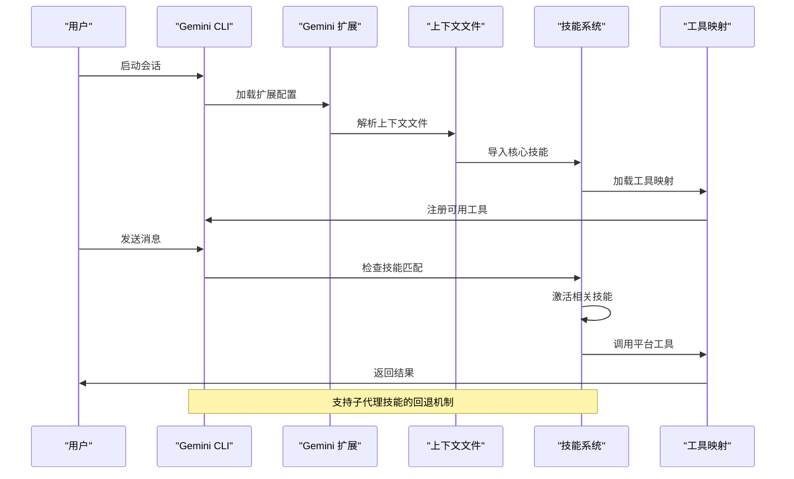

**图表来源**
- [GEMINI.md:1-3](file://GEMINI.md#L1-L3)
- [skills/using-superpowers/SKILL.md:34](file://skills/using-superpowers/SKILL.md#L34)
- [skills/using-superpowers/references/gemini-tools.md:17-21](file://skills/using-superpowers/references/gemini-tools.md#L17-L21)

### 工作流程集成

Superpowers 的工作流程在 Gemini 平台上通过以下步骤实现：

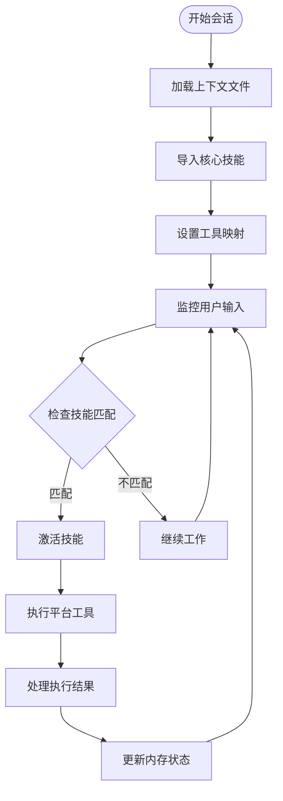

**图表来源**
- [skills/using-superpowers/SKILL.md:48-76](file://skills/using-superpowers/SKILL.md#L48-L76)
- [skills/using-superpowers/references/gemini-tools.md:23-34](file://skills/using-superpowers/references/gemini-tools.md#L23-L34)

**章节来源**
- [GEMINI.md:1-3](file://GEMINI.md#L1-L3)
- [skills/using-superpowers/SKILL.md:34](file://skills/using-superpowers/SKILL.md#L34)
- [skills/using-superpowers/references/gemini-tools.md:17-34](file://skills/using-superpowers/references/gemini-tools.md#L17-L34)

## 详细组件分析

### Gemini CLI 工具映射

Gemini 平台提供了丰富的工具集，但与 Claude Code 的工具存在差异。以下是详细的工具映射表：

| Claude Code 工具 | Gemini CLI 等效工具 | 描述 |
|------------------|-------------------|------|
| `Read` (文件读取) | `read_file` | 读取文件内容 |
| `Write` (文件创建) | `write_file` | 创建新文件 |
| `Edit` (文件编辑) | `replace` | 替换文件内容 |
| `Bash` (运行命令) | `run_shell_command` | 执行 shell 命令 |
| `Grep` (搜索内容) | `grep_search` | 搜索文件内容 |
| `Glob` (按名称搜索) | `glob` | 按文件名模式搜索 |
| `TodoWrite` (任务跟踪) | `write_todos` | 写入待办事项 |
| `Skill` (调用技能) | `activate_skill` | 激活指定技能 |
| `WebSearch` | `google_web_search` | 网络搜索 |
| `WebFetch` | `web_fetch` | 获取网页内容 |

**章节来源**
- [skills/using-superpowers/references/gemini-tools.md:5-17](file://skills/using-superpowers/references/gemini-tools.md#L5-L17)

### 子代理支持限制

Gemini CLI 不支持子代理功能，这是与 Claude Code 的主要差异：

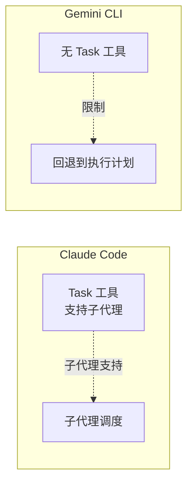

**图表来源**
- [skills/using-superpowers/references/gemini-tools.md:17](file://skills/using-superpowers/references/gemini-tools.md#L17-L21)

**章节来源**
- [skills/using-superpowers/references/gemini-tools.md:17-21](file://skills/using-superpowers/references/gemini-tools.md#L17-L21)

### Gemini CLI 特有工具

Gemini CLI 提供了一些 Claude Code 没有的工具：

| 工具 | 用途 |
|------|------|
| `list_directory` | 列出文件和子目录 |
| `save_memory` | 将事实持久化到 GEMINI.md |
| `ask_user` | 从用户请求结构化输入 |
| `tracker_create_task` | 丰富的任务管理（创建、更新、列出、可视化） |
| `enter_plan_mode` / `exit_plan_mode` | 切换到只读研究模式 |

**章节来源**
- [skills/using-superpowers/references/gemini-tools.md:23-34](file://skills/using-superpowers/references/gemini-tools.md#L23-L34)

### 安装和更新流程

#### 安装流程

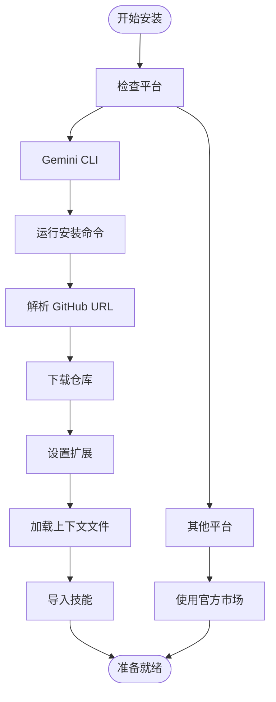

**图表来源**
- [README.md:92-102](file://README.md#L92-L102)
- [README.md:27-84](file://README.md#L27-L84)

#### 更新流程

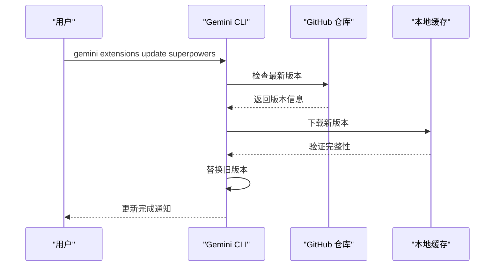

**图表来源**
- [README.md:98-102](file://README.md#L98-L102)

**章节来源**
- [README.md:92-102](file://README.md#L92-L102)

### 版本管理策略

Superpowers 采用了严格的版本同步策略，确保所有平台的一致性：

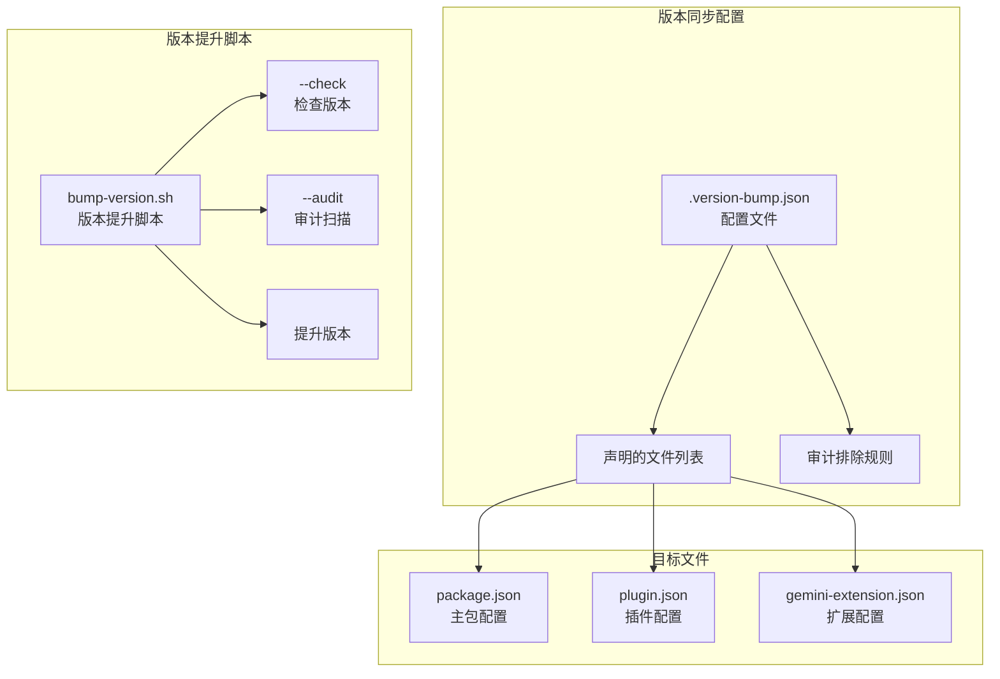

**图表来源**
- [.version-bump.json:1-19](file://.version-bump.json#L1-L19)
- [scripts/bump-version.sh:166-194](file://scripts/bump-version.sh#L166-L194)

**章节来源**
- [.version-bump.json:1-19](file://.version-bump.json#L1-L19)
- [scripts/bump-version.sh:166-194](file://scripts/bump-version.sh#L166-L194)

## 依赖关系分析

### 平台依赖关系

Superpowers 在不同平台上的依赖关系如下：

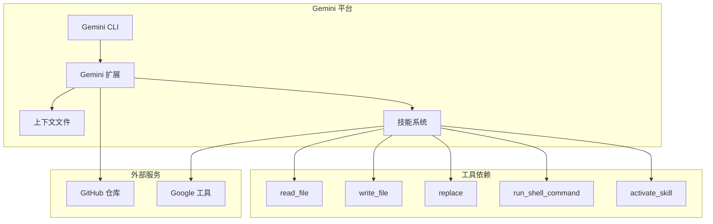

**图表来源**
- [gemini-extension.json:1-7](file://gemini-extension.json#L1-L7)
- [skills/using-superpowers/references/gemini-tools.md:5-17](file://skills/using-superpowers/references/gemini-tools.md#L5-L17)

### 技能依赖关系

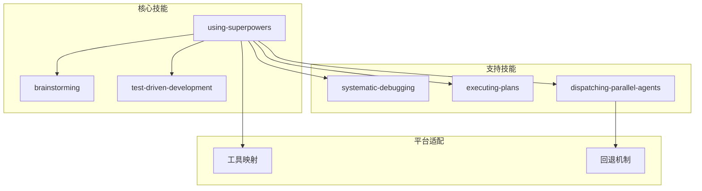

**图表来源**
- [skills/using-superpowers/SKILL.md:97-118](file://skills/using-superpowers/SKILL.md#L97-L118)
- [skills/brainstorming/SKILL.md:1-165](file://skills/brainstorming/SKILL.md#L1-L165)
- [skills/test-driven-development/SKILL.md:1-372](file://skills/test-driven-development/SKILL.md#L1-L372)

**章节来源**
- [skills/using-superpowers/SKILL.md:97-118](file://skills/using-superpowers/SKILL.md#L97-L118)
- [skills/brainstorming/SKILL.md:1-165](file://skills/brainstorming/SKILL.md#L1-L165)
- [skills/test-driven-development/SKILL.md:1-372](file://skills/test-driven-development/SKILL.md#L1-L372)

## 性能考虑

### 内存管理

Gemini CLI 提供了专门的内存管理工具：

- **save_memory 工具**：用于将重要信息持久化到 GEMINI.md 文件中
- **跨会话状态保持**：通过上下文文件实现状态的持续性
- **内存优化建议**：避免在单个会话中存储过多临时数据

### 并发处理

由于 Gemini CLI 不支持子代理，系统采用了以下并发策略：

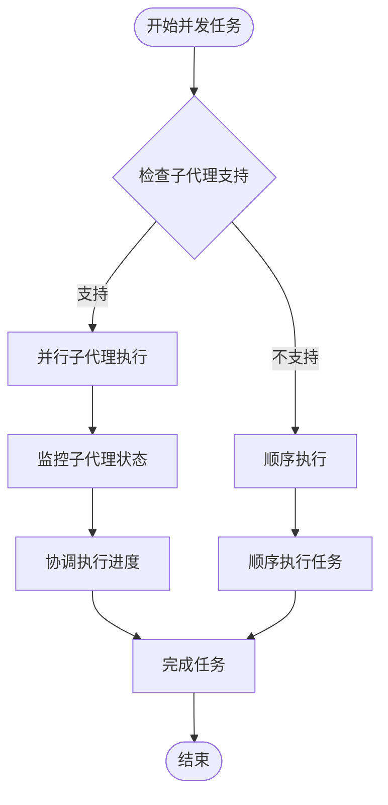

**图表来源**
- [skills/using-superpowers/references/gemini-tools.md:17-21](file://skills/using-superpowers/references/gemini-tools.md#L17-L21)

### 资源优化

- **工具调用优化**：合理安排工具调用顺序，减少不必要的文件操作
- **网络请求优化**：合并相似的网络请求，避免重复搜索
- **内存使用优化**：及时清理临时文件和缓存数据

## 故障排除指南

### 常见问题诊断

#### 安装问题

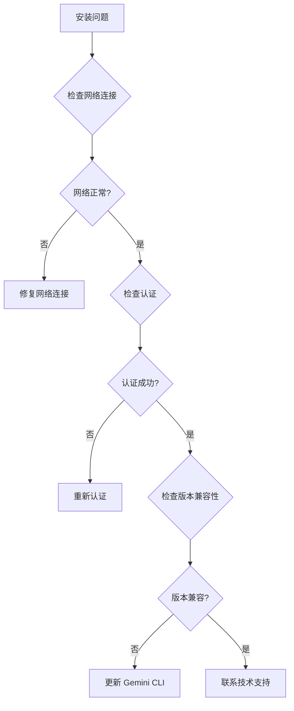

#### 技能激活问题

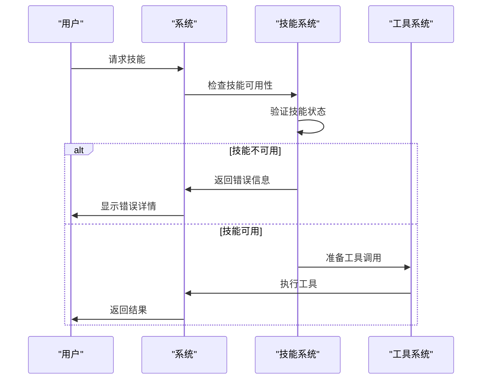

**章节来源**
- [hooks/hooks.json:1-17](file://hooks/hooks.json#L1-17)
- [hooks/run-hook.cmd:1-47](file://hooks/run-hook.cmd#L1-L47)

### 错误处理机制

Superpowers 实现了多层次的错误处理机制：

1. **技能级错误处理**：每个技能都有独立的错误处理逻辑
2. **工具级错误处理**：工具调用失败时的回退策略
3. **会话级错误处理**：会话中断时的状态恢复
4. **系统级错误处理**：平台特定的错误报告机制

**章节来源**
- [hooks/hooks.json:1-17](file://hooks/hooks.json#L1-17)
- [hooks/run-hook.cmd:1-47](file://hooks/run-hook.cmd#L1-L47)

## 结论

Superpowers 的 Gemini 集成提供了完整的扩展支持，通过精心设计的工具映射和工作流程适配，实现了与 Claude Code 平台的高度一致性。尽管存在子代理支持的限制，但通过智能的回退机制和顺序执行策略，确保了用户体验的连续性和有效性。

该集成的主要优势包括：
- **平台一致性**：在不同平台上提供相似的功能体验
- **工具映射完整**：覆盖了大部分 Claude Code 工具的功能
- **错误处理完善**：多层错误处理确保系统的稳定性
- **性能优化**：针对 Gemini 平台的特点进行了专门优化

随着 Gemini 平台功能的不断完善，Superpowers 集成也将持续演进，为开发者提供更加丰富和高效的开发体验。

## 附录

### 版本兼容性

根据发布说明，Superpowers v5.0.1 引入了重要的 Gemini CLI 扩展支持：

- **原生 Gemini CLI 扩展支持**：通过 `gemini-extension.json` 和根目录的 `GEMINI.md` 实现
- **工具映射参考**：自动加载工具映射表，翻译 Claude Code 工具名称
- **限制说明**：明确记录了子代理支持的缺失和回退机制

**章节来源**
- [RELEASE-NOTES.md:127-134](file://RELEASE-NOTES.md#L127-L134)

### 开发者提示

1. **工具选择**：根据 Gemini CLI 的工具限制选择合适的技能组合
2. **性能监控**：关注工具调用的性能表现，合理安排执行顺序
3. **错误预防**：利用回退机制避免单点故障
4. **版本管理**：定期更新 Superpowers 以获得最新的功能和修复