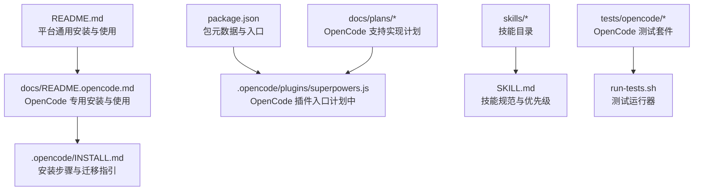
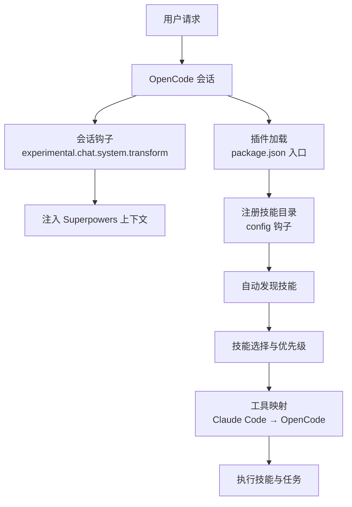
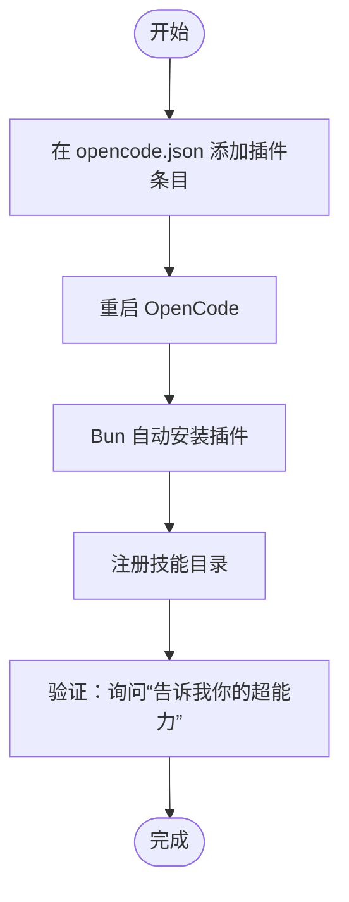
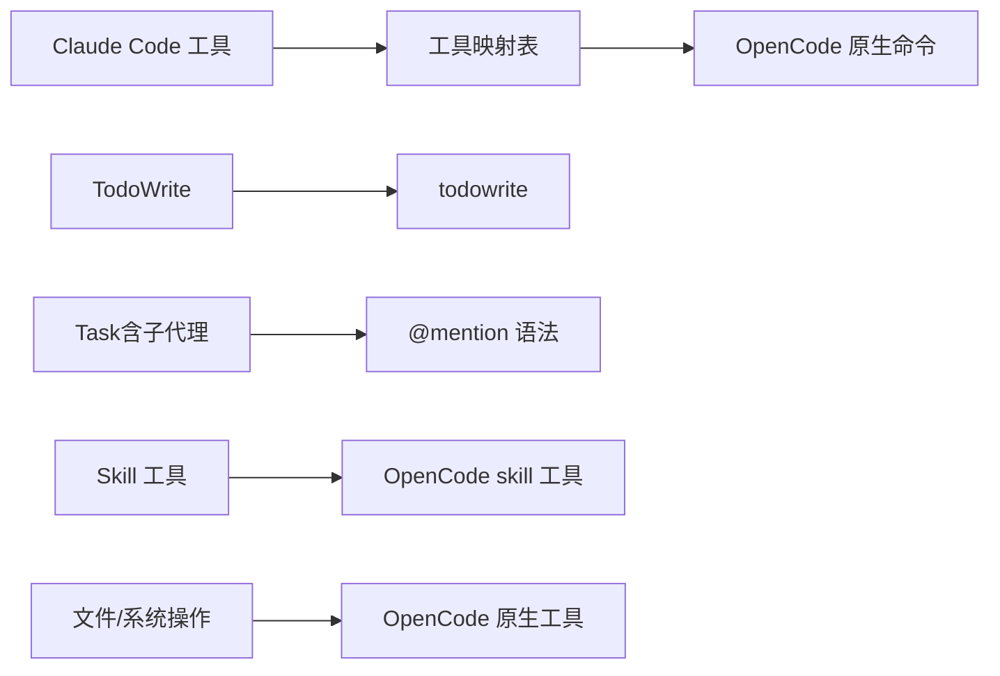
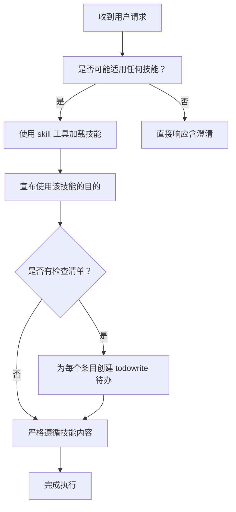
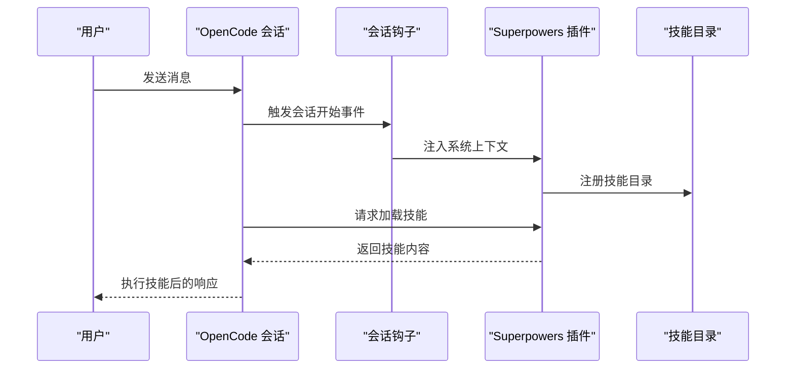
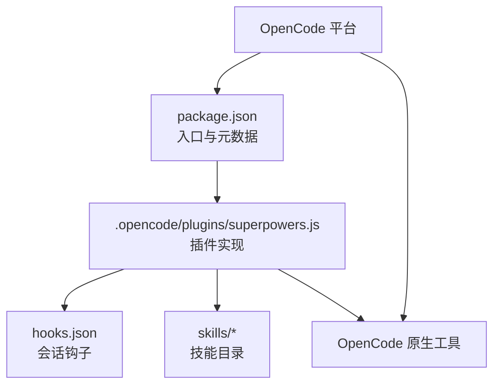

# OpenCode 集成

<cite>
**本文引用的文件**
- [README.md](file://README.md)
- [docs/README.opencode.md](file://docs/README.opencode.md)
- [.opencode/INSTALL.md](file://.opencode/INSTALL.md)
- [package.json](file://package.json)
- [hooks/hooks.json](file://hooks/hooks.json)
- [hooks/hooks-cursor.json](file://hooks/hooks-cursor.json)
- [skills/using-superpowers/README.md](file://skills/using-superpowers/README.md)
- [skills/using-superpowers/SKILL.md](file://skills/using-superpowers/SKILL.md)
- [skills/writing-skills/SKILL.md](file://skills/writing-skills/SKILL.md)
- [tests/opencode/run-tests.sh](file://tests/opencode/run-tests.sh)
- [tests/opencode/setup.sh](file://tests/opencode/setup.sh)
- [tests/opencode/test-plugin-loading.sh](file://tests/opencode/test-plugin-loading.sh)
- [tests/opencode/test-priority.sh](file://tests/opencode/test-priority.sh)
- [tests/opencode/test-tools.sh](file://tests/opencode/test-tools.sh)
- [docs/plans/2025-11-22-opencode-support-implementation.md](file://docs/plans/2025-11-22-opencode-support-implementation.md)
</cite>

## 目录
1. [简介](#简介)
2. [项目结构](#项目结构)
3. [核心组件](#核心组件)
4. [架构总览](#架构总览)
5. [详细组件分析](#详细组件分析)
6. [依赖关系分析](#依赖关系分析)
7. [性能考虑](#性能考虑)
8. [故障排除指南](#故障排除指南)
9. [结论](#结论)
10. [附录](#附录)

## 简介
本指南面向在 OpenCode 平台上集成 Superpowers 的开发者与使用者，系统阐述插件安装流程、平台适配器实现、工具映射机制、配置选项、API 集成方式、兼容性处理、特有工作流支持以及扩展开发方法。内容基于仓库中的官方文档与实现计划，确保读者能够快速完成部署、正确使用技能，并在此基础上进行二次开发。

## 项目结构
Superpowers 在 OpenCode 上的集成主要由以下部分组成：
- 官方安装与使用文档：用于指导用户在 OpenCode 中添加插件、加载技能、更新版本与排障。
- 包配置与入口：定义插件名称、版本与主入口文件路径，便于 OpenCode 自动发现与加载。
- 技能系统：通过 SKILL.md 文件组织技能内容，支持个人与项目级技能优先级覆盖。
- 测试套件：验证插件加载、工具映射、技能优先级等关键行为。
- 实现计划：记录 OpenCode 支持的设计与实现步骤，包括插件骨架、钩子与工具实现。

图表来源
- [README.md:75-84](file://README.md#L75-L84)
- [docs/README.opencode.md:1-131](file://docs/README.opencode.md#L1-L131)
- [.opencode/INSTALL.md:1-84](file://.opencode/INSTALL.md#L1-L84)
- [package.json:1-7](file://package.json#L1-L7)
- [skills/using-superpowers/SKILL.md:1-118](file://skills/using-superpowers/SKILL.md#L1-L118)
- [tests/opencode/run-tests.sh:1-20](file://tests/opencode/run-tests.sh#L1-L20)
- [docs/plans/2025-11-22-opencode-support-implementation.md](file://docs/plans/2025-11-22-opencode-support-implementation.md)

章节来源
- [README.md:75-84](file://README.md#L75-L84)
- [docs/README.opencode.md:1-131](file://docs/README.opencode.md#L1-L131)
- [.opencode/INSTALL.md:1-84](file://.opencode/INSTALL.md#L1-L84)
- [package.json:1-7](file://package.json#L1-L7)

## 核心组件
- 插件入口与自动注册
  - 通过 package.json 指定模块化入口，OpenCode 启动时可自动发现并加载插件。
  - 插件负责注入系统上下文与注册技能目录，使 OpenCode 能自动发现所有 Superpowers 技能。
- 技能系统与优先级
  - 技能以 SKILL.md 组织，包含触发条件、执行流程与检查清单。
  - 优先级规则：项目技能 > 个人技能 > Superpowers 内置技能，确保定制化覆盖默认能力。
- 工具映射与平台适配
  - 将 Claude Code 工具名映射到 OpenCode 原生工具或语法（如 TodoWrite、@mention、skill 工具等）。
  - 文件操作等通用能力由 OpenCode 原生命令替代。
- 配置与钩子
  - 通过 opencode.json 的 plugin 数组声明插件来源（支持分支/标签固定版本）。
  - 使用会话钩子在启动时注入引导上下文，确保每次对话都具备 Superpowers 意识。

章节来源
- [package.json:1-7](file://package.json#L1-L7)
- [docs/README.opencode.md:91-106](file://docs/README.opencode.md#L91-L106)
- [skills/using-superpowers/SKILL.md:77-118](file://skills/using-superpowers/SKILL.md#L77-L118)
- [docs/README.opencode.md:98-106](file://docs/README.opencode.md#L98-L106)

## 架构总览
下图展示了 Superpowers 在 OpenCode 中的整体架构：从用户请求到技能加载、工具映射与执行的完整链路。

图表来源
- [docs/README.opencode.md:91-106](file://docs/README.opencode.md#L91-L106)
- [package.json:1-7](file://package.json#L1-L7)

## 详细组件分析

### 安装与升级流程
- 安装方式
  - 在 opencode.json 的 plugin 数组中添加 Superpowers 插件源（支持 Git URL 与版本标记）。
  - 重启 OpenCode，插件通过 Bun 自动安装并注册技能目录。
- 升级策略
  - 默认随启动重新从 Git 拉取最新版本；可通过指定分支或标签固定版本。
- 迁移旧版
  - 移除旧的符号链接与历史配置，按新流程重新安装。

图表来源
- [docs/README.opencode.md:5-18](file://docs/README.opencode.md#L5-L18)
- [docs/README.opencode.md:79-90](file://docs/README.opencode.md#L79-L90)
- [.opencode/INSTALL.md:7-18](file://.opencode/INSTALL.md#L7-L18)

章节来源
- [docs/README.opencode.md:5-18](file://docs/README.opencode.md#L5-L18)
- [docs/README.opencode.md:79-90](file://docs/README.opencode.md#L79-L90)
- [.opencode/INSTALL.md:7-18](file://.opencode/INSTALL.md#L7-L18)

### 工具映射机制
- TodoWrite 与任务管理
  - 将 TodoWrite 映射为 OpenCode 的 todowrite 命令，保持待办项的统一管理。
- 子代理与并发协作
  - 将 Claude Code 的 Task（含子代理）映射为 OpenCode 的 @mention 语法，实现多角色协作。
- 技能加载工具
  - 将 Skill 工具映射为 OpenCode 的原生 skill 工具，保持一致的技能调用体验。
- 文件与系统操作
  - 文件读写、搜索与系统命令等通用能力由 OpenCode 原生工具替代，减少平台差异。

图表来源
- [docs/README.opencode.md:98-106](file://docs/README.opencode.md#L98-L106)

章节来源
- [docs/README.opencode.md:98-106](file://docs/README.opencode.md#L98-L106)

### 技能加载与优先级
- 加载方式
  - 使用 OpenCode 的 skill 工具列出与加载技能，支持一次性加载与按需加载。
- 优先级规则
  - 项目技能 > 个人技能 > Superpowers 内置技能，确保项目定制化优先。
- 触发与执行
  - 技能通过明确的触发条件描述，避免在描述中总结流程，保证 Agent 正确阅读完整内容。

图表来源
- [skills/using-superpowers/SKILL.md:44-76](file://skills/using-superpowers/SKILL.md#L44-L76)

章节来源
- [skills/using-superpowers/SKILL.md:44-76](file://skills/using-superpowers/SKILL.md#L44-L76)
- [skills/using-superpowers/SKILL.md:77-118](file://skills/using-superpowers/SKILL.md#L77-L118)

### 插件入口与钩子实现（基于实现计划）
根据实现计划，OpenCode 插件的核心职责包括：
- 插件入口：导出 SuperpowersPlugin，作为 OpenCode 的插件入口点。
- 会话钩子：在会话开始时注入系统上下文，确保对话具备 Superpowers 意识。
- 技能注册：通过 config 钩子注册技能目录，使 OpenCode 自动发现所有 Superpowers 技能。
- 自定义工具：提供 use_skill 等工具，支持技能加载与执行。

图表来源
- [docs/plans/2025-11-22-opencode-support-implementation.md](file://docs/plans/2025-11-22-opencode-support-implementation.md)

章节来源
- [docs/plans/2025-11-22-opencode-support-implementation.md](file://docs/plans/2025-11-22-opencode-support-implementation.md)

### 配置选项与兼容性处理
- 配置文件
  - 在 opencode.json 的 plugin 数组中声明插件来源，支持 Git URL 与版本标记。
- 兼容性
  - 通过工具映射与会话钩子适配不同平台特性，确保技能在 OpenCode 中的行为与 Claude Code 一致。
- 版本控制
  - 通过分支/标签固定版本，避免升级带来的不兼容问题。

章节来源
- [docs/README.opencode.md:79-90](file://docs/README.opencode.md#L79-L90)
- [docs/README.opencode.md:91-106](file://docs/README.opencode.md#L91-L106)

### OpenCode 特有工作流支持
- 技能优先级与覆盖
  - 项目技能优先于个人与内置技能，满足团队与项目的定制化需求。
- 工具映射与原生能力
  - 通过 OpenCode 原生工具替代通用操作，减少跨平台差异。
- 自动引导与上下文注入
  - 会话钩子确保每次对话都具备 Superpowers 意识，提升一致性与可预测性。

章节来源
- [skills/using-superpowers/SKILL.md:77-118](file://skills/using-superpowers/SKILL.md#L77-L118)
- [docs/README.opencode.md:91-106](file://docs/README.opencode.md#L91-L106)

### 扩展开发指南
- 新增技能
  - 遵循 SKILL.md 规范编写技能内容，明确触发条件与执行流程。
  - 使用 TDD 方法对技能进行压力测试与验证，确保在高压场景下的稳定性。
- 自定义工具
  - 参考实现计划中的工具实现思路，在插件中新增自定义工具以增强工作流。
- 测试与验证
  - 使用测试套件验证插件加载、工具映射与技能优先级等关键行为。

章节来源
- [skills/writing-skills/SKILL.md:1-656](file://skills/writing-skills/SKILL.md#L1-L656)
- [tests/opencode/run-tests.sh:1-20](file://tests/opencode/run-tests.sh#L1-L20)

## 依赖关系分析
- 外部依赖
  - OpenCode：作为宿主平台，提供会话、钩子与工具生态。
  - Git：用于拉取插件与技能源码。
  - Bun：用于自动安装与运行插件。
- 内部依赖
  - package.json：定义插件入口与模块类型。
  - 技能目录：通过 config 钩子注册，供 OpenCode 自动发现。
  - 钩子配置：通过 hooks.json 与 hooks-cursor.json 提供会话生命周期事件。

图表来源
- [package.json:1-7](file://package.json#L1-L7)
- [hooks/hooks.json:1-17](file://hooks/hooks.json#L1-L17)
- [hooks/hooks-cursor.json:1-11](file://hooks/hooks-cursor.json#L1-L11)

章节来源
- [package.json:1-7](file://package.json#L1-L7)
- [hooks/hooks.json:1-17](file://hooks/hooks.json#L1-L17)
- [hooks/hooks-cursor.json:1-11](file://hooks/hooks-cursor.json#L1-L11)

## 性能考虑
- 插件加载与缓存
  - 通过自动安装与注册减少手动配置开销，提升加载效率。
- 工具映射优化
  - 使用 OpenCode 原生工具替代通用操作，降低跨平台适配成本。
- 技能优先级
  - 合理设置项目与个人技能，避免重复加载与冲突，提高执行效率。

## 故障排除指南
- 插件未加载
  - 检查 OpenCode 日志，确认插件条目正确且平台版本支持相关钩子。
- 技能未找到
  - 使用 skill 工具列出可用技能，检查插件是否成功加载。
- 引导信息未出现
  - 确认 OpenCode 版本支持 experimental.chat.system.transform 钩子，并在配置变更后重启 OpenCode。

章节来源
- [docs/README.opencode.md:107-125](file://docs/README.opencode.md#L107-L125)
- [.opencode/INSTALL.md:59-79](file://.opencode/INSTALL.md#L59-L79)

## 结论
通过在 OpenCode 中集成 Superpowers，开发者可以复用成熟的技能体系与自动化工作流，同时借助工具映射与钩子机制实现平台适配与一致性保障。建议在生产环境中固定版本、完善测试与监控，并结合项目实际定制技能优先级与工具映射，以获得最佳的开发体验与交付质量。

## 附录
- 测试套件概览
  - run-tests.sh：统一运行 OpenCode 插件测试套件。
  - setup.sh：测试环境初始化脚本。
  - test-plugin-loading.sh：验证插件加载逻辑。
  - test-priority.sh：验证技能优先级覆盖。
  - test-tools.sh：验证工具映射与交互。

章节来源
- [tests/opencode/run-tests.sh:1-20](file://tests/opencode/run-tests.sh#L1-L20)
- [tests/opencode/setup.sh](file://tests/opencode/setup.sh)
- [tests/opencode/test-plugin-loading.sh](file://tests/opencode/test-plugin-loading.sh)
- [tests/opencode/test-priority.sh](file://tests/opencode/test-priority.sh)
- [tests/opencode/test-tools.sh](file://tests/opencode/test-tools.sh)