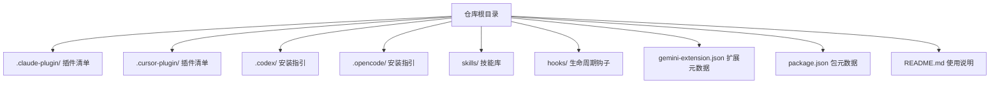
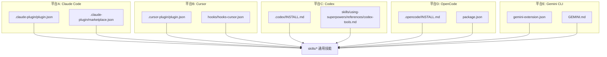
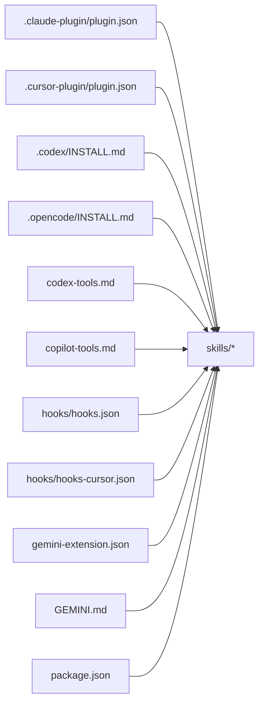

# 平台集成

<cite>
**本文引用的文件**
- [README.md](file://README.md)
- [CLAUDE.md](file://CLAUDE.md)
- [GEMINI.md](file://GEMINI.md)
- [package.json](file://package.json)
- [gemini-extension.json](file://gemini-extension.json)
- [.claude-plugin/plugin.json](file://.claude-plugin/plugin.json)
- [.claude-plugin/marketplace.json](file://.claude-plugin/marketplace.json)
- [.cursor-plugin/plugin.json](file://.cursor-plugin/plugin.json)
- [.codex/INSTALL.md](file://.codex/INSTALL.md)
- [.opencode/INSTALL.md](file://.opencode/INSTALL.md)
- [hooks/hooks.json](file://hooks/hooks.json)
- [hooks/hooks-cursor.json](file://hooks/hooks-cursor.json)
- [skills/using-superpowers/SKILL.md](file://skills/using-superpowers/SKILL.md)
- [skills/using-superpowers/references/codex-tools.md](file://skills/using-superpowers/references/codex-tools.md)
- [skills/using-superpowers/references/copilot-tools.md](file://skills/using-superpowers/references/copilot-tools.md)
</cite>

## 目录
1. [简介](#简介)
2. [项目结构](#项目结构)
3. [核心组件](#核心组件)
4. [架构总览](#架构总览)
5. [详细组件分析](#详细组件分析)
6. [依赖关系分析](#依赖关系分析)
7. [性能考量](#性能考量)
8. [故障排查指南](#故障排查指南)
9. [结论](#结论)
10. [附录](#附录)

## 简介
本文件面向平台开发者与集成工程师，系统阐述 Superpowers 在多平台（Claude Code、Cursor、Codex、OpenCode、Gemini CLI）上的安装、配置与平台适配策略。内容覆盖各平台特有的安装流程、API 工具映射、钩子与生命周期管理、以及跨平台兼容性设计原则与最佳实践。

## 项目结构
Superpowers 将“技能”作为可组合的工作流单元，通过各平台的插件/工具系统进行加载与执行。项目采用按平台分目录的配置组织方式，并在通用文档中统一说明使用方法与工具映射。

图示来源
- [README.md:27-106](file://README.md#L27-L106)
- [.claude-plugin/plugin.json:1-21](file://.claude-plugin/plugin.json#L1-L21)
- [.cursor-plugin/plugin.json:1-26](file://.cursor-plugin/plugin.json#L1-L26)
- [.codex/INSTALL.md:1-68](file://.codex/INSTALL.md#L1-L68)
- [.opencode/INSTALL.md:1-84](file://.opencode/INSTALL.md#L1-L84)
- [gemini-extension.json:1-7](file://gemini-extension.json#L1-L7)
- [package.json:1-7](file://package.json#L1-L7)

章节来源
- [README.md:27-106](file://README.md#L27-L106)
- [.claude-plugin/plugin.json:1-21](file://.claude-plugin/plugin.json#L1-L21)
- [.cursor-plugin/plugin.json:1-26](file://.cursor-plugin/plugin.json#L1-L26)
- [.codex/INSTALL.md:1-68](file://.codex/INSTALL.md#L1-L68)
- [.opencode/INSTALL.md:1-84](file://.opencode/INSTALL.md#L1-L84)
- [gemini-extension.json:1-7](file://gemini-extension.json#L1-L7)
- [package.json:1-7](file://package.json#L1-L7)

## 核心组件
- 平台插件清单：各平台通过各自的 manifest 文件声明插件元信息（名称、版本、关键词等），用于注册与发现。
- 安装与配置指引：针对不同平台提供独立的安装步骤与迁移说明。
- 技能库与工具映射：技能以通用工具名描述，平台通过映射表将通用工具名转换为平台原生工具调用。
- 生命周期钩子：在会话开始等关键节点触发脚本或命令，完成初始化与环境准备。
- 上下文与扩展元数据：Gemini 通过扩展元数据与上下文文件加载技能参考。

章节来源
- [.claude-plugin/plugin.json:1-21](file://.claude-plugin/plugin.json#L1-L21)
- [.cursor-plugin/plugin.json:1-26](file://.cursor-plugin/plugin.json#L1-L26)
- [.codex/INSTALL.md:1-68](file://.codex/INSTALL.md#L1-L68)
- [.opencode/INSTALL.md:1-84](file://.opencode/INSTALL.md#L1-L84)
- [skills/using-superpowers/SKILL.md:38-41](file://skills/using-superpowers/SKILL.md#L38-L41)
- [hooks/hooks.json:1-17](file://hooks/hooks.json#L1-L17)
- [hooks/hooks-cursor.json:1-11](file://hooks/hooks-cursor.json#L1-L11)
- [gemini-extension.json:1-7](file://gemini-extension.json#L1-L7)

## 架构总览
Superpowers 的平台集成由“通用技能 + 平台适配层”构成。通用技能不绑定具体平台，仅使用抽象工具名；平台通过 manifest、工具映射与钩子实现对通用技能的加载与执行。

图示来源
- [.claude-plugin/plugin.json:1-21](file://.claude-plugin/plugin.json#L1-L21)
- [.claude-plugin/marketplace.json:1-21](file://.claude-plugin/marketplace.json#L1-L21)
- [.cursor-plugin/plugin.json:1-26](file://.cursor-plugin/plugin.json#L1-L26)
- [.codex/INSTALL.md:1-68](file://.codex/INSTALL.md#L1-L68)
- [skills/using-superpowers/references/codex-tools.md:1-101](file://skills/using-superpowers/references/codex-tools.md#L1-L101)
- [.opencode/INSTALL.md:1-84](file://.opencode/INSTALL.md#L1-L84)
- [package.json:1-7](file://package.json#L1-L7)
- [gemini-extension.json:1-7](file://gemini-extension.json#L1-L7)
- [GEMINI.md:1-3](file://GEMINI.md#L1-L3)

## 详细组件分析

### Claude Code（官方市场与自建市场）
- 插件清单与市场清单：定义插件元信息与市场条目，支持从官方市场与自建市场安装。
- 安装方式：
  - 官方市场：通过指令安装指定版本插件。
  - 自建市场：先添加市场源，再安装对应插件。
- 兼容性要点：
  - 插件版本号与关键词一致，确保识别与更新。
  - 市场清单包含源路径与作者信息，便于溯源与维护。

章节来源
- [README.md:31-53](file://README.md#L31-L53)
- [.claude-plugin/plugin.json:1-21](file://.claude-plugin/plugin.json#L1-L21)
- [.claude-plugin/marketplace.json:1-21](file://.claude-plugin/marketplace.json#L1-L21)

### Cursor（插件市场）
- 插件清单：声明技能、代理、命令与钩子路径，使 Cursor 能自动发现并加载资源。
- 钩子：在会话开始时执行本地脚本，完成初始化。
- 兼容性要点：
  - 钩子配置与脚本路径需与实际部署位置一致。
  - 清单中的路径字段决定资源发现范围。

章节来源
- [README.md:55-63](file://README.md#L55-L63)
- [.cursor-plugin/plugin.json:1-26](file://.cursor-plugin/plugin.json#L1-L26)
- [hooks/hooks-cursor.json:1-11](file://hooks/hooks-cursor.json#L1-L11)

### Codex（手动安装与工具映射）
- 安装流程：
  - 克隆仓库到用户目录。
  - 创建技能软链接至 Codex 的技能目录。
  - Windows 使用符号链接或目录连接。
  - 重启 Codex 以发现新技能。
- 迁移与卸载：
  - 旧版引导块需清理，避免重复加载。
  - 卸载只需删除软链接与可选克隆目录。
- 工具映射与限制：
  - 子代理调度需启用多代理功能。
  - 名称化代理类型通过通用 worker 角色替代，消息需按规范封装。
  - 环境检测：通过只读 git 命令判断工作树状态与分支情况。
  - 应用沙盒限制：在无法分支/推送场景下，提交工作并引导用户通过应用界面操作。
- 兼容性要点：
  - 多代理开关是并发子代理技能的关键条件。
  - 消息格式与执行指令对齐，避免模型总结与偏离指令。

章节来源
- [README.md:65-73](file://README.md#L65-L73)
- [.codex/INSTALL.md:1-68](file://.codex/INSTALL.md#L1-L68)
- [skills/using-superpowers/references/codex-tools.md:1-101](file://skills/using-superpowers/references/codex-tools.md#L1-L101)

### OpenCode（插件声明与自动发现）
- 安装流程：
  - 在全局或项目级配置中将插件加入插件数组。
  - 重启 OpenCode 后自动安装并注册所有技能。
- 迁移与更新：
  - 旧版符号链接安装需清理，改用 git+URL 方式。
  - 支持固定版本号以锁定插件版本。
- 兼容性要点：
  - 插件数组与仓库地址正确性决定加载与更新行为。
  - 通过内置 skill 工具列出与加载技能，确保发现链路正常。

章节来源
- [README.md:75-83](file://README.md#L75-L83)
- [.opencode/INSTALL.md:1-84](file://.opencode/INSTALL.md#L1-L84)
- [package.json:1-7](file://package.json#L1-L7)

### Gemini CLI（扩展元数据与上下文）
- 扩展元数据：定义扩展名称、描述与上下文文件名，用于会话启动时加载上下文。
- 上下文文件：指向技能使用说明与工具映射，确保用户在 Gemini 中获得一致体验。
- 兼容性要点：
  - 上下文文件与扩展元数据需保持版本一致，避免加载失败。
  - 工具激活通过平台提供的工具接口完成。

章节来源
- [README.md:92-102](file://README.md#L92-L102)
- [gemini-extension.json:1-7](file://gemini-extension.json#L1-L7)
- [GEMINI.md:1-3](file://GEMINI.md#L1-L3)

### 技能系统与平台适配器设计
- 通用技能：不绑定平台，仅使用抽象工具名（如 Task、TodoWrite、Skill、Read/Write/Edit、Bash 等）。
- 平台适配器：通过工具映射表将抽象工具名转换为平台原生工具调用，保证技能在不同平台的一致行为。
- 生命周期钩子：在会话开始等关键节点执行初始化脚本，确保环境变量与外部工具可用。
- 设计原则：
  - 零依赖插件：避免引入第三方依赖，降低平台兼容性风险。
  - 可移植性：通过只读 git 命令与平台无关的工具调用，减少平台差异影响。
  - 明确的消息格式与执行指令：提升子代理任务的确定性与一致性。

图示来源
- [skills/using-superpowers/SKILL.md:48-76](file://skills/using-superpowers/SKILL.md#L48-L76)

章节来源
- [skills/using-superpowers/SKILL.md:38-41](file://skills/using-superpowers/SKILL.md#L38-L41)
- [skills/using-superpowers/SKILL.md:78-118](file://skills/using-superpowers/SKILL.md#L78-L118)
- [hooks/hooks.json:1-17](file://hooks/hooks.json#L1-L17)

### 平台工具映射与 API 集成
- Copilot CLI 映射：Read/Write/Edit/Bash/Grep/Glob/Skill/WebFetch 等工具的等价替换，以及异步 shell 会话支持。
- Codex 映射：Task（子代理调度）、TodoWrite（任务跟踪）、Skill（技能加载）、文件与命令工具的原生替代。
- 兼容性考虑：
  - 多代理能力需显式开启。
  - 名称化代理类型通过通用角色与消息封装实现等价效果。
  - 对于不支持的工具（如 EnterPlanMode/ExitPlanMode），保持主会话流程不变。

章节来源
- [skills/using-superpowers/references/copilot-tools.md:1-53](file://skills/using-superpowers/references/copilot-tools.md#L1-L53)
- [skills/using-superpowers/references/codex-tools.md:1-101](file://skills/using-superpowers/references/codex-tools.md#L1-L101)

## 依赖关系分析
- 插件清单与技能库：各平台通过 manifest 或配置文件声明插件元信息，指向 skills/ 目录下的通用技能。
- 配置文件与包元数据：package.json 指定 OpenCode 插件入口；gemini-extension.json 指定上下文文件。
- 工具映射与钩子：技能通过映射表与钩子实现平台无关的行为，降低耦合度。

图示来源
- [.claude-plugin/plugin.json:1-21](file://.claude-plugin/plugin.json#L1-L21)
- [.cursor-plugin/plugin.json:1-26](file://.cursor-plugin/plugin.json#L1-L26)
- [.codex/INSTALL.md:1-68](file://.codex/INSTALL.md#L1-L68)
- [.opencode/INSTALL.md:1-84](file://.opencode/INSTALL.md#L1-L84)
- [skills/using-superpowers/references/codex-tools.md:1-101](file://skills/using-superpowers/references/codex-tools.md#L1-L101)
- [skills/using-superpowers/references/copilot-tools.md:1-53](file://skills/using-superpowers/references/copilot-tools.md#L1-L53)
- [hooks/hooks.json:1-17](file://hooks/hooks.json#L1-L17)
- [hooks/hooks-cursor.json:1-11](file://hooks/hooks-cursor.json#L1-L11)
- [gemini-extension.json:1-7](file://gemini-extension.json#L1-L7)
- [GEMINI.md:1-3](file://GEMINI.md#L1-L3)
- [package.json:1-7](file://package.json#L1-L7)

章节来源
- [.claude-plugin/plugin.json:1-21](file://.claude-plugin/plugin.json#L1-L21)
- [.cursor-plugin/plugin.json:1-26](file://.cursor-plugin/plugin.json#L1-L26)
- [.codex/INSTALL.md:1-68](file://.codex/INSTALL.md#L1-L68)
- [.opencode/INSTALL.md:1-84](file://.opencode/INSTALL.md#L1-L84)
- [skills/using-superpowers/references/codex-tools.md:1-101](file://skills/using-superpowers/references/codex-tools.md#L1-L101)
- [skills/using-superpowers/references/copilot-tools.md:1-53](file://skills/using-superpowers/references/copilot-tools.md#L1-L53)
- [hooks/hooks.json:1-17](file://hooks/hooks.json#L1-L17)
- [hooks/hooks-cursor.json:1-11](file://hooks/hooks-cursor.json#L1-L11)
- [gemini-extension.json:1-7](file://gemini-extension.json#L1-L7)
- [GEMINI.md:1-3](file://GEMINI.md#L1-L3)
- [package.json:1-7](file://package.json#L1-L7)

## 性能考量
- 零依赖设计：减少第三方依赖带来的加载与运行时开销，提升跨平台稳定性。
- 符号链接与自动发现：通过软链接与内置发现机制，避免重复拷贝与冗余资源，降低磁盘占用与更新成本。
- 异步与并发：在支持的平台启用异步 shell 与多代理能力，提升长任务与并行任务的吞吐。
- 环境检测：通过只读 git 命令快速判断工作树状态，避免无效分支/推送操作导致的失败重试。

## 故障排查指南
- 安装与发现
  - Claude Code/Cursor：确认插件清单与市场条目正确，版本号一致。
  - Codex：检查软链接是否建立，重启后是否可见；清理旧引导块。
  - OpenCode：核对插件数组与仓库地址，必要时固定版本号。
  - Gemini：确认扩展元数据与上下文文件存在且版本匹配。
- 工具映射
  - Copilot CLI：核对工具等价映射，确认异步 shell 与任务工具参数。
  - Codex：启用多代理功能，按消息封装规范调用子代理。
- 生命周期钩子
  - Cursor：确认钩子配置与脚本路径一致，权限可执行。
  - Claude Code：确认会话开始钩子命令可执行且输出日志。
- 常见问题定位
  - 日志与调试：根据各平台提供的日志查看方式，过滤关键字定位问题。
  - 版本与兼容：确保平台版本满足功能要求（如多代理开关）。

章节来源
- [README.md:27-106](file://README.md#L27-L106)
- [.codex/INSTALL.md:59-84](file://.codex/INSTALL.md#L59-L84)
- [.opencode/INSTALL.md:59-84](file://.opencode/INSTALL.md#L59-L84)
- [hooks/hooks.json:1-17](file://hooks/hooks.json#L1-L17)
- [hooks/hooks-cursor.json:1-11](file://hooks/hooks-cursor.json#L1-L11)

## 结论
Superpowers 通过“通用技能 + 平台适配层”的架构，在多个平台上实现了统一的行为与体验。平台差异主要体现在安装方式、工具映射与生命周期钩子上。遵循零依赖、可移植与明确的消息格式等设计原则，可有效降低跨平台集成的复杂度并提升稳定性。

## 附录
- 平台安装与使用速查
  - Claude Code：官方市场或自建市场安装，版本与关键词一致。
  - Cursor：插件市场安装，清单声明资源路径与钩子。
  - Codex：克隆 + 软链接，启用多代理，按映射表调用工具。
  - OpenCode：插件数组声明，重启后自动发现，支持固定版本。
  - Gemini CLI：扩展元数据 + 上下文文件，加载技能参考。

章节来源
- [README.md:27-106](file://README.md#L27-L106)
- [.claude-plugin/plugin.json:1-21](file://.claude-plugin/plugin.json#L1-L21)
- [.cursor-plugin/plugin.json:1-26](file://.cursor-plugin/plugin.json#L1-L26)
- [.codex/INSTALL.md:1-68](file://.codex/INSTALL.md#L1-L68)
- [.opencode/INSTALL.md:1-84](file://.opencode/INSTALL.md#L1-L84)
- [gemini-extension.json:1-7](file://gemini-extension.json#L1-L7)
- [GEMINI.md:1-3](file://GEMINI.md#L1-L3)