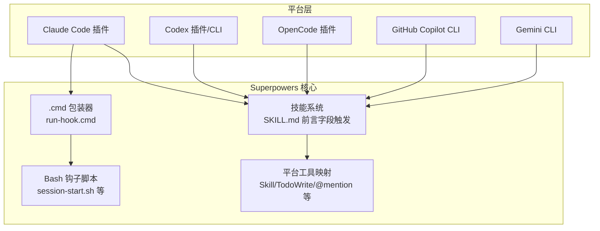
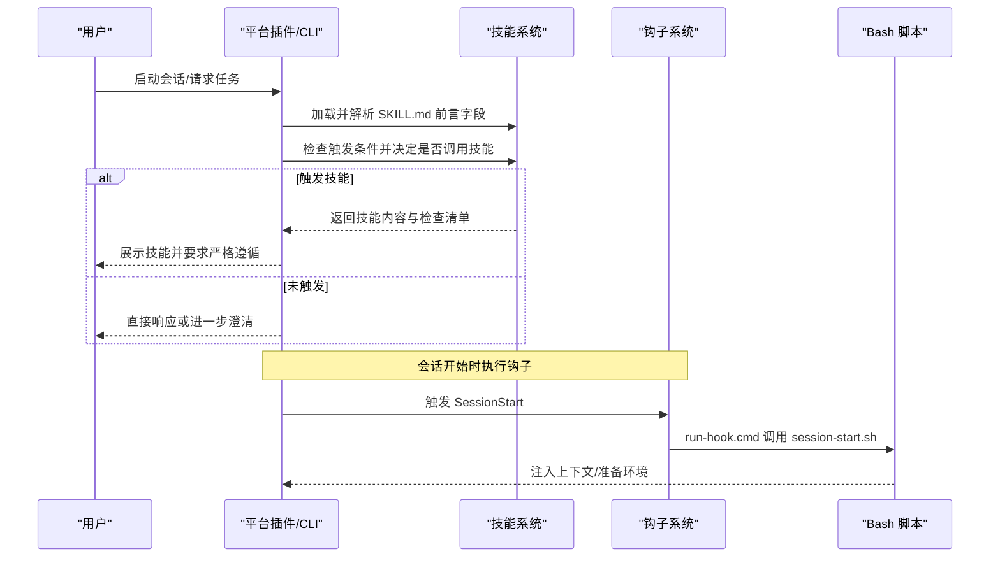
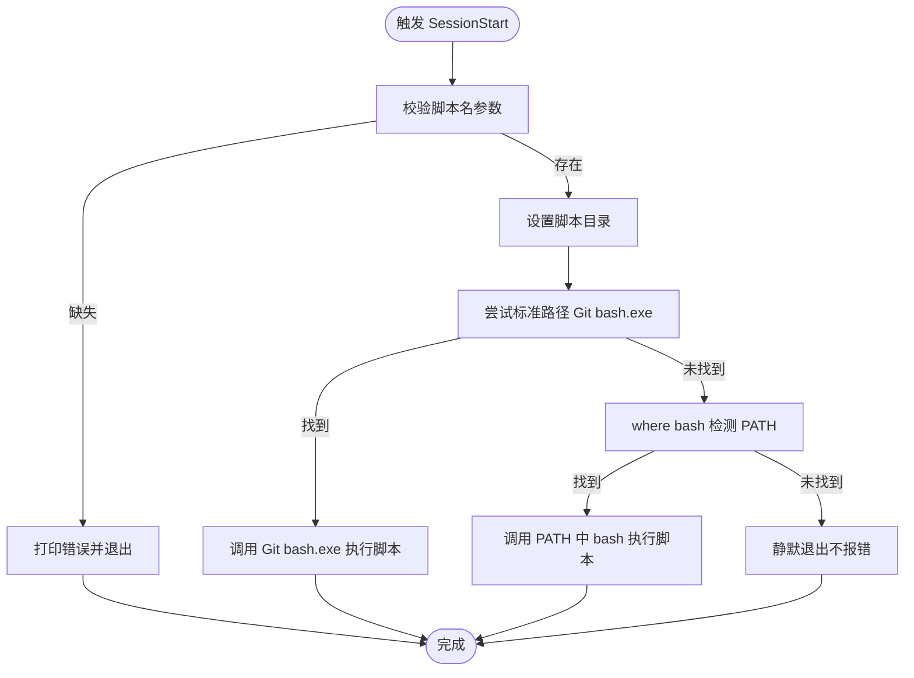
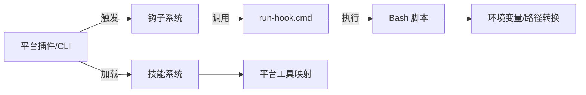

# 跨平台兼容性

<cite>
**本文档引用的文件**
- [README.md](file://README.md)
- [hooks.json](file://hooks/hooks.json)
- [run-hook.cmd](file://hooks/run-hook.cmd)
- [polyglot-hooks.md](file://docs/windows/polyglot-hooks.md)
- [README.codex.md](file://docs/README.codex.md)
- [README.opencode.md](file://docs/README.opencode.md)
- [package.json](file://package.json)
- [SKILL.md（使用 Superpowers）](file://skills/using-superpowers/SKILL.md)
- [SKILL.md（编写技能）](file://skills/writing-skills/SKILL.md)
- [.gitattributes](file://.gitattributes)
- [server.cjs](file://skills/brainstorming/scripts/server.cjs)
- [windows-lifecycle.test.sh](file://tests/brainstorm-server/windows-lifecycle.test.sh)
- [2025-11-22-opencode-support-design.md](file://docs/plans/2025-11-22-opencode-support-design.md)
- [platform_support.md](file://.github/ISSUE_TEMPLATE/platform_support.md)
</cite>

## 目录
1. [简介](#简介)
2. [项目结构](#项目结构)
3. [核心组件](#核心组件)
4. [架构总览](#架构总览)
5. [详细组件分析](#详细组件分析)
6. [依赖关系分析](#依赖关系分析)
7. [性能考量](#性能考量)
8. [故障排除指南](#故障排除指南)
9. [结论](#结论)
10. [附录](#附录)

## 简介
本文件聚焦 Superpowers 的跨平台兼容性设计与实现，围绕以下主题展开：
- 平台适配器的设计原理与实现机制：如何在不同 AI 编辑器平台（Claude Code、Codex、OpenCode、Gemini CLI、GitHub Copilot CLI）之间保持一致的行为体验。
- 钩子系统的架构、事件处理与消息传递机制：通过 polyglot 包装脚本在 Windows、macOS、Linux 上统一执行 Bash 钩子。
- 平台差异分析、兼容性挑战与解决方案：针对工具映射、路径格式、环境变量、脚本执行等差异给出策略。
- 自定义平台适配器的开发指南与最佳实践：如何为新平台接入 Superpowers 技能系统与工具生态。
- Windows、Linux、macOS 特殊考虑：包括 Git for Windows、MSYS2/Cygwin、路径转换、换行符等。

## 项目结构
Superpowers 将“技能”作为可组合的工作流单元，并通过平台特定的插件或工具系统进行加载与触发。跨平台的关键在于：
- 统一的技能描述与触发逻辑（SKILL.md 前言字段与触发条件）
- 平台工具到 Superpowers 技能的映射（如 Copilot CLI、Gemini CLI、OpenCode 的 skill 工具）
- 钩子脚本的跨平台执行包装（polyglot .cmd 包装器）

图表来源
- [README.md](file://README.md)
- [hooks.json](file://hooks/hooks.json)
- [run-hook.cmd](file://hooks/run-hook.cmd)
- [polyglot-hooks.md](file://docs/windows/polyglot-hooks.md)
- [README.codex.md](file://docs/README.codex.md)
- [README.opencode.md](file://docs/README.opencode.md)
- [SKILL.md（使用 Superpowers）](file://skills/using-superpowers/SKILL.md)

章节来源
- [README.md](file://README.md)
- [hooks.json](file://hooks/hooks.json)
- [run-hook.cmd](file://hooks/run-hook.cmd)
- [polyglot-hooks.md](file://docs/windows/polyglot-hooks.md)
- [README.codex.md](file://docs/README.codex.md)
- [README.opencode.md](file://docs/README.opencode.md)
- [SKILL.md（使用 Superpowers）](file://skills/using-superpowers/SKILL.md)

## 核心组件
- 钩子系统与 polyglot 包装器
  - hooks.json 定义会话开始等钩子事件与命令。
  - run-hook.cmd 是跨平台 polyglot 包装器，Windows 使用 Git for Windows 的 bash.exe 执行扩展名无后缀的 Bash 脚本；Unix 直接执行同名脚本。
  - polyglot-hooks.md 提供了包装器工作原理、路径转换、登录 shell 等细节。
- 技能系统与触发机制
  - SKILL.md 的 YAML frontmatter 中的 name 与 description 决定发现与触发条件。
  - using-superpowers 技能强调“在任何响应前调用相关技能”，并通过流程图指导检查清单与严格遵循。
- 平台工具映射
  - 不同平台使用不同的工具名称与加载方式：Claude Code 的 Skill 工具、Copilot CLI 的 skill 工具、Gemini CLI 的 activate_skill 工具、OpenCode 的 config 与 experimental.chat.system.transform 注入。
- 平台安装与集成
  - Codex 通过符号链接或目录映射自动发现技能。
  - OpenCode 通过插件系统自动注册技能目录并注入上下文。

章节来源
- [hooks.json](file://hooks/hooks.json)
- [run-hook.cmd](file://hooks/run-hook.cmd)
- [polyglot-hooks.md](file://docs/windows/polyglot-hooks.md)
- [SKILL.md（使用 Superpowers）](file://skills/using-superpowers/SKILL.md)
- [README.codex.md](file://docs/README.codex.md)
- [README.opencode.md](file://docs/README.opencode.md)

## 架构总览
下图展示了 Superpowers 在多平台上的整体交互：平台插件负责加载技能与工具，钩子系统在会话生命周期中注入上下文，技能根据触发条件被激活并执行。

图表来源
- [hooks.json](file://hooks/hooks.json)
- [run-hook.cmd](file://hooks/run-hook.cmd)
- [polyglot-hooks.md](file://docs/windows/polyglot-hooks.md)
- [SKILL.md（使用 Superpowers）](file://skills/using-superpowers/SKILL.md)

## 详细组件分析

### 钩子系统与消息传递
- 设计原理
  - 通过 hooks.json 定义事件（如 SessionStart）与命令（指向 .cmd 包装器），平台在生命周期节点触发。
  - run-hook.cmd 在 Windows 上优先查找 Git for Windows 的 bash.exe，其次尝试 PATH 中的 bash，找不到则静默退出但不影响插件功能。
  - polyglot 包装器采用 heredoc 语法在 CMD 与 bash 中均有效，确保同一份脚本在不同平台运行。
- 事件处理与消息传递
  - run-hook.cmd 接收脚本名参数，拼接完整路径后调用 Bash 执行。
  - Bash 脚本读取环境变量（如 CLAUDE_PLUGIN_ROOT），进行路径转换（cygpath -u）以适配 Windows。
  - .gitattributes 确保 .cmd 与 .sh 使用 LF 换行，避免跨平台差异。
- 复杂度与性能
  - 调用链开销极低，主要成本在 Bash 启动与脚本执行；对频繁触发的钩子建议复用上下文状态，减少重复 IO。
- 错误处理
  - 未找到 bash 时静默返回，保证主流程不受影响；建议在调试阶段验证 PATH 与 Git 安装路径。

图表来源
- [run-hook.cmd](file://hooks/run-hook.cmd)
- [.gitattributes](file://.gitattributes)

章节来源
- [hooks.json](file://hooks/hooks.json)
- [run-hook.cmd](file://hooks/run-hook.cmd)
- [polyglot-hooks.md](file://docs/windows/polyglot-hooks.md)
- [.gitattributes](file://.gitattributes)

### 技能系统与触发机制
- 触发条件
  - using-superpowers 强调“在任何响应前调用相关技能”，即使概率仅为 1% 也要先检查。
  - SKILL.md 的 description 字段是触发的核心：必须仅描述触发症状与情境，不得总结技能流程。
- 流程控制
  - 技能内容加载后，若包含检查清单，则逐项生成 TodoWrite 待办并严格遵循。
  - 用户显式指令优先于默认系统提示词与技能规则。
- 平台映射
  - 不同平台使用不同工具名称：Claude Code 的 Skill、Copilot CLI 的 skill、Gemini CLI 的 activate_skill、OpenCode 的 skill 工具。
  - OpenCode 通过 experimental.chat.system.transform 注入上下文，通过 config 注册技能目录。

图表来源
- [SKILL.md（使用 Superpowers）](file://skills/using-superpowers/SKILL.md)
- [README.opencode.md](file://docs/README.opencode.md)
- [README.codex.md](file://docs/README.codex.md)

章节来源
- [SKILL.md（使用 Superpowers）](file://skills/using-superpowers/SKILL.md)
- [README.opencode.md](file://docs/README.opencode.md)
- [README.codex.md](file://docs/README.codex.md)

### 平台差异分析与兼容性挑战
- 工具名称与加载方式
  - Claude Code：Skill 工具加载技能内容。
  - Copilot CLI/Gemini CLI/OpenCode：各自有 native skill 工具或扩展系统。
  - Codex：通过符号链接或目录映射自动发现技能。
- 路径与环境变量
  - Windows 使用反斜杠路径，Bash 需要 cygpath 转换；环境变量在 CMD 中需使用 %VAR% 形式。
- 脚本执行
  - Windows 默认 shell 无法直接执行 .sh 文件，必须通过包装器或 PATH 中的 bash。
- 换行符与二进制文件
  - .cmd 与 .sh 使用 LF 换行，避免在不同平台出现解析问题；图片等二进制文件标记为 binary。

章节来源
- [polyglot-hooks.md](file://docs/windows/polyglot-hooks.md)
- [.gitattributes](file://.gitattributes)
- [README.codex.md](file://docs/README.codex.md)
- [README.opencode.md](file://docs/README.opencode.md)

### 自定义平台适配器开发指南与最佳实践
- 前置条件
  - 明确平台的插件/扩展系统与工具接口，确定技能加载与触发方式。
  - 参考 using-superpowers 的触发策略：在任何可能的情况下先检查技能，再决定是否调用。
- 技能描述字段优化（CSO）
  - description 仅描述触发条件，避免总结技能流程；使用具体症状、情境与工具关键词提升搜索命中率。
  - 参考 writing-skills 的 TDD 方法论，先写压力场景（baseline），再写技能，最后重构消除理性化漏洞。
- 工具映射
  - 将平台工具名称映射到 Superpowers 技能术语（如 TodoWrite、@mention、skill 工具）。
  - 对于不支持的特性，提供降级方案或替代流程。
- 钩子与上下文注入
  - 若平台支持钩子，参考 run-hook.cmd 的 polyglot 模式，确保在 Windows 上通过 Git bash 执行 Bash 脚本。
  - 使用 CLAUDE_PLUGIN_ROOT 等环境变量时，注意路径转换与登录 shell 设置。
- 测试与验证
  - 在目标平台上进行端到端测试，覆盖技能加载、工具映射、钩子执行与上下文注入。
  - 参考 OpenCode 支持设计文档中的分阶段实现与集成测试策略。

章节来源
- [SKILL.md（编写技能）](file://skills/writing-skills/SKILL.md)
- [SKILL.md（使用 Superpowers）](file://skills/using-superpowers/SKILL.md)
- [run-hook.cmd](file://hooks/run-hook.cmd)
- [2025-11-22-opencode-support-design.md](file://docs/plans/2025-11-22-opencode-support-design.md)

### Windows、Linux、macOS 特殊考虑
- Windows
  - 依赖 Git for Windows 提供 bash.exe 与 cygpath；若安装路径非默认，需修改 run-hook.cmd 中的路径。
  - 使用 run-hook.cmd 作为钩子入口，避免直接调用 .sh 导致脚本在编辑器中打开。
  - .cmd 包装器采用 heredoc 语法，确保 CMD 与 bash 解析一致。
- Linux/macOS
  - 确保 .cmd 文件具备执行权限（chmod +x）。
  - Bash 脚本应使用纯 bash 内建命令，避免依赖 PATH 中不可用的外部工具。
- 路径与换行符
  - 使用 cygpath -u 进行路径转换，避免混合斜杠导致的路径解析问题。
  - .gitattributes 统一换行符为 LF，二进制文件标记为 binary。

章节来源
- [polyglot-hooks.md](file://docs/windows/polyglot-hooks.md)
- [run-hook.cmd](file://hooks/run-hook.cmd)
- [.gitattributes](file://.gitattributes)

## 依赖关系分析
- 平台到技能的依赖
  - 平台插件负责加载技能元数据（SKILL.md），并根据触发条件决定是否调用。
- 钩子到脚本的依赖
  - hooks.json 指向 .cmd 包装器；run-hook.cmd 依赖 Git bash 或 PATH 中的 bash。
- 脚本到环境的依赖
  - Bash 脚本依赖 CLAUDE_PLUGIN_ROOT 等环境变量，以及 cygpath（Windows）进行路径转换。
- 平台工具到技能的映射
  - 不同平台的工具名称不同，需在平台侧进行映射或通过配置注入。

图表来源
- [hooks.json](file://hooks/hooks.json)
- [run-hook.cmd](file://hooks/run-hook.cmd)
- [README.opencode.md](file://docs/README.opencode.md)
- [README.codex.md](file://docs/README.codex.md)

章节来源
- [hooks.json](file://hooks/hooks.json)
- [run-hook.cmd](file://hooks/run-hook.cmd)
- [README.opencode.md](file://docs/README.opencode.md)
- [README.codex.md](file://docs/README.codex.md)

## 性能考量
- 钩子执行成本
  - run-hook.cmd 启动 Bash 的开销较小，建议在高频触发场景中缓存上下文状态，减少重复 IO。
- 脚本健壮性
  - 在 Bash 脚本中尽量使用纯内建命令，避免外部工具查找失败导致的延迟。
- 平台加载效率
  - Codex 通过符号链接快速发现技能；OpenCode 通过插件系统自动注册，减少手动配置成本。

## 故障排除指南
- “bash 未被识别”
  - 检查 Git for Windows 是否安装在默认路径；若不在默认路径，需修改 run-hook.cmd 中的 bash.exe 路径。
- “cygpath/dirname 未找到”
  - 确保使用登录 shell（-l）以加载完整 PATH。
- “路径出现奇怪的 `\/`”
  - 使用 cygpath -u 转换整个路径，避免直接拼接导致的斜杠混用。
- “脚本在编辑器中打开而非运行”
  - 确认 hooks.json 指向 .cmd 包装器而非 .sh。
- “在终端可运行但在钩子中失败”
  - 使用模拟钩子环境的方式进行测试，确保 CLAUDE_PLUGIN_ROOT 等变量正确设置。
- “Windows 生命周期测试跳过”
  - windows-lifecycle.test.sh 会在非 Windows 环境跳过 Windows 特定步骤，属预期行为。

章节来源
- [polyglot-hooks.md](file://docs/windows/polyglot-hooks.md)
- [run-hook.cmd](file://hooks/run-hook.cmd)
- [windows-lifecycle.test.sh](file://tests/brainstorm-server/windows-lifecycle.test.sh)

## 结论
Superpowers 的跨平台兼容性建立在三要素之上：统一的技能触发机制（基于 SKILL.md 的 description）、平台工具映射（将平台工具名称映射到 Superpowers 术语）、以及跨平台钩子执行（polyglot .cmd 包装器）。通过上述设计，Superpowers 能够在 Claude Code、Codex、OpenCode、GitHub Copilot CLI、Gemini CLI 等平台上提供一致的技能体验。对于新平台的适配，建议遵循 CSO 优化技巧、严格进行端到端测试，并参考 OpenCode 支持设计文档的分阶段实现策略。

## 附录
- 平台支持请求模板：用于提交新平台支持需求，包含插件系统说明与手动安装验证记录。
- OpenCode 支持设计文档：概述从重构共享核心到构建 OpenCode 插件再到文档与打磨的完整流程。

章节来源
- [platform_support.md](file://.github/ISSUE_TEMPLATE/platform_support.md)
- [2025-11-22-opencode-support-design.md](file://docs/plans/2025-11-22-opencode-support-design.md)