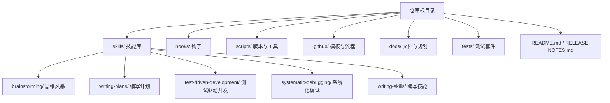
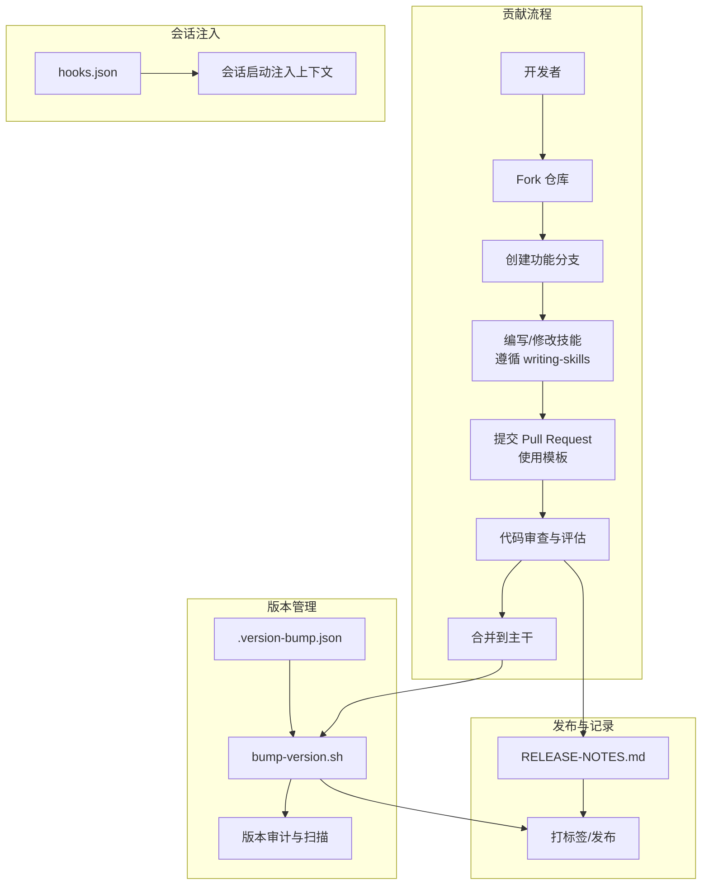
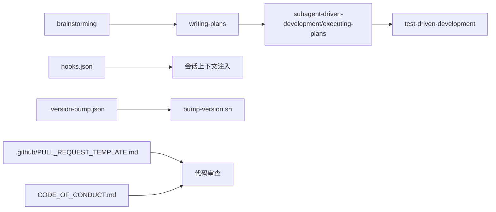

# 代码贡献流程

<cite>
**本文档引用的文件**
- [README.md](file://README.md)
- [.github/PULL_REQUEST_TEMPLATE.md](file://.github/PULL_REQUEST_TEMPLATE.md)
- [CODE_OF_CONDUCT.md](file://CODE_OF_CONDUCT.md)
- [skills/writing-skills/SKILL.md](file://skills/writing-skills/SKILL.md)
- [skills/brainstorming/SKILL.md](file://skills/brainstorming/SKILL.md)
- [skills/writing-plans/SKILL.md](file://skills/writing-plans/SKILL.md)
- [skills/test-driven-development/SKILL.md](file://skills/test-driven-development/SKILL.md)
- [skills/systematic-debugging/SKILL.md](file://skills/systematic-debugging/SKILL.md)
- [scripts/bump-version.sh](file://scripts/bump-version.sh)
- [.version-bump.json](file://.version-bump.json)
- [hooks/hooks.json](file://hooks/hooks.json)
- [package.json](file://package.json)
- [RELEASE-NOTES.md](file://RELEASE-NOTES.md)
- [.gitignore](file://.gitignore)
</cite>

## 目录
1. [简介](#简介)
2. [项目结构](#项目结构)
3. [核心组件](#核心组件)
4. [架构总览](#架构总览)
5. [详细组件分析](#详细组件分析)
6. [依赖关系分析](#依赖关系分析)
7. [性能考虑](#性能考虑)
8. [故障排除指南](#故障排除指南)
9. [结论](#结论)
10. [附录](#附录)

## 简介
本指南面向 Superpowers 项目的贡献者，系统阐述代码贡献流程、分支管理策略、Pull Request 规范与代码审查标准，并给出编码规范、命名约定、注释要求、文档更新规则、新贡献者入门路径、版本管理与发布流程等。内容基于仓库中的技能系统（skills）、工作流规范、脚本工具与模板文件整理而成，确保新老贡献者都能高效协作。

## 项目结构
Superpowers 是围绕“可组合技能”（skills）构建的开发工作流系统，核心由以下部分组成：
- 技能目录：skills/* 提供设计、计划、执行、测试、调试等全流程技能
- 工作流钩子：hooks/* 在会话启动时注入上下文
- 版本管理：scripts/bump-version.sh 与 .version-bump.json 统一版本号
- 贡献模板：.github/PULL_REQUEST_TEMPLATE.md 规范 PR 内容
- 行为准则：CODE_OF_CONDUCT.md 明确社区行为边界
- 文档与发布：RELEASE-NOTES.md 记录版本变更；README.md 提供安装与使用说明

图表来源
- [README.md:126-170](file://README.md#L126-L170)
- [skills/brainstorming/SKILL.md:1-165](file://skills/brainstorming/SKILL.md#L1-L165)
- [skills/writing-plans/SKILL.md:1-153](file://skills/writing-plans/SKILL.md#L1-L153)
- [skills/test-driven-development/SKILL.md:1-372](file://skills/test-driven-development/SKILL.md#L1-L372)
- [skills/systematic-debugging/SKILL.md:1-297](file://skills/systematic-debugging/SKILL.md#L1-L297)
- [skills/writing-skills/SKILL.md:1-656](file://skills/writing-skills/SKILL.md#L1-L656)

章节来源
- [README.md:126-170](file://README.md#L126-L170)

## 核心组件
- 贡献入口与流程
  - 参考 README 的贡献说明，遵循“编写技能”的流程进行新增或修改
  - 使用 Pull Request 模板，确保问题描述、变更说明、评估与严谨性检查完整
- 技能系统
  - brainstorming：设计前置强制门禁与自检清单
  - writing-plans：实现计划的最小任务粒度与无占位符要求
  - test-driven-development：红-绿-重构的铁律与反理性化清单
  - systematic-debugging：四阶段系统化调试与架构质疑流程
  - writing-skills：技能创作的 TDD 化流程与搜索优化（CSO）
- 钩子与上下文注入
  - hooks.json 定义会话启动钩子，确保使用 Superpowers 的上下文在首次消息前注入
- 版本管理
  - .version-bump.json 声明需要同步升级版本的文件
  - bump-version.sh 自动扫描、审计并批量提升版本号

章节来源
- [README.md:161-170](file://README.md#L161-L170)
- [.github/PULL_REQUEST_TEMPLATE.md:1-88](file://.github/PULL_REQUEST_TEMPLATE.md#L1-L88)
- [skills/brainstorming/SKILL.md:12-32](file://skills/brainstorming/SKILL.md#L12-L32)
- [skills/writing-plans/SKILL.md:106-132](file://skills/writing-plans/SKILL.md#L106-L132)
- [skills/test-driven-development/SKILL.md:31-45](file://skills/test-driven-development/SKILL.md#L31-L45)
- [skills/systematic-debugging/SKILL.md:16-23](file://skills/systematic-debugging/SKILL.md#L16-L23)
- [skills/writing-skills/SKILL.md:30-45](file://skills/writing-skills/SKILL.md#L30-L45)
- [hooks/hooks.json:1-17](file://hooks/hooks.json#L1-L17)
- [.version-bump.json:1-20](file://.version-bump.json#L1-L20)
- [scripts/bump-version.sh:1-221](file://scripts/bump-version.sh#L1-L221)

## 架构总览
Superpowers 的贡献与发布架构以“技能优先、流程强制、版本统一、审查严格”为核心原则：

图表来源
- [README.md:161-170](file://README.md#L161-L170)
- [.github/PULL_REQUEST_TEMPLATE.md:1-88](file://.github/PULL_REQUEST_TEMPLATE.md#L1-L88)
- [skills/writing-skills/SKILL.md:374-394](file://skills/writing-skills/SKILL.md#L374-L394)
- [hooks/hooks.json:1-17](file://hooks/hooks.json#L1-L17)
- [.version-bump.json:1-20](file://.version-bump.json#L1-L20)
- [scripts/bump-version.sh:94-164](file://scripts/bump-version.sh#L94-L164)
- [RELEASE-NOTES.md:1-20](file://RELEASE-NOTES.md#L1-L20)

## 详细组件分析

### 贡献流程与 Pull Request 规范
- 问题陈述：明确遇到的问题、失败模式与用户体验
- 变更说明：简洁描述改动范围与动机（避免“改进”这类模糊表述）
- 核心适用性：判断是否属于通用能力，避免将平台特定或第三方集成放入核心库
- 替代方案：说明评估过的其他路径及原因
- 多变更检查：禁止一次 PR 包含多个无关变更，必要时拆分为多个 PR
- 相关 PR：已审阅所有开放与关闭的 PR，避免重复劳动
- 环境测试：列出使用的平台、模型、版本信息
- 评估方法：描述触发会话、测试轮次、前后对比
- 严谨性：技能类变更需完成对抗压力测试；未修改经精心调优内容需有充分评估证据
- 人工复核：提交前必须有人类完整审阅完整差异

章节来源
- [.github/PULL_REQUEST_TEMPLATE.md:7-87](file://.github/PULL_REQUEST_TEMPLATE.md#L7-L87)

### 分支管理策略
- Fork 与分支
  - 基于主干 Fork 仓库，为每个功能或修复创建独立分支
  - 分支命名建议采用语义化前缀（如 feat/、fix/、docs/、chore/），便于识别与回溯
- 合并与清理
  - 合并前确保通过审查与测试
  - 合并后及时删除分支，保持仓库整洁

章节来源
- [README.md:161-170](file://README.md#L161-L170)

### 代码审查标准
- 完整性：PR 必须包含问题背景、变更内容、评估方法与严谨性声明
- 一致性：遵循技能系统的描述字段（仅触发条件，不总结流程）
- 可验证性：技能类变更需具备对抗压力测试结果
- 影响面：避免引入第三方服务或工具；平台特定内容应单独发布插件
- 重复与冗余：禁止多变更捆绑；避免对已审阅内容不做证据的修改

章节来源
- [.github/PULL_REQUEST_TEMPLATE.md:18-87](file://.github/PULL_REQUEST_TEMPLATE.md#L18-L87)

### 编码规范与命名约定
- 技能命名
  - 使用小写短横线分隔（kebab-case），仅限字母、数字与短横线
  - 描述字段（frontmatter）仅描述触发条件，不总结流程
- 文件组织
  - 技能目录扁平命名空间，支持自包含或重用工具/参考文件
  - 重用工具与大型参考文件独立文件，正文保持简洁
- 结构化文档
  - 使用“概述、何时使用、核心模式、快速参考、实现、常见错误、真实影响”等结构
- 图表与示例
  - 仅在非显而易见决策点使用流程图；示例以高质量单语言为主，避免多语言稀释

章节来源
- [skills/writing-skills/SKILL.md:95-137](file://skills/writing-skills/SKILL.md#L95-L137)
- [skills/writing-skills/SKILL.md:207-277](file://skills/writing-skills/SKILL.md#L207-L277)
- [skills/writing-skills/SKILL.md:290-323](file://skills/writing-skills/SKILL.md#L290-L323)

### 注释要求与文档更新规则
- 技能描述字段（description）必须为“触发条件”，不得总结流程
- 关键词覆盖：包含错误信息、症状、同义词与工具名称，提升搜索命中率
- 文档更新：涉及技能变更时，同步更新相关文档与测试用例
- 版本记录：发布时在 RELEASE-NOTES.md 中记录变更摘要与影响范围

章节来源
- [skills/writing-skills/SKILL.md:140-197](file://skills/writing-skills/SKILL.md#L140-L197)
- [RELEASE-NOTES.md:1-20](file://RELEASE-NOTES.md#L1-20)

### 新贡献者入门指导
- 选择任务
  - 从 README 的“基本工作流”与技能列表出发，定位需要改进或新增的环节
  - 查看 ISSUE 模板与社区公告渠道，了解当前关注点
- 学习流程
  - 阅读 skills/writing-skills/SKILL.md，掌握技能创作的 TDD 化流程
  - 参考 brainstorming、writing-plans、test-driven-development、systematic-debugging 的具体实践
- 实践步骤
  - 在个人分支上实现或修改技能，运行对抗压力测试
  - 使用 Pull Request 模板提交 PR，确保评估与严谨性检查项齐全
- 参与讨论与处理反馈
  - 积极响应审查意见，按要求补充测试与文档
  - 如需修改行为塑造内容，提供充分评估证据

章节来源
- [README.md:108-170](file://README.md#L108-L170)
- [skills/writing-skills/SKILL.md:30-45](file://skills/writing-skills/SKILL.md#L30-L45)
- [skills/brainstorming/SKILL.md:16-32](file://skills/brainstorming/SKILL.md#L16-L32)
- [skills/writing-plans/SKILL.md:106-132](file://skills/writing-plans/SKILL.md#L106-L132)
- [skills/test-driven-development/SKILL.md:31-45](file://skills/test-driven-development/SKILL.md#L31-L45)
- [skills/systematic-debugging/SKILL.md:16-23](file://skills/systematic-debugging/SKILL.md#L16-L23)

### 版本管理流程与发布周期
- 版本号同步
  - .version-bump.json 声明需要同步升级的文件（package.json、各平台插件 manifest 等）
  - bump-version.sh 支持检查漂移、审计未声明引用、批量提升版本
- 发布记录
  - RELEASE-NOTES.md 记录每次发布的变更摘要、修复与兼容性说明
- 发布节奏
  - 依据功能完成度与稳定性决定发布时机；重大变更遵循破坏性变更标注与迁移指引

章节来源
- [.version-bump.json:1-20](file://.version-bump.json#L1-L20)
- [scripts/bump-version.sh:56-92](file://scripts/bump-version.sh#L56-L92)
- [scripts/bump-version.sh:94-164](file://scripts/bump-version.sh#L94-L164)
- [RELEASE-NOTES.md:1-20](file://RELEASE-NOTES.md#L1-L20)
- [package.json:1-7](file://package.json#L1-L7)

### 变更日志维护方法
- 结构化记录
  - 每次发布在 RELEASE-NOTES.md 中新增条目，按“版本号、日期、变更类型、具体内容”
- 影响说明
  - 对破坏性变更、平台适配、性能改进、安全修复等进行重点说明
- 追踪与审计
  - 使用 bump-version.sh 的审计功能扫描仓库中未声明的版本字符串，确保一致性

章节来源
- [RELEASE-NOTES.md:1-20](file://RELEASE-NOTES.md#L1-20)
- [scripts/bump-version.sh:94-164](file://scripts/bump-version.sh#L94-L164)

## 依赖关系分析
- 技能间依赖
  - writing-plans 依赖 brainstorming 的设计文档与批准
  - subagent-driven-development 与 executing-plans 依赖 writing-plans 的任务分解
  - test-driven-development 贯穿实现过程，作为质量门禁
- 工具与配置
  - hooks.json 控制会话启动上下文注入
  - .version-bump.json 与 bump-version.sh 统一版本号
- 审查与合规
  - PR 模板强制要求人类复核与严谨性检查
  - 行为准则保障社区协作环境

图表来源
- [skills/brainstorming/SKILL.md:12-32](file://skills/brainstorming/SKILL.md#L12-L32)
- [skills/writing-plans/SKILL.md:134-153](file://skills/writing-plans/SKILL.md#L134-L153)
- [skills/test-driven-development/SKILL.md:31-45](file://skills/test-driven-development/SKILL.md#L31-L45)
- [hooks/hooks.json:1-17](file://hooks/hooks.json#L1-L17)
- [.version-bump.json:1-20](file://.version-bump.json#L1-L20)
- [scripts/bump-version.sh:166-194](file://scripts/bump-version.sh#L166-L194)
- [.github/PULL_REQUEST_TEMPLATE.md:74-87](file://.github/PULL_REQUEST_TEMPLATE.md#L74-L87)
- [CODE_OF_CONDUCT.md:1-129](file://CODE_OF_CONDUCT.md#L1-L129)

章节来源
- [skills/brainstorming/SKILL.md:12-32](file://skills/brainstorming/SKILL.md#L12-L32)
- [skills/writing-plans/SKILL.md:134-153](file://skills/writing-plans/SKILL.md#L134-L153)
- [skills/test-driven-development/SKILL.md:31-45](file://skills/test-driven-development/SKILL.md#L31-L45)
- [hooks/hooks.json:1-17](file://hooks/hooks.json#L1-L17)
- [.version-bump.json:1-20](file://.version-bump.json#L1-L20)
- [scripts/bump-version.sh:166-194](file://scripts/bump-version.sh#L166-L194)
- [.github/PULL_REQUEST_TEMPLATE.md:74-87](file://.github/PULL_REQUEST_TEMPLATE.md#L74-L87)
- [CODE_OF_CONDUCT.md:1-129](file://CODE_OF_CONDUCT.md#L1-L129)

## 性能考虑
- 上下文注入效率
  - hooks.json 将上下文注入与会话启动绑定，减少后续加载开销
- 版本管理自动化
  - bump-version.sh 批量处理与审计，降低人为疏漏导致的版本漂移风险
- 技能体积控制
  - writing-skills 强调“频繁加载的技能字数上限”，避免不必要的 token 消耗

章节来源
- [hooks/hooks.json:1-17](file://hooks/hooks.json#L1-L17)
- [scripts/bump-version.sh:56-92](file://scripts/bump-version.sh#L56-L92)
- [skills/writing-skills/SKILL.md:213-221](file://skills/writing-skills/SKILL.md#L213-L221)

## 故障排除指南
- PR 被拒常见原因
  - 描述字段总结流程而非触发条件
  - 未提供对抗压力测试证据
  - 多个无关变更捆绑
  - 修改行为塑造内容但缺乏评估证据
- 版本不一致
  - 使用 bump-version.sh --check 检测漂移
  - 使用 --audit 审计仓库中未声明的版本字符串
- 钩子执行问题
  - 确认 hooks.json 的 matcher 与 async 设置符合平台要求
  - 检查 .gitignore 是否排除了必要的工作树或临时文件

章节来源
- [.github/PULL_REQUEST_TEMPLATE.md:74-87](file://.github/PULL_REQUEST_TEMPLATE.md#L74-L87)
- [scripts/bump-version.sh:56-92](file://scripts/bump-version.sh#L56-L92)
- [scripts/bump-version.sh:94-164](file://scripts/bump-version.sh#L94-L164)
- [hooks/hooks.json:1-17](file://hooks/hooks.json#L1-L17)
- [.gitignore:1-8](file://.gitignore#L1-L8)

## 结论
Superpowers 的贡献体系以“技能优先、流程强制、版本统一、审查严格”为核心，通过标准化的 PR 模板、严格的审查标准与完善的版本管理工具，确保贡献质量与可维护性。新贡献者可从技能创作流程入手，逐步掌握设计、计划、测试与调试的完整工作流，并在社区行为准则与版本发布流程的保障下，高效推进项目演进。

## 附录
- 社区与支持
  - Discord 社区、GitHub Issues、发布通知渠道用于交流与反馈
- 平台安装与使用
  - README 提供多平台安装与验证步骤，确保贡献者能快速上手

章节来源
- [README.md:184-191](file://README.md#L184-L191)