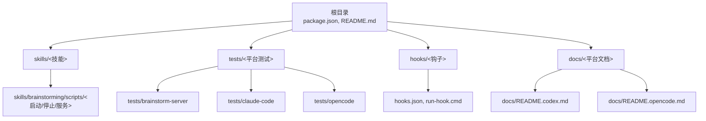
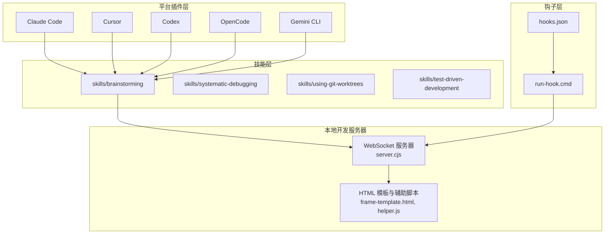
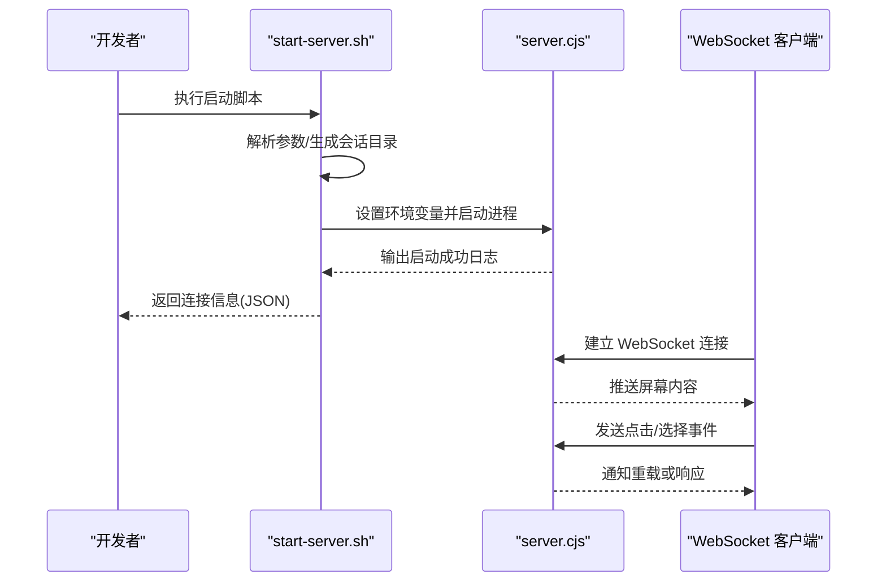
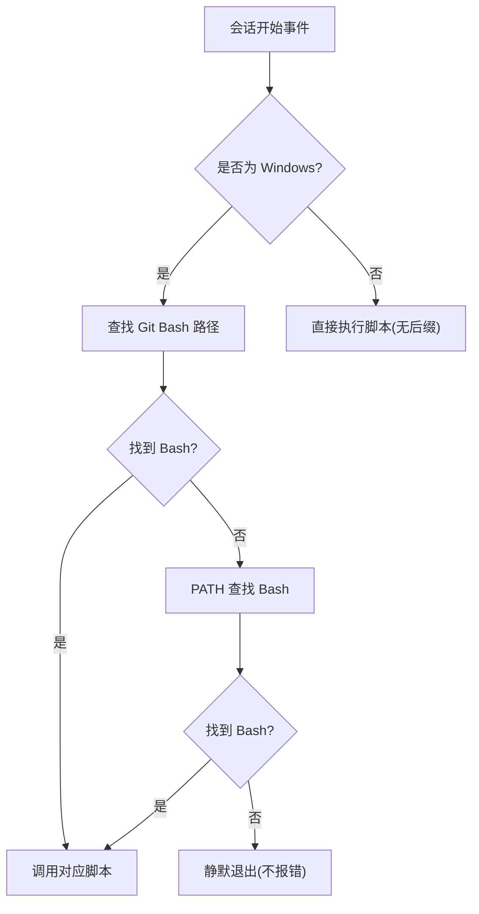
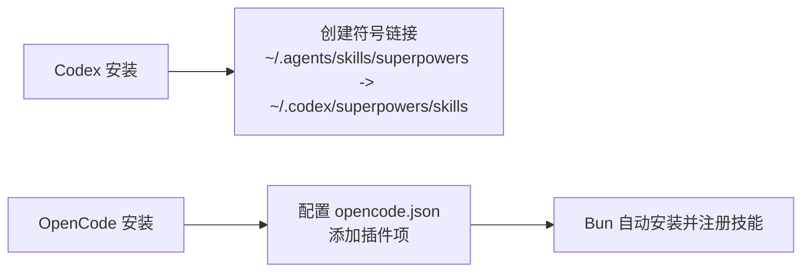
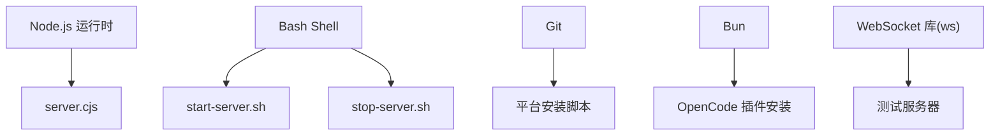

# 开发环境设置

<cite>
**本文档引用的文件**
- [package.json](file://package.json)
- [README.md](file://README.md)
- [hooks.json](file://hooks/hooks.json)
- [run-hook.cmd](file://hooks/run-hook.cmd)
- [start-server.sh](file://skills/brainstorming/scripts/start-server.sh)
- [stop-server.sh](file://skills/brainstorming/scripts/stop-server.sh)
- [server.cjs](file://skills/brainstorming/scripts/server.cjs)
- [frame-template.html](file://skills/brainstorming/scripts/frame-template.html)
- [helper.js](file://skills/brainstorming/scripts/helper.js)
- [package.json](file://tests/brainstorm-server/package.json)
- [test-helpers.sh](file://tests/claude-code/test-helpers.sh)
- [setup.sh](file://tests/opencode/setup.sh)
- [README.codex.md](file://docs/README.codex.md)
- [README.opencode.md](file://docs/README.opencode.md)
</cite>

## 目录
1. [简介](#简介)
2. [项目结构](#项目结构)
3. [核心组件](#核心组件)
4. [架构总览](#架构总览)
5. [详细组件分析](#详细组件分析)
6. [依赖关系分析](#依赖关系分析)
7. [性能考虑](#性能考虑)
8. [故障排除指南](#故障排除指南)
9. [结论](#结论)
10. [附录](#附录)

## 简介
本指南面向希望在本地搭建 Superpowers 项目的开发者，涵盖从代码克隆、依赖安装到本地开发服务器启动的完整流程。Superpowers 是一个基于可组合“技能”的软件开发工作流系统，支持多平台插件生态（Claude Code、Cursor、Codex、OpenCode、Gemini CLI 等）。本指南重点说明：
- 技术栈与运行时要求（Node.js、Bun、Git、bash 环境）
- 平台特定的安装与配置（Codex、OpenCode）
- Git 钩子与本地开发服务器（思维风暴 companion）的设置与使用
- 常见环境问题排查与解决方案

## 项目结构
仓库采用按功能域组织的目录结构，核心模块包括：
- 根目录：项目元数据与顶层文档
- skills：技能库（如 brainstorming、systematic-debugging 等）
- tests：平台测试脚本（Claude Code、OpenCode、Brainstorm Server）
- hooks：平台钩子（用于会话开始时的自动化注入）
- docs：各平台使用文档（Codex、OpenCode）

**图表来源**
- [package.json:1-7](file://package.json#L1-L7)
- [README.md:1-191](file://README.md#L1-L191)
- [hooks.json:1-17](file://hooks/hooks.json#L1-L17)
- [README.codex.md:1-127](file://docs/README.codex.md#L1-L127)
- [README.opencode.md:1-131](file://docs/README.opencode.md#L1-L131)

**章节来源**
- [package.json:1-7](file://package.json#L1-L7)
- [README.md:1-191](file://README.md#L1-L191)

## 核心组件
- 插件入口与包管理
  - 包类型为 ES Module，主入口指向 OpenCode 插件文件路径，便于在不同平台上加载。
- 思维风暴 companion 服务器
  - 提供 WebSocket 协议与静态资源服务，支持本地 HTML 屏幕推送与交互事件回传。
- Git 钩子系统
  - 在会话开始时自动执行批处理脚本，跨平台兼容 Windows 与类 Unix 环境。
- 平台适配文档
  - Codex 与 OpenCode 的手动安装与更新流程，确保技能发现与插件注册正确。

**章节来源**
- [package.json:1-7](file://package.json#L1-L7)
- [server.cjs:1-200](file://skills/brainstorming/scripts/server.cjs#L1-L200)
- [hooks.json:1-17](file://hooks/hooks.json#L1-L17)
- [README.codex.md:1-127](file://docs/README.codex.md#L1-L127)
- [README.opencode.md:1-131](file://docs/README.opencode.md#L1-L131)

## 架构总览
Superpowers 的开发环境由以下部分组成：
- 平台插件层：通过各 IDE/CLI 的插件机制加载 Superpowers。
- 技能层：以 Markdown 文件描述的可组合技能，按需激活。
- 本地开发服务器：思维风暴 companion 服务器，用于可视化设计与交互。
- 钩子层：平台提供的生命周期钩子，实现会话开始时的上下文注入。

**图表来源**
- [README.md:108-151](file://README.md#L108-L151)
- [server.cjs:1-200](file://skills/brainstorming/scripts/server.cjs#L1-L200)
- [frame-template.html:1-215](file://skills/brainstorming/scripts/frame-template.html#L1-L215)
- [helper.js:1-89](file://skills/brainstorming/scripts/helper.js#L1-L89)
- [hooks.json:1-17](file://hooks/hooks.json#L1-L17)
- [run-hook.cmd:1-47](file://hooks/run-hook.cmd#L1-L47)

## 详细组件分析

### 组件一：思维风暴 companion 服务器
该组件负责在本地启动一个 HTTP/WebSocket 服务器，用于展示设计屏幕并通过 WebSocket 接收用户交互事件。其核心职责包括：
- 解析命令行参数，生成唯一会话目录，写入状态与日志文件
- 自动检测并适配前台/后台运行模式（针对 CI 或 Windows 环境）
- 启动 Node.js 服务器，输出连接信息，并等待启动完成
- 提供静态文件服务与 WebSocket 协议处理

**图表来源**
- [start-server.sh:1-149](file://skills/brainstorming/scripts/start-server.sh#L1-L149)
- [server.cjs:1-200](file://skills/brainstorming/scripts/server.cjs#L1-L200)
- [helper.js:1-89](file://skills/brainstorming/scripts/helper.js#L1-L89)

**章节来源**
- [start-server.sh:1-149](file://skills/brainstorming/scripts/start-server.sh#L1-L149)
- [stop-server.sh:1-57](file://skills/brainstorming/scripts/stop-server.sh#L1-L57)
- [server.cjs:1-200](file://skills/brainstorming/scripts/server.cjs#L1-L200)
- [frame-template.html:1-215](file://skills/brainstorming/scripts/frame-template.html#L1-L215)
- [helper.js:1-89](file://skills/brainstorming/scripts/helper.js#L1-L89)

### 组件二：平台钩子系统
钩子系统在会话开始时自动执行批处理脚本，实现跨平台兼容的命令调用。其特点包括：
- Windows 环境优先查找 Git for Windows 的 bash，其次尝试 PATH 中的 bash
- 若未找到 bash，则静默退出（不影响插件功能）
- 类 Unix 环境直接以扩展名无后缀脚本名执行

**图表来源**
- [hooks.json:1-17](file://hooks/hooks.json#L1-L17)
- [run-hook.cmd:1-47](file://hooks/run-hook.cmd#L1-L47)

**章节来源**
- [hooks.json:1-17](file://hooks/hooks.json#L1-L17)
- [run-hook.cmd:1-47](file://hooks/run-hook.cmd#L1-L47)

### 组件三：平台安装与配置（Codex/OpenCode）
- Codex
  - 通过符号链接将技能目录暴露给 Codex，实现原生技能发现
  - 支持 Windows 使用目录连接替代符号链接
- OpenCode
  - 通过插件配置自动安装与注册技能，无需手动链接
  - 支持个人技能与项目技能优先级覆盖

**图表来源**
- [README.codex.md:1-127](file://docs/README.codex.md#L1-L127)
- [README.opencode.md:1-131](file://docs/README.opencode.md#L1-L131)

**章节来源**
- [README.codex.md:1-127](file://docs/README.codex.md#L1-L127)
- [README.opencode.md:1-131](file://docs/README.opencode.md#L1-L131)

## 依赖关系分析
- 运行时与工具链
  - Node.js：用于思维风暴 companion 服务器（server.cjs）
  - Bash：用于启动/停止脚本与钩子执行
  - Git：用于平台安装与版本控制
  - Bun：用于 OpenCode 插件自动安装（可选）
- 测试依赖
  - 测试服务器依赖 WebSocket 库
  - 平台测试脚本依赖相应 CLI 工具

**图表来源**
- [server.cjs:1-200](file://skills/brainstorming/scripts/server.cjs#L1-L200)
- [start-server.sh:1-149](file://skills/brainstorming/scripts/start-server.sh#L1-L149)
- [stop-server.sh:1-57](file://skills/brainstorming/scripts/stop-server.sh#L1-L57)
- [package.json:1-11](file://tests/brainstorm-server/package.json#L1-L11)
- [README.opencode.md:1-131](file://docs/README.opencode.md#L1-L131)

**章节来源**
- [package.json:1-7](file://package.json#L1-L7)
- [package.json:1-11](file://tests/brainstorm-server/package.json#L1-L11)

## 性能考虑
- 服务器启动与前台/后台模式
  - 在 CI 或 Windows 环境中，脚本会自动切换为前台运行，避免进程被回收导致的意外退出
- 日志与健康检查
  - 启动脚本会轮询日志文件，确认服务器存活后再返回连接信息
- 资源清理
  - 停止脚本会优雅关闭并清理临时文件；仅删除临时会话目录，持久化目录保留以便复盘

**章节来源**
- [start-server.sh:62-75](file://skills/brainstorming/scripts/start-server.sh#L62-L75)
- [start-server.sh:124-144](file://skills/brainstorming/scripts/start-server.sh#L124-L144)
- [stop-server.sh:19-51](file://skills/brainstorming/scripts/stop-server.sh#L19-L51)

## 故障排除指南
- 思维风暴服务器无法启动
  - 检查 Node.js 是否可用，确认 server.cjs 可执行
  - 在 Windows 上确认 Git for Windows 的 bash 路径存在
  - 查看日志文件中的错误信息，必要时使用前台模式启动
- WebSocket 连接失败
  - 确认服务器已输出“server-started”消息
  - 检查防火墙与绑定地址（默认 127.0.0.1），远程访问时使用 0.0.0.0
- 钩子未执行
  - 确认 hooks.json 中的匹配器与命令路径正确
  - 在 Windows 上确认 run-hook.cmd 能找到 bash 或静默退出
- Codex 技能未显示
  - 检查符号链接是否存在且指向正确的技能目录
  - 重启 Codex 以重新扫描技能
- OpenCode 插件未加载
  - 检查 opencode.json 中的插件配置
  - 查看 OpenCode 日志，确认支持 experimental.chat.system.transform 钩子
  - 更新 OpenCode 至最新版本

**章节来源**
- [start-server.sh:124-148](file://skills/brainstorming/scripts/start-server.sh#L124-L148)
- [run-hook.cmd:20-39](file://hooks/run-hook.cmd#L20-L39)
- [hooks.json:1-17](file://hooks/hooks.json#L1-L17)
- [README.codex.md:111-127](file://docs/README.codex.md#L111-L127)
- [README.opencode.md:107-131](file://docs/README.opencode.md#L107-L131)

## 结论
通过本指南，您可以在本地完成 Superpowers 的开发环境搭建，包括：
- 平台安装与配置（Codex、OpenCode）
- Git 钩子设置与本地开发服务器启动
- 常见问题的排查与解决

建议在开发过程中结合平台测试脚本进行验证，确保技能与服务器正常工作。

## 附录

### A. 环境初始化步骤（通用）
- 克隆仓库
  - 使用 Git 克隆项目至本地
- 安装依赖
  - 对于思维风暴 companion 服务器，确保 Node.js 可用
  - 对于平台测试，根据平台准备相应 CLI 工具
- 启动本地服务器
  - 使用启动脚本生成会话目录并启动服务器
  - 在浏览器中打开返回的连接地址
- 验证运行
  - 确认服务器输出“server-started”，页面可加载
  - 通过交互事件验证 WebSocket 连接

**章节来源**
- [start-server.sh:1-149](file://skills/brainstorming/scripts/start-server.sh#L1-L149)
- [server.cjs:1-200](file://skills/brainstorming/scripts/server.cjs#L1-L200)

### B. 平台特定安装清单
- Codex
  - 创建符号链接以暴露技能目录
  - Windows 使用目录连接替代符号链接
- OpenCode
  - 在 opencode.json 中添加插件配置
  - 重启 OpenCode 触发自动安装与注册

**章节来源**
- [README.codex.md:13-58](file://docs/README.codex.md#L13-L58)
- [README.opencode.md:5-16](file://docs/README.opencode.md#L5-L16)