# 开发者指南

<cite>
**本文档引用的文件**
- [README.md](file://README.md)
- [package.json](file://package.json)
- [RELEASE-NOTES.md](file://RELEASE-NOTES.md)
- [CODE_OF_CONDUCT.md](file://CODE_OF_CONDUCT.md)
- [.github/PULL_REQUEST_TEMPLATE.md](file://.github/PULL_REQUEST_TEMPLATE.md)
- [skills/writing-skills/SKILL.md](file://skills/writing-skills/SKILL.md)
- [skills/systematic-debugging/SKILL.md](file://skills/systematic-debugging/SKILL.md)
- [skills/test-driven-development/SKILL.md](file://skills/test-driven-development/SKILL.md)
- [skills/brainstorming/SKILL.md](file://skills/brainstorming/SKILL.md)
- [scripts/bump-version.sh](file://scripts/bump-version.sh)
- [hooks/hooks.json](file://hooks/hooks.json)
- [tests/skill-triggering/run-all.sh](file://tests/skill-triggering/run-all.sh)
- [tests/claude-code/run-skill-tests.sh](file://tests/claude-code/run-skill-tests.sh)
- [.gitignore](file://.gitignore)
</cite>

## 目录
1. [简介](#简介)
2. [项目结构](#项目结构)
3. [核心组件](#核心组件)
4. [架构概览](#架构概览)
5. [详细组件分析](#详细组件分析)
6. [依赖关系分析](#依赖关系分析)
7. [性能考虑](#性能考虑)
8. [故障排除指南](#故障排除指南)
9. [结论](#结论)
10. [附录](#附录)

## 简介

Superpowers 是一个基于可组合"技能"的软件开发工作流系统，专为代码代理设计。该项目采用"先设计后实现"的理念，通过一系列自动化技能确保代理按照既定流程执行开发任务。

### 核心特性
- **技能驱动的工作流**：通过可组合的技能模块化开发流程
- **多平台支持**：支持 Claude Code、Cursor、Codex、OpenCode、GitHub Copilot CLI 和 Gemini CLI
- **自动化测试集成**：内置测试框架和质量保证机制
- **版本管理**：完整的版本控制和发布流程
- **社区协作**：完善的贡献流程和行为准则

## 项目结构

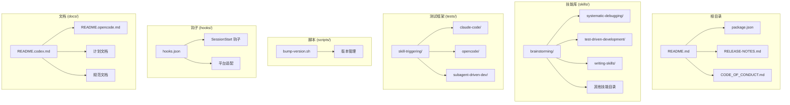

**图表来源**
- [README.md:1-191](file://README.md#L1-L191)
- [skills/brainstorming/SKILL.md:1-165](file://skills/brainstorming/SKILL.md#L1-L165)
- [tests/skill-triggering/run-all.sh:1-61](file://tests/skill-triggering/run-all.sh#L1-L61)

### 目录组织原则
- **技能按功能分组**：每个技能独立存放，便于维护和复用
- **测试覆盖全面**：包含单元测试、集成测试和端到端测试
- **文档结构清晰**：README、技术文档和示例文档分离
- **脚本工具化**：版本管理、安装配置等操作脚本化

**章节来源**
- [README.md:126-151](file://README.md#L126-L151)
- [skills/writing-skills/SKILL.md:72-92](file://skills/writing-skills/SKILL.md#L72-L92)

## 核心组件

### 技能系统架构

Superpowers 的核心是可组合的技能系统，每个技能都是独立的功能模块：

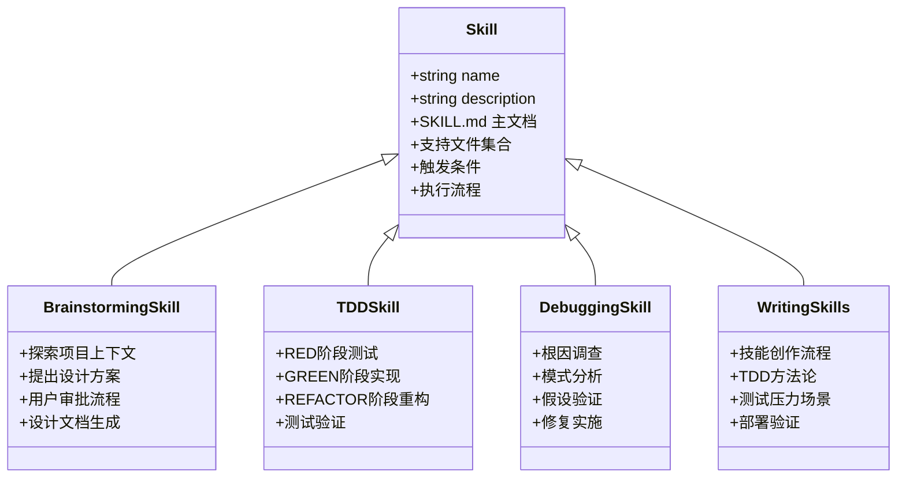

**图表来源**
- [skills/brainstorming/SKILL.md:1-165](file://skills/brainstorming/SKILL.md#L1-L165)
- [skills/test-driven-development/SKILL.md:1-372](file://skills/test-driven-development/SKILL.md#L1-L372)
- [skills/systematic-debugging/SKILL.md:1-297](file://skills/systematic-debugging/SKILL.md#L1-L297)
- [skills/writing-skills/SKILL.md:1-656](file://skills/writing-skills/SKILL.md#L1-L656)

### 平台适配层

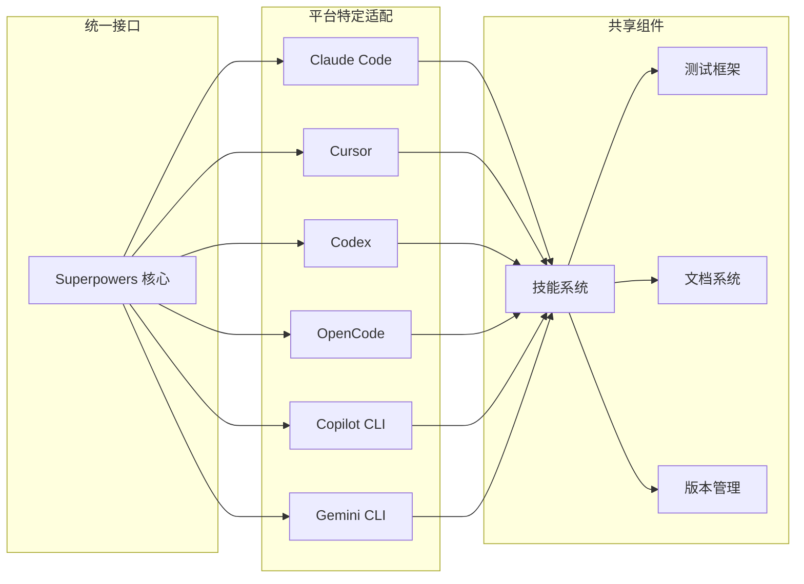

**图表来源**
- [README.md:27-106](file://README.md#L27-L106)
- [hooks/hooks.json:1-17](file://hooks/hooks.json#L1-L17)

**章节来源**
- [README.md:108-125](file://README.md#L108-L125)
- [package.json:1-7](file://package.json#L1-L7)

## 架构概览

### 整体系统架构

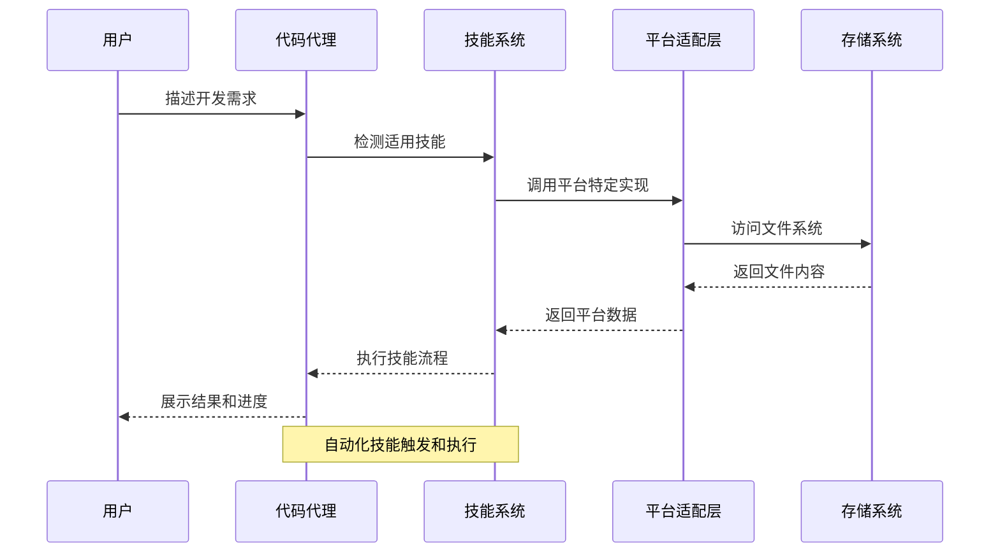

### 技能执行流程

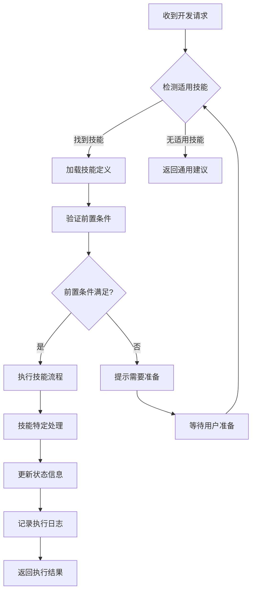

**图表来源**
- [skills/brainstorming/SKILL.md:20-33](file://skills/brainstorming/SKILL.md#L20-L33)
- [skills/writing-skills/SKILL.md:374-394](file://skills/writing-skills/SKILL.md#L374-L394)

**章节来源**
- [skills/systematic-debugging/SKILL.md:46-87](file://skills/systematic-debugging/SKILL.md#L46-L87)
- [skills/test-driven-development/SKILL.md:47-69](file://skills/test-driven-development/SKILL.md#L47-L69)

## 详细组件分析

### 设计思维技能 (Brainstorming)

设计思维技能是整个开发流程的起点，确保所有实现前都有充分的设计和规划。

#### 核心流程

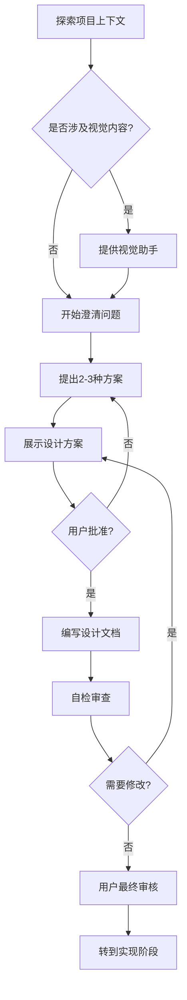

**图表来源**
- [skills/brainstorming/SKILL.md:34-66](file://skills/brainstorming/SKILL.md#L34-L66)

#### 关键特性
- **硬性约束**：在获得设计批准前不得进行任何实现活动
- **渐进式验证**：通过分段展示和用户确认确保设计质量
- **可视化支持**：可选的浏览器辅助工具用于复杂概念的可视化
- **自检机制**：内置检查清单确保设计完整性

**章节来源**
- [skills/brainstorming/SKILL.md:12-14](file://skills/brainstorming/SKILL.md#L12-L14)
- [skills/brainstorming/SKILL.md:116-124](file://skills/brainstorming/SKILL.md#L116-L124)

### 测试驱动开发技能 (Test-Driven Development)

TDD 技能确保所有代码变更都经过严格的测试验证。

#### TDD 循环

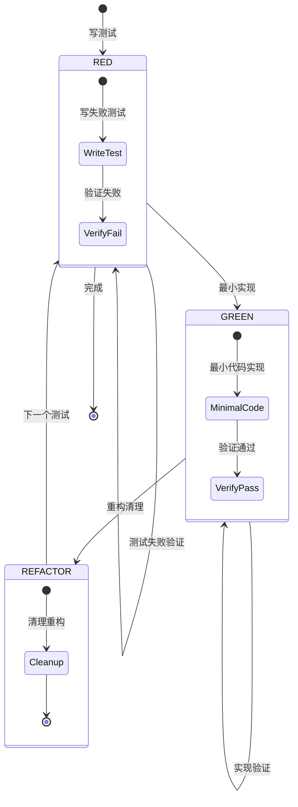

**图表来源**
- [skills/test-driven-development/SKILL.md:47-69](file://skills/test-driven-development/SKILL.md#L47-L69)

#### 核心原则
- **测试先行**：永远先写测试再写实现代码
- **最小实现**：只实现刚好能让测试通过的代码
- **持续验证**：每次修改后都要运行相关测试
- **严格标准**：不允许任何例外情况

**章节来源**
- [skills/test-driven-development/SKILL.md:31-46](file://skills/test-driven-development/SKILL.md#L31-L46)
- [skills/test-driven-development/SKILL.md:108-129](file://skills/test-driven-development/SKILL.md#L108-L129)

### 系统化调试技能 (Systematic Debugging)

系统化调试技能提供结构化的错误排查方法。

#### 四阶段调试法

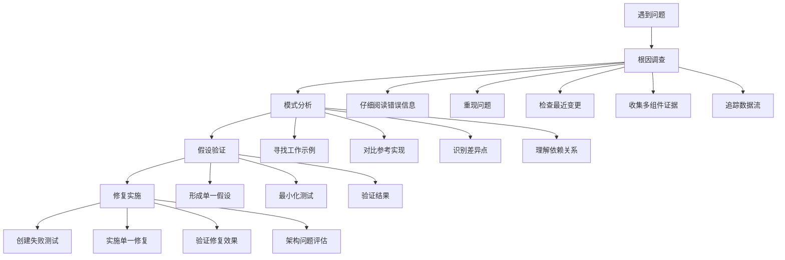

**图表来源**
- [skills/systematic-debugging/SKILL.md:46-214](file://skills/systematic-debugging/SKILL.md#L46-L214)

#### 关键策略
- **科学方法**：基于证据而非猜测进行调试
- **分层验证**：在多组件边界添加诊断工具
- **架构审视**：当多次修复无效时重新审视整体设计
- **预防措施**：建立监控和日志机制防止问题复发

**章节来源**
- [skills/systematic-debugging/SKILL.md:16-23](file://skills/systematic-debugging/SKILL.md#L16-L23)
- [skills/systematic-debugging/SKILL.md:215-233](file://skills/systematic-debugging/SKILL.md#L215-L233)

### 技能创作技能 (Writing Skills)

技能创作技能定义了如何创建和维护高质量的技能文档。

#### TDD 适配的技能开发流程

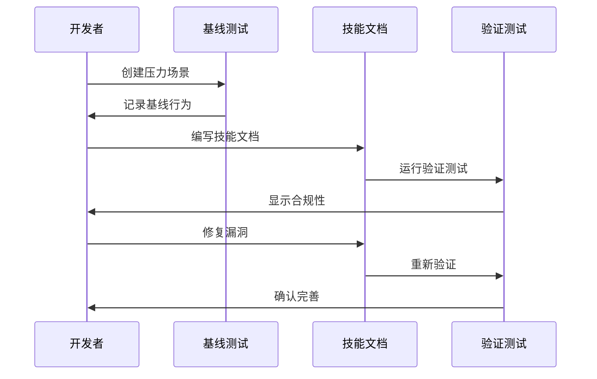

**图表来源**
- [skills/writing-skills/SKILL.md:30-45](file://skills/writing-skills/SKILL.md#L30-L45)

#### 开发原则
- **测试驱动**：先写测试后写技能文档
- **最小实现**：只解决具体问题，不添加额外内容
- **漏洞修复**：针对测试中发现的具体问题进行修复
- **搜索优化**：确保技能可以被正确发现和检索

**章节来源**
- [skills/writing-skills/SKILL.md:533-555](file://skills/writing-skills/SKILL.md#L533-L555)
- [skills/writing-skills/SKILL.md:624-634](file://skills/writing-skills/SKILL.md#L624-L634)

## 依赖关系分析

### 版本管理依赖

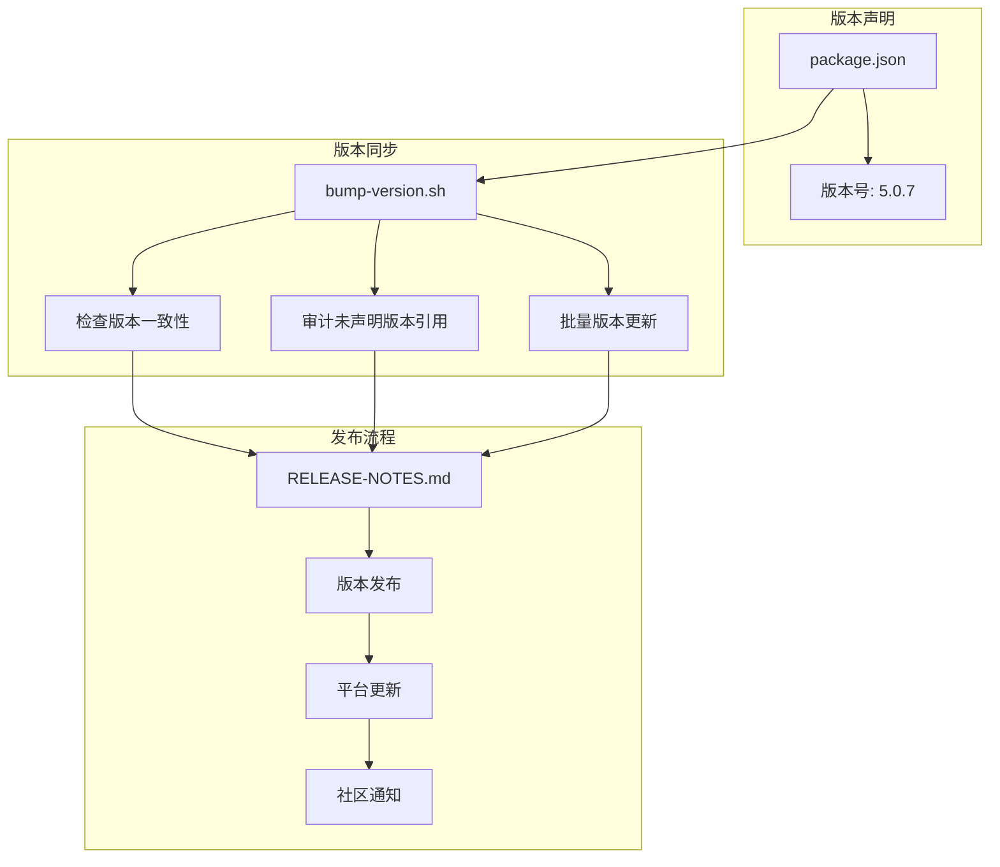

**图表来源**
- [package.json:1-7](file://package.json#L1-L7)
- [scripts/bump-version.sh:1-221](file://scripts/bump-version.sh#L1-L221)
- [RELEASE-NOTES.md:1-800](file://RELEASE-NOTES.md#L1-L800)

### 平台依赖关系

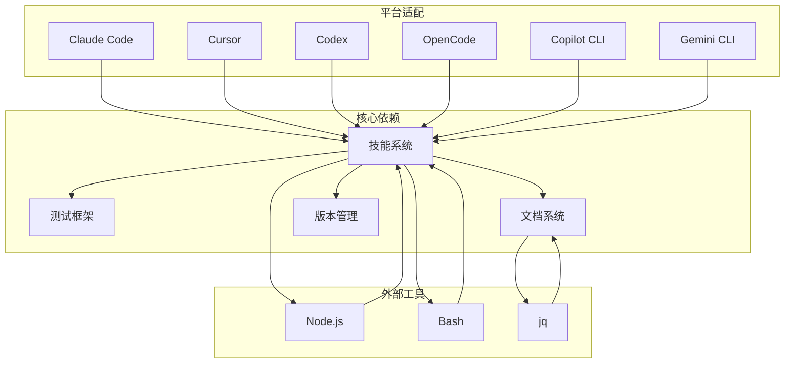

**图表来源**
- [hooks/hooks.json:1-17](file://hooks/hooks.json#L1-17)
- [README.md:27-106](file://README.md#L27-L106)

**章节来源**
- [scripts/bump-version.sh:43-53](file://scripts/bump-version.sh#L43-L53)
- [hooks/hooks.json:1-17](file://hooks/hooks.json#L1-L17)

## 性能考虑

### 技能执行优化

1. **延迟加载机制**：技能按需加载，避免不必要的资源消耗
2. **缓存策略**：对频繁访问的技能和配置进行缓存
3. **异步处理**：长耗时操作采用异步执行，提升响应速度
4. **内存管理**：及时释放不再使用的技能实例和临时数据

### 平台性能优化

1. **钩子执行效率**：优化平台钩子的执行时机和频率
2. **文件系统访问**：减少不必要的文件读写操作
3. **网络请求优化**：对远程资源访问进行缓存和重用
4. **并发控制**：合理控制同时执行的技能数量

### 资源使用监控

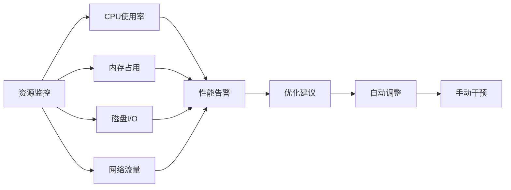

## 故障排除指南

### 常见问题诊断

#### 技能触发问题

**症状**：代理没有正确触发预期的技能
**诊断步骤**：
1. 检查技能描述中的触发条件是否匹配
2. 验证技能前置条件是否满足
3. 确认平台适配层正常工作
4. 查看技能执行日志

**解决方案**：
- 更新技能描述以更准确地反映触发条件
- 添加技能前置条件检查
- 修复平台适配层的兼容性问题

#### 版本冲突问题

**症状**：不同文件中的版本号不一致
**诊断步骤**：
1. 运行版本检查脚本
2. 分析版本漂移报告
3. 识别未声明的版本引用
4. 确定主要版本来源

**解决方案**：
- 使用版本提升脚本批量更新
- 在配置文件中声明所有版本文件
- 建立版本同步检查机制

#### 平台兼容性问题

**症状**：在特定平台上技能执行异常
**诊断步骤**：
1. 检查平台特定的适配配置
2. 验证钩子执行环境
3. 确认文件路径和权限
4. 测试跨平台兼容性

**解决方案**：
- 添加平台特定的错误处理
- 提供降级执行方案
- 增强错误报告和日志记录

**章节来源**
- [scripts/bump-version.sh:56-92](file://scripts/bump-version.sh#L56-L92)
- [tests/skill-triggering/run-all.sh:26-47](file://tests/skill-triggering/run-all.sh#L26-L47)

### 调试工具和技巧

#### 日志分析
- 使用详细的日志级别跟踪技能执行过程
- 分析平台钩子的执行时间和资源消耗
- 监控技能间的交互和依赖关系

#### 性能分析
- 使用性能分析工具识别瓶颈
- 监控内存泄漏和资源泄漏
- 分析并发执行的效率和稳定性

#### 错误恢复
- 实现优雅的错误处理和恢复机制
- 提供手动干预和回滚选项
- 建立故障转移和备用方案

## 结论

Superpowers 项目通过其精心设计的技能系统和开发流程，为代码代理提供了完整的开发工作流解决方案。项目的主要优势包括：

1. **模块化设计**：可组合的技能系统支持灵活的功能扩展
2. **质量保证**：内置的测试框架和验证机制确保代码质量
3. **平台兼容**：支持多种开发平台，提供一致的用户体验
4. **社区导向**：完善的贡献流程和行为准则促进社区发展

### 发展方向

1. **技能生态扩展**：继续丰富技能库，覆盖更多开发场景
2. **性能优化**：提升技能执行效率和资源利用率
3. **智能化增强**：利用 AI 技术提升技能的智能性和适应性
4. **生态系统建设**：建立第三方插件和工具的支持体系

## 附录

### 开发环境设置

#### 必需工具
- Node.js (版本要求)
- Bash 或 PowerShell
- jq (JSON 处理工具)
- 平台特定的开发工具

#### 环境变量
- CLAUDE_PLUGIN_ROOT：Claude Code 插件根目录
- CURSOR_PLUGIN_ROOT：Cursor 插件根目录
- COPILOT_CLI：Copilot CLI 环境标识
- GEMINI_EXTENSION_ROOT：Gemini 扩展根目录

#### 初始化步骤
1. 克隆仓库到本地
2. 安装依赖包
3. 配置平台适配
4. 验证安装结果

### 贡献指南

#### 代码贡献流程
1. Fork 仓库并创建功能分支
2. 遵循编码标准和命名约定
3. 编写测试用例和文档
4. 提交 Pull Request 并接受审查

#### 行为准则
- 尊重多样性和平等机会
- 提供建设性的反馈和帮助
- 维护开放和包容的社区环境
- 遵守专业行为标准

### 发布和版本管理

#### 版本策略
- 语义化版本控制
- 功能版本与补丁版本分离
- 兼容性破坏变更的明确标记
- 发布说明的详细记录

#### 发布流程
1. 准备发布材料
2. 运行全面测试
3. 更新版本信息
4. 创建发布标签
5. 通知社区用户

**章节来源**
- [CODE_OF_CONDUCT.md:1-129](file://CODE_OF_CONDUCT.md#L1-L129)
- [.github/PULL_REQUEST_TEMPLATE.md:1-88](file://.github/PULL_REQUEST_TEMPLATE.md#L1-L88)
- [RELEASE-NOTES.md:1-800](file://RELEASE-NOTES.md#L1-L800)