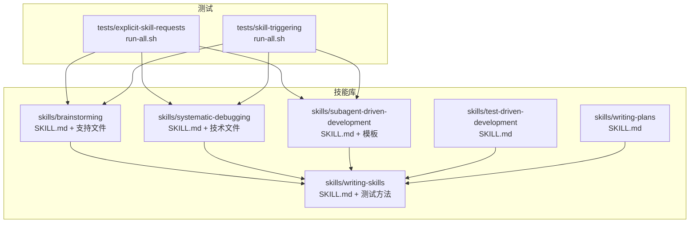
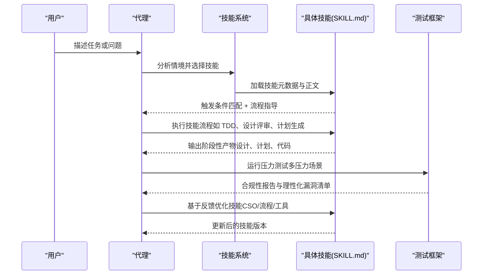
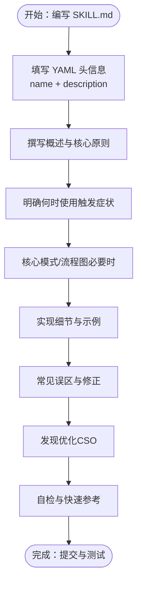
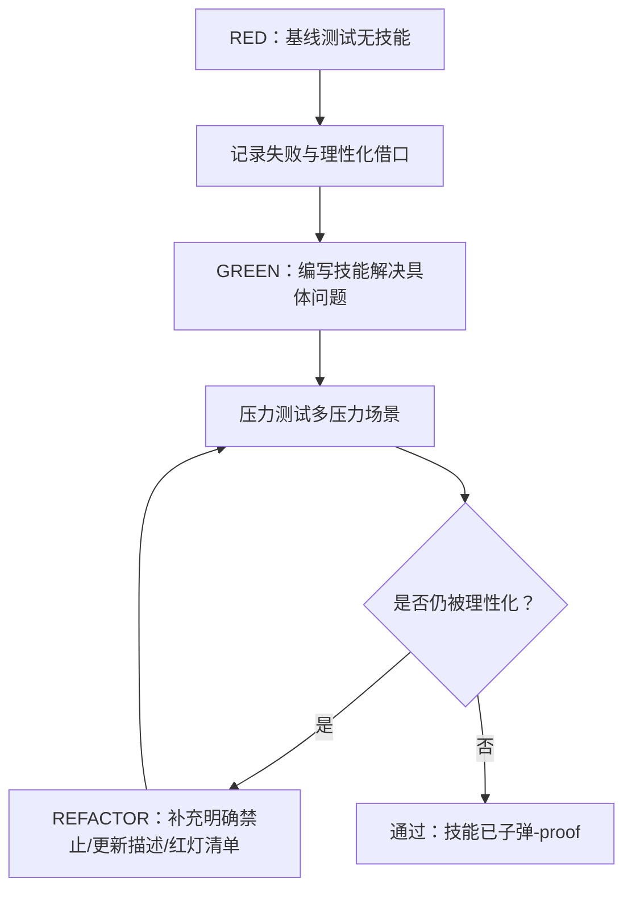
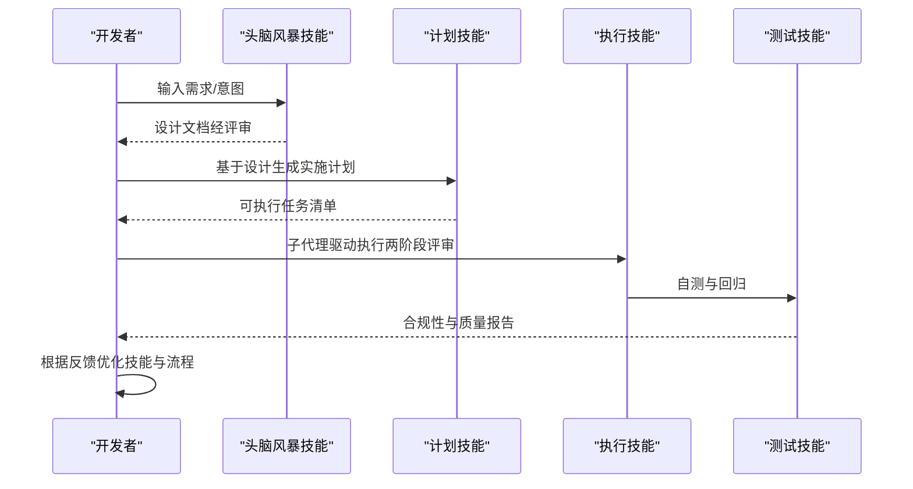
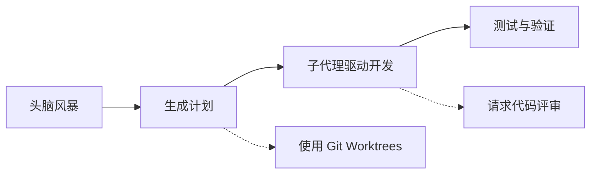
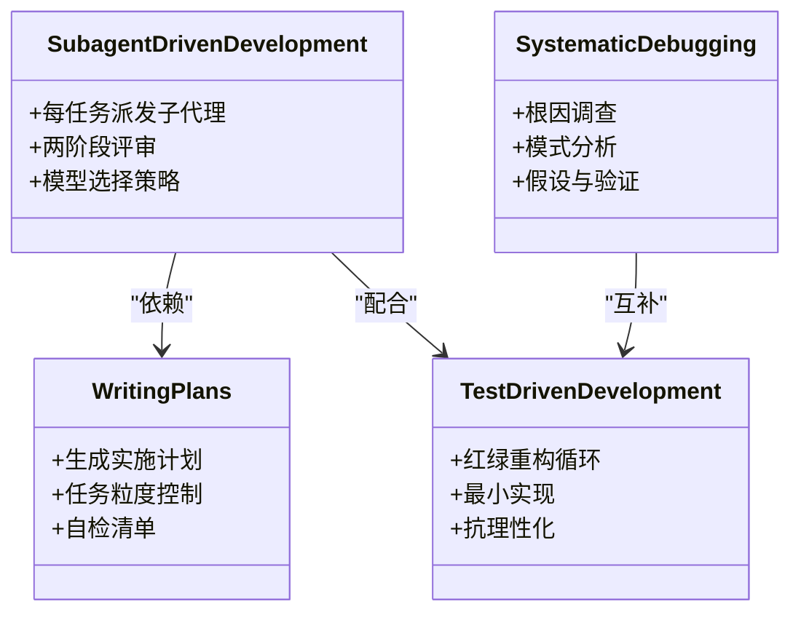
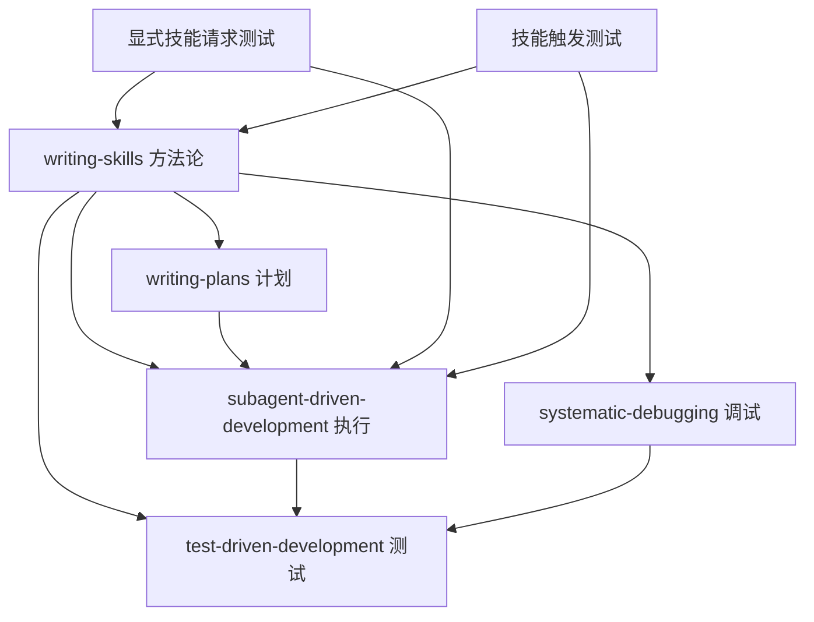

# 技能开发指南

<cite>
**本文档引用的文件**
- [README.md](file://README.md)
- [SKILL.md](file://skills/brainstorming/SKILL.md)
- [SKILL.md](file://skills/systematic-debugging/SKILL.md)
- [SKILL.md](file://skills/subagent-driven-development/SKILL.md)
- [SKILL.md](file://skills/writing-skills/SKILL.md)
- [testing-skills-with-subagents.md](file://skills/writing-skills/testing-skills-with-subagents.md)
- [anthropic-best-practices.md](file://skills/writing-skills/anthropic-best-practices.md)
- [graphviz-conventions.dot](file://skills/writing-skills/graphviz-conventions.dot)
- [render-graphs.js](file://skills/writing-skills/render-graphs.js)
- [SKILL.md](file://skills/test-driven-development/SKILL.md)
- [SKILL.md](file://skills/writing-plans/SKILL.md)
- [run-all.sh](file://tests/explicit-skill-requests/run-all.sh)
- [run-all.sh](file://tests/skill-triggering/run-all.sh)
</cite>

## 目录
1. [简介](#简介)
2. [项目结构](#项目结构)
3. [核心组件](#核心组件)
4. [架构总览](#架构总览)
5. [详细组件分析](#详细组件分析)
6. [依赖关系分析](#依赖关系分析)
7. [性能考虑](#性能考虑)
8. [故障排除指南](#故障排除指南)
9. [结论](#结论)
10. [附录](#附录)

## 简介
本指南面向希望为 Superpowers 技能系统创建新技能的开发者，提供从需求分析到实现、测试与文档编写的完整流程。内容涵盖：
- 技能模板的使用方法与结构设计
- SKILL.md 编写规范（触发条件、描述字段、流程图、示例等）
- 提示词设计与测试方法（压力场景、理性化漏洞、循环优化）
- 技能复用、组合与扩展策略
- 与现有技能的集成方式与最佳实践

Superpowers 是一个基于可组合“技能”的软件开发工作流，通过自动触发相关技能帮助代理完成从头脑风暴、计划制定、子代理驱动开发到测试与收尾的全流程。

章节来源
- [README.md:1-191](file://README.md#L1-L191)

## 项目结构
Superpowers 的技能系统采用扁平化的目录结构，每个技能位于 skills/ 目录下的独立子目录中，包含一个必需的 SKILL.md 主文档及可选的支持性文件（脚本、参考文档等）。测试体系覆盖显式技能请求与技能触发两大类场景，确保技能在真实压力下仍能正确触发与执行。



图表来源
- [README.md:126-151](file://README.md#L126-L151)
- [SKILL.md](file://skills/writing-skills/SKILL.md)

章节来源
- [README.md:126-151](file://README.md#L126-L151)

## 核心组件
- 技能模板（SKILL.md）：定义技能名称、触发条件、核心原则、流程图、实现细节、常见误区与发现优化（CSO）等。
- 测试框架：基于子代理的压力场景测试，验证技能在最大压力下的合规性与抗理性化能力。
- 工具链：Graphviz 图表渲染工具，用于将 SKILL.md 中的流程图导出为 SVG，便于可视化与分享。
- 集成技能：如 test-driven-development、writing-plans、subagent-driven-development 等，作为技能开发与执行的基础能力。

章节来源
- [SKILL.md](file://skills/writing-skills/SKILL.md)
- [testing-skills-with-subagents.md:1-385](file://skills/writing-skills/testing-skills-with-subagents.md#L1-L385)
- [graphviz-conventions.dot:1-172](file://skills/writing-skills/graphviz-conventions.dot#L1-L172)
- [render-graphs.js:1-169](file://skills/writing-skills/render-graphs.js#L1-L169)

## 架构总览
Superpowers 的技能系统遵循“触发-执行-验证-迭代”的闭环：当代理遇到特定情境时，系统自动加载相关技能；技能以清晰的流程图与步骤指导代理完成任务；测试用例在压力场景下验证技能的有效性；开发团队根据反馈持续优化技能描述、流程与工具。



图表来源
- [README.md:108-125](file://README.md#L108-L125)
- [SKILL.md](file://skills/writing-skills/SKILL.md)
- [testing-skills-with-subagents.md:30-42](file://skills/writing-skills/testing-skills-with-subagents.md#L30-L42)

## 详细组件分析

### 组件一：技能模板（SKILL.md）设计与最佳实践
- YAML 头信息：name 与 description 必填，description 应聚焦“何时使用”，避免总结流程。
- 结构化内容：概述、何时使用、核心模式、快速参考、实现细节、常见误区、实际影响。
- 发现优化（Claude Search Optimization, CSO）：关键词覆盖、触发症状、描述命名、字数控制。
- 流程图：仅在非显而易见的决策点使用 Graphviz，遵循样式约定。
- 示例与工具：优先内联简短示例，复杂工具放在单独文件并通过链接引用。



图表来源
- [SKILL.md](file://skills/writing-skills/SKILL.md)
- [anthropic-best-practices.md:144-184](file://skills/writing-skills/anthropic-best-practices.md#L144-L184)
- [graphviz-conventions.dot:1-172](file://skills/writing-skills/graphviz-conventions.dot#L1-L172)

章节来源
- [SKILL.md](file://skills/writing-skills/SKILL.md)
- [anthropic-best-practices.md:144-184](file://skills/writing-skills/anthropic-best-practices.md#L144-L184)

### 组件二：提示词设计与测试方法
- 压力场景设计：结合时间压力、沉没成本、权威、经济、疲惫、社交与实用主义等多重压力，迫使代理做出明确选择。
- 基线测试（RED）：在无技能情况下运行，记录代理行为与理性化借口，形成“理性化漏洞”清单。
- 绿灯测试（GREEN）：编写技能后再次运行相同场景，验证代理是否遵守规则。
- 回归优化（REFACTOR）：针对新出现的理性化借口补充明确禁止条款、更新描述、构建红灯清单与元测试。



图表来源
- [testing-skills-with-subagents.md:30-42](file://skills/writing-skills/testing-skills-with-subagents.md#L30-L42)
- [testing-skills-with-subagents.md:163-239](file://skills/writing-skills/testing-skills-with-subagents.md#L163-L239)

章节来源
- [testing-skills-with-subagents.md:1-385](file://skills/writing-skills/testing-skills-with-subagents.md#L1-L385)

### 组件三：技能开发流程（从需求到部署）
- 需求分析：识别触发症状、技术约束与成功标准，避免一次性处理多个子系统。
- 设计评审：提出 2-3 种方案，给出权衡与推荐，按复杂度分段呈现设计。
- 文档产出：保存到指定路径（如 docs/superpowers/specs/YYYY-MM-DD-<topic>-design.md），进行自我审查与用户评审。
- 实施准备：调用 writing-plans 生成可执行计划，确保任务粒度与可验证性。
- 部署检查：提交到版本库，必要时通过 PR 贡献回社区。



图表来源
- [SKILL.md](file://skills/brainstorming/SKILL.md)
- [SKILL.md](file://skills/writing-plans/SKILL.md)
- [SKILL.md](file://skills/subagent-driven-development/SKILL.md)
- [SKILL.md](file://skills/test-driven-development/SKILL.md)

章节来源
- [SKILL.md](file://skills/brainstorming/SKILL.md)
- [SKILL.md](file://skills/writing-plans/SKILL.md)
- [SKILL.md](file://skills/subagent-driven-development/SKILL.md)
- [SKILL.md](file://skills/test-driven-development/SKILL.md)

### 组件四：技能复用、组合与扩展
- 技能复用：通过交叉引用其他技能（如 subagent-driven-development 依赖 writing-plans），减少重复文档与上下文污染。
- 技能组合：在同一流程中顺序调用多个技能（如先 brainstorming 再 writing-plans 再 subagent-driven-development），形成端到端工作流。
- 技能扩展：新增技能时遵循统一的 SKILL.md 结构与测试方法，保持发现优化一致性和工具链可用性。



图表来源
- [README.md:108-125](file://README.md#L108-L125)
- [SKILL.md](file://skills/subagent-driven-development/SKILL.md)

章节来源
- [README.md:108-125](file://README.md#L108-L125)
- [SKILL.md](file://skills/subagent-driven-development/SKILL.md)

### 组件五：与现有技能的集成策略
- 强制前置技能：如 subagent-driven-development 明确要求使用 writing-plans 生成的计划。
- 可选增强技能：如 systematic-debugging 与 verification-before-completion 在调试与收尾阶段提供保障。
- 工具链协同：使用 render-graphs.js 将 SKILL.md 中的 Graphviz 流程图导出为 SVG，提升沟通效率。



图表来源
- [SKILL.md](file://skills/writing-plans/SKILL.md)
- [SKILL.md](file://skills/subagent-driven-development/SKILL.md)
- [SKILL.md](file://skills/systematic-debugging/SKILL.md)
- [SKILL.md](file://skills/test-driven-development/SKILL.md)

章节来源
- [SKILL.md](file://skills/writing-plans/SKILL.md)
- [SKILL.md](file://skills/subagent-driven-development/SKILL.md)
- [SKILL.md](file://skills/systematic-debugging/SKILL.md)
- [SKILL.md](file://skills/test-driven-development/SKILL.md)

## 依赖关系分析
- 技能之间的依赖：writing-skills 为技能作者提供方法论；writing-plans 为实施提供结构化计划；subagent-driven-development 为执行提供自动化流程；test-driven-development 为质量提供保障；systematic-debugging 为问题定位提供系统方法。
- 测试对技能的依赖：显式技能请求测试与技能触发测试共同验证技能在真实对话中的触发与执行效果。



图表来源
- [run-all.sh:1-71](file://tests/explicit-skill-requests/run-all.sh#L1-L71)
- [run-all.sh:1-61](file://tests/skill-triggering/run-all.sh#L1-L61)

章节来源
- [run-all.sh:1-71](file://tests/explicit-skill-requests/run-all.sh#L1-L71)
- [run-all.sh:1-61](file://tests/skill-triggering/run-all.sh#L1-L61)

## 性能考虑
- 上下文窗口优化：SKILL.md 应尽量简洁，避免不必要的冗余，确保在加载时不影响对话历史与其它上下文。
- 流程图渲染：使用 render-graphs.js 将流程图导出为 SVG，便于人类伙伴理解，同时减少重复加载。
- 压力测试开销：在保证覆盖率的前提下，合理设计压力场景数量与强度，避免过度测试导致资源浪费。

## 故障排除指南
- 技能未触发：检查 description 是否准确描述触发症状，避免总结流程；确认 CSO 关键词覆盖是否充分。
- 技能被理性化绕过：在技能中添加明确禁止条款、构建红灯清单，并在测试中反复验证。
- 流程图不清晰：遵循 graphviz-conventions.dot 的样式约定，仅在必要时使用流程图，避免代码块与流程混用。
- 测试失败：对照 testing-skills-with-subagents.md 的检查清单逐项核对，补充压力场景与反例。

章节来源
- [SKILL.md](file://skills/writing-skills/SKILL.md)
- [testing-skills-with-subagents.md:308-331](file://skills/writing-skills/testing-skills-with-subagents.md#L308-L331)
- [graphviz-conventions.dot:1-172](file://skills/writing-skills/graphviz-conventions.dot#L1-L172)

## 结论
通过严格遵循 SKILL.md 结构与 CSO、采用压力测试与理性化漏洞管理、结合现有技能的组合与扩展，可以高效地创建高质量、可维护且易于发现的技能。建议在每次技能变更后进行回归测试与元测试，确保在最大压力下仍能保持合规与稳定。

## 附录
- 流程图渲染工具：使用 render-graphs.js 将 SKILL.md 中的 ```dot 区块渲染为 SVG，支持单独渲染与合并渲染两种模式。
- 测试脚本：显式技能请求测试与技能触发测试脚本分别验证技能在不同触发方式下的表现。

章节来源
- [render-graphs.js:1-169](file://skills/writing-skills/render-graphs.js#L1-L169)
- [run-all.sh:1-71](file://tests/explicit-skill-requests/run-all.sh#L1-L71)
- [run-all.sh:1-61](file://tests/skill-triggering/run-all.sh#L1-L61)