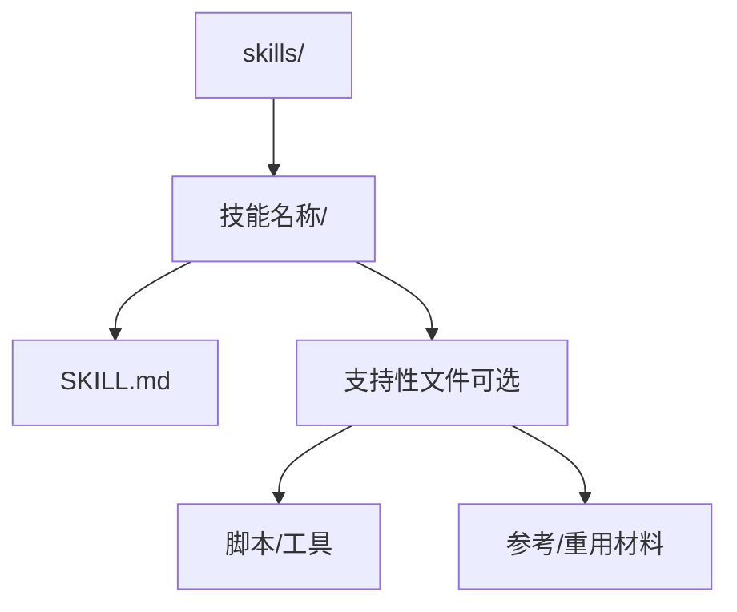
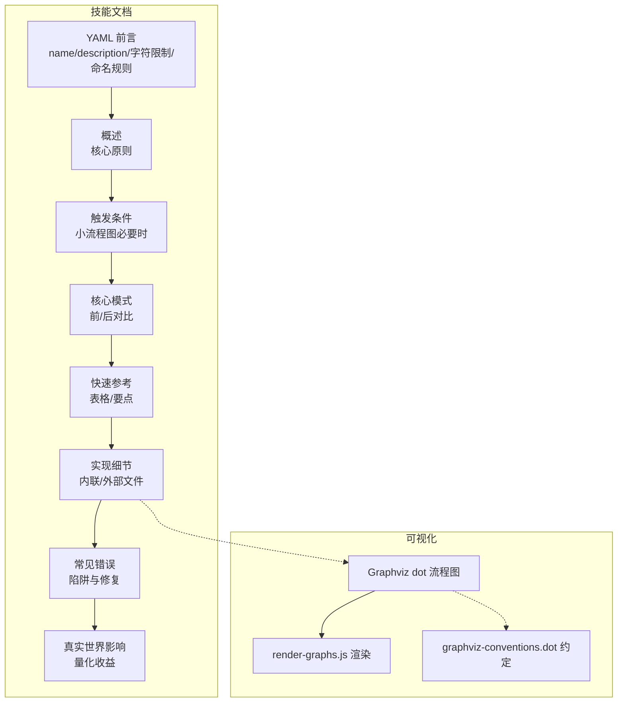
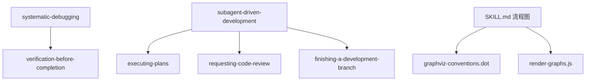

# 技能模板与结构规范

<cite>
**本文引用的文件**
- [skills/brainstorming/SKILL.md](file://skills/brainstorming/SKILL.md)
- [skills/writing-skills/SKILL.md](file://skills/writing-skills/SKILL.md)
- [skills/writing-skills/graphviz-conventions.dot](file://skills/writing-skills/graphviz-conventions.dot)
- [skills/writing-skills/render-graphs.js](file://skills/writing-skills/render-graphs.js)
- [skills/systematic-debugging/SKILL.md](file://skills/systematic-debugging/SKILL.md)
- [skills/dispatching-parallel-agents/SKILL.md](file://skills/dispatching-parallel-agents/SKILL.md)
- [skills/executing-plans/SKILL.md](file://skills/executing-plans/SKILL.md)
- [skills/requesting-code-review/SKILL.md](file://skills/requesting-code-review/SKILL.md)
- [skills/subagent-driven-development/SKILL.md](file://skills/subagent-driven-development/SKILL.md)
- [skills/writing-skills/anthropic-best-practices.md](file://skills/writing-skills/anthropic-best-practices.md)
- [skills/writing-skills/persuasion-principles.md](file://skills/writing-skills/persuasion-principles.md)
- [skills/writing-skills/testing-skills-with-subagents.md](file://skills/writing-skills/testing-skills-with-subagents.md)
</cite>

## 目录
1. [简介](#简介)
2. [项目结构](#项目结构)
3. [核心组件](#核心组件)
4. [架构总览](#架构总览)
5. [详细组件分析](#详细组件分析)
6. [依赖关系分析](#依赖关系分析)
7. [性能考量](#性能考量)
8. [故障排查指南](#故障排查指南)
9. [结论](#结论)
10. [附录](#附录)

## 简介
本文件系统化梳理 Superpowers 技能模板与结构规范，聚焦 SKILL.md 的标准格式与必需字段，尤其是 YAML 前言（frontmatter）的严格规范（name 与 description 字段要求、字符限制、命名规则），并全面阐述技能文档的完整结构：概述部分的核心原则表达、触发条件的精确描述、核心模式的前后对比、快速参考表格的设计、实现细节的组织方式、常见错误的预防措施，以及可选的真实世界影响部分。同时给出目录结构的最佳实践，包括扁平命名空间的设计理念、重型参考资料与可重用工具的分离策略、内联内容与外部文件的选择原则。最后提供具体代码示例与反面案例，展示如何正确使用 Graphviz 进行流程图可视化，以及如何通过 render-graphs.js 工具生成 SVG 图表。

## 项目结构
Superpowers 的技能采用“扁平命名空间”的目录结构，所有技能位于 skills/ 下的独立子目录中，每个技能目录包含一个 SKILL.md 主文档及按需拆分的辅助文件。该设计便于检索、测试与维护，符合“按需加载”的渐进披露模式。



图表来源
- [skills/writing-skills/SKILL.md:72-92](file://skills/writing-skills/SKILL.md#L72-L92)

章节来源
- [skills/writing-skills/SKILL.md:72-92](file://skills/writing-skills/SKILL.md#L72-L92)

## 核心组件
- YAML 前言（frontmatter）
  - 必填字段：name、description
  - 字符限制：总长度不超过 1024 字符
  - 命名规则：仅允许字母、数字与连字符；避免括号与特殊字符
  - 描述规范：第三人称、仅描述触发条件（何时使用），不总结流程或工作流
- 文档主体结构
  - 概述：核心原则与一句话定位
  - 触发条件：小而清晰的决策流程图（非显而易见时）
  - 核心模式：技术型/模式型的“前/后”对比
  - 快速参考：表格或要点清单，便于扫描
  - 实现细节：内联简单代码片段；复杂参考或可重用工具链接到外部文件
  - 常见错误：典型陷阱与修复建议
  - 可选：真实世界影响（量化收益与成本）
- 流程图与可视化
  - 使用 Graphviz 的 dot 语法编写流程图
  - 通过 render-graphs.js 将 SKILL.md 中的 ```dot 区块渲染为 SVG
  - 遵循 graphviz-conventions.dot 的样式与节点形状约定

章节来源
- [skills/writing-skills/SKILL.md:95-137](file://skills/writing-skills/SKILL.md#L95-L137)
- [skills/writing-skills/SKILL.md:290-323](file://skills/writing-skills/SKILL.md#L290-L323)
- [skills/writing-skills/graphviz-conventions.dot:1-172](file://skills/writing-skills/graphviz-conventions.dot#L1-L172)
- [skills/writing-skills/render-graphs.js:1-169](file://skills/writing-skills/render-graphs.js#L1-L169)

## 架构总览
下图展示了技能文档的结构化视图，强调“触发条件 → 决策点 → 核心模式 → 快速参考 → 实现细节 → 常见错误 → 真实世界影响”的完整闭环，以及与 Graphviz 可视化的集成。



图表来源
- [skills/writing-skills/SKILL.md:95-137](file://skills/writing-skills/SKILL.md#L95-L137)
- [skills/writing-skills/graphviz-conventions.dot:1-172](file://skills/writing-skills/graphviz-conventions.dot#L1-L172)
- [skills/writing-skills/render-graphs.js:1-169](file://skills/writing-skills/render-graphs.js#L1-L169)

## 详细组件分析

### YAML 前言（frontmatter）规范
- 字段要求
  - name：技能名称，仅允许字母、数字与连字符；避免括号与特殊字符
  - description：第三人称、仅描述触发条件（何时使用），不总结流程或工作流
- 字符限制
  - frontmatter 总长度不超过 1024 字符
- 命名与描述最佳实践
  - 使用主动语态与动名词形式（如 condition-based-waiting）
  - 描述应包含具体症状、情境与触发场景，避免抽象与技术细节
  - 避免在 description 中总结技能流程，否则可能导致 Claude 跳过正文直接执行流程

章节来源
- [skills/writing-skills/SKILL.md:95-104](file://skills/writing-skills/SKILL.md#L95-L104)
- [skills/writing-skills/SKILL.md:140-197](file://skills/writing-skills/SKILL.md#L140-L197)

### 触发条件与决策流程
- 当“是否使用该技能”的判断存在歧义或非显而易见时，应在“触发条件”部分插入小型内联流程图，帮助 Claude 在多选项之间做出正确选择
- 流程图节点形状与标签遵循约定：问题用菱形，动作用盒子，命令用纯文本，状态用椭圆，警告用八角形，入口/出口用双圆圈
- 边标签用于二元分支（yes/no）或多选（condition A/B/C/otherwise），以及触发关系（triggers）

章节来源
- [skills/writing-skills/SKILL.md:116-121](file://skills/writing-skills/SKILL.md#L116-L121)
- [skills/writing-skills/SKILL.md:290-316](file://skills/writing-skills/SKILL.md#L290-L316)
- [skills/writing-skills/graphviz-conventions.dot:1-172](file://skills/writing-skills/graphviz-conventions.dot#L1-L172)

### 核心模式：前后对比
- 技术型/模式型技能应提供“前/后”对比，展示错误做法与正确做法的差异
- 前后对比应简洁明确，突出关键差异点与改进动机
- 对于复杂流程，可在 SKILL.md 中嵌入流程图，或在外部文件中提供详细步骤

章节来源
- [skills/writing-skills/SKILL.md:122-124](file://skills/writing-skills/SKILL.md#L122-L124)
- [skills/brainstorming/SKILL.md:34-64](file://skills/brainstorming/SKILL.md#L34-L64)

### 快速参考表格
- 快速参考应以表格或要点清单呈现，便于扫描与检索
- 表格应包含“关键活动/成功标准”，并在“触发条件”与“核心模式”之后出现
- 对于较长的参考材料，应拆分为独立文件并通过链接引用，保持 SKILL.md 的简洁性

章节来源
- [skills/writing-skills/SKILL.md:125-127](file://skills/writing-skills/SKILL.md#L125-L127)
- [skills/systematic-debugging/SKILL.md:258-266](file://skills/systematic-debugging/SKILL.md#L258-L266)

### 实现细节的组织方式
- 内联：适用于简单代码片段（<50 行）、概念性说明与原则
- 外部文件：适用于重型参考（100+ 行）、可重用工具与模板
- 分离策略
  - 重型参考：API 文档、综合语法指南等
  - 可重用工具：脚本、实用程序、模板
- 目录结构
  - 扁平命名空间：所有技能在 skills/ 下的一级目录中
  - 支持性文件：仅在确有必要时引入，避免过度嵌套

章节来源
- [skills/writing-skills/SKILL.md:84-92](file://skills/writing-skills/SKILL.md#L84-L92)
- [skills/writing-skills/SKILL.md:347-373](file://skills/writing-skills/SKILL.md#L347-L373)

### 常见错误与预防措施
- 反面案例
  - 在 description 中总结流程或工作流
  - 使用模糊触发条件（如“异步测试”）
  - 在 SKILL.md 中重复其他技能已覆盖的内容
  - 使用通用标签（如 step1、helper2）而非语义化标签
- 预防措施
  - 使用“触发条件优先”的描述范式
  - 通过交叉引用减少重复
  - 采用语义化标签与正确的节点形状
  - 保持 frontmatter 简洁并遵守字符限制

章节来源
- [skills/writing-skills/SKILL.md:150-172](file://skills/writing-skills/SKILL.md#L150-L172)
- [skills/writing-skills/SKILL.md:174-197](file://skills/writing-skills/SKILL.md#L174-L197)
- [skills/writing-skills/SKILL.md:562-582](file://skills/writing-skills/SKILL.md#L562-L582)
- [skills/writing-skills/graphviz-conventions.dot:147-172](file://skills/writing-skills/graphviz-conventions.dot#L147-L172)

### 真实世界影响（可选）
- 展示技能在实际调试、开发与评审中的量化收益，如首次修复率、节省时间、降低新缺陷引入概率等
- 作为技能价值的佐证，增强团队采纳意愿与一致性

章节来源
- [skills/systematic-debugging/SKILL.md:290-297](file://skills/systematic-debugging/SKILL.md#L290-L297)
- [skills/dispatching-parallel-agents/SKILL.md:175-183](file://skills/dispatching-parallel-agents/SKILL.md#L175-L183)

### Graphviz 可视化与 render-graphs.js
- 在 SKILL.md 中使用 ```dot 区块定义流程图
- 使用 render-graphs.js 提取 SKILL.md 中的 ```dot 区块并渲染为 SVG
- 支持单独渲染每个图或合并为一个 SVG
- 依赖 graphviz（dot）命令可用

```mermaid
sequenceDiagram
participant Dev as "开发者"
participant Tool as "render-graphs.js"
participant FS as "文件系统"
participant Dot as "graphviz(dot)"
Dev->>Tool : 传入技能目录参数
Tool->>FS : 读取 SKILL.md
Tool->>Tool : 提取
```dot 区块
  Tool->>Dot: 调用 dot -Tsvg 渲染
  Dot-->>Tool: 返回 SVG 字节流
  Tool->>FS: 写入 diagrams/<name>.svg
  Tool-->>Dev: 输出渲染结果路径
```

图表来源
- [skills/writing-skills/render-graphs.js:1-169](file://skills/writing-skills/render-graphs.js#L1-L169)

章节来源
- [skills/writing-skills/SKILL.md:318-323](file://skills/writing-skills/SKILL.md#L318-L323)
- [skills/writing-skills/render-graphs.js:1-169](file://skills/writing-skills/render-graphs.js#L1-L169)
- [skills/writing-skills/graphviz-conventions.dot:1-172](file://skills/writing-skills/graphviz-conventions.dot#L1-L172)

### 技能类型与测试方法
- 技能类型
  - 技术型：具体方法与步骤（如 condition-based-waiting、root-cause-tracing）
  - 模式型：思维模型（如 flatten-with-flags、test-invariants）
  - 参考型：API 文档、语法指南、工具文档
- 测试方法（RED-GREEN-REFACTOR）
  - RED：压力场景（3+ 压力组合）+ 无技能基线 + 记录具体理性化
  - GREEN：针对具体失败点写最小化技能 + 压力验证
  - REFACTOR：发现新理性化 → 明确反例与红灯清单 → 更新描述与关键词 → 再验证
- 适用场景
  - 纪律约束型技能（TDD、verification-before-completion、designing-before-coding）
  - 技术型技能（应用场景、变体场景、缺失信息测试）
  - 模式型技能（识别、应用、反例）
  - 参考型技能（检索、应用、缺口测试）

章节来源
- [skills/writing-skills/SKILL.md:395-443](file://skills/writing-skills/SKILL.md#L395-L443)
- [skills/writing-skills/testing-skills-with-subagents.md:30-42](file://skills/writing-skills/testing-skills-with-subagents.md#L30-L42)
- [skills/writing-skills/testing-skills-with-subagents.md:43-89](file://skills/writing-skills/testing-skills-with-subagents.md#L43-L89)
- [skills/writing-skills/testing-skills-with-subagents.md:163-239](file://skills/writing-skills/testing-skills-with-subagents.md#L163-L239)

### 目录结构最佳实践
- 扁平命名空间
  - 所有技能在 skills/ 下一级目录中，便于搜索与引用
- 重型参考与可重用工具分离
  - 重型参考（100+ 行）与可重用工具（脚本、模板）放入独立文件
  - SKILL.md 保持内联简洁（原则、概念、<50 行代码）
- 内联内容与外部文件选择原则
  - 内联：原则、概念、简短代码片段
  - 外部：API 文档、综合语法、脚本与模板
- 命名与描述优化
  - 使用动名词命名（如 condition-based-waiting）
  - description 仅描述触发条件，避免总结流程
  - 关键词覆盖：错误信息、症状、同义词、工具名

章节来源
- [skills/writing-skills/SKILL.md:72-92](file://skills/writing-skills/SKILL.md#L72-L92)
- [skills/writing-skills/SKILL.md:84-92](file://skills/writing-skills/SKILL.md#L84-L92)
- [skills/writing-skills/SKILL.md:207-277](file://skills/writing-skills/SKILL.md#L207-L277)
- [skills/writing-skills/anthropic-best-practices.md:144-184](file://skills/writing-skills/anthropic-best-practices.md#L144-L184)

## 依赖关系分析
- 技能之间的依赖
  - 子代理驱动开发（subagent-driven-development）依赖“执行计划（executing-plans）”、“请求代码评审（requesting-code-review）”、“完成开发分支（finishing-a-development-branch）”等技能
  - 系统化调试（systematic-debugging）与“验证完成前（verification-before-completion）”等技能协同
- 可视化工具链
  - SKILL.md 中的 ```dot 区块依赖 graphviz-conventions.dot 的样式约定
  - render-graphs.js 从 SKILL.md 提取 ```dot 并调用 graphviz（dot）渲染为 SVG



图表来源
- [skills/systematic-debugging/SKILL.md:286-289](file://skills/systematic-debugging/SKILL.md#L286-L289)
- [skills/subagent-driven-development/SKILL.md:265-278](file://skills/subagent-driven-development/SKILL.md#L265-L278)
- [skills/writing-skills/graphviz-conventions.dot:1-172](file://skills/writing-skills/graphviz-conventions.dot#L1-L172)
- [skills/writing-skills/render-graphs.js:1-169](file://skills/writing-skills/render-graphs.js#L1-L169)

章节来源
- [skills/subagent-driven-development/SKILL.md:265-278](file://skills/subagent-driven-development/SKILL.md#L265-L278)
- [skills/systematic-debugging/SKILL.md:286-289](file://skills/systematic-debugging/SKILL.md#L286-L289)

## 性能考量
- 前言与正文长度控制
  - frontmatter 控制在 1024 字符以内，避免上下文浪费
  - SKILL.md 正文建议保持在 500 行以内，必要时拆分为外部文件
- 渐进披露与按需加载
  - 通过链接引用外部文件，避免一次性加载大量内容
  - 保持 SKILL.md 的高密度信息密度，提升检索效率
- 流程图与可视化
  - 使用语义化标签与约定形状，减少阅读与理解成本
  - 合理使用“合并渲染”功能，平衡可读性与文件数量

章节来源
- [skills/writing-skills/SKILL.md:95-104](file://skills/writing-skills/SKILL.md#L95-L104)
- [skills/writing-skills/SKILL.md:213-277](file://skills/writing-skills/SKILL.md#L213-L277)
- [skills/writing-skills/anthropic-best-practices.md:235-244](file://skills/writing-skills/anthropic-best-practices.md#L235-L244)

## 故障排查指南
- 常见问题与修复
  - description 总结了流程：更新为仅描述触发条件，避免总结工作流
  - 使用模糊触发条件：补充具体症状、情境与工具名
  - 重复其他技能内容：通过交叉引用减少冗余
  - 流程图标签语义不清：采用语义化标签与约定形状
- 理性化对抗
  - 建立“理性化表格”与“红灯清单”，针对具体借口添加明确反例
  - 在 description 中加入“即将违反”的症状提示
- 测试验证
  - 使用多压力场景（时间、沉没成本、权威、经济、疲惫、社交、务实）进行基线测试
  - 逐次迭代（RED-GREEN-REFACTOR）直至无新增理性化

章节来源
- [skills/writing-skills/SKILL.md:150-172](file://skills/writing-skills/SKILL.md#L150-L172)
- [skills/writing-skills/SKILL.md:459-524](file://skills/writing-skills/SKILL.md#L459-L524)
- [skills/writing-skills/testing-skills-with-subagents.md:163-239](file://skills/writing-skills/testing-skills-with-subagents.md#L163-L239)

## 结论
Superpowers 的技能模板以“触发条件优先、前后对比清晰、快速参考直观、实现细节可扩展、常见错误可预防、真实影响可量化”为核心，辅以 Graphviz 可视化与 TDD 式测试方法，形成一套可复制、可验证、可持续演进的技能工程体系。通过严格的 frontmatter 规范、扁平命名空间与渐进披露策略，确保技能在检索、加载与使用过程中的高效与稳定。

## 附录
- 示例与反面案例路径
  - 触发条件描述反例：[skills/writing-skills/SKILL.md:160-172](file://skills/writing-skills/SKILL.md#L160-L172)
  - 触发条件描述正例：[skills/writing-skills/SKILL.md:167-172](file://skills/writing-skills/SKILL.md#L167-L172)
  - 流程图标签反例：[skills/writing-skills/SKILL.md:572-582](file://skills/writing-skills/SKILL.md#L572-L582)
  - 流程图标签正例：[skills/writing-skills/graphviz-conventions.dot:147-172](file://skills/writing-skills/graphviz-conventions.dot#L147-L172)
- 相关技能参考
  - 子代理驱动开发：[skills/subagent-driven-development/SKILL.md](file://skills/subagent-driven-development/SKILL.md)
  - 执行计划：[skills/executing-plans/SKILL.md](file://skills/executing-plans/SKILL.md)
  - 请求代码评审：[skills/requesting-code-review/SKILL.md](file://skills/requesting-code-review/SKILL.md)
  - 系统化调试：[skills/systematic-debugging/SKILL.md](file://skills/systematic-debugging/SKILL.md)
  - 并行调度代理：[skills/dispatching-parallel-agents/SKILL.md](file://skills/dispatching-parallel-agents/SKILL.md)
  - 技能写作最佳实践：[skills/writing-skills/anthropic-best-practices.md](file://skills/writing-skills/anthropic-best-practices.md)
  - 技能测试方法：[skills/writing-skills/testing-skills-with-subagents.md](file://skills/writing-skills/testing-skills-with-subagents.md)
  - 演示与约定：[skills/writing-skills/graphviz-conventions.dot](file://skills/writing-skills/graphviz-conventions.dot)
  - 渲染工具：[skills/writing-skills/render-graphs.js](file://skills/writing-skills/render-graphs.js)