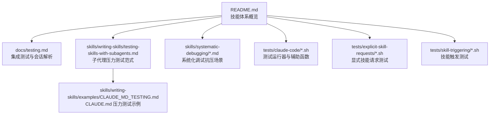
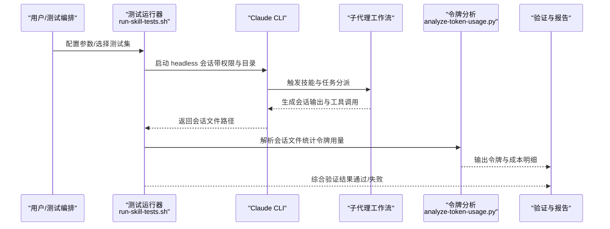
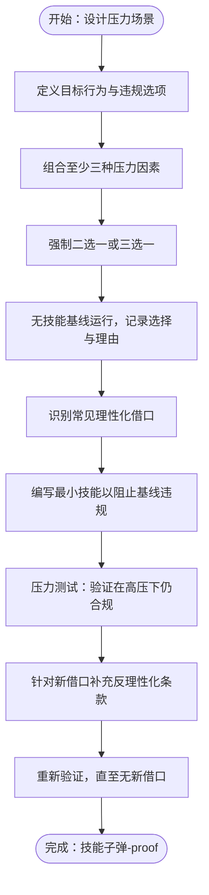
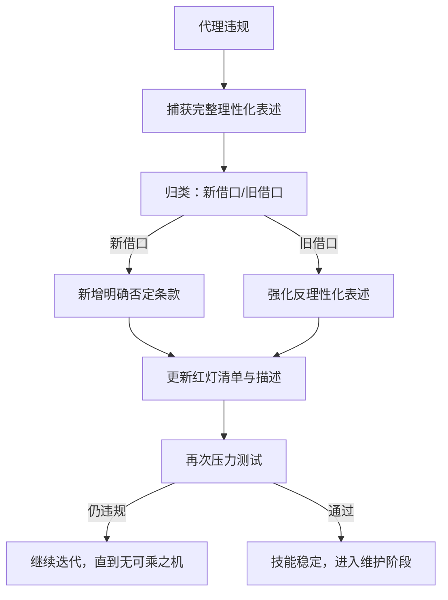
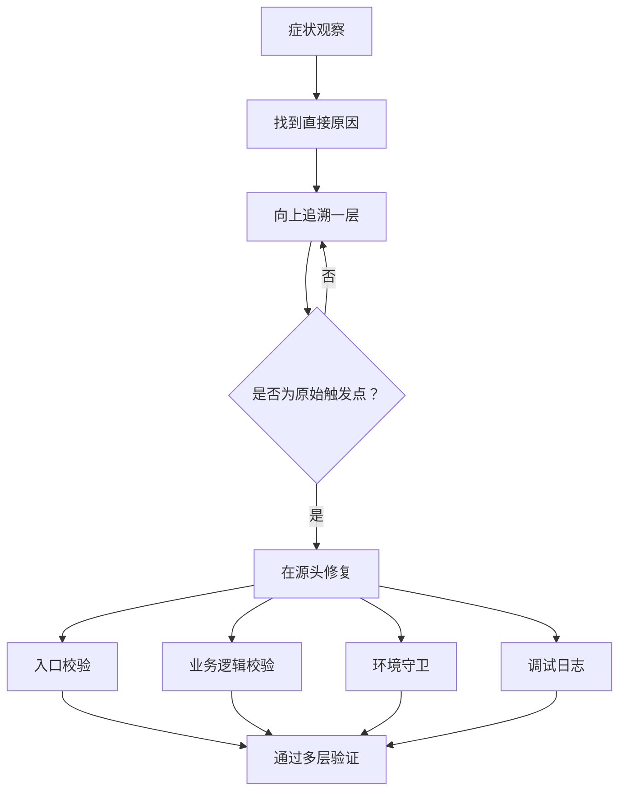
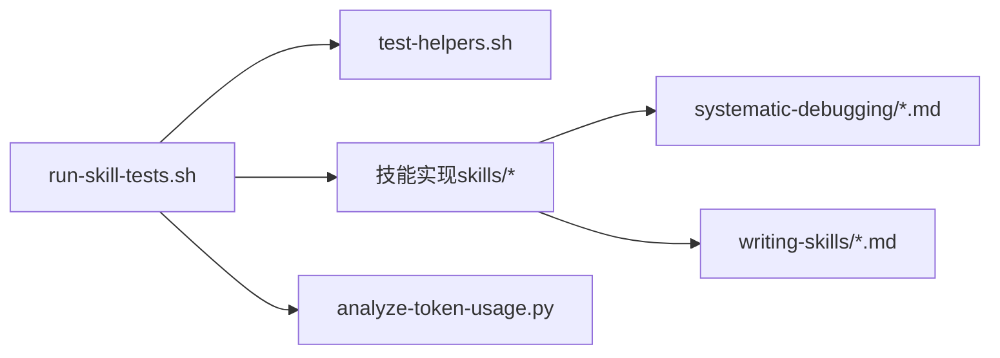

# 技能测试与验证方法

<cite>
**本文引用的文件**
- [README.md](file://README.md)
- [docs/testing.md](file://docs/testing.md)
- [skills/writing-skills/testing-skills-with-subagents.md](file://skills/writing-skills/testing-skills-with-subagents.md)
- [skills/writing-skills/examples/CLAUDE_MD_TESTING.md](file://skills/writing-skills/examples/CLAUDE_MD_TESTING.md)
- [skills/systematic-debugging/root-cause-tracing.md](file://skills/systematic-debugging/root-cause-tracing.md)
- [skills/systematic-debugging/defense-in-depth.md](file://skills/systematic-debugging/defense-in-depth.md)
- [skills/systematic-debugging/condition-based-waiting.md](file://skills/systematic-debugging/condition-based-waiting.md)
- [skills/systematic-debugging/test-pressure-1.md](file://skills/systematic-debugging/test-pressure-1.md)
- [skills/systematic-debugging/test-pressure-2.md](file://skills/systematic-debugging/test-pressure-2.md)
- [skills/systematic-debugging/test-pressure-3.md](file://skills/systematic-debugging/test-pressure-3.md)
- [skills/test-driven-development/testing-anti-patterns.md](file://skills/test-driven-development/testing-anti-patterns.md)
- [skills/writing-skills/persuasion-principles.md](file://skills/writing-skills/persuasion-principles.md)
- [tests/claude-code/run-skill-tests.sh](file://tests/claude-code/run-skill-tests.sh)
- [tests/claude-code/test-helpers.sh](file://tests/claude-code/test-helpers.sh)
- [tests/explicit-skill-requests/run-all.sh](file://tests/explicit-skill-requests/run-all.sh)
- [tests/skill-triggering/run-all.sh](file://tests/skill-triggering/run-all.sh)
</cite>

## 目录
1. [引言](#引言)
2. [项目结构](#项目结构)
3. [核心组件](#核心组件)
4. [架构总览](#架构总览)
5. [详细组件分析](#详细组件分析)
6. [依赖关系分析](#依赖关系分析)
7. [性能考量](#性能考量)
8. [故障排查指南](#故障排查指南)
9. [结论](#结论)
10. [附录](#附录)

## 引言
本指南面向“Superpowers”技能体系的测试与验证，系统阐述基于子代理（subagent）的压力测试方法论，覆盖压力场景设计原则、多重压力组合策略（时间压力、沉没成本、权威压力、疲劳压力等）、理性化论证识别与漏洞填补技术，并对不同技能类型（纪律约束型、技术型、模式型、参考型）给出可落地的测试方法与流程。同时，结合仓库中的实际测试脚本与示例，提供测试用例设计模板、执行流程、结果分析方法，以及如何使用 CLAUDE_MD_TESTING.md 进行技能验证与自动化性能分析。

## 项目结构
Superpowers 将“技能”作为可组合的工作流单元，围绕“测试”“调试”“协作”“元能力”四大类构建。测试相关的核心资源集中在以下位置：
- 文档与测试规范：docs/testing.md
- 子代理压力测试方法与范式：skills/writing-skills/testing-skills-with-subagents.md、skills/writing-skills/examples/CLAUDE_MD_TESTING.md
- 系统化调试的抗压场景与技术：skills/systematic-debugging 下的多篇文档与压力测试场景
- 测试运行器与辅助工具：tests/claude-code/* 脚本
- 显式技能请求触发测试：tests/explicit-skill-requests 与 tests/skill-triggering

图表来源
- [README.md:126-151](file://README.md#L126-L151)
- [docs/testing.md:1-304](file://docs/testing.md#L1-L304)
- [skills/writing-skills/testing-skills-with-subagents.md:1-385](file://skills/writing-skills/testing-skills-with-subagents.md#L1-L385)
- [skills/writing-skills/examples/CLAUDE_MD_TESTING.md:1-190](file://skills/writing-skills/examples/CLAUDE_MD_TESTING.md#L1-L190)
- [tests/claude-code/run-skill-tests.sh:1-188](file://tests/claude-code/run-skill-tests.sh#L1-L188)
- [tests/explicit-skill-requests/run-all.sh:1-71](file://tests/explicit-skill-requests/run-all.sh#L1-L71)
- [tests/skill-triggering/run-all.sh:1-61](file://tests/skill-triggering/run-all.sh#L1-L61)

章节来源
- [README.md:126-151](file://README.md#L126-L151)
- [docs/testing.md:1-304](file://docs/testing.md#L1-L304)

## 核心组件
- 基于子代理的压力测试范式：以“RED-GREEN-REFACTOR”映射到技能测试，强调在真实压力下观察与记录代理行为与理性化借口，迭代完善技能规则与反理性化条款。
- 系统化调试抗压场景：通过紧急修复、沉没成本与疲惫、权威与社交压力三类场景，检验技能在高压下的合规性与可坚持性。
- 测试运行器与会话解析：提供 headless 模式运行、会话文件定位与解析、令牌用量分析等能力，支撑端到端验证。
- 显式技能请求与触发测试：验证用户明确请求时技能是否被正确调用与执行。

章节来源
- [skills/writing-skills/testing-skills-with-subagents.md:30-41](file://skills/writing-skills/testing-skills-with-subagents.md#L30-L41)
- [skills/systematic-debugging/test-pressure-1.md:1-59](file://skills/systematic-debugging/test-pressure-1.md#L1-L59)
- [skills/systematic-debugging/test-pressure-2.md:1-69](file://skills/systematic-debugging/test-pressure-2.md#L1-L69)
- [skills/systematic-debugging/test-pressure-3.md:1-70](file://skills/systematic-debugging/test-pressure-3.md#L1-L70)
- [docs/testing.md:20-32](file://docs/testing.md#L20-L32)
- [tests/claude-code/run-skill-tests.sh:1-188](file://tests/claude-code/run-skill-tests.sh#L1-L188)

## 架构总览
下图展示从“压力场景设计”到“子代理执行与验证”的整体流程，以及测试运行器与会话解析工具的协同关系。

图表来源
- [docs/testing.md:20-32](file://docs/testing.md#L20-L32)
- [docs/testing.md:137-177](file://docs/testing.md#L137-L177)
- [tests/claude-code/run-skill-tests.sh:74-87](file://tests/claude-code/run-skill-tests.sh#L74-L87)

## 详细组件分析

### 压力场景设计与多重压力组合
- 设计原则
  - 场景必须“强制选择”，而非开放问答；需包含具体约束（时间、后果、文件路径等）。
  - 至少组合三种压力：时间压力、沉没成本、权威/社会压力、经济/职业风险、疲劳/情绪等。
  - 场景应让代理“想要违反规则”，从而暴露真实理性化借口。
- 压力类型与示例
  - 时间压力：紧急上线窗口、部署关闭。
  - 沉没成本：已投入大量时间/代码，删除/返工被视为浪费。
  - 权威/社会压力：资深工程师建议、团队期望、即时反馈。
  - 经济/职业风险：岗位晋升、公司生存、收入损失。
  - 疲劳/情绪：下班时间、通宵、情绪低落。
- 识别与记录
  - 记录代理的选择与完整理由，形成“理性化清单”。
  - 对每种新出现的借口，补充“明确否定条款”“红灯提示”“描述更新”。

图表来源
- [skills/writing-skills/testing-skills-with-subagents.md:90-142](file://skills/writing-skills/testing-skills-with-subagents.md#L90-L142)
- [skills/writing-skills/testing-skills-with-subagents.md:163-239](file://skills/writing-skills/testing-skills-with-subagents.md#L163-L239)

章节来源
- [skills/writing-skills/testing-skills-with-subagents.md:90-142](file://skills/writing-skills/testing-skills-with-subagents.md#L90-L142)
- [skills/writing-skills/testing-skills-with-subagents.md:163-239](file://skills/writing-skills/testing-skills-with-subagents.md#L163-L239)

### 理性化论证识别与漏洞填补技术
- 常见理性化借口（节选）
  - “这次情况特殊”“我可以灵活处理”
  - “我已经手动测试过了”
  - “先做再说，以后补上”
  - “删除/返工会浪费已投入”
  - “保持为参考，先写测试”
- 填补策略
  - 明确否定：禁止任何例外，删除即删除。
  - 红灯清单：列出典型“精神替代”“混合方案”等高危表述。
  - 描述增强：在技能描述中列举“容易违规的症状”。
  - 反向 meta-test：当代理仍违规时，问“如何修改才能让它无法再找借口”。

图表来源
- [skills/writing-skills/testing-skills-with-subagents.md:167-239](file://skills/writing-skills/testing-skills-with-subagents.md#L167-L239)

章节来源
- [skills/writing-skills/testing-skills-with-subagents.md:167-239](file://skills/writing-skills/testing-skills-with-subagents.md#L167-L239)

### 不同技能类型的测试方法

#### 纪律约束型技能（规则/要求）
- 测试目标：确保代理在高压下仍遵守不可协商的规则。
- 方法
  - 基线测试：无技能运行，观察是否违规及理性化借口。
  - 压力测试：叠加时间压力、沉没成本、权威/社会压力。
  - 多重叠加测试：同时引入多种压力，验证是否仍合规。
- 关键点
  - 使用“明确否定”“红灯清单”“描述增强”等手段，消除“灵活处理”“特殊情况”等借口。
  - 通过 meta-test 验证“技能已足够清晰，我应该遵循”。

章节来源
- [skills/writing-skills/testing-skills-with-subagents.md:82-90](file://skills/writing-skills/testing-skills-with-subagents.md#L82-L90)
- [skills/writing-skills/testing-skills-with-subagents.md:90-142](file://skills/writing-skills/testing-skills-with-subagents.md#L90-L142)
- [skills/writing-skills/testing-skills-with-subagents.md:163-239](file://skills/writing-skills/testing-skills-with-subagents.md#L163-L239)

#### 技术型技能（操作指南）
- 测试目标：验证代理能否在真实工程场景中正确应用技能。
- 方法
  - 应用场景测试：给定具体文件路径与任务，验证实现与测试通过。
  - 变体场景测试：改变输入规模、边界条件、并发环境等。
  - 信息缺失测试：缺少关键上下文或依赖时，代理是否能识别并回退。
- 工具支持
  - 使用测试运行器与会话解析工具，验证文件创建、测试执行、提交历史等。

章节来源
- [docs/testing.md:40-64](file://docs/testing.md#L40-L64)
- [tests/claude-code/run-skill-tests.sh:74-87](file://tests/claude-code/run-skill-tests.sh#L74-L87)

#### 模式型技能（思维模型）
- 测试目标：验证代理能否识别适用情境、正确应用模型并避免反例。
- 方法
  - 识别场景测试：给出模糊问题，验证代理是否能识别“该用此模型”。
  - 应用场景测试：在真实任务中应用模型，检查推理链与决策质量。
  - 反例测试：构造明显不适用的场景，验证代理不会误用。
- 心理学基础
  - 结合“说服原理”设计规则语言，使规则更易被接受与坚持。

章节来源
- [skills/writing-skills/persuasion-principles.md:126-134](file://skills/writing-skills/persuasion-principles.md#L126-L134)

#### 参考型技能（文档/API）
- 测试目标：验证代理能否高效检索、理解并正确使用参考信息。
- 方法
  - 信息检索测试：给出模糊需求，验证代理能否定位到正确文档。
  - 应用场景测试：在任务中引用参考信息，检查准确性与完整性。
  - 缺口测试：构造参考缺失或矛盾的场景，验证代理的识别与应对。
- 性能分析
  - 使用令牌分析工具评估检索与应用过程的成本与效率。

章节来源
- [docs/testing.md:137-177](file://docs/testing.md#L137-L177)

### 系统化调试抗压场景与技术
- 抗压场景
  - 紧急生产修复：在高损失与时间压力下，是否坚持系统化流程。
  - 沉没成本与疲惫：长时间无效尝试后，是否回归系统化调查。
  - 权威与社交压力：面对资深工程师建议，是否坚持证据驱动。
- 技术支撑
  - 根因追踪：从症状回溯到原始触发点，避免仅治标。
  - 分层防御：在入口、业务逻辑、环境与调试四个层面设置校验。
  - 条件等待：以“条件达成”代替任意延时，提升稳定性与可重复性。

图表来源
- [skills/systematic-debugging/root-cause-tracing.md:32-65](file://skills/systematic-debugging/root-cause-tracing.md#L32-L65)
- [skills/systematic-debugging/defense-in-depth.md:20-95](file://skills/systematic-debugging/defense-in-depth.md#L20-L95)

章节来源
- [skills/systematic-debugging/test-pressure-1.md:1-59](file://skills/systematic-debugging/test-pressure-1.md#L1-L59)
- [skills/systematic-debugging/test-pressure-2.md:1-69](file://skills/systematic-debugging/test-pressure-2.md#L1-L69)
- [skills/systematic-debugging/test-pressure-3.md:1-70](file://skills/systematic-debugging/test-pressure-3.md#L1-L70)
- [skills/systematic-debugging/root-cause-tracing.md:130-154](file://skills/systematic-debugging/root-cause-tracing.md#L130-L154)
- [skills/systematic-debugging/defense-in-depth.md:87-123](file://skills/systematic-debugging/defense-in-depth.md#L87-L123)
- [skills/systematic-debugging/condition-based-waiting.md:9-33](file://skills/systematic-debugging/condition-based-waiting.md#L9-L33)

### 测试用例设计模板与执行流程
- 模板要素
  - 场景标题与背景：明确角色、任务、约束与后果。
  - 选项列表：强制二选一或三选一，避免开放性回答。
  - 压力组合：时间、沉没成本、权威/社会、经济/职业、疲劳等。
  - 代理行为预期：在最大压力下仍应选择正确选项。
- 执行流程
  - 无技能基线运行，记录选择与理由。
  - 有技能运行，验证是否仍合规。
  - 新发现的理性化借口用于迭代完善技能。
- 自动化执行
  - 使用测试运行器批量执行，支持超时控制、摘要输出与失败定位。
  - 通过会话解析工具提取令牌用量与成本，便于性能分析。

章节来源
- [skills/writing-skills/examples/CLAUDE_MD_TESTING.md:5-63](file://skills/writing-skills/examples/CLAUDE_MD_TESTING.md#L5-L63)
- [tests/claude-code/run-skill-tests.sh:100-163](file://tests/claude-code/run-skill-tests.sh#L100-L163)
- [docs/testing.md:216-264](file://docs/testing.md#L216-L264)

### 结果分析方法
- 行为指标
  - 是否选择正确选项；是否引用技能条款；是否承认诱惑与坚持规则。
- 会话解析
  - 解析 JSONL 会话文件，提取工具调用、agentId、usage 等字段，统计令牌与成本。
- 成本与性能
  - 对比主会话与子代理的令牌用量，评估任务复杂度与成本分布。
- 可靠性
  - 通过条件等待、分层防御等技术减少不确定性，提升可重复性。

章节来源
- [docs/testing.md:265-304](file://docs/testing.md#L265-L304)
- [docs/testing.md:137-177](file://docs/testing.md#L137-L177)

## 依赖关系分析
- 测试运行器依赖测试辅助函数与技能实现，负责统一调度与汇总。
- 系统化调试技能依赖根因追踪、分层防御与条件等待等技术文档，形成闭环。
- 子代理压力测试范式与 CLAUDE.md 示例共同指导技能设计与验证。

图表来源
- [tests/claude-code/run-skill-tests.sh:1-20](file://tests/claude-code/run-skill-tests.sh#L1-L20)
- [tests/claude-code/test-helpers.sh:1-30](file://tests/claude-code/test-helpers.sh#L1-L30)
- [skills/systematic-debugging/root-cause-tracing.md:1-20](file://skills/systematic-debugging/root-cause-tracing.md#L1-L20)
- [skills/writing-skills/testing-skills-with-subagents.md:1-20](file://skills/writing-skills/testing-skills-with-subagents.md#L1-L20)

章节来源
- [tests/claude-code/run-skill-tests.sh:1-20](file://tests/claude-code/run-skill-tests.sh#L1-L20)
- [tests/claude-code/test-helpers.sh:1-30](file://tests/claude-code/test-helpers.sh#L1-L30)

## 性能考量
- 令牌用量与成本
  - 主会话通常承担全量上下文，输入令牌较高属正常；子代理成本相近但任务复杂度决定最终花费。
  - 高缓存读取是良好信号，表明提示复用有效。
- 执行时间
  - 子代理驱动开发等集成测试耗时较长，建议合理设置超时并分批执行。
- 稳定性
  - 使用条件等待替代任意延时，减少竞态与不稳定因素。
  - 分层防御降低错误传播概率，提高整体稳定性。

章节来源
- [docs/testing.md:137-177](file://docs/testing.md#L137-L177)
- [skills/systematic-debugging/condition-based-waiting.md:84-116](file://skills/systematic-debugging/condition-based-waiting.md#L84-L116)
- [skills/systematic-debugging/defense-in-depth.md:87-123](file://skills/systematic-debugging/defense-in-depth.md#L87-L123)

## 故障排查指南
- 技能未加载
  - 确保从插件目录运行；检查本地市场启用配置；确认技能存在于 skills 目录。
- 权限问题
  - 使用绕过权限模式与目录授权；检查临时目录权限。
- 超时与死循环
  - 增加超时；审查子代理任务复杂度；定位潜在无限循环。
- 会话文件缺失
  - 定位正确的项目目录；查找最近会话；确认测试确实执行。

章节来源
- [docs/testing.md:178-215](file://docs/testing.md#L178-L215)

## 结论
通过将“RED-GREEN-REFACTOR”映射到技能测试，结合系统化调试的抗压场景与心理学驱动的规则设计，Superpowers 提供了可操作、可验证、可持续改进的技能测试与验证方法。配合测试运行器与会话解析工具，可在真实子代理工作流中量化行为与成本，持续提升技能的合规性与可坚持性。

## 附录

### 测试自动化工具使用方法
- 测试运行器
  - 支持指定测试、超时控制、集成测试开关、摘要输出。
- 辅助函数
  - 提供运行 Claude、断言匹配、顺序判断、计划文件生成等通用能力。
- 令牌分析
  - 解析会话文件，输出主会话与各子代理的令牌用量与成本。

章节来源
- [tests/claude-code/run-skill-tests.sh:25-72](file://tests/claude-code/run-skill-tests.sh#L25-L72)
- [tests/claude-code/test-helpers.sh:4-29](file://tests/claude-code/test-helpers.sh#L4-L29)
- [docs/testing.md:137-177](file://docs/testing.md#L137-L177)

### 显式技能请求与触发测试
- 显式技能请求测试：验证用户明确请求时技能是否被调用。
- 技能触发测试：覆盖多个技能的触发场景，确保工作流按预期推进。

章节来源
- [tests/explicit-skill-requests/run-all.sh:17-36](file://tests/explicit-skill-requests/run-all.sh#L17-L36)
- [tests/skill-triggering/run-all.sh:26-47](file://tests/skill-triggering/run-all.sh#L26-L47)