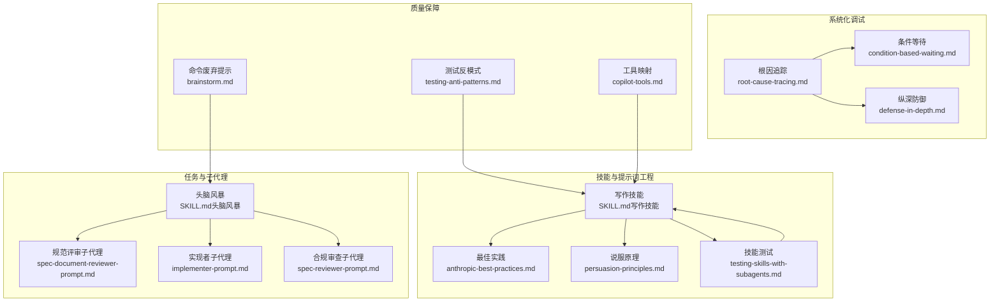
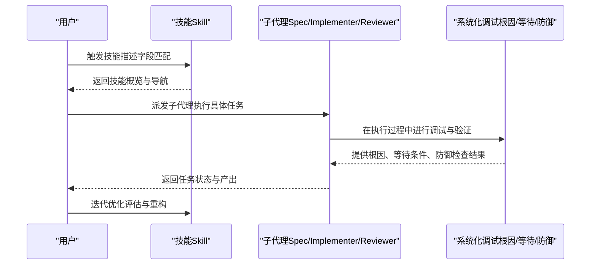
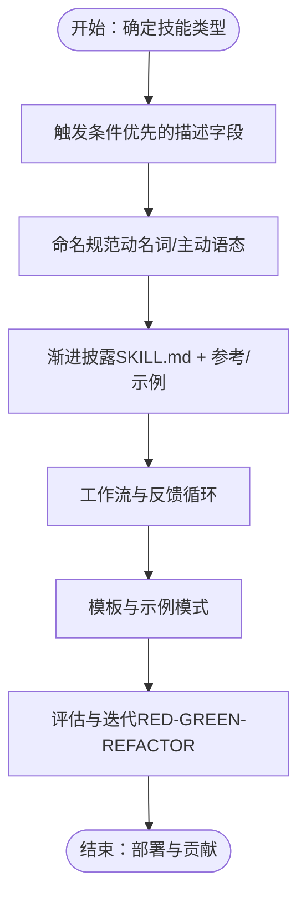
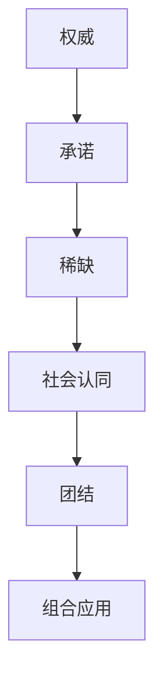
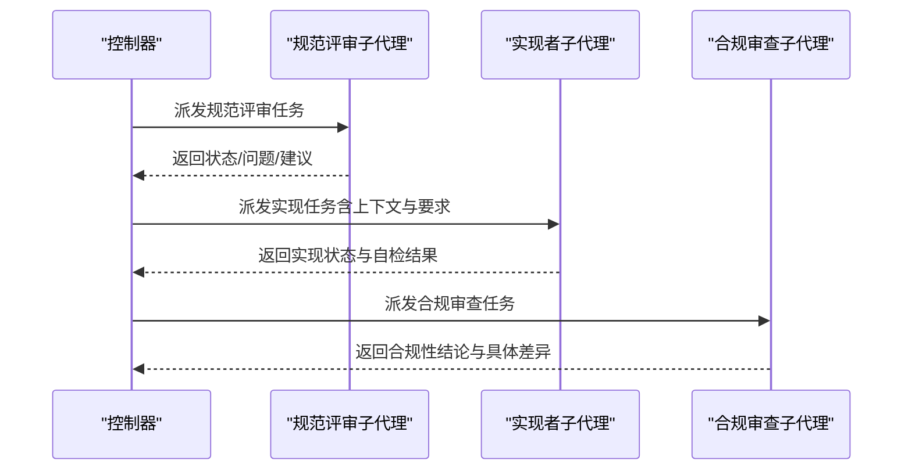
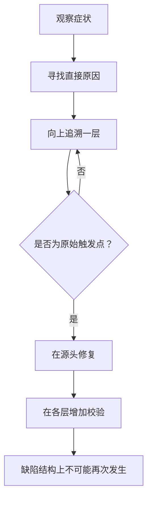
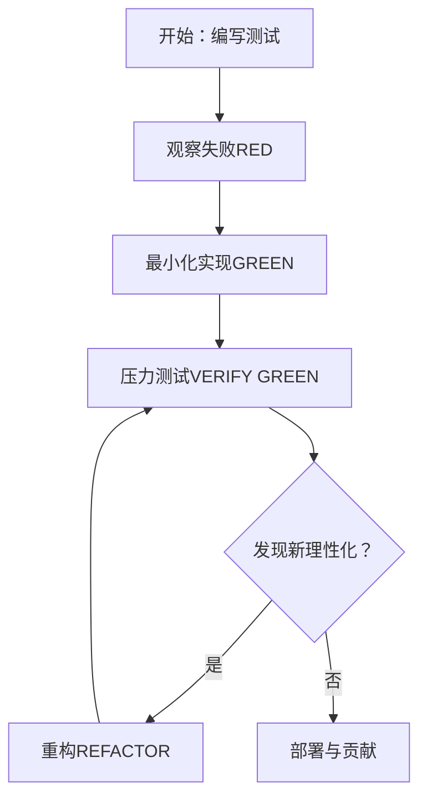
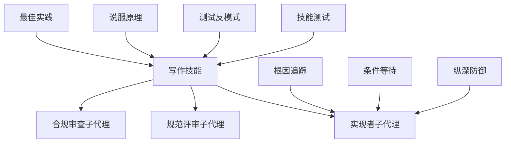

# 提示词工程最佳实践

<cite>
**本文引用的文件**
- [persuasion-principles.md](file://skills/writing-skills/persuasion-principles.md)
- [anthropic-best-practices.md](file://skills/writing-skills/anthropic-best-practices.md)
- [SKILL.md（写作技能）](file://skills/writing-skills/SKILL.md)
- [testing-skills-with-subagents.md](file://skills/writing-skills/testing-skills-with-subagents.md)
- [spec-document-reviewer-prompt.md](file://skills/brainstorming/spec-document-reviewer-prompt.md)
- [implementer-prompt.md](file://skills/subagent-driven-development/implementer-prompt.md)
- [spec-reviewer-prompt.md](file://skills/subagent-driven-development/spec-reviewer-prompt.md)
- [SKILL.md（头脑风暴）](file://skills/brainstorming/SKILL.md)
- [root-cause-tracing.md](file://skills/systematic-debugging/root-cause-tracing.md)
- [condition-based-waiting.md](file://skills/systematic-debugging/condition-based-waiting.md)
- [defense-in-depth.md](file://skills/systematic-debugging/defense-in-depth.md)
- [testing-anti-patterns.md](file://skills/test-driven-development/testing-anti-patterns.md)
- [brainstorm.md](file://commands/brainstorm.md)
- [copilot-tools.md](file://skills/using-superpowers/references/copilot-tools.md)
</cite>

## 目录
1. [引言](#引言)
2. [项目结构](#项目结构)
3. [核心组件](#核心组件)
4. [架构总览](#架构总览)
5. [详细组件分析](#详细组件分析)
6. [依赖关系分析](#依赖关系分析)
7. [性能考量](#性能考量)
8. [故障排查指南](#故障排查指南)
9. [结论](#结论)
10. [附录](#附录)

## 引言
本指南面向希望系统化提升“提示词工程”能力的开发者与提示工程师，结合仓库中成熟的“技能（Skill）”体系与子代理驱动开发范式，总结提示词设计的核心原则、结构化模板与优化方法。内容覆盖：
- 上下文提供策略、指令明确性、输出格式控制
- 创造性任务、分析任务、决策任务的提示模板设计
- 说服原理在提示设计中的应用（权威、承诺、稀缺、社会认同、团结）
- 针对技术技巧、思维模式、参考文档三类技能的提示词模板示例路径
- 提示词优化技巧、常见陷阱识别与调试方法

## 项目结构
该仓库以“技能（Skill）”为核心组织单元，围绕提示词工程的关键流程形成可复用的模板与最佳实践：
- 写作技能：定义技能结构、描述字段、命名规范、渐进披露、工作流与反馈循环、模板与示例模式、评估与迭代等
- 头脑风暴：强调先设计再实现，提供可视化伴侧行程与流程图
- 子代理驱动开发：定义规范评审、实现者、合规审查等子代理提示模板
- 系统化调试：根因追踪、条件等待、纵深防御等系统化思维与模式
- 测试反模式：严格区分真实行为验证与模拟行为验证，避免测试反模式
- 平台工具映射：将技能中使用的工具名称映射到平台CLI等价物

图表来源
- [SKILL.md（写作技能）:1-656](file://skills/writing-skills/SKILL.md#L1-L656)
- [anthropic-best-practices.md:1-1151](file://skills/writing-skills/anthropic-best-practices.md#L1-L1151)
- [persuasion-principles.md:1-188](file://skills/writing-skills/persuasion-principles.md#L1-L188)
- [testing-skills-with-subagents.md:1-385](file://skills/writing-skills/testing-skills-with-subagents.md#L1-L385)
- [SKILL.md（头脑风暴）:1-165](file://skills/brainstorming/SKILL.md#L1-L165)
- [spec-document-reviewer-prompt.md:1-50](file://skills/brainstorming/spec-document-reviewer-prompt.md#L1-L50)
- [implementer-prompt.md:1-114](file://skills/subagent-driven-development/implementer-prompt.md#L1-L114)
- [spec-reviewer-prompt.md:1-62](file://skills/subagent-driven-development/spec-reviewer-prompt.md#L1-L62)
- [root-cause-tracing.md:1-170](file://skills/systematic-debugging/root-cause-tracing.md#L1-L170)
- [condition-based-waiting.md:1-116](file://skills/systematic-debugging/condition-based-waiting.md#L1-L116)
- [defense-in-depth.md:1-123](file://skills/systematic-debugging/defense-in-depth.md#L1-L123)
- [testing-anti-patterns.md:1-300](file://skills/test-driven-development/testing-anti-patterns.md#L1-L300)
- [brainstorm.md:1-6](file://commands/brainstorm.md#L1-L6)
- [copilot-tools.md:1-53](file://skills/using-superpowers/references/copilot-tools.md#L1-L53)

章节来源
- [SKILL.md（写作技能）:1-656](file://skills/writing-skills/SKILL.md#L1-L656)
- [anthropic-best-practices.md:1-1151](file://skills/writing-skills/anthropic-best-practices.md#L1-L1151)

## 核心组件
- 技能结构与描述字段：强调“触发条件优先”的描述写法、命名规范、渐进披露、工作流与反馈循环、模板与示例模式、评估与迭代
- 说服原理：权威、承诺、稀缺、社会认同、团结在技能设计中的应用，以及组合策略
- 子代理提示模板：规范评审、实现者、合规审查三类子代理的提示词模板
- 系统化调试模式：根因追踪、条件等待、纵深防御的流程与要点
- 质量保障：测试反模式清单与TDD视角下的测试方法论

章节来源
- [SKILL.md（写作技能）:94-137](file://skills/writing-skills/SKILL.md#L94-L137)
- [persuasion-principles.md:9-188](file://skills/writing-skills/persuasion-principles.md#L9-L188)
- [implementer-prompt.md:1-114](file://skills/subagent-driven-development/implementer-prompt.md#L1-L114)
- [spec-reviewer-prompt.md:1-62](file://skills/subagent-driven-development/spec-reviewer-prompt.md#L1-L62)
- [root-cause-tracing.md:1-170](file://skills/systematic-debugging/root-cause-tracing.md#L1-L170)
- [condition-based-waiting.md:1-116](file://skills/systematic-debugging/condition-based-waiting.md#L1-L116)
- [defense-in-depth.md:1-123](file://skills/systematic-debugging/defense-in-depth.md#L1-L123)
- [testing-anti-patterns.md:1-300](file://skills/test-driven-development/testing-anti-patterns.md#L1-L300)

## 架构总览
提示词工程在本仓库中体现为“技能（Skill）+ 子代理（Subagent）+ 系统化调试”的协同架构：
- 技能层：定义触发条件、描述字段、结构化内容、模板与示例、工作流与反馈循环
- 子代理层：通过标准化提示模板完成特定角色（评审、实现、合规）的自动化协作
- 调试层：以系统化方法论（根因追踪、条件等待、纵深防御）保障质量与稳定性

图表来源
- [SKILL.md（写作技能）:140-198](file://skills/writing-skills/SKILL.md#L140-L198)
- [implementer-prompt.md:1-114](file://skills/subagent-driven-development/implementer-prompt.md#L1-L114)
- [spec-reviewer-prompt.md:1-62](file://skills/subagent-driven-development/spec-reviewer-prompt.md#L1-L62)
- [root-cause-tracing.md:1-170](file://skills/systematic-debugging/root-cause-tracing.md#L1-L170)
- [condition-based-waiting.md:1-116](file://skills/systematic-debugging/condition-based-waiting.md#L1-L116)
- [defense-in-depth.md:1-123](file://skills/systematic-debugging/defense-in-depth.md#L1-L123)

## 详细组件分析

### 组件A：技能结构与描述字段（触发条件优先）
- 描述字段应聚焦“何时使用”，而非“做什么”
- 命名采用主动语态与动名词形式，便于检索
- 渐进披露：将复杂内容拆分为多个文件，按需加载
- 工作流与反馈循环：多步骤流程与校验回路
- 模板与示例：严格输出格式模板与输入输出示例
- 评估与迭代：基于压力场景的RED-GREEN-REFACTOR循环

图表来源
- [SKILL.md（写作技能）:140-198](file://skills/writing-skills/SKILL.md#L140-L198)
- [anthropic-best-practices.md:235-409](file://skills/writing-skills/anthropic-best-practices.md#L235-L409)
- [SKILL.md（写作技能）:395-443](file://skills/writing-skills/SKILL.md#L395-L443)

章节来源
- [SKILL.md（写作技能）:94-137](file://skills/writing-skills/SKILL.md#L94-L137)
- [anthropic-best-practices.md:144-234](file://skills/writing-skills/anthropic-best-practices.md#L144-L234)

### 组件B：说服原理在技能设计中的应用
- 权威：绝对语言、不可谈判框架、消除理性化空间
- 承诺：强制宣告、显式选择、跟踪机制
- 稀缺：限时要求、顺序依赖、防止拖延
- 社会认同：普遍模式、失败模式、建立标准
- 团结：协作语言、共享目标
- 组合策略：纪律强化型（权威+承诺+社会认同）、指导型（适度权威+团结）、协作型（团结+承诺）

图表来源
- [persuasion-principles.md:9-188](file://skills/writing-skills/persuasion-principles.md#L9-L188)

章节来源
- [persuasion-principles.md:126-188](file://skills/writing-skills/persuasion-principles.md#L126-L188)

### 组件C：子代理提示模板（规范评审、实现者、合规审查）
- 规范评审子代理：检查完整性、一致性、清晰度、范围、YAGNI；输出状态、问题与建议
- 实现者子代理：明确任务描述、上下文、前置问题、职责清单、代码组织、风险升级与自检、报告格式
- 合规审查子代理：独立读取实现代码，逐条比对需求，识别缺失、多余与误解

图表来源
- [spec-document-reviewer-prompt.md:1-50](file://skills/brainstorming/spec-document-reviewer-prompt.md#L1-L50)
- [implementer-prompt.md:1-114](file://skills/subagent-driven-development/implementer-prompt.md#L1-L114)
- [spec-reviewer-prompt.md:1-62](file://skills/subagent-driven-development/spec-reviewer-prompt.md#L1-L62)

章节来源
- [spec-document-reviewer-prompt.md:1-50](file://skills/brainstorming/spec-document-reviewer-prompt.md#L1-L50)
- [implementer-prompt.md:1-114](file://skills/subagent-driven-development/implementer-prompt.md#L1-L114)
- [spec-reviewer-prompt.md:1-62](file://skills/subagent-driven-development/spec-reviewer-prompt.md#L1-L62)

### 组件D：系统化调试模式（根因追踪、条件等待、纵深防御）
- 根因追踪：从症状点回溯调用链，定位原始触发点，修复源头并叠加防御
- 条件等待：等待实际条件达成而非猜测时长，避免竞态与不稳定
- 纵深防御：在每个数据流转节点设置校验，使缺陷结构上不可能发生

图表来源
- [root-cause-tracing.md:1-170](file://skills/systematic-debugging/root-cause-tracing.md#L1-L170)
- [condition-based-waiting.md:1-116](file://skills/systematic-debugging/condition-based-waiting.md#L1-L116)
- [defense-in-depth.md:1-123](file://skills/systematic-debugging/defense-in-depth.md#L1-L123)

章节来源
- [root-cause-tracing.md:1-170](file://skills/systematic-debugging/root-cause-tracing.md#L1-L170)
- [condition-based-waiting.md:1-116](file://skills/systematic-debugging/condition-based-waiting.md#L1-L116)
- [defense-in-depth.md:1-123](file://skills/systematic-debugging/defense-in-depth.md#L1-L123)

### 组件E：测试反模式与TDD视角下的质量保障
- 铁律：绝不测试模拟行为、绝不向生产类添加仅测试方法、绝不无理解地模拟
- 关键门禁：在断言任何模拟元素前，问“我是在测试真实组件行为还是仅测试模拟存在？”
- 与技能测试的关系：技能同样遵循RED-GREEN-REFACTOR，压力场景下验证规则的可执行性与抗理性化能力

图表来源
- [testing-anti-patterns.md:1-300](file://skills/test-driven-development/testing-anti-patterns.md#L1-L300)
- [testing-skills-with-subagents.md:30-42](file://skills/writing-skills/testing-skills-with-subagents.md#L30-L42)

章节来源
- [testing-anti-patterns.md:1-300](file://skills/test-driven-development/testing-anti-patterns.md#L1-L300)
- [testing-skills-with-subagents.md:1-385](file://skills/writing-skills/testing-skills-with-subagents.md#L1-L385)

### 组件F：平台工具映射与命令废弃提示
- 将技能中使用的工具名称映射到平台CLI等价物，确保跨平台一致性
- 对已废弃命令给出明确迁移指引与替代方案

章节来源
- [copilot-tools.md:1-53](file://skills/using-superpowers/references/copilot-tools.md#L1-L53)
- [brainstorm.md:1-6](file://commands/brainstorm.md#L1-L6)

## 依赖关系分析
- 技能层依赖于最佳实践与说服原理，确保描述字段与结构符合搜索优化与心理说服原则
- 子代理层依赖于技能层提供的触发条件与导航，形成“技能触发→子代理执行→调试验证→技能迭代”的闭环
- 调试层为子代理执行提供系统化方法论支撑，降低不确定性与缺陷传播
- 质量保障层（测试反模式）与技能测试共同构成“可验证的质量基线”

图表来源
- [anthropic-best-practices.md:1-1151](file://skills/writing-skills/anthropic-best-practices.md#L1-L1151)
- [persuasion-principles.md:1-188](file://skills/writing-skills/persuasion-principles.md#L1-L188)
- [SKILL.md（写作技能）:1-656](file://skills/writing-skills/SKILL.md#L1-L656)
- [implementer-prompt.md:1-114](file://skills/subagent-driven-development/implementer-prompt.md#L1-L114)
- [spec-reviewer-prompt.md:1-62](file://skills/subagent-driven-development/spec-reviewer-prompt.md#L1-L62)
- [root-cause-tracing.md:1-170](file://skills/systematic-debugging/root-cause-tracing.md#L1-L170)
- [condition-based-waiting.md:1-116](file://skills/systematic-debugging/condition-based-waiting.md#L1-L116)
- [defense-in-depth.md:1-123](file://skills/systematic-debugging/defense-in-depth.md#L1-L123)
- [testing-anti-patterns.md:1-300](file://skills/test-driven-development/testing-anti-patterns.md#L1-L300)
- [testing-skills-with-subagents.md:1-385](file://skills/writing-skills/testing-skills-with-subagents.md#L1-L385)

## 性能考量
- 上下文窗口竞争：技能正文与附加文件在被加载时均占用上下文，需保持简洁与渐进披露
- 文件加载策略：仅在需要时加载参考/示例文件，避免一次性加载大量内容
- 命名与描述：使用高覆盖率关键词与技术无关的触发条件，提高发现效率
- Token效率：将细节移至工具帮助或交叉引用，减少重复与冗余

章节来源
- [anthropic-best-practices.md:11-58](file://skills/writing-skills/anthropic-best-practices.md#L11-L58)
- [SKILL.md（写作技能）:213-277](file://skills/writing-skills/SKILL.md#L213-L277)

## 故障排查指南
- 常见陷阱
  - 描述字段总结了流程导致“快捷路径”被采纳，忽略技能正文
  - 使用“仅测试方法”污染生产类，破坏职责分离
  - 无理解地模拟外部依赖，导致测试与真实行为脱节
  - 仅测试模拟行为而非真实行为
- 调试方法
  - 基于压力场景的RED-GREEN-REFACTOR循环验证技能抗理性化能力
  - 在子代理执行中引入根因追踪、条件等待与纵深防御
  - 使用工具映射与命令废弃提示，确保跨平台一致性

章节来源
- [SKILL.md（写作技能）:140-198](file://skills/writing-skills/SKILL.md#L140-L198)
- [testing-anti-patterns.md:1-300](file://skills/test-driven-development/testing-anti-patterns.md#L1-L300)
- [testing-skills-with-subagents.md:1-385](file://skills/writing-skills/testing-skills-with-subagents.md#L1-L385)
- [root-cause-tracing.md:1-170](file://skills/systematic-debugging/root-cause-tracing.md#L1-L170)
- [condition-based-waiting.md:1-116](file://skills/systematic-debugging/condition-based-waiting.md#L1-L116)
- [defense-in-depth.md:1-123](file://skills/systematic-debugging/defense-in-depth.md#L1-L123)
- [copilot-tools.md:1-53](file://skills/using-superpowers/references/copilot-tools.md#L1-L53)
- [brainstorm.md:1-6](file://commands/brainstorm.md#L1-L6)

## 结论
本指南将“技能结构、说服原理、子代理模板、系统化调试与质量保障”整合为一套可操作的提示词工程方法论。通过触发条件优先的描述字段、严格的模板与示例模式、压力场景下的技能测试，以及根因追踪、条件等待与纵深防御的调试实践，能够显著提升AI交互的稳定性与可预期性。

## 附录
- 提示词模板示例路径（不展示具体代码内容）
  - 创造性任务（头脑风暴）：[SKILL.md（头脑风暴）:1-165](file://skills/brainstorming/SKILL.md#L1-L165)
  - 分析任务（规范评审子代理）：[spec-document-reviewer-prompt.md:1-50](file://skills/brainstorming/spec-document-reviewer-prompt.md#L1-L50)
  - 决策任务（实现者/合规审查子代理）：[implementer-prompt.md:1-114](file://skills/subagent-driven-development/implementer-prompt.md#L1-L114)、[spec-reviewer-prompt.md:1-62](file://skills/subagent-driven-development/spec-reviewer-prompt.md#L1-L62)
  - 技术技巧（条件等待）：[condition-based-waiting.md:1-116](file://skills/systematic-debugging/condition-based-waiting.md#L1-L116)
  - 思维模式（根因追踪）：[root-cause-tracing.md:1-170](file://skills/systematic-debugging/root-cause-tracing.md#L1-L170)
  - 参考文档（工具映射）：[copilot-tools.md:1-53](file://skills/using-superpowers/references/copilot-tools.md#L1-L53)