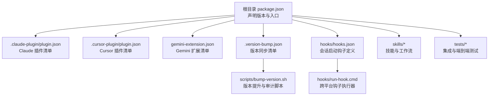
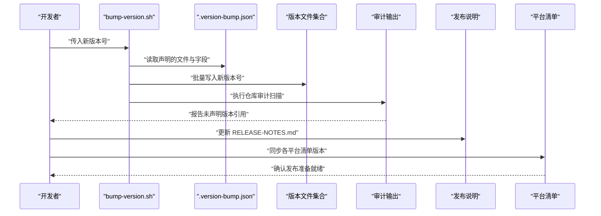
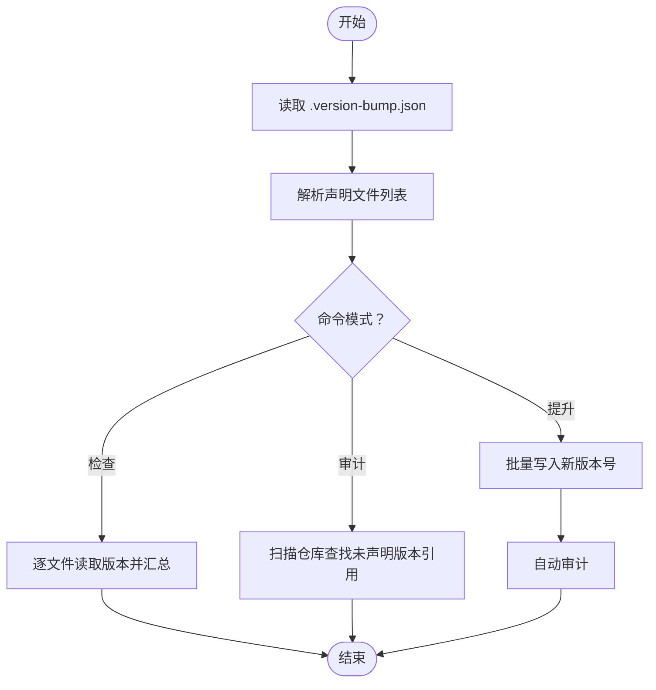
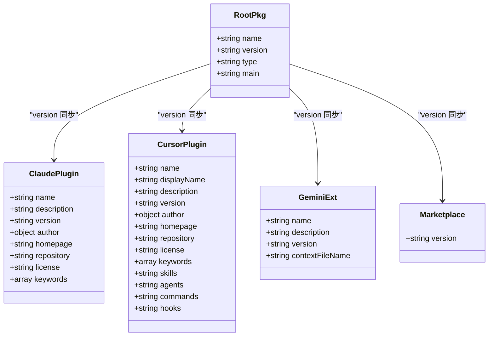
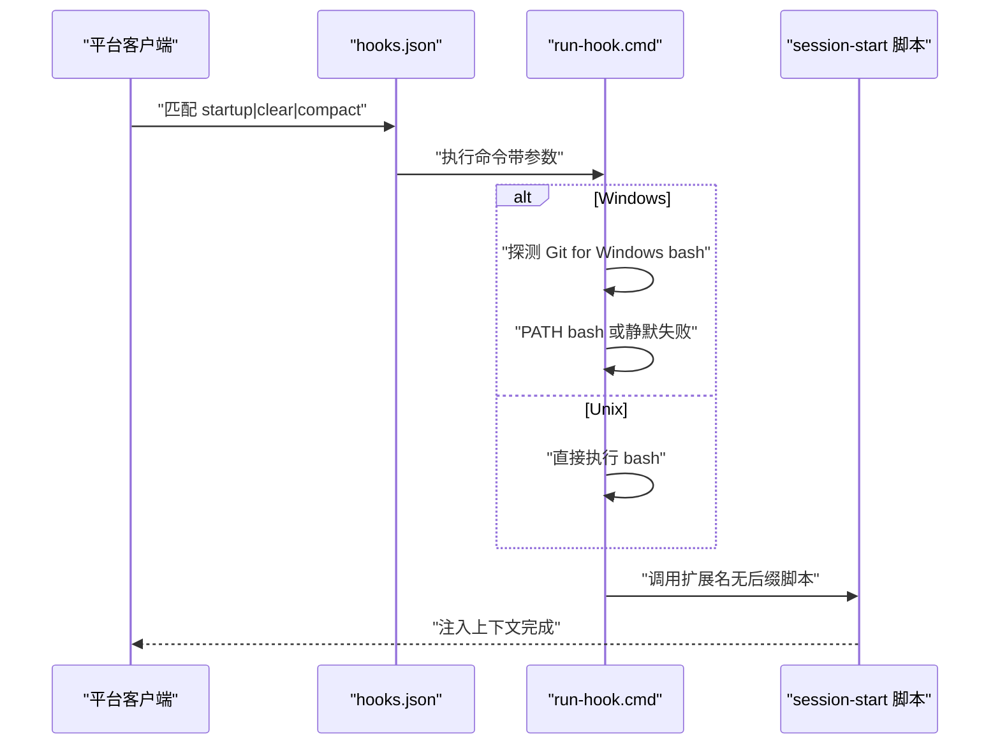
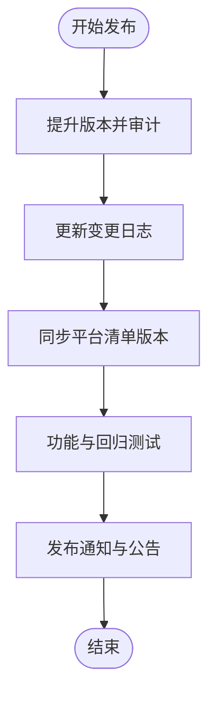
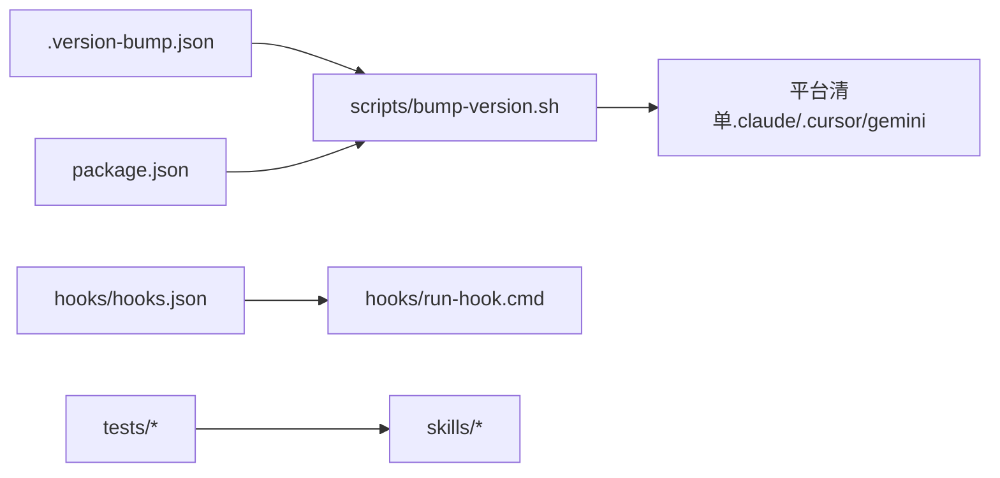

# 构建与部署

<cite>
**本文档引用的文件**
- [package.json](file://package.json)
- [.version-bump.json](file://.version-bump.json)
- [scripts/bump-version.sh](file://scripts/bump-version.sh)
- [RELEASE-NOTES.md](file://RELEASE-NOTES.md)
- [README.md](file://README.md)
- [.claude-plugin/plugin.json](file://.claude-plugin/plugin.json)
- [.cursor-plugin/plugin.json](file://.cursor-plugin/plugin.json)
- [.claude-plugin/marketplace.json](file://.claude-plugin/marketplace.json)
- [gemini-extension.json](file://gemini-extension.json)
- [hooks/hooks.json](file://hooks/hooks.json)
- [hooks/run-hook.cmd](file://hooks/run-hook.cmd)
- [skills/finishing-a-development-branch/SKILL.md](file://skills/finishing-a-development-branch/SKILL.md)
- [tests/claude-code/test-subagent-driven-development.sh](file://tests/claude-code/test-subagent-driven-development.sh)
</cite>

## 目录
1. [简介](#简介)
2. [项目结构](#项目结构)
3. [核心组件](#核心组件)
4. [架构总览](#架构总览)
5. [详细组件分析](#详细组件分析)
6. [依赖关系分析](#依赖关系分析)
7. [性能考虑](#性能考虑)
8. [故障排除指南](#故障排除指南)
9. [结论](#结论)
10. [附录](#附录)

## 简介
本指南面向 Superpowers 项目的维护者与贡献者，系统性阐述项目的构建与部署流程，涵盖版本管理策略、发布流程、打包方式、依赖管理以及多平台兼容性要求。文档同时提供自动化部署与发布建议（CI/CD 集成思路），并说明版本号管理、变更日志维护与发布通知机制的最佳实践。

## 项目结构
Superpowers 是一个以“技能”为核心的插件型项目，主要通过不同平台的插件清单与钩子脚本实现跨平台运行。核心结构要点如下：
- 插件清单：Claude/Cursor/Gemini 平台各自维护独立的插件清单文件，统一在根级 package.json 中声明版本号，并由版本提升脚本集中同步。
- 钩子系统：通过 hooks.json 定义会话启动钩子，run-hook.cmd 提供跨平台执行能力。
- 技能与工作流：技能位于 skills/ 目录，配合测试脚本与文档形成闭环。
- 版本管理：.version-bump.json 声明需要同步版本号的文件列表，scripts/bump-version.sh 负责批量提升与审计。

图表来源
- [package.json:1-7](file://package.json#L1-L7)
- [.claude-plugin/plugin.json:1-21](file://.claude-plugin/plugin.json#L1-L21)
- [.cursor-plugin/plugin.json:1-26](file://.cursor-plugin/plugin.json#L1-L26)
- [gemini-extension.json:1-7](file://gemini-extension.json#L1-L7)
- [.version-bump.json:1-20](file://.version-bump.json#L1-L20)
- [scripts/bump-version.sh:1-221](file://scripts/bump-version.sh#L1-L221)
- [hooks/hooks.json:1-17](file://hooks/hooks.json#L1-L17)
- [hooks/run-hook.cmd:1-47](file://hooks/run-hook.cmd#L1-L47)

章节来源
- [package.json:1-7](file://package.json#L1-L7)
- [.version-bump.json:1-20](file://.version-bump.json#L1-L20)
- [scripts/bump-version.sh:1-221](file://scripts/bump-version.sh#L1-L221)
- [hooks/hooks.json:1-17](file://hooks/hooks.json#L1-L17)
- [hooks/run-hook.cmd:1-47](file://hooks/run-hook.cmd#L1-L47)

## 核心组件
- 版本管理与同步
  - 根据 .version-bump.json 声明的文件路径与字段，scripts/bump-version.sh 实现版本号批量提升、漂移检测与仓库范围审计。
  - 支持命令：检查当前版本、审计未声明版本字符串、按新版本号批量提升。
- 插件清单与平台适配
  - .claude-plugin/plugin.json、.cursor-plugin/plugin.json、gemini-extension.json 分别承载各平台的版本号与元数据。
  - .claude-plugin/marketplace.json 包含市场版本信息，确保发布渠道一致。
- 钩子系统
  - hooks/hooks.json 定义会话启动钩子，run-hook.cmd 提供 Windows/Unix 双环境兼容执行。
- 发布与变更日志
  - RELEASE-NOTES.md 记录每次版本的变更内容，作为发布说明与用户公告依据。
- 工作流与测试
  - skills/* 与 tests/* 协同验证技能行为与工作流正确性，为发布前质量把关。

章节来源
- [scripts/bump-version.sh:56-92](file://scripts/bump-version.sh#L56-L92)
- [scripts/bump-version.sh:94-164](file://scripts/bump-version.sh#L94-L164)
- [scripts/bump-version.sh:166-194](file://scripts/bump-version.sh#L166-L194)
- [.claude-plugin/plugin.json:1-21](file://.claude-plugin/plugin.json#L1-L21)
- [.cursor-plugin/plugin.json:1-26](file://.cursor-plugin/plugin.json#L1-L26)
- [gemini-extension.json:1-7](file://gemini-extension.json#L1-L7)
- [.claude-plugin/marketplace.json](file://.claude-plugin/marketplace.json)
- [hooks/hooks.json:1-17](file://hooks/hooks.json#L1-L17)
- [hooks/run-hook.cmd:1-47](file://hooks/run-hook.cmd#L1-L47)
- [RELEASE-NOTES.md:1-20](file://RELEASE-NOTES.md#L1-L20)

## 架构总览
下图展示从版本提升到平台发布的整体流程，强调版本一致性、钩子注入与多平台清单同步。

图表来源
- [scripts/bump-version.sh:166-194](file://scripts/bump-version.sh#L166-L194)
- [.version-bump.json:1-20](file://.version-bump.json#L1-L20)
- [RELEASE-NOTES.md:1-20](file://RELEASE-NOTES.md#L1-L20)
- [.claude-plugin/plugin.json:1-21](file://.claude-plugin/plugin.json#L1-L21)
- [.cursor-plugin/plugin.json:1-26](file://.cursor-plugin/plugin.json#L1-L26)
- [gemini-extension.json:1-7](file://gemini-extension.json#L1-L7)

## 详细组件分析

### 组件一：版本提升与审计脚本
- 功能职责
  - 检查模式：列出所有声明文件的当前版本，检测版本漂移并汇总。
  - 审计模式：基于当前版本扫描仓库，识别未声明的版本字符串引用，避免遗漏。
  - 提升模式：对声明文件进行安全替换，保留格式；完成后自动触发审计。
- 关键实现点
  - 使用 jq 进行 JSON 字段读写，支持嵌套路径（如 marketplace.json 的 plugins.0.version）。
  - 排除规则可配置，避免误报（如 CHANGELOG、脚本自身等）。
  - 对缺失文件进行跳过提示，保证稳健性。
- 使用示例（路径）
  - 查看当前版本：[scripts/bump-version.sh:198-201](file://scripts/bump-version.sh#L198-L201)
  - 审计未声明引用：[scripts/bump-version.sh:202-204](file://scripts/bump-version.sh#L202-L204)
  - 提升版本：[scripts/bump-version.sh:217-219](file://scripts/bump-version.sh#L217-L219)

图表来源
- [scripts/bump-version.sh:44-52](file://scripts/bump-version.sh#L44-L52)
- [scripts/bump-version.sh:56-92](file://scripts/bump-version.sh#L56-L92)
- [scripts/bump-version.sh:94-164](file://scripts/bump-version.sh#L94-L164)
- [scripts/bump-version.sh:166-194](file://scripts/bump-version.sh#L166-L194)

章节来源
- [scripts/bump-version.sh:1-221](file://scripts/bump-version.sh#L1-L221)
- [.version-bump.json:1-20](file://.version-bump.json#L1-L20)

### 组件二：平台插件清单与版本同步
- 统一来源
  - package.json 的 version 字段作为统一版本源，其他平台清单通过版本提升脚本同步。
- 平台差异
  - .claude-plugin/plugin.json：包含作者、主页、仓库、关键词等元数据。
  - .cursor-plugin/plugin.json：额外声明 skills、agents、commands、hooks 等目录映射。
  - gemini-extension.json：声明扩展名称、描述、版本与上下文文件名。
  - .claude-plugin/marketplace.json：市场版本信息，用于官方市场分发。
- 最佳实践
  - 在版本提升后，确保所有清单版本一致，避免平台侧不一致导致的安装问题。

图表来源
- [package.json:1-7](file://package.json#L1-L7)
- [.claude-plugin/plugin.json:1-21](file://.claude-plugin/plugin.json#L1-L21)
- [.cursor-plugin/plugin.json:1-26](file://.cursor-plugin/plugin.json#L1-L26)
- [gemini-extension.json:1-7](file://gemini-extension.json#L1-L7)
- [.claude-plugin/marketplace.json](file://.claude-plugin/marketplace.json)

章节来源
- [package.json:1-7](file://package.json#L1-L7)
- [.claude-plugin/plugin.json:1-21](file://.claude-plugin/plugin.json#L1-L21)
- [.cursor-plugin/plugin.json:1-26](file://.cursor-plugin/plugin.json#L1-L26)
- [gemini-extension.json:1-7](file://gemini-extension.json#L1-L7)
- [.claude-plugin/marketplace.json](file://.claude-plugin/marketplace.json)

### 组件三：钩子系统与跨平台兼容
- 设计目标
  - 在会话启动时注入上下文，确保各平台一致体验。
  - 通过 run-hook.cmd 提供 Windows/Unix 双环境兼容执行。
- 关键点
  - hooks.json 定义 SessionStart 钩子匹配条件与执行命令。
  - run-hook.cmd 在 Windows 上优先探测 Git for Windows 的 bash，其次 PATH，最后静默失败；在 Unix 上直接执行 bash。

图表来源
- [hooks/hooks.json:1-17](file://hooks/hooks.json#L1-L17)
- [hooks/run-hook.cmd:1-47](file://hooks/run-hook.cmd#L1-L47)

章节来源
- [hooks/hooks.json:1-17](file://hooks/hooks.json#L1-L17)
- [hooks/run-hook.cmd:1-47](file://hooks/run-hook.cmd#L1-L47)

### 组件四：发布流程与变更日志
- 版本提升
  - 使用 bump-version.sh 提升版本并执行审计，确保所有清单与配置文件版本一致。
- 变更日志
  - 在 RELEASE-NOTES.md 中记录每个版本的功能、修复与破坏性变更，便于用户与平台侧审阅。
- 发布准备
  - 更新 README.md 中的安装与更新指引（如适用）。
  - 确认各平台清单已同步最新版本号。
- 发布通知
  - 可结合社区渠道（如 README.md 中提供的公告订阅链接）进行版本发布通知。

图表来源
- [scripts/bump-version.sh:166-194](file://scripts/bump-version.sh#L166-L194)
- [RELEASE-NOTES.md:1-20](file://RELEASE-NOTES.md#L1-L20)
- [README.md:172-179](file://README.md#L172-L179)

章节来源
- [scripts/bump-version.sh:1-221](file://scripts/bump-version.sh#L1-L221)
- [RELEASE-NOTES.md:1-20](file://RELEASE-NOTES.md#L1-L20)
- [README.md:172-179](file://README.md#L172-L179)

### 组件五：工作流与测试（质量门禁）
- 工作流验证
  - skills/finishing-a-development-branch/SKILL.md 定义了分支收尾的标准流程，包括测试验证、选项呈现与清理步骤。
- 测试驱动
  - tests/claude-code/test-subagent-driven-development.sh 展示了如何通过集成测试验证技能加载与流程顺序，确保发布前的质量门禁。
- 建议
  - 将关键技能的测试纳入发布前检查清单，确保平台兼容性与流程正确性。

章节来源
- [skills/finishing-a-development-branch/SKILL.md:1-87](file://skills/finishing-a-development-branch/SKILL.md#L1-L87)
- [tests/claude-code/test-subagent-driven-development.sh:1-47](file://tests/claude-code/test-subagent-driven-development.sh#L1-L47)

## 依赖关系分析
- 内部耦合
  - 版本提升脚本与 .version-bump.json 强耦合，确保所有声明文件版本一致。
  - 平台清单与 package.json 版本强关联，需在版本提升后同步更新。
- 外部依赖
  - 钩子系统依赖 bash 环境（Windows 通过 run-hook.cmd 探测），若无 bash 则静默失败，不影响插件基本功能。
- 循环依赖
  - 当前结构未发现循环依赖，版本提升脚本仅读取与写入配置文件，不引入运行时依赖。

图表来源
- [.version-bump.json:1-20](file://.version-bump.json#L1-L20)
- [scripts/bump-version.sh:1-221](file://scripts/bump-version.sh#L1-L221)
- [package.json:1-7](file://package.json#L1-L7)
- [hooks/hooks.json:1-17](file://hooks/hooks.json#L1-L17)
- [hooks/run-hook.cmd:1-47](file://hooks/run-hook.cmd#L1-L47)

章节来源
- [.version-bump.json:1-20](file://.version-bump.json#L1-L20)
- [scripts/bump-version.sh:1-221](file://scripts/bump-version.sh#L1-L221)
- [package.json:1-7](file://package.json#L1-L7)
- [hooks/hooks.json:1-17](file://hooks/hooks.json#L1-L17)
- [hooks/run-hook.cmd:1-47](file://hooks/run-hook.cmd#L1-L47)

## 性能考虑
- 版本提升效率
  - 使用 jq 进行 JSON 字段替换，避免全量文本扫描，时间复杂度近似 O(n)（n 为声明文件数）。
- 审计扫描
  - grep 排除常见目录与文件（如 .git、node_modules、版本提升脚本自身），减少扫描范围，提高效率。
- 钩子执行
  - run-hook.cmd 采用快速路径探测（Git for Windows → PATH → 静默失败），在无 bash 环境下仍保持低开销。

## 故障排除指南
- 版本提升失败或未生效
  - 检查 .version-bump.json 是否存在且路径正确。
  - 使用 --check 模式查看是否存在版本漂移；使用 --audit 模式扫描未声明版本引用。
  - 确保新版本号符合 X.Y.Z 格式。
- 平台清单版本不一致
  - 重新执行版本提升脚本，确保所有清单同步。
  - 手动核对 .claude-plugin/marketplace.json 的版本字段是否正确。
- 钩子未执行或执行异常
  - Windows 环境下确认 Git for Windows 的 bash 路径是否存在；若不存在，run-hook.cmd 会静默失败但不影响插件功能。
  - 确认 hooks.json 中的命令路径与实际文件名一致（run-hook.cmd 会调用扩展名无后缀脚本）。
- 发布后用户反馈问题
  - 在 RELEASE-NOTES.md 中补充问题说明与修复方案，必要时发布热修复版本并重复上述流程。

章节来源
- [scripts/bump-version.sh:166-194](file://scripts/bump-version.sh#L166-L194)
- [scripts/bump-version.sh:94-164](file://scripts/bump-version.sh#L94-L164)
- [hooks/run-hook.cmd:20-39](file://hooks/run-hook.cmd#L20-L39)
- [hooks/hooks.json:8-12](file://hooks/hooks.json#L8-L12)

## 结论
Superpowers 的构建与部署以“版本统一、清单同步、钩子兼容、测试先行”为核心原则。通过 .version-bump.json 与 bump-version.sh 实现版本号的集中管理与审计，配合各平台插件清单与钩子系统，确保跨平台一致性与用户体验。建议在发布前严格执行版本提升、变更日志更新、平台清单同步与质量门禁测试，并结合社区渠道进行发布通知。

## 附录
- 版本号管理最佳实践
  - 使用语义化版本（X.Y.Z），遵循 bump-version.sh 的格式校验。
  - 在 .version-bump.json 中明确声明所有需要同步版本号的文件与字段。
- 变更日志维护
  - 每次发布前更新 RELEASE-NOTES.md，清晰记录功能、修复与破坏性变更。
- 自动化部署与多平台发布策略（建议）
  - CI/CD 触发条件：合并到主分支或打标签。
  - 步骤建议：运行测试 → 版本提升与审计 → 更新变更日志 → 同步平台清单 → 推送标签与发布说明 → 平台侧发布。
  - 通知机制：结合 README.md 中的公告订阅链接与社区渠道进行版本发布通知。