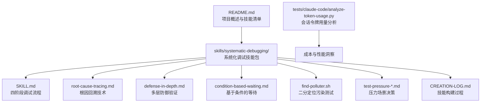
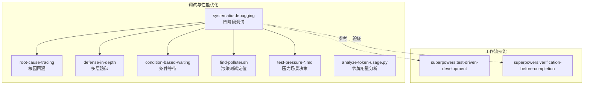
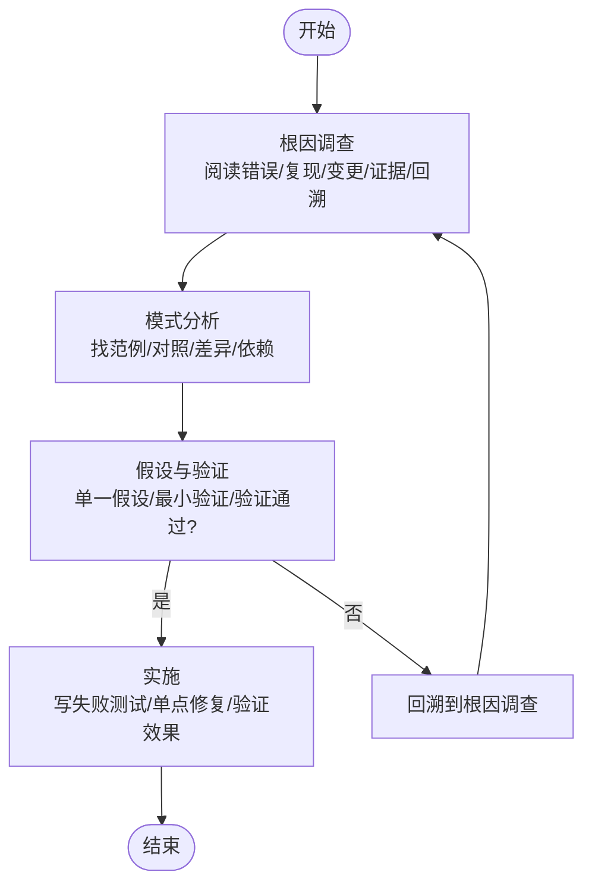
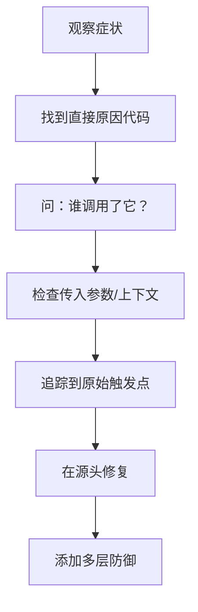
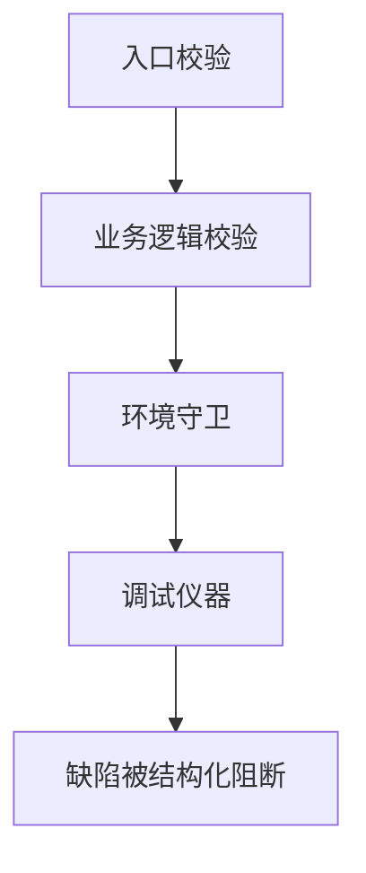
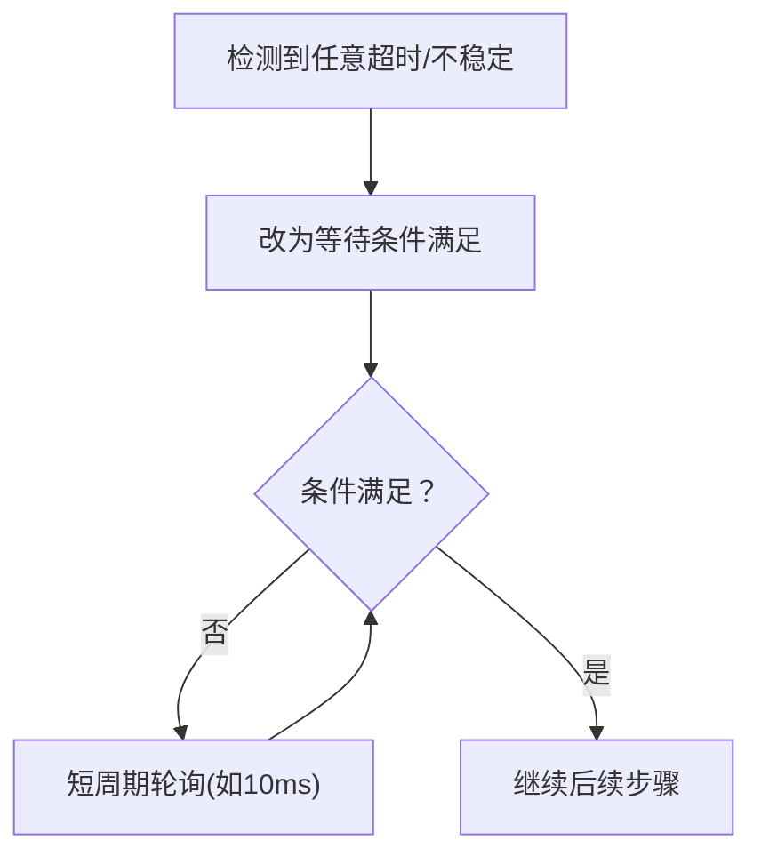
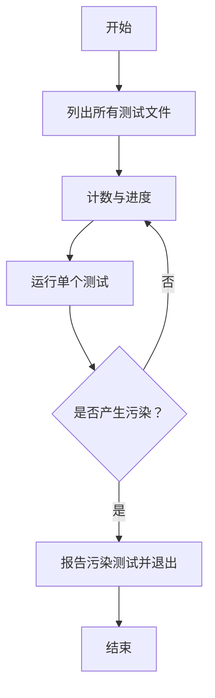
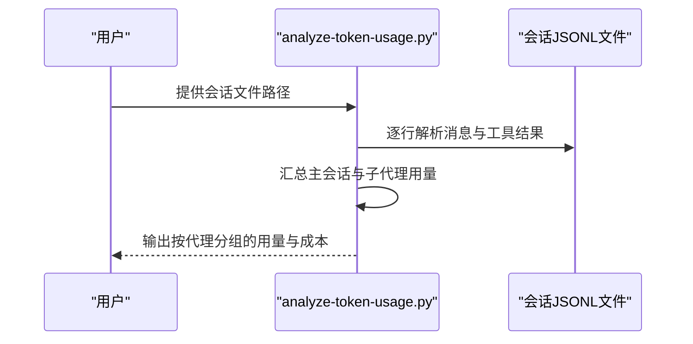
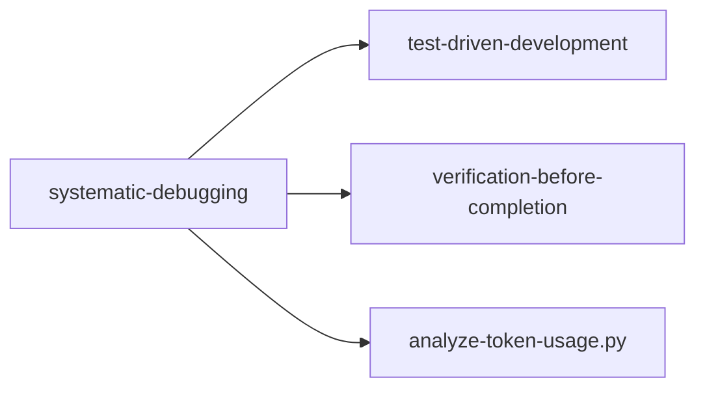

# 调试与性能优化

<cite>
**本文引用的文件**
- [README.md](file://README.md)
- [package.json](file://package.json)
- [skills/systematic-debugging/SKILL.md](file://skills/systematic-debugging/SKILL.md)
- [skills/systematic-debugging/find-polluter.sh](file://skills/systematic-debugging/find-polluter.sh)
- [skills/systematic-debugging/root-cause-tracing.md](file://skills/systematic-debugging/root-cause-tracing.md)
- [skills/systematic-debugging/condition-based-waiting.md](file://skills/systematic-debugging/condition-based-waiting.md)
- [skills/systematic-debugging/defense-in-depth.md](file://skills/systematic-debugging/defense-in-depth.md)
- [skills/systematic-debugging/test-pressure-1.md](file://skills/systematic-debugging/test-pressure-1.md)
- [skills/systematic-debugging/test-pressure-2.md](file://skills/systematic-debugging/test-pressure-2.md)
- [skills/systematic-debugging/test-pressure-3.md](file://skills/systematic-debugging/test-pressure-3.md)
- [skills/systematic-debugging/CREATION-LOG.md](file://skills/systematic-debugging/CREATION-LOG.md)
- [tests/claude-code/analyze-token-usage.py](file://tests/claude-code/analyze-token-usage.py)
</cite>

## 目录
1. [简介](#简介)
2. [项目结构](#项目结构)
3. [核心组件](#核心组件)
4. [架构总览](#架构总览)
5. [详细组件分析](#详细组件分析)
6. [依赖关系分析](#依赖关系分析)
7. [性能考量](#性能考量)
8. [故障排查指南](#故障排查指南)
9. [结论](#结论)
10. [附录](#附录)

## 简介
本指南面向 Superpowers 项目的使用者与维护者，聚焦“调试与性能优化”主题，系统化介绍如何在该工作流中高效定位问题、稳定修复、持续监控与优化性能。内容覆盖：
- 使用内置调试技能与脚本进行系统化根因调查
- 基于证据的日志与会话分析方法
- 针对并发与时序问题的条件等待策略
- 多层防御式验证以杜绝重复缺陷
- 压力场景下的决策框架与权衡
- 性能成本分析与基准测试建议

## 项目结构
Superpowers 是围绕“可组合技能”的开发工作流，调试与性能优化能力主要沉淀在“systematic-debugging”技能包中，并辅以会话令牌用量分析脚本用于成本与性能洞察。

图示来源
- [README.md:126-150](file://README.md#L126-L150)
- [skills/systematic-debugging/SKILL.md:1-297](file://skills/systematic-debugging/SKILL.md#L1-L297)
- [tests/claude-code/analyze-token-usage.py:1-169](file://tests/claude-code/analyze-token-usage.py#L1-L169)

章节来源
- [README.md:126-150](file://README.md#L126-L150)
- [package.json:1-7](file://package.json#L1-L7)

## 核心组件
- 系统化调试技能：提供四阶段（根因调查、模式分析、假设与验证、实现）流程，强制先溯源再修复，避免症状性修补。
- 根因回溯技术：从错误出现点向上追溯调用链，定位原始触发点，确保在源头修复。
- 多层防御验证：在输入校验、业务逻辑、环境约束与调试日志等多层设置检查点，使缺陷结构上不可重现。
- 条件等待策略：替代任意超时，等待实际条件满足，减少竞态与不稳定。
- 污染测试定位脚本：通过二分法逐一运行测试，快速定位制造副作用或状态污染的测试文件。
- 压力场景决策文档：在紧急、疲劳、权威压力下，提供可执行的决策路径，降低认知偏差导致的次优选择。
- 令牌用量分析脚本：解析会话 JSONL，拆分子代理与主会话的输入/输出/缓存读写令牌，估算成本，辅助性能与成本优化。

章节来源
- [skills/systematic-debugging/SKILL.md:46-214](file://skills/systematic-debugging/SKILL.md#L46-L214)
- [skills/systematic-debugging/root-cause-tracing.md:1-170](file://skills/systematic-debugging/root-cause-tracing.md#L1-L170)
- [skills/systematic-debugging/defense-in-depth.md:1-123](file://skills/systematic-debugging/defense-in-depth.md#L1-L123)
- [skills/systematic-debugging/condition-based-waiting.md:1-116](file://skills/systematic-debugging/condition-based-waiting.md#L1-L116)
- [skills/systematic-debugging/find-polluter.sh:1-64](file://skills/systematic-debugging/find-polluter.sh#L1-L64)
- [skills/systematic-debugging/test-pressure-1.md:1-59](file://skills/systematic-debugging/test-pressure-1.md#L1-L59)
- [skills/systematic-debugging/test-pressure-2.md:1-69](file://skills/systematic-debugging/test-pressure-2.md#L1-L69)
- [skills/systematic-debugging/test-pressure-3.md:1-70](file://skills/systematic-debugging/test-pressure-3.md#L1-L70)
- [tests/claude-code/analyze-token-usage.py:1-169](file://tests/claude-code/analyze-token-usage.py#L1-L169)

## 架构总览
下图展示“系统化调试”在 Superpowers 工作流中的位置与交互方式，以及与“测试驱动开发”“完成前验证”等技能的协同关系。

图示来源
- [skills/systematic-debugging/SKILL.md:280-288](file://skills/systematic-debugging/SKILL.md#L280-L288)
- [skills/systematic-debugging/CREATION-LOG.md:104-115](file://skills/systematic-debugging/CREATION-LOG.md#L104-L115)

## 详细组件分析

### 组件一：系统化调试（四阶段）
- 核心原则：先溯源，后修复；禁止症状性修补。
- 四阶段要点：
  - 根因调查：逐条阅读错误信息、稳定复现、检查变更、多组件边界收集证据、回溯数据流。
  - 模式分析：寻找已知正确范例、对照参考实现、列出差异、理解依赖。
  - 假设与验证：单一假设、最小验证、验证后再继续。
  - 实施：编写失败测试、单点修复、验证效果、若多次失败则重新审视架构。
- 抗偏误设计：明确“禁止跳过”“一次性只改一处”“失败即回溯”等规则，降低时间压力与权威压力影响。

图示来源
- [skills/systematic-debugging/SKILL.md:50-197](file://skills/systematic-debugging/SKILL.md#L50-L197)

章节来源
- [skills/systematic-debugging/SKILL.md:46-214](file://skills/systematic-debugging/SKILL.md#L46-L214)

### 组件二：根因回溯（Backward Tracing）
- 场景：错误出现在深层调用栈、难以直接定位原始触发点。
- 方法：从症状点出发，逐级向上询问“谁调用了我”，直到找到最初传入无效值的源头。
- 工具：在关键操作前记录上下文与堆栈，结合二分脚本定位具体测试。

图示来源
- [skills/systematic-debugging/root-cause-tracing.md:32-151](file://skills/systematic-debugging/root-cause-tracing.md#L32-L151)

章节来源
- [skills/systematic-debugging/root-cause-tracing.md:1-170](file://skills/systematic-debugging/root-cause-tracing.md#L1-L170)

### 组件三：多层防御（Defense-in-Depth）
- 目标：让缺陷在结构上不可能再次发生。
- 四层：
  - 入口校验：拒绝明显非法输入。
  - 业务逻辑校验：确保数据对当前操作有效。
  - 环境守卫：在特定上下文中阻止危险操作。
  - 调试仪器：记录上下文便于取证。
- 效果：不同路径、不同平台、不同模拟器均能捕获问题。

图示来源
- [skills/systematic-debugging/defense-in-depth.md:20-122](file://skills/systematic-debugging/defense-in-depth.md#L20-L122)

章节来源
- [skills/systematic-debugging/defense-in-depth.md:1-123](file://skills/systematic-debugging/defense-in-depth.md#L1-L123)

### 组件四：条件等待（Condition-Based Waiting）
- 场景：测试存在任意超时、不稳定、并行超时等问题。
- 方法：等待实际条件满足，而非猜测耗时；统一超时与轮询间隔；必要时记录为何需要固定时长。
- 结果：显著提升稳定性与速度，消除竞态。

图示来源
- [skills/systematic-debugging/condition-based-waiting.md:9-116](file://skills/systematic-debugging/condition-based-waiting.md#L9-L116)

章节来源
- [skills/systematic-debugging/condition-based-waiting.md:1-116](file://skills/systematic-debugging/condition-based-waiting.md#L1-L116)

### 组件五：污染测试定位（Bisection Finder）
- 用途：当测试产生意外文件/状态但不确定是哪个测试引起时，通过二分法逐一运行测试，快速定位“污染者”。
- 使用：提供待检查目标与测试匹配模式，脚本自动运行并报告首个引发污染的测试。

图示来源
- [skills/systematic-debugging/find-polluter.sh:1-64](file://skills/systematic-debugging/find-polluter.sh#L1-L64)

章节来源
- [skills/systematic-debugging/find-polluter.sh:1-64](file://skills/systematic-debugging/find-polluter.sh#L1-L64)

### 组件六：压力场景决策（Pressure Tests）
- 面临真实压力（紧急、疲劳、权威、社交压力）时，提供可执行的决策路径，避免“快速修补”陷阱。
- 三个场景分别对应：生产故障、长时间调试、团队权威影响。
- 建议采用“最小调查+临时方案+事后复盘”的平衡策略，既止损又保留学习机会。

章节来源
- [skills/systematic-debugging/test-pressure-1.md:1-59](file://skills/systematic-debugging/test-pressure-1.md#L1-L59)
- [skills/systematic-debugging/test-pressure-2.md:1-69](file://skills/systematic-debugging/test-pressure-2.md#L1-L69)
- [skills/systematic-debugging/test-pressure-3.md:1-70](file://skills/systematic-debugging/test-pressure-3.md#L1-L70)

### 组件七：令牌用量分析（Token Usage Analysis）
- 用途：解析 Claude Code 会话 JSONL，统计主会话与各子代理的消息、输入/输出/缓存读写令牌，估算成本。
- 应用：识别高消耗代理、评估会话效率、指导优化与预算控制。

图示来源
- [tests/claude-code/analyze-token-usage.py:12-169](file://tests/claude-code/analyze-token-usage.py#L12-L169)

章节来源
- [tests/claude-code/analyze-token-usage.py:1-169](file://tests/claude-code/analyze-token-usage.py#L1-L169)

## 依赖关系分析
- 技能内聚：systematic-debugging 各文档围绕同一目标协作，形成闭环（调查→分析→验证→修复→防御）。
- 技能间耦合：与“测试驱动开发”“完成前验证”形成前后置关系，前者负责定位，后者负责确认修复质量。
- 外部依赖：会话分析脚本依赖会话日志格式；条件等待策略依赖稳定的异步条件表达式。

图示来源
- [skills/systematic-debugging/SKILL.md:286-288](file://skills/systematic-debugging/SKILL.md#L286-L288)

章节来源
- [skills/systematic-debugging/SKILL.md:280-288](file://skills/systematic-debugging/SKILL.md#L280-L288)

## 性能考量
- 日志与会话成本：通过令牌用量分析脚本量化输入/输出/缓存读写成本，识别高开销代理与冗余对话，指导优化。
- 测试稳定性：用条件等待替代任意超时，减少竞态与重试成本，提高并行测试吞吐。
- 缺陷预防：多层防御使缺陷结构上不可重现，降低回归成本与修复频率。
- 压力下的性能权衡：在紧急情况下采用“最小调查+临时方案+事后复盘”，避免无谓的长期投入，同时保留改进机会。

## 故障排查指南

### 内存泄漏检测
- 适用场景：长时间运行任务、频繁创建对象、未释放资源。
- 建议步骤：
  - 使用条件等待替换任意超时，避免因等待不当导致的资源堆积。
  - 在关键路径增加调试仪器，记录对象生命周期与上下文。
  - 对疑似泄漏区域进行隔离测试，逐步缩小范围。
  - 若问题仅在特定环境下出现，结合环境守卫限制危险操作，防止污染扩大。

章节来源
- [skills/systematic-debugging/condition-based-waiting.md:84-108](file://skills/systematic-debugging/condition-based-waiting.md#L84-L108)
- [skills/systematic-debugging/defense-in-depth.md:72-85](file://skills/systematic-debugging/defense-in-depth.md#L72-L85)

### 性能瓶颈识别
- 会话成本分析：使用令牌用量分析脚本识别高消耗代理与消息量异常，定位对话冗余或工具调用过度。
- 测试稳定性：将任意超时替换为条件等待，减少无效重试与竞态，提升整体吞吐。
- 数据流回溯：对慢点进行根因回溯，定位上游数据准备或转换瓶颈。

章节来源
- [tests/claude-code/analyze-token-usage.py:102-165](file://tests/claude-code/analyze-token-usage.py#L102-L165)
- [skills/systematic-debugging/condition-based-waiting.md:34-83](file://skills/systematic-debugging/condition-based-waiting.md#L34-L83)
- [skills/systematic-debugging/root-cause-tracing.md:32-96](file://skills/systematic-debugging/root-cause-tracing.md#L32-L96)

### 并发问题排查
- 症状：测试在并行或负载下不稳定、偶发失败。
- 处理：
  - 将任意超时改为条件等待，确保等待的是确定事件或状态。
  - 对共享状态进行多层校验，避免竞态窗口。
  - 使用污染测试定位脚本，排除个别测试引入的全局状态干扰。

章节来源
- [skills/systematic-debugging/condition-based-waiting.md:24-83](file://skills/systematic-debugging/condition-based-waiting.md#L24-L83)
- [skills/systematic-debugging/find-polluter.sh:1-64](file://skills/systematic-debugging/find-polluter.sh#L1-L64)
- [skills/systematic-debugging/defense-in-depth.md:20-70](file://skills/systematic-debugging/defense-in-depth.md#L20-L70)

### 常见问题诊断与解决
- 快速修补陷阱：当症状明显且“看起来容易修复”时，仍需遵循四阶段流程，避免掩盖更深层问题。
- 多次修复无效：若尝试多次修复仍出现新问题，应停止并重新审视架构，而非继续症状修补。
- 权威压力：在有经验者建议与团队压力下，坚持“尽到调查义务”（如快速查阅文档），再决定是否采纳建议。

章节来源
- [skills/systematic-debugging/SKILL.md:215-244](file://skills/systematic-debugging/SKILL.md#L215-L244)
- [skills/systematic-debugging/test-pressure-3.md:32-66](file://skills/systematic-debugging/test-pressure-3.md#L32-L66)

## 结论
Superpowers 的“系统化调试”技能包提供了从根因调查到修复验证再到缺陷预防的完整闭环。配合条件等待、多层防御、污染测试定位与令牌用量分析，可在保证质量的同时显著提升稳定性与效率。在压力场景下，借助压力测试文档提供的决策框架，有助于在“速度”与“正确性”之间取得稳健平衡。

## 附录
- 使用建议
  - 新问题优先使用系统化调试四阶段，确保根因清晰后再修复。
  - 遇到不稳定测试，一律改用条件等待，统一轮询与超时策略。
  - 发现污染测试，立即用二分脚本定位并隔离，随后修复。
  - 定期用令牌用量分析审视会话成本，识别优化空间。
  - 在紧急、疲劳、权威压力下，遵循压力场景决策文档，避免认知偏差导致的次优选择。