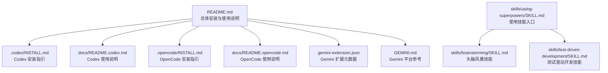
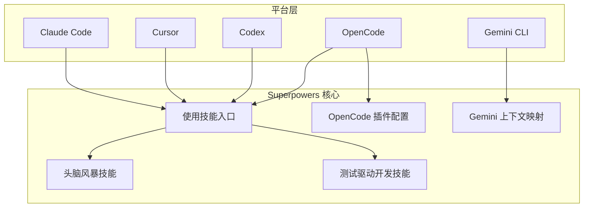

# 快速开始

<cite>
**本文引用的文件**
- [README.md](file://README.md)
- [.codex/INSTALL.md](file://.codex/INSTALL.md)
- [docs/README.codex.md](file://docs/README.codex.md)
- [.opencode/INSTALL.md](file://.opencode/INSTALL.md)
- [docs/README.opencode.md](file://docs/README.opencode.md)
- [gemini-extension.json](file://gemini-extension.json)
- [GEMINI.md](file://GEMINI.md)
- [skills/using-superpowers/SKILL.md](file://skills/using-superpowers/SKILL.md)
- [skills/brainstorming/SKILL.md](file://skills/brainstorming/SKILL.md)
- [skills/test-driven-development/SKILL.md](file://skills/test-driven-development/SKILL.md)
- [hooks/hooks.json](file://hooks/hooks.json)
- [hooks/hooks-cursor.json](file://hooks/hooks-cursor.json)
- [package.json](file://package.json)
</cite>

## 目录
1. [简介](#简介)
2. [项目结构](#项目结构)
3. [核心组件](#核心组件)
4. [架构总览](#架构总览)
5. [详细组件分析](#详细组件分析)
6. [依赖关系分析](#依赖关系分析)
7. [性能与稳定性建议](#性能与稳定性建议)
8. [故障排除指南](#故障排除指南)
9. [结语](#结语)
10. [附录：平台安装清单](#附录平台安装清单)

## 简介
Superpowers 是一套面向“代码智能体”的可组合工作流与技能库，围绕“先设计、再实现”的工程范式构建。它通过内置的技能（如头脑风暴、测试驱动开发、系统化调试等）自动引导智能体完成从需求澄清到实现交付的完整闭环，帮助你在最短时间内稳定地产出高质量代码。

本快速开始指南覆盖所有支持平台的安装与配置流程，包括 Claude Code、Cursor、Codex、OpenCode、Gemini CLI，并提供验证安装成功的方法、基本使用示例以及常见问题排查建议，确保新用户能在最短时间内上手并开始使用 Superpowers。

## 项目结构
仓库采用“技能即插件”的组织方式，核心内容集中在 skills 目录，平台适配与安装说明分布在根目录与 docs 子目录中。不同平台通过各自的插件机制或本地技能发现能力加载 Superpowers 技能。

图示来源
- [README.md:27-106](file://README.md#L27-L106)
- [.codex/INSTALL.md:1-68](file://.codex/INSTALL.md#L1-L68)
- [docs/README.codex.md:1-127](file://docs/README.codex.md#L1-L127)
- [.opencode/INSTALL.md:1-84](file://.opencode/INSTALL.md#L1-L84)
- [docs/README.opencode.md:1-131](file://docs/README.opencode.md#L1-L131)
- [gemini-extension.json:1-7](file://gemini-extension.json#L1-L7)
- [GEMINI.md:1-3](file://GEMINI.md#L1-L3)
- [skills/using-superpowers/SKILL.md:1-118](file://skills/using-superpowers/SKILL.md#L1-L118)
- [skills/brainstorming/SKILL.md:1-165](file://skills/brainstorming/SKILL.md#L1-L165)
- [skills/test-driven-development/SKILL.md:1-372](file://skills/test-driven-development/SKILL.md#L1-L372)

章节来源
- [README.md:27-106](file://README.md#L27-L106)

## 核心组件
- 使用技能（入口）：在各平台以工具形式加载，强制要求在任何响应前先调用合适的技能，确保遵循工作流纪律。
- 头脑风暴技能：在实现任何功能之前，必须先进行需求澄清、方案对比与设计确认。
- 测试驱动开发技能：在实现任何功能或修复任何缺陷之前，必须先写失败的测试，再最小化实现并通过测试。
- OpenCode 插件：通过包配置与钩子自动注入上下文并注册技能目录，无需手动链接。
- Gemini 扩展：通过扩展元数据与平台参考文件实现工具映射与加载。

章节来源
- [skills/using-superpowers/SKILL.md:1-118](file://skills/using-superpowers/SKILL.md#L1-L118)
- [skills/brainstorming/SKILL.md:1-165](file://skills/brainstorming/SKILL.md#L1-L165)
- [skills/test-driven-development/SKILL.md:1-372](file://skills/test-driven-development/SKILL.md#L1-L372)
- [package.json:1-7](file://package.json#L1-L7)

## 架构总览
Superpowers 在不同平台通过以下方式集成：
- Claude Code/Cursor：通过内置插件市场安装后，使用“Skill”工具加载技能。
- Codex：通过本地技能发现机制，使用符号链接指向 skills 目录。
- OpenCode：通过插件声明与钩子自动注册技能目录并注入上下文。
- Gemini CLI：通过扩展元数据与平台参考文件加载技能与工具映射。

图示来源
- [README.md:31-106](file://README.md#L31-L106)
- [docs/README.codex.md:50-58](file://docs/README.codex.md#L50-L58)
- [docs/README.opencode.md:91-96](file://docs/README.opencode.md#L91-L96)
- [gemini-extension.json:1-7](file://gemini-extension.json#L1-L7)
- [GEMINI.md:1-3](file://GEMINI.md#L1-L3)

## 详细组件分析

### Claude Code（官方插件市场）
- 安装方式：从官方插件市场安装；也可添加第三方市场后安装。
- 使用方法：在会话中使用“Skill”工具加载所需技能，或直接提及技能名称触发。
- 验证方法：发起一次需要触发技能的任务（例如“帮我规划这个功能”），观察是否自动调用相应技能。

章节来源
- [README.md:31-53](file://README.md#L31-L53)

### Cursor（插件市场）
- 安装方式：在 Cursor Agent 聊天界面中从市场搜索并安装“superpowers”。
- 使用方法：使用“add-plugin”命令或在市场中搜索安装后，即可在会话中调用技能。
- 验证方法：与 Claude Code 类似，发起一次需要触发技能的任务，确认技能被调用。

章节来源
- [README.md:55-63](file://README.md#L55-L63)

### Codex（本地技能发现）
- 安装方式：克隆仓库并在用户目录创建指向 skills 的符号链接；重启 Codex 使其发现技能。
- 多智能体支持：如需使用并行子代理技能，可在 Codex 配置中启用多智能体功能。
- 验证方法：检查符号链接是否存在且指向正确的 skills 目录；重启后技能应可见。
- 升级与卸载：通过 git 拉取最新版本；卸载时删除符号链接与克隆目录。

章节来源
- [.codex/INSTALL.md:1-68](file://.codex/INSTALL.md#L1-L68)
- [docs/README.codex.md:13-58](file://docs/README.codex.md#L13-L58)

### OpenCode（插件与钩子）
- 安装方式：在 opencode.json 中添加插件条目，重启后自动安装并注册所有技能。
- 使用方法：使用原生“skill”工具列出与加载技能；支持个人与项目级技能优先级。
- 工具映射：为 Claude Code 工具提供自动映射，便于跨平台一致使用。
- 验证方法：发起一次需要触发技能的任务，确认技能被调用；若未出现，检查日志与插件声明。
- 升级与回滚：重启后自动从 Git 源重新安装；可通过指定分支或标签固定版本。

章节来源
- [.opencode/INSTALL.md:1-84](file://.opencode/INSTALL.md#L1-L84)
- [docs/README.opencode.md:1-131](file://docs/README.opencode.md#L1-L131)
- [package.json:1-7](file://package.json#L1-L7)

### Gemini CLI（扩展）
- 安装方式：通过扩展命令安装；更新时使用对应更新命令。
- 上下文映射：通过扩展元数据与平台参考文件加载技能与工具映射。
- 验证方法：发起一次需要触发技能的任务，确认技能被调用；若未出现，检查扩展状态与平台版本。

章节来源
- [README.md:92-102](file://README.md#L92-L102)
- [gemini-extension.json:1-7](file://gemini-extension.json#L1-L7)
- [GEMINI.md:1-3](file://GEMINI.md#L1-L3)

### 基本使用流程（技能触发）
- 触发时机：收到用户消息后，先判断是否有适用技能；若有，必须先调用技能，再执行后续动作。
- 流程要点：即使有 1% 的可能性适用，也必须先调用技能；若调用后发现不适用，可不执行但必须先调用。
- 强制规则：当多个技能可能适用时，优先处理流程类技能（如头脑风暴、调试），再处理实现类技能。

图示来源
- [skills/using-superpowers/SKILL.md:44-76](file://skills/using-superpowers/SKILL.md#L44-L76)

章节来源
- [skills/using-superpowers/SKILL.md:1-118](file://skills/using-superpowers/SKILL.md#L1-L118)

## 依赖关系分析
- 平台适配依赖：
  - 使用技能（入口）依赖各平台的工具加载机制（Skill、skill、activate_skill）。
  - OpenCode 通过钩子与包配置自动注册技能目录，减少手工配置。
  - Gemini 通过扩展元数据与平台参考文件实现工具映射。
- 技能依赖：
  - 头脑风暴技能依赖使用技能（入口）作为前置条件。
  - 测试驱动开发技能强调在实现前必须先写失败测试，贯穿整个实现流程。

图示来源
- [skills/using-superpowers/SKILL.md:1-118](file://skills/using-superpowers/SKILL.md#L1-L118)
- [skills/brainstorming/SKILL.md:1-165](file://skills/brainstorming/SKILL.md#L1-L165)
- [skills/test-driven-development/SKILL.md:1-372](file://skills/test-driven-development/SKILL.md#L1-L372)
- [docs/README.opencode.md:91-96](file://docs/README.opencode.md#L91-L96)
- [gemini-extension.json:1-7](file://gemini-extension.json#L1-L7)

章节来源
- [skills/using-superpowers/SKILL.md:1-118](file://skills/using-superpowers/SKILL.md#L1-L118)
- [skills/brainstorming/SKILL.md:1-165](file://skills/brainstorming/SKILL.md#L1-L165)
- [skills/test-driven-development/SKILL.md:1-372](file://skills/test-driven-development/SKILL.md#L1-L372)
- [docs/README.opencode.md:91-96](file://docs/README.opencode.md#L91-L96)
- [gemini-extension.json:1-7](file://gemini-extension.json#L1-L7)

## 性能与稳定性建议
- 启动阶段：确保平台已正确加载插件或技能目录，避免重复启动导致的资源浪费。
- 技能选择：优先使用流程类技能（如头脑风暴、调试）作为前置，减少无效实现尝试。
- 版本管理：OpenCode 支持固定版本，建议在生产环境锁定版本以保证一致性。
- 日志与诊断：遇到问题时优先查看平台日志，定位插件加载与技能发现环节的问题。

## 故障排除指南
- 安装相关
  - Codex：检查符号链接是否存在且指向正确的 skills 目录；重启后再次确认。
  - OpenCode：检查 opencode.json 中的插件声明；查看启动日志；确认平台版本支持相关钩子。
  - Gemini：确认扩展安装状态与平台版本兼容；必要时更新扩展。
- 技能未触发
  - 确认使用了平台对应的技能加载工具（Skill、skill、activate_skill）。
  - 检查使用技能（入口）是否正确配置，确保在任何响应前调用技能。
- 工具映射差异
  - OpenCode 与 Gemini 对 Claude Code 工具有自动映射；若某些工具不可用，请参考平台文档与映射表。

章节来源
- [.codex/INSTALL.md:45-68](file://.codex/INSTALL.md#L45-L68)
- [.opencode/INSTALL.md:59-84](file://.opencode/INSTALL.md#L59-L84)
- [docs/README.opencode.md:107-131](file://docs/README.opencode.md#L107-L131)
- [README.md:92-102](file://README.md#L92-L102)
- [skills/using-superpowers/SKILL.md:28-41](file://skills/using-superpowers/SKILL.md#L28-L41)

## 结语
通过以上安装与配置流程，你可以在各平台上快速启用 Superpowers，并借助使用技能（入口）、头脑风暴与测试驱动开发等核心技能，建立标准化、可复用的工作流。建议在首次使用时以“规划功能”或“调试问题”等典型场景进行验证，逐步探索更多技能的应用。

## 附录：平台安装清单
- Claude Code
  - 从官方插件市场安装；或添加第三方市场后安装。
  - 使用“Skill”工具加载技能；发起一次需要触发技能的任务进行验证。
- Cursor
  - 在市场中搜索并安装“superpowers”；使用“add-plugin”命令或在市场中搜索安装。
  - 发起一次需要触发技能的任务进行验证。
- Codex
  - 克隆仓库并在用户目录创建指向 skills 的符号链接；重启 Codex。
  - 如需并行子代理技能，在 Codex 配置中启用多智能体功能。
  - 发起一次需要触发技能的任务进行验证。
- OpenCode
  - 在 opencode.json 中添加插件条目；重启后自动安装并注册技能。
  - 使用原生“skill”工具列出与加载技能；发起一次需要触发技能的任务进行验证。
- Gemini CLI
  - 通过扩展命令安装；更新时使用对应更新命令。
  - 发起一次需要触发技能的任务进行验证。

章节来源
- [README.md:27-106](file://README.md#L27-L106)
- [.codex/INSTALL.md:1-68](file://.codex/INSTALL.md#L1-L68)
- [.opencode/INSTALL.md:1-84](file://.opencode/INSTALL.md#L1-L84)
- [docs/README.codex.md:13-58](file://docs/README.codex.md#L13-L58)
- [docs/README.opencode.md:1-131](file://docs/README.opencode.md#L1-L131)
- [gemini-extension.json:1-7](file://gemini-extension.json#L1-L7)
- [GEMINI.md:1-3](file://GEMINI.md#L1-L3)