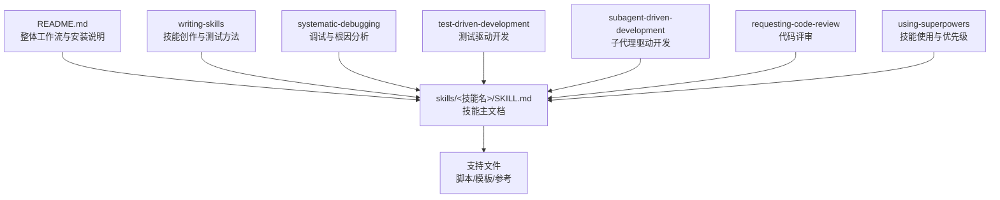
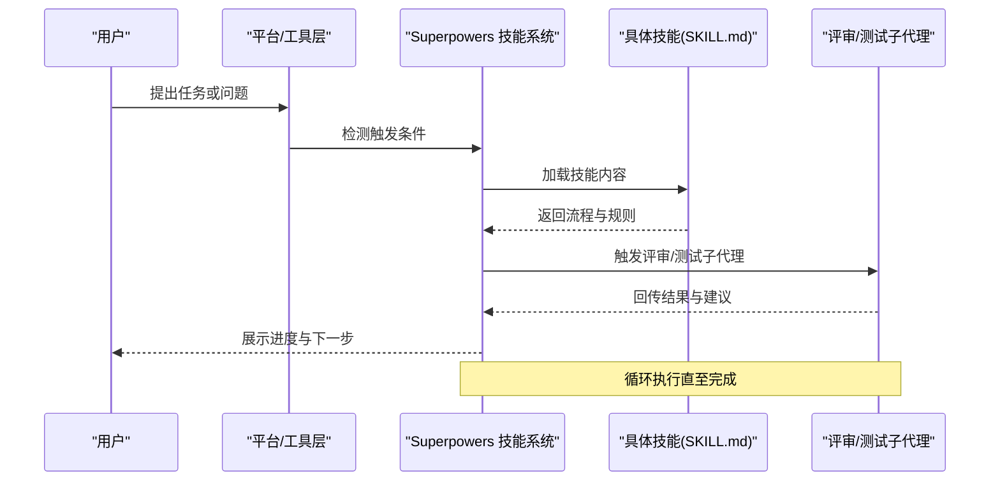
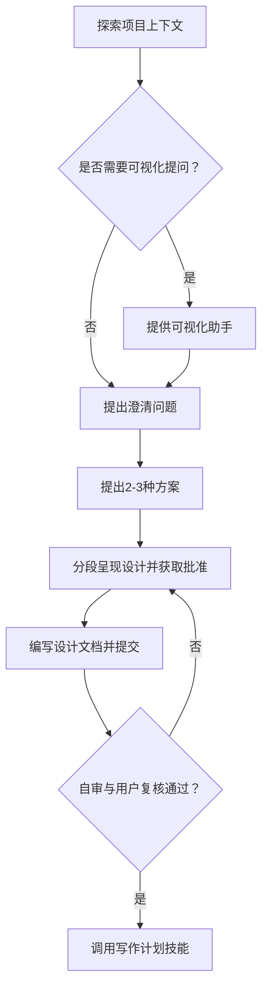
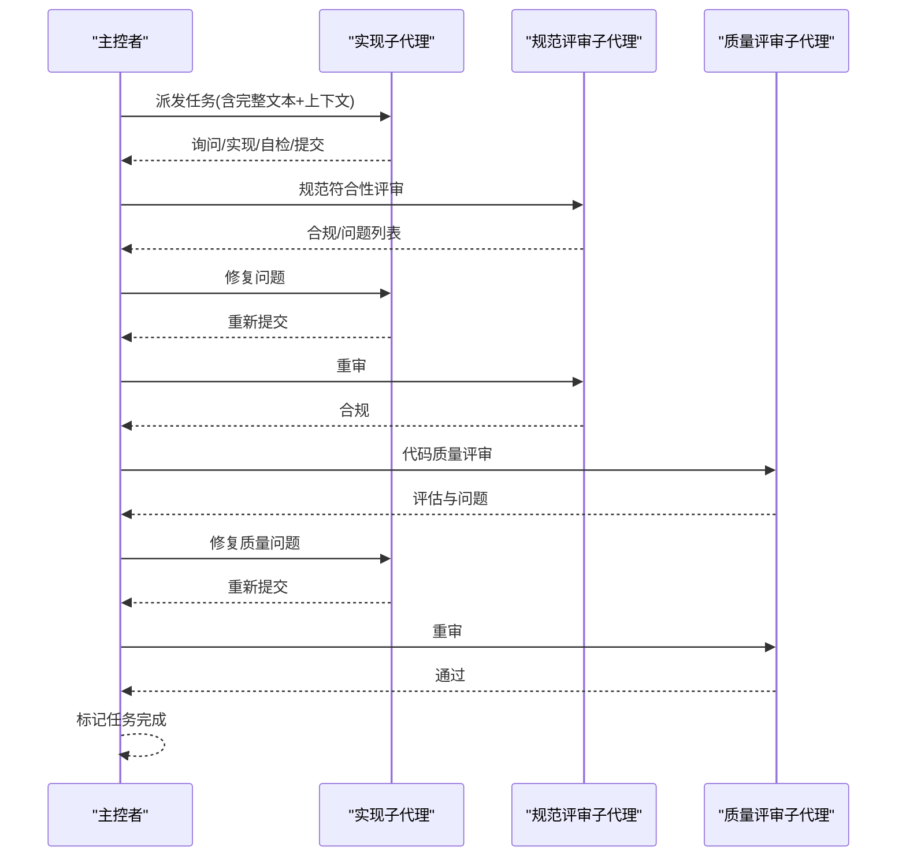
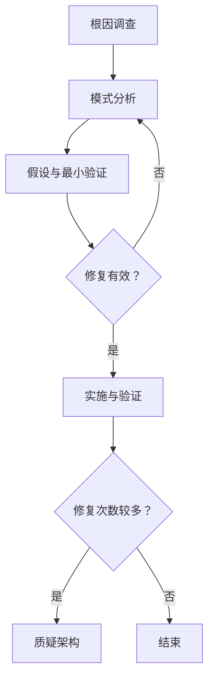
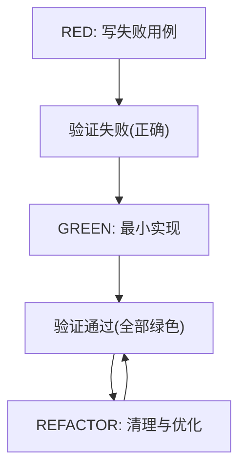
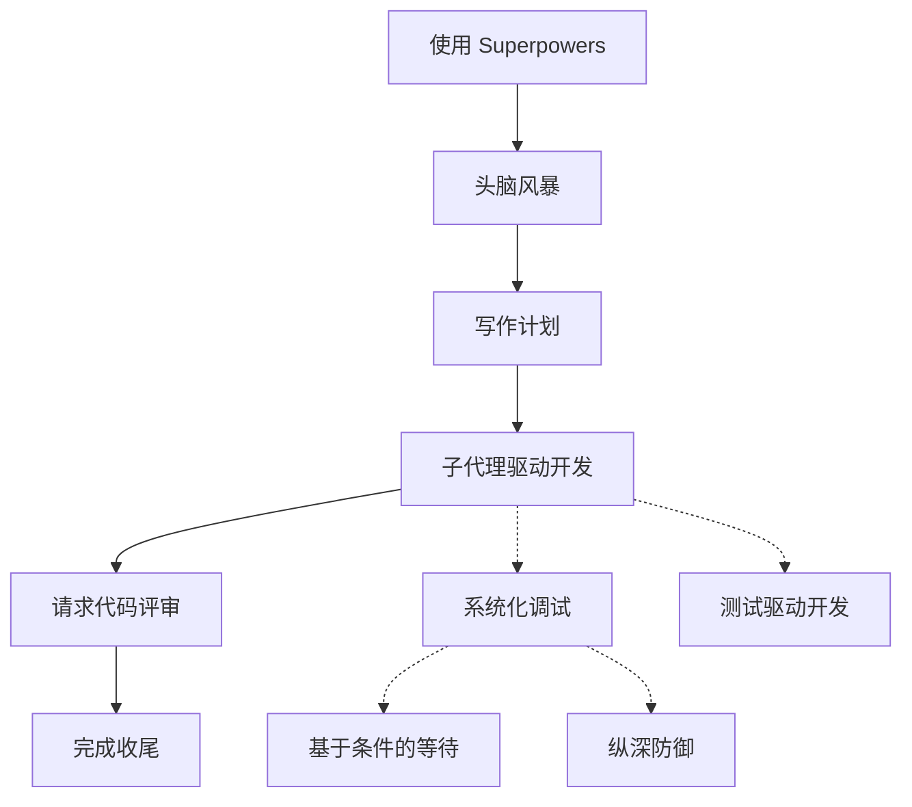

# 技能开发指南

<cite>
**本文档引用的文件**
- [README.md](file://README.md)
- [SKILL.md（头脑风暴）](file://skills/brainstorming/SKILL.md)
- [SKILL.md（编写技能）](file://skills/writing-skills/SKILL.md)
- [SKILL.md（系统化调试）](file://skills/systematic-debugging/SKILL.md)
- [SKILL.md（测试驱动开发）](file://skills/test-driven-development/SKILL.md)
- [SKILL.md（子代理驱动开发）](file://skills/subagent-driven-development/SKILL.md)
- [SKILL.md（请求代码评审）](file://skills/requesting-code-review/SKILL.md)
- [SKILL.md（使用 Superpowers）](file://skills/using-superpowers/SKILL.md)
- [最佳实践（Anthropic）](file://skills/writing-skills/anthropic-best-practices.md)
- [图渲染脚本](file://skills/writing-skills/render-graphs.js)
- [图样式约定](file://skills/writing-skills/graphviz-conventions.dot)
- [子代理技能测试方法](file://skills/writing-skills/testing-skills-with-subagents.md)
- [根因追溯](file://skills/systematic-debugging/root-cause-tracing.md)
- [纵深防御](file://skills/systematic-debugging/defense-in-depth.md)
- [基于条件的等待](file://skills/systematic-debugging/condition-based-waiting.md)
- [测试反模式](file://skills/test-driven-development/testing-anti-patterns.md)
</cite>

## 目录
1. [简介](#简介)
2. [项目结构](#项目结构)
3. [核心组件](#核心组件)
4. [架构总览](#架构总览)
5. [详细组件分析](#详细组件分析)
6. [依赖关系分析](#依赖关系分析)
7. [性能考量](#性能考量)
8. [故障排查指南](#故障排查指南)
9. [结论](#结论)
10. [附录](#附录)

## 简介
本指南面向 Superpowers 技能开发者，系统讲解如何创建高质量的技能模块，包括 SKILL.md 的结构规范、最佳实践、设计模式、质量标准、测试方法、文档要求与版本管理策略，并提供平台适配与工具映射说明，帮助你构建可发现、可验证、可维护的技能。

## 项目结构
Superpowers 以“可组合技能”为核心，围绕“设计-计划-执行-评审-收尾”的闭环工作流组织技能。每个技能由独立目录中的 SKILL.md 主文件与可选的支持文件组成，遵循统一的命名与内容规范。

图表来源
- [README.md:108-125](file://README.md#L108-L125)
- [SKILL.md（编写技能）:72-92](file://skills/writing-skills/SKILL.md#L72-L92)

章节来源
- [README.md:108-125](file://README.md#L108-L125)

## 核心组件
- 设计阶段：头脑风暴技能用于将想法转化为可验证的设计文档，强调“先设计后实现”，并通过可视化助手提升沟通效率。
- 计划阶段：写作计划技能将设计拆解为可执行任务清单，确保每项任务具备明确路径、上下文与验收标准。
- 执行阶段：子代理驱动开发通过“每任务一个子代理 + 双阶段评审（规范符合性 → 代码质量）”实现高吞吐、低偏差的自动化执行。
- 测试阶段：测试驱动开发强制“先写失败用例，再最小实现，最后重构”，保证行为正确且可回归。
- 调试阶段：系统化调试提供四阶段根因调查流程，结合根因追溯、纵深防御与基于条件的等待等技术，系统化解决复杂问题。
- 评审阶段：请求代码评审在关键节点进行质量把关，避免问题累积。
- 使用与适配：使用 Superpowers 技能定义技能加载顺序、工具映射与优先级，确保跨平台一致体验。

章节来源
- [SKILL.md（头脑风暴）:6-165](file://skills/brainstorming/SKILL.md#L6-L165)
- [SKILL.md（编写技能）:30-46](file://skills/writing-skills/SKILL.md#L30-L46)
- [SKILL.md（子代理驱动开发）:40-85](file://skills/subagent-driven-development/SKILL.md#L40-L85)
- [SKILL.md（测试驱动开发）:47-69](file://skills/test-driven-development/SKILL.md#L47-L69)
- [SKILL.md（系统化调试）:46-87](file://skills/systematic-debugging/SKILL.md#L46-L87)
- [SKILL.md（请求代码评审）:12-23](file://skills/requesting-code-review/SKILL.md#L12-L23)
- [SKILL.md（使用 Superpowers）:42-76](file://skills/using-superpowers/SKILL.md#L42-L76)

## 架构总览
Superpowers 的技能体系采用“触发-加载-执行-反馈”的闭环：平台在对话中自动检测适用技能，加载其内容并按步骤执行；执行过程中通过评审与测试持续反馈，最终完成收尾与清理。

图表来源
- [README.md:108-125](file://README.md#L108-L125)
- [SKILL.md（使用 Superpowers）:48-76](file://skills/using-superpowers/SKILL.md#L48-L76)

## 详细组件分析

### 头脑风暴技能（设计到实现的桥梁）
- 触发条件：任何创意性工作（功能、组件、行为变更）开始前。
- 关键流程：探索上下文 → 可视化提问（可选）→ 明确问题 → 提出方案 → 分段呈现设计 → 编写规范文档 → 自审与用户复核 → 进入写作计划。
- 设计原则：单一问题一次一问、多选项对比、按复杂度分段展示、关注架构/数据/错误处理/测试。
- 可视化助手：在涉及视觉/布局/架构图时，提供浏览器辅助展示，但需单独提示、不与问题混杂。
- 终止状态：仅调用“写作计划”技能进入实现阶段。

图表来源
- [SKILL.md（头脑风暴）:34-66](file://skills/brainstorming/SKILL.md#L34-L66)

章节来源
- [SKILL.md（头脑风暴）:20-165](file://skills/brainstorming/SKILL.md#L20-L165)

### 子代理驱动开发（高吞吐、双阶段评审）
- 触发条件：已有实现计划且任务相对独立。
- 核心流程：读取计划 → 逐任务派发子代理 → 子代理问答/实现/自检/提交 → 规范符合性评审 → 代码质量评审 → 完成标记 → 最终评审 → 收尾。
- 模型选择：机械实现用廉价模型，集成判断用标准模型，架构设计用最强模型。
- 状态处理：DONE/DONE_WITH_CONCERNS/NEEDS_CONTEXT/BLOCKED 四类状态分别处置。
- 红灯清单：禁止直接在主分支修改、跳过评审、忽略问题、并行派发冲突任务等。

图表来源
- [SKILL.md（子代理驱动开发）:40-85](file://skills/subagent-driven-development/SKILL.md#L40-L85)

章节来源
- [SKILL.md（子代理驱动开发）:14-278](file://skills/subagent-driven-development/SKILL.md#L14-L278)

### 系统化调试（根因调查与纵深防御）
- 触发条件：遇到任何缺陷、测试失败或异常行为。
- 四阶段流程：根因调查（读取错误、重现、检查变更、多组件证据收集）→ 模式分析（寻找工作示例、对比差异、理解依赖）→ 假设与最小验证（形成假设、单变量验证、确认或重建）→ 实施与架构复核（创建失败用例、单点修复、验证与回归、必要时质疑架构）。
- 支持技术：根因追溯（从调用栈回溯原始触发）、纵深防御（四层验证）、基于条件的等待（替代任意超时）。

图表来源
- [SKILL.md（系统化调试）:46-197](file://skills/systematic-debugging/SKILL.md#L46-L197)

章节来源
- [SKILL.md（系统化调试）:1-297](file://skills/systematic-debugging/SKILL.md#L1-L297)
- [根因追溯:1-170](file://skills/systematic-debugging/root-cause-tracing.md#L1-L170)
- [纵深防御:1-123](file://skills/systematic-debugging/defense-in-depth.md#L1-L123)
- [基于条件的等待:1-116](file://skills/systematic-debugging/condition-based-waiting.md#L1-L116)

### 测试驱动开发（行为验证与最小实现）
- 触发条件：任何新特性、缺陷修复、重构或行为变更。
- 红绿重构循环：写失败用例 → 验证失败 → 写最小实现 → 验证通过 → 重构清理 → 下一条用例。
- 常见误区与反模式：测试后置、覆盖实现而非行为、添加仅测试方法到生产类、无理解的过度模拟、不完整模拟等。
- 评审与回归：每次实现后创建失败用例，确保修复可回归。

图表来源
- [SKILL.md（测试驱动开发）:47-69](file://skills/test-driven-development/SKILL.md#L47-L69)

章节来源
- [SKILL.md（测试驱动开发）:1-372](file://skills/test-driven-development/SKILL.md#L1-L372)
- [测试反模式:1-300](file://skills/test-driven-development/testing-anti-patterns.md#L1-L300)

### 请求代码评审（关键节点的质量把关）
- 触发条件：每个任务完成后、重大功能完成后、合并前。
- 流程：获取基线与头指针 → 派发评审子代理 → 汇总强度/重要/次要问题 → 修复并推进 → 推荐合并。
- 红灯清单：忽略严重问题、强行推进、忽视有效反馈。

章节来源
- [SKILL.md（请求代码评审）:12-106](file://skills/requesting-code-review/SKILL.md#L12-L106)

### 使用 Superpowers（技能加载与平台适配）
- 触发规则：在任何可能有技能适用的任务前，必须先调用技能工具加载并遵循技能内容。
- 优先级：用户指令 > Superpowers 技能 > 默认系统提示。
- 平台适配：不同平台使用不同的工具名称（Claude Code 的 Skill 工具、Copilot CLI 的 skill 工具、Gemini CLI 的 activate_skill 工具），参考各平台映射文档。

章节来源
- [SKILL.md（使用 Superpowers）:18-118](file://skills/using-superpowers/SKILL.md#L18-L118)

## 依赖关系分析
技能之间存在强弱依赖与协作关系：
- 强约束技能：测试驱动开发、系统化调试、使用 Superpowers 对流程具有刚性约束，不可随意偏离。
- 协作型技能：头脑风暴 → 写作计划 → 子代理驱动开发 → 请求代码评审 → 完成收尾，形成闭环。
- 支撑型技能：基于条件的等待、根因追溯、纵深防御等技术技能为调试与执行提供工程保障。

图表来源
- [README.md:108-125](file://README.md#L108-L125)
- [SKILL.md（子代理驱动开发）:265-278](file://skills/subagent-driven-development/SKILL.md#L265-L278)
- [SKILL.md（系统化调试）:278-289](file://skills/systematic-debugging/SKILL.md#L278-L289)
- [SKILL.md（测试驱动开发）:351-356](file://skills/test-driven-development/SKILL.md#L351-L356)

## 性能考量
- 技能体积与加载：技能描述字段与正文长度直接影响加载成本，应控制在合理范围内，避免不必要的冗余信息。
- 上下文窗口：技能内容与会话历史共享上下文窗口，应尽量采用渐进披露（将细节放入单独文件），仅在需要时加载。
- 图表渲染：使用 Graphviz 流程图时，建议通过工具脚本生成 SVG，便于人类阅读与分享。
- 模型选择：根据任务复杂度选择合适模型，避免在简单任务上使用昂贵模型。

章节来源
- [最佳实践（Anthropic）:11-21](file://skills/writing-skills/anthropic-best-practices.md#L11-L21)
- [图渲染脚本:1-169](file://skills/writing-skills/render-graphs.js#L1-L169)

## 故障排查指南
常见问题与对策：
- 技能未被触发：检查触发条件描述是否准确、关键词是否充分、是否在正确时机调用技能工具。
- 技能内容不清晰：使用渐进披露与交叉引用，减少重复，突出关键流程与决策点。
- 子代理冲突或评审遗漏：严格遵守“每任务一个子代理”“双阶段评审”规则，避免并行派发与跳过评审。
- 调试无效或反复：坚持四阶段流程，必要时引入根因追溯与纵深防御，避免仅修复症状。
- 测试不稳定：改用基于条件的等待替代任意超时，确保测试稳定与可并行。

章节来源
- [SKILL.md（子代理驱动开发）:234-260](file://skills/subagent-driven-development/SKILL.md#L234-L260)
- [SKILL.md（系统化调试）:215-244](file://skills/systematic-debugging/SKILL.md#L215-L244)
- [基于条件的等待:84-116](file://skills/systematic-debugging/condition-based-waiting.md#L84-L116)

## 结论
Superpowers 技能体系以严格的触发-加载-执行-反馈闭环为核心，辅以设计、计划、评审与调试等关键技能，形成可验证、可扩展、可迁移的工程能力。开发者应遵循 SKILL.md 结构规范与质量标准，采用 TDD 与系统化调试方法，配合平台工具映射与渐进披露策略，持续迭代技能以提升团队交付质量与效率。

## 附录

### SKILL.md 结构与规范
- YAML 前言：包含 name 与 description 字段，描述触发条件而非流程概述；限制字符数与命名规范。
- 正文结构：概览、何时使用、核心模式（如适用）、快速参考、实现要点、常见误区、实际影响（可选）。
- 搜索优化（CSO）：描述字段聚焦触发条件；关键词覆盖错误、症状、工具；命名采用动名词形式；压缩示例与冗余信息。
- 图表使用：仅在非显而易见的决策点、过程循环与 A/B 决策时使用；遵循样式约定与命名规范。
- 示例与工具：提供优秀示例（来自真实场景），必要时链接到独立工具文件；避免多语言稀释与通用模板。

章节来源
- [SKILL.md（编写技能）:93-137](file://skills/writing-skills/SKILL.md#L93-L137)
- [SKILL.md（编写技能）:140-277](file://skills/writing-skills/SKILL.md#L140-L277)
- [图样式约定:1-172](file://skills/writing-skills/graphviz-conventions.dot#L1-L172)

### 技能测试方法（TDD 于技能）
- RED：构造压力场景（时间、沉没成本、权威、经济、疲劳、社交、功利）组合，运行 WITHOUT 技能，记录 agent 行为与理性化理由。
- GREEN：针对具体失败点编写技能，确保同一场景 WITH 技能后 agent 遵循。
- REFACTOR：捕获新理性化，补充明确否定条款、更新描述、建立红灯清单与理性化表格，持续验证直至“最大压力下仍合规”。

章节来源
- [子代理技能测试方法:30-42](file://skills/writing-skills/testing-skills-with-subagents.md#L30-L42)
- [子代理技能测试方法:43-89](file://skills/writing-skills/testing-skills-with-subagents.md#L43-L89)
- [子代理技能测试方法:163-239](file://skills/writing-skills/testing-skills-with-subagents.md#L163-L239)

### 平台适配与工具映射
- Claude Code：Skill 工具加载技能内容。
- Copilot CLI：skill 工具自动发现已安装插件中的技能。
- Gemini CLI：activate_skill 工具按需激活技能内容。
- 其他平台：参考各平台文档，确保工具名称与行为一致。

章节来源
- [SKILL.md（使用 Superpowers）:38-41](file://skills/using-superpowers/SKILL.md#L38-L41)