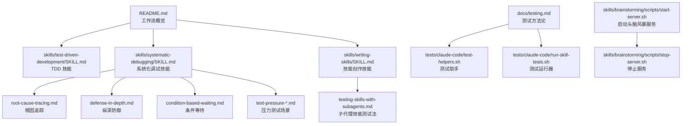
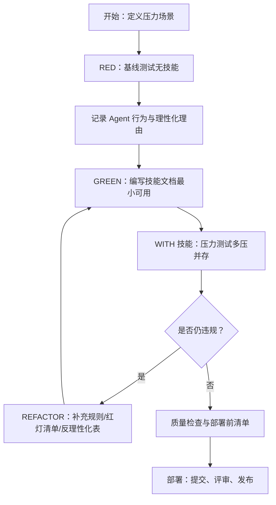
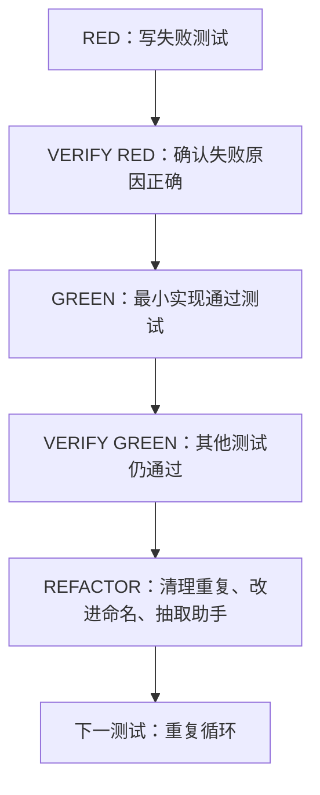
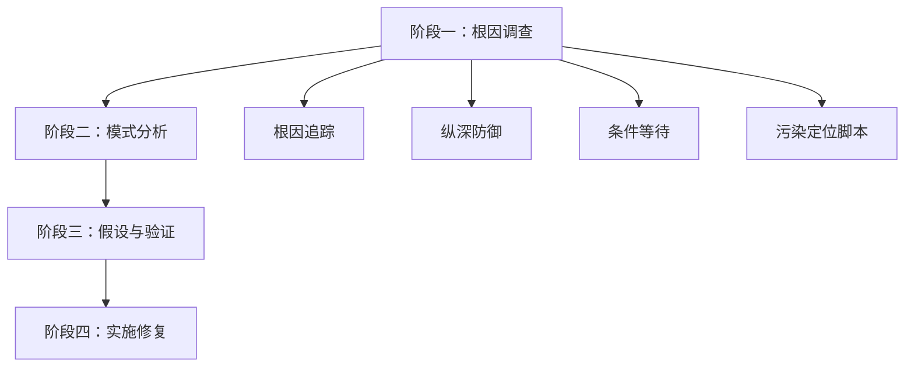
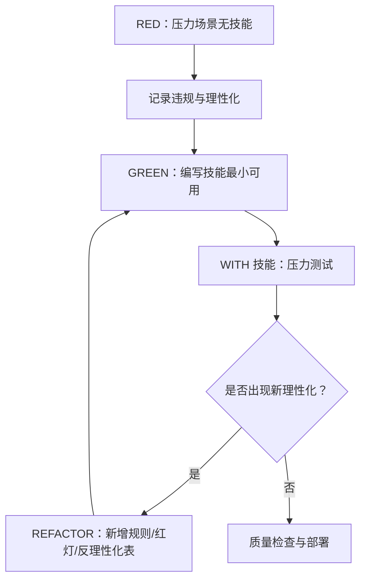
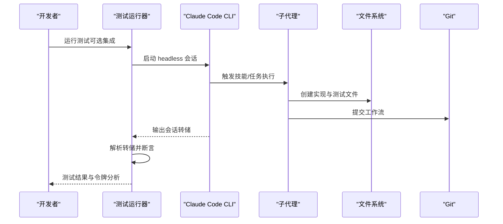
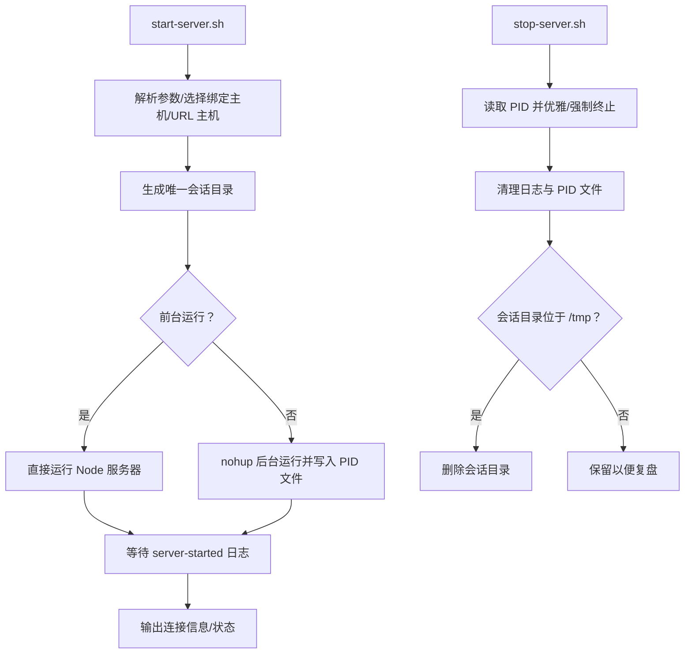
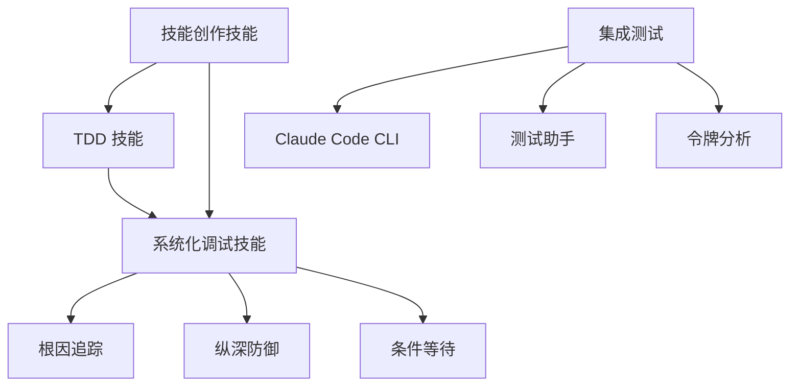

# 技能开发流程

<cite>
**本文引用的文件**
- [README.md](file://README.md)
- [docs/testing.md](file://docs/testing.md)
- [skills/test-driven-development/SKILL.md](file://skills/test-driven-development/SKILL.md)
- [skills/systematic-debugging/SKILL.md](file://skills/systematic-debugging/SKILL.md)
- [skills/systematic-debugging/root-cause-tracing.md](file://skills/systematic-debugging/root-cause-tracing.md)
- [skills/systematic-debugging/defense-in-depth.md](file://skills/systematic-debugging/defense-in-depth.md)
- [skills/systematic-debugging/condition-based-waiting.md](file://skills/systematic-debugging/condition-based-waiting.md)
- [skills/systematic-debugging/test-pressure-1.md](file://skills/systematic-debugging/test-pressure-1.md)
- [skills/systematic-debugging/test-pressure-2.md](file://skills/systematic-debugging/test-pressure-2.md)
- [skills/systematic-debugging/test-pressure-3.md](file://skills/systematic-debugging/test-pressure-3.md)
- [skills/systematic-debugging/find-polluter.sh](file://skills/systematic-debugging/find-polluter.sh)
- [skills/writing-skills/SKILL.md](file://skills/writing-skills/SKILL.md)
- [skills/writing-skills/testing-skills-with-subagents.md](file://skills/writing-skills/testing-skills-with-subagents.md)
- [skills/brainstorming/scripts/start-server.sh](file://skills/brainstorming/scripts/start-server.sh)
- [skills/brainstorming/scripts/stop-server.sh](file://skills/brainstorming/scripts/stop-server.sh)
- [tests/claude-code/test-helpers.sh](file://tests/claude-code/test-helpers.sh)
- [tests/claude-code/run-skill-tests.sh](file://tests/claude-code/run-skill-tests.sh)
</cite>

## 目录
1. [简介](#简介)
2. [项目结构](#项目结构)
3. [核心组件](#核心组件)
4. [架构总览](#架构总览)
5. [详细组件分析](#详细组件分析)
6. [依赖关系分析](#依赖关系分析)
7. [性能考量](#性能考量)
8. [故障排查指南](#故障排查指南)
9. [结论](#结论)
10. [附录](#附录)

## 简介
本指南面向 Superpowers 技能开发者，系统阐述从“压力场景”到“基线测试”再到“技能文档”与“重构”的完整生命周期，严格遵循 RED-GREEN-REFACTOR 循环。文档覆盖技能开发中的常见陷阱与解决方案，提供可操作的测试方法论与质量保证流程，帮助你构建稳定、可验证、可复用的技能。

## 项目结构
Superpowers 将“技能”作为可组合的工作流单元，围绕 TDD、系统化调试与技能创作形成闭环。关键目录与文件如下：
- skills：技能实现与参考材料（如 TDD、系统化调试、技能创作等）
- tests：针对 Claude Code 的集成测试与辅助工具
- docs：测试方法论与质量保障文档
- hooks/scripts：与外部工具交互的脚本（如头脑风暴服务器）

**图示来源**
- [README.md:108-125](file://README.md#L108-L125)
- [docs/testing.md:1-304](file://docs/testing.md#L1-L304)
- [skills/test-driven-development/SKILL.md:1-372](file://skills/test-driven-development/SKILL.md#L1-L372)
- [skills/systematic-debugging/SKILL.md:1-297](file://skills/systematic-debugging/SKILL.md#L1-L297)
- [skills/writing-skills/SKILL.md:1-656](file://skills/writing-skills/SKILL.md#L1-L656)
- [skills/brainstorming/scripts/start-server.sh:1-149](file://skills/brainstorming/scripts/start-server.sh#L1-L149)
- [skills/brainstorming/scripts/stop-server.sh:1-57](file://skills/brainstorming/scripts/stop-server.sh#L1-L57)

**章节来源**
- [README.md:108-125](file://README.md#L108-L125)
- [docs/testing.md:1-304](file://docs/testing.md#L1-L304)

## 核心组件
- 测试驱动开发（TDD）：以“先写失败测试、再写最小实现、最后重构”为核心，确保行为可验证、回归可预防。
- 系统化调试：四阶段根因调查与模式分析，避免症状性修复。
- 技能创作（Writing Skills）：将 TDD 应用于过程文档，通过压力场景验证技能在真实压力下的合规性。
- 压力测试场景：结合时间、沉没成本、权威、经济、疲劳、社交、实用主义等多重压力，检验技能抗理性化能力。
- 集成测试框架：基于 Claude Code CLI 的 headless 执行与会话解析，验证技能调用、子代理分发、任务跟踪、文件生成与提交历史等。

**章节来源**
- [skills/test-driven-development/SKILL.md:47-197](file://skills/test-driven-development/SKILL.md#L47-L197)
- [skills/systematic-debugging/SKILL.md:46-233](file://skills/systematic-debugging/SKILL.md#L46-L233)
- [skills/writing-skills/SKILL.md:30-623](file://skills/writing-skills/SKILL.md#L30-L623)
- [docs/testing.md:20-135](file://docs/testing.md#L20-L135)

## 架构总览
下图展示从“压力场景”到“技能文档”再到“集成验证”的端到端流程，强调“先失败后成功”的验证闭环。

**图示来源**
- [skills/writing-skills/SKILL.md:533-555](file://skills/writing-skills/SKILL.md#L533-L555)
- [skills/writing-skills/testing-skills-with-subagents.md:30-42](file://skills/writing-skills/testing-skills-with-subagents.md#L30-L42)

## 详细组件分析

### 组件一：测试驱动开发（TDD）循环
- 核心循环：RED（写失败测试）→ VERFIY RED（确认失败正确）→ GREEN（最小实现）→ VERFIY GREEN（全部通过）→ REFACTOR（清理与提取）→ 下一测试。
- 关键原则：未见失败即不验证；测试应描述行为而非实现；拒绝“测试之后”或“参考式保留”等变通。
- 反模式警示：测试 mock 行为、在生产类中添加仅测试方法、无依赖理解的 mock、不完整 mock、将测试视为事后补救。

**图示来源**
- [skills/test-driven-development/SKILL.md:47-197](file://skills/test-driven-development/SKILL.md#L47-L197)

**章节来源**
- [skills/test-driven-development/SKILL.md:16-197](file://skills/test-driven-development/SKILL.md#L16-L197)
- [skills/test-driven-development/testing-anti-patterns.md:1-300](file://skills/test-driven-development/testing-anti-patterns.md#L1-L300)

### 组件二：系统化调试（四阶段）
- 阶段一：根因调查（读取错误、重现、检查变更、收集证据）
- 阶段二：模式分析（寻找已知范式、对比差异、理解依赖）
- 阶段三：假设与验证（单一假设、最小改动、验证后再继续）
- 阶段四：实施（创建失败测试、单点修复、验证修复、必要时质疑架构）
- 支撑技术：根因追踪、纵深防御、条件等待、污染定位脚本

**图示来源**
- [skills/systematic-debugging/SKILL.md:46-233](file://skills/systematic-debugging/SKILL.md#L46-L233)
- [skills/systematic-debugging/root-cause-tracing.md:1-170](file://skills/systematic-debugging/root-cause-tracing.md#L1-L170)
- [skills/systematic-debugging/defense-in-depth.md:1-123](file://skills/systematic-debugging/defense-in-depth.md#L1-L123)
- [skills/systematic-debugging/condition-based-waiting.md:1-116](file://skills/systematic-debugging/condition-based-waiting.md#L1-L116)
- [skills/systematic-debugging/find-polluter.sh](file://skills/systematic-debugging/find-polluter.sh)

**章节来源**
- [skills/systematic-debugging/SKILL.md:16-233](file://skills/systematic-debugging/SKILL.md#L16-L233)
- [skills/systematic-debugging/root-cause-tracing.md:1-170](file://skills/systematic-debugging/root-cause-tracing.md#L1-L170)
- [skills/systematic-debugging/defense-in-depth.md:1-123](file://skills/systematic-debugging/defense-in-depth.md#L1-L123)
- [skills/systematic-debugging/condition-based-waiting.md:1-116](file://skills/systematic-debugging/condition-based-waiting.md#L1-L116)
- [skills/systematic-debugging/test-pressure-1.md:1-59](file://skills/systematic-debugging/test-pressure-1.md#L1-L59)
- [skills/systematic-debugging/test-pressure-2.md:1-69](file://skills/systematic-debugging/test-pressure-2.md#L1-L69)
- [skills/systematic-debugging/test-pressure-3.md:1-70](file://skills/systematic-debugging/test-pressure-3.md#L1-L70)

### 组件三：技能创作（RED-GREEN-REFACTOR）
- 将 TDD 应用于过程文档：先用子代理在压力场景中“失败”（记录理性化），再写技能“通过”（符合规则），最后反复重构以堵住新漏洞。
- 压力类型：时间、沉没成本、权威、经济、疲劳、社交、实用主义。
- 质量保障：CSO（Claude 搜索优化）、简明描述、关键词覆盖、交叉引用、流程图限制使用、示例精选。

**图示来源**
- [skills/writing-skills/SKILL.md:30-623](file://skills/writing-skills/SKILL.md#L30-L623)
- [skills/writing-skills/testing-skills-with-subagents.md:30-331](file://skills/writing-skills/testing-skills-with-subagents.md#L30-L331)

**章节来源**
- [skills/writing-skills/SKILL.md:14-623](file://skills/writing-skills/SKILL.md#L14-L623)
- [skills/writing-skills/testing-skills-with-subagents.md:1-385](file://skills/writing-skills/testing-skills-with-subagents.md#L1-L385)

### 组件四：集成测试与质量保证
- 测试运行器：支持快速单元测试与慢速集成测试（headless 执行、超时控制、结果统计）。
- 辅助工具：会话转储解析、令牌用量分析、权限与目录授权、会话查找。
- 验证维度：技能调用、子代理分发、任务跟踪、文件生成、测试通过、提交历史、无多余功能。

**图示来源**
- [docs/testing.md:20-135](file://docs/testing.md#L20-L135)
- [tests/claude-code/run-skill-tests.sh:1-188](file://tests/claude-code/run-skill-tests.sh#L1-L188)
- [tests/claude-code/test-helpers.sh:1-203](file://tests/claude-code/test-helpers.sh#L1-L203)

**章节来源**
- [docs/testing.md:1-304](file://docs/testing.md#L1-L304)
- [tests/claude-code/run-skill-tests.sh:1-188](file://tests/claude-code/run-skill-tests.sh#L1-L188)
- [tests/claude-code/test-helpers.sh:1-203](file://tests/claude-code/test-helpers.sh#L1-L203)

### 组件五：头脑风暴服务器（可选支撑）
- 启动/停止脚本负责服务生命周期管理、日志输出、前台/后台模式适配与进程守护检测。
- 适用于需要可视化设计与协作的技能开发流程。

**图示来源**
- [skills/brainstorming/scripts/start-server.sh:1-149](file://skills/brainstorming/scripts/start-server.sh#L1-L149)
- [skills/brainstorming/scripts/stop-server.sh:1-57](file://skills/brainstorming/scripts/stop-server.sh#L1-L57)

**章节来源**
- [skills/brainstorming/scripts/start-server.sh:1-149](file://skills/brainstorming/scripts/start-server.sh#L1-L149)
- [skills/brainstorming/scripts/stop-server.sh:1-57](file://skills/brainstorming/scripts/stop-server.sh#L1-L57)

## 依赖关系分析
- 技能间依赖：系统化调试技能与 TDD 技能互补，前者用于问题定位，后者用于实现与验证。
- 工具链依赖：Claude Code CLI、会话转储解析、令牌分析工具、权限与目录授权脚本。
- 文档与测试：技能创作技能指导如何用压力场景验证技能，测试方法论文档提供集成测试规范。

**图示来源**
- [skills/test-driven-development/SKILL.md:1-372](file://skills/test-driven-development/SKILL.md#L1-L372)
- [skills/systematic-debugging/SKILL.md:1-297](file://skills/systematic-debugging/SKILL.md#L1-L297)
- [skills/writing-skills/SKILL.md:1-656](file://skills/writing-skills/SKILL.md#L1-L656)
- [docs/testing.md:1-304](file://docs/testing.md#L1-L304)

**章节来源**
- [README.md:108-150](file://README.md#L108-L150)
- [docs/testing.md:1-304](file://docs/testing.md#L1-L304)

## 性能考量
- 令牌与成本：集成测试包含令牌用量分析，建议在压力测试中关注主会话与子代理的输入/输出/缓存读取分布，避免过度缓存读取导致高成本。
- 超时与稳定性：合理设置超时时间，避免长时间挂起；对 flaky 测试采用条件等待替代任意延时。
- 资源回收：测试结束后清理临时目录与进程，避免资源泄漏影响后续测试。

[本节为通用指导，无需特定文件来源]

## 故障排查指南
- 技能加载失败：确认在插件目录内运行、启用本地开发市场、技能存在于 skills 目录。
- 权限问题：使用权限绕过与目录授权标志，检查测试目录权限。
- 超时问题：延长超时时间、排查技能逻辑是否存在死循环、降低子代理任务复杂度。
- 会话文件缺失：核对项目目录编码路径、使用最近会话查找命令、确认测试确实执行。

**章节来源**
- [docs/testing.md:178-215](file://docs/testing.md#L178-L215)

## 结论
通过将 TDD、系统化调试与技能创作三者结合，Superpowers 形成了可验证、可迭代的技能开发闭环。遵循 RED-GREEN-REFACTOR，利用压力场景与集成测试，可以有效规避理性化与反模式，确保技能在真实工程压力下可靠落地。

[本节为总结，无需特定文件来源]

## 附录

### A. 技能开发最佳实践清单
- 在编写技能前，先用压力场景验证“无技能”基线行为，记录理性化与违规模式。
- 使用最小可行技能文档，聚焦解决具体问题，避免过度设计。
- 引入红灯清单、反理性化表格与 CSO 描述字段，提升发现率与合规性。
- 对纪律型技能进行多压测试，确保在紧急、疲劳、权威等情境下仍能坚持规则。
- 集成测试覆盖技能调用、子代理分发、任务跟踪、文件生成、测试通过与提交历史。

**章节来源**
- [skills/writing-skills/SKILL.md:596-634](file://skills/writing-skills/SKILL.md#L596-L634)
- [skills/writing-skills/testing-skills-with-subagents.md:308-331](file://skills/writing-skills/testing-skills-with-subagents.md#L308-L331)
- [docs/testing.md:20-135](file://docs/testing.md#L20-L135)

### B. 常见陷阱与解决方案
- 陷阱：测试之后实现
  - 解决：严格遵循“先失败后通过”，使用 TDD 反模式清单校验。
- 陷阱：mock 行为而非真实行为
  - 解决：理解依赖链，必要时使用集成测试替代复杂 mock。
- 陷阱：仅凭直觉编写技能
  - 解决：用压力场景与会话转储验证，持续重构直至无新理性化。
- 陷阱：忽略 flaky 测试
  - 解决：采用条件等待替换任意延时，明确文档化超时原因。

**章节来源**
- [skills/test-driven-development/testing-anti-patterns.md:1-300](file://skills/test-driven-development/testing-anti-patterns.md#L1-L300)
- [skills/systematic-debugging/condition-based-waiting.md:1-116](file://skills/systematic-debugging/condition-based-waiting.md#L1-L116)
- [skills/writing-skills/testing-skills-with-subagents.md:332-357](file://skills/writing-skills/testing-skills-with-subagents.md#L332-L357)