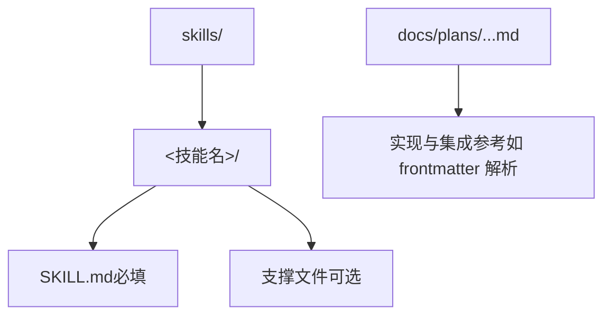
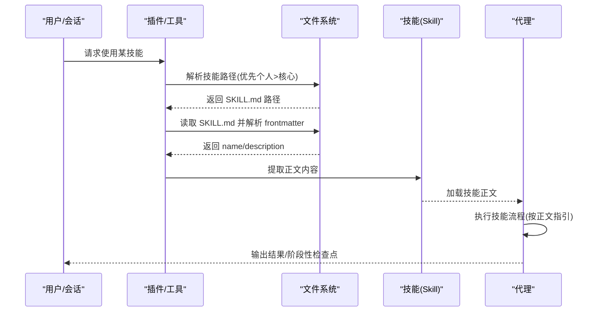
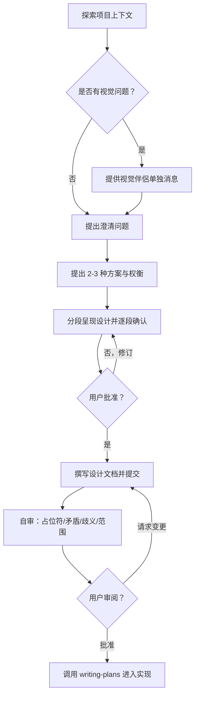
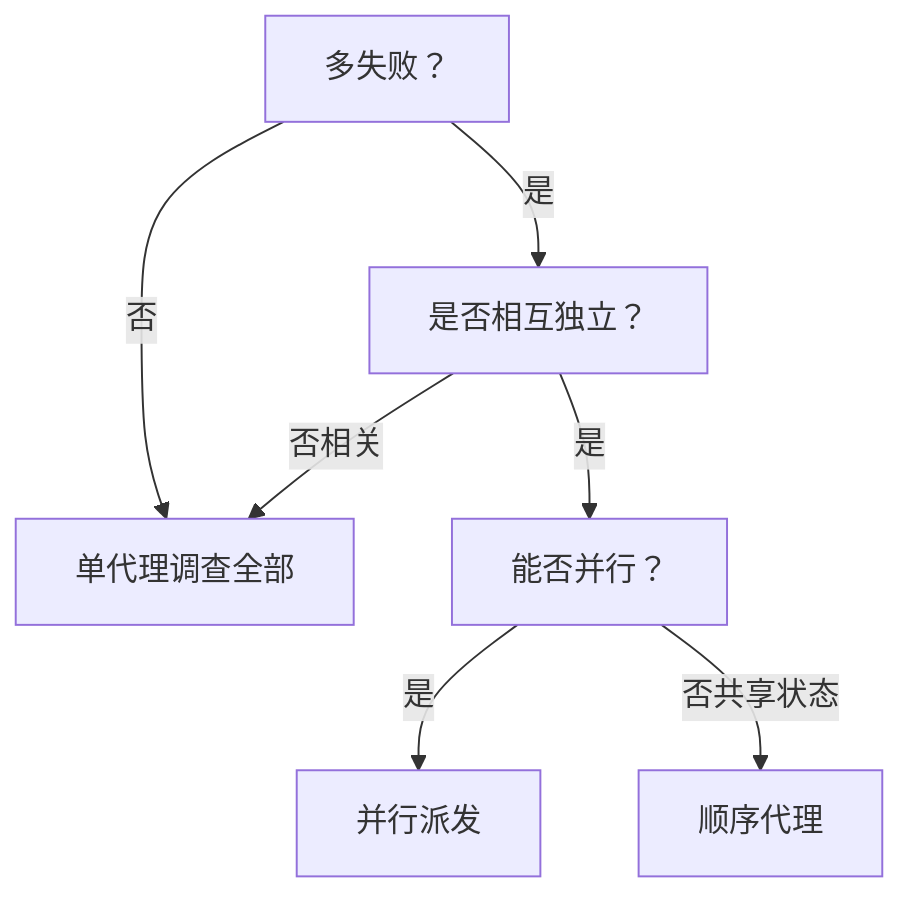
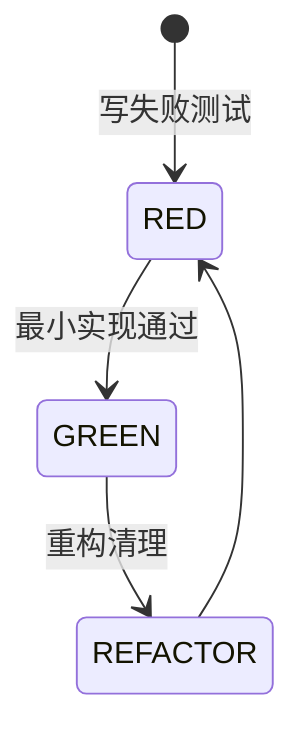
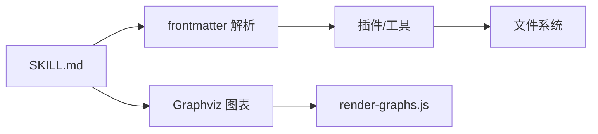

# 技能结构规范

<cite>
**本文引用的文件**   
- [skills/brainstorming/SKILL.md](file://skills/brainstorming/SKILL.md)
- [skills/dispatching-parallel-agents/SKILL.md](file://skills/dispatching-parallel-agents/SKILL.md)
- [skills/executing-plans/SKILL.md](file://skills/executing-plans/SKILL.md)
- [skills/systematic-debugging/SKILL.md](file://skills/systematic-debugging/SKILL.md)
- [skills/test-driven-development/SKILL.md](file://skills/test-driven-development/SKILL.md)
- [skills/writing-skills/SKILL.md](file://skills/writing-skills/SKILL.md)
- [skills/writing-skills/anthropic-best-practices.md](file://skills/writing-skills/anthropic-best-practices.md)
- [skills/writing-skills/graphviz-conventions.dot](file://skills/writing-skills/graphviz-conventions.dot)
- [skills/writing-skills/render-graphs.js](file://skills/writing-skills/render-graphs.js)
- [docs/plans/2025-11-22-opencode-support-implementation.md](file://docs/plans/2025-11-22-opencode-support-implementation.md)
- [CLAUDE.md](file://CLAUDE.md)
</cite>

## 目录
1. [引言](#引言)
2. [项目结构](#项目结构)
3. [核心组件](#核心组件)
4. [架构总览](#架构总览)
5. [详细组件分析](#详细组件分析)
6. [依赖分析](#依赖分析)
7. [性能考量](#性能考量)
8. [故障排查指南](#故障排查指南)
9. [结论](#结论)
10. [附录](#附录)

## 引言
本文件系统化阐述 Superpowers 技能结构规范，聚焦 SKILL.md 的完整结构与写作标准，涵盖 YAML frontmatter 规范、标题层级、内容组织、格式要求；同时详解 Claude 搜索优化（CSO）原则，包括描述字段编写、关键词覆盖、命名约定与令牌效率；并提供图表使用规范与代码示例标准，辅以来自仓库的真实示例与模板路径，帮助作者构建可发现、可执行、可验证的高质量技能。

## 项目结构
Superpowers 将“技能”作为可复用的参考指南与流程规范，统一存放于 skills/<skill-name>/ 目录下，每个技能包含：
- SKILL.md：主文档，定义触发条件、工作流、要点与注意事项
- 支撑文件（可选）：脚本、工具、重文档或模板等



图示来源
- [skills/writing-skills/SKILL.md:72-92](file://skills/writing-skills/SKILL.md#L72-L92)
- [docs/plans/2025-11-22-opencode-support-implementation.md:21-81](file://docs/plans/2025-11-22-opencode-support-implementation.md#L21-L81)

章节来源
- [skills/writing-skills/SKILL.md:72-92](file://skills/writing-skills/SKILL.md#L72-L92)
- [docs/plans/2025-11-22-opencode-support-implementation.md:21-81](file://docs/plans/2025-11-22-opencode-support-implementation.md#L21-L81)

## 核心组件
- YAML frontmatter：必需包含 name 与 description，遵循长度与字符限制，描述字段严格限定为“触发条件”，不总结流程
- 结构化正文：Overview、When to Use、Core Pattern（技术类）、Quick Reference、Implementation、Common Mistakes、Real-World Impact（可选）
- 图表与可视化：仅在必要时使用 Graphviz 流程图，遵循样式与标签规范
- 代码示例：精选一个高质量示例，避免多语言稀释与模板化

章节来源
- [skills/writing-skills/SKILL.md:95-137](file://skills/writing-skills/SKILL.md#L95-L137)
- [skills/writing-skills/anthropic-best-practices.md:144-247](file://skills/writing-skills/anthropic-best-practices.md#L144-L247)

## 架构总览
技能文档的“触发—加载—执行—验证”闭环如下：



图示来源
- [docs/plans/2025-11-22-opencode-support-implementation.md:506-573](file://docs/plans/2025-11-22-opencode-support-implementation.md#L506-L573)

章节来源
- [docs/plans/2025-11-22-opencode-support-implementation.md:506-573](file://docs/plans/2025-11-22-opencode-support-implementation.md#L506-L573)

## 详细组件分析

### YAML Frontmatter 规范
- 必填字段：name、description
- 长度限制：frontmatter 总长度不超过 1024 字符
- 字段约束：
  - name：字母、数字、连字符；不含括号与特殊字符
  - description：第三人称，仅描述触发条件，不总结流程；建议起始为“Use when...”；尽量少于 500 字符
- 示例模板路径：[skills/writing-skills/SKILL.md:105-110](file://skills/writing-skills/SKILL.md#L105-L110)

章节来源
- [skills/writing-skills/SKILL.md:95-104](file://skills/writing-skills/SKILL.md#L95-L104)
- [skills/writing-skills/SKILL.md:105-110](file://skills/writing-skills/SKILL.md#L105-L110)

### 标题层级与内容组织
- 标题层级：H1 为技能名；H2 为主要章节；H3/H4 用于细分
- 建议结构（技术类技能）：
  - 摘要（Overview）：核心原则 1-2 句
  - 使用场景（When to Use）：症状/场景列表；必要时内嵌小型流程图
  - 核心模式（Core Pattern）：前后对比
  - 快速参考（Quick Reference）：表格或要点清单
  - 实施（Implementation）：简单模式内联；重文档/工具链接到独立文件
  - 常见误区（Common Mistakes）：问题与修复
  - 实战影响（Real-World Impact，可选）：具体成果
- 示例参考：
  - 设计先行与规划：[skills/brainstorming/SKILL.md:6-165](file://skills/brainstorming/SKILL.md#L6-L165)
  - 并行代理分发：[skills/dispatching-parallel-agents/SKILL.md:6-183](file://skills/dispatching-parallel-agents/SKILL.md#L6-L183)
  - 计划执行：[skills/executing-plans/SKILL.md:6-71](file://skills/executing-plans/SKILL.md#L6-L71)
  - 系统化调试：[skills/systematic-debugging/SKILL.md:6-297](file://skills/systematic-debugging/SKILL.md#L6-L297)
  - 测试驱动开发：[skills/test-driven-development/SKILL.md:6-372](file://skills/test-driven-development/SKILL.md#L6-L372)

章节来源
- [skills/writing-skills/SKILL.md:113-137](file://skills/writing-skills/SKILL.md#L113-L137)
- [skills/brainstorming/SKILL.md:6-165](file://skills/brainstorming/SKILL.md#L6-L165)
- [skills/dispatching-parallel-agents/SKILL.md:6-183](file://skills/dispatching-parallel-agents/SKILL.md#L6-L183)
- [skills/executing-plans/SKILL.md:6-71](file://skills/executing-plans/SKILL.md#L6-L71)
- [skills/systematic-debugging/SKILL.md:6-297](file://skills/systematic-debugging/SKILL.md#L6-L297)
- [skills/test-driven-development/SKILL.md:6-372](file://skills/test-driven-development/SKILL.md#L6-L372)

### Claude 搜索优化（CSO）原则
CSO 关注“被发现与被正确加载”，强调描述字段的触发性与关键词密度，以及整体文档的令牌效率。

- 描述字段（Rich Description）
  - 目标：让 Claude 在众多技能中快速判断“是否需要现在读这个技能”
  - 格式：以“Use when...”开头，聚焦触发条件与症状，不总结流程
  - 内容：问题描述（非语言特定）、技术无关（除非技能本身是技术特定）、第三人称
  - 反例与正例：参见 [skills/writing-skills/SKILL.md:140-197](file://skills/writing-skills/SKILL.md#L140-L197)
- 关键词覆盖（Keyword Coverage）
  - 包含错误信息、症状、同义词、工具命令/库名/文件类型等
  - 便于 Claude 在检索时命中
- 命名约定（Descriptive Naming）
  - 使用动名词/动词+ing，明确动作与能力
  - 避免模糊、通用或不一致的命名
- 令牌效率（Token Efficiency）
  - 目标字数：入门流程 <150 字；常加载技能 <200 字；其他 <500 字
  - 技巧：将细节移至工具帮助；跨引用替代重复；压缩示例；消除冗余
  - 验证：使用 wc -w 统计字数
- 跨引用其他技能（Cross-Referencing）
  - 使用技能名并标注“必需/背景”标记；避免强制加载（@语法）
  - 参考：[skills/writing-skills/SKILL.md:278-290](file://skills/writing-skills/SKILL.md#L278-L290)

章节来源
- [skills/writing-skills/SKILL.md:140-290](file://skills/writing-skills/SKILL.md#L140-L290)

### 图表使用规范
- 何时使用：非显而易见的决策点、过程循环、二选一/多选流程
- 何时不用：参考材料（表格/列表）、代码示例（Markdown 块）、线性步骤（编号列表）、无语义标签
- Graphviz 规范与样式：
  - 节点形状：问题=菱形；动作=矩形；命令=纯文本；状态=椭圆；警告=八角；入口/出口=双圆
  - 边标签：二选一用 yes/no；多选用 condition A/B/otherwise；连接用 dotted 标记触发
  - 命名：问题以问号结尾；动作以动词开头；命令为实际命令；状态描述情境
  - 结构模板：触发→检查→主动作→命令→再检查→完成/停止
- 渲染工具：render-graphs.js 可从 SKILL.md 中提取所有 ```dot 块并渲染为 SVG，支持单独渲染与合并渲染
- 示例参考：
  - 流程图样式规范：[skills/writing-skills/graphviz-conventions.dot:1-L172](file://skills/writing-skills/graphviz-conventions.dot#L1-L172)
  - 渲染脚本：[skills/writing-skills/render-graphs.js:1-L169](file://skills/writing-skills/render-graphs.js#L1-L169)
  - 技能中的流程图示例：[skills/brainstorming/SKILL.md:36-L64](file://skills/brainstorming/SKILL.md#L36-L64)，[skills/dispatching-parallel-agents/SKILL.md:18-L34](file://skills/dispatching-parallel-agents/SKILL.md#L18-L34)，[skills/test-driven-development/SKILL.md:49-L69](file://skills/test-driven-development/SKILL.md#L49-L69)

章节来源
- [skills/writing-skills/SKILL.md:290-L323](file://skills/writing-skills/SKILL.md#L290-L323)
- [skills/writing-skills/graphviz-conventions.dot:1-L172](file://skills/writing-skills/graphviz-conventions.dot#L1-L172)
- [skills/writing-skills/render-graphs.js:1-L169](file://skills/writing-skills/render-graphs.js#L1-L169)
- [skills/brainstorming/SKILL.md:36-L64](file://skills/brainstorming/SKILL.md#L36-L64)
- [skills/dispatching-parallel-agents/SKILL.md:18-L34](file://skills/dispatching-parallel-agents/SKILL.md#L18-L34)
- [skills/test-driven-development/SKILL.md:49-L69](file://skills/test-driven-development/SKILL.md#L49-L69)

### 代码示例标准
- 一个优秀示例胜过多个平庸示例
- 选择最相关的语言（测试技巧→TS/JS；系统调试→Shell/Python；数据处理→Python）
- 示例要求：完整可运行、有注释解释原因、来自真实场景、清晰展示模式、可直接适配
- 不做：多语言堆砌、填空模板、虚构示例

章节来源
- [skills/writing-skills/SKILL.md:324-L346](file://skills/writing-skills/SKILL.md#L324-L346)

### 文件组织策略
- 自包含技能：内容可内联，无需重型参考
- 含可复用工具：SKILL.md + 工具脚本/模板
- 含重型参考：SKILL.md + 大型参考文档 + 工具脚本
- 参考：[skills/writing-skills/SKILL.md:347-L373](file://skills/writing-skills/SKILL.md#L347-L373)

章节来源
- [skills/writing-skills/SKILL.md:347-L373](file://skills/writing-skills/SKILL.md#L347-L373)

### 技能创作的 TDD 化流程
- 铁律：无失败测试，不写技能
- RED-GREEN-REFACTOR 循环：压力场景→基线→最小技能→补漏洞→再验证
- 测试类型：纪律类（规则/要求）、技术类（方法）、模式类（心智模型）、参考类（文档/API）
- 参考：[skills/writing-skills/SKILL.md:374-L443](file://skills/writing-skills/SKILL.md#L374-L443)

章节来源
- [skills/writing-skills/SKILL.md:374-L443](file://skills/writing-skills/SKILL.md#L374-L443)

### 典型技能流程示例

#### 设计与规划流程（头脑风暴）


图示来源
- [skills/brainstorming/SKILL.md:36-L64](file://skills/brainstorming/SKILL.md#L36-L64)

章节来源
- [skills/brainstorming/SKILL.md:34-L165](file://skills/brainstorming/SKILL.md#L34-L165)

#### 并行代理分发流程


图示来源
- [skills/dispatching-parallel-agents/SKILL.md:18-L34](file://skills/dispatching-parallel-agents/SKILL.md#L18-L34)

章节来源
- [skills/dispatching-parallel-agents/SKILL.md:16-L183](file://skills/dispatching-parallel-agents/SKILL.md#L16-L183)

#### 测试驱动开发（TDD）循环


图示来源
- [skills/test-driven-development/SKILL.md:49-L69](file://skills/test-driven-development/SKILL.md#L49-L69)

章节来源
- [skills/test-driven-development/SKILL.md:47-L197](file://skills/test-driven-development/SKILL.md#L47-L197)

## 依赖分析
- 技能间依赖：通过“必需子技能/背景技能”进行声明，避免强制加载
- 外部依赖：Graphviz（dot）用于渲染流程图；前端工具链用于技能加载与解析
- 依赖关系示意：



图示来源
- [docs/plans/2025-11-22-opencode-support-implementation.md:21-81](file://docs/plans/2025-11-22-opencode-support-implementation.md#L21-L81)
- [skills/writing-skills/render-graphs.js:1-169](file://skills/writing-skills/render-graphs.js#L1-L169)

章节来源
- [docs/plans/2025-11-22-opencode-support-implementation.md:21-81](file://docs/plans/2025-11-22-opencode-support-implementation.md#L21-L81)
- [skills/writing-skills/render-graphs.js:1-169](file://skills/writing-skills/render-graphs.js#L1-L169)

## 性能考量
- 上下文窗口与令牌预算：frontmatter 与正文均应精简，正文建议控制在 500 行以内；必要时拆分为独立文件
- 加载与解析：frontmatter 仅需 name/description 即可决定加载；正文按需加载
- 推荐实践：使用跨引用减少重复；将复杂细节下沉到工具/参考文件；保持描述字段短小精悍

章节来源
- [skills/writing-skills/anthropic-best-practices.md:239-247](file://skills/writing-skills/anthropic-best-practices.md#L239-L247)
- [skills/writing-skills/SKILL.md:213-267](file://skills/writing-skills/SKILL.md#L213-L267)

## 故障排查指南
- 描述字段导致“走捷径”：当描述总结了流程，代理可能依据描述而非阅读全文；应改为仅触发条件
- 令牌浪费：正文冗长、重复、多语言示例过多；应压缩示例、跨引用、移除冗余
- 图表滥用：流程图用于非显而易见的决策；参考材料用表格/列表；线性步骤用编号列表
- 交叉引用不当：使用技能名并标注“必需/背景”；避免强制加载（@语法）

章节来源
- [skills/writing-skills/SKILL.md:140-197](file://skills/writing-skills/SKILL.md#L140-L197)
- [skills/writing-skills/SKILL.md:278-290](file://skills/writing-skills/SKILL.md#L278-L290)
- [skills/writing-skills/SKILL.md:290-323](file://skills/writing-skills/SKILL.md#L290-L323)

## 结论
Superpowers 的技能结构规范以“触发条件明确、流程可执行、文档可验证”为核心目标。通过严格的 YAML frontmatter、严谨的正文结构、CSO 优化与图表/示例标准，确保技能在真实压力场景下仍能被发现、被正确加载并被严格执行。作者应遵循“无失败测试不写技能”的铁律，持续迭代，使技能成为可复用的专家级工作流。

## 附录

### 模板与示例路径
- YAML frontmatter 模板：[skills/writing-skills/SKILL.md:105-110](file://skills/writing-skills/SKILL.md#L105-L110)
- 技能正文结构模板：[skills/writing-skills/SKILL.md:113-137](file://skills/writing-skills/SKILL.md#L113-L137)
- 设计与规划流程图：[skills/brainstorming/SKILL.md:36-64](file://skills/brainstorming/SKILL.md#L36-L64)
- 并行代理分发流程图：[skills/dispatching-parallel-agents/SKILL.md:18-34](file://skills/dispatching-parallel-agents/SKILL.md#L18-L34)
- TDD 循环图：[skills/test-driven-development/SKILL.md:49-69](file://skills/test-driven-development/SKILL.md#L49-L69)
- Graphviz 样式规范：[skills/writing-skills/graphviz-conventions.dot:1-172](file://skills/writing-skills/graphviz-conventions.dot#L1-L172)
- 渲染脚本：[skills/writing-skills/render-graphs.js:1-169](file://skills/writing-skills/render-graphs.js#L1-L169)
- 前端工具链与 frontmatter 解析参考：[docs/plans/2025-11-22-opencode-support-implementation.md:21-81](file://docs/plans/2025-11-22-opencode-support-implementation.md#L21-L81)