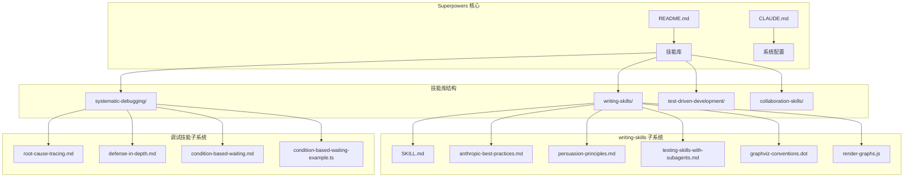
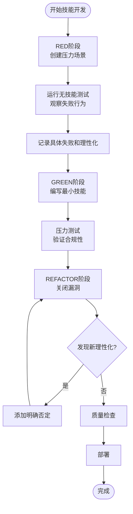
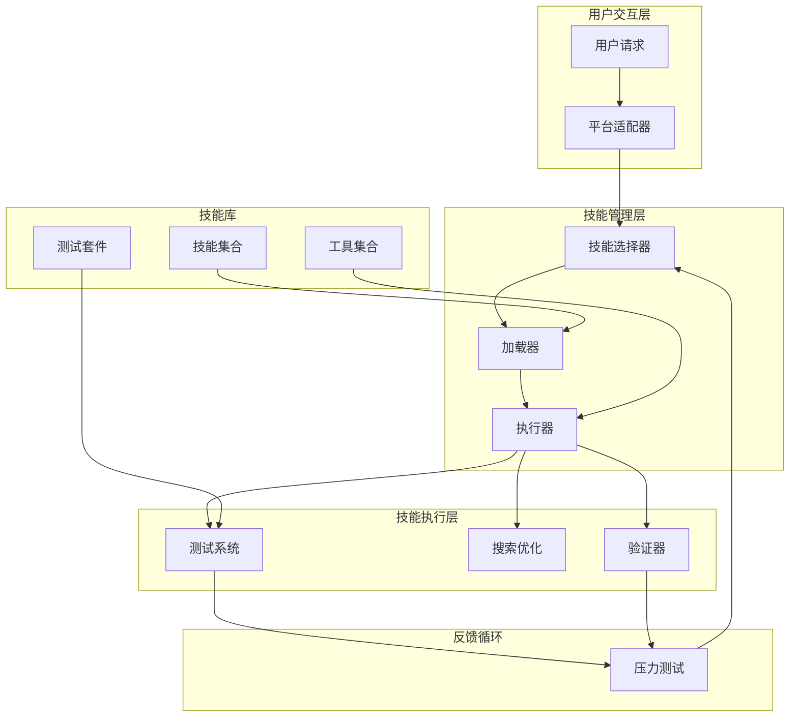
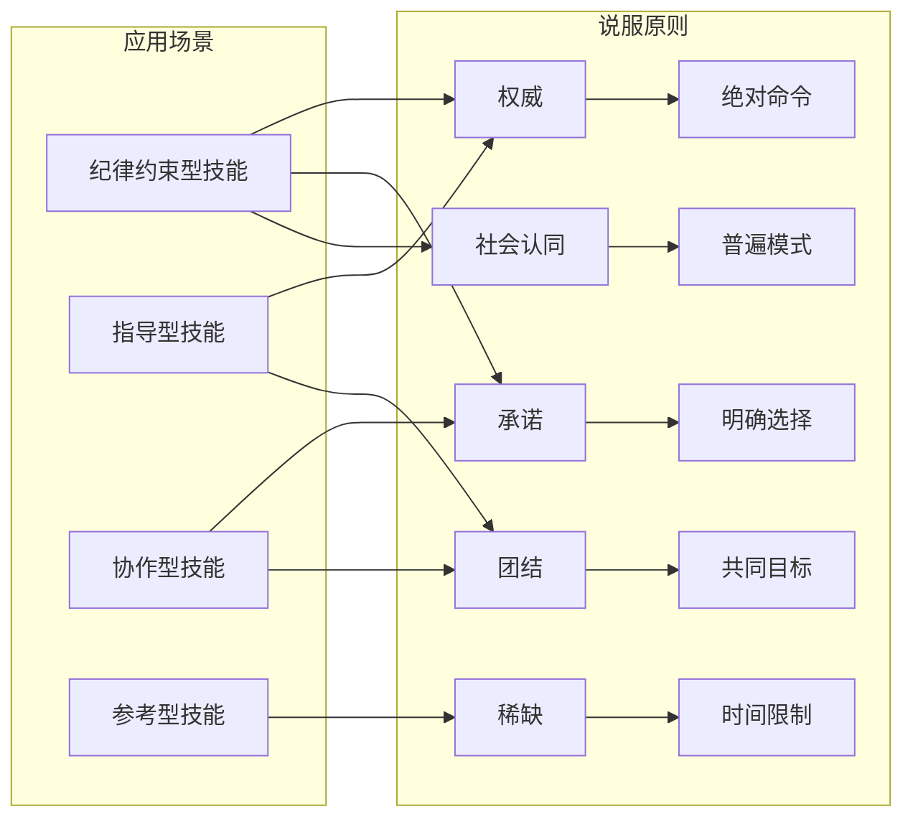
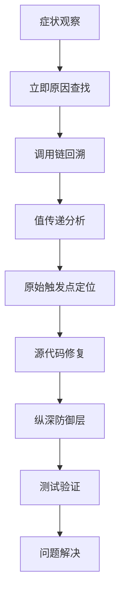
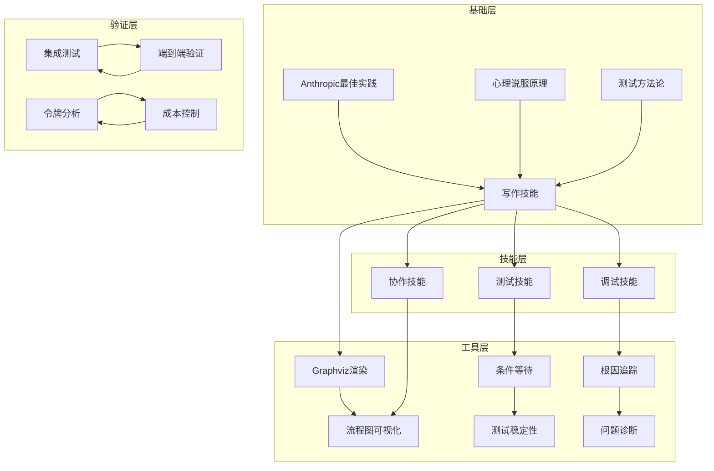
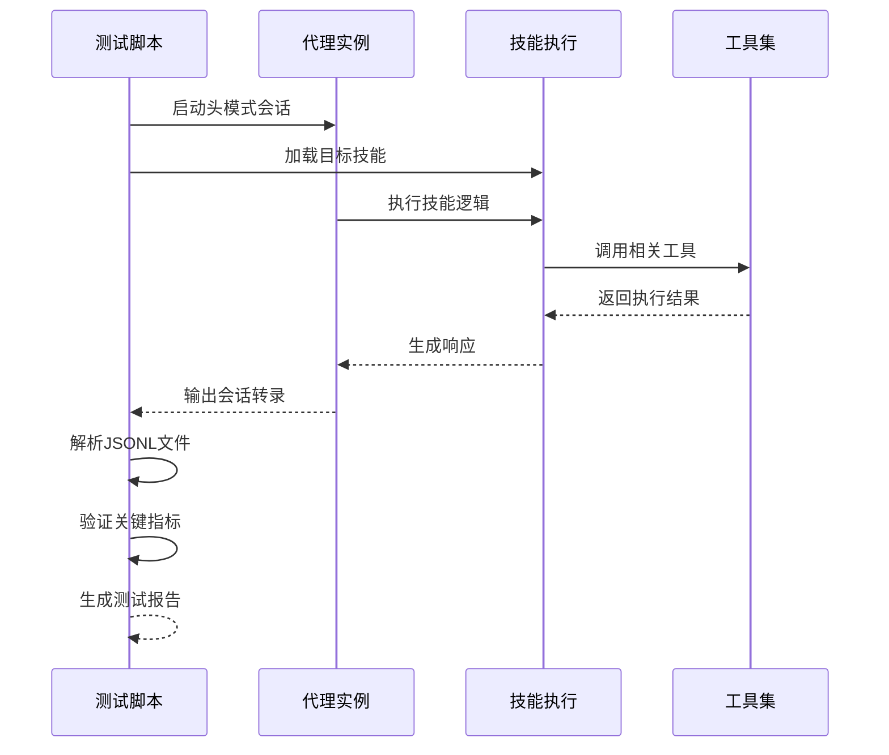

# 最佳实践指南

<cite>
**本文档引用的文件**
- [README.md](file://README.md)
- [SKILL.md](file://skills/writing-skills/SKILL.md)
- [anthropic-best-practices.md](file://skills/writing-skills/anthropic-best-practices.md)
- [persuasion-principles.md](file://skills/writing-skills/persuasion-principles.md)
- [testing-skills-with-subagents.md](file://skills/writing-skills/testing-skills-with-subagents.md)
- [graphviz-conventions.dot](file://skills/writing-skills/graphviz-conventions.dot)
- [render-graphs.js](file://skills/writing-skills/render-graphs.js)
- [testing.md](file://docs/testing.md)
- [CLAUDE.md](file://CLAUDE.md)
- [CLAUDE_MD_TESTING.md](file://skills/writing-skills/examples/CLAUDE_MD_TESTING.md)
- [root-cause-tracing.md](file://skills/systematic-debugging/root-cause-tracing.md)
- [defense-in-depth.md](file://skills/systematic-debugging/defense-in-depth.md)
- [condition-based-waiting.md](file://skills/systematic-debugging/condition-based-waiting.md)
- [condition-based-waiting-example.ts](file://skills/systematic-debugging/condition-based-waiting-example.ts)
- [testing-anti-patterns.md](file://skills/test-driven-development/testing-anti-patterns.md)
</cite>

## 目录
1. [引言](#引言)
2. [项目结构](#项目结构)
3. [核心组件](#核心组件)
4. [架构概览](#架构概览)
5. [详细组件分析](#详细组件分析)
6. [依赖关系分析](#依赖关系分析)
7. [性能考量](#性能考量)
8. [故障排除指南](#故障排除指南)
9. [结论](#结论)
10. [附录](#附录)

## 引言

Superpowers 是一个基于可组合"技能"的完整软件开发工作流系统，专为代码代理设计。该系统通过严格的测试驱动开发(TDD)方法论应用于过程文档化，确保技能的可靠性、可发现性和有效性。

本指南旨在为Superpowers技能开发提供全面的最佳实践指导，涵盖设计原则、写作技巧、说服技术以及质量标准。系统的核心理念是"技能创作即TDD应用于过程文档"，通过RED-GREEN-REFACTOR循环确保每个技能都经过充分验证。

## 项目结构

Superpowers项目采用模块化的技能库架构，每个技能都是独立的目录，包含完整的文档和工具支持：

**图表来源**
- [README.md:126-151](file://README.md#L126-L151)
- [SKILL.md:72-92](file://skills/writing-skills/SKILL.md#L72-L92)

项目采用扁平命名空间设计，所有技能位于同一可搜索的命名空间中，便于代理发现和使用。每个技能目录包含：

- **必需文件**: SKILL.md - 主要参考文档
- **可选文件**: 支持性工具、示例代码、重用工具
- **组织原则**: 重型参考资料分离存储，可重用工具独立管理

**章节来源**
- [README.md:126-151](file://README.md#L126-L151)
- [SKILL.md:72-92](file://skills/writing-skills/SKILL.md#L72-L92)

## 核心组件

### 技能创作框架

Superpowers将传统的TDD方法论扩展到技能开发领域，建立了完整的RED-GREEN-REFACTOR循环：

**图表来源**
- [testing-skills-with-subagents.md:30-42](file://skills/writing-skills/testing-skills-with-subagents.md#L30-L42)

### 搜索优化系统(CSO)

技能的可发现性是成功的关键因素。CSO系统包含四个核心要素：

1. **丰富的描述字段**: 突出触发条件而非技能功能
2. **关键词覆盖**: 包含错误信息、症状、同义词和工具名称
3. **描述性命名**: 使用主动语态和动词优先
4. **令牌效率**: 控制内容长度以优化加载性能

**章节来源**
- [SKILL.md:140-277](file://skills/writing-skills/SKILL.md#L140-L277)

## 架构概览

Superpowers技能系统采用分层架构，确保技能的独立性、可测试性和可维护性：

**图表来源**
- [SKILL.md:533-561](file://skills/writing-skills/SKILL.md#L533-L561)
- [testing-skills-with-subagents.md:17-29](file://skills/writing-skills/testing-skills-with-subagents.md#L17-L29)

## 详细组件分析

### 写作技能系统

写作技能是Superpowers的核心能力，专门用于创建和编辑技能文档。该系统强调实用性和可操作性：

#### 技能类型分类

| 技能类型 | 特征 | 示例 | 测试方法 |
|---------|------|------|---------|
| **技术技能** | 具体方法和步骤 | 条件等待、根因追踪 | 应用场景测试、变体测试 |
| **模式技能** | 问题思考方式 | 扁平化标志、测试不变量 | 识别场景、应用场景、反例测试 |
| **参考技能** | API文档、语法指南 | 工具文档、命令参考 | 检索场景、应用场景、缺口测试 |

#### 结构化写作模板

**图表来源**
- [SKILL.md:93-137](file://skills/writing-skills/SKILL.md#L93-L137)

**章节来源**
- [SKILL.md:61-71](file://skills/writing-skills/SKILL.md#L61-L71)
- [SKILL.md:395-443](file://skills/writing-skills/SKILL.md#L395-L443)

### 心理说服原理应用

Superpowers深入研究了人类心理学在AI说服中的应用，基于Meincke等人的大规模研究（N=28,000次对话）：

**图表来源**
- [persuasion-principles.md:9-134](file://skills/writing-skills/persuasion-principles.md#L9-L134)

#### 原则组合策略

| 技能类型 | 推荐原则 | 避免原则 | 实施要点 |
|---------|---------|---------|---------|
| **纪律约束型** | 权威 + 承诺 + 社会认同 | 喜好、互惠 | 绝对命令 + 明确后果 |
| **指导型** | 适度权威 + 团结 | 过度权威 | 温和坚持 + 合作语言 |
| **协作型** | 承诺 + 团结 | 权威、喜好 | 共同目标 + 责任感 |
| **参考型** | 清晰性 | 所有说服 | 简洁明了 |

**章节来源**
- [persuasion-principles.md:126-146](file://skills/writing-skills/persuasion-principles.md#L126-L146)

### 调试技能系统

Superpowers提供了完整的系统化调试能力，包括根因追踪和纵深防御：

#### 根因追踪流程

**图表来源**
- [root-cause-tracing.md:32-152](file://skills/systematic-debugging/root-cause-tracing.md#L32-L152)

#### 纵深防御策略

| 防御层次 | 目标 | 实现方式 | 作用范围 |
|---------|------|---------|---------|
| **入口验证** | 拒绝明显无效输入 | 参数校验、存在性检查 | API边界 |
| **业务逻辑验证** | 确保数据对操作有意义 | 业务规则检查 | 逻辑层 |
| **环境防护** | 防止特定上下文危险操作 | 环境变量检查、路径验证 | 上下文层 |
| **调试仪器** | 记录取证信息 | 日志记录、堆栈跟踪 | 监控层 |

**章节来源**
- [defense-in-depth.md:20-123](file://skills/systematic-debugging/defense-in-depth.md#L20-L123)

### 测试技能系统

Superpowers将测试理念扩展到技能验证层面，确保技能在压力下的可靠性：

#### 压力场景设计

| 压力类型 | 触发条件 | 行为表现 | 验证指标 |
|---------|---------|---------|---------|
| **时间压力** | 紧急截止日期、部署窗口 | 急于求成、跳过步骤 | 是否坚持完整流程 |
| **沉没成本** | 已投入大量时间和精力 | 不愿放弃既有方案 | 是否重新开始 |
| **权威压力** | 上级指令、团队期望 | 服从权威、忽视风险 | 是否坚持原则 |
| **经济压力** | 金钱损失、职业风险 | 利益最大化思维 | 是否考虑长远影响 |
| **疲劳压力** | 工作疲劳、精神倦怠 | 惰性、简化流程 | 是否保持标准 |
| **社交压力** | 形象考虑、团队和谐 | 害怕冲突、妥协原则 | 是否坚持正确性 |

**章节来源**
- [testing-skills-with-subagents.md:128-142](file://skills/writing-skills/testing-skills-with-subagents.md#L128-L142)

## 依赖关系分析

Superpowers技能系统具有清晰的依赖层次结构：

**图表来源**
- [anthropic-best-practices.md:1-29](file://skills/writing-skills/anthropic-best-practices.md#L1-L29)
- [SKILL.md:278-323](file://skills/writing-skills/SKILL.md#L278-L323)

**章节来源**
- [SKILL.md:278-323](file://skills/writing-skills/SKILL.md#L278-L323)
- [anthropic-best-practices.md:132-143](file://skills/writing-skills/anthropic-best-practices.md#L132-L143)

## 性能考量

### 令牌效率优化

Superpowers特别关注令牌使用效率，因为每个技能都会影响上下文窗口：

#### 内容长度优化策略

| 技能类型 | 目标字数 | 优化策略 | 实施要点 |
|---------|---------|---------|---------|
| **入门工作流** | <150字 | 精简描述、移除冗余 | 仅保留必要触发条件 |
| **频繁加载技能** | <200字 | 关键词优先、交叉引用 | 移除重复内容 |
| **其他技能** | <500字 | 结构化组织、模块化 | 分离重型参考材料 |

#### 搜索优化技术

1. **关键词密度**: 错误消息、症状、工具名称的合理分布
2. **触发条件明确**: 第三人称描述，避免模糊表达
3. **技术无关性**: 除非技能特定，否则保持技术中立
4. **命名一致性**: 动名词形式，便于搜索识别

**章节来源**
- [SKILL.md:213-277](file://skills/writing-skills/SKILL.md#L213-L277)

## 故障排除指南

### 常见反模式识别

#### 叙述式示例
**问题**: 太过具体，缺乏可重用性
**解决方案**: 使用通用模式而非个人经历

#### 多语言稀释
**问题**: 在多个语言中重复相同概念
**解决方案**: 选择最佳语言，提供跨语言移植指南

#### 流程图中的代码
**问题**: 图表中嵌入可复制代码块
**解决方案**: 将代码分离到单独文件，图表仅保留流程

#### 通用标签
**问题**: helper1、step2等无意义标签
**解决方案**: 使用语义化标签描述具体动作

### 质量检查清单

部署前必须完成的检查项目：

- [ ] **RED阶段**: 创建至少3个组合压力场景
- [ ] **GREEN阶段**: 编写针对具体失败的最小技能
- [ ] **REFACTOR阶段**: 识别并处理新理性化
- [ ] **质量检查**: 流程图仅用于非显而易见决策
- [ ] **部署准备**: 提交到git并推送分支

**章节来源**
- [SKILL.md:562-595](file://skills/writing-skills/SKILL.md#L562-L595)

### 集成测试验证

Superpowers提供完整的集成测试框架：

**图表来源**
- [testing.md:53-135](file://docs/testing.md#L53-L135)

**章节来源**
- [testing.md:178-264](file://docs/testing.md#L178-L264)

## 结论

Superpowers技能开发最佳实践建立在坚实的理论基础和实践经验之上。通过将TDD方法论应用于过程文档化，结合心理学说服原理和系统化调试技术，该系统为AI代理提供了可靠、高效的工作流程。

关键成功因素包括：
- **严格的质量保证**: 通过RED-GREEN-REFACTOR循环确保技能可靠性
- **深度的用户理解**: 基于大规模压力测试了解代理行为模式
- **系统化的方法论**: 从根因追踪到纵深防御的完整调试体系
- **持续的改进机制**: 基于反馈的迭代优化流程

这些原则不仅适用于Superpowers技能开发，也为其他AI代理系统的文档化和自动化提供了宝贵的参考框架。

## 附录

### 快速参考表

#### 技能创作检查清单
- [ ] 使用"Use when..."格式描述触发条件
- [ ] 包含具体症状、情况和上下文
- [ ] 避免总结技能流程或工作流
- [ ] 保持第三人称描述
- [ ] 控制内容长度符合令牌效率要求

#### 心理说服原则应用
- **权威原则**: 使用绝对命令语言
- **承诺原则**: 要求明确的选择和宣告
- **稀缺原则**: 设置时间限制和序列依赖
- **社会认同**: 建立普遍模式和失败模式
- **团结原则**: 使用共同语言和目标

#### 调试技能实施
- **根因追踪**: 向上追溯到原始触发点
- **纵深防御**: 在每个数据检查点添加验证
- **条件等待**: 基于实际条件而非猜测时间
- **环境防护**: 防止危险操作在特定上下文中执行