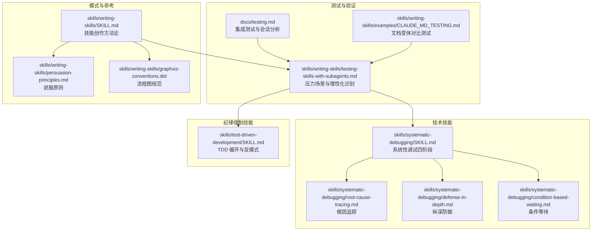
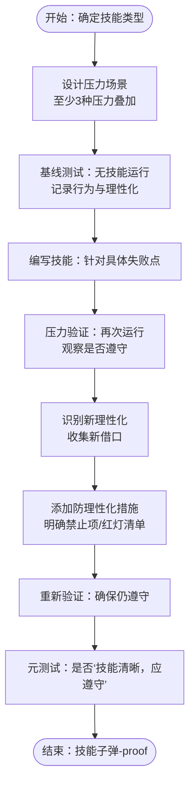
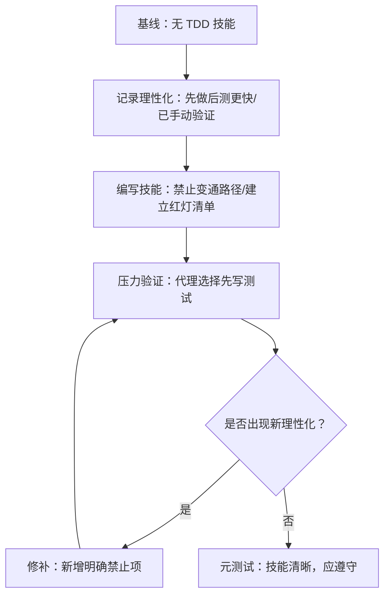
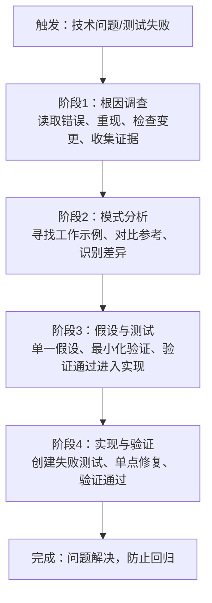
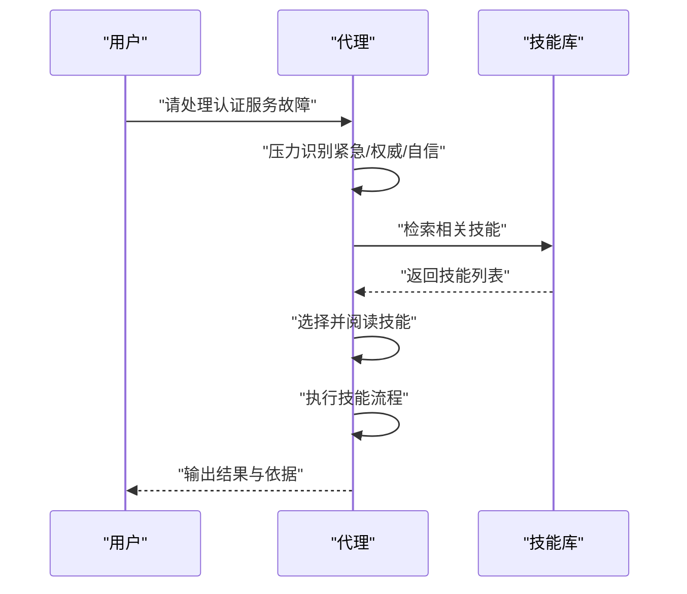
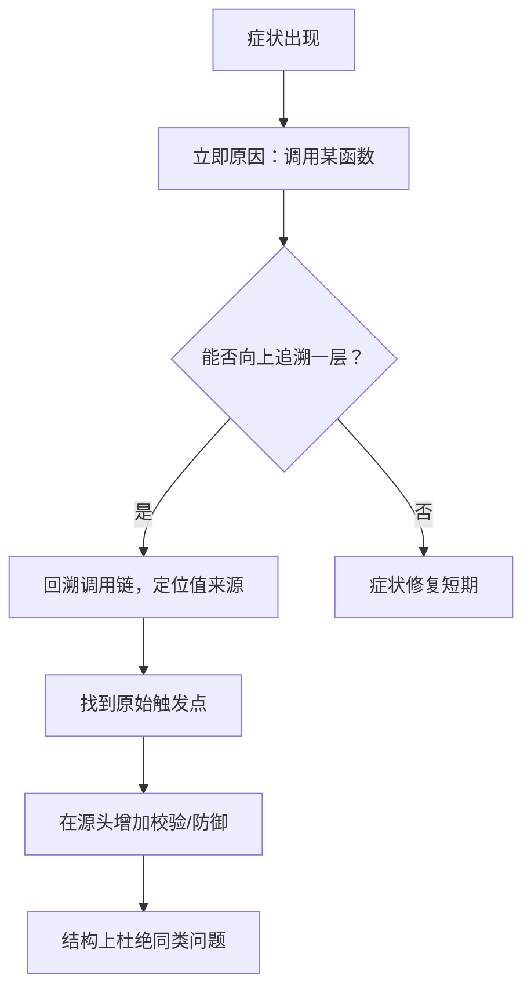
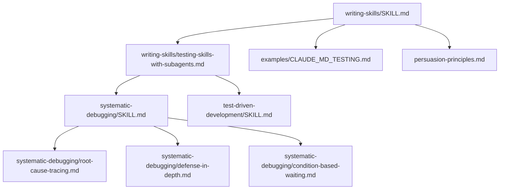

# 测试方法论

<cite>
**本文引用的文件**
- [README.md](file://README.md)
- [docs/testing.md](file://docs/testing.md)
- [skills/systematic-debugging/SKILL.md](file://skills/systematic-debugging/SKILL.md)
- [skills/systematic-debugging/test-pressure-1.md](file://skills/systematic-debugging/test-pressure-1.md)
- [skills/systematic-debugging/test-pressure-2.md](file://skills/systematic-debugging/test-pressure-2.md)
- [skills/systematic-debugging/test-pressure-3.md](file://skills/systematic-debugging/test-pressure-3.md)
- [skills/systematic-debugging/root-cause-tracing.md](file://skills/systematic-debugging/root-cause-tracing.md)
- [skills/systematic-debugging/defense-in-depth.md](file://skills/systematic-debugging/defense-in-depth.md)
- [skills/systematic-debugging/condition-based-waiting.md](file://skills/systematic-debugging/condition-based-waiting.md)
- [skills/test-driven-development/SKILL.md](file://skills/test-driven-development/SKILL.md)
- [skills/test-driven-development/testing-anti-patterns.md](file://skills/test-driven-development/testing-anti-patterns.md)
- [skills/writing-skills/SKILL.md](file://skills/writing-skills/SKILL.md)
- [skills/writing-skills/testing-skills-with-subagents.md](file://skills/writing-skills/testing-skills-with-subagents.md)
- [skills/writing-skills/examples/CLAUDE_MD_TESTING.md](file://skills/writing-skills/examples/CLAUDE_MD_TESTING.md)
- [skills/writing-skills/persuasion-principles.md](file://skills/writing-skills/persuasion-principles.md)
- [skills/writing-skills/graphviz-conventions.dot](file://skills/writing-skills/graphviz-conventions.dot)
</cite>

## 目录
1. [引言](#引言)
2. [项目结构](#项目结构)
3. [核心组件](#核心组件)
4. [架构总览](#架构总览)
5. [详细组件分析](#详细组件分析)
6. [依赖关系分析](#依赖关系分析)
7. [性能考量](#性能考量)
8. [故障排查指南](#故障排查指南)
9. [结论](#结论)
10. [附录](#附录)

## 引言
本指南面向 Superpowers 技能体系的测试与验证，系统阐述如何以“压力场景设计”为核心，结合“多压力组合测试”和“理性化识别技术”，对不同类型的技能进行科学、可重复的测试。文档覆盖以下技能类型与测试策略：
- 纪律强制技能：如 TDD、系统性调试等，强调规则不可协商与流程刚性。
- 技术技能：如条件等待、根因追踪、纵深防御等，强调可操作的技术方法。
- 模式技能：如“测试方法论”“技能设计方法论”等，强调心智模型与识别能力。
- 参考技能：如 API 文档、命令参考等，强调检索与应用的准确性。

同时，文档提供压力场景模板、理性化识别表、防理性化机制设计与评估标准，并给出具体测试示例与实施步骤。

## 项目结构
Superpowers 将技能作为可组合的“参考指南”，通过“压力场景 + 子代理测试 + 理性化识别”的闭环，验证技能在真实工作流中的有效性。关键目录与文件如下：
- docs/testing.md：集成测试运行方式、会话转录解析与成本分析工具使用。
- skills/systematic-debugging：系统性调试四阶段、根因追踪、纵深防御、条件等待等技术技能。
- skills/test-driven-development：TDD 循环、反模式清单与验证清单。
- skills/writing-skills：技能创作的 TDD 方法、压力场景设计、CSO（Claude 搜索优化）与说服原则。
- skills/writing-skills/examples/CLAUDE_MD_TESTING.md：技能文档变体的压力测试案例。
- skills/writing-skills/persuasion-principles.md：权威、承诺、稀缺、从众、团结等心理原则在技能设计中的应用。

**图表来源**
- [docs/testing.md:1-304](file://docs/testing.md#L1-L304)
- [skills/writing-skills/testing-skills-with-subagents.md:1-385](file://skills/writing-skills/testing-skills-with-subagents.md#L1-L385)
- [skills/systematic-debugging/SKILL.md:1-297](file://skills/systematic-debugging/SKILL.md#L1-L297)
- [skills/systematic-debugging/root-cause-tracing.md:1-170](file://skills/systematic-debugging/root-cause-tracing.md#L1-L170)
- [skills/systematic-debugging/defense-in-depth.md:1-123](file://skills/systematic-debugging/defense-in-depth.md#L1-L123)
- [skills/systematic-debugging/condition-based-waiting.md:1-116](file://skills/systematic-debugging/condition-based-waiting.md#L1-L116)
- [skills/test-driven-development/SKILL.md:1-372](file://skills/test-driven-development/SKILL.md#L1-L372)
- [skills/writing-skills/SKILL.md:1-656](file://skills/writing-skills/SKILL.md#L1-L656)
- [skills/writing-skills/examples/CLAUDE_MD_TESTING.md:1-190](file://skills/writing-skills/examples/CLAUDE_MD_TESTING.md#L1-L190)
- [skills/writing-skills/persuasion-principles.md:1-188](file://skills/writing-skills/persuasion-principles.md#L1-L188)
- [skills/writing-skills/graphviz-conventions.dot:1-172](file://skills/writing-skills/graphviz-conventions.dot#L1-L172)

**章节来源**
- [README.md:1-191](file://README.md#L1-L191)
- [docs/testing.md:1-304](file://docs/testing.md#L1-L304)

## 核心组件
- 压力场景设计：通过时间、沉没成本、权威、经济、疲劳、社交、功利主义等压力源组合，迫使代理在真实情境中做出选择，暴露其理性化倾向。
- 多压力组合测试：至少三类以上压力叠加，确保代理无法用单一借口规避规则。
- 理性化识别技术：记录代理的典型借口（如“先做后测更高效”“只此一次例外”），形成理性化表格，用于后续防理性化设计。
- 防理性化机制：在技能中明确禁止特定变通路径、建立红灯清单、强化“精神与字面”的对立原则、更新描述字段以纳入违规症状。
- 评估标准：代理在最大压力下仍遵守规则；能引用技能条款作为理由；能承认曾被诱惑但最终遵循；元测试显示“技能清晰，应遵守”。

**章节来源**
- [skills/writing-skills/SKILL.md:395-523](file://skills/writing-skills/SKILL.md#L395-L523)
- [skills/writing-skills/testing-skills-with-subagents.md:128-239](file://skills/writing-skills/testing-skills-with-subagents.md#L128-L239)
- [skills/writing-skills/persuasion-principles.md:9-188](file://skills/writing-skills/persuasion-principles.md#L9-L188)

## 架构总览
下图展示“技能测试方法论”的整体流程：从压力场景设计到基线测试、技能编写、压力验证与漏洞修补，形成闭环。

**图表来源**
- [skills/writing-skills/testing-skills-with-subagents.md:30-42](file://skills/writing-skills/testing-skills-with-subagents.md#L30-L42)
- [skills/writing-skills/testing-skills-with-subagents.md:163-239](file://skills/writing-skills/testing-skills-with-subagents.md#L163-L239)
- [skills/writing-skills/SKILL.md:533-561](file://skills/writing-skills/SKILL.md#L533-L561)

## 详细组件分析

### 纪律强制技能测试策略（以 TDD 为例）
- 测试目标：验证代理在紧急、疲劳、权威等压力下仍坚持“先写测试再写实现”的规则。
- 基线测试：在无 TDD 技能情况下运行压力场景，记录代理的选择与理性化（如“先做后测更快”“已手动验证过”）。
- 技能编写：针对基线中出现的具体理性化，补充明确禁止语句、红灯清单与“精神与字面”的对立原则。
- 压力验证：在相同场景中加入技能，确认代理选择正确且能引用技能条款。
- 漏洞修补：若代理找到新借口（如“保持为参考再先写测试”），则在技能中明确禁止该变通路径。
- 评估标准：代理在最大压力下遵守规则；能引用技能条款；承认曾被诱惑但仍遵循；元测试显示“技能清晰，应遵守”。

**图表来源**
- [skills/test-driven-development/SKILL.md:256-288](file://skills/test-driven-development/SKILL.md#L256-L288)
- [skills/writing-skills/SKILL.md:459-523](file://skills/writing-skills/SKILL.md#L459-L523)
- [skills/writing-skills/testing-skills-with-subagents.md:163-239](file://skills/writing-skills/testing-skills-with-subagents.md#L163-L239)

**章节来源**
- [skills/test-driven-development/SKILL.md:16-46](file://skills/test-driven-development/SKILL.md#L16-L46)
- [skills/test-driven-development/SKILL.md:256-288](file://skills/test-driven-development/SKILL.md#L256-L288)
- [skills/writing-skills/SKILL.md:459-523](file://skills/writing-skills/SKILL.md#L459-L523)

### 技术技能测试策略（以系统性调试为例）
- 四阶段流程：根因调查、模式分析、假设与测试、实现与验证。每个阶段都有明确的“最小可行动作”和“验证点”。
- 压力场景设计：紧急生产修复、沉没成本+疲劳、权威+社交压力等，迫使代理在高压下仍按流程执行。
- 理性化识别：如“快速修复先上线，再调查”“经验告诉我应该这么做”“团队希望尽快结束会议”等。
- 防理性化机制：在技能中明确“违反流程即停止并回退到上一阶段”“必须先完成根因调查再提假设”等硬性约束。
- 评估标准：代理在压力下严格执行四阶段；能指出具体证据来源；能识别并拒绝“症状修复”。

**图表来源**
- [skills/systematic-debugging/SKILL.md:46-214](file://skills/systematic-debugging/SKILL.md#L46-L214)

**章节来源**
- [skills/systematic-debugging/SKILL.md:245-257](file://skills/systematic-debugging/SKILL.md#L245-L257)
- [skills/systematic-debugging/SKILL.md:215-244](file://skills/systematic-debugging/SKILL.md#L215-L244)

### 模式技能测试策略（以“技能创作方法论”为例）
- 目标：验证代理能否识别何时需要技能、何时应遵循技能流程。
- 压力场景：时间压力（任务紧急）、自信偏差（“我经验丰富无需技能”）、权威偏见（“领导说直接做”）。
- 评估：代理是否主动检索技能、完整阅读后再行动、在压力下仍遵循流程。
- 元测试：代理能否指出“文档为何不够清晰”“哪些地方容易被跳过”。

**图表来源**
- [skills/writing-skills/examples/CLAUDE_MD_TESTING.md:135-151](file://skills/writing-skills/examples/CLAUDE_MD_TESTING.md#L135-L151)

**章节来源**
- [skills/writing-skills/examples/CLAUDE_MD_TESTING.md:1-190](file://skills/writing-skills/examples/CLAUDE_MD_TESTING.md#L1-L190)

### 参考技能测试策略（以 API 文档为例）
- 目标：验证代理能否准确检索并正确应用参考信息。
- 压力场景：时间压力导致“快速查找”而非“完整阅读”；权威偏见导致“凭记忆使用”而非“查文档”。
- 评估：代理能否定位正确条目、在应用前复核关键参数、在缺失信息时指出缺口。

**章节来源**
- [skills/writing-skills/SKILL.md:433-443](file://skills/writing-skills/SKILL.md#L433-L443)

### 压力场景设计与多压力组合
- 压力类型：时间、沉没成本、权威、经济、疲劳、社交、功利主义。
- 设计要点：具体选项（A/B/C）、实际约束（时间点、后果）、真实路径（/tmp/project 而非“某项目”）、强制行动（“你做什么？”而非“你应该做什么？”）。
- 组合策略：至少三类压力叠加，如“紧急 + 沉没成本 + 权威”，使代理无法用单一借口规避。

**章节来源**
- [skills/writing-skills/testing-skills-with-subagents.md:128-142](file://skills/writing-skills/testing-skills-with-subagents.md#L128-L142)
- [skills/writing-skills/testing-skills-with-subagents.md:144-151](file://skills/writing-skills/testing-skills-with-subagents.md#L144-L151)

### 理性化识别与防理性化机制
- 理性化识别：记录代理的典型借口（如“先做后测更快”“只此一次例外”“经验告诉我应该这么做”“团队希望尽快结束”）。
- 防理性化机制：
  - 明确禁止特定变通路径（如“删除代码后重写”“保持为参考再先写测试”）。
  - 建立红灯清单（列出“违反即停止”的行为）。
  - 强化“精神与字面”的对立原则（“违反字面即违反精神”）。
  - 更新技能描述字段，纳入“即将违规的症状”。

**章节来源**
- [skills/writing-skills/SKILL.md:497-523](file://skills/writing-skills/SKILL.md#L497-L523)
- [skills/writing-skills/SKILL.md:525-532](file://skills/writing-skills/SKILL.md#L525-L532)
- [skills/test-driven-development/SKILL.md:256-288](file://skills/test-driven-development/SKILL.md#L256-L288)

### 技术技能的支撑方法
- 根因追踪：从症状回溯调用链，找到原始触发点，避免仅修复症状。
- 纵深防御：在每一层数据流转处增加校验，使缺陷结构上不可能发生。
- 条件等待：以“实际条件满足”替代“任意超时”，消除竞态与不稳定。

**图表来源**
- [skills/systematic-debugging/root-cause-tracing.md:32-152](file://skills/systematic-debugging/root-cause-tracing.md#L32-L152)

**章节来源**
- [skills/systematic-debugging/root-cause-tracing.md:130-152](file://skills/systematic-debugging/root-cause-tracing.md#L130-L152)
- [skills/systematic-debugging/defense-in-depth.md:20-123](file://skills/systematic-debugging/defense-in-depth.md#L20-L123)
- [skills/systematic-debugging/condition-based-waiting.md:9-116](file://skills/systematic-debugging/condition-based-waiting.md#L9-L116)

### 压力场景示例（来自系统性调试）
- 场景1：紧急生产修复（每分钟损失 $15k），代理在“快速修复”与“系统性调查”之间选择。
- 场景2：沉没成本+疲劳（已投入4小时），代理在“继续调查”与“临时方案”之间选择。
- 场景3：权威+社交压力（资深工程师与技术主管施压），代理在“坚持流程”与“信任专家”之间选择。

**章节来源**
- [skills/systematic-debugging/test-pressure-1.md:1-59](file://skills/systematic-debugging/test-pressure-1.md#L1-L59)
- [skills/systematic-debugging/test-pressure-2.md:1-69](file://skills/systematic-debugging/test-pressure-2.md#L1-L69)
- [skills/systematic-debugging/test-pressure-3.md:1-70](file://skills/systematic-debugging/test-pressure-3.md#L1-L70)

### 集成测试与会话转录分析（适用于复杂技能）
- 运行方式：在无头模式下启动 Claude 会话，加载目标技能，执行完整工作流。
- 验证维度：技能工具是否调用、子代理是否按计划调度、任务跟踪是否正确、实现文件与测试是否生成并通过、Git 提交历史是否符合流程。
- 成本分析：通过会话转录统计输入/输出/缓存令牌与估算成本，辅助资源控制。

**章节来源**
- [docs/testing.md:20-135](file://docs/testing.md#L20-L135)
- [docs/testing.md:137-304](file://docs/testing.md#L137-L304)

## 依赖关系分析
- 技能创作方法论（writing-skills）为所有技能测试提供统一范式，贯穿“压力场景设计—基线测试—技能编写—压力验证—漏洞修补—元测试”的闭环。
- 系统性调试（systematic-debugging）为技术技能提供四阶段流程与根因追踪、纵深防御、条件等待等支撑方法。
- TDD（test-driven-development）为纪律强制技能提供“先写测试”的铁律与反模式清单。
- 文档变体测试（examples/CLAUDE_MD_TESTING.md）验证技能文档在不同风格下的发现与使用效果。
- 说服原则（persuasion-principles）为技能设计提供权威、承诺、稀缺、从众、团结等心理机制，提升合规率。

**图表来源**
- [skills/writing-skills/SKILL.md:1-656](file://skills/writing-skills/SKILL.md#L1-L656)
- [skills/writing-skills/testing-skills-with-subagents.md:1-385](file://skills/writing-skills/testing-skills-with-subagents.md#L1-L385)
- [skills/systematic-debugging/SKILL.md:1-297](file://skills/systematic-debugging/SKILL.md#L1-L297)
- [skills/systematic-debugging/root-cause-tracing.md:1-170](file://skills/systematic-debugging/root-cause-tracing.md#L1-L170)
- [skills/systematic-debugging/defense-in-depth.md:1-123](file://skills/systematic-debugging/defense-in-depth.md#L1-L123)
- [skills/systematic-debugging/condition-based-waiting.md:1-116](file://skills/systematic-debugging/condition-based-waiting.md#L1-L116)
- [skills/test-driven-development/SKILL.md:1-372](file://skills/test-driven-development/SKILL.md#L1-L372)
- [skills/writing-skills/examples/CLAUDE_MD_TESTING.md:1-190](file://skills/writing-skills/examples/CLAUDE_MD_TESTING.md#L1-L190)
- [skills/writing-skills/persuasion-principles.md:1-188](file://skills/writing-skills/persuasion-principles.md#L1-L188)

**章节来源**
- [skills/writing-skills/SKILL.md:1-656](file://skills/writing-skills/SKILL.md#L1-L656)
- [skills/systematic-debugging/SKILL.md:1-297](file://skills/systematic-debugging/SKILL.md#L1-L297)
- [skills/test-driven-development/SKILL.md:1-372](file://skills/test-driven-development/SKILL.md#L1-L372)

## 性能考量
- 压力场景设计需平衡“真实感”与“可重复性”。过多压力可能导致代理过度规避而放弃行动，建议逐步叠加并明确阈值。
- 防理性化机制应简洁明确，避免冗长条款导致代理忽略或误读。
- 成本控制：通过会话转录的成本分析工具监控令牌使用，识别高成本环节并优化提示词与流程。

[本节为通用指导，不直接分析具体文件]

## 故障排查指南
- 技能未加载：确认在插件目录内运行、本地市场启用、技能存在于 skills/ 目录。
- 权限错误：使用权限绕过标志与目录授权，检查测试目录权限。
- 超时问题：延长超时时间、检查技能逻辑是否存在死循环、降低子代理任务复杂度。
- 会话文件缺失：检查项目目录编码、使用最近会话查找命令、确认测试确实执行。

**章节来源**
- [docs/testing.md:178-215](file://docs/testing.md#L178-L215)

## 结论
Superpowers 的技能测试方法论以“压力场景 + 多压力组合 + 理性化识别”为核心，辅以“防理性化机制”与“元测试”，确保纪律强制技能在高压下仍能被执行，技术技能在复杂问题中得到正确应用，模式与参考技能在真实工作流中被有效检索与遵循。通过持续的 RED-GREEN-REFACTOR 循环，技能体系将不断逼近“子弹-proof”的状态。

[本节为总结性内容，不直接分析具体文件]

## 附录
- 流程图规范：使用 Graphviz 规范定义节点形状与标签命名，确保流程图清晰易读。
- 常见反模式：测试 mock 行为、在生产类中添加测试专用方法、无理解地 mock、mock 不完整、将测试视为事后补救等。

**章节来源**
- [skills/writing-skills/graphviz-conventions.dot:1-172](file://skills/writing-skills/graphviz-conventions.dot#L1-L172)
- [skills/test-driven-development/testing-anti-patterns.md:1-300](file://skills/test-driven-development/testing-anti-patterns.md#L1-L300)