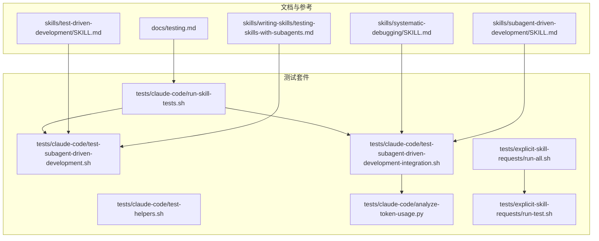
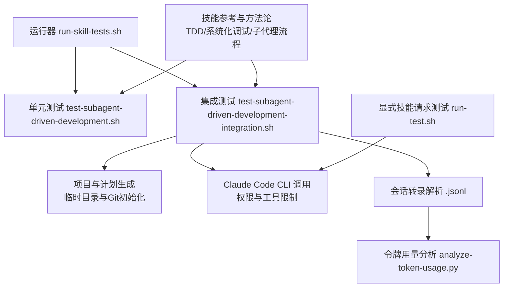
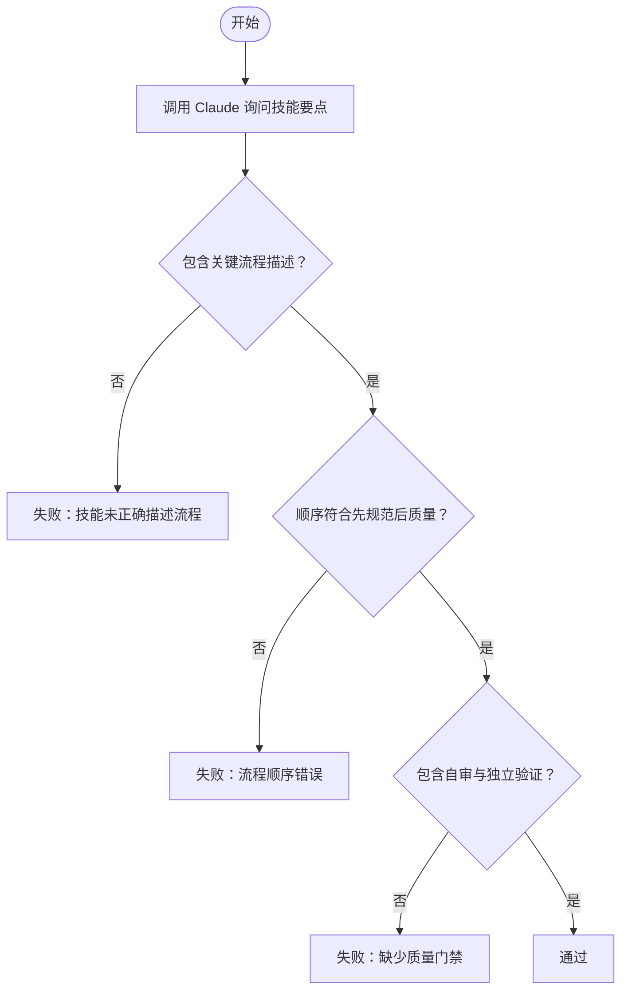
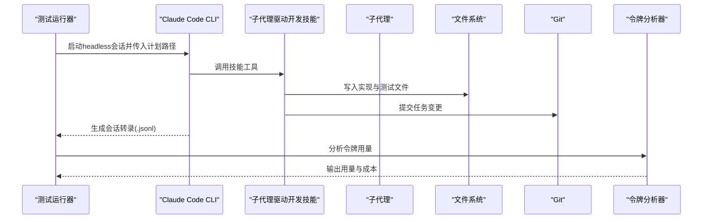
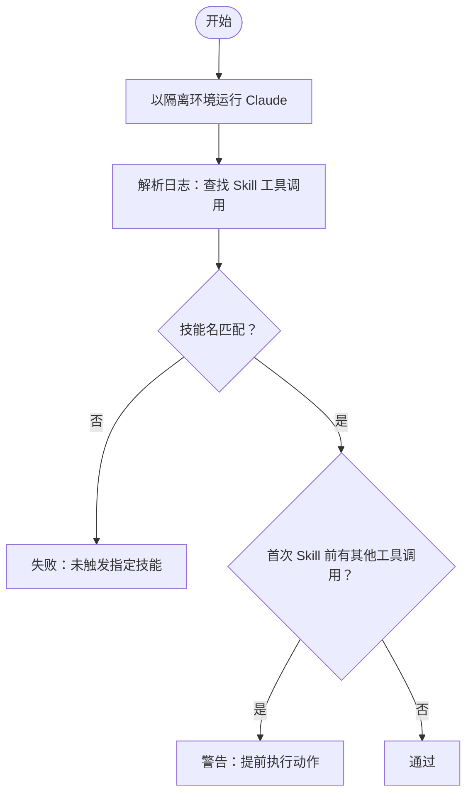
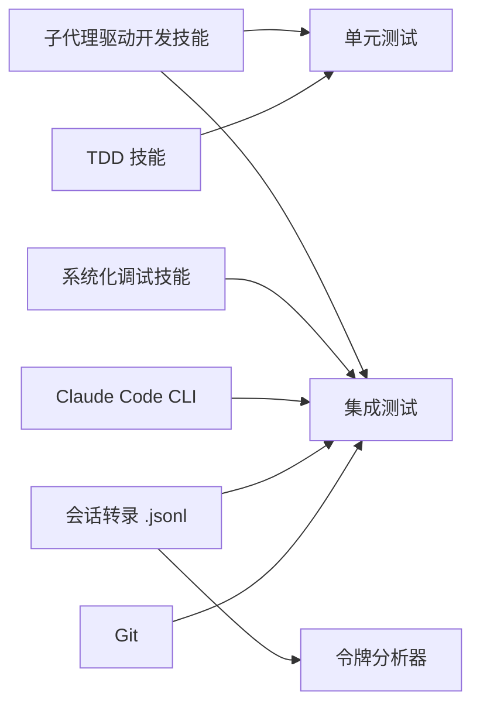

# 技能测试

<cite>
**本文引用的文件**
- [README.md](file://README.md)
- [docs/testing.md](file://docs/testing.md)
- [skills/writing-skills/testing-skills-with-subagents.md](file://skills/writing-skills/testing-skills-with-subagents.md)
- [skills/test-driven-development/SKILL.md](file://skills/test-driven-development/SKILL.md)
- [skills/systematic-debugging/SKILL.md](file://skills/systematic-debugging/SKILL.md)
- [skills/subagent-driven-development/SKILL.md](file://skills/subagent-driven-development/SKILL.md)
- [tests/claude-code/run-skill-tests.sh](file://tests/claude-code/run-skill-tests.sh)
- [tests/claude-code/test-helpers.sh](file://tests/claude-code/test-helpers.sh)
- [tests/claude-code/test-subagent-driven-development.sh](file://tests/claude-code/test-subagent-driven-development.sh)
- [tests/claude-code/test-subagent-driven-development-integration.sh](file://tests/claude-code/test-subagent-driven-development-integration.sh)
- [tests/claude-code/analyze-token-usage.py](file://tests/claude-code/analyze-token-usage.py)
- [tests/explicit-skill-requests/run-all.sh](file://tests/explicit-skill-requests/run-all.sh)
- [tests/explicit-skill-requests/run-test.sh](file://tests/explicit-skill-requests/run-test.sh)
</cite>

## 目录
1. [简介](#简介)
2. [项目结构](#项目结构)
3. [核心组件](#核心组件)
4. [架构总览](#架构总览)
5. [详细组件分析](#详细组件分析)
6. [依赖关系分析](#依赖关系分析)
7. [性能考量](#性能考量)
8. [故障排查指南](#故障排查指南)
9. [结论](#结论)
10. [附录](#附录)

## 简介
本文件面向Superpowers技能测试，系统化阐述技能测试的设计原理与测试策略，覆盖单元测试、集成测试与端到端测试（E2E）的实施方法；解释子代理在技能测试中的作用与测试流程；提供测试脚本编写指南与自动化测试实现方法，并为技能开发者构建完整的测试工具链与质量保证流程。

## 项目结构
Superpowers仓库中与测试直接相关的目录与文件如下：
- 文档与说明：docs/testing.md
- 技能参考：skills/*（如test-driven-development、systematic-debugging、subagent-driven-development、writing-skills）
- 测试套件：tests/*
  - claude-code：集成测试与辅助工具（run-skill-tests.sh、test-helpers.sh、test-subagent-driven-development-integration.sh、analyze-token-usage.py）
  - explicit-skill-requests：显式技能请求测试（run-all.sh、run-test.sh）
  - 其他平台测试（opencode等）用于插件加载与优先级验证（本节不展开）

图表来源
- [docs/testing.md:1-304](file://docs/testing.md#L1-L304)
- [tests/claude-code/run-skill-tests.sh:1-188](file://tests/claude-code/run-skill-tests.sh#L1-L188)
- [tests/claude-code/test-helpers.sh:1-203](file://tests/claude-code/test-helpers.sh#L1-L203)
- [tests/claude-code/test-subagent-driven-development.sh:1-166](file://tests/claude-code/test-subagent-driven-development.sh#L1-L166)
- [tests/claude-code/test-subagent-driven-development-integration.sh:1-315](file://tests/claude-code/test-subagent-driven-development-integration.sh#L1-L315)
- [tests/claude-code/analyze-token-usage.py:1-169](file://tests/claude-code/analyze-token-usage.py#L1-L169)
- [tests/explicit-skill-requests/run-all.sh:1-71](file://tests/explicit-skill-requests/run-all.sh#L1-L71)
- [tests/explicit-skill-requests/run-test.sh:1-137](file://tests/explicit-skill-requests/run-test.sh#L1-L137)

章节来源
- [README.md:108-151](file://README.md#L108-L151)
- [docs/testing.md:1-304](file://docs/testing.md#L1-L304)

## 核心组件
- 测试运行器与套件
  - 运行器：tests/claude-code/run-skill-tests.sh，支持过滤、超时、集成测试开关与汇总统计
  - 辅助库：tests/claude-code/test-helpers.sh，封装run_claude、断言、计划生成、临时项目清理等
- 单元测试
  - 针对技能“子代理驱动开发”的规则性测试：tests/claude-code/test-subagent-driven-development.sh
- 集成测试
  - 完整工作流执行与产物验证：tests/claude-code/test-subagent-driven-development-integration.sh
  - 会话转录解析与令牌用量分析：tests/claude-code/analyze-token-usage.py
- 显式技能请求测试
  - tests/explicit-skill-requests/run-all.sh 与 run-test.sh，验证用户直接命名技能时的行为
- 技能参考与测试方法论
  - skills/writing-skills/testing-skills-with-subagents.md：以TDD方式测试技能（RED-GREEN-REFACTOR）
  - skills/test-driven-development/SKILL.md：测试先行的TDD原则与反模式
  - skills/systematic-debugging/SKILL.md：系统化调试流程，支撑缺陷定位与回归测试
  - skills/subagent-driven-development/SKILL.md：子代理驱动开发流程与质量门禁

章节来源
- [tests/claude-code/run-skill-tests.sh:1-188](file://tests/claude-code/run-skill-tests.sh#L1-L188)
- [tests/claude-code/test-helpers.sh:1-203](file://tests/claude-code/test-helpers.sh#L1-L203)
- [tests/claude-code/test-subagent-driven-development.sh:1-166](file://tests/claude-code/test-subagent-driven-development.sh#L1-L166)
- [tests/claude-code/test-subagent-driven-development-integration.sh:1-315](file://tests/claude-code/test-subagent-driven-development-integration.sh#L1-L315)
- [tests/claude-code/analyze-token-usage.py:1-169](file://tests/claude-code/analyze-token-usage.py#L1-L169)
- [tests/explicit-skill-requests/run-all.sh:1-71](file://tests/explicit-skill-requests/run-all.sh#L1-L71)
- [tests/explicit-skill-requests/run-test.sh:1-137](file://tests/explicit-skill-requests/run-test.sh#L1-L137)
- [skills/writing-skills/testing-skills-with-subagents.md:1-385](file://skills/writing-skills/testing-skills-with-subagents.md#L1-L385)
- [skills/test-driven-development/SKILL.md:1-372](file://skills/test-driven-development/SKILL.md#L1-L372)
- [skills/systematic-debugging/SKILL.md:1-297](file://skills/systematic-debugging/SKILL.md#L1-L297)
- [skills/subagent-driven-development/SKILL.md:1-278](file://skills/subagent-driven-development/SKILL.md#L1-L278)

## 架构总览
测试体系围绕“技能”这一核心对象，通过不同粒度的测试覆盖其行为正确性、流程合规性与成本控制。整体架构如下：

图表来源
- [tests/claude-code/run-skill-tests.sh:1-188](file://tests/claude-code/run-skill-tests.sh#L1-L188)
- [tests/claude-code/test-subagent-driven-development.sh:1-166](file://tests/claude-code/test-subagent-driven-development.sh#L1-L166)
- [tests/claude-code/test-subagent-driven-development-integration.sh:1-315](file://tests/claude-code/test-subagent-driven-development-integration.sh#L1-L315)
- [tests/claude-code/analyze-token-usage.py:1-169](file://tests/claude-code/analyze-token-usage.py#L1-L169)
- [tests/explicit-skill-requests/run-test.sh:1-137](file://tests/explicit-skill-requests/run-test.sh#L1-L137)

## 详细组件分析

### 单元测试：子代理驱动开发技能规则验证
目标：验证技能描述中的关键流程与门禁是否被正确理解与表达，避免误用或跳过审查环节。

- 关键断言点
  - 技能可加载且描述包含“读取计划一次”“任务上下文直接提供”“自审要求”“先规范再质量”“评审循环”“独立验证”等
  - 使用断言函数：包含/不包含/计数/顺序（assert_contains、assert_not_contains、assert_count、assert_order）
  - 通过run_claude调用Claude进行问答式验证

- 设计模式
  - 基于“技能描述即契约”，以问题驱动的方式从模型输出中抽取证据
  - 将“流程顺序”“门禁”“上下文传递”等作为可验证的断言条件

- 测试数据与环境
  - 无需真实项目，仅需本地技能可用
  - 使用test-helpers.sh提供的run_claude与断言工具

图表来源
- [tests/claude-code/test-subagent-driven-development.sh:1-166](file://tests/claude-code/test-subagent-driven-development.sh#L1-L166)
- [tests/claude-code/test-helpers.sh:1-203](file://tests/claude-code/test-helpers.sh#L1-L203)

章节来源
- [tests/claude-code/test-subagent-driven-development.sh:1-166](file://tests/claude-code/test-subagent-driven-development.sh#L1-L166)
- [tests/claude-code/test-helpers.sh:1-203](file://tests/claude-code/test-helpers.sh#L1-L203)

### 集成测试：完整工作流执行与产物验证
目标：在真实项目中执行完整计划，验证子代理驱动开发的端到端行为与产物质量。

- 流程概览
  - 创建最小Node.js项目与计划文件
  - 初始化Git仓库
  - 以headless模式调用Claude Code CLI，执行计划
  - 解析会话转录（.jsonl），验证：
    - 技能被调用
    - 子代理被分派
    - 任务跟踪（TodoWrite）
    - 实现文件与测试文件创建并通过测试
    - 提交历史体现多轮迭代
    - 规范一致性审查防止过度功能
  - 使用analyze-token-usage.py进行令牌用量分析

- 关键断言点
  - 技能工具调用记录存在
  - Task工具调用次数≥2
  - TodoWrite使用次数≥1
  - 源文件与测试文件存在且通过
  - Git提交数量>2
  - 无额外功能（规范审查应拦截）

- 成本与可观测性
  - 令牌用量按主会话与子代理拆分统计
  - 输出总计与估算成本，便于成本控制

图表来源
- [tests/claude-code/test-subagent-driven-development-integration.sh:1-315](file://tests/claude-code/test-subagent-driven-development-integration.sh#L1-L315)
- [tests/claude-code/analyze-token-usage.py:1-169](file://tests/claude-code/analyze-token-usage.py#L1-L169)

章节来源
- [tests/claude-code/test-subagent-driven-development-integration.sh:1-315](file://tests/claude-code/test-subagent-driven-development-integration.sh#L1-L315)
- [tests/claude-code/analyze-token-usage.py:1-169](file://tests/claude-code/analyze-token-usage.py#L1-L169)

### 显式技能请求测试：用户直接命名技能的触发验证
目标：验证当用户直接请求某个技能名称时，Claude能够正确识别并触发该技能，而非提前执行动作。

- 关键断言点
  - 日志中出现“Skill”工具调用
  - 技能名称匹配（支持带命名空间或不带命名空间）
  - 在首次“Skill”调用之前不应有非系统工具的调用（避免“先做后学”的失败模式）

- 环境隔离
  - 使用隔离的HOME与插件目录，避免用户上下文干扰
  - 支持限制最大对话轮次，控制测试时长

图表来源
- [tests/explicit-skill-requests/run-test.sh:1-137](file://tests/explicit-skill-requests/run-test.sh#L1-L137)

章节来源
- [tests/explicit-skill-requests/run-all.sh:1-71](file://tests/explicit-skill-requests/run-all.sh#L1-L71)
- [tests/explicit-skill-requests/run-test.sh:1-137](file://tests/explicit-skill-requests/run-test.sh#L1-L137)

### 子代理在技能测试中的作用与测试流程
- 子代理作为“外部执行体”参与测试：
  - 单元测试：通过问答抽取技能规则证据
  - 集成测试：实际执行任务、写入文件、提交代码、进行评审循环
  - 显式请求测试：验证触发链路与前置动作检查
- 测试流程建议
  - 先规则后行为：先用单元测试确认技能描述的可验证性，再用集成测试验证真实产物
  - 成本控制：利用令牌分析器监控成本，优化模型选择与任务复杂度
  - 回归保障：将显式请求测试纳入每日回归，确保技能触发稳定性

章节来源
- [skills/subagent-driven-development/SKILL.md:1-278](file://skills/subagent-driven-development/SKILL.md#L1-L278)
- [docs/testing.md:1-304](file://docs/testing.md#L1-L304)

### 测试脚本编写指南与自动化实现
- 命令行参数与选项
  - --verbose：显示详细输出
  - --test：仅运行指定测试
  - --timeout：设置单个测试超时
  - --integration：启用集成测试
  - --help：帮助信息
- 断言与辅助函数
  - run_claude：封装Claude CLI调用与超时控制
  - assert_*：包含/不包含/计数/顺序断言
  - create_test_project/cleanup_test_project：临时项目管理
  - create_test_plan：生成最小可执行计划
- 自动化测试
  - run-skill-tests.sh统一调度，支持过滤与汇总
  - analyze-token-usage.py自动分析会话转录，输出成本与用量

章节来源
- [tests/claude-code/run-skill-tests.sh:1-188](file://tests/claude-code/run-skill-tests.sh#L1-L188)
- [tests/claude-code/test-helpers.sh:1-203](file://tests/claude-code/test-helpers.sh#L1-L203)
- [tests/claude-code/analyze-token-usage.py:1-169](file://tests/claude-code/analyze-token-usage.py#L1-L169)

## 依赖关系分析
- 技能与测试的耦合
  - 子代理驱动开发技能定义了严格的流程与门禁，测试用例直接映射这些约束
  - TDD与系统化调试技能为测试提供了方法论基础（测试先行、系统化定位）
- 工具与外部系统
  - Claude Code CLI：headless执行与工具调用
  - 会话转录（.jsonl）：测试结果的唯一事实来源
  - Git：产物验证与提交历史检查
  - Python分析器：令牌用量与成本估算

图表来源
- [skills/subagent-driven-development/SKILL.md:1-278](file://skills/subagent-driven-development/SKILL.md#L1-L278)
- [skills/test-driven-development/SKILL.md:1-372](file://skills/test-driven-development/SKILL.md#L1-L372)
- [skills/systematic-debugging/SKILL.md:1-297](file://skills/systematic-debugging/SKILL.md#L1-L297)
- [tests/claude-code/test-subagent-driven-development-integration.sh:1-315](file://tests/claude-code/test-subagent-driven-development-integration.sh#L1-L315)
- [tests/claude-code/analyze-token-usage.py:1-169](file://tests/claude-code/analyze-token-usage.py#L1-L169)

章节来源
- [skills/subagent-driven-development/SKILL.md:1-278](file://skills/subagent-driven-development/SKILL.md#L1-L278)
- [skills/test-driven-development/SKILL.md:1-372](file://skills/test-driven-development/SKILL.md#L1-L372)
- [skills/systematic-debugging/SKILL.md:1-297](file://skills/systematic-debugging/SKILL.md#L1-L297)
- [tests/claude-code/test-subagent-driven-development-integration.sh:1-315](file://tests/claude-code/test-subagent-driven-development-integration.sh#L1-L315)
- [tests/claude-code/analyze-token-usage.py:1-169](file://tests/claude-code/analyze-token-usage.py#L1-L169)

## 性能考量
- 执行时间
  - 集成测试通常耗时较长（10-30分钟），需合理设置超时与并行度
- 成本控制
  - 利用令牌分析器监控输入/输出/缓存读取与估算成本
  - 根据任务复杂度选择合适模型，降低不必要的高成本调用
- 可靠性
  - 通过“评审循环”与“独立验证”减少返工，提升整体效率
  - 使用显式请求测试避免“先做后学”的失败模式

[本节为通用指导，不直接分析具体文件]

## 故障排查指南
- 技能未加载
  - 确保在Superpowers插件目录下运行测试
  - 检查本地开发市场启用状态与技能文件存在
- 权限问题
  - 使用--permission-mode bypassPermissions与--add-dir授权测试目录
- 超时与无限循环
  - 增加超时时间，检查技能逻辑是否存在死循环
- 会话文件缺失
  - 检查项目目录编码与最近会话文件位置
- 令牌分析异常
  - 确认会话文件存在且格式正确

章节来源
- [docs/testing.md:178-215](file://docs/testing.md#L178-L215)

## 结论
Superpowers的技能测试体系以“技能即契约”为核心，通过单元测试验证规则与流程，集成测试验证真实产物与成本，显式请求测试保障触发链路稳定。结合TDD与系统化调试的方法论，开发者可以持续改进技能质量，建立可靠的自动化测试流水线。

[本节为总结性内容，不直接分析具体文件]

## 附录

### 测试策略设计模式
- RED-GREEN-REFACTOR（技能测试版）
  - RED：在没有技能的情况下运行，观察Agent的典型失败与借口
  - GREEN：编写技能以解决具体失败场景
  - VERIFY GREEN：在压力场景下验证技能是否仍有效
  - REFACTOR：针对新借口补充明确否定条款与红灯清单
- 压力场景设计
  - 组合多种压力源（时间、沉没成本、权威、经济、疲惫、社交、实用主义）
  - 强制二选一或多选一的决策，避免“开放性回答”

章节来源
- [skills/writing-skills/testing-skills-with-subagents.md:1-385](file://skills/writing-skills/testing-skills-with-subagents.md#L1-L385)

### 测试用例设计模板（示例）
- 单元测试模板
  - 使用run_claude提问技能要点
  - 使用assert_*断言期望关键词与顺序
- 集成测试模板
  - 创建最小项目与计划
  - headless执行并解析.jsonl
  - 断言技能调用、子代理分派、文件创建、测试通过、提交历史、无额外功能
- 显式请求测试模板
  - 隔离环境运行
  - 检查Skill工具调用与技能名匹配
  - 检查首次Skill前是否有其他工具调用

章节来源
- [tests/claude-code/test-subagent-driven-development.sh:1-166](file://tests/claude-code/test-subagent-driven-development.sh#L1-L166)
- [tests/claude-code/test-subagent-driven-development-integration.sh:1-315](file://tests/claude-code/test-subagent-driven-development-integration.sh#L1-L315)
- [tests/explicit-skill-requests/run-test.sh:1-137](file://tests/explicit-skill-requests/run-test.sh#L1-L137)