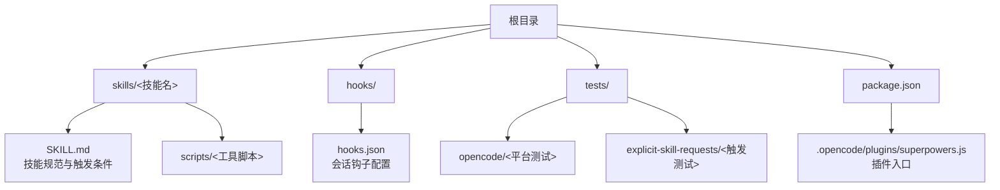
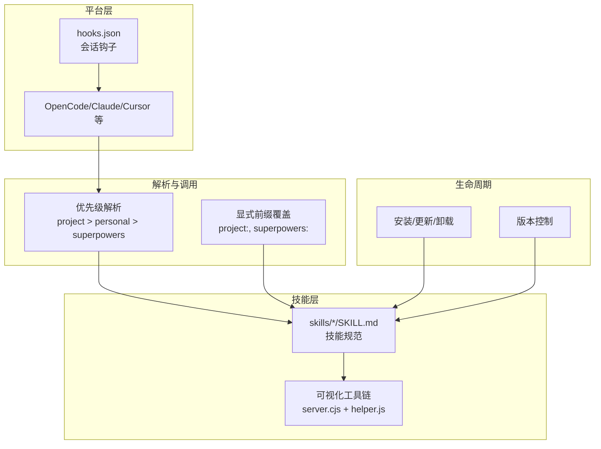
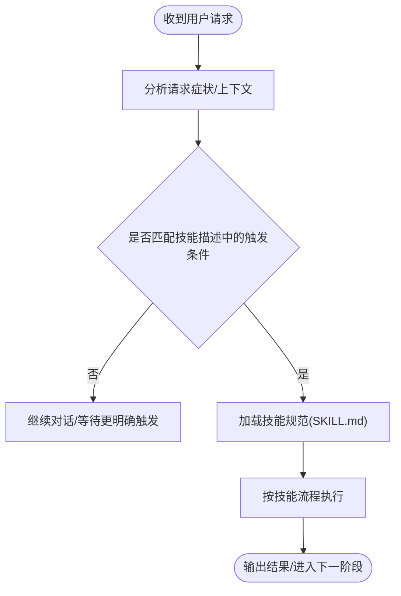
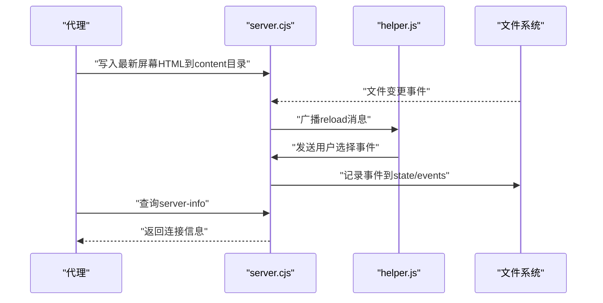
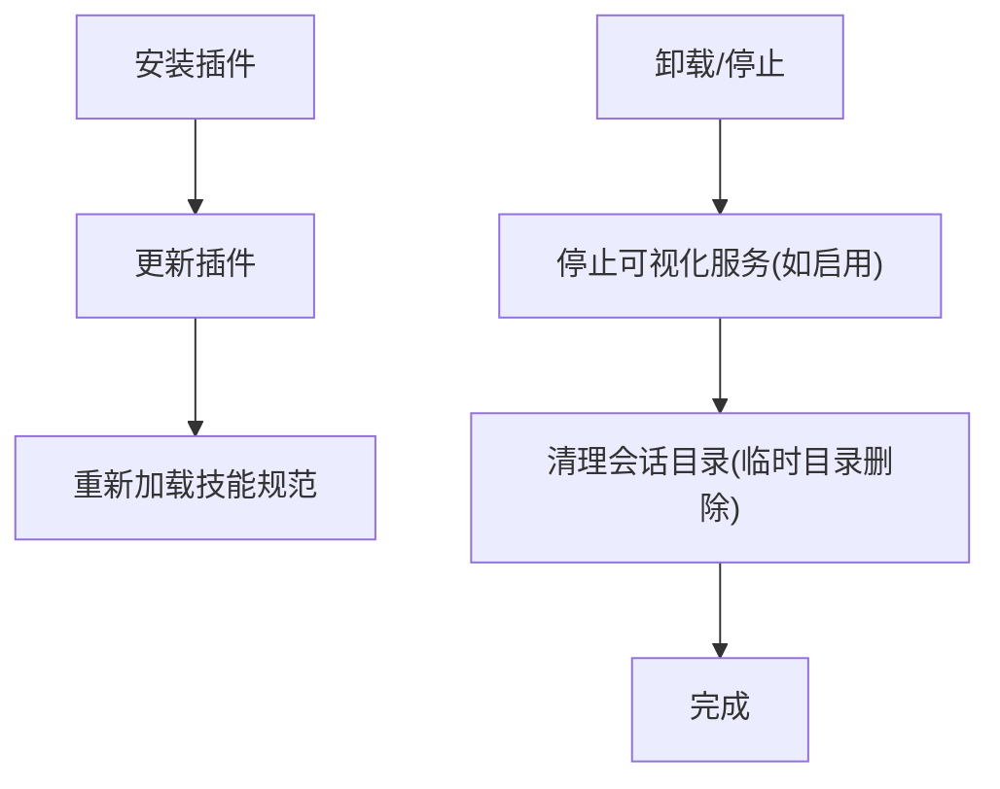
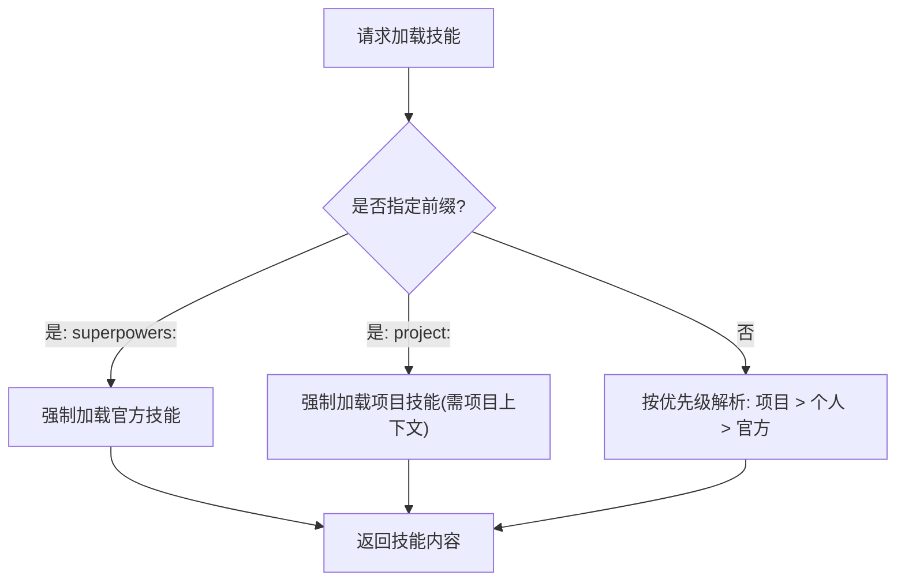
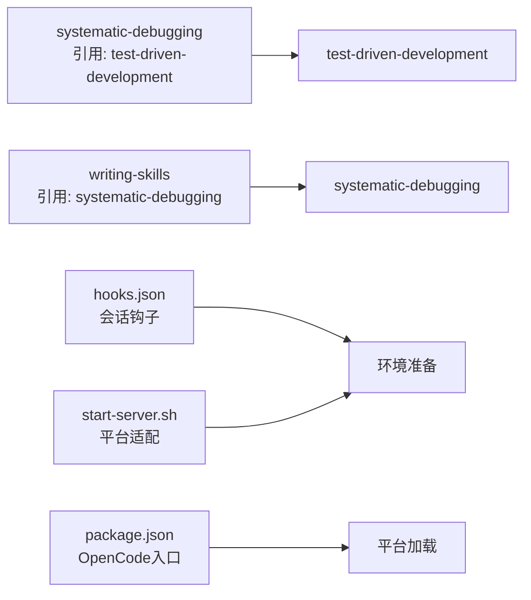
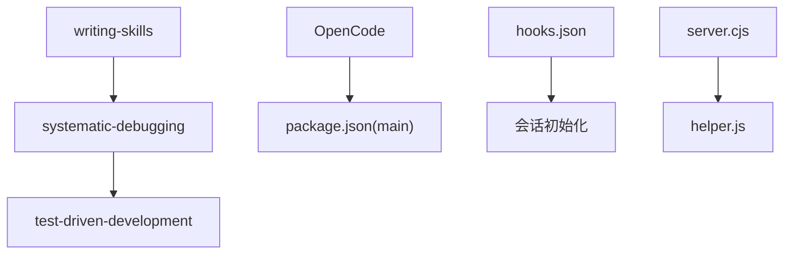

# 技能管理

<cite>
**本文引用的文件**
- [README.md](file://README.md)
- [package.json](file://package.json)
- [skills/brainstorming/SKILL.md](file://skills/brainstorming/SKILL.md)
- [skills/systematic-debugging/SKILL.md](file://skills/systematic-debugging/SKILL.md)
- [skills/test-driven-development/SKILL.md](file://skills/test-driven-development/SKILL.md)
- [skills/writing-skills/SKILL.md](file://skills/writing-skills/SKILL.md)
- [skills/brainstorming/scripts/server.cjs](file://skills/brainstorming/scripts/server.cjs)
- [skills/brainstorming/scripts/helper.js](file://skills/brainstorming/scripts/helper.js)
- [skills/brainstorming/scripts/start-server.sh](file://skills/brainstorming/scripts/start-server.sh)
- [skills/brainstorming/scripts/stop-server.sh](file://skills/brainstorming/scripts/stop-server.sh)
- [hooks/hooks.json](file://hooks/hooks.json)
- [tests/opencode/test-priority.sh](file://tests/opencode/test-priority.sh)
</cite>

## 目录
1. [简介](#简介)
2. [项目结构](#项目结构)
3. [核心组件](#核心组件)
4. [架构总览](#架构总览)
5. [详细组件分析](#详细组件分析)
6. [依赖关系分析](#依赖关系分析)
7. [性能考量](#性能考量)
8. [故障排除指南](#故障排除指南)
9. [结论](#结论)
10. [附录](#附录)

## 简介
本文件面向 Superpowers 技能管理系统，系统性阐述技能的注册、发现与调用机制，覆盖生命周期（安装、更新、卸载、版本控制）、优先级排序与冲突解决、依赖管理、跨平台适配策略、配置选项与自定义设置，并提供管理员与高级用户的高级功能与故障排除指南。内容基于仓库中技能文档、脚本与测试文件进行归纳总结，帮助读者在不同平台上高效使用与扩展 Superpowers 的技能体系。

## 项目结构
Superpowers 将“技能”作为可组合的工作流单元，分布在 skills 目录下；平台适配通过 hooks、启动脚本与测试用例体现；包元数据用于 OpenCode 插件入口定位。

**图表来源**
- [README.md:126-151](file://README.md#L126-L151)
- [package.json:1-7](file://package.json#L1-L7)
- [hooks/hooks.json:1-17](file://hooks/hooks.json#L1-L17)

**章节来源**
- [README.md:126-151](file://README.md#L126-L151)
- [package.json:1-7](file://package.json#L1-L7)
- [hooks/hooks.json:1-17](file://hooks/hooks.json#L1-L17)

## 核心组件
- 技能文档规范：每个技能以 SKILL.md 定义名称、描述、触发条件、流程与最佳实践，确保平台检索与加载的一致性。
- 可视化配套：如头脑风暴技能的本地 Web 服务与前端交互脚本，支持可视化设计与用户选择回传。
- 平台钩子：通过 hooks.json 在会话开始时执行初始化命令，实现技能环境准备。
- 优先级与命名空间：OpenCode 测试验证了项目 > 个人 > 超级技能（superpowers）的优先级解析规则，以及显式前缀覆盖策略。
- 包入口：package.json 指定 OpenCode 插件入口文件，便于平台加载。

**章节来源**
- [skills/brainstorming/SKILL.md:1-165](file://skills/brainstorming/SKILL.md#L1-L165)
- [skills/systematic-debugging/SKILL.md:1-297](file://skills/systematic-debugging/SKILL.md#L1-L297)
- [skills/test-driven-development/SKILL.md:1-372](file://skills/test-driven-development/SKILL.md#L1-L372)
- [skills/writing-skills/SKILL.md:1-656](file://skills/writing-skills/SKILL.md#L1-L656)
- [skills/brainstorming/scripts/server.cjs:1-355](file://skills/brainstorming/scripts/server.cjs#L1-L355)
- [skills/brainstorming/scripts/helper.js:1-89](file://skills/brainstorming/scripts/helper.js#L1-L89)
- [hooks/hooks.json:1-17](file://hooks/hooks.json#L1-L17)
- [tests/opencode/test-priority.sh:1-199](file://tests/opencode/test-priority.sh#L1-L199)
- [package.json:1-7](file://package.json#L1-L7)

## 架构总览
Superpowers 技能管理由“技能规范 + 平台适配 + 生命周期 + 优先级解析 + 可视化工具链”构成。平台在会话启动时加载钩子，按优先级解析技能来源，技能通过自身规范被发现与调用，部分技能可启用本地工具链提升交互体验。

**图表来源**
- [hooks/hooks.json:1-17](file://hooks/hooks.json#L1-L17)
- [skills/brainstorming/SKILL.md:1-165](file://skills/brainstorming/SKILL.md#L1-L165)
- [skills/brainstorming/scripts/server.cjs:1-355](file://skills/brainstorming/scripts/server.cjs#L1-L355)
- [skills/brainstorming/scripts/helper.js:1-89](file://skills/brainstorming/scripts/helper.js#L1-L89)
- [tests/opencode/test-priority.sh:1-199](file://tests/opencode/test-priority.sh#L1-L199)

## 详细组件分析

### 组件A：技能规范与发现机制
- 触发条件与描述：每个技能的 YAML frontmatter 中包含 name 与 description，其中 description 仅描述触发症状与情境，避免直接总结流程，以提升平台检索命中率。
- 结构化流程：技能文档可包含流程图、快速参考表与常见误区，辅助平台在合适时机调用。
- 示例技能：
  - 头脑风暴：强调设计前置与可视化协作，包含硬性门禁与设计文档生成要求。
  - 系统化调试：四阶段根因调查流程，强调先调查再修复。
  - 测试驱动开发：红-绿-重构循环与反论证清单，强调失败先行。
  - 写技能：技能创作的 TDD 方法论，强调“先压力场景，后技能编写”。

**图表来源**
- [skills/brainstorming/SKILL.md:1-165](file://skills/brainstorming/SKILL.md#L1-L165)
- [skills/systematic-debugging/SKILL.md:1-297](file://skills/systematic-debugging/SKILL.md#L1-L297)
- [skills/test-driven-development/SKILL.md:1-372](file://skills/test-driven-development/SKILL.md#L1-L372)
- [skills/writing-skills/SKILL.md:1-656](file://skills/writing-skills/SKILL.md#L1-L656)

**章节来源**
- [skills/brainstorming/SKILL.md:1-165](file://skills/brainstorming/SKILL.md#L1-L165)
- [skills/systematic-debugging/SKILL.md:1-297](file://skills/systematic-debugging/SKILL.md#L1-L297)
- [skills/test-driven-development/SKILL.md:1-372](file://skills/test-driven-development/SKILL.md#L1-L372)
- [skills/writing-skills/SKILL.md:1-656](file://skills/writing-skills/SKILL.md#L1-L656)

### 组件B：可视化配套（头脑风暴）
- 本地 Web 服务器：负责接收屏幕内容文件、广播重载事件、处理 WebSocket 握手与心跳，支持自动空闲退出与所有者进程监控。
- 前端交互脚本：注入页面，捕获用户点击与选择，向服务器回传事件并更新界面指示。
- 启停脚本：提供随机高段口监听、持久化/临时会话目录、前台/后台模式、自动适配环境等能力。

**图表来源**
- [skills/brainstorming/scripts/server.cjs:1-355](file://skills/brainstorming/scripts/server.cjs#L1-L355)
- [skills/brainstorming/scripts/helper.js:1-89](file://skills/brainstorming/scripts/helper.js#L1-L89)
- [skills/brainstorming/scripts/start-server.sh:1-149](file://skills/brainstorming/scripts/start-server.sh#L1-L149)
- [skills/brainstorming/scripts/stop-server.sh:1-57](file://skills/brainstorming/scripts/stop-server.sh#L1-L57)

**章节来源**
- [skills/brainstorming/scripts/server.cjs:1-355](file://skills/brainstorming/scripts/server.cjs#L1-L355)
- [skills/brainstorming/scripts/helper.js:1-89](file://skills/brainstorming/scripts/helper.js#L1-L89)
- [skills/brainstorming/scripts/start-server.sh:1-149](file://skills/brainstorming/scripts/start-server.sh#L1-L149)
- [skills/brainstorming/scripts/stop-server.sh:1-57](file://skills/brainstorming/scripts/stop-server.sh#L1-L57)

### 组件C：生命周期管理（安装、更新、卸载、版本控制）
- 安装与更新：README 提供多平台安装与更新命令，技能随插件更新而更新。
- 卸载：停止可视化服务器（如适用），清理会话目录（临时目录会被删除，持久化目录保留以便复盘）。
- 版本控制：通过包版本与平台更新命令实现；仓库内包含版本提升脚本，便于维护。

**图表来源**
- [README.md:27-106](file://README.md#L27-L106)
- [README.md:172-178](file://README.md#L172-L178)
- [skills/brainstorming/scripts/stop-server.sh:1-57](file://skills/brainstorming/scripts/stop-server.sh#L1-L57)

**章节来源**
- [README.md:27-106](file://README.md#L27-L106)
- [README.md:172-178](file://README.md#L172-L178)
- [skills/brainstorming/scripts/stop-server.sh:1-57](file://skills/brainstorming/scripts/stop-server.sh#L1-L57)

### 组件D：优先级排序与冲突解决
- 解析顺序：项目 > 个人 > 超级技能（superpowers）。当同一技能同时存在于多个位置时，平台按此顺序解析。
- 显式前缀覆盖：
  - superpowers:<技能名>：强制加载官方技能。
  - project:<技能名>：在项目上下文中强制加载项目技能（非项目上下文可能不生效或报错）。
- 冲突解决：若存在同名技能，优先级高的覆盖低优先级；显式前缀可绕过默认优先级。

**图表来源**
- [tests/opencode/test-priority.sh:1-199](file://tests/opencode/test-priority.sh#L1-L199)

**章节来源**
- [tests/opencode/test-priority.sh:1-199](file://tests/opencode/test-priority.sh#L1-L199)

### 组件E：依赖管理与跨平台适配
- 依赖来源：技能之间通过“必需背景/子技能”声明依赖关系，例如系统化调试技能引用 TDD 与验证前置技能。
- 平台适配：
  - 会话钩子：通过 hooks.json 在会话开始时执行初始化命令，准备技能运行环境。
  - 启停脚本：针对不同平台与环境（容器、CI、WSL、Git Bash）自动选择前台/后台模式，保证稳定性。
  - 包入口：OpenCode 通过 package.json 指定插件入口，确保平台正确加载。

**图表来源**
- [skills/systematic-debugging/SKILL.md:286-288](file://skills/systematic-debugging/SKILL.md#L286-L288)
- [skills/writing-skills/SKILL.md:282-287](file://skills/writing-skills/SKILL.md#L282-L287)
- [hooks/hooks.json:1-17](file://hooks/hooks.json#L1-L17)
- [skills/brainstorming/scripts/start-server.sh:1-149](file://skills/brainstorming/scripts/start-server.sh#L1-L149)
- [package.json:1-7](file://package.json#L1-L7)

**章节来源**
- [skills/systematic-debugging/SKILL.md:286-288](file://skills/systematic-debugging/SKILL.md#L286-L288)
- [skills/writing-skills/SKILL.md:282-287](file://skills/writing-skills/SKILL.md#L282-L287)
- [hooks/hooks.json:1-17](file://hooks/hooks.json#L1-L17)
- [skills/brainstorming/scripts/start-server.sh:1-149](file://skills/brainstorming/scripts/start-server.sh#L1-L149)
- [package.json:1-7](file://package.json#L1-L7)

## 依赖关系分析
- 技能间依赖：通过“引用/必需背景”声明，形成轻量依赖网络，避免强耦合。
- 平台依赖：OpenCode 通过 package.json 入口加载；其他平台通过各自插件市场或手动安装。
- 工具链依赖：头脑风暴可视化依赖本地 Node 服务与浏览器 WebSocket 通信。

**图表来源**
- [skills/writing-skills/SKILL.md:282-287](file://skills/writing-skills/SKILL.md#L282-L287)
- [skills/systematic-debugging/SKILL.md:286-288](file://skills/systematic-debugging/SKILL.md#L286-L288)
- [package.json:1-7](file://package.json#L1-L7)
- [hooks/hooks.json:1-17](file://hooks/hooks.json#L1-L17)
- [skills/brainstorming/scripts/server.cjs:1-355](file://skills/brainstorming/scripts/server.cjs#L1-L355)
- [skills/brainstorming/scripts/helper.js:1-89](file://skills/brainstorming/scripts/helper.js#L1-L89)

**章节来源**
- [skills/writing-skills/SKILL.md:282-287](file://skills/writing-skills/SKILL.md#L282-L287)
- [skills/systematic-debugging/SKILL.md:286-288](file://skills/systematic-debugging/SKILL.md#L286-L288)
- [package.json:1-7](file://package.json#L1-L7)
- [hooks/hooks.json:1-17](file://hooks/hooks.json#L1-L17)
- [skills/brainstorming/scripts/server.cjs:1-355](file://skills/brainstorming/scripts/server.cjs#L1-L355)
- [skills/brainstorming/scripts/helper.js:1-89](file://skills/brainstorming/scripts/helper.js#L1-L89)

## 性能考量
- 技能加载效率：描述字段聚焦触发条件，减少无关流程细节，有助于平台快速筛选与加载，降低上下文开销。
- 可视化工具链：WebSocket 与文件系统监控采用去抖动与空闲超时策略，避免资源浪费。
- 平台适配：启停脚本自动检测环境并选择前台模式，减少后台进程被回收导致的额外重启成本。

[本节为通用指导，无需列出具体文件来源]

## 故障排除指南
- 可视化服务未启动或无法访问
  - 检查 server-started 日志输出与 PID 文件是否存在。
  - 确认绑定主机与 URL 主机配置，避免 127.0.0.1 与外部访问不一致。
  - 在 CI 或 Windows 环境下，确认已启用前台模式。
- 服务器被系统回收
  - 启停脚本已内置前台模式自动检测与降级逻辑；若仍失败，尝试固定前台运行并检查进程状态。
- 技能未按预期加载
  - 使用显式前缀强制加载：superpowers:<技能名> 或 project:<技能名>（后者需在项目上下文）。
  - 验证优先级：项目 > 个人 > 官方，确认目标位置的 SKILL.md 是否存在且内容包含唯一标记。
- 会话钩子未生效
  - 检查 hooks.json 中的匹配器与命令路径，确认平台支持 SessionStart 钩子。
- OpenCode 插件入口问题
  - 确认 package.json 的 main 字段指向正确的插件入口文件。

**章节来源**
- [skills/brainstorming/scripts/start-server.sh:1-149](file://skills/brainstorming/scripts/start-server.sh#L1-L149)
- [skills/brainstorming/scripts/stop-server.sh:1-57](file://skills/brainstorming/scripts/stop-server.sh#L1-L57)
- [tests/opencode/test-priority.sh:1-199](file://tests/opencode/test-priority.sh#L1-L199)
- [hooks/hooks.json:1-17](file://hooks/hooks.json#L1-L17)
- [package.json:1-7](file://package.json#L1-L7)

## 结论
Superpowers 技能管理体系以“规范化的技能文档 + 轻量工具链 + 明确的优先级解析 + 平台钩子”为核心，实现了跨平台、可扩展、可治理的技能生态。通过严格的触发条件描述、依赖声明与生命周期管理，系统在保证一致性的同时，也为管理员与高级用户提供了灵活的定制与排障手段。

[本节为总结性内容，无需列出具体文件来源]

## 附录
- 快速参考
  - 安装与更新：参考 README 的各平台安装与更新命令。
  - 技能优先级：项目 > 个人 > 官方；可通过前缀覆盖。
  - 可视化工具：头脑风暴配套本地服务，注意端口与目录权限。
  - 包入口：OpenCode 通过 package.json 的 main 字段加载插件。

**章节来源**
- [README.md:27-106](file://README.md#L27-L106)
- [README.md:172-178](file://README.md#L172-L178)
- [tests/opencode/test-priority.sh:1-199](file://tests/opencode/test-priority.sh#L1-L199)
- [package.json:1-7](file://package.json#L1-L7)