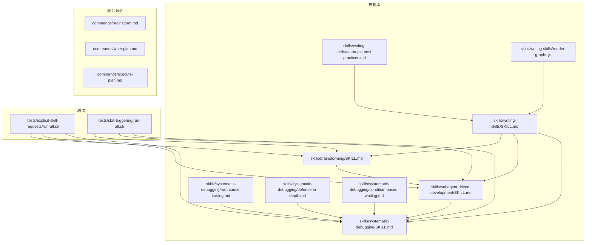
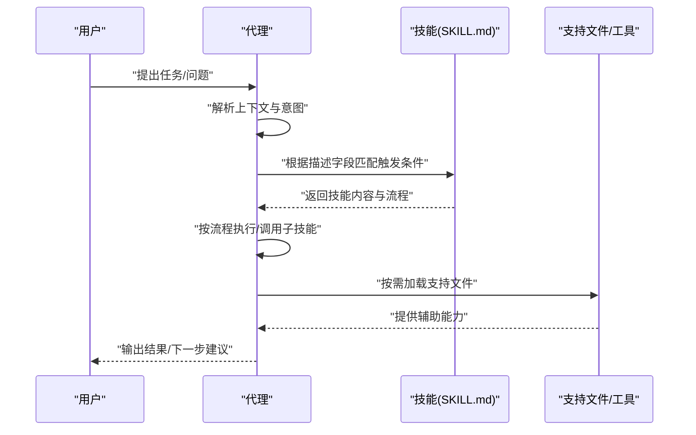
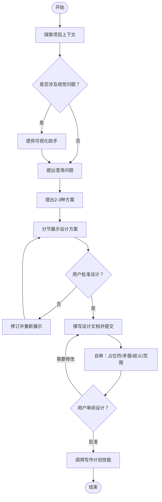
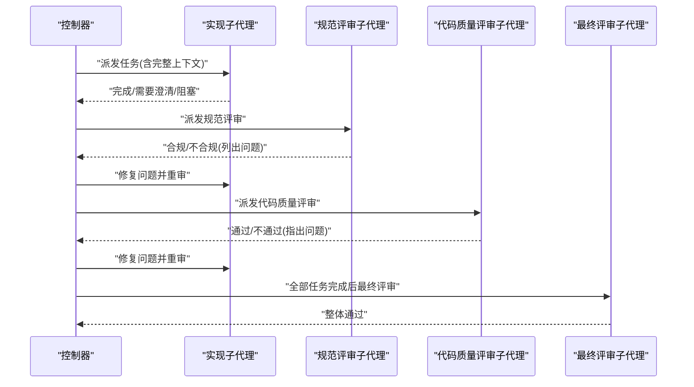
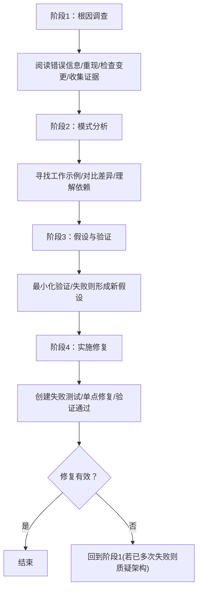
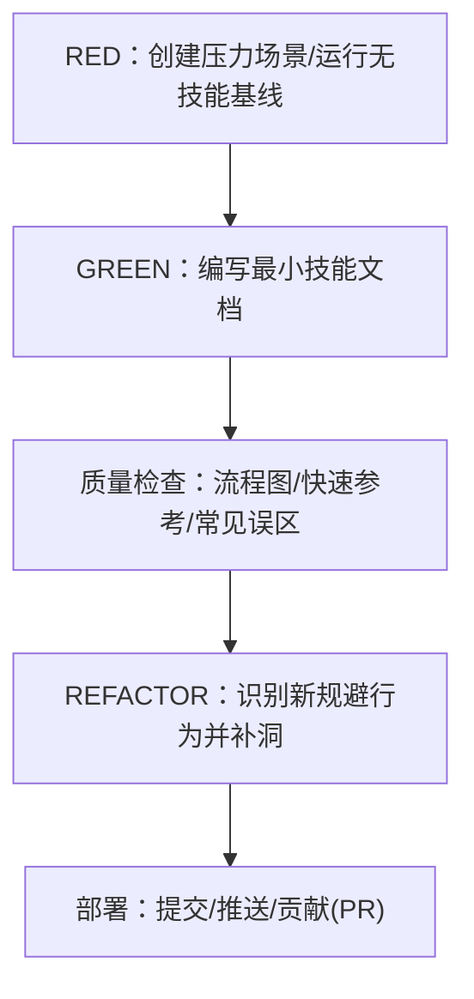
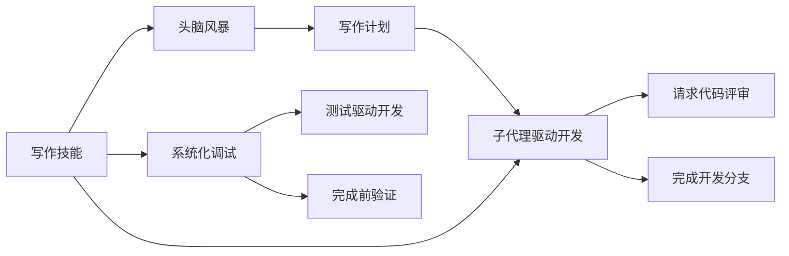

# 技能系统

<cite>
**本文档引用的文件**
- [README.md](file://README.md)
- [skills/brainstorming/SKILL.md](file://skills/brainstorming/SKILL.md)
- [skills/subagent-driven-development/SKILL.md](file://skills/subagent-driven-development/SKILL.md)
- [skills/systematic-debugging/SKILL.md](file://skills/systematic-debugging/SKILL.md)
- [skills/systematic-debugging/root-cause-tracing.md](file://skills/systematic-debugging/root-cause-tracing.md)
- [skills/systematic-debugging/defense-in-depth.md](file://skills/systematic-debugging/defense-in-depth.md)
- [skills/systematic-debugging/condition-based-waiting.md](file://skills/systematic-debugging/condition-based-waiting.md)
- [skills/writing-skills/SKILL.md](file://skills/writing-skills/SKILL.md)
- [skills/writing-skills/anthropic-best-practices.md](file://skills/writing-skills/anthropic-best-practices.md)
- [skills/writing-skills/render-graphs.js](file://skills/writing-skills/render-graphs.js)
- [tests/skill-triggering/run-all.sh](file://tests/skill-triggering/run-all.sh)
- [tests/explicit-skill-requests/run-all.sh](file://tests/explicit-skill-requests/run-all.sh)
- [commands/brainstorm.md](file://commands/brainstorm.md)
- [commands/write-plan.md](file://commands/write-plan.md)
- [commands/execute-plan.md](file://commands/execute-plan.md)
</cite>

## 目录
1. [简介](#简介)
2. [项目结构](#项目结构)
3. [核心组件](#核心组件)
4. [架构总览](#架构总览)
5. [详细组件分析](#详细组件分析)
6. [依赖关系分析](#依赖关系分析)
7. [性能考量](#性能考量)
8. [故障排查指南](#故障排查指南)
9. [结论](#结论)
10. [附录](#附录)

## 简介
本文件为 Superpowers 技能系统的全面技术文档。系统以“可组合技能”为核心，通过明确的触发条件与稳定的执行流程，实现从需求澄清到代码实现再到验证收尾的完整开发工作流。技能系统强调以下设计理念：
- 可发现性：通过精确的描述字段与关键词，确保代理在恰当情境下自动加载对应技能
- 可组合性：技能之间通过明确的前置条件与协作约定进行编排，形成端到端的工作流
- 可验证性：采用“压力场景 + 基线测试 + 最小修复 + 迭代收紧”的闭环，保证技能在真实使用中可靠落地
- 可维护性：统一的目录结构、模板与工具链，降低技能创作与演进成本

## 项目结构
技能系统位于仓库的 skills 目录下，每个技能以独立子目录呈现，包含主文档 SKILL.md 以及按需加载的支持文件。测试体系覆盖“显式请求触发”和“隐式触发”两类场景，分别位于 tests/explicit-skill-requests 与 tests/skill-triggering。

**图表来源**
- [skills/brainstorming/SKILL.md:1-165](file://skills/brainstorming/SKILL.md#L1-L165)
- [skills/subagent-driven-development/SKILL.md:1-278](file://skills/subagent-driven-development/SKILL.md#L1-L278)
- [skills/systematic-debugging/SKILL.md:1-297](file://skills/systematic-debugging/SKILL.md#L1-L297)
- [skills/writing-skills/SKILL.md:1-656](file://skills/writing-skills/SKILL.md#L1-L656)
- [skills/systematic-debugging/root-cause-tracing.md:1-170](file://skills/systematic-debugging/root-cause-tracing.md#L1-L170)
- [skills/systematic-debugging/defense-in-depth.md:1-123](file://skills/systematic-debugging/defense-in-depth.md#L1-L123)
- [skills/systematic-debugging/condition-based-waiting.md:1-116](file://skills/systematic-debugging/condition-based-waiting.md#L1-L116)
- [skills/writing-skills/anthropic-best-practices.md:1-800](file://skills/writing-skills/anthropic-best-practices.md#L1-L800)
- [skills/writing-skills/render-graphs.js:1-169](file://skills/writing-skills/render-graphs.js#L1-L169)
- [tests/explicit-skill-requests/run-all.sh:1-71](file://tests/explicit-skill-requests/run-all.sh#L1-L71)
- [tests/skill-triggering/run-all.sh:1-61](file://tests/skill-triggering/run-all.sh#L1-L61)
- [commands/brainstorm.md:1-6](file://commands/brainstorm.md#L1-L6)
- [commands/write-plan.md:1-6](file://commands/write-plan.md#L1-L6)
- [commands/execute-plan.md:1-6](file://commands/execute-plan.md#L1-L6)

**章节来源**
- [README.md:1-191](file://README.md#L1-L191)
- [skills/brainstorming/SKILL.md:1-165](file://skills/brainstorming/SKILL.md#L1-L165)
- [skills/subagent-driven-development/SKILL.md:1-278](file://skills/subagent-driven-development/SKILL.md#L1-L278)
- [skills/systematic-debugging/SKILL.md:1-297](file://skills/systematic-debugging/SKILL.md#L1-L297)
- [skills/writing-skills/SKILL.md:1-656](file://skills/writing-skills/SKILL.md#L1-L656)

## 核心组件
- 技能文档（SKILL.md）：定义触发条件、使用场景、流程图、快速参考与常见误区，是技能被发现与正确使用的依据
- 支持文件：如调试技术文档、渲染脚本等，按需加载，避免上下文污染
- 测试套件：覆盖显式请求与隐式触发，确保技能在真实对话中被正确加载与执行
- 工具链：如 Graphviz 渲染脚本，帮助可视化技能流程，提升可读性与协作效率

**章节来源**
- [skills/writing-skills/SKILL.md:93-137](file://skills/writing-skills/SKILL.md#L93-L137)
- [skills/writing-skills/anthropic-best-practices.md:144-408](file://skills/writing-skills/anthropic-best-practices.md#L144-L408)
- [skills/writing-skills/render-graphs.js:1-169](file://skills/writing-skills/render-graphs.js#L1-L169)

## 架构总览
技能系统采用“描述驱动发现 + 文档驱动执行”的双轨架构：
- 发现层：通过 SKILL.md 的 YAML frontmatter 中的 description 字段，结合关键词与触发语义，使代理在恰当情境下自动选择并加载技能
- 执行层：技能文档中的流程图与步骤清单，指导代理在会话中按序执行，必要时调用其他技能或工具

**图表来源**
- [skills/writing-skills/SKILL.md:140-197](file://skills/writing-skills/SKILL.md#L140-L197)
- [skills/writing-skills/anthropic-best-practices.md:185-234](file://skills/writing-skills/anthropic-best-practices.md#L185-L234)

## 详细组件分析

### 设计与触发机制（以“头脑风暴”为例）
头脑风暴技能强调“先设计后实现”，通过严格的门禁与阶段性校验，确保设计质量与后续计划的可行性。

**图表来源**
- [skills/brainstorming/SKILL.md:34-66](file://skills/brainstorming/SKILL.md#L34-L66)

**章节来源**
- [skills/brainstorming/SKILL.md:20-33](file://skills/brainstorming/SKILL.md#L20-L33)
- [skills/brainstorming/SKILL.md:107-137](file://skills/brainstorming/SKILL.md#L107-L137)

### 执行流程（以“子代理驱动开发”为例）
该技能通过“每任务一个子代理 + 两阶段评审”的方式，实现高质量、高迭代速度的实现过程。

**图表来源**
- [skills/subagent-driven-development/SKILL.md:42-84](file://skills/subagent-driven-development/SKILL.md#L42-L84)

**章节来源**
- [skills/subagent-driven-development/SKILL.md:14-32](file://skills/subagent-driven-development/SKILL.md#L14-L32)
- [skills/subagent-driven-development/SKILL.md:102-119](file://skills/subagent-driven-development/SKILL.md#L102-L119)

### 调试与根因定位（系统化调试）
系统化调试强调“先根因，后修复”，并通过多层防御与条件等待等技术手段，降低缺陷复发率。

**图表来源**
- [skills/systematic-debugging/SKILL.md:46-214](file://skills/systematic-debugging/SKILL.md#L46-L214)

**章节来源**
- [skills/systematic-debugging/root-cause-tracing.md:1-170](file://skills/systematic-debugging/root-cause-tracing.md#L1-L170)
- [skills/systematic-debugging/defense-in-depth.md:1-123](file://skills/systematic-debugging/defense-in-depth.md#L1-L123)
- [skills/systematic-debugging/condition-based-waiting.md:1-116](file://skills/systematic-debugging/condition-based-waiting.md#L1-L116)

### 技能创作与质量标准（写作技能）
写作技能将“测试驱动开发”应用于过程文档，形成“基线测试 → 最小修复 → 迭代收紧”的闭环，并提供搜索优化、命名规范、渐进披露等最佳实践。

**图表来源**
- [skills/writing-skills/SKILL.md:30-46](file://skills/writing-skills/SKILL.md#L30-L46)
- [skills/writing-skills/SKILL.md:533-561](file://skills/writing-skills/SKILL.md#L533-L561)

**章节来源**
- [skills/writing-skills/SKILL.md:140-197](file://skills/writing-skills/SKILL.md#L140-L197)
- [skills/writing-skills/anthropic-best-practices.md:144-408](file://skills/writing-skills/anthropic-best-practices.md#L144-L408)

## 依赖关系分析
技能之间的依赖主要体现在“前置条件”和“协作关系”两个维度：
- 前置条件：如“子代理驱动开发”要求先有“写作计划”
- 协作关系：如“系统化调试”可配合“测试驱动开发”与“完成前验证”等技能

**图表来源**
- [skills/subagent-driven-development/SKILL.md:265-278](file://skills/subagent-driven-development/SKILL.md#L265-L278)
- [skills/systematic-debugging/SKILL.md:286-289](file://skills/systematic-debugging/SKILL.md#L286-L289)

**章节来源**
- [skills/subagent-driven-development/SKILL.md:265-278](file://skills/subagent-driven-development/SKILL.md#L265-L278)
- [skills/systematic-debugging/SKILL.md:286-289](file://skills/systematic-debugging/SKILL.md#L286-L289)

## 性能考量
- 上下文窗口管理：技能文档应保持简洁，避免不必要的冗长解释，优先使用“渐进披露”将细节拆分为按需加载的文件
- 模型适配：不同模型在指令清晰度与推理深度上存在差异，应在技能描述与流程中体现对模型能力的合理预期
- 触发准确性：通过精确的触发描述与关键词，减少误触发带来的上下文浪费

[本节为通用指导，无需特定文件引用]

## 故障排查指南
- 触发失败：检查技能描述字段是否准确反映触发条件；确认测试用例覆盖了典型触发场景
- 执行偏差：核对流程图与步骤清单，确保每一步都有明确的“通过/失败”判定与回退路径
- 资源加载：确认支持文件仅在需要时加载，避免一次性加载过多内容导致上下文溢出
- 可视化辅助：使用渲染脚本生成流程图，便于团队协作与知识传递

**章节来源**
- [tests/skill-triggering/run-all.sh:1-61](file://tests/skill-triggering/run-all.sh#L1-L61)
- [tests/explicit-skill-requests/run-all.sh:1-71](file://tests/explicit-skill-requests/run-all.sh#L1-L71)
- [skills/writing-skills/render-graphs.js:1-169](file://skills/writing-skills/render-graphs.js#L1-L169)

## 结论
Superpowers 技能系统通过“描述驱动发现 + 文档驱动执行 + 测试驱动演进”的三位一体架构，实现了高度可组合、可验证且易于维护的智能体工作流。对于技能开发者而言，遵循“最小修复 + 迭代收紧”的创作流程，结合搜索优化与渐进披露等最佳实践，能够显著提升技能的可用性与稳定性。

[本节为总结性内容，无需特定文件引用]

## 附录

### 技能生命周期与触发机制
- 生命周期：设计（写作技能）→ 触发（描述字段）→ 加载（SKILL.md）→ 执行（流程图/步骤）→ 验证（测试）→ 收敛（迭代收紧）
- 触发机制：代理基于用户输入与上下文，匹配技能描述字段中的触发条件，决定是否加载并执行该技能

**章节来源**
- [skills/writing-skills/SKILL.md:30-46](file://skills/writing-skills/SKILL.md#L30-L46)
- [skills/writing-skills/SKILL.md:140-197](file://skills/writing-skills/SKILL.md#L140-L197)

### 废弃命令提示
仓库中保留了若干已废弃的命令文件，用于向用户提示应改用对应的技能名称，避免使用过时接口。

**章节来源**
- [commands/brainstorm.md:1-6](file://commands/brainstorm.md#L1-L6)
- [commands/write-plan.md:1-6](file://commands/write-plan.md#L1-L6)
- [commands/execute-plan.md:1-6](file://commands/execute-plan.md#L1-L6)