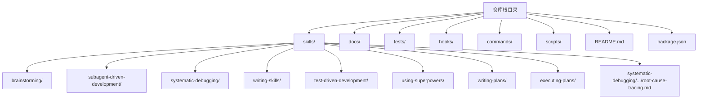
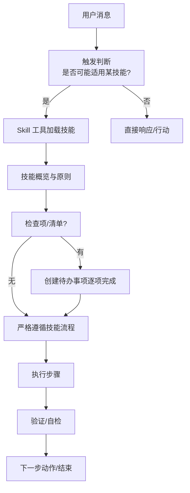
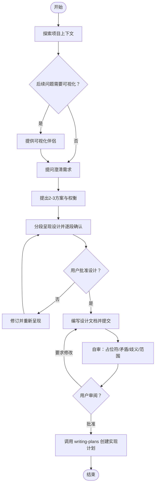
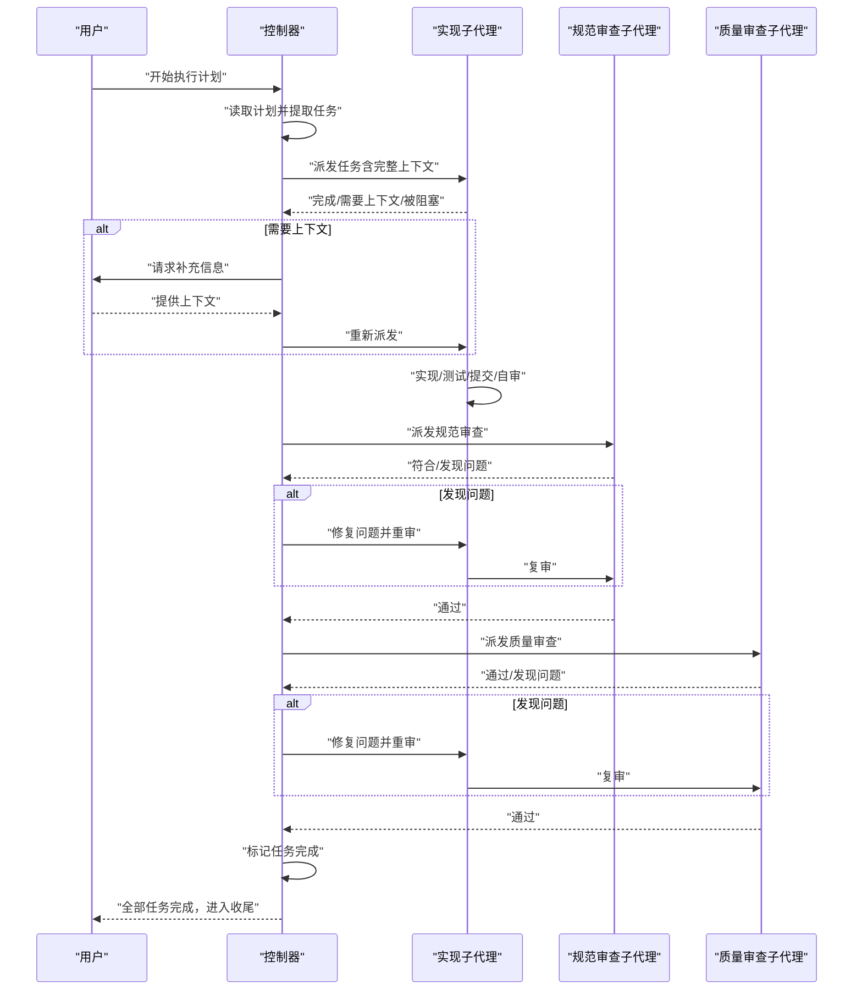
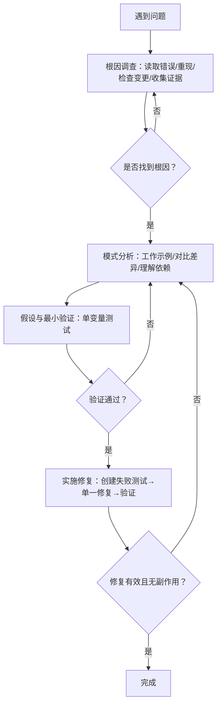
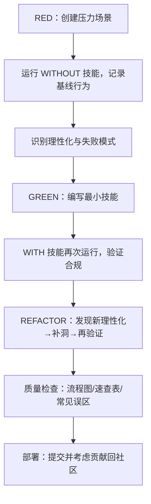
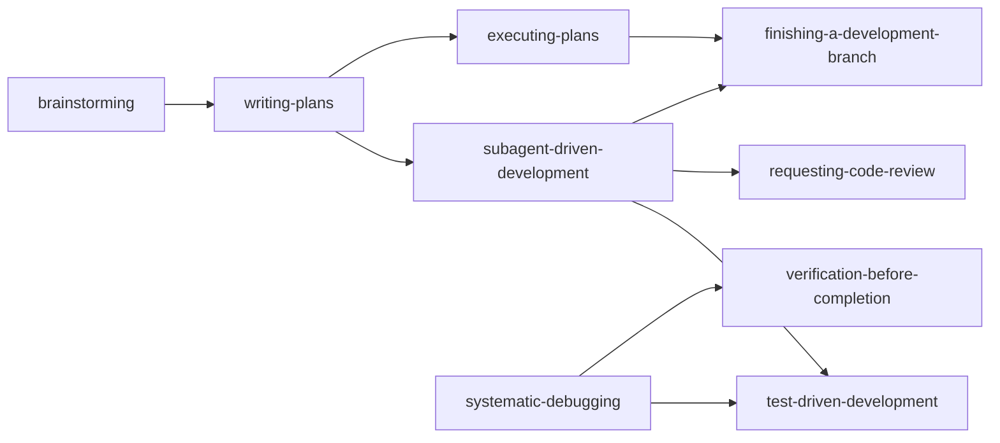

# 技能系统概述

<cite>
**本文档引用的文件**
- [README.md](file://README.md)
- [package.json](file://package.json)
- [CLAUDE.md](file://CLAUDE.md)
- [GEMINI.md](file://GEMINI.md)
- [skills/brainstorming/SKILL.md](file://skills/brainstorming/SKILL.md)
- [skills/subagent-driven-development/SKILL.md](file://skills/subagent-driven-development/SKILL.md)
- [skills/systematic-debugging/SKILL.md](file://skills/systematic-debugging/SKILL.md)
- [skills/writing-skills/SKILL.md](file://skills/writing-skills/SKILL.md)
- [skills/test-driven-development/SKILL.md](file://skills/test-driven-development/SKILL.md)
- [skills/using-superpowers/SKILL.md](file://skills/using-superpowers/SKILL.md)
- [skills/writing-plans/SKILL.md](file://skills/writing-plans/SKILL.md)
- [skills/executing-plans/SKILL.md](file://skills/executing-plans/SKILL.md)
- [skills/brainstorming/visual-companion.md](file://skills/brainstorming/visual-companion.md)
- [skills/brainstorming/scripts/helper.js](file://skills/brainstorming/scripts/helper.js)
- [skills/systematic-debugging/root-cause-tracing.md](file://skills/systematic-debugging/root-cause-tracing.md)
- [tests/skill-triggering/run-all.sh](file://tests/skill-triggering/run-all.sh)
</cite>

## 目录
1. [引言](#引言)
2. [项目结构](#项目结构)
3. [核心组件](#核心组件)
4. [架构总览](#架构总览)
5. [详细组件分析](#详细组件分析)
6. [依赖关系分析](#依赖关系分析)
7. [性能考量](#性能考量)
8. [故障排除指南](#故障排除指南)
9. [结论](#结论)
10. [附录](#附录)

## 引言
Superpowers 是一个面向代码代理的完整软件开发工作流，其核心是“可组合技能”（skills）。每个技能都是经过验证的方法论、模式或工具参考，帮助代理在不同阶段自动选择并执行正确的流程。该系统强调可发现性、可组合性和纪律性，通过严格的触发条件与执行流程确保代理在复杂任务中保持高质量输出。

本概述面向初学者与高级开发者：初学者可从“如何使用技能”和“基本工作流”入手；有经验的开发者可深入“技能设计原则”“触发机制”“生命周期管理”等架构细节。

## 项目结构
仓库采用“技能即文档”的扁平目录结构，所有技能位于 skills/ 目录下，每个技能以独立子目录存放其 SKILL.md 及配套工具/脚本。根目录包含平台适配文档（如 CLAUDE.md、GEMINI.md）、安装与更新说明、以及测试套件，用于验证技能触发与行为一致性。

图表来源
- [README.md:1-191](file://README.md#L1-L191)
- [package.json:1-7](file://package.json#L1-L7)

章节来源
- [README.md:1-191](file://README.md#L1-L191)
- [package.json:1-7](file://package.json#L1-L7)

## 核心组件
- 技能定义与触发
  - 每个技能以 SKILL.md 定义，包含 YAML frontmatter（name、description）与正文。description 严格限定为“何时使用”，不总结流程，确保代理基于症状与触发条件加载正确技能。
  - 触发机制：代理在收到用户消息后，先进行“是否可能适用某技能”的判断，若概率≥1%，则调用 Skill 工具加载对应技能内容，再按步骤执行。
- 技能类型与职责
  - 过程型技能：如 brainstorming、systematic-debugging，决定“如何思考/处理问题”。
  - 执行型技能：如 subagent-driven-development、executing-plans，指导“具体实现步骤”。
  - 元技能：如 writing-skills，定义技能创作与测试的 TDD 流程。
- 生命周期与状态
  - 设计期：brainstorming → spec 文档 → spec 自审 → 用户审阅 → writing-plans
  - 计划期：writing-plans → 生成任务清单 → 选择执行方式（subagent 或 inline）
  - 执行期：subagent-driven-development 或 executing-plans → 多轮审查 → 完成收尾
  - 调试期：systematic-debugging → 四阶段根因调查 → 假设验证 → 实施修复
- 可组合性与集成
  - 技能之间通过“必需子技能”和“引用”建立组合关系，形成端到端工作流。例如 subagent-driven-development 需要 writing-plans、using-git-worktrees 等前置技能。

章节来源
- [skills/using-superpowers/SKILL.md:1-118](file://skills/using-superpowers/SKILL.md#L1-L118)
- [skills/writing-skills/SKILL.md:1-656](file://skills/writing-skills/SKILL.md#L1-L656)
- [skills/brainstorming/SKILL.md:1-165](file://skills/brainstorming/SKILL.md#L1-L165)
- [skills/writing-plans/SKILL.md:1-153](file://skills/writing-plans/SKILL.md#L1-L153)
- [skills/subagent-driven-development/SKILL.md:1-278](file://skills/subagent-driven-development/SKILL.md#L1-L278)
- [skills/executing-plans/SKILL.md:1-71](file://skills/executing-plans/SKILL.md#L1-L71)
- [skills/systematic-debugging/SKILL.md:1-297](file://skills/systematic-debugging/SKILL.md#L1-L297)

## 架构总览
Superpowers 的技能系统围绕“触发-加载-执行-反馈”闭环构建。代理在会话开始时即建立“技能优先级”与“检查点”，确保在任何任务上都遵循既定流程。

图表来源
- [skills/using-superpowers/SKILL.md:42-76](file://skills/using-superpowers/SKILL.md#L42-L76)

章节来源
- [skills/using-superpowers/SKILL.md:18-76](file://skills/using-superpowers/SKILL.md#L18-L76)

## 详细组件分析

### 组件A：思维风暴（Brainstorming）
- 目标：在实现前将想法转化为可验证的设计规范，强制设计门禁（hard gate），禁止在设计未批准前进行任何实现。
- 关键流程：探索上下文 → 可视化问题？→ 提供视觉伴侶 → 提问澄清 → 提出2-3方案 → 分段呈现设计 → 用户批准 → 编写设计文档 → 自审 → 用户审阅 → 转入计划。
- 可视化伴侶：浏览器内交互式 mockup/对比图，按“是否需要可视化”逐题决策，避免不必要的资源消耗。
- 设计原则：YAGNI、增量验证、接口清晰、单元隔离。

图表来源
- [skills/brainstorming/SKILL.md:34-66](file://skills/brainstorming/SKILL.md#L34-L66)

章节来源
- [skills/brainstorming/SKILL.md:1-165](file://skills/brainstorming/SKILL.md#L1-L165)
- [skills/brainstorming/visual-companion.md:1-288](file://skills/brainstorming/visual-companion.md#L1-L288)
- [skills/brainstorming/scripts/helper.js:1-89](file://skills/brainstorming/scripts/helper.js#L1-L89)

### 组件B：子代理驱动开发（Subagent-Driven Development）
- 目标：在同一会话中以“每任务一个新子代理 + 两阶段审查”实现高质快速迭代。
- 决策流程：是否有实现计划？任务是否独立？是否留在当前会话？三者共同决定是否使用本技能。
- 执行循环：派发实现子代理 → 是否提问？→ 提供上下文 → 实现/测试/提交/自审 → 规范审查 → 代码质量审查 → 标记完成 → 循环直至全部任务。
- 模型选择：根据任务复杂度选择不同能力模型，降低成本并提升速度。
- 风险控制：明确 implementer 状态处理（DONE/DONE_WITH_CONCERNS/NEEDS_CONTEXT/BLOCKED）与“红灯”规则。

图表来源
- [skills/subagent-driven-development/SKILL.md:40-84](file://skills/subagent-driven-development/SKILL.md#L40-L84)

章节来源
- [skills/subagent-driven-development/SKILL.md:1-278](file://skills/subagent-driven-development/SKILL.md#L1-L278)

### 组件C：系统化调试（Systematic Debugging）
- 目标：在尝试任何修复前，必须完成根因调查，避免症状性修复。
- 四阶段流程：根因调查（读取错误、重现、检查变更、多层证据收集）→ 模式分析（寻找参照、对比差异、理解依赖）→ 假设与最小验证（单变量测试）→ 实施修复（创建失败测试、单一修复、验证）。
- 支持技术：根因追溯（向后追踪调用链）、纵深防御（多层校验）、基于条件的等待（替代任意超时）。
- 红灯信号：出现“快速修复”“多处同时修复”“跳过测试”等念头时立即停止并回到第一阶段。

图表来源
- [skills/systematic-debugging/SKILL.md:46-297](file://skills/systematic-debugging/SKILL.md#L46-L297)
- [skills/systematic-debugging/root-cause-tracing.md:1-170](file://skills/systematic-debugging/root-cause-tracing.md#L1-L170)

章节来源
- [skills/systematic-debugging/SKILL.md:1-297](file://skills/systematic-debugging/SKILL.md#L1-L297)
- [skills/systematic-debugging/root-cause-tracing.md:1-170](file://skills/systematic-debugging/root-cause-tracing.md#L1-L170)

### 组件D：元技能：编写技能（Writing Skills）
- 目标：将 TDD 应用于过程文档，以“压力场景（子代理）→ 失败基线 → 最小技能 → 重构漏洞”闭环创建与演进技能。
- 关键原则：描述字段仅限触发条件，不总结流程；CSO（Claude 搜索优化）；Token 效率；交叉引用而非强制加载；流程图仅用于非显而易见的决策点。
- 铁律：没有失败测试的技能不得部署。

图表来源
- [skills/writing-skills/SKILL.md:30-656](file://skills/writing-skills/SKILL.md#L30-L656)

章节来源
- [skills/writing-skills/SKILL.md:1-656](file://skills/writing-skills/SKILL.md#L1-L656)

### 组件E：测试驱动开发（TDD）
- 目标：在实现前编写失败测试，观察其失败，编写最小代码使其通过，再重构。
- 红绿重构循环：RED（编写失败测试并验证失败原因正确）→ GREEN（编写最小实现并通过测试）→ REFACTOR（清理重复、改进命名、抽取助手）。
- 常见理性化与红灯：测试后写、已有手动验证、删除数小时工作、精神而非仪式等，均属违规。

章节来源
- [skills/test-driven-development/SKILL.md:1-372](file://skills/test-driven-development/SKILL.md#L1-L372)

### 组件F：使用 Superpowers（基础接入）
- 目标：建立技能优先级与访问方式，确保在任何任务上都先检查技能，再采取行动。
- 优先级：用户指令 > Superpowers 技能 > 默认系统提示。
- 平台适配：不同平台使用不同的工具名称（如 Claude Code 的 Skill 工具），但语义一致。

章节来源
- [skills/using-superpowers/SKILL.md:1-118](file://skills/using-superpowers/SKILL.md#L1-L118)
- [GEMINI.md:1-3](file://GEMINI.md#L1-L3)

## 依赖关系分析
技能之间的依赖以“必需子技能”和“引用”形式体现，形成端到端工作流。例如：

图表来源
- [skills/brainstorming/SKILL.md:133-136](file://skills/brainstorming/SKILL.md#L133-L136)
- [skills/writing-plans/SKILL.md:134-153](file://skills/writing-plans/SKILL.md#L134-L153)
- [skills/subagent-driven-development/SKILL.md:265-278](file://skills/subagent-driven-development/SKILL.md#L265-L278)
- [skills/executing-plans/SKILL.md:65-71](file://skills/executing-plans/SKILL.md#L65-L71)
- [skills/systematic-debugging/SKILL.md:286-289](file://skills/systematic-debugging/SKILL.md#L286-L289)

章节来源
- [skills/brainstorming/SKILL.md:133-136](file://skills/brainstorming/SKILL.md#L133-L136)
- [skills/writing-plans/SKILL.md:134-153](file://skills/writing-plans/SKILL.md#L134-L153)
- [skills/subagent-driven-development/SKILL.md:265-278](file://skills/subagent-driven-development/SKILL.md#L265-L278)
- [skills/executing-plans/SKILL.md:65-71](file://skills/executing-plans/SKILL.md#L65-L71)
- [skills/systematic-debugging/SKILL.md:286-289](file://skills/systematic-debugging/SKILL.md#L286-L289)

## 性能考量
- 成本优化
  - 子代理驱动开发：每任务一次全新上下文，减少上下文污染与返工成本；两阶段审查在早期捕获问题，避免后期调试成本。
  - 模型选择：根据任务复杂度选择合适能力模型，机械实现用低成本模型，集成与判断用标准模型，架构与评审用最强大模型。
- 资源利用
  - 视觉伴侶仅在必要时启用，避免不必要的网络与渲染开销。
  - 测试先行减少回归风险，缩短修复周期。
- 可扩展性
  - 技能扁平命名空间，易于搜索与组合；通过“必需子技能”与“引用”实现模块化复用。

## 故障排除指南
- 触发失败
  - 症状：代理未加载技能或加载了错误技能。
  - 排查：检查 description 字段是否仅包含触发条件；确认用户输入是否包含足够触发信号；使用测试套件验证触发逻辑。
  - 参考：[tests/skill-triggering/run-all.sh:10-17](file://tests/skill-triggering/run-all.sh#L10-L17)
- 执行偏差
  - 症状：代理偏离技能流程或跳过检查点。
  - 排查：核对技能中的“红灯”清单与“停止”信号；确保在压力场景下仍能坚持纪律性流程。
  - 参考：[skills/test-driven-development/SKILL.md:272-288](file://skills/test-driven-development/SKILL.md#L272-L288)、[skills/systematic-debugging/SKILL.md:215-232](file://skills/systematic-debugging/SKILL.md#L215-L232)
- 平台差异
  - 症状：工具名称不一致导致无法加载技能。
  - 排查：对照平台适配文档，确认工具映射；在 Gemini 中检查引用路径。
  - 参考：[GEMINI.md:1-3](file://GEMINI.md#L1-L3)、[skills/using-superpowers/SKILL.md:38-41](file://skills/using-superpowers/SKILL.md#L38-L41)

章节来源
- [tests/skill-triggering/run-all.sh:10-17](file://tests/skill-triggering/run-all.sh#L10-L17)
- [skills/test-driven-development/SKILL.md:272-288](file://skills/test-driven-development/SKILL.md#L272-L288)
- [skills/systematic-debugging/SKILL.md:215-232](file://skills/systematic-debugging/SKILL.md#L215-L232)
- [GEMINI.md:1-3](file://GEMINI.md#L1-L3)
- [skills/using-superpowers/SKILL.md:38-41](file://skills/using-superpowers/SKILL.md#L38-L41)

## 结论
Superpowers 技能系统通过“可发现的触发条件 + 可组合的工作流 + 纪律性的执行流程”，实现了从设计到实现再到调试的全栈自动化。对于初学者，建议从 using-superpowers 与 brainstorming 开始，理解“先设计后实现”的原则；对于高级开发者，应关注 writing-skills 的 TDD 化技能工程方法、subagent-driven-development 的执行效率与质量保障，以及 systematic-debugging 的系统化问题解决范式。

## 附录
- 平台安装与验证
  - 不同平台的安装与验证方式参见根目录 README 与各平台文档。
  - 参考：[README.md:27-106](file://README.md#L27-L106)
- 贡献指南
  - 贡献前需阅读 CLAUDE.md，了解严格的质量门槛与评估流程。
  - 参考：[CLAUDE.md:1-86](file://CLAUDE.md#L1-L86)