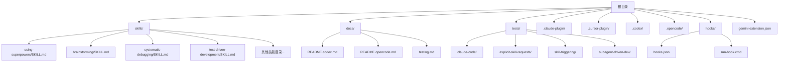
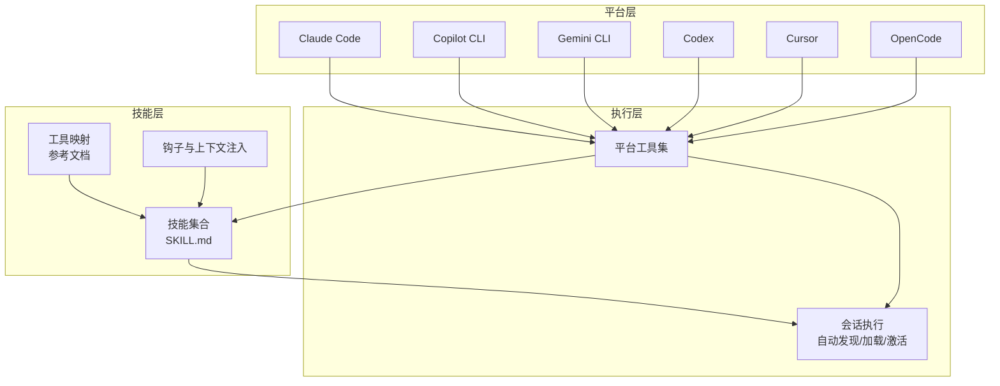
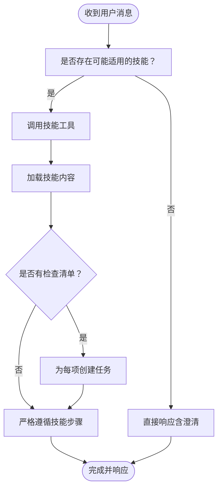
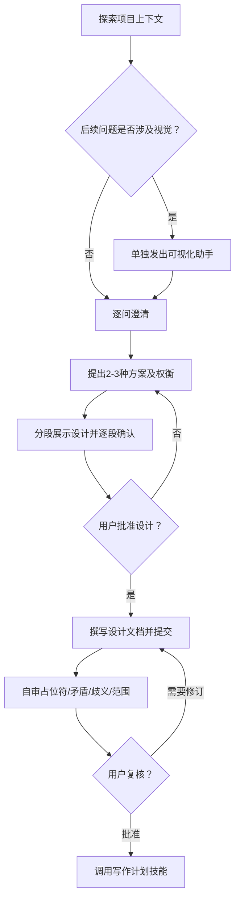
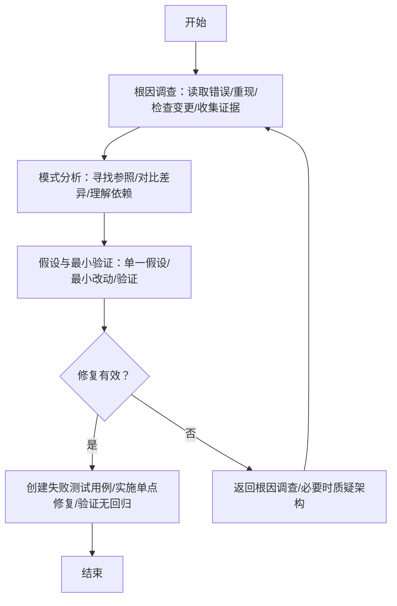
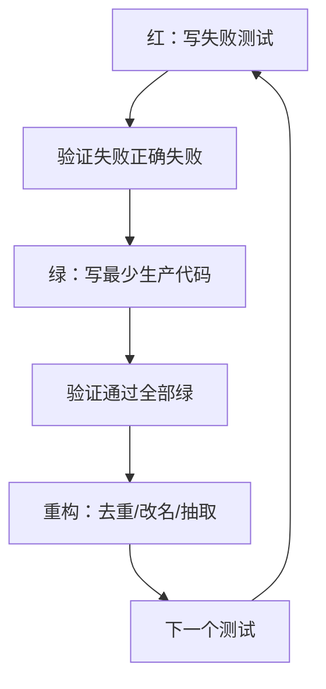
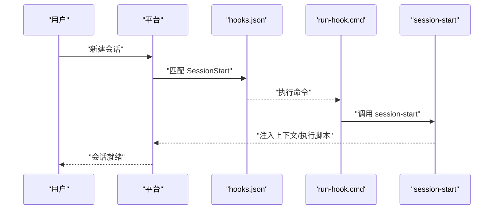
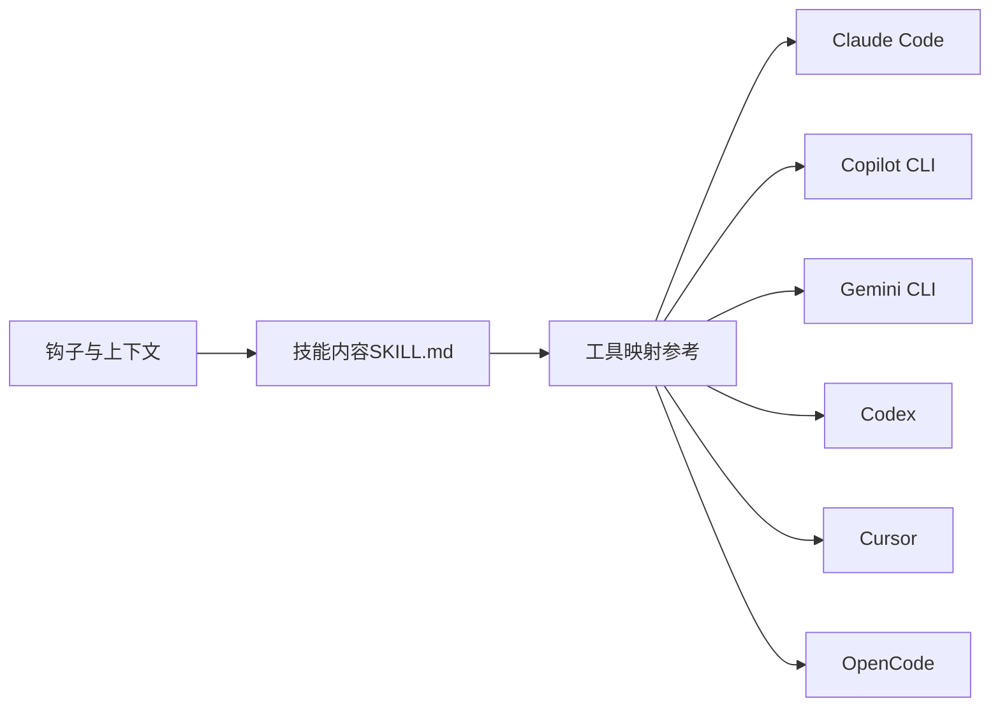

# 技能集成

<cite>
**本文引用的文件**   
- [README.md](file://README.md)
- [CLAUDE.md](file://CLAUDE.md)
- [GEMINI.md](file://GEMINI.md)
- [gemini-extension.json](file://gemini-extension.json)
- [hooks.json](file://hooks/hooks.json)
- [run-hook.cmd](file://hooks/run-hook.cmd)
- [using-superpowers/SKILL.md](file://skills/using-superpowers/SKILL.md)
- [using-superpowers/references/copilot-tools.md](file://skills/using-superpowers/references/copilot-tools.md)
- [using-superpowers/references/codex-tools.md](file://skills/using-superpowers/references/codex-tools.md)
- [using-superpowers/references/gemini-tools.md](file://skills/using-superpowers/references/gemini-tools.md)
- [brainstorming/SKILL.md](file://skills/brainstorming/SKILL.md)
- [systematic-debugging/SKILL.md](file://skills/systematic-debugging/SKILL.md)
- [test-driven-development/SKILL.md](file://skills/test-driven-development/SKILL.md)
- [docs/testing.md](file://docs/testing.md)
- [docs/README.codex.md](file://docs/README.codex.md)
- [docs/README.opencode.md](file://docs/README.opencode.md)
- [tests/claude-code/test-helpers.sh](file://tests/claude-code/test-helpers.sh)
</cite>

## 目录
1. [简介](#简介)
2. [项目结构](#项目结构)
3. [核心组件](#核心组件)
4. [架构总览](#架构总览)
5. [详细组件分析](#详细组件分析)
6. [依赖关系分析](#依赖关系分析)
7. [性能考量](#性能考量)
8. [故障排查指南](#故障排查指南)
9. [结论](#结论)
10. [附录](#附录)

## 简介
本指南面向平台开发者与集成工程师，系统阐述 Superpowers 技能在多平台（Claude Code、Cursor、Copilot、Codex、Gemini）的集成机制，覆盖工具映射、API 适配、平台特定配置、技能自动发现与加载、激活流程、跨平台兼容策略与最佳实践，并提供平台适配器开发与集成测试方法，以及部署与维护建议。

Superpowers 是一套可组合的“技能”工作流，围绕“先设计、再计划、后执行”的闭环构建，强调自动化触发、严格顺序与可验证的中间产物。其核心通过“使用 Superpowers 技能”建立统一的工具调用入口与优先级规则，确保在各平台上以一致的方式加载与执行技能。

章节来源
- [README.md:1-191](file://README.md#L1-L191)

## 项目结构
仓库采用按功能域分层的组织方式：根目录包含平台安装与市场说明、技能目录、钩子脚本、测试套件与文档。技能目录下每个技能以独立的 SKILL.md 描述其目标、流程与约束；平台适配通过参考文档定义工具映射；测试文档与测试脚本用于验证复杂技能在真实会话中的行为。

图示来源
- [README.md:1-191](file://README.md#L1-L191)
- [docs/README.codex.md:1-127](file://docs/README.codex.md#L1-L127)
- [docs/README.opencode.md:1-131](file://docs/README.opencode.md#L1-L131)
- [gemini-extension.json:1-7](file://gemini-extension.json#L1-L7)

章节来源
- [README.md:1-191](file://README.md#L1-L191)
- [docs/README.codex.md:1-127](file://docs/README.codex.md#L1-L127)
- [docs/README.opencode.md:1-131](file://docs/README.opencode.md#L1-L131)

## 核心组件
- 使用 Superpowers 技能（入口与优先级）
  - 统一的工具调用入口：Claude Code 的 Skill 工具、Copilot CLI 的 skill 工具、Gemini CLI 的 activate_skill 工具等。
  - 指令优先级：用户显式指令 > Superpowers 技能 > 默认系统提示。
  - 自动发现与加载：平台通过各自的技能发现机制加载 SKILL.md 并在会话中按需激活。
- 技能清单与类型
  - 测试：test-driven-development
  - 调试：systematic-debugging
  - 协作与规划：brainstorming、writing-plans、executing-plans、dispatching-parallel-agents、requesting-code-review、receiving-code-review、using-git-worktrees、finishing-a-development-branch、subagent-driven-development
  - 元技能：writing-skills、using-superpowers
- 平台适配与工具映射
  - Claude Code：原生工具名即为标准。
  - Copilot CLI：Read/Edit/Write/Bash/Grep/Glob/Skill/WebFetch/TodoWrite 等映射到 view/create/edit/bash/grep/glob/skill/web_fetch/sql 等。
  - Codex：Task 映射为 spawn_agent，TodoWrite 映射为 update_plan，支持多智能体需开启 multi_agent。
  - Gemini CLI：Skill 映射为 activate_skill，Task 不支持，部分工具如 read_file/write_file/replace/run_shell_command/grep_search/glob 等可用。
  - Cursor：与 Claude Code 类似，通过 Skill 工具加载技能。
- 钩子与上下文注入
  - 通过 hooks.json 与 run-hook.cmd 在会话开始时注入上下文或执行脚本，增强平台兼容性。

章节来源
- [using-superpowers/SKILL.md:1-118](file://skills/using-superpowers/SKILL.md#L1-L118)
- [using-superpowers/references/copilot-tools.md:1-53](file://skills/using-superpowers/references/copilot-tools.md#L1-L53)
- [using-superpowers/references/codex-tools.md:1-101](file://skills/using-superpowers/references/codex-tools.md#L1-L101)
- [using-superpowers/references/gemini-tools.md:1-34](file://skills/using-superpowers/references/gemini-tools.md#L1-L34)
- [hooks.json:1-17](file://hooks/hooks.json#L1-L17)
- [run-hook.cmd:1-47](file://hooks/run-hook.cmd#L1-L47)

## 架构总览
Superpowers 的平台集成由“技能描述（SKILL.md）+ 平台工具映射 + 发现与加载机制 + 会话执行”构成。平台通过各自的插件/扩展机制注册技能，会话中根据任务匹配与用户指令决定是否调用技能工具，从而加载对应技能内容并执行。

图示来源
- [using-superpowers/SKILL.md:1-118](file://skills/using-superpowers/SKILL.md#L1-L118)
- [using-superpowers/references/copilot-tools.md:1-53](file://skills/using-superpowers/references/copilot-tools.md#L1-L53)
- [using-superpowers/references/codex-tools.md:1-101](file://skills/using-superpowers/references/codex-tools.md#L1-L101)
- [using-superpowers/references/gemini-tools.md:1-34](file://skills/using-superpowers/references/gemini-tools.md#L1-L34)
- [hooks.json:1-17](file://hooks/hooks.json#L1-L17)
- [run-hook.cmd:1-47](file://hooks/run-hook.cmd#L1-L47)

## 详细组件分析

### 使用 Superpowers 技能（统一入口与优先级）
- 工具调用入口
  - Claude Code：Skill 工具
  - Copilot CLI：skill 工具
  - Gemini CLI：activate_skill 工具
- 指令优先级
  - 用户显式指令 > Superpowers 技能 > 默认系统提示
- 自动发现与加载
  - 平台各自解析 SKILL.md 前言字段与内容，在会话中按需激活
- 触发流程
  - 收到用户消息 → 判断是否可能有适用技能 → 调用技能工具 → 加载技能内容 → 执行 → 可选创建任务清单（TodoWrite）

图示来源
- [using-superpowers/SKILL.md:48-76](file://skills/using-superpowers/SKILL.md#L48-L76)

章节来源
- [using-superpowers/SKILL.md:18-118](file://skills/using-superpowers/SKILL.md#L18-L118)

### 技能：头脑风暴（Brainstorming）
- 目标：在任何创意工作前进行需求与设计探索，产出经评审的设计文档后再进入实现阶段。
- 关键约束：必须先呈现设计并获得批准，方可进入实现或生成计划。
- 流程要点：探索项目上下文、可视化辅助、逐问澄清、提出方案、分段展示设计、自审与用户复核、最终转入写作计划。

图示来源
- [brainstorming/SKILL.md:34-64](file://skills/brainstorming/SKILL.md#L34-L64)

章节来源
- [brainstorming/SKILL.md:1-165](file://skills/brainstorming/SKILL.md#L1-L165)

### 技能：系统化调试（Systematic Debugging）
- 目标：在修复任何缺陷或异常行为前，先完成根因调查，避免症状性修复。
- 四阶段流程：根因调查 → 模式分析 → 假设与最小验证 → 实施修复与验证。
- 强制规则：未完成第一阶段不得提出修复；失败多次应质疑架构而非继续修补。

图示来源
- [systematic-debugging/SKILL.md:46-297](file://skills/systematic-debugging/SKILL.md#L46-L297)

章节来源
- [systematic-debugging/SKILL.md:1-297](file://skills/systematic-debugging/SKILL.md#L1-L297)

### 技能：测试驱动开发（TDD）
- 目标：在实现任何功能或修复前，先编写失败测试，再写最少代码使其通过，最后重构。
- 循环：红（写失败测试）→ 绿（写最少代码）→ 红绿（验证通过）→ 回归（清理与提取）→ 下一个。
- 强制规则：严禁在测试前写生产代码；测试通过即刻删除相关探索代码。

图示来源
- [test-driven-development/SKILL.md:47-70](file://skills/test-driven-development/SKILL.md#L47-L70)

章节来源
- [test-driven-development/SKILL.md:1-372](file://skills/test-driven-development/SKILL.md#L1-L372)

### 平台适配与工具映射

#### Claude Code 与 Cursor
- 工具名称即标准，无需额外映射。
- 通过 Skill 工具加载技能，其余文件操作、搜索、子代理调度等工具按原名使用。

章节来源
- [using-superpowers/SKILL.md:30-36](file://skills/using-superpowers/SKILL.md#L30-L36)

#### Copilot CLI
- 工具映射概览
  - Read → view
  - Write → create
  - Edit → edit
  - Bash → bash
  - Grep → grep
  - Glob → glob
  - Skill → skill
  - WebFetch → web_fetch
  - Task → task（支持并行）
  - TodoWrite → sql（内置 todos 表）
- 子代理类型映射：general-purpose/explore/命名插件代理等
- 异步 Shell 会话：bash（async=true）、write_bash、read_bash、stop_bash、list_bash

章节来源
- [using-superpowers/references/copilot-tools.md:1-53](file://skills/using-superpowers/references/copilot-tools.md#L1-L53)

#### Codex
- 工具映射概览
  - Task → spawn_agent（并行多个）
  - Task 返回 → wait
  - 任务完成后释放 → close_agent
  - TodoWrite → update_plan
  - Skill → 原生加载（遵循技能内容）
  - 文件/命令工具 → 使用原生工具
- 多智能体支持：需在配置中启用 multi_agent = true
- 命名子代理补偿：通过读取 agents/ 或技能内模板填充 message 后以 worker 角色派发
- 环境检测：使用只读 git 命令判断工作树/分离头状态，指导分支/推送/PR 策略

章节来源
- [using-superpowers/references/codex-tools.md:1-101](file://skills/using-superpowers/references/codex-tools.md#L1-L101)

#### Gemini CLI
- 工具映射概览
  - Read → read_file
  - Write → write_file
  - Edit → replace
  - Bash → run_shell_command
  - Grep → grep_search
  - Glob → glob
  - TodoWrite → write_todos
  - Skill → activate_skill
  - WebSearch → google_web_search
  - WebFetch → web_fetch
  - Task → 不支持（无子代理）
- 兼容策略：当技能依赖 Task 时，回退为单会话执行（executing-plans）

章节来源
- [using-superpowers/references/gemini-tools.md:1-34](file://skills/using-superpowers/references/gemini-tools.md#L1-L34)

#### OpenCode
- 安装与更新：通过插件数组声明，启动时自动安装并通过 config 钩子注册技能目录
- 工具映射：Skill → skill；Task → @提及系统；TodoWrite → todowrite；文件操作 → 原生工具
- 优先级：项目技能 > 个人技能 > Superpowers 技能

章节来源
- [docs/README.opencode.md:1-131](file://docs/README.opencode.md#L1-L131)

#### Codex（原生技能发现）
- 通过符号链接将 skills 目录暴露给 Codex，启动时扫描 SKILL.md 前言字段自动激活
- 子代理技能需启用 multi_agent

章节来源
- [docs/README.codex.md:50-58](file://docs/README.codex.md#L50-L58)

### 钩子与上下文注入
- hooks.json 定义会话开始事件（SessionStart），触发本地脚本
- run-hook.cmd 提供跨平台包装：Windows 上优先查找 Git for Windows 的 bash，否则回退；Unix 直接执行脚本
- 作用：在会话早期注入上下文或执行前置逻辑，提升平台一致性

图示来源
- [hooks.json:1-17](file://hooks/hooks.json#L1-L17)
- [run-hook.cmd:1-47](file://hooks/run-hook.cmd#L1-L47)

章节来源
- [hooks.json:1-17](file://hooks/hooks.json#L1-L17)
- [run-hook.cmd:1-47](file://hooks/run-hook.cmd#L1-L47)

### Gemini 扩展元数据
- gemini-extension.json 提供扩展名称、描述、版本与上下文文件（GEMINI.md），用于加载平台特定的工具映射与上下文

章节来源
- [gemini-extension.json:1-7](file://gemini-extension.json#L1-L7)
- [GEMINI.md:1-3](file://GEMINI.md#L1-L3)

## 依赖关系分析
- 技能依赖
  - 使用 Superpowers 技能作为统一入口，所有平台均通过相应工具调用加载 SKILL.md 内容
  - 子代理相关技能（如并行派发、子代理驱动开发）在不支持 Task 的平台（如 Gemini CLI）回退为单会话执行
- 平台依赖
  - Copilot CLI：Task 工具与异步 Shell 会话能力
  - Codex：多智能体开关 multi_agent 与 spawn_agent 系列工具
  - Cursor/Claude Code：原生 Skill 工具
  - OpenCode：插件系统与 @提及机制
- 文档与工具映射
  - 各平台工具映射参考文件定义了等价工具与替代方案，确保技能在不同平台的行为一致性

图示来源
- [using-superpowers/SKILL.md:1-118](file://skills/using-superpowers/SKILL.md#L1-L118)
- [using-superpowers/references/copilot-tools.md:1-53](file://skills/using-superpowers/references/copilot-tools.md#L1-L53)
- [using-superpowers/references/codex-tools.md:1-101](file://skills/using-superpowers/references/codex-tools.md#L1-L101)
- [using-superpowers/references/gemini-tools.md:1-34](file://skills/using-superpowers/references/gemini-tools.md#L1-L34)
- [hooks.json:1-17](file://hooks/hooks.json#L1-L17)

章节来源
- [using-superpowers/SKILL.md:1-118](file://skills/using-superpowers/SKILL.md#L1-L118)
- [using-superpowers/references/copilot-tools.md:1-53](file://skills/using-superpowers/references/copilot-tools.md#L1-L53)
- [using-superpowers/references/codex-tools.md:1-101](file://skills/using-superpowers/references/codex-tools.md#L1-L101)
- [using-superpowers/references/gemini-tools.md:1-34](file://skills/using-superpowers/references/gemini-tools.md#L1-L34)
- [hooks.json:1-17](file://hooks/hooks.json#L1-L17)

## 性能考量
- Token 成本与缓存
  - 主会话通常承担更多上下文，输入 token 较高；子代理成本相对均衡且稳定
  - 高缓存命中（cache_read_input_tokens）有助于降低整体成本
- 会话时长
  - 复杂技能（如子代理驱动开发）的端到端时长较长，建议在测试与生产中合理设置超时
- 资源占用
  - 多智能体场景（Codex）需启用多智能体支持，注意资源分配与并发控制

章节来源
- [docs/testing.md:100-177](file://docs/testing.md#L100-L177)

## 故障排查指南
- 技能未加载（Claude Code）
  - 确保从插件目录运行测试（技能仅在该目录加载）
  - 检查本地开发市场开关与 enabledPlugins 配置
  - 确认技能文件存在且前言字段完整
- 权限问题
  - 使用 bypassPermissions 与 --add-dir 授予临时目录访问权限
- 会话文件缺失
  - 按项目路径编码定位 ~/.claude/projects/ 下的 .jsonl 文件，使用工具分析 token 使用情况
- Codex 多智能体未生效
  - 检查配置中 multi_agent = true 是否启用
- Gemini 无 Task 工具
  - 对依赖 Task 的技能进行回退（executing-plans），或在支持 Task 的平台执行

章节来源
- [docs/testing.md:178-215](file://docs/testing.md#L178-L215)
- [using-superpowers/references/codex-tools.md:16-26](file://skills/using-superpowers/references/codex-tools.md#L16-L26)
- [using-superpowers/references/gemini-tools.md:19-22](file://skills/using-superpowers/references/gemini-tools.md#L19-L22)

## 结论
Superpowers 通过统一的“使用 Superpowers 技能”入口与严格的指令优先级，结合平台特定的工具映射与发现机制，实现了跨平台的一致体验。对于不支持子代理的平台（如 Gemini CLI），系统提供回退策略；对于需要多智能体的平台（如 Codex），通过配置开关与补偿手段保障能力。配合完善的测试与日志分析工具，开发者可以高效地验证与优化技能在各平台的行为。

## 附录

### 平台适配器开发指南
- 设计原则
  - 保持工具语义一致：将平台工具映射到技能期望的语义（如 Task → spawn_agent）
  - 优先使用原生能力：尽量利用平台提供的工具链，减少额外封装
  - 回退策略：对不支持的功能提供明确的降级路径（如 Gemini 的 Task 回退）
- 开发步骤
  1. 分析技能使用的工具与流程（SKILL.md）
  2. 查阅平台工具映射参考，确定等价工具
  3. 在平台插件/扩展中注册工具映射与发现逻辑
  4. 编写集成测试，验证会话行为与 token 使用
  5. 提供文档与示例，便于用户理解与迁移

章节来源
- [using-superpowers/SKILL.md:1-118](file://skills/using-superpowers/SKILL.md#L1-L118)
- [using-superpowers/references/copilot-tools.md:1-53](file://skills/using-superpowers/references/copilot-tools.md#L1-L53)
- [using-superpowers/references/codex-tools.md:1-101](file://skills/using-superpowers/references/codex-tools.md#L1-L101)
- [using-superpowers/references/gemini-tools.md:1-34](file://skills/using-superpowers/references/gemini-tools.md#L1-L34)

### 集成测试方法
- 测试框架
  - 使用 Claude Code 的 headless 会话运行技能，解析 .jsonl 会话文件验证行为
  - 使用测试辅助脚本（run_claude、断言函数、计划文件生成）构造真实场景
- 关键验证点
  - 技能工具被调用
  - 子代理被派发（Task 工具）
  - 任务跟踪（TodoWrite/sql）
  - 实现文件创建与测试通过
  - Git 提交历史符合预期
- 成本分析
  - 使用 token 分析工具统计主会话与子代理的输入/输出/缓存使用与估算成本

章节来源
- [docs/testing.md:19-304](file://docs/testing.md#L19-L304)
- [tests/claude-code/test-helpers.sh:1-203](file://tests/claude-code/test-helpers.sh#L1-L203)

### 平台安装与部署要点
- Claude Code/Cursor
  - 通过官方/第三方市场安装插件，随后使用 Skill 工具加载技能
- Copilot CLI
  - 使用 skill 工具加载技能；子代理场景使用 task 工具
- Codex
  - 原生技能发现：创建符号链接至 skills 目录；启用 multi_agent 以支持并行子代理
- Gemini CLI
  - 使用 activate_skill 工具加载技能；Task 不可用时回退执行
- OpenCode
  - 在 opencode.json 中添加插件条目，重启后自动安装并注册技能目录

章节来源
- [README.md:27-106](file://README.md#L27-L106)
- [docs/README.codex.md:13-58](file://docs/README.codex.md#L13-L58)
- [docs/README.opencode.md:5-97](file://docs/README.opencode.md#L5-L97)