# 故障排除

<cite>
**本文引用的文件**
- [README.md](file://README.md)
- [package.json](file://package.json)
- [hooks.json](file://hooks/hooks.json)
- [run-hook.cmd](file://hooks/run-hook.cmd)
- [SKILL.md（系统化调试）](file://skills/systematic-debugging/SKILL.md)
- [root-cause-tracing.md（根因追溯）](file://skills/systematic-debugging/root-cause-tracing.md)
- [defense-in-depth.md（纵深防御）](file://skills/systematic-debugging/defense-in-depth.md)
- [condition-based-waiting.md（基于条件的等待）](file://skills/systematic-debugging/condition-based-waiting.md)
- [find-polluter.sh（污染源定位脚本）](file://skills/systematic-debugging/find-polluter.sh)
- [SKILL.md（验证在完成前）](file://skills/verification-before-completion/SKILL.md)
- [SKILL.md（测试驱动开发）](file://skills/test-driven-development/SKILL.md)
- [testing.md（测试 Superpowers 技能）](file://docs/testing.md)
</cite>

## 目录
1. [简介](#简介)
2. [项目结构](#项目结构)
3. [核心组件](#核心组件)
4. [架构总览](#架构总览)
5. [详细组件分析](#详细组件分析)
6. [依赖关系分析](#依赖关系分析)
7. [性能考虑](#性能考虑)
8. [故障排除指南](#故障排除指南)
9. [结论](#结论)
10. [附录](#附录)

## 简介
本指南面向使用 Superpowers 的用户与维护者，提供系统化的故障排除方法与调试工具使用说明。内容覆盖安装与配置、技能触发与执行、测试与会话分析、性能与成本优化、以及常见问题的诊断与修复路径。所有建议均以仓库内现有技能文档与测试文档为依据，确保可操作性与可验证性。

## 项目结构
Superpowers 采用“技能”（skills）作为核心工作单元，围绕技能的加载、触发与执行构建完整的开发工作流。关键目录与文件如下：
- 根目录包含安装与更新指引、平台兼容性说明与社区入口
- skills 目录包含多个可组合的技能，如系统化调试、验证在完成前、测试驱动开发等
- hooks 目录提供会话生命周期钩子（如 SessionStart）
- docs 目录包含测试与会话分析文档
- package.json 描述插件元数据与入口

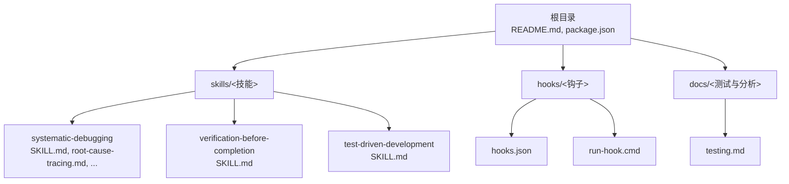

图表来源
- [README.md:1-191](file://README.md#L1-L191)
- [package.json:1-7](file://package.json#L1-L7)
- [hooks.json:1-17](file://hooks/hooks.json#L1-L17)
- [run-hook.cmd:1-47](file://hooks/run-hook.cmd#L1-L47)
- [SKILL.md（系统化调试）:1-297](file://skills/systematic-debugging/SKILL.md#L1-L297)
- [SKILL.md（验证在完成前）:1-140](file://skills/verification-before-completion/SKILL.md#L1-L140)
- [SKILL.md（测试驱动开发）:1-372](file://skills/test-driven-development/SKILL.md#L1-L372)
- [testing.md:1-304](file://docs/testing.md#L1-L304)

章节来源
- [README.md:27-107](file://README.md#L27-L107)
- [package.json:1-7](file://package.json#L1-L7)

## 核心组件
- 系统化调试（systematic-debugging）：提供四阶段根因调查与修复流程，强调先溯源再修复、最小化验证与多层防御
- 验证在完成前（verification-before-completion）：在宣称完成或提交前强制执行一次性完整验证，杜绝主观断言
- 测试驱动开发（test-driven-development）：以“红-绿-重构”为核心，要求先写失败测试，再实现代码，最后清理与回归
- 调试支撑技术：根因追溯、条件等待、污染源定位脚本
- 会话与测试分析：通过 Claude Code 会话转录文件解析与令牌用量分析进行端到端验证

章节来源
- [SKILL.md（系统化调试）:46-297](file://skills/systematic-debugging/SKILL.md#L46-L297)
- [SKILL.md（验证在完成前）:24-140](file://skills/verification-before-completion/SKILL.md#L24-L140)
- [SKILL.md（测试驱动开发）:47-372](file://skills/test-driven-development/SKILL.md#L47-L372)
- [testing.md:178-304](file://docs/testing.md#L178-L304)

## 架构总览
Superpowers 的运行链路由“平台插件 → 技能系统 → 子代理/工具调用 → 会话转录 → 分析与验证”构成。下图展示典型交互：

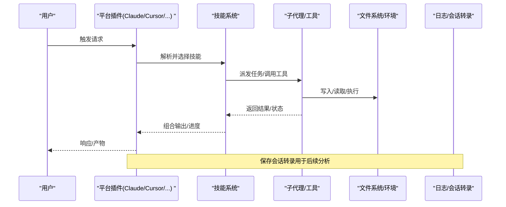

图表来源
- [README.md:108-125](file://README.md#L108-L125)
- [testing.md:26-32](file://docs/testing.md#L26-L32)

## 详细组件分析

### 系统化调试（systematic-debugging）
该技能定义了“先溯源、后修复”的铁律，包含四个阶段：
- 阶段1：根因调查（阅读错误、复现、检查变更、多组件证据采集）
- 阶段2：模式分析（寻找已知正确示例、对比差异、理解依赖）
- 阶段3：假设与最小验证（单变量测试、验证后再继续）
- 阶段4：实施与架构审视（创建可重现测试、单一修复、验证、必要时质疑架构）

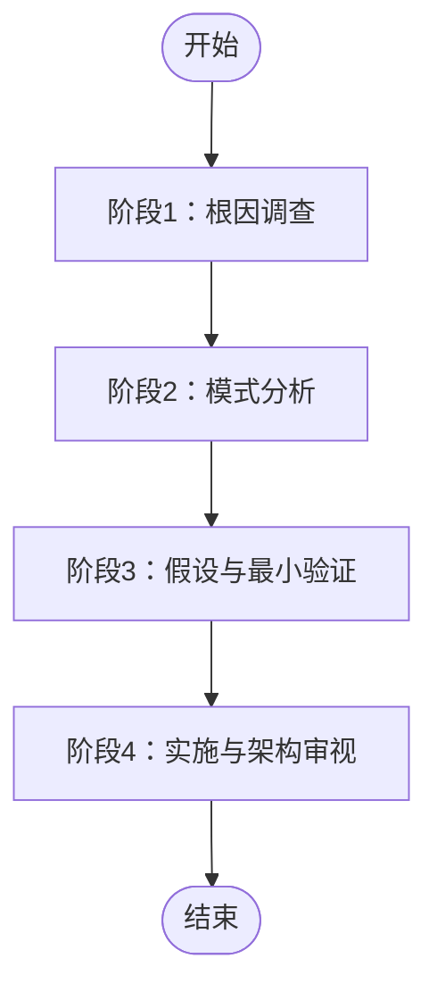

图表来源
- [SKILL.md（系统化调试）:46-214](file://skills/systematic-debugging/SKILL.md#L46-L214)

章节来源
- [SKILL.md（系统化调试）:24-45](file://skills/systematic-debugging/SKILL.md#L24-L45)
- [SKILL.md（系统化调试）:122-170](file://skills/systematic-debugging/SKILL.md#L122-L170)
- [SKILL.md（系统化调试）:170-214](file://skills/systematic-debugging/SKILL.md#L170-L214)

#### 根因追溯（root-cause-tracing）
当错误出现在深层调用栈中时，应回溯调用链，找到最初触发点，并在源头修复，同时配合“纵深防御”。

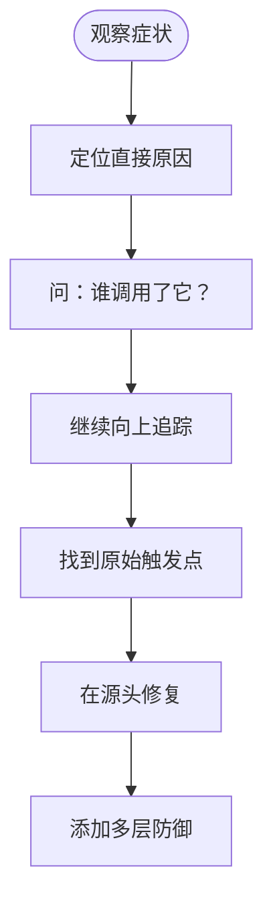

图表来源
- [root-cause-tracing.md:32-154](file://skills/systematic-debugging/root-cause-tracing.md#L32-L154)

章节来源
- [root-cause-tracing.md:1-170](file://skills/systematic-debugging/root-cause-tracing.md#L1-L170)

#### 纵深防御（defense-in-depth）
在输入层、业务逻辑层、环境守卫层与调试日志层分别增加校验，使缺陷结构上不可重现。

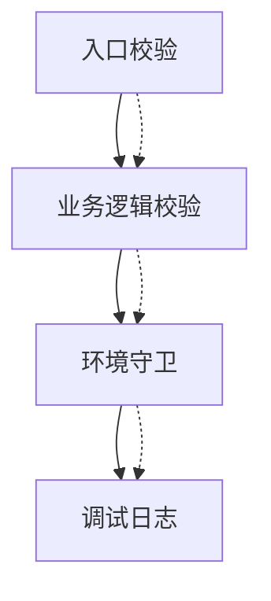

图表来源
- [defense-in-depth.md:20-123](file://skills/systematic-debugging/defense-in-depth.md#L20-L123)

章节来源
- [defense-in-depth.md:1-123](file://skills/systematic-debugging/defense-in-depth.md#L1-L123)

#### 基于条件的等待（condition-based-waiting）
替代任意超时，等待实际条件满足，避免竞态与不稳定。

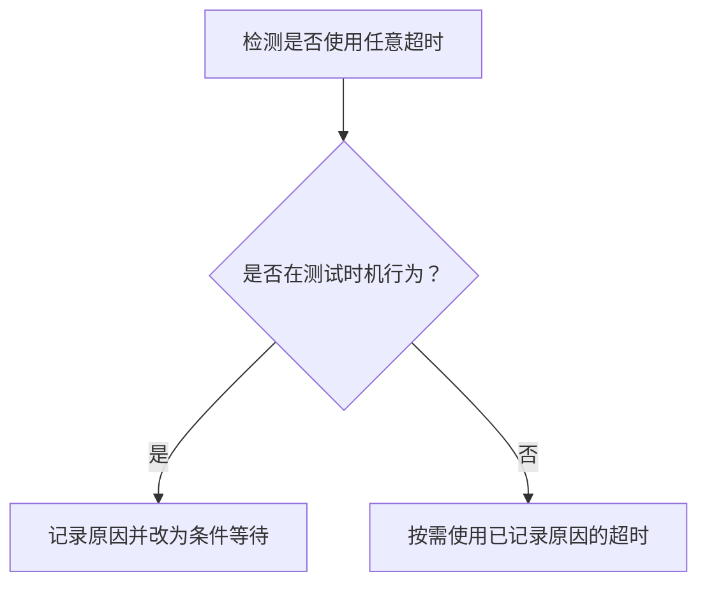

图表来源
- [condition-based-waiting.md:9-33](file://skills/systematic-debugging/condition-based-waiting.md#L9-L33)

章节来源
- [condition-based-waiting.md:1-116](file://skills/systematic-debugging/condition-based-waiting.md#L1-L116)

#### 污染源定位脚本（find-polluter.sh）
对测试产生的副作用进行二分定位，快速识别污染测试文件。

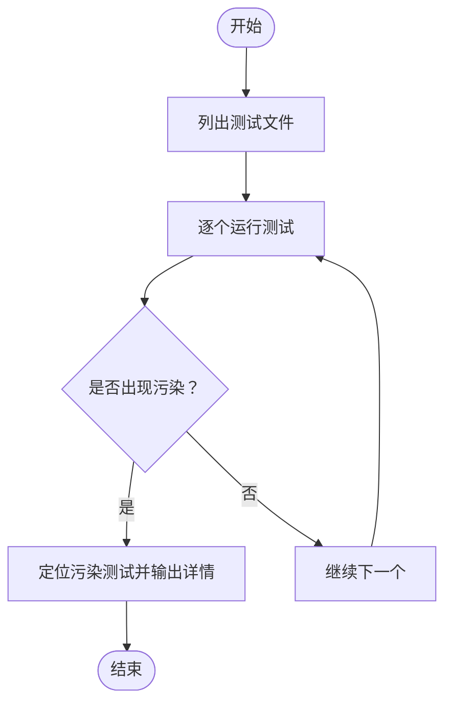

图表来源
- [find-polluter.sh:1-64](file://skills/systematic-debugging/find-polluter.sh#L1-L64)

章节来源
- [find-polluter.sh:1-64](file://skills/systematic-debugging/find-polluter.sh#L1-L64)

### 验证在完成前（verification-before-completion）
在宣称“完成/通过/修复”之前，必须执行一次性完整验证，读取完整输出并确认状态。

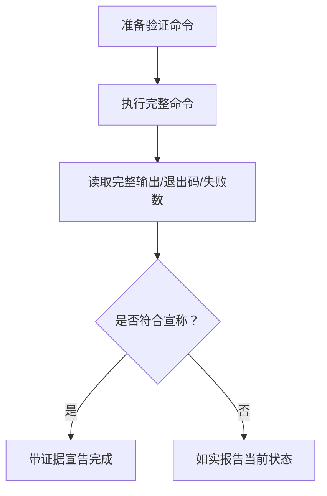

图表来源
- [SKILL.md（验证在完成前）:24-50](file://skills/verification-before-completion/SKILL.md#L24-L50)

章节来源
- [SKILL.md（验证在完成前）:1-140](file://skills/verification-before-completion/SKILL.md#L1-L140)

### 测试驱动开发（test-driven-development）
以“红-绿-重构”循环保证质量与可维护性，强调先失败测试、再最小实现、最后清理。

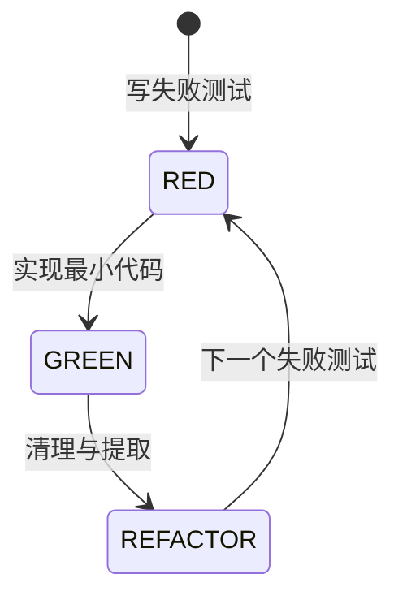

图表来源
- [SKILL.md（测试驱动开发）:47-69](file://skills/test-driven-development/SKILL.md#L47-L69)

章节来源
- [SKILL.md（测试驱动开发）:1-372](file://skills/test-driven-development/SKILL.md#L1-L372)

### 会话与测试分析（testing.md）
- 集成测试通过真实会话运行复杂技能，解析会话转录并统计令牌用量
- 提供故障排查清单：技能未加载、权限错误、超时、会话文件缺失等
- 强调从插件目录运行、授予权限、解析 .jsonl 转录、显示令牌用量

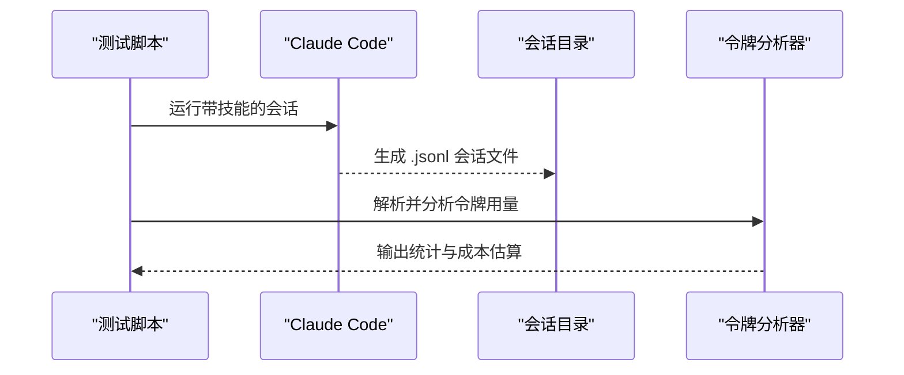

图表来源
- [testing.md:26-32](file://docs/testing.md#L26-L32)
- [testing.md:178-215](file://docs/testing.md#L178-L215)
- [testing.md:265-304](file://docs/testing.md#L265-L304)

章节来源
- [testing.md:1-304](file://docs/testing.md#L1-L304)

## 依赖关系分析
- 平台插件负责技能加载与执行上下文注入
- 技能系统依赖 hooks.json 中的生命周期钩子（如 SessionStart）与 run-hook.cmd 跨平台执行
- 测试与分析依赖 Claude Code 会话转录文件与令牌分析工具

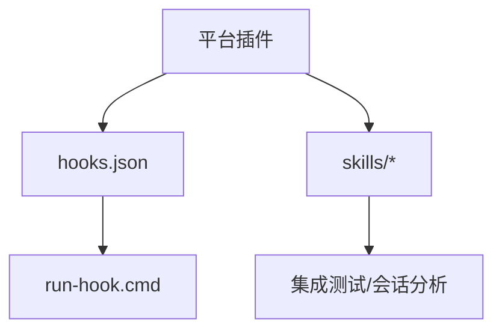

图表来源
- [hooks.json:1-17](file://hooks/hooks.json#L1-L17)
- [run-hook.cmd:1-47](file://hooks/run-hook.cmd#L1-L47)
- [testing.md:26-32](file://docs/testing.md#L26-L32)

章节来源
- [hooks.json:1-17](file://hooks/hooks.json#L1-L17)
- [run-hook.cmd:1-47](file://hooks/run-hook.cmd#L1-L47)
- [testing.md:1-304](file://docs/testing.md#L1-L304)

## 性能考虑
- 令牌用量与成本：集成测试展示了主会话与子代理的令牌分布与成本估算，有助于预算控制与优化
- 缓存命中：高缓存读取是预期的，表明提示缓存有效
- 超时与稳定性：基于条件的等待减少竞态，提高稳定性；长时集成测试可通过增加超时缓解资源压力

章节来源
- [testing.md:103-177](file://docs/testing.md#L103-L177)
- [condition-based-waiting.md:84-116](file://skills/systematic-debugging/condition-based-waiting.md#L84-L116)

## 故障排除指南

### 安装与配置问题
- 平台差异：不同平台（Claude Code、Cursor、Codex、OpenCode、Gemini CLI）安装方式不同，需按 README 步骤执行
- 插件市场与手动安装：官方市场与自建市场均可安装；Codex/OpenCode 需要按文档指引获取安装说明
- 更新与验证：更新插件后，启动新会话并触发技能以验证加载

章节来源
- [README.md:27-107](file://README.md#L27-L107)

### 技能未加载或触发异常
- 确认从插件目录运行测试或会话（集成测试要求从插件目录执行）
- 检查本地开发市场开关与 enabledPlugins 配置
- 确保技能存在于 skills/ 目录且名称正确

章节来源
- [testing.md:180-188](file://docs/testing.md#L180-L188)

### 权限与文件系统错误
- 使用权限绕过模式与目录授权标志，授予 Claude 访问测试目录的权限
- 检查目标目录的读写权限与路径有效性

章节来源
- [testing.md:189-197](file://docs/testing.md#L189-L197)

### 超时与长时间运行
- 对于耗时较长的集成测试，适当增加超时时间
- 排查技能逻辑是否存在无限循环或阻塞
- 评估子代理任务复杂度，必要时拆分任务

章节来源
- [testing.md:198-206](file://docs/testing.md#L198-L206)

### 会话文件缺失或无法定位
- 在会话目录中查找最近的 .jsonl 文件
- 使用辅助命令定位近期会话
- 确认测试确实执行并检查输出中的错误信息

章节来源
- [testing.md:207-215](file://docs/testing.md#L207-L215)

### 日志与会话分析
- 会话转录格式为 JSONL，包含消息与工具调用结果
- 通过解析转录文件验证技能调用、子代理派发、文件创建、测试通过与提交历史
- 使用令牌分析工具查看主会话与子代理的令牌用量与成本

章节来源
- [testing.md:265-304](file://docs/testing.md#L265-L304)

### 错误信息解读与问题定位
- 系统化调试：先完整阅读错误与堆栈，再尝试稳定复现，检查最近变更与组件边界
- 根因追溯：从症状点回溯调用链，定位原始触发点并在源头修复
- 多层防御：在输入、业务、环境与调试层面增加校验，使缺陷结构上不可重现
- 条件等待：替换任意超时，等待实际条件满足，减少竞态与不稳定

章节来源
- [SKILL.md（系统化调试）:54-121](file://skills/systematic-debugging/SKILL.md#L54-L121)
- [root-cause-tracing.md:34-96](file://skills/systematic-debugging/root-cause-tracing.md#L34-L96)
- [defense-in-depth.md:22-85](file://skills/systematic-debugging/defense-in-depth.md#L22-L85)
- [condition-based-waiting.md:36-82](file://skills/systematic-debugging/condition-based-waiting.md#L36-L82)

### 自动化与脚本辅助
- 使用污染源定位脚本快速识别产生副作用的测试文件
- 在 Windows 上通过 run-hook.cmd 跨平台执行钩子脚本

章节来源
- [find-polluter.sh:1-64](file://skills/systematic-debugging/find-polluter.sh#L1-L64)
- [run-hook.cmd:1-47](file://hooks/run-hook.cmd#L1-L47)

### 性能优化与资源监控
- 令牌用量与成本：关注缓存读取、主会话输入与子代理输出的比例，合理设计任务规模
- 等待策略：采用条件等待替代任意超时，提升稳定性与吞吐
- 会话分析：定期分析令牌用量与成本，识别异常峰值与潜在优化点

章节来源
- [testing.md:103-177](file://docs/testing.md#L103-L177)
- [condition-based-waiting.md:58-82](file://skills/systematic-debugging/condition-based-waiting.md#L58-L82)

### 容量规划与成本控制
- 通过令牌分析工具估算每次会话的成本，结合任务数量与复杂度制定预算
- 优化任务粒度与子代理数量，平衡质量与成本

章节来源
- [testing.md:117-129](file://docs/testing.md#L117-L129)

### 自助排障流程（建议）
- 明确症状与期望行为，记录错误信息与复现步骤
- 使用系统化调试四阶段进行根因调查
- 通过验证在完成前执行一次性完整验证
- 必要时使用根因追溯与条件等待定位与修复
- 利用会话转录与令牌分析工具进行端到端验证
- 若问题持续，参考测试文档中的故障排查清单并寻求社区支持

章节来源
- [SKILL.md（系统化调试）:24-45](file://skills/systematic-debugging/SKILL.md#L24-L45)
- [SKILL.md（验证在完成前）:24-50](file://skills/verification-before-completion/SKILL.md#L24-L50)
- [testing.md:178-215](file://docs/testing.md#L178-L215)

### 联系支持
- 社区与问题反馈：通过 GitHub Issues 提交问题
- Discord 社区：加入社区讨论与分享经验
- 发布公告订阅：关注版本发布通知

章节来源
- [README.md:184-191](file://README.md#L184-L191)

## 结论
本指南将 Superpowers 的技能体系与测试分析能力整合为一套可操作的故障排除方法论：以系统化调试为纲，以验证在完成前为尺，以 TDD 为基，辅以根因追溯、条件等待与会话分析工具，形成从问题发现到修复闭环的完整流程。遵循上述步骤与最佳实践，可显著降低调试成本、提升修复质量与系统稳定性。

## 附录
- 术语速查：技能、子代理、会话转录、令牌用量、缓存读取
- 参考路径：各技能与测试文档的章节来源已在相应小节标注，便于进一步查阅