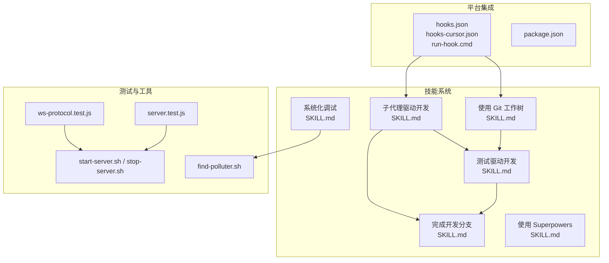
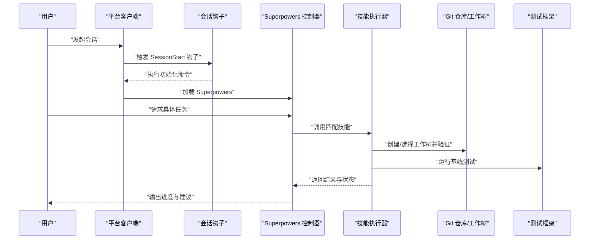
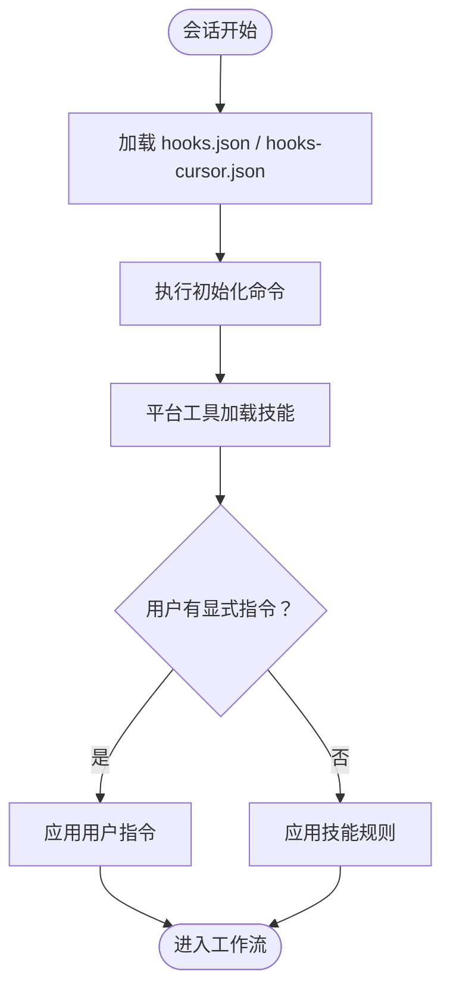
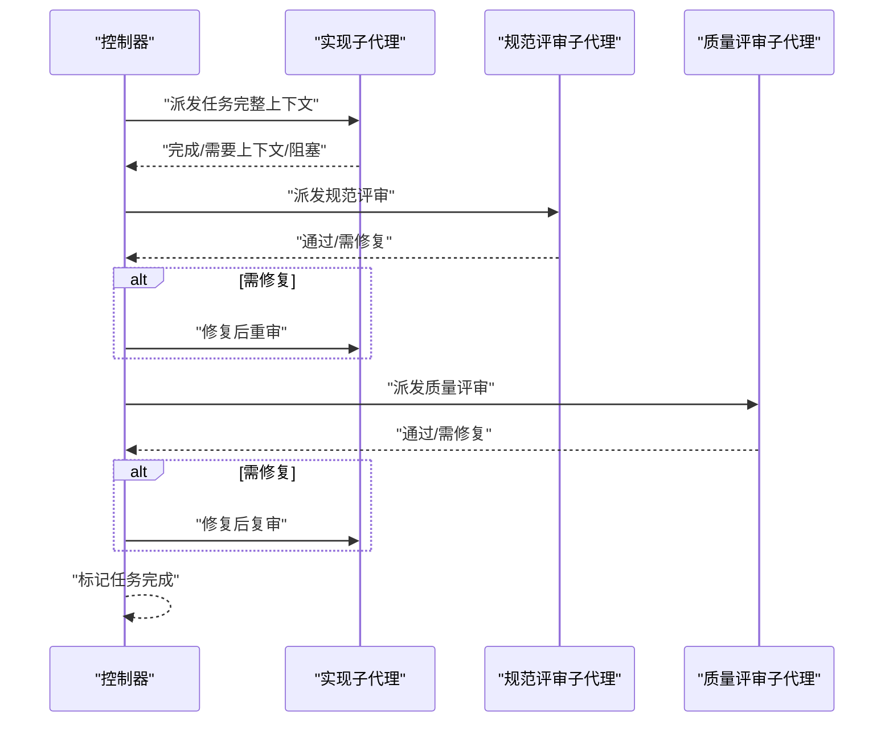
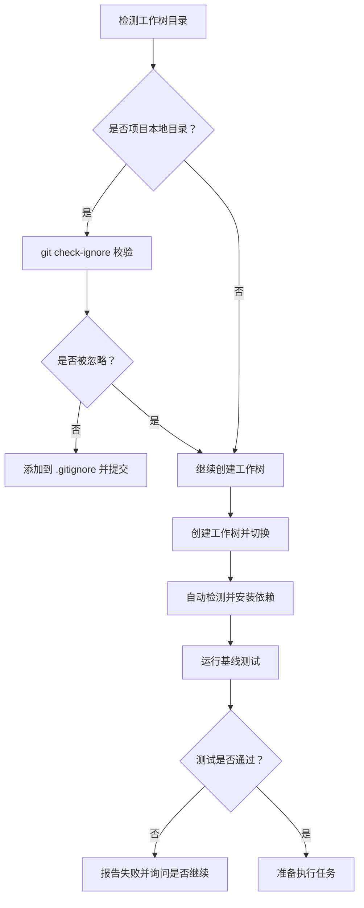
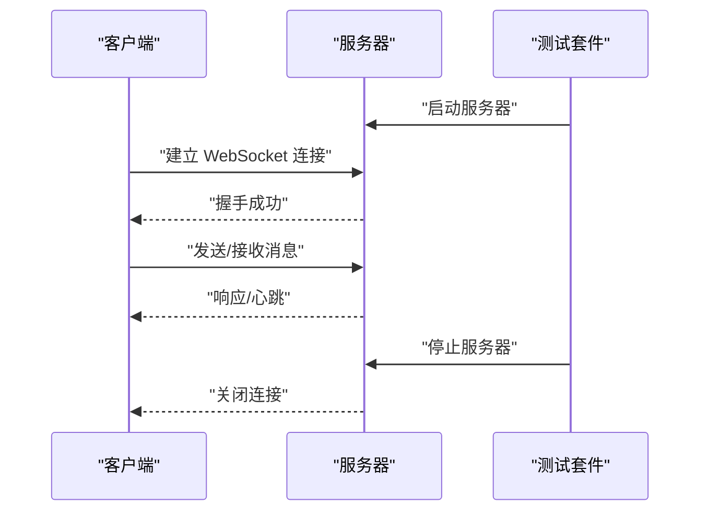
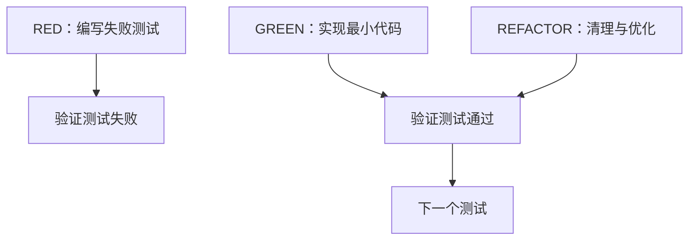
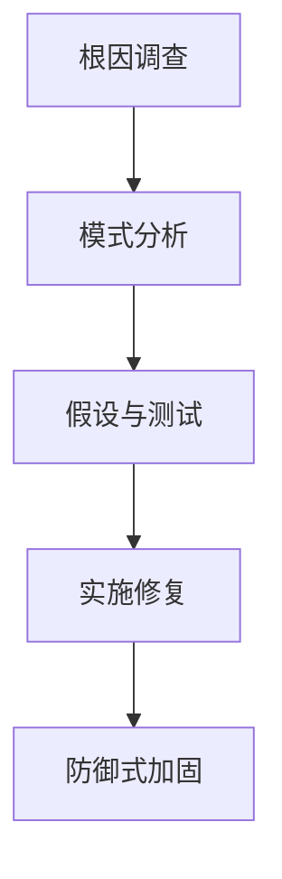
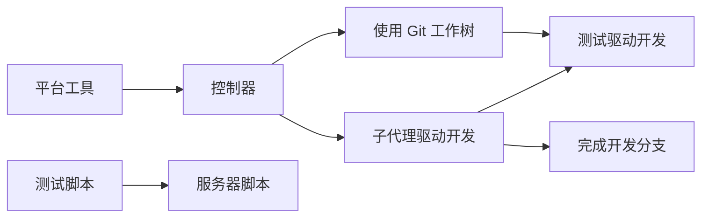

# 安全设计

<cite>
**本文引用的文件**
- [README.md](file://README.md)
- [package.json](file://package.json)
- [hooks.json](file://hooks/hooks.json)
- [hooks-cursor.json](file://hooks/hooks-cursor.json)
- [run-hook.cmd](file://hooks/run-hook.cmd)
- [SKILL.md（子代理驱动开发）](file://skills/subagent-driven-development/SKILL.md)
- [SKILL.md（使用 Git 工作树）](file://skills/using-git-worktrees/SKILL.md)
- [SKILL.md（系统化调试）](file://skills/systematic-debugging/SKILL.md)
- [SKILL.md（测试驱动开发）](file://skills/test-driven-development/SKILL.md)
- [SKILL.md（完成开发分支）](file://skills/finishing-a-development-branch/SKILL.md)
- [SKILL.md（使用 Superpowers）](file://skills/using-superpowers/SKILL.md)
- [ws-protocol.test.js](file://tests/brainstorm-server/ws-protocol.test.js)
- [server.test.js](file://tests/brainstorm-server/server.test.js)
- [start-server.sh](file://skills/brainstorming/scripts/start-server.sh)
- [stop-server.sh](file://skills/brainstorming/scripts/stop-server.sh)
- [find-polluter.sh](file://skills/systematic-debugging/find-polluter.sh)
</cite>

## 目录
1. [简介](#简介)
2. [项目结构](#项目结构)
3. [核心组件](#核心组件)
4. [架构总览](#架构总览)
5. [详细组件分析](#详细组件分析)
6. [依赖关系分析](#依赖关系分析)
7. [性能考量](#性能考量)
8. [故障排查指南](#故障排查指南)
9. [结论](#结论)
10. [附录](#附录)

## 简介
本文件面向 Superpowers 的安全设计，聚焦以下方面：
- 平台集成的安全考虑与访问控制
- 子代理执行的安全边界与权限管理（上下文隔离、最小权限）
- 文件系统访问控制与 Git 操作的安全审计
- 网络安全策略（WebSocket 连接与数据传输）
- 威胁模型与风险评估（攻击向量与缓解措施）
- 合规性与隐私保护

Superpowers 是一个基于可组合“技能”的软件开发工作流系统，通过“子代理驱动开发”等流程实现任务分解、两阶段评审与自动化测试，从而在工程实践中降低错误注入与回归风险。

## 项目结构
仓库采用按功能域划分的目录组织方式：技能（skills）、钩子（hooks）、文档（docs）、测试（tests）等。与安全相关的关键点包括：
- 技能层：定义了子代理执行、Git 工作树隔离、测试驱动开发、系统化调试等安全相关流程
- 钩子层：平台启动时的会话级安全初始化与命令调用
- 测试层：包含 WebSocket 协议与服务器行为的测试脚本

图表来源
- [hooks.json:1-17](file://hooks/hooks.json#L1-L17)
- [hooks-cursor.json:1-11](file://hooks/hooks-cursor.json#L1-L11)
- [run-hook.cmd](file://hooks/run-hook.cmd)
- [package.json:1-7](file://package.json#L1-L7)
- [SKILL.md（子代理驱动开发）:1-278](file://skills/subagent-driven-development/SKILL.md#L1-L278)
- [SKILL.md（使用 Git 工作树）:1-219](file://skills/using-git-worktrees/SKILL.md#L1-L219)
- [SKILL.md（测试驱动开发）:1-372](file://skills/test-driven-development/SKILL.md#L1-L372)
- [SKILL.md（系统化调试）:1-297](file://skills/systematic-debugging/SKILL.md#L1-L297)
- [SKILL.md（完成开发分支）:1-201](file://skills/finishing-a-development-branch/SKILL.md#L1-L201)
- [SKILL.md（使用 Superpowers）:1-118](file://skills/using-superpowers/SKILL.md#L1-L118)
- [ws-protocol.test.js](file://tests/brainstorm-server/ws-protocol.test.js)
- [server.test.js](file://tests/brainstorm-server/server.test.js)
- [start-server.sh](file://skills/brainstorming/scripts/start-server.sh)
- [stop-server.sh](file://skills/brainstorming/scripts/stop-server.sh)
- [find-polluter.sh](file://skills/systematic-debugging/find-polluter.sh)

章节来源
- [README.md:1-191](file://README.md#L1-L191)
- [package.json:1-7](file://package.json#L1-L7)

## 核心组件
- 平台钩子与会话安全初始化：通过 hooks.json 与 hooks-cursor.json 在会话开始时执行命令，确保运行环境与安全基线一致
- 子代理执行与上下文隔离：子代理在独立上下文中执行，避免会话历史污染；两阶段评审（规范符合性 → 代码质量）形成质量门禁
- Git 工作树隔离与安全验证：自动选择工作树目录、忽略规则校验、项目设置与基线测试验证，防止误提交与污染
- 测试驱动开发与回归防护：强制先写失败测试，再实现与重构，减少生产缺陷与回归
- 系统化调试与根因定位：四阶段调试流程，避免症状修复与猜测式修复
- 开发分支收尾与清理：合并/PR/保留/丢弃选项与工作树清理，降低残留风险

章节来源
- [hooks.json:1-17](file://hooks/hooks.json#L1-L17)
- [hooks-cursor.json:1-11](file://hooks/hooks-cursor.json#L1-L11)
- [SKILL.md（子代理驱动开发）:1-278](file://skills/subagent-driven-development/SKILL.md#L1-L278)
- [SKILL.md（使用 Git 工作树）:1-219](file://skills/using-git-worktrees/SKILL.md#L1-L219)
- [SKILL.md（测试驱动开发）:1-372](file://skills/test-driven-development/SKILL.md#L1-L372)
- [SKILL.md（系统化调试）:1-297](file://skills/systematic-debugging/SKILL.md#L1-L297)
- [SKILL.md（完成开发分支）:1-201](file://skills/finishing-a-development-branch/SKILL.md#L1-L201)

## 架构总览
下图展示从平台会话到技能执行、Git 隔离与测试验证的整体安全路径。

图表来源
- [hooks.json:1-17](file://hooks/hooks.json#L1-L17)
- [hooks-cursor.json:1-11](file://hooks/hooks-cursor.json#L1-L11)
- [SKILL.md（使用 Git 工作树）:1-219](file://skills/using-git-worktrees/SKILL.md#L1-L219)
- [SKILL.md（测试驱动开发）:1-372](file://skills/test-driven-development/SKILL.md#L1-L372)

## 详细组件分析

### 平台集成与访问控制
- 会话钩子：在会话开始时执行命令，确保初始化步骤一致且可审计
- 工具调用：通过平台工具（如 Skill 工具）加载技能内容，避免直接读取文件导致上下文泄露
- 用户指令优先级：用户显式指令优先于默认系统提示，确保最终决策权在用户手中

图表来源
- [hooks.json:1-17](file://hooks/hooks.json#L1-L17)
- [hooks-cursor.json:1-11](file://hooks/hooks-cursor.json#L1-L11)
- [SKILL.md（使用 Superpowers）:1-118](file://skills/using-superpowers/SKILL.md#L1-L118)

章节来源
- [hooks.json:1-17](file://hooks/hooks.json#L1-L17)
- [hooks-cursor.json:1-11](file://hooks/hooks-cursor.json#L1-L11)
- [SKILL.md（使用 Superpowers）:1-118](file://skills/using-superpowers/SKILL.md#L1-L118)

### 子代理执行的安全边界与权限管理
- 上下文隔离：每个任务分配全新子代理，不继承会话历史，避免上下文污染与信息泄露
- 两阶段评审：规范符合性评审 → 代码质量评审，形成质量门禁，减少错误合并
- 模型选择：根据任务复杂度选择合适模型，兼顾成本与速度，避免过度推理暴露敏感信息
- 任务约束：禁止并行实现多个子代理、禁止跳过评审、禁止接受“差不多”等，强化安全执行纪律

图表来源
- [SKILL.md（子代理驱动开发）:1-278](file://skills/subagent-driven-development/SKILL.md#L1-L278)

章节来源
- [SKILL.md（子代理驱动开发）:1-278](file://skills/subagent-driven-development/SKILL.md#L1-L278)

### 文件系统访问控制与 Git 操作安全审计
- 目录选择与忽略验证：优先使用已存在的工作树目录，若为项目本地目录则进行 git check-ignore 校验，防止误提交
- 自动化项目设置：根据项目文件自动检测并安装依赖，减少手工操作带来的误操作
- 基线测试验证：在工作树创建后运行测试，确保环境干净、问题可控
- 分支收尾与清理：提供合并、PR、保留、丢弃四种选项，并在特定情况下清理工作树，降低残留风险

图表来源
- [SKILL.md（使用 Git 工作树）:1-219](file://skills/using-git-worktrees/SKILL.md#L1-L219)

章节来源
- [SKILL.md（使用 Git 工作树）:1-219](file://skills/using-git-worktrees/SKILL.md#L1-L219)
- [SKILL.md（完成开发分支）:1-201](file://skills/finishing-a-development-branch/SKILL.md#L1-L201)

### 网络安全策略（WebSocket 连接与数据传输）
- 测试覆盖：包含 WebSocket 协议与服务器行为的测试脚本，确保连接建立、消息传递与生命周期管理符合预期
- 生命周期测试：对服务器启动/停止脚本进行生命周期测试，保证服务在不同平台上的稳定性与一致性
- 建议实践：结合现有测试模式，建议在生产环境中增加：
  - TLS 终端与证书校验
  - 握手阶段的身份验证与授权
  - 消息体完整性校验与速率限制
  - 会话超时与异常断开处理

图表来源
- [ws-protocol.test.js](file://tests/brainstorm-server/ws-protocol.test.js)
- [server.test.js](file://tests/brainstorm-server/server.test.js)
- [start-server.sh](file://skills/brainstorming/scripts/start-server.sh)
- [stop-server.sh](file://skills/brainstorming/scripts/stop-server.sh)

章节来源
- [ws-protocol.test.js](file://tests/brainstorm-server/ws-protocol.test.js)
- [server.test.js](file://tests/brainstorm-server/server.test.js)
- [start-server.sh](file://skills/brainstorming/scripts/start-server.sh)
- [stop-server.sh](file://skills/brainstorming/scripts/stop-server.sh)

### 测试驱动开发与回归防护
- 强制先写失败测试：确保测试真正验证需求而非实现细节
- 红绿重构循环：严格顺序执行，避免“事后补测试”
- 质量门禁：测试通过才允许合并或发布，减少回归风险

图表来源
- [SKILL.md（测试驱动开发）:1-372](file://skills/test-driven-development/SKILL.md#L1-L372)

章节来源
- [SKILL.md（测试驱动开发）:1-372](file://skills/test-driven-development/SKILL.md#L1-L372)

### 系统化调试与根因定位
- 四阶段调试：根因调查 → 模式分析 → 假设与测试 → 实施修复
- 多层证据收集：在多组件系统中，逐层记录输入/输出与环境变量，定位失败环节
- 防御式加固：在找到根因后，在多层增加验证，避免类似问题再次发生

图表来源
- [SKILL.md（系统化调试）:1-297](file://skills/systematic-debugging/SKILL.md#L1-L297)
- [find-polluter.sh](file://skills/systematic-debugging/find-polluter.sh)

章节来源
- [SKILL.md（系统化调试）:1-297](file://skills/systematic-debugging/SKILL.md#L1-L297)
- [find-polluter.sh](file://skills/systematic-debugging/find-polluter.sh)

## 依赖关系分析
- 控制器与技能：控制器负责调度技能，技能之间存在调用与协作关系（如使用 Git 工作树为子代理执行提供隔离环境）
- 平台工具链：平台工具用于加载技能内容，确保执行一致性与可审计性
- 测试与工具：测试脚本与服务器脚本共同保障网络与生命周期行为的正确性

图表来源
- [package.json:1-7](file://package.json#L1-L7)
- [SKILL.md（子代理驱动开发）:1-278](file://skills/subagent-driven-development/SKILL.md#L1-L278)
- [SKILL.md（使用 Git 工作树）:1-219](file://skills/using-git-worktrees/SKILL.md#L1-L219)
- [SKILL.md（测试驱动开发）:1-372](file://skills/test-driven-development/SKILL.md#L1-L372)
- [SKILL.md（完成开发分支）:1-201](file://skills/finishing-a-development-branch/SKILL.md#L1-L201)
- [ws-protocol.test.js](file://tests/brainstorm-server/ws-protocol.test.js)
- [server.test.js](file://tests/brainstorm-server/server.test.js)
- [start-server.sh](file://skills/brainstorming/scripts/start-server.sh)
- [stop-server.sh](file://skills/brainstorming/scripts/stop-server.sh)

章节来源
- [package.json:1-7](file://package.json#L1-L7)
- [README.md:1-191](file://README.md#L1-L191)

## 性能考量
- 子代理执行的并发与资源占用：通过“每任务新子代理 + 两阶段评审”提升迭代效率，但会增加调用次数与计算成本
- Git 工作树隔离：减少分支冲突与回滚成本，提高并行开发效率
- 测试先行：早期发现缺陷，降低后期调试与修复成本
- 建议：在高负载场景下，合理选择模型能力与并行度，结合资源限制与队列调度

## 故障排查指南
- 会话钩子未执行：检查 hooks.json 与 hooks-cursor.json 的配置与命令路径
- 工作树目录未被忽略：执行 git check-ignore 校验，必要时添加到 .gitignore 并提交
- 基线测试失败：记录失败详情，确认是否继续执行或先解决问题
- WebSocket 连接异常：参考 ws-protocol.test.js 与 server.test.js 的测试用例，核对握手、消息与生命周期
- 调试无效或反复修复：遵循系统化调试四阶段流程，避免症状修复

章节来源
- [hooks.json:1-17](file://hooks/hooks.json#L1-L17)
- [hooks-cursor.json:1-11](file://hooks/hooks-cursor.json#L1-L11)
- [SKILL.md（使用 Git 工作树）:1-219](file://skills/using-git-worktrees/SKILL.md#L1-L219)
- [ws-protocol.test.js](file://tests/brainstorm-server/ws-protocol.test.js)
- [server.test.js](file://tests/brainstorm-server/server.test.js)
- [SKILL.md（系统化调试）:1-297](file://skills/systematic-debugging/SKILL.md#L1-L297)

## 结论
Superpowers 的安全设计以“流程即控制”为核心：通过严格的技能执行流程、Git 工作树隔离、测试驱动开发与系统化调试，构建了从上下文隔离、变更审计到回归防护的闭环。建议在现有基础上进一步完善网络传输加密、身份认证与授权、以及更细粒度的资源配额与审计日志，以满足更高安全等级的合规要求。

## 附录
- 平台工具映射与加载方式详见各平台文档（例如 Claude Code 的 Skill 工具、Copilot CLI 的 skill 工具、Gemini CLI 的 activate_skill 工具）
- 版本与入口：package.json 指定模块类型与主入口，便于平台识别与加载

章节来源
- [package.json:1-7](file://package.json#L1-L7)
- [README.md:1-191](file://README.md#L1-L191)