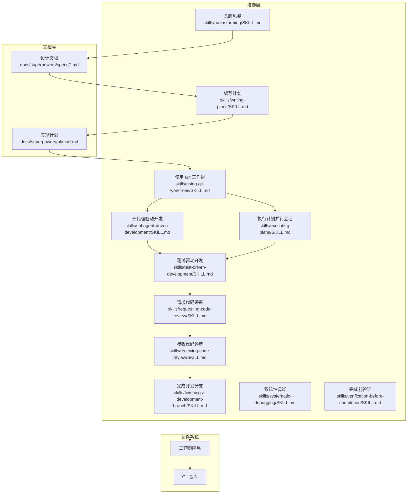
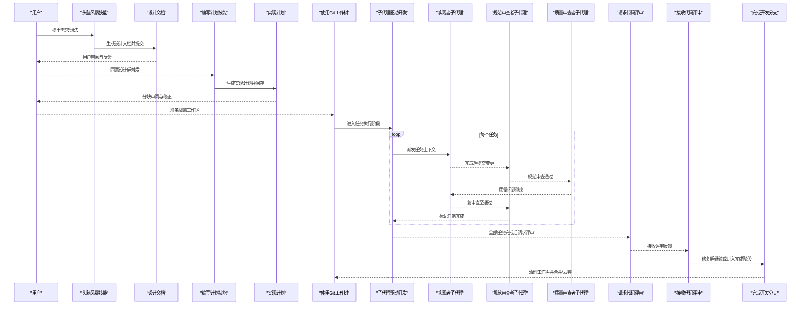
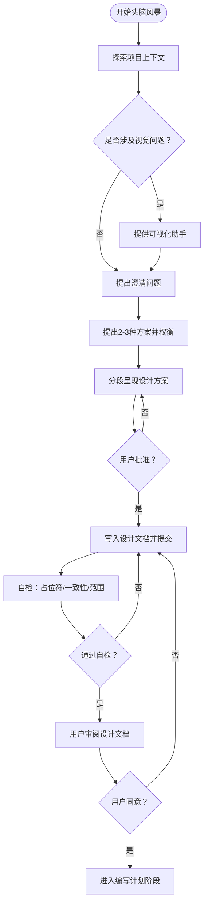
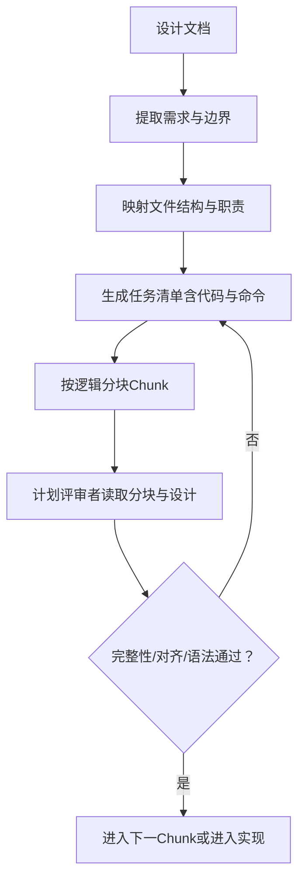
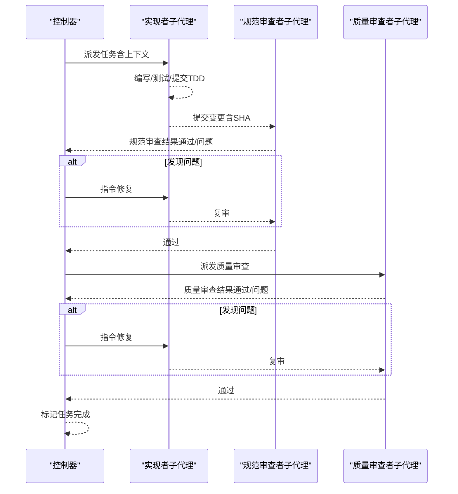
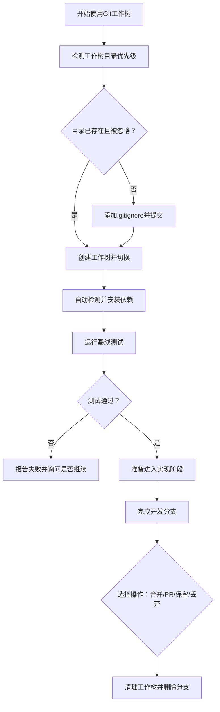
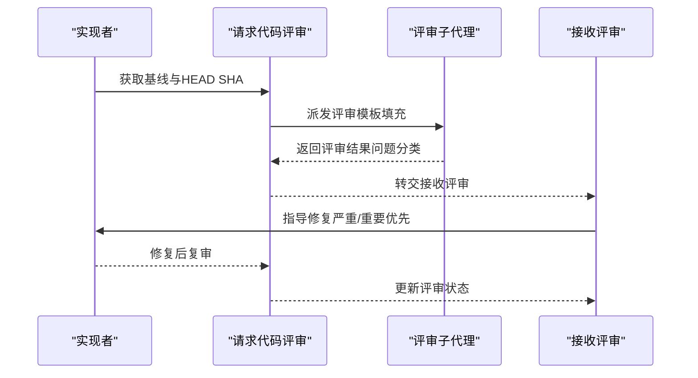
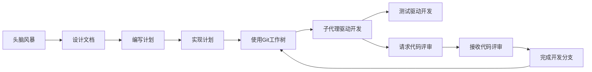

# 数据流设计

<cite>
**本文档引用的文件**
- [README.md](file://README.md)
- [package.json](file://package.json)
- [skills/brainstorming/SKILL.md](file://skills/brainstorming/SKILL.md)
- [skills/brainstorming/scripts/start-server.sh](file://skills/brainstorming/scripts/start-server.sh)
- [skills/brainstorming/scripts/stop-server.sh](file://skills/brainstorming/scripts/stop-server.sh)
- [skills/brainstorming/scripts/helper.js](file://skills/brainstorming/scripts/helper.js)
- [skills/using-git-worktrees/SKILL.md](file://skills/using-git-worktrees/SKILL.md)
- [skills/writing-plans/SKILL.md](file://skills/writing-plans/SKILL.md)
- [skills/subagent-driven-development/SKILL.md](file://skills/subagent-driven-development/SKILL.md)
- [skills/executing-plans/SKILL.md](file://skills/executing-plans/SKILL.md)
- [skills/test-driven-development/SKILL.md](file://skills/test-driven-development/SKILL.md)
- [skills/requesting-code-review/SKILL.md](file://skills/requesting-code-review/SKILL.md)
- [skills/receiving-code-review/SKILL.md](file://skills/receiving-code-review/SKILL.md)
- [skills/finishing-a-development-branch/SKILL.md](file://skills/finishing-a-development-branch/SKILL.md)
- [skills/systematic-debugging/SKILL.md](file://skills/systematic-debugging/SKILL.md)
- [skills/verification-before-completion/SKILL.md](file://skills/verification-before-completion/SKILL.md)
- [docs/superpowers/specs/2026-01-22-document-review-system-design.md](file://docs/superpowers/specs/2026-01-22-document-review-system-design.md)
- [tests/claude-code/test-subagent-driven-development.sh](file://tests/claude-code/test-subagent-driven-development.sh)
- [tests/claude-code/test-subagent-driven-development-integration.sh](file://tests/claude-code/test-subagent-driven-development-integration.sh)
- [tests/explicit-skill-requests/run-all.sh](file://tests/explicit-skill-requests/run-all.sh)
</cite>

## 目录
1. [简介](#简介)
2. [项目结构](#项目结构)
3. [核心组件](#核心组件)
4. [架构总览](#架构总览)
5. [详细组件分析](#详细组件分析)
6. [依赖关系分析](#依赖关系分析)
7. [性能考虑](#性能考虑)
8. [故障排除指南](#故障排除指南)
9. [结论](#结论)
10. [附录](#附录)

## 简介
本文件面向 Superpowers 的数据流设计，系统性阐述从需求到实现的完整数据流转路径：包括设计文档、实现计划与代码生成之间的数据传递；子代理间（实现者、规范审查者、质量审查者）的任务分配、进度同步与结果反馈机制；以及文件系统层面的 Git 工作树管理与版本控制集成。文档提供多类流程图与时序图，帮助读者在不同抽象层级理解数据如何在系统中被产生、传输、处理与持久化。

## 项目结构
Superpowers 采用“可组合技能”（skills）的模块化组织方式，每个技能定义了特定阶段的数据输入、处理规则与输出格式，并通过统一的调度机制串联形成端到端开发流水线。核心目录与职责如下：
- skills：包含所有工作流技能的规范与执行指南，涵盖头脑风暴、计划编写、子代理驱动开发、Git 工作树使用、测试驱动开发、代码评审等。
- docs：存放设计文档与规范文档，支撑技能执行前后的文档级校验与迭代。
- tests：端到端测试脚本，验证技能间的衔接与数据一致性。
- hooks：平台钩子与运行脚本，支持跨平台集成。

图表来源
- [skills/brainstorming/SKILL.md:1-165](file://skills/brainstorming/SKILL.md#L1-L165)
- [skills/writing-plans/SKILL.md:1-153](file://skills/writing-plans/SKILL.md#L1-L153)
- [skills/subagent-driven-development/SKILL.md:1-278](file://skills/subagent-driven-development/SKILL.md#L1-L278)
- [skills/using-git-worktrees/SKILL.md:1-219](file://skills/using-git-worktrees/SKILL.md#L1-L219)
- [skills/test-driven-development/SKILL.md:1-372](file://skills/test-driven-development/SKILL.md#L1-L372)
- [skills/requesting-code-review/SKILL.md:1-106](file://skills/requesting-code-review/SKILL.md#L1-L106)
- [skills/finishing-a-development-branch/SKILL.md:1-201](file://skills/finishing-a-development-branch/SKILL.md#L1-L201)

章节来源
- [README.md:108-125](file://README.md#L108-L125)
- [package.json:1-7](file://package.json#L1-L7)

## 核心组件
- 设计文档生成与评审：头脑风暴技能产出设计文档，随后进行自检与用户确认，确保无占位符、逻辑一致、范围聚焦。
- 实现计划生成与分块评审：编写计划技能将设计转化为可执行任务清单，按逻辑分块并通过评审循环确保任务原子性与规范对齐。
- 子代理执行与两级审查：子代理驱动开发以“实现者-规范审查者-质量审查者”的闭环推进，每步均记录状态与变更。
- 文件系统隔离与版本控制：使用 Git 工作树创建隔离工作区，自动检测与安装依赖，基线测试验证，最终合并或丢弃。
- 评审与验证：在任务完成后请求评审，接收反馈后修复并复审，直至满足质量门禁；完成前进行最终验证。

章节来源
- [skills/brainstorming/SKILL.md:20-32](file://skills/brainstorming/SKILL.md#L20-L32)
- [skills/writing-plans/SKILL.md:63-104](file://skills/writing-plans/SKILL.md#L63-L104)
- [skills/subagent-driven-development/SKILL.md:40-84](file://skills/subagent-driven-development/SKILL.md#L40-L84)
- [skills/using-git-worktrees/SKILL.md:75-135](file://skills/using-git-worktrees/SKILL.md#L75-L135)
- [skills/requesting-code-review/SKILL.md:12-48](file://skills/requesting-code-review/SKILL.md#L12-L48)
- [skills/finishing-a-development-branch/SKILL.md:16-62](file://skills/finishing-a-development-branch/SKILL.md#L16-L62)

## 架构总览
下图展示从设计到完成的端到端数据流：设计文档作为上游输入，经过计划生成与评审，进入工作树隔离环境，由子代理执行并接受两级审查，最终完成分支整合与清理。

图表来源
- [skills/brainstorming/SKILL.md:34-66](file://skills/brainstorming/SKILL.md#L34-L66)
- [skills/writing-plans/SKILL.md:134-153](file://skills/writing-plans/SKILL.md#L134-L153)
- [skills/subagent-driven-development/SKILL.md:40-84](file://skills/subagent-driven-development/SKILL.md#L40-L84)
- [skills/requesting-code-review/SKILL.md:24-48](file://skills/requesting-code-review/SKILL.md#L24-L48)
- [skills/finishing-a-development-branch/SKILL.md:16-62](file://skills/finishing-a-development-branch/SKILL.md#L16-L62)

## 详细组件分析

### 组件一：设计文档数据流（头脑风暴 → 设计文档）
- 数据产生：通过与用户的多轮对话收集需求、约束与成功标准，逐步形成可验证的设计方案。
- 数据传输：每次呈现设计片段后等待用户批准，批准后写入设计文档并提交至版本库。
- 数据处理：进行自检（占位符扫描、内部一致性、范围检查），必要时回退到设计阶段修正。
- 数据存储：保存到 docs/superpowers/specs/ 并提交，供后续计划编写引用。

图表来源
- [skills/brainstorming/SKILL.md:34-66](file://skills/brainstorming/SKILL.md#L34-L66)
- [skills/brainstorming/SKILL.md:107-136](file://skills/brainstorming/SKILL.md#L107-L136)

章节来源
- [skills/brainstorming/SKILL.md:20-32](file://skills/brainstorming/SKILL.md#L20-L32)
- [skills/brainstorming/SKILL.md:116-131](file://skills/brainstorming/SKILL.md#L116-L131)

### 组件二：实现计划数据流（设计文档 → 计划文档 → 分块评审）
- 数据产生：基于设计文档拆解为可执行任务，明确文件路径、代码示例与验证步骤。
- 数据传输：任务清单以“分块”形式保存，便于阶段性评审与并行执行。
- 数据处理：评审者对比计划与设计，检查完整性、规范对齐、任务原子性与语法正确性。
- 数据存储：保存到 docs/superpowers/plans/，支持增量迭代直至全部通过。

图表来源
- [skills/writing-plans/SKILL.md:25-44](file://skills/writing-plans/SKILL.md#L25-L44)
- [skills/writing-plans/SKILL.md:63-104](file://skills/writing-plans/SKILL.md#L63-L104)
- [docs/superpowers/specs/2026-01-22-document-review-system-design.md:45-79](file://docs/superpowers/specs/2026-01-22-document-review-system-design.md#L45-L79)

章节来源
- [skills/writing-plans/SKILL.md:63-104](file://skills/writing-plans/SKILL.md#L63-L104)
- [docs/superpowers/specs/2026-01-22-document-review-system-design.md:71-78](file://docs/superpowers/specs/2026-01-22-document-review-system-design.md#L71-L78)

### 组件三：子代理执行与两级审查（任务级数据流）
- 数据产生：实现者子代理根据任务上下文生成代码、测试与提交。
- 数据传输：实现完成后提交变更，规范审查者与质量审查者分别评估。
- 数据处理：若发现不合规或质量问题，实现者修复后重新审查，直到双关通过。
- 数据存储：每次审查结果与修复记录持久化，最终标记任务完成并推进下一个任务。

图表来源
- [skills/subagent-driven-development/SKILL.md:40-84](file://skills/subagent-driven-development/SKILL.md#L40-L84)
- [skills/subagent-driven-development/SKILL.md:102-125](file://skills/subagent-driven-development/SKILL.md#L102-L125)
- [skills/requesting-code-review/SKILL.md:24-48](file://skills/requesting-code-review/SKILL.md#L24-L48)

章节来源
- [skills/subagent-driven-development/SKILL.md:40-84](file://skills/subagent-driven-development/SKILL.md#L40-L84)
- [skills/test-driven-development/SKILL.md:47-69](file://skills/test-driven-development/SKILL.md#L47-L69)

### 组件四：文件系统数据流（Git 工作树与版本控制）
- 数据产生：工作树创建、依赖安装、基线测试。
- 数据传输：工作树路径与分支信息在各技能间传递，确保隔离与一致性。
- 数据处理：安全验证（忽略规则）、基线测试失败处理、合并/丢弃决策。
- 数据存储：工作树清理与分支删除，保持仓库整洁。

图表来源
- [skills/using-git-worktrees/SKILL.md:16-50](file://skills/using-git-worktrees/SKILL.md#L16-L50)
- [skills/using-git-worktrees/SKILL.md:75-135](file://skills/using-git-worktrees/SKILL.md#L75-L135)
- [skills/finishing-a-development-branch/SKILL.md:16-62](file://skills/finishing-a-development-branch/SKILL.md#L16-L62)

章节来源
- [skills/using-git-worktrees/SKILL.md:75-135](file://skills/using-git-worktrees/SKILL.md#L75-L135)
- [skills/finishing-a-development-branch/SKILL.md:136-150](file://skills/finishing-a-development-branch/SKILL.md#L136-L150)

### 组件五：评审与反馈（请求评审 → 接收评审 → 修复与复审）
- 数据产生：评审者基于变更范围与要求生成反馈。
- 数据传输：通过任务工具传递评审模板与上下文。
- 数据处理：区分严重/重要/轻微问题，指导修复优先级与范围。
- 数据存储：评审记录与修复历史保存，作为质量门禁依据。

图表来源
- [skills/requesting-code-review/SKILL.md:24-48](file://skills/requesting-code-review/SKILL.md#L24-L48)
- [skills/receiving-code-review/SKILL.md:1-106](file://skills/receiving-code-review/SKILL.md#L1-L106)

章节来源
- [skills/requesting-code-review/SKILL.md:12-48](file://skills/requesting-code-review/SKILL.md#L12-L48)
- [skills/receiving-code-review/SKILL.md:1-106](file://skills/receiving-code-review/SKILL.md#L1-L106)

## 依赖关系分析
- 技能内聚与耦合：各技能职责清晰，通过文档与 Git 作为共享数据源，降低直接耦合。
- 外部依赖：Git 工作树、包管理器（npm/pip/go等）与测试框架（pytest/cargo test等）。
- 集成点：子代理驱动开发依赖 TDD 技能，评审技能依赖 Git 提供的 SHA 上下文。

图表来源
- [skills/brainstorming/SKILL.md:107-136](file://skills/brainstorming/SKILL.md#L107-L136)
- [skills/writing-plans/SKILL.md:134-153](file://skills/writing-plans/SKILL.md#L134-L153)
- [skills/subagent-driven-development/SKILL.md:265-278](file://skills/subagent-driven-development/SKILL.md#L265-L278)
- [skills/using-git-worktrees/SKILL.md:209-219](file://skills/using-git-worktrees/SKILL.md#L209-L219)
- [skills/finishing-a-development-branch/SKILL.md:193-201](file://skills/finishing-a-development-branch/SKILL.md#L193-L201)

章节来源
- [skills/subagent-driven-development/SKILL.md:265-278](file://skills/subagent-driven-development/SKILL.md#L265-L278)
- [skills/using-git-worktrees/SKILL.md:209-219](file://skills/using-git-worktrees/SKILL.md#L209-L219)

## 性能考虑
- 子代理成本控制：根据任务复杂度选择合适模型，机械任务用低成本模型，集成与判断用标准模型，架构与评审用高能力模型。
- 执行效率：同一会话内执行避免上下文切换开销；任务粒度控制在 2-5 分钟，减少等待与冲突。
- 评审效率：两级审查前置，尽早暴露问题，减少后期返工。
- 版本控制效率：工作树隔离避免主分支污染，基线测试快速定位问题根因。

## 故障排除指南
- 工作树安全问题：若项目本地工作树目录未被忽略，应先添加到 .gitignore 并提交后再创建工作树。
- 基线测试失败：在失败时暂停并征询是否继续，避免将新问题与既有问题混淆。
- 评审循环异常：若评审输出格式不规范或持续争议，应转交人工介入并设定最大迭代次数。
- 子代理阻塞：当实现者提示需要更多上下文或更强模型时，应调整派发策略而非强制重试。

章节来源
- [skills/using-git-worktrees/SKILL.md:51-70](file://skills/using-git-worktrees/SKILL.md#L51-L70)
- [skills/using-git-worktrees/SKILL.md:120-135](file://skills/using-git-worktrees/SKILL.md#L120-L135)
- [docs/superpowers/specs/2026-01-22-document-review-system-design.md:111-127](file://docs/superpowers/specs/2026-01-22-document-review-system-design.md#L111-L127)
- [skills/subagent-driven-development/SKILL.md:112-119](file://skills/subagent-driven-development/SKILL.md#L112-L119)

## 结论
Superpowers 的数据流设计以“文档驱动 + 子代理执行 + 两级评审 + 工作树隔离”为核心，通过严格的门禁与反馈循环确保交付质量与一致性。文档层（设计/计划）与执行层（子代理/TDD/评审）相互校验，文件系统层（Git 工作树/版本控制）提供可靠的状态管理与回滚能力。该体系在保证可追溯性的同时，兼顾效率与可扩展性，适合在多平台与多模型环境下稳定运行。

## 附录
- 测试与验证：通过 tests 目录下的脚本验证技能链路与集成行为，建议在修改关键流程后运行相关测试套件。
- 可视化辅助：头脑风暴技能配套可视化助手脚本，可在需要时提升沟通效率。

章节来源
- [tests/claude-code/test-subagent-driven-development.sh:1-50](file://tests/claude-code/test-subagent-driven-development.sh#L1-L50)
- [tests/claude-code/test-subagent-driven-development-integration.sh:1-50](file://tests/claude-code/test-subagent-driven-development-integration.sh#L1-L50)
- [tests/explicit-skill-requests/run-all.sh:1-50](file://tests/explicit-skill-requests/run-all.sh#L1-L50)
- [skills/brainstorming/scripts/start-server.sh:1-50](file://skills/brainstorming/scripts/start-server.sh#L1-L50)
- [skills/brainstorming/scripts/stop-server.sh:1-50](file://skills/brainstorming/scripts/stop-server.sh#L1-L50)
- [skills/brainstorming/scripts/helper.js:1-100](file://skills/brainstorming/scripts/helper.js#L1-L100)