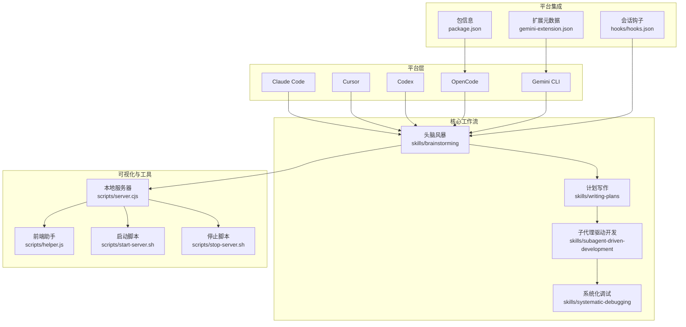
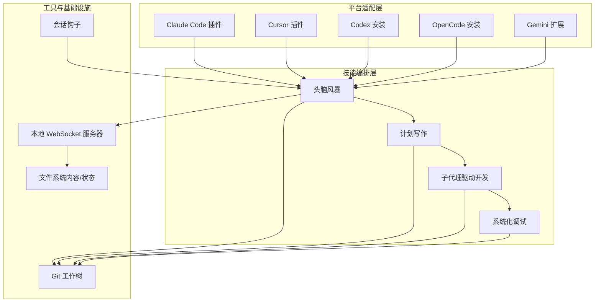
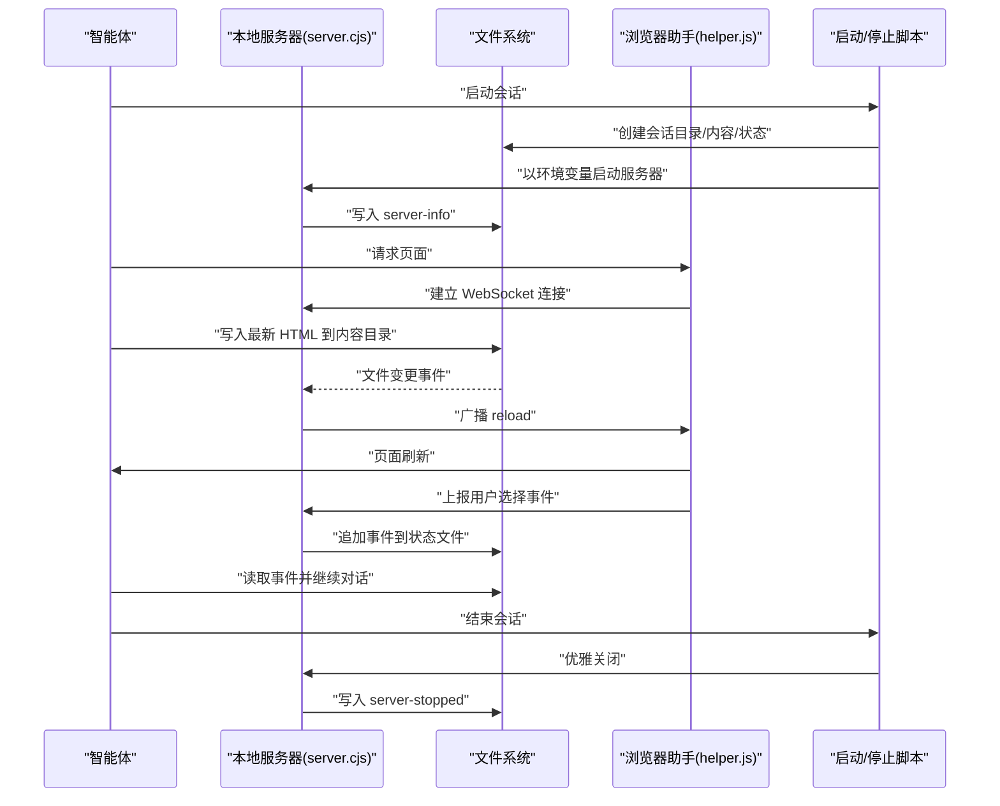
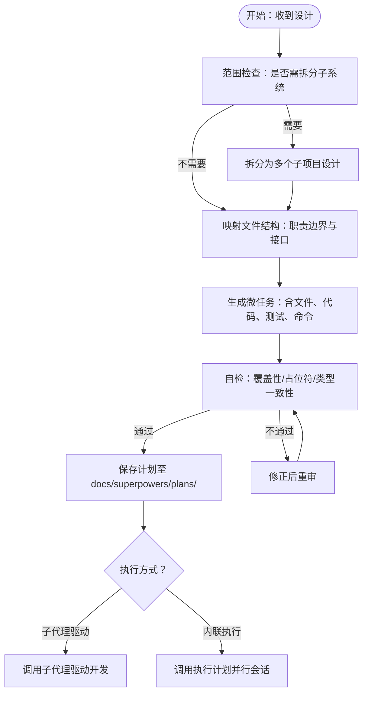
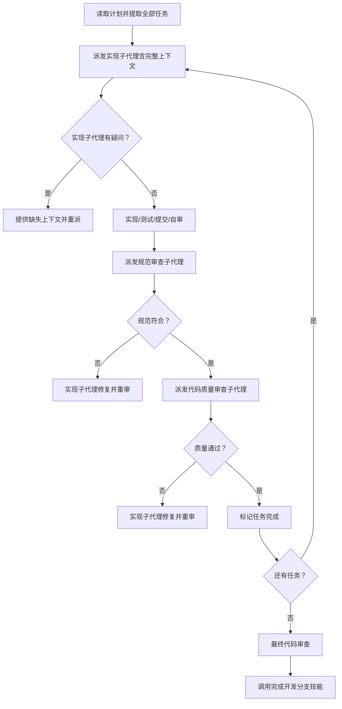
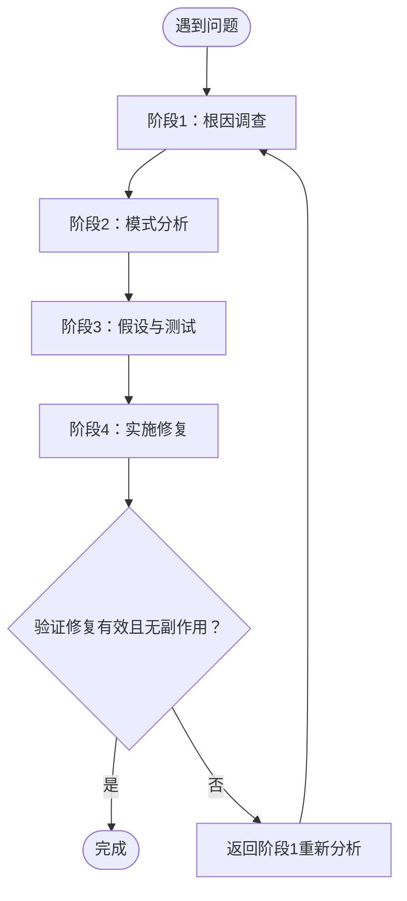
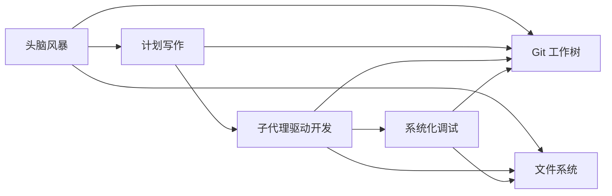

# 架构设计

<cite>
**本文引用的文件**
- [README.md](file://README.md)
- [package.json](file://package.json)
- [gemini-extension.json](file://gemini-extension.json)
- [skills/brainstorming/SKILL.md](file://skills/brainstorming/SKILL.md)
- [skills/subagent-driven-development/SKILL.md](file://skills/subagent-driven-development/SKILL.md)
- [skills/writing-plans/SKILL.md](file://skills/writing-plans/SKILL.md)
- [skills/systematic-debugging/SKILL.md](file://skills/systematic-debugging/SKILL.md)
- [skills/brainstorming/scripts/server.cjs](file://skills/brainstorming/scripts/server.cjs)
- [skills/brainstorming/scripts/start-server.sh](file://skills/brainstorming/scripts/start-server.sh)
- [skills/brainstorming/scripts/stop-server.sh](file://skills/brainstorming/scripts/stop-server.sh)
- [skills/brainstorming/scripts/helper.js](file://skills/brainstorming/scripts/helper.js)
- [hooks/hooks.json](file://hooks/hooks.json)
</cite>

## 目录
1. [引言](#引言)
2. [项目结构](#项目结构)
3. [核心组件](#核心组件)
4. [架构总览](#架构总览)
5. [详细组件分析](#详细组件分析)
6. [依赖关系分析](#依赖关系分析)
7. [性能考量](#性能考量)
8. [故障排查指南](#故障排查指南)
9. [结论](#结论)
10. [附录](#附录)

## 引言
Superpowers 是一套面向代码智能体（Agent）的完整软件开发工作流，围绕“可组合技能”（skills）与初始指令构建，确保智能体在执行任务前先完成需求澄清、设计与计划，再进入实现阶段。其核心目标是通过标准化流程降低试错成本、提升交付质量，并在多平台（Claude Code、Cursor、Codex、OpenCode、Gemini CLI 等）上保持一致体验。

该文档聚焦于系统高层设计、架构模式与组件边界，阐述组件间交互、数据流向与集成方式；解释技术决策、权衡与约束；并给出基础设施要求、可扩展性与部署拓扑建议，以及安全、监控与灾备等横切关注点。

## 项目结构
仓库采用“按功能域划分”的目录组织方式：核心能力以“技能”为单位组织在 skills 目录下，配套的可视化协作工具位于 brainstorming 子目录中，平台钩子与安装说明分布在 hooks、.codex、.opencode 等位置，测试与文档分别位于 tests 与 docs 目录。

- 核心模块
  - 技能库：包含头脑风暴、计划写作、子代理驱动开发、系统化调试、测试驱动开发、并行派发、Git 工作树使用、评审与收尾等技能定义与流程规范。
  - 可视化协作：头脑风暴的浏览器伴侣服务，基于本地 HTTP/WebSocket 提供实时渲染与交互。
  - 平台集成：各平台的插件元数据与安装说明，统一入口与版本管理。
  - 钩子与生命周期：会话启动时的自动钩子，用于初始化或清理资源。

图表来源
- [README.md:108-125](file://README.md#L108-L125)
- [skills/brainstorming/SCILL.md:147-165](file://skills/brainstorming/SCILL.md#L147-L165)
- [skills/writing-plans/SCILL.md:1-153](file://skills/writing-plans/SCILL.md#L1-L153)
- [skills/subagent-driven-development/SCILL.md:1-278](file://skills/subagent-driven-development/SCILL.md#L1-L278)
- [skills/systematic-debugging/SCILL.md:1-297](file://skills/systematic-debugging/SCILL.md#L1-L297)
- [skills/brainstorming/scripts/server.cjs:1-355](file://skills/brainstorming/scripts/server.cjs#L1-L355)
- [skills/brainstorming/scripts/start-server.sh:1-149](file://skills/brainstorming/scripts/start-server.sh#L1-L149)
- [skills/brainstorming/scripts/stop-server.sh:1-57](file://skills/brainstorming/scripts/stop-server.sh#L1-L57)
- [skills/brainstorming/scripts/helper.js:1-89](file://skills/brainstorming/scripts/helper.js#L1-L89)
- [hooks/hooks.json:1-17](file://hooks/hooks.json#L1-L17)
- [package.json:1-7](file://package.json#L1-L7)
- [gemini-extension.json:1-7](file://gemini-extension.json#L1-L7)

章节来源
- [README.md:108-125](file://README.md#L108-L125)
- [package.json:1-7](file://package.json#L1-L7)
- [gemini-extension.json:1-7](file://gemini-extension.json#L1-L7)

## 核心组件
- 头脑风暴（Brainstorming）
  - 职责：在实现前进行需求澄清、方案探索与设计输出，强制产出可审阅的设计文档，并引导进入计划写作。
  - 关键机制：可视化浏览器伴侣（本地 HTTP/WebSocket 服务），支持所见即所得的交互式设计展示与选择反馈。
- 计划写作（Writing Plans）
  - 职责：将设计转化为可执行的实现计划，明确任务粒度、文件路径、测试与验证步骤，保存到指定位置。
- 子代理驱动开发（Subagent-Driven Development）
  - 职责：为每个任务派发独立子代理，执行两阶段审查（规范符合性 → 代码质量），实现快速迭代与质量门禁。
- 系统化调试（Systematic Debugging）
  - 职责：提供四阶段调试方法论（根因调查 → 模式分析 → 假设与测试 → 实施修复），避免症状性修复。
- 平台集成与生命周期
  - 职责：通过 hooks.json 在会话启动时触发初始化逻辑；通过 package.json 与 gemini-extension.json 提供平台侧的入口与版本信息。

章节来源
- [skills/brainstorming/SCILL.md:1-165](file://skills/brainstorming/SCILL.md#L1-L165)
- [skills/writing-plans/SCILL.md:1-153](file://skills/writing-plans/SCILL.md#L1-L153)
- [skills/subagent-driven-development/SCILL.md:1-278](file://skills/subagent-driven-development/SCILL.md#L1-L278)
- [skills/systematic-debugging/SCILL.md:1-297](file://skills/systematic-debugging/SCILL.md#L1-L297)
- [hooks/hooks.json:1-17](file://hooks/hooks.json#L1-L17)
- [package.json:1-7](file://package.json#L1-L7)
- [gemini-extension.json:1-7](file://gemini-extension.json#L1-L7)

## 架构总览
Superpowers 采用“技能即服务”的架构模式，将复杂开发流程拆解为可组合、可复用的原子能力。平台侧（Claude Code、Cursor、Codex、OpenCode、Gemini CLI）通过各自的插件/扩展机制加载技能；技能内部通过本地工具链（如头脑风暴的可视化服务器）与外部系统（如 Git 工作树）协同。

图表来源
- [README.md:27-106](file://README.md#L27-L106)
- [skills/brainstorming/SCILL.md:147-165](file://skills/brainstorming/SCILL.md#L147-L165)
- [skills/subagent-driven-development/SCILL.md:265-278](file://skills/subagent-driven-development/SCILL.md#L265-L278)
- [hooks/hooks.json:1-17](file://hooks/hooks.json#L1-L17)

## 详细组件分析

### 组件一：头脑风暴（Brainstorming）与可视化协作
- 设计要点
  - 强制前置设计：在任何实现动作之前必须产出并通过设计文档。
  - 视觉化辅助：通过本地 HTTP 服务器与 WebSocket 提供实时页面推送与用户选择事件回传。
  - 会话隔离：每次会话生成独立的会话目录，避免冲突并支持持久化回顾。
- 数据流
  - 智能体生成设计片段 → 写入内容目录 → 文件系统监听触发页面刷新 → WebSocket 推送 reload → 用户点击选择 → 事件写入状态目录 → 智能体读取事件继续对话。
- 关键实现
  - 本地服务器：支持 HTTP GET 返回最新页面、静态文件服务、WebSocket 协议处理与心跳。
  - 启停脚本：负责会话目录创建、进程守护/前台运行、健康检查与优雅关闭。
  - 前端助手：注入页面脚本，捕获用户选择并上报事件，同时监听服务器 reload 指令。

图表来源
- [skills/brainstorming/scripts/server.cjs:129-161](file://skills/brainstorming/scripts/server.cjs#L129-L161)
- [skills/brainstorming/scripts/server.cjs:167-222](file://skills/brainstorming/scripts/server.cjs#L167-L222)
- [skills/brainstorming/scripts/server.cjs:240-245](file://skills/brainstorming/scripts/server.cjs#L240-L245)
- [skills/brainstorming/scripts/server.cjs:276-298](file://skills/brainstorming/scripts/server.cjs#L276-L298)
- [skills/brainstorming/scripts/server.cjs:301-324](file://skills/brainstorming/scripts/server.cjs#L301-L324)
- [skills/brainstorming/scripts/server.cjs:339-347](file://skills/brainstorming/scripts/server.cjs#L339-L347)
- [skills/brainstorming/scripts/start-server.sh:77-91](file://skills/brainstorming/scripts/start-server.sh#L77-L91)
- [skills/brainstorming/scripts/start-server.sh:117-122](file://skills/brainstorming/scripts/start-server.sh#L117-L122)
- [skills/brainstorming/scripts/stop-server.sh:19-46](file://skills/brainstorming/scripts/stop-server.sh#L19-L46)
- [skills/brainstorming/scripts/helper.js:6-24](file://skills/brainstorming/scripts/helper.js#L6-L24)
- [skills/brainstorming/scripts/helper.js:35-62](file://skills/brainstorming/scripts/helper.js#L35-L62)

章节来源
- [skills/brainstorming/SCILL.md:147-165](file://skills/brainstorming/SCILL.md#L147-L165)
- [skills/brainstorming/scripts/server.cjs:1-355](file://skills/brainstorming/scripts/server.cjs#L1-L355)
- [skills/brainstorming/scripts/start-server.sh:1-149](file://skills/brainstorming/scripts/start-server.sh#L1-L149)
- [skills/brainstorming/scripts/stop-server.sh:1-57](file://skills/brainstorming/scripts/stop-server.sh#L1-L57)
- [skills/brainstorming/scripts/helper.js:1-89](file://skills/brainstorming/scripts/helper.js#L1-L89)

### 组件二：计划写作（Writing Plans）
- 设计要点
  - 将设计转化为可执行计划，强调“微任务”粒度（每步 2-5 分钟）、明确文件路径与测试步骤、保存到约定位置。
  - 自检清单：覆盖性、无占位符、类型一致性，确保计划可直接驱动实现。
- 流程图

图表来源
- [skills/writing-plans/SCILL.md:21-153](file://skills/writing-plans/SCILL.md#L21-L153)

章节来源
- [skills/writing-plans/SCILL.md:1-153](file://skills/writing-plans/SCILL.md#L1-L153)

### 组件三：子代理驱动开发（Subagent-Driven Development）
- 设计要点
  - 每个任务派发独立子代理，两阶段审查（规范符合性 → 代码质量），减少上下文污染与冲突。
  - 模型选型策略：机械实现用廉价模型，集成与判断用标准模型，架构与评审用最强模型。
- 流程图

图表来源
- [skills/subagent-driven-development/SCILL.md:42-84](file://skills/subagent-driven-development/SCILL.md#L42-L84)
- [skills/subagent-driven-development/SCILL.md:102-118](file://skills/subagent-driven-development/SCILL.md#L102-L118)
- [skills/subagent-driven-development/SCILL.md:265-278](file://skills/subagent-driven-development/SCILL.md#L265-L278)

章节来源
- [skills/subagent-driven-development/SCILL.md:1-278](file://skills/subagent-driven-development/SCILL.md#L1-L278)

### 组件四：系统化调试（Systematic Debugging）
- 设计要点
  - 四阶段方法论：根因调查 → 模式分析 → 假设与测试 → 实施修复；严禁症状性修复。
  - 多层证据收集：在多组件系统中，逐层记录输入/输出与环境传播，定位失败环节。
- 流程图

图表来源
- [skills/systematic-debugging/SCILL.md:46-297](file://skills/systematic-debugging/SCILL.md#L46-L297)

章节来源
- [skills/systematic-debugging/SCILL.md:1-297](file://skills/systematic-debugging/SCILL.md#L1-L297)

### 组件五：平台集成与生命周期
- 设计要点
  - 通过 hooks.json 在会话启动时触发命令，实现初始化与资源准备。
  - 通过 package.json 与 gemini-extension.json 提供平台入口与版本信息，确保插件/扩展正确加载与更新。

章节来源
- [hooks/hooks.json:1-17](file://hooks/hooks.json#L1-L17)
- [package.json:1-7](file://package.json#L1-L7)
- [gemini-extension.json:1-7](file://gemini-extension.json#L1-L7)

## 依赖关系分析
- 技能内聚与耦合
  - 头脑风暴与计划写作强耦合：前者产出设计，后者产出计划，形成“设计→计划”的必经路径。
  - 子代理驱动开发与系统化调试弱耦合：前者专注执行与质量门禁，后者专注问题诊断与修复，二者可独立演进。
- 外部依赖
  - 文件系统：用于会话目录、内容与状态存储。
  - 网络协议：HTTP/1.1 与 RFC 6455 WebSocket，用于页面服务与事件通信。
  - Git：贯穿工作树隔离、基线校验与合并/清理流程。
- 循环依赖规避
  - 技能之间通过“调用关系”而非直接代码导入连接，避免循环依赖。

图表来源
- [README.md:108-125](file://README.md#L108-L125)
- [skills/brainstorming/SCILL.md:147-165](file://skills/brainstorming/SCILL.md#L147-L165)
- [skills/subagent-driven-development/SCILL.md:265-278](file://skills/subagent-driven-development/SCILL.md#L265-L278)

章节来源
- [README.md:108-125](file://README.md#L108-L125)

## 性能考量
- 本地服务优化
  - WebSocket 心跳与空闲超时：避免长连接占用与僵尸进程。
  - 文件系统监听去抖：减少频繁刷新带来的 CPU 开销。
- 执行效率
  - 子代理按任务粒度并行化，减少人工干预与上下文切换。
  - 模型选型策略：根据任务复杂度选择合适模型，平衡成本与速度。
- 可扩展性
  - 会话目录隔离：支持多会话并发，避免共享状态干扰。
  - 脚本自动适配：针对 CI/WSL/Windows 环境自动选择前台运行，提高稳定性。

## 故障排查指南
- 头脑风暴可视化异常
  - 现象：页面无法加载或无法接收用户选择。
  - 排查：确认服务器已启动并输出 server-started；检查 WebSocket 连接是否建立；查看状态目录 events 是否写入；确认浏览器助手注入成功。
- 服务器生命周期问题
  - 现象：服务器被意外终止或无法优雅关闭。
  - 排查：检查 owner PID 解析与存活检测；确认 idle 超时设置；使用停止脚本进行强制清理。
- 执行流程中断
  - 现象：子代理无法继续或审查未通过。
  - 排查：核对任务上下文完整性；检查实现子代理是否遵循两阶段审查顺序；确认审查结果闭环（修复后必须重审）。

章节来源
- [skills/brainstorming/scripts/server.cjs:319-337](file://skills/brainstorming/scripts/server.cjs#L319-L337)
- [skills/brainstorming/scripts/stop-server.sh:19-46](file://skills/brainstorming/scripts/stop-server.sh#L19-L46)
- [skills/subagent-driven-development/SCILL.md:234-260](file://skills/subagent-driven-development/SCILL.md#L234-L260)

## 结论
Superpowers 通过“技能即服务”的架构，将复杂的软件开发过程标准化、自动化与可审计化。其核心在于：前置设计与可视化协作、可执行计划与两阶段质量门禁、系统化调试与可追溯的执行流程。平台侧通过插件/扩展机制无缝接入，本地工具链保障了跨平台的一致体验。未来可在可观测性与弹性方面进一步增强，以支撑更大规模的团队与更复杂的工程场景。

## 附录
- 技术栈与版本兼容性
  - Node.js（用于本地服务器与脚本）
  - Bash（用于启动/停止脚本）
  - HTML/CSS/JavaScript（用于可视化助手）
  - Git（用于工作树与版本控制）
- 平台支持
  - Claude Code、Cursor、Codex、OpenCode、Gemini CLI
- 安全与合规
  - 本地服务仅绑定到 127.0.0.1 或显式主机，避免暴露到公网。
  - 会话目录隔离与临时清理策略，降低敏感信息泄露风险。
- 监控与灾备
  - 建议：在 CI 环境中记录 server-started/server-stopped 事件；对关键技能（头脑风暴、计划写作、子代理驱动开发）增加日志采样与告警阈值；定期备份会话目录以便回溯。