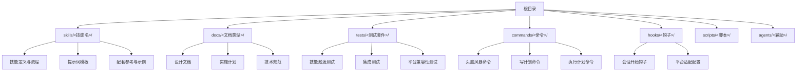
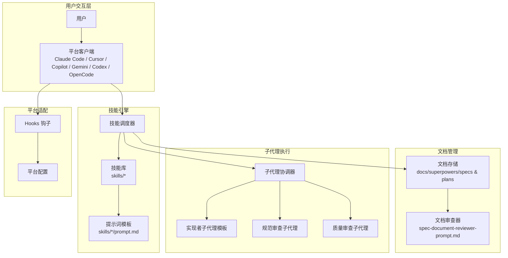
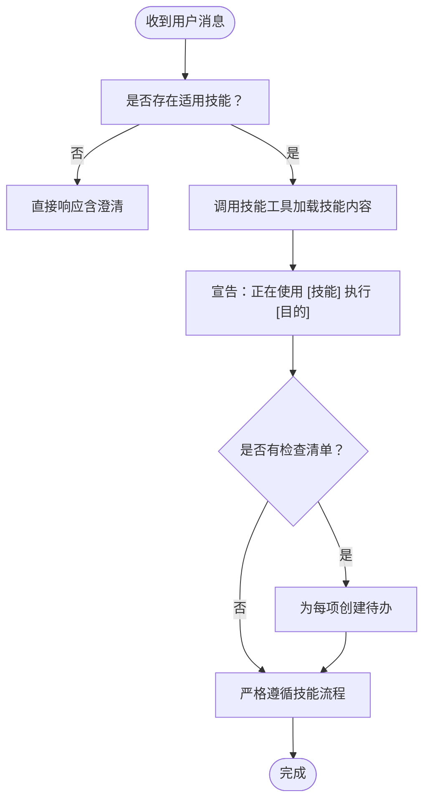
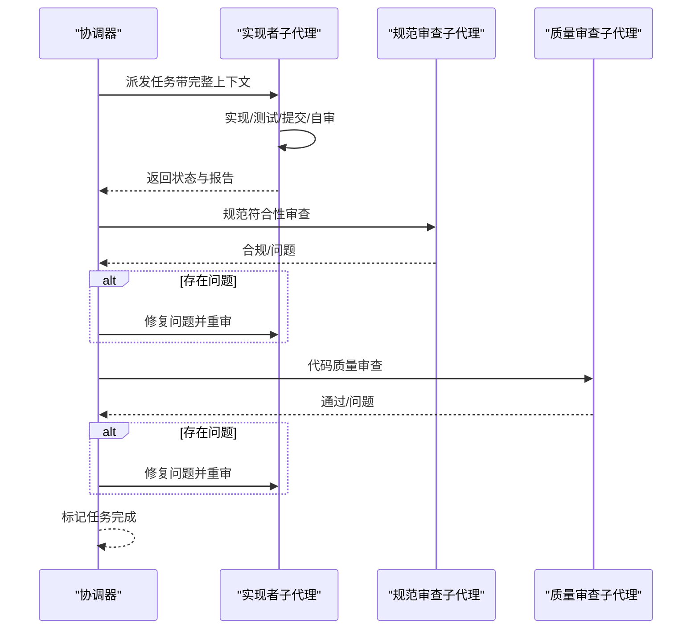
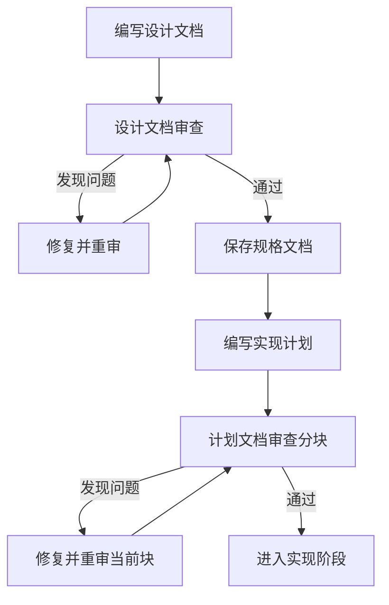
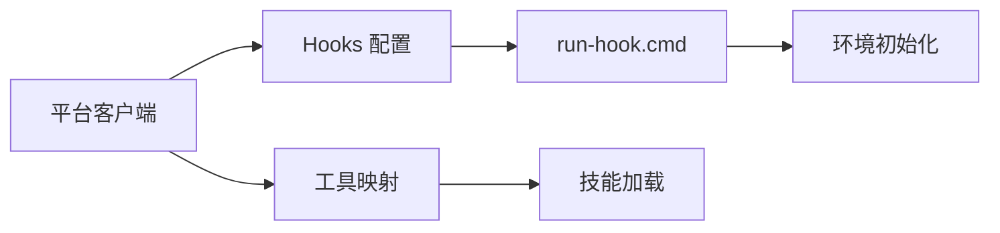
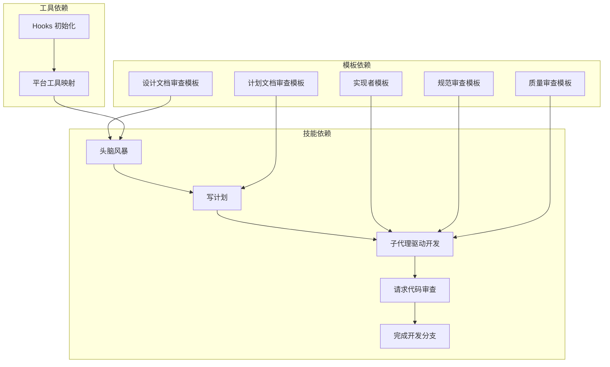

# 系统概述

<cite>
**本文档引用的文件**
- [README.md](file://README.md)
- [package.json](file://package.json)
- [skills/using-superpowers/SKILL.md](file://skills/using-superpowers/SKILL.md)
- [skills/subagent-driven-development/SKILL.md](file://skills/subagent-driven-development/SKILL.md)
- [skills/writing-skills/SKILL.md](file://skills/writing-skills/SKILL.md)
- [skills/brainstorming/SKILL.md](file://skills/brainstorming/SKILL.md)
- [skills/writing-plans/SKILL.md](file://skills/writing-plans/SKILL.md)
- [skills/test-driven-development/SKILL.md](file://skills/test-driven-development/SKILL.md)
- [skills/systematic-debugging/SKILL.md](file://skills/systematic-debugging/SKILL.md)
- [skills/requesting-code-review/SKILL.md](file://skills/requesting-code-review/SKILL.md)
- [docs/superpowers/specs/2026-01-22-document-review-system-design.md](file://docs/superpowers/specs/2026-01-22-document-review-system-design.md)
- [skills/brainstorming/spec-document-reviewer-prompt.md](file://skills/brainstorming/spec-document-reviewer-prompt.md)
- [skills/subagent-driven-development/implementer-prompt.md](file://skills/subagent-driven-development/implementer-prompt.md)
- [hooks/hooks.json](file://hooks/hooks.json)
</cite>

## 目录
1. [引言](#引言)
2. [项目结构](#项目结构)
3. [核心组件](#核心组件)
4. [架构总览](#架构总览)
5. [详细组件分析](#详细组件分析)
6. [依赖关系分析](#依赖关系分析)
7. [性能考量](#性能考量)
8. [故障排除指南](#故障排除指南)
9. [结论](#结论)
10. [附录](#附录)

## 引言
Superpowers 是一个面向代码智能体的完整软件开发工作流，围绕一组可组合的“技能”构建，并通过初始指令确保智能体能够正确使用这些技能。其核心目标是通过标准化的思维与执行流程，将复杂的软件开发过程自动化：从需求澄清、设计验证、计划拆解到子代理协作与代码审查，形成闭环的质量保障体系。

系统的核心价值主张在于：
- 可重复的工程实践：以 TDD、系统化调试、两阶段代码审查等纪律性方法贯穿始终
- 自动化的子代理协作：每个任务由独立子代理执行，减少上下文污染，提升迭代效率
- 文档驱动的规范：在设计与计划阶段引入文档审查机制，降低歧义与返工
- 平台无关的适配能力：通过平台适配层（如工具映射）支持多平台插件生态

业务场景包括但不限于：
- 快速落地新功能或修复缺陷
- 在大型代码库中进行安全重构
- 需要跨模块集成的复杂特性开发
- 对质量与可维护性有严格要求的持续交付

## 项目结构
仓库采用按“技能/主题”组织的扁平化结构，便于发现与复用；同时包含文档、测试与平台钩子等支撑文件。

图表来源
- [README.md:1-191](file://README.md#L1-L191)
- [package.json:1-7](file://package.json#L1-L7)

章节来源
- [README.md:1-191](file://README.md#L1-L191)
- [package.json:1-7](file://package.json#L1-L7)

## 核心组件
Superpowers 的核心由以下组件构成：

- 技能引擎（Skill Engine）
  - 负责技能的自动发现、触发与执行，确保每次对话前先检查适用技能
  - 提供技能优先级与冲突处理策略，保证纪律性流程不被绕过
  - 支持“使用技能”的前置规则，避免无序行动

- 子代理协调器（Subagent Coordinator）
  - 将实现计划分解为原子任务，为每个任务派发专用子代理
  - 实施两阶段审查：先“规范符合性”，再“代码质量”
  - 统一模型选择策略，按任务复杂度分配合适能力

- 文档管理系统（Document Management）
  - 在设计与计划阶段引入文档审查，确保规格与计划的完整性与一致性
  - 通过“块状评审”（chunk-by-chunk）机制，分段推进评审闭环

- 平台适配层（Platform Adapter）
  - 提供不同平台的工具映射与加载机制，屏蔽平台差异
  - 通过钩子与配置文件实现启动时初始化与环境注入

章节来源
- [skills/using-superpowers/SKILL.md:1-118](file://skills/using-superpowers/SKILL.md#L1-L118)
- [skills/subagent-driven-development/SKILL.md:1-278](file://skills/subagent-driven-development/SKILL.md#L1-L278)
- [docs/superpowers/specs/2026-01-22-document-review-system-design.md:1-137](file://docs/superpowers/specs/2026-01-22-document-review-system-design.md#L1-L137)
- [hooks/hooks.json:1-17](file://hooks/hooks.json#L1-L17)

## 架构总览
Superpowers 的系统架构遵循“流程即代码”的理念：以技能为最小可组合单元，以文档为契约载体，以子代理为执行引擎，以平台适配层为接入边界。

图表来源
- [README.md:108-125](file://README.md#L108-L125)
- [skills/using-superpowers/SKILL.md:48-76](file://skills/using-superpowers/SKILL.md#L48-L76)
- [skills/subagent-driven-development/SKILL.md:42-84](file://skills/subagent-driven-development/SKILL.md#L42-L84)
- [docs/superpowers/specs/2026-01-22-document-review-system-design.md:81-98](file://docs/superpowers/specs/2026-01-22-document-review-system-design.md#L81-L98)
- [hooks/hooks.json:1-17](file://hooks/hooks.json#L1-L17)

## 详细组件分析

### 技能引擎（Skill Engine）
职责与特性：
- 触发前置检查：在任何响应或行动之前，先评估是否存在适用技能
- 优先级与覆盖：用户显式指令优先于技能，技能优先于默认系统提示
- 流程强制：当存在适用技能时，必须严格遵循其流程，不可跳过

图表来源
- [skills/using-superpowers/SKILL.md:48-76](file://skills/using-superpowers/SKILL.md#L48-L76)

章节来源
- [skills/using-superpowers/SKILL.md:18-27](file://skills/using-superpowers/SKILL.md#L18-L27)
- [skills/using-superpowers/SKILL.md:44-47](file://skills/using-superpowers/SKILL.md#L44-L47)

### 子代理协调器（Subagent Coordinator）
职责与特性：
- 每个任务派发一个全新子代理，避免上下文污染
- 两阶段审查：先“规范符合性审查”，后“代码质量审查”
- 模型选择策略：根据任务复杂度选择合适模型，平衡成本与速度
- 处理实现者状态：对 DONE/DONE_WITH_CONCERNS/NEEDS_CONTEXT/BLOCKED 四种状态进行明确处置

图表来源
- [skills/subagent-driven-development/SKILL.md:42-84](file://skills/subagent-driven-development/SKILL.md#L42-L84)
- [skills/subagent-driven-development/implementer-prompt.md:1-114](file://skills/subagent-driven-development/implementer-prompt.md#L1-L114)

章节来源
- [skills/subagent-driven-development/SKILL.md:87-101](file://skills/subagent-driven-development/SKILL.md#L87-L101)
- [skills/subagent-driven-development/SKILL.md:102-119](file://skills/subagent-driven-development/SKILL.md#L102-L119)

### 文档管理系统（Document Management）
职责与特性：
- 设计文档审查：在头脑风暴后进行，确保规格完整、一致且可规划
- 计划文档审查：在写计划后进行，确保计划与规格对齐、任务原子化
- 块状评审：将计划按逻辑分块，逐块评审，直至全部通过
- 输出格式标准化：统一“状态/问题/建议”格式，便于自动化处理

图表来源
- [docs/superpowers/specs/2026-01-22-document-review-system-design.md:81-98](file://docs/superpowers/specs/2026-01-22-document-review-system-design.md#L81-L98)
- [skills/brainstorming/spec-document-reviewer-prompt.md:1-50](file://skills/brainstorming/spec-document-reviewer-prompt.md#L1-L50)

章节来源
- [docs/superpowers/specs/2026-01-22-document-review-system-design.md:12-42](file://docs/superpowers/specs/2026-01-22-document-review-system-design.md#L12-L42)
- [docs/superpowers/specs/2026-01-22-document-review-system-design.md:45-78](file://docs/superpowers/specs/2026-01-22-document-review-system-design.md#L45-L78)

### 平台适配层（Platform Adapter）
职责与特性：
- 工具映射：为非 Claude Code 平台提供工具名称映射（如 Copilot CLI 的 skill 工具）
- 钩子机制：在会话开始时执行初始化脚本，注入环境变量或执行预处理
- 插件入口：通过 package.json 指定主入口，适配 OpenCode 等平台

图表来源
- [hooks/hooks.json:1-17](file://hooks/hooks.json#L1-L17)
- [package.json:1-7](file://package.json#L1-L7)

章节来源
- [skills/using-superpowers/SKILL.md:38-41](file://skills/using-superpowers/SKILL.md#L38-L41)
- [hooks/hooks.json:1-17](file://hooks/hooks.json#L1-L17)
- [package.json:1-7](file://package.json#L1-L7)

## 依赖关系分析
Superpowers 的依赖关系体现为“技能-流程-模板-工具”的协同：

- 技能依赖
  - 子代理驱动开发依赖“写计划”“请求代码审查”“完成开发分支”等前置技能
  - 写计划依赖“头脑风暴”“使用 Git 工作树”等技能
  - 文档审查依赖“头脑风暴”“写计划”的输出

- 模板依赖
  - 子代理协调器依赖实现者、规范审查、质量审查三类提示词模板
  - 文档审查依赖规范审查模板

- 工具依赖
  - 平台适配层依赖各平台的工具名称与加载机制
  - 钩子机制依赖运行时脚本与环境变量

图表来源
- [README.md:108-125](file://README.md#L108-L125)
- [skills/subagent-driven-development/SKILL.md:265-278](file://skills/subagent-driven-development/SKILL.md#L265-L278)
- [skills/brainstorming/SKILL.md:20-33](file://skills/brainstorming/SKILL.md#L20-L33)
- [skills/writing-plans/SKILL.md:134-153](file://skills/writing-plans/SKILL.md#L134-L153)
- [skills/using-superpowers/SKILL.md:38-41](file://skills/using-superpowers/SKILL.md#L38-L41)
- [hooks/hooks.json:1-17](file://hooks/hooks.json#L1-L17)

章节来源
- [README.md:108-125](file://README.md#L108-L125)
- [skills/subagent-driven-development/SKILL.md:265-278](file://skills/subagent-driven-development/SKILL.md#L265-L278)
- [skills/brainstorming/SKILL.md:20-33](file://skills/brainstorming/SKILL.md#L20-L33)
- [skills/writing-plans/SKILL.md:134-153](file://skills/writing-plans/SKILL.md#L134-L153)

## 性能考量
- 成本优化
  - 模型分级：机械实现任务使用低成本模型，集成与判断任务使用标准模型，架构与评审任务使用高能力模型
  - 子代理并行：同一任务内避免并发派发，防止资源冲突与上下文污染
- 效率提升
  - 上下文精准传递：子代理仅接收任务所需信息，减少无关上下文带来的 token 消耗
  - 两阶段审查：早期暴露问题，减少后期返工
- 可靠性
  - 文档审查闭环：通过块状评审与标准化输出，降低歧义与遗漏
  - 状态机治理：明确实现者状态与处置策略，避免无效等待

## 故障排除指南
常见问题与对策：
- 技能未触发
  - 检查是否在响应前调用技能工具
  - 确认技能描述字段是否准确描述触发条件
- 子代理停滞
  - BLOCKED：提供更清晰上下文或更高能力模型
  - NEEDS_CONTEXT：补充缺失信息后再派发
  - DONE_WITH_CONCERNS：先修复再进入下一阶段
- 审查循环卡住
  - 若超过一定轮次仍未通过，需人工介入评估是否批准或终止
- 平台适配异常
  - 检查 hooks 配置与脚本路径
  - 确认平台工具映射是否正确

章节来源
- [skills/using-superpowers/SKILL.md:78-96](file://skills/using-superpowers/SKILL.md#L78-L96)
- [skills/subagent-driven-development/SKILL.md:102-119](file://skills/subagent-driven-development/SKILL.md#L102-L119)
- [docs/superpowers/specs/2026-01-22-document-review-system-design.md:111-127](file://docs/superpowers/specs/2026-01-22-document-review-system-design.md#L111-L127)
- [hooks/hooks.json:1-17](file://hooks/hooks.json#L1-L17)

## 结论
Superpowers 通过“技能-文档-子代理-平台适配”的一体化设计，将工程纪律与自动化执行有机结合，实现了从需求到交付的高质量闭环。其模块化与可组合性使得技能可以独立演进，可扩展性则体现在对多平台与多角色的无缝适配。对于希望在多平台上稳定复用工程方法论的团队，Superpowers 提供了可落地的框架与最佳实践。

## 附录
- 安装与更新
  - 不同平台的安装方式与更新命令详见根目录 README
- 哲学与原则
  - 测试驱动、系统化优于直觉、复杂度最小化、证据优于声明
- 贡献指南
  - 新技能的创作遵循“测试驱动的技能开发”流程，强调压力测试与反复打磨

章节来源
- [README.md:27-107](file://README.md#L27-L107)
- [README.md:152-159](file://README.md#L152-L159)
- [skills/writing-skills/SKILL.md:374-394](file://skills/writing-skills/SKILL.md#L374-L394)