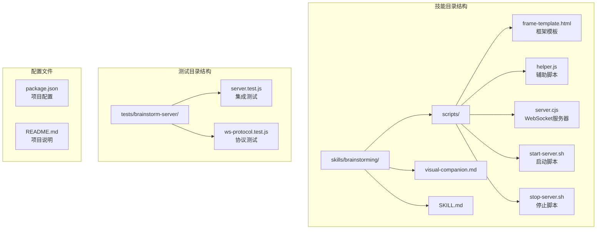
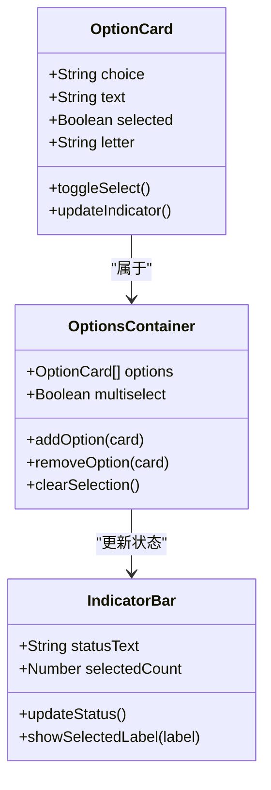
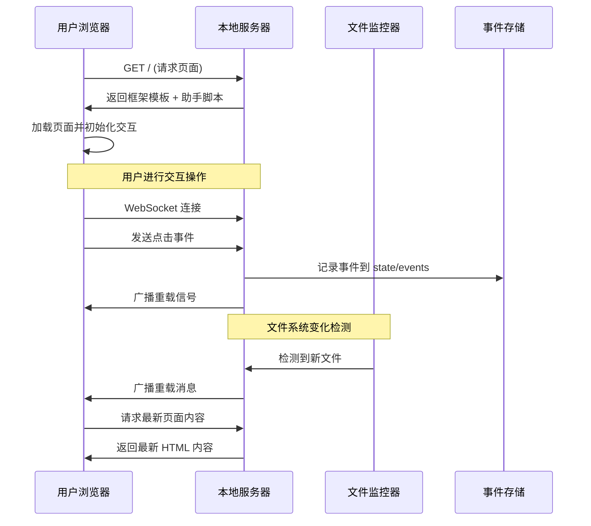
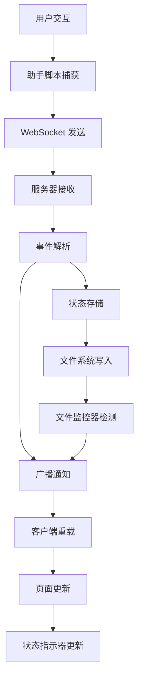
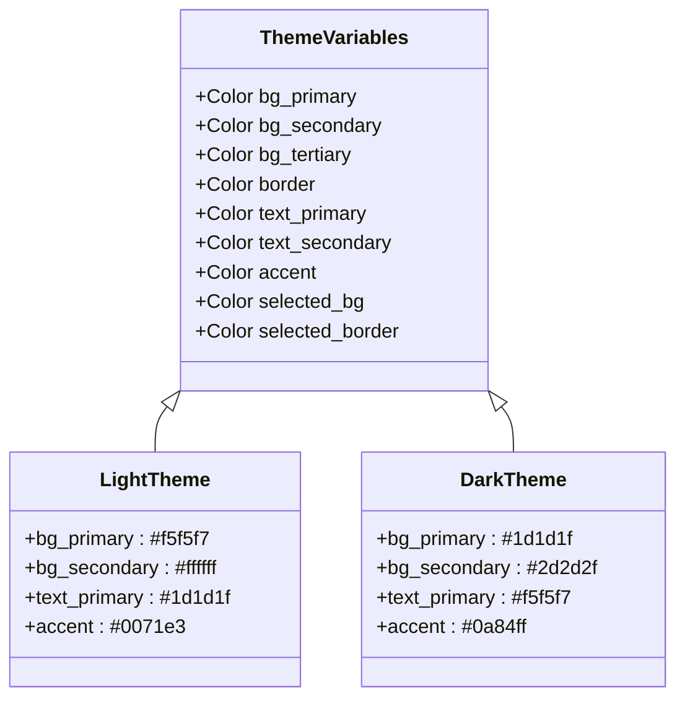
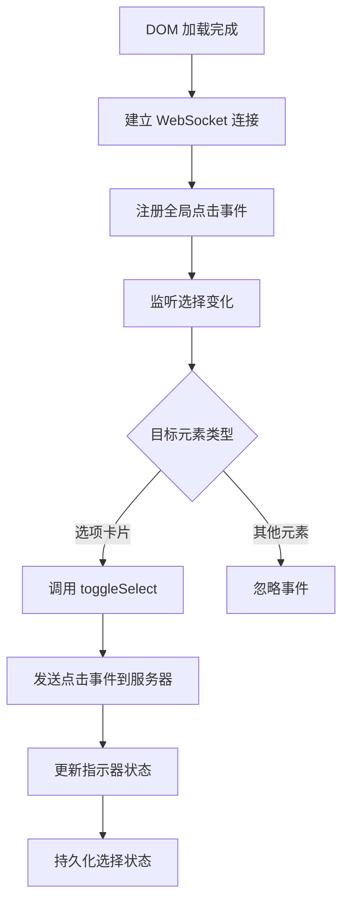
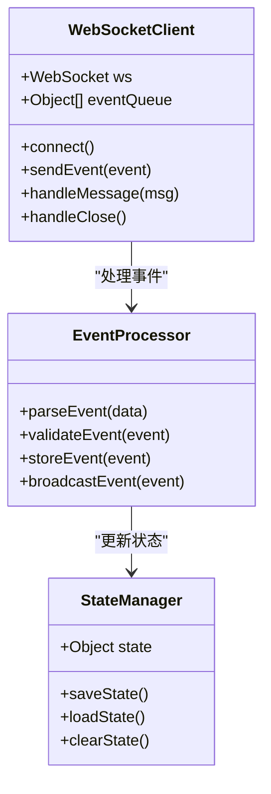
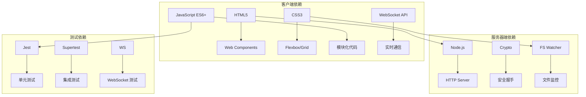

# UI 框架与模板

<cite>
**本文档引用的文件**
- [frame-template.html](file://skills/brainstorming/scripts/frame-template.html)
- [helper.js](file://skills/brainstorming/scripts/helper.js)
- [server.cjs](file://skills/brainstorming/scripts/server.cjs)
- [visual-companion.md](file://skills/brainstorming/visual-companion.md)
- [SKILL.md](file://skills/brainstorming/SKILL.md)
- [server.test.js](file://tests/brainstorm-server/server.test.js)
- [ws-protocol.test.js](file://tests/brainstorm-server/ws-protocol.test.js)
- [start-server.sh](file://skills/brainstorming/scripts/start-server.sh)
- [stop-server.sh](file://skills/brainstorming/scripts/stop-server.sh)
</cite>

## 目录
1. [简介](#简介)
2. [项目结构](#项目结构)
3. [核心组件](#核心组件)
4. [架构概览](#架构概览)
5. [详细组件分析](#详细组件分析)
6. [依赖关系分析](#依赖关系分析)
7. [性能考虑](#性能考虑)
8. [故障排除指南](#故障排除指南)
9. [结论](#结论)
10. [附录](#附录)

## 简介

可视化头脑风暴组件是 Superpowers 项目中的一个创新前端框架，专为创意设计和原型展示而构建。该系统通过一个轻量级的本地服务器提供实时的浏览器界面，支持选项卡片、布局容器和交互元素的设计模式。系统采用 HTML/CSS 响应式模板系统，结合 JavaScript 辅助脚本，实现了从概念到设计的完整协作流程。

该框架的核心价值在于其简洁性和实用性：无需复杂的构建工具，仅通过简单的 HTML 文件即可创建丰富的交互式设计界面。系统支持多选模式、实时状态同步、主题定制和跨平台兼容性，为设计师和开发者提供了高效的协作工具。

## 项目结构

可视化头脑风暴组件的项目结构围绕三个核心文件组织：

**图表来源**
- [frame-template.html:1-215](file://skills/brainstorming/scripts/frame-template.html#L1-L215)
- [helper.js:1-89](file://skills/brainstorming/scripts/helper.js#L1-L89)
- [server.cjs:1-355](file://skills/brainstorming/scripts/server.cjs#L1-L355)

**章节来源**
- [frame-template.html:1-215](file://skills/brainstorming/scripts/frame-template.html#L1-L215)
- [helper.js:1-89](file://skills/brainstorming/scripts/helper.js#L1-L89)
- [server.cjs:1-355](file://skills/brainstorming/scripts/server.cjs#L1-L355)

## 核心组件

### 框架模板系统

框架模板系统是整个 UI 框架的基础，提供了统一的视觉语言和交互模式。该系统包含以下关键特性：

- **OS 适配主题**：自动检测系统偏好设置，提供明暗两种主题模式
- **固定头部区域**：包含标题和连接状态指示器
- **可滚动主内容区**：支持长内容的流畅浏览体验
- **选择指示条**：实时显示用户的当前选择状态
- **CSS 辅助类系统**：提供常用 UI 模式的快速实现

### 选项卡片组件

选项卡片是系统中最核心的交互元素，支持单选和多选模式：

**图表来源**
- [helper.js:67-79](file://skills/brainstorming/scripts/helper.js#L67-L79)
- [frame-template.html:105-132](file://skills/brainstorming/scripts/frame-template.html#L105-L132)

### 卡片布局系统

卡片布局系统专门用于展示设计概念和视觉选项：

- **网格布局**：自动适应不同屏幕尺寸
- **悬停效果**：提供视觉反馈和交互提示
- **选中状态**：清晰的状态指示和视觉强调
- **图像占位符**：支持图片内容的占位显示

### Mockup 容器

Mockup 容器提供了专业的设计预览功能：

- **分隔标题栏**：显示预览内容的说明文字
- **主体内容区**：支持任意 HTML 内容
- **响应式设计**：适配不同设备和屏幕尺寸

**章节来源**
- [frame-template.html:133-178](file://skills/brainstorming/scripts/frame-template.html#L133-L178)
- [helper.js:67-79](file://skills/brainstorming/scripts/helper.js#L67-L79)

## 架构概览

可视化头脑风暴组件采用客户端-服务器架构，通过 WebSocket 实现实时双向通信：

**图表来源**
- [server.cjs:129-161](file://skills/brainstorming/scripts/server.cjs#L129-L161)
- [server.cjs:167-222](file://skills/brainstorming/scripts/server.cjs#L167-L222)
- [helper.js:26-33](file://skills/brainstorming/scripts/helper.js#L26-L33)

### 数据流架构

系统采用事件驱动的数据流架构，确保所有交互都能被准确记录和传递：

**图表来源**
- [helper.js:36-62](file://skills/brainstorming/scripts/helper.js#L36-L62)
- [server.cjs:224-238](file://skills/brainstorming/scripts/server.cjs#L224-L238)

**章节来源**
- [server.cjs:1-355](file://skills/brainstorming/scripts/server.cjs#L1-L355)
- [helper.js:1-89](file://skills/brainstorming/scripts/helper.js#L1-L89)

## 详细组件分析

### CSS 类系统与样式继承

框架采用基于 CSS 变量的主题系统，提供灵活的样式定制能力：

#### 主题变量体系

**图表来源**
- [frame-template.html:22-54](file://skills/brainstorming/scripts/frame-template.html#L22-L54)

#### 响应式布局系统

框架实现了完整的响应式设计，支持从移动设备到桌面显示器的各种屏幕尺寸：

- **移动端优先**：默认针对小屏幕设备优化
- **弹性网格**：卡片布局自动调整列数
- **断点适配**：在 700px 处切换为单列布局
- **触摸友好的交互**：按钮和选择区域具有适当的点击目标大小

#### 交互状态样式

系统为不同的交互状态提供了明确的视觉反馈：

- **悬停状态**：边框颜色变化和轻微的阴影效果
- **选中状态**：使用强调色和加粗字体
- **禁用状态**：透明度降低和指针样式变化
- **加载状态**：进度指示器和动画效果

**章节来源**
- [frame-template.html:56-195](file://skills/brainstorming/scripts/frame-template.html#L56-L195)

### JavaScript 辅助脚本功能

助手脚本提供了完整的客户端交互功能，包括事件处理、状态管理和 WebSocket 通信：

#### 事件处理机制

**图表来源**
- [helper.js:35-62](file://skills/brainstorming/scripts/helper.js#L35-L62)

#### 选择状态管理系统

助手脚本实现了智能的选择状态管理，支持单选和多选模式：

- **自动清理**：在单选模式下自动清除之前的选中状态
- **状态持久化**：将当前选择保存到全局变量中
- **实时反馈**：即时更新页面状态指示器
- **跨会话保持**：通过 WebSocket 与服务器同步状态

#### WebSocket 通信层

**图表来源**
- [helper.js:6-24](file://skills/brainstorming/scripts/helper.js#L6-L24)
- [server.cjs:224-238](file://skills/brainstorming/scripts/server.cjs#L224-L238)

**章节来源**
- [helper.js:1-89](file://skills/brainstorming/scripts/helper.js#L1-L89)
- [server.cjs:163-245](file://skills/brainstorming/scripts/server.cjs#L163-L245)

### 模板系统扩展点

框架提供了多个扩展点，允许开发者自定义和增强功能：

#### 自定义样式支持

- **CSS 变量覆盖**：通过修改主题变量实现整体主题定制
- **类名扩展**：添加新的 CSS 类来支持特定的设计需求
- **媒体查询**：针对特定场景添加响应式规则
- **动画效果**：通过 CSS 动画和过渡效果增强用户体验

#### 交互元素定制

- **新组件类型**：扩展支持新的交互元素（如滑块、开关等）
- **事件处理器**：添加自定义的事件处理逻辑
- **状态管理**：扩展状态存储和同步机制
- **验证规则**：添加输入验证和错误处理

#### 浏览器兼容性处理

系统通过以下策略确保跨浏览器兼容性：

- **渐进增强**：基础功能在所有浏览器中可用
- **特性检测**：运行时检测浏览器支持的特性
- **回退方案**：为不支持的特性提供替代实现
- **polyfill 支持**：对必要的现代 API 提供 polyfill

**章节来源**
- [frame-template.html:1-215](file://skills/brainstorming/scripts/frame-template.html#L1-L215)
- [visual-companion.md:1-288](file://skills/brainstorming/visual-companion.md#L1-L288)

## 依赖关系分析

可视化头脑风暴组件的依赖关系相对简单，主要依赖于标准的 Web 技术栈：

**图表来源**
- [server.cjs:1-13](file://skills/brainstorming/scripts/server.cjs#L1-L13)
- [server.test.js:11-16](file://tests/brainstorm-server/server.test.js#L11-L16)

### 外部依赖管理

系统尽量减少外部依赖，仅使用必要的 Node.js 核心模块：

- **crypto**：用于 WebSocket 握手的安全哈希计算
- **http**：提供 HTTP 服务器功能
- **fs**：文件系统操作和监控
- **path**：路径处理和文件定位

### 第三方集成点

虽然系统本身不依赖第三方包，但提供了与其他工具集成的能力：

- **CI/CD 集成**：通过命令行接口支持自动化工作流
- **IDE 集成**：支持主流编辑器的插件和扩展
- **云服务集成**：可通过环境变量配置远程部署

**章节来源**
- [server.cjs:1-8](file://skills/brainstorming/scripts/server.cjs#L1-L8)
- [start-server.sh:1-149](file://skills/brainstorming/scripts/start-server.sh#L1-L149)

## 性能考虑

### 内存管理

系统采用内存高效的设计原则：

- **事件队列**：在网络不可用时临时缓存事件
- **文件监控**：使用高效的文件系统监控机制
- **WebSocket 连接池**：复用连接以减少资源消耗
- **垃圾回收**：及时清理不再使用的 DOM 元素

### 网络优化

- **增量更新**：只传输必要的数据变更
- **压缩传输**：对传输的数据进行压缩
- **连接复用**：避免频繁的连接建立和销毁
- **缓存策略**：合理利用浏览器缓存机制

### 渲染性能

- **虚拟滚动**：对于大量选项使用虚拟滚动技术
- **防抖处理**：对频繁的用户操作进行防抖
- **CSS 动画**：使用硬件加速的 CSS 属性
- **懒加载**：延迟加载非关键资源

## 故障排除指南

### 常见问题诊断

#### 服务器启动失败

**症状**：启动脚本返回错误或服务器无法启动

**解决方案**：
1. 检查端口是否被占用
2. 验证 Node.js 环境是否正确安装
3. 确认权限设置是否正确
4. 查看日志文件获取详细错误信息

#### WebSocket 连接中断

**症状**：页面无法接收更新或事件丢失

**解决方案**：
1. 检查网络连接稳定性
2. 验证防火墙设置
3. 确认服务器仍在运行
4. 尝试刷新页面重新建立连接

#### 文件监控失效

**症状**：更改 HTML 文件后页面不更新

**解决方案**：
1. 检查文件权限设置
2. 验证文件路径是否正确
3. 确认文件系统支持监控功能
4. 重启服务器进程

### 调试工具和方法

#### 日志分析

系统提供了多层次的日志输出：

- **服务器启动日志**：包含连接信息和配置详情
- **事件处理日志**：记录用户交互和系统响应
- **文件监控日志**：显示文件变化和处理结果
- **错误日志**：记录异常情况和错误详情

#### 性能监控

- **内存使用**：监控服务器内存占用情况
- **连接数统计**：跟踪活跃的 WebSocket 连接数量
- **文件读写性能**：测量文件操作的响应时间
- **渲染性能**：监控页面渲染和交互响应时间

**章节来源**
- [server.cjs:247-324](file://skills/brainstorming/scripts/server.cjs#L247-L324)
- [server.test.js:72-428](file://tests/brainstorm-server/server.test.js#L72-L428)

## 结论

可视化头脑风暴组件是一个精心设计的前端框架，成功地平衡了功能性、易用性和性能要求。通过简洁的架构设计和强大的功能集，该系统为创意工作流程提供了卓越的支持。

### 主要优势

- **简单易用**：无需复杂的配置即可开始使用
- **高度可定制**：通过 CSS 变量和扩展点满足各种需求
- **实时协作**：提供流畅的多人协作体验
- **跨平台兼容**：支持多种操作系统和浏览器
- **性能优异**：优化的代码结构确保良好的响应速度

### 技术亮点

- **零依赖架构**：最小化外部依赖，提高稳定性和安全性
- **响应式设计**：完美适配各种设备和屏幕尺寸
- **事件驱动架构**：提供实时的交互反馈
- **完善的测试覆盖**：确保代码质量和系统可靠性

### 未来发展方向

该框架为未来的扩展奠定了坚实的基础，可能的发展方向包括：

- **增强的动画系统**：支持更复杂的过渡效果
- **多语言支持**：国际化和本地化功能
- **插件生态系统**：支持第三方扩展和定制
- **云端协作**：支持分布式团队的实时协作

## 附录

### 快速开始指南

1. **安装依赖**：确保已安装 Node.js 和 Bash 环境
2. **启动服务器**：运行 `start-server.sh` 脚本
3. **访问界面**：在浏览器中打开提供的 URL
4. **创建内容**：在 `screen_dir` 中添加 HTML 文件
5. **开始协作**：与团队成员共享链接进行头脑风暴

### 最佳实践建议

- **文件命名**：使用语义化的文件名便于识别
- **内容组织**：将相关的设计选项放在同一页面
- **迭代改进**：基于用户反馈逐步完善设计
- **版本控制**：使用 Git 跟踪设计变更历史
- **性能优化**：避免过度复杂的 CSS 动画影响性能

### 开发者指南

#### 扩展开发

要扩展现有功能，可以：

1. 修改 `frame-template.html` 添加新的样式类
2. 在 `helper.js` 中添加新的事件处理器
3. 更新 `server.cjs` 处理新的消息格式
4. 编写相应的测试用例确保功能正确性

#### 部署配置

- **生产环境**：配置反向代理和 SSL 证书
- **开发环境**：启用热重载和调试模式
- **CI/CD 集成**：自动化测试和部署流程
- **监控告警**：设置系统健康检查和性能监控

**章节来源**
- [visual-companion.md:33-127](file://skills/brainstorming/visual-companion.md#L33-L127)
- [SKILL.md:1-165](file://skills/brainstorming/SKILL.md#L1-L165)