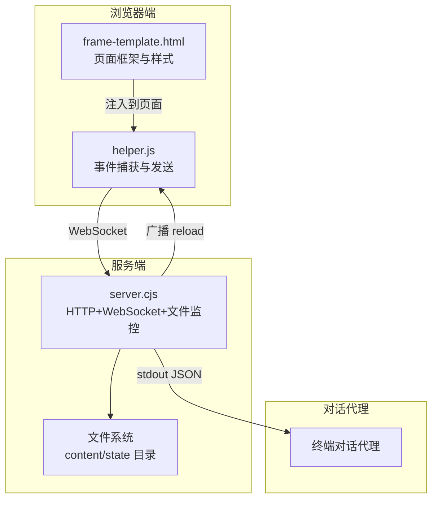
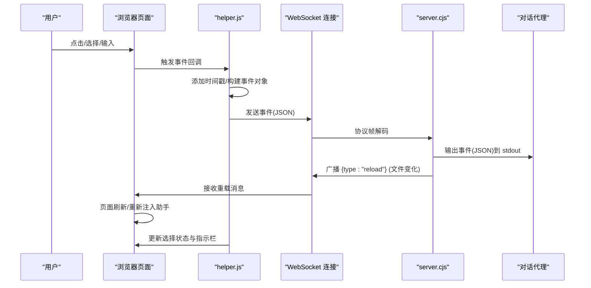
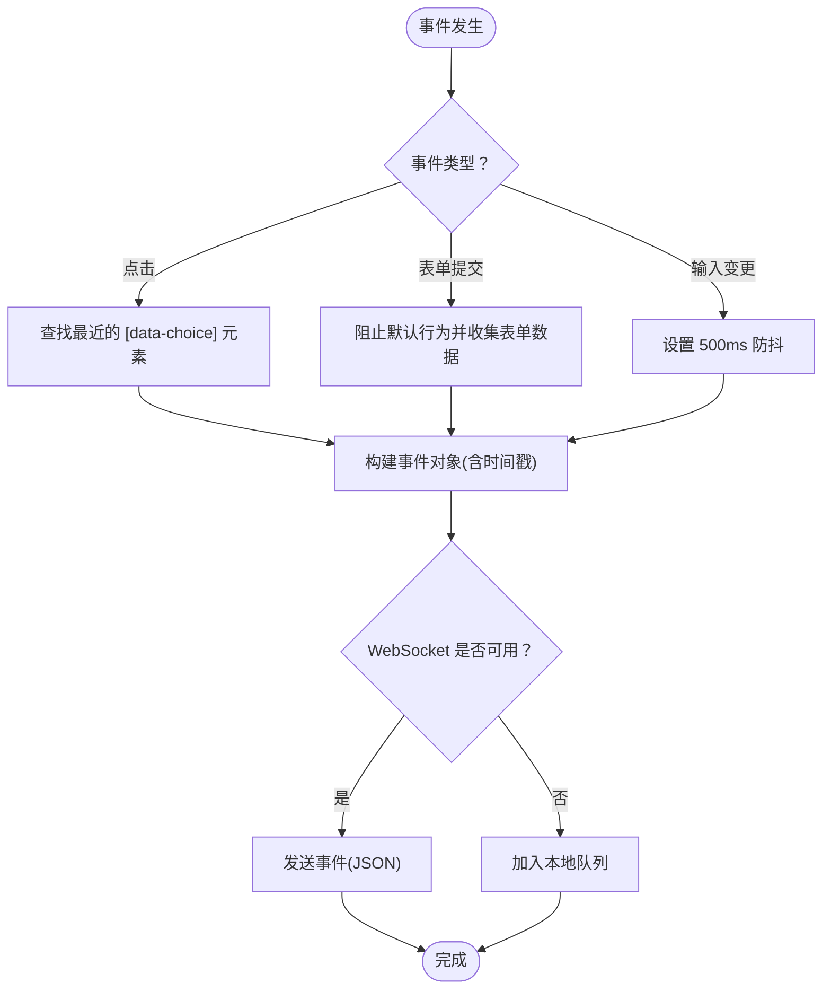
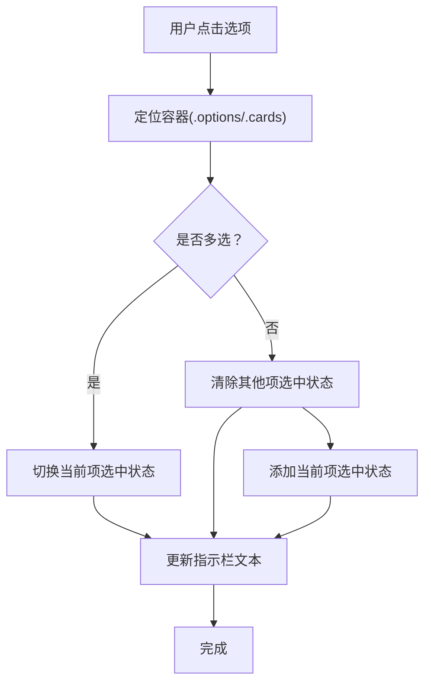
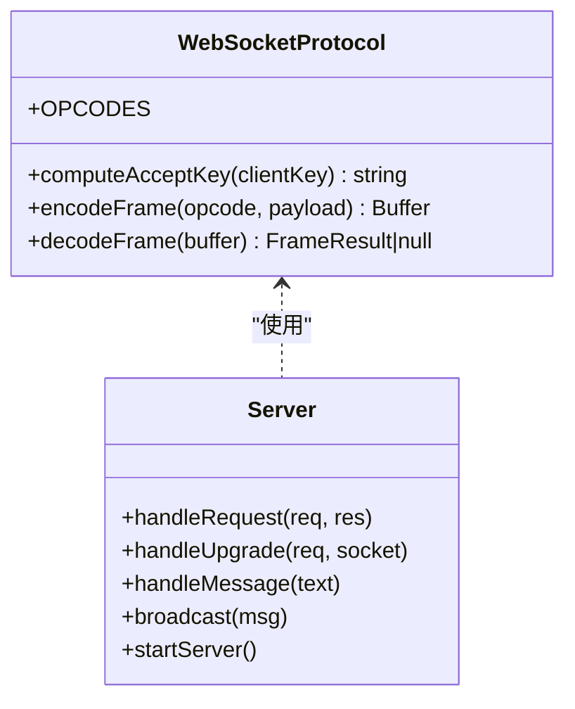
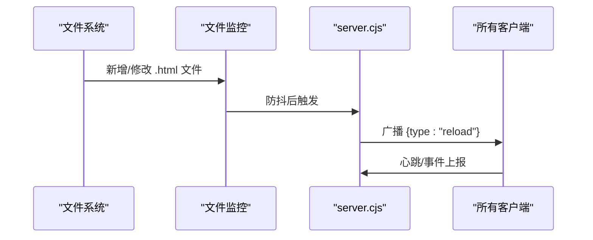
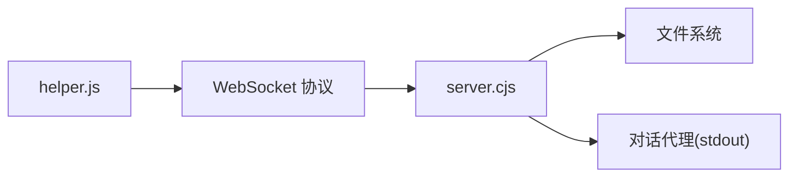

# 交互模型与事件处理

<cite>
**本文档引用的文件**
- [helper.js](file://skills/brainstorming/scripts/helper.js)
- [frame-template.html](file://skills/brainstorming/scripts/frame-template.html)
- [server.cjs](file://skills/brainstorming/scripts/server.cjs)
- [2026-01-17-visual-brainstorming.md](file://docs/plans/2026-01-17-visual-brainstorming.md)
- [visual-companion.md](file://skills/brainstorming/visual-companion.md)
- [server.test.js](file://tests/brainstorm-server/server.test.js)
- [ws-protocol.test.js](file://tests/brainstorm-server/ws-protocol.test.js)
</cite>

## 目录
1. [简介](#简介)
2. [项目结构](#项目结构)
3. [核心组件](#核心组件)
4. [架构总览](#架构总览)
5. [详细组件分析](#详细组件分析)
6. [依赖关系分析](#依赖关系分析)
7. [性能考虑](#性能考虑)
8. [故障排除指南](#故障排除指南)
9. [结论](#结论)
10. [附录](#附录)

## 简介
本文件面向可视化头脑风暴组件的用户交互模型，系统性阐述事件驱动的交互架构：从浏览器端的事件捕获、选择状态同步到多选支持机制；详细说明事件数据格式、时间戳记录与交互历史追踪；解释用户反馈收集流程、事件流处理与状态更新机制；并提供交互设计最佳实践、用户体验优化与无障碍访问支持建议，以及调试方法与示例。

## 项目结构
该组件由三部分组成：
- 浏览器端助手脚本：负责自动捕获用户交互事件并通过 WebSocket 发送到服务端，并在页面上维护选择状态与指示栏。
- 服务端（零依赖 WebSocket 实现）：提供 HTTP 服务与 WebSocket 升级，监听内容目录变化并广播重载消息，将用户事件输出到标准输出供对话代理消费。
- 框架模板：为内容片段提供统一的头部、主题样式、选择指示栏等基础设施。

图表来源
- [helper.js:1-89](file://skills/brainstorming/scripts/helper.js#L1-L89)
- [frame-template.html:1-215](file://skills/brainstorming/scripts/frame-template.html#L1-L215)
- [server.cjs:1-355](file://skills/brainstorming/scripts/server.cjs#L1-L355)

章节来源
- [helper.js:1-89](file://skills/brainstorming/scripts/helper.js#L1-L89)
- [frame-template.html:1-215](file://skills/brainstorming/scripts/frame-template.html#L1-L215)
- [server.cjs:1-355](file://skills/brainstorming/scripts/server.cjs#L1-L355)

## 核心组件
- 事件捕获与发送（浏览器端）
  - 自动捕获点击、表单提交、输入变更等事件，统一添加时间戳后通过 WebSocket 发送。
  - 提供显式 API 以便在需要时手动上报选择。
- 选择状态管理与指示栏
  - 维护当前选择项，支持单选与多选模式，实时更新顶部指示栏文本。
- 服务端 WebSocket 协议实现
  - 完整实现 RFC 6455 的握手计算、帧编码/解码与协议处理。
  - 将用户事件以 JSON 形式输出到 stdout，供代理消费。
- 文件监控与页面刷新
  - 监控 content 目录中的 HTML 文件变化，向所有连接的客户端广播重载消息。

章节来源
- [helper.js:26-88](file://skills/brainstorming/scripts/helper.js#L26-L88)
- [server.cjs:11-72](file://skills/brainstorming/scripts/server.cjs#L11-L72)
- [server.cjs:224-238](file://skills/brainstorming/scripts/server.cjs#L224-L238)
- [server.cjs:276-298](file://skills/brainstorming/scripts/server.cjs#L276-L298)

## 架构总览
交互流从浏览器端开始：用户在页面上进行点击、选择或输入，助手脚本捕获事件并发送到服务端；服务端解析事件并输出到 stdout，同时根据文件变化广播重载消息以刷新页面。页面上的选择状态通过 JavaScript API 同步，指示栏实时反映当前选择情况。

图表来源
- [helper.js:26-88](file://skills/brainstorming/scripts/helper.js#L26-L88)
- [server.cjs:167-238](file://skills/brainstorming/scripts/server.cjs#L167-L238)
- [server.cjs:276-298](file://skills/brainstorming/scripts/server.cjs#L276-L298)

## 详细组件分析

### 事件捕获与发送（helper.js）
- 事件类型与捕获范围
  - 点击：仅捕获带有 `data-choice` 属性的元素，避免干扰常规链接导航。
  - 表单提交：阻止默认行为，收集表单数据并上报。
  - 输入变更：对输入框、文本域、选择框进行防抖处理（500ms），减少事件风暴。
- 时间戳与队列机制
  - 所有事件在发送前添加时间戳，确保事件顺序与可追溯性。
  - 若 WebSocket 未就绪，事件会被暂存到本地队列，待连接建立后批量发送。
- 显式 API
  - 暴露 `window.brainstorm.choice(value, metadata)` 用于显式上报选择事件。

图表来源
- [helper.js:36-88](file://skills/brainstorming/scripts/helper.js#L36-L88)

章节来源
- [helper.js:26-88](file://skills/brainstorming/scripts/helper.js#L26-L88)

### 选择状态同步与指示栏（helper.js + frame-template.html）
- 多选支持
  - 通过容器元素的 `data-multiselect` 属性启用多选模式。
  - 在单选模式下，每次选择会清除其他选项的选中态；在多选模式下，点击切换当前项的选中状态。
- 指示栏更新
  - 点击事件后延迟更新指示栏文本，显示“已选择”数量或具体选项名称，提示用户返回终端继续。
- 框架模板
  - 提供统一的头部、主题样式、指示栏结构与常见 UI 类（选项卡片、网格布局等）。

图表来源
- [helper.js:67-79](file://skills/brainstorming/scripts/helper.js#L67-L79)
- [frame-template.html:82-96](file://skills/brainstorming/scripts/frame-template.html#L82-L96)

章节来源
- [helper.js:64-88](file://skills/brainstorming/scripts/helper.js#L64-L88)
- [frame-template.html:82-96](file://skills/brainstorming/scripts/frame-template.html#L82-L96)

### WebSocket 协议实现（server.cjs）
- 握手与帧处理
  - 实现 RFC 6455 的握手计算、帧编码与解码，严格校验客户端帧必须带掩码。
  - 支持 TEXT、CLOSE、PING、PONG 等操作码，错误帧直接关闭连接。
- 事件处理与状态持久化
  - 将收到的事件以 JSON 形式输出到 stdout，并标注来源字段，便于代理识别。
  - 对包含 `choice` 字段的事件，追加写入 state/events 文件（每行一个 JSON 对象）。
- 生命周期与空闲检测
  - 支持通过环境变量指定拥有者进程 PID，若拥有者进程退出则自动停止。
  - 30 分钟无活动自动退出，防止资源占用。

图表来源
- [server.cjs:11-72](file://skills/brainstorming/scripts/server.cjs#L11-L72)
- [server.cjs:167-238](file://skills/brainstorming/scripts/server.cjs#L167-L238)

章节来源
- [server.cjs:11-72](file://skills/brainstorming/scripts/server.cjs#L11-L72)
- [server.cjs:167-238](file://skills/brainstorming/scripts/server.cjs#L167-L238)
- [server.cjs:319-347](file://skills/brainstorming/scripts/server.cjs#L319-L347)

### 文件监控与页面刷新（server.cjs）
- 内容目录监控
  - 监听 content 目录中的 HTML 文件新增与修改，采用 100ms 防抖避免频繁触发。
  - 新增文件时清空 state/events 并记录日志；更新文件时记录更新日志。
- 广播机制
  - 向所有已连接的客户端广播 `{type:"reload"}`，促使浏览器刷新页面并重新注入助手脚本。

图表来源
- [server.cjs:276-298](file://skills/brainstorming/scripts/server.cjs#L276-L298)

章节来源
- [server.cjs:276-298](file://skills/brainstorming/scripts/server.cjs#L276-L298)

### 事件数据格式与交互历史追踪
- 事件格式
  - 所有事件包含 `type`、`timestamp` 字段；不同类型的事件包含额外字段：
    - 点击事件：`text`、`choice`、`id` 等。
    - 表单提交事件：`formId`、`formName`、`data`。
    - 输入事件：`name`、`id`、`value`、`inputType`。
  - 选择事件（包含 `choice`）会被追加写入 state/events 文件，形成 JSON Lines 格式的历史记录。
- 历史追踪
  - 用户可能多次点击不同选项后再确定最终选择，历史记录能帮助理解其决策路径。
  - 当推送新屏幕时，state/events 会被清空，确保历史与当前屏幕对应。

章节来源
- [helper.js:26-88](file://skills/brainstorming/scripts/helper.js#L26-L88)
- [server.cjs:224-238](file://skills/brainstorming/scripts/server.cjs#L224-L238)
- [visual-companion.md:246-258](file://skills/brainstorming/visual-companion.md#L246-L258)

## 依赖关系分析
- 组件耦合
  - helper.js 与 server.cjs 通过 WebSocket 协议耦合，遵循 RFC 6455 的严格实现。
  - 服务端通过文件系统与浏览器端解耦，采用广播方式通知刷新。
- 外部依赖
  - 服务端实现零外部依赖，仅使用 Node.js 内置模块。
  - 测试覆盖了 WebSocket 协议、HTTP 服务、文件监控与事件持久化。

图表来源
- [helper.js:1-89](file://skills/brainstorming/scripts/helper.js#L1-L89)
- [server.cjs:1-355](file://skills/brainstorming/scripts/server.cjs#L1-L355)

章节来源
- [server.test.js:1-428](file://tests/brainstorm-server/server.test.js#L1-L428)
- [ws-protocol.test.js:1-393](file://tests/brainstorm-server/ws-protocol.test.js#L1-L393)

## 性能考虑
- 事件防抖
  - 输入事件采用 500ms 防抖，降低事件风暴，提升网络与 CPU 效率。
- 帧大小边界
  - 正确处理小/中/大帧的长度编码，避免内存与带宽浪费。
- 文件监控防抖
  - 100ms 防抖减少频繁刷新，适合快速迭代内容。
- 生命周期管理
  - 30 分钟空闲自动退出，避免长期占用资源。

## 故障排除指南
- 无法连接 WebSocket
  - 检查服务端是否启动成功并输出 `server-started` JSON。
  - 确认浏览器控制台无握手失败或协议错误。
- 事件未到达代理
  - 查看服务端 stdout 是否输出带有 `source:"user-event"` 的 JSON。
  - 检查事件是否包含 `choice` 字段，否则不会写入 state/events。
- 页面不刷新
  - 确认 content 目录中存在新的 .html 文件且被监控。
  - 检查服务端是否广播了 `reload` 消息。
- 选择状态异常
  - 确认容器元素包含正确的 `data-multiselect` 属性。
  - 检查指示栏文本是否正确更新。

章节来源
- [server.test.js:94-428](file://tests/brainstorm-server/server.test.js#L94-L428)
- [ws-protocol.test.js:1-393](file://tests/brainstorm-server/ws-protocol.test.js#L1-L393)

## 结论
该可视化头脑风暴组件通过事件驱动的交互模型实现了从浏览器到服务端再到代理的完整闭环：浏览器端自动捕获用户交互并维护选择状态，服务端以零依赖的方式可靠地处理 WebSocket 协议与文件监控，代理通过 stdout 获取结构化事件并结合历史记录进行决策。该设计兼顾了易用性、可扩展性与可维护性，适合在多平台环境中稳定运行。

## 附录

### 交互设计最佳实践
- 问题导向：仅在内容本身具有视觉价值时使用浏览器，避免不必要的复杂度。
- 内容规模：每屏最多 2-4 个选项，聚焦布局与结构而非像素级设计。
- 反馈策略：结合终端文本与 state/events 中的选择历史，综合判断用户偏好。
- 清晰提示：指示栏应明确提示用户下一步操作，如“返回终端继续”。

### 无障碍访问支持建议
- 键盘可达性：为可点击元素提供键盘激活能力（例如 `tabindex` 与回车键处理）。
- 屏幕阅读器友好：为选项与按钮提供语义化的标签与描述。
- 高对比度与字体：利用框架模板的主题变量保证在深浅色模式下的可读性。

### 调试方法与示例
- 启动服务并获取连接信息
  - 使用 start-server.sh 启动服务，读取 state/server-info 获取 URL 与端口。
- 推送内容并观察交互
  - 在 content 目录写入新的 HTML 文件，观察浏览器刷新与指示栏变化。
- 检查事件历史
  - 在下一轮对话前读取 state/events，确认事件序列与最终选择。
- 单元测试参考
  - WebSocket 协议测试覆盖握手、帧编解码与边界条件。
  - 服务器集成测试覆盖 HTTP 服务、WebSocket 通信、文件监控与事件持久化。

章节来源
- [visual-companion.md:33-126](file://skills/brainstorming/visual-companion.md#L33-L126)
- [ws-protocol.test.js:1-393](file://tests/brainstorm-server/ws-protocol.test.js#L1-L393)
- [server.test.js:1-428](file://tests/brainstorm-server/server.test.js#L1-L428)