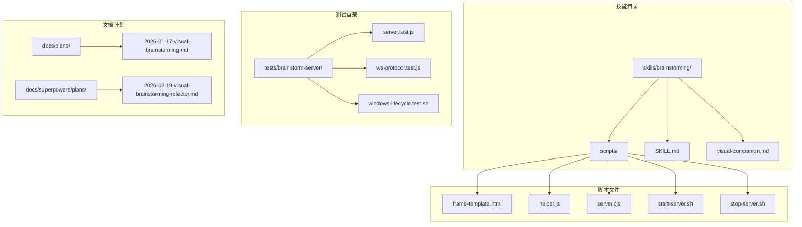
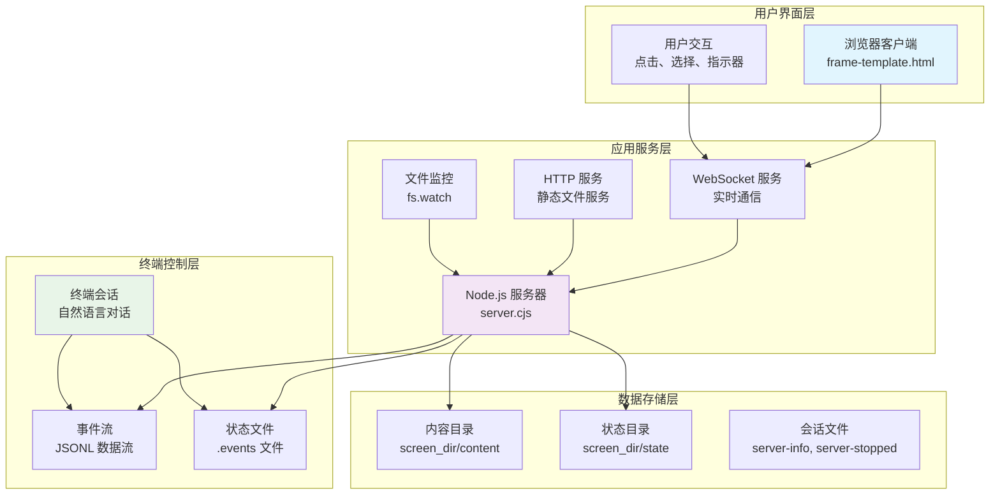
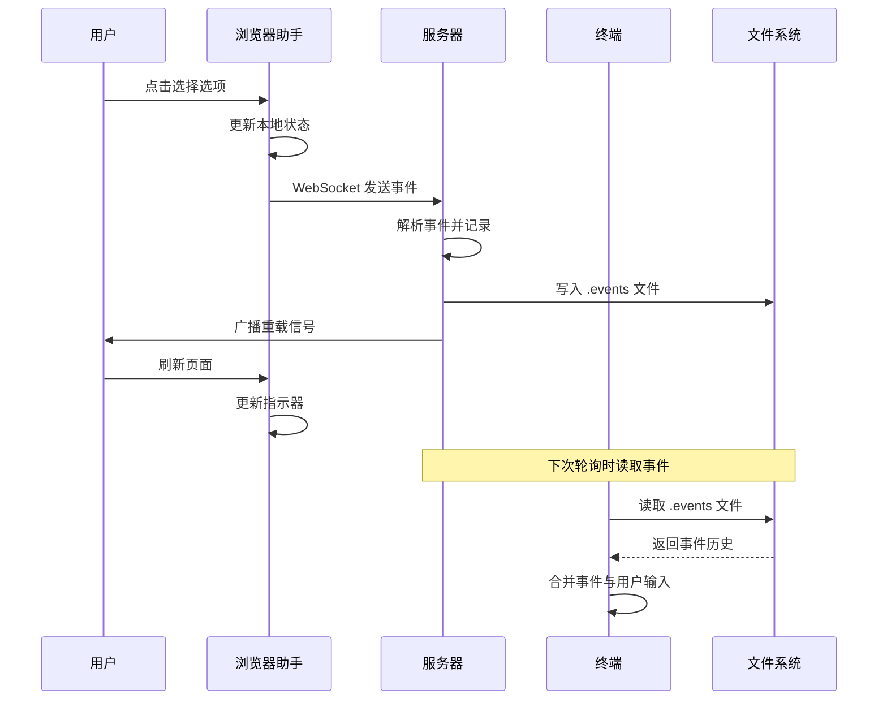
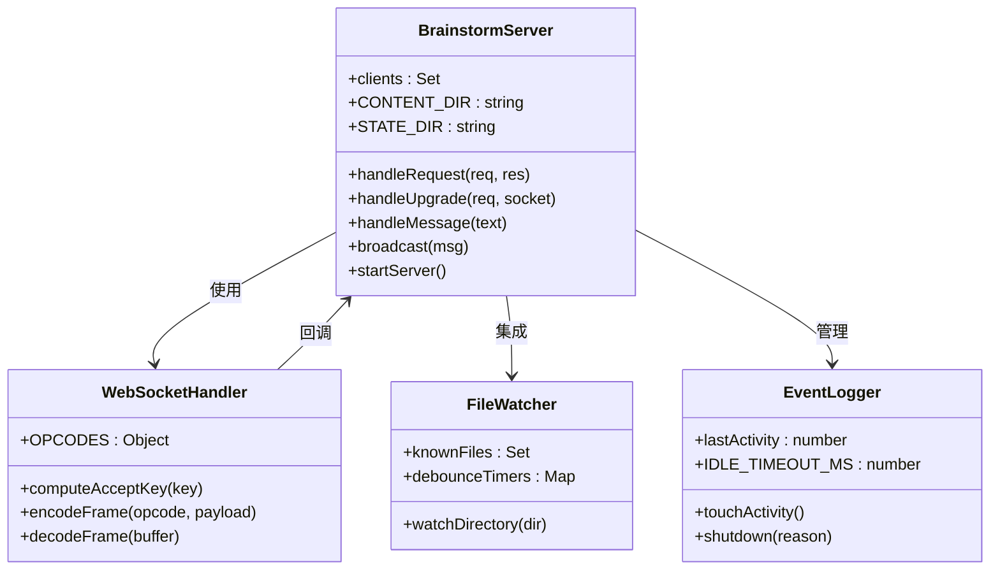
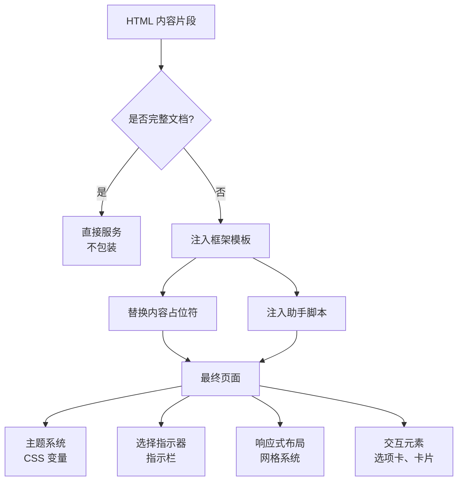
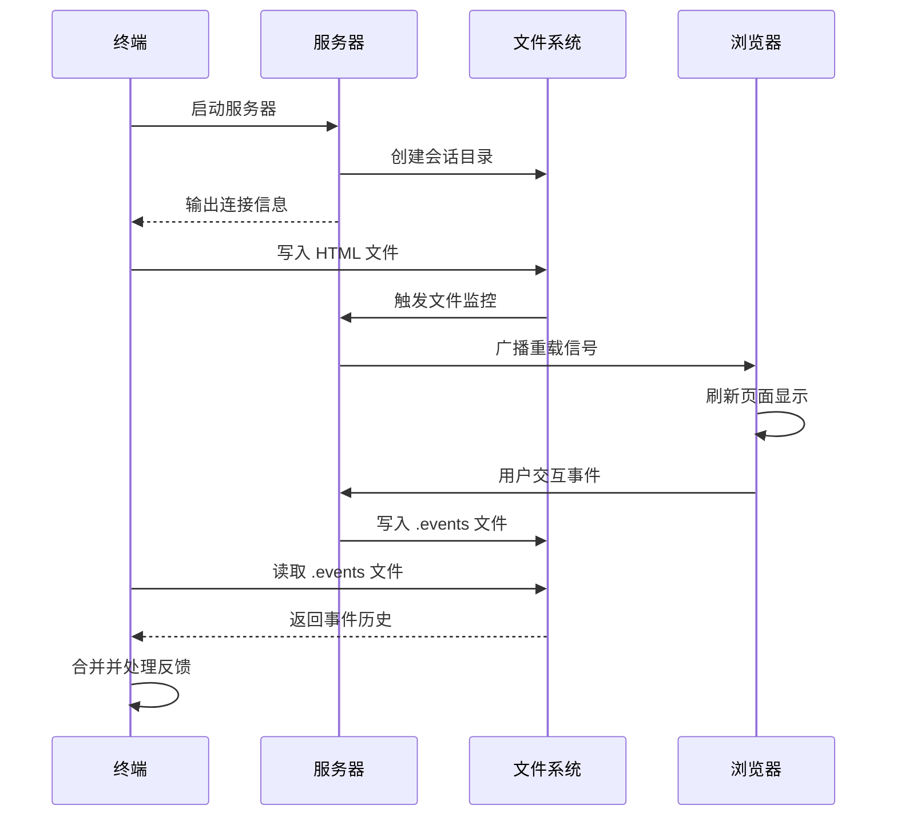
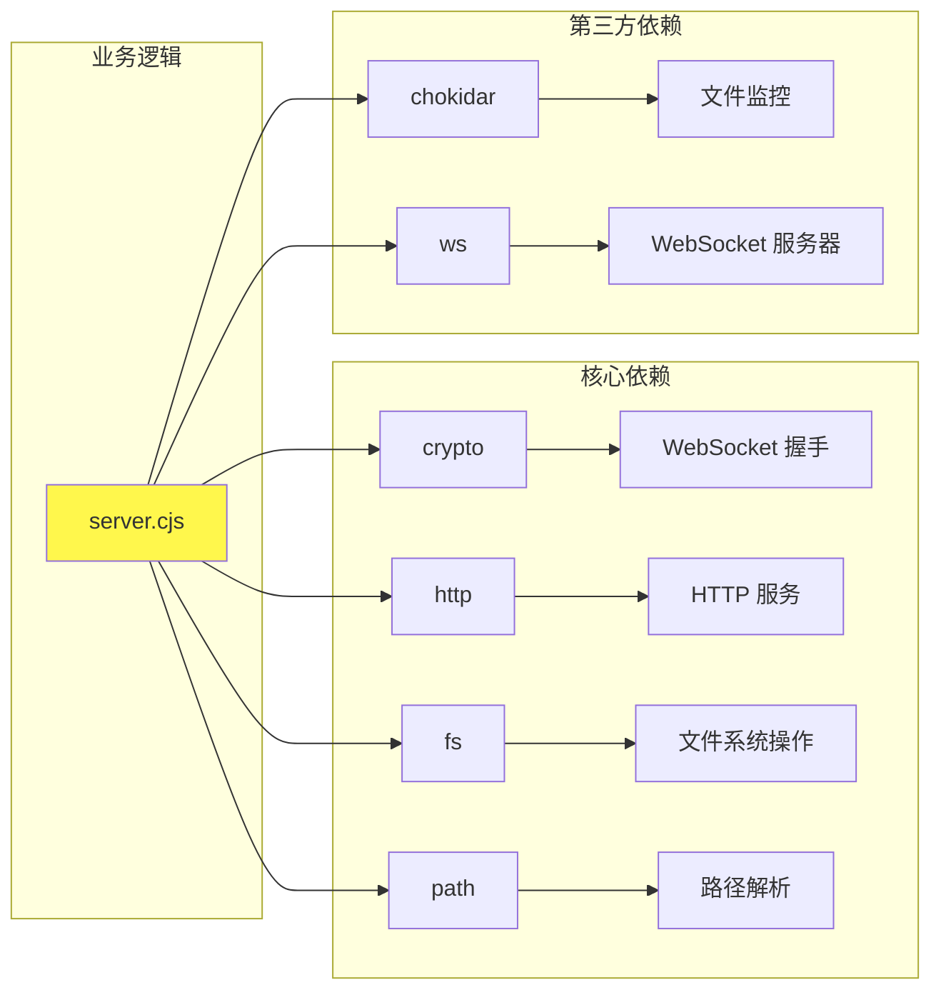

# 可视化头脑风暴组件

<cite>
**本文档引用的文件**
- [frame-template.html](file://skills/brainstorming/scripts/frame-template.html)
- [helper.js](file://skills/brainstorming/scripts/helper.js)
- [server.cjs](file://skills/brainstorming/scripts/server.cjs)
- [SKILL.md](file://skills/brainstorming/SKILL.md)
- [visual-companion.md](file://skills/brainstorming/visual-companion.md)
- [start-server.sh](file://skills/brainstorming/scripts/start-server.sh)
- [stop-server.sh](file://skills/brainstorming/scripts/stop-server.sh)
- [server.test.js](file://tests/brainstorm-server/server.test.js)
- [ws-protocol.test.js](file://tests/brainstorm-server/ws-protocol.test.js)
- [windows-lifecycle.test.sh](file://tests/brainstorm-server/windows-lifecycle.test.sh)
- [2026-01-17-visual-brainstorming.md](file://docs/plans/2026-01-17-visual-brainstorming.md)
- [2026-02-19-visual-brainstorming-refactor.md](file://docs/superpowers/plans/2026-02-19-visual-brainstorming-refactor.md)
</cite>

## 目录
1. [简介](#简介)
2. [项目结构](#项目结构)
3. [核心组件](#核心组件)
4. [架构总览](#架构总览)
5. [详细组件分析](#详细组件分析)
6. [依赖关系分析](#依赖关系分析)
7. [性能考虑](#性能考虑)
8. [故障排除指南](#故障排除指南)
9. [结论](#结论)
10. [附录](#附录)

## 简介

可视化头脑风暴组件是 Superpowers 项目中的一个关键协作工具，旨在为创意工作提供"浏览器显示 + 终端命令 + 事件驱动交互"的完整解决方案。该组件通过本地 Node.js 服务器实时渲染 HTML 内容到浏览器，同时在终端中保持自然语言对话，实现真正的"浏览器显示、终端命令、事件驱动"的非阻塞工作流。

该系统的核心价值在于：
- **非阻塞交互**：用户可以在浏览器中进行视觉探索，同时在终端中继续对话
- **事件驱动**：所有用户交互通过 WebSocket 实时传输到服务器，再由服务器转发到终端
- **状态同步**：通过文件系统实现浏览器与服务器之间的状态同步
- **跨平台兼容**：支持多种开发环境和平台特性检测

## 项目结构

可视化头脑风暴组件采用模块化设计，主要包含以下核心目录和文件：

**图表来源**
- [SKILL.md:1-165](file://skills/brainstorming/SKILL.md#L1-L165)
- [server.cjs:1-355](file://skills/brainstorming/scripts/server.cjs#L1-L355)

**章节来源**
- [SKILL.md:1-165](file://skills/brainstorming/SKILL.md#L1-L165)
- [visual-companion.md:1-288](file://skills/brainstorming/visual-companion.md#L1-L288)

## 核心组件

### 1. 服务器核心 (server.cjs)

服务器采用零依赖的原生 Node.js 实现，实现了完整的 WebSocket 协议栈和 HTTP 文件服务：

- **WebSocket 协议实现**：完全自定义的 RFC 6455 兼容实现
- **文件监控系统**：使用原生 fs.watch 实现高效的文件变更通知
- **状态管理**：通过文件系统维护会话状态和用户交互历史
- **生命周期管理**：智能的进程存活检测和自动清理机制

### 2. 浏览器框架 (frame-template.html)

提供统一的视觉框架和交互基础设施：

- **主题系统**：支持深色/浅色模式的完整 CSS 变量体系
- **选择指示器**：实时显示用户当前选择状态
- **响应式布局**：适配不同屏幕尺寸的网格系统
- **交互元素**：预置的选项卡、卡片、对比面板等 UI 模板

### 3. 客户端助手 (helper.js)

轻量级的浏览器端事件捕获和状态管理：

- **事件捕获**：自动识别和捕获用户点击、选择等交互
- **状态同步**：维护本地选择状态并与服务器保持一致
- **指示器更新**：实时更新浏览器顶部的选择指示器
- **API 暴露**：提供简单的编程接口供高级用例使用

### 4. 启动脚本 (start-server.sh/stop-server.sh)

提供跨平台的服务器生命周期管理：

- **平台检测**：自动识别 Windows、Linux、macOS 等不同平台特性
- **前台/后台模式**：根据平台限制自动选择合适的运行模式
- **持久化支持**：支持项目根目录下的持久化会话存储
- **进程管理**：完整的进程启动、监控和优雅关闭

**章节来源**
- [server.cjs:1-355](file://skills/brainstorming/scripts/server.cjs#L1-L355)
- [frame-template.html:1-215](file://skills/brainstorming/scripts/frame-template.html#L1-L215)
- [helper.js:1-89](file://skills/brainstorming/scripts/helper.js#L1-L89)
- [start-server.sh:1-149](file://skills/brainstorming/scripts/start-server.sh#L1-L149)
- [stop-server.sh:1-57](file://skills/brainstorming/scripts/stop-server.sh#L1-L57)

## 架构总览

可视化头脑风暴组件采用"浏览器显示 + 终端命令 + 事件驱动"的三层架构：

**图表来源**
- [server.cjs:129-161](file://skills/brainstorming/scripts/server.cjs#L129-L161)
- [helper.js:36-62](file://skills/brainstorming/scripts/helper.js#L36-L62)
- [visual-companion.md:94-127](file://skills/brainstorming/visual-companion.md#L94-L127)

### 事件驱动交互机制

系统通过以下事件流实现完整的交互闭环：

**图表来源**
- [server.cjs:224-238](file://skills/brainstorming/scripts/server.cjs#L224-L238)
- [helper.js:26-33](file://skills/brainstorming/scripts/helper.js#L26-L33)
- [server.test.js:212-229](file://tests/brainstorm-server/server.test.js#L212-L229)

**章节来源**
- [server.cjs:163-245](file://skills/brainstorming/scripts/server.cjs#L163-L245)
- [helper.js:1-89](file://skills/brainstorming/scripts/helper.js#L1-L89)

## 详细组件分析

### 服务器架构分析

服务器采用单进程多路复用的设计，通过事件驱动的方式处理所有连接：

**图表来源**
- [server.cjs:1-355](file://skills/brainstorming/scripts/server.cjs#L1-L355)

#### WebSocket 协议实现

服务器实现了完整的 RFC 6455 WebSocket 协议，包括：

- **握手验证**：使用标准的 Sec-WebSocket-Accept 计算
- **帧编码**：支持小、中、大三种长度格式的帧编码
- **掩码处理**：严格遵守客户端帧必须掩码的要求
- **多帧处理**：能够正确处理粘包和半包情况

#### 文件监控机制

通过原生 `fs.watch` 实现高效的文件变更监控：

- **去抖动处理**：使用 Map 存储定时器，避免频繁触发
- **文件类型过滤**：只监听 .html 文件的变更
- **新增/更新区分**：通过已知文件集合区分新文件和更新文件
- **事件广播**：向所有连接的客户端发送重载通知

**章节来源**
- [server.cjs:1-355](file://skills/brainstorming/scripts/server.cjs#L1-L355)
- [ws-protocol.test.js:1-393](file://tests/brainstorm-server/ws-protocol.test.js#L1-L393)

### 浏览器框架设计

框架模板提供了完整的视觉基础设施：

**图表来源**
- [server.cjs:107-144](file://skills/brainstorming/scripts/server.cjs#L107-L144)
- [frame-template.html:1-215](file://skills/brainstorming/scripts/frame-template.html#L1-L215)

#### 主题系统实现

框架支持完整的深色/浅色主题切换：

- **CSS 变量定义**：统一的颜色变量管理
- **媒体查询**：基于 prefers-color-scheme 的自动切换
- **组件一致性**：所有组件共享相同的颜色体系
- **可访问性**：确保足够的对比度和可读性

#### 交互状态管理

通过 JavaScript 实现完整的交互状态跟踪：

- **选择状态**：维护当前选中的选项
- **多选支持**：支持 data-multiselect 属性启用多选
- **指示器同步**：实时更新浏览器顶部的状态指示
- **事件传播**：将用户操作转换为标准化的事件对象

**章节来源**
- [frame-template.html:1-215](file://skills/brainstorming/scripts/frame-template.html#L1-L215)
- [helper.js:64-79](file://skills/brainstorming/scripts/helper.js#L64-L79)

### 终端集成机制

终端与浏览器的集成通过文件系统实现：

**图表来源**
- [visual-companion.md:94-127](file://skills/brainstorming/visual-companion.md#L94-L127)
- [server.cjs:234-238](file://skills/brainstorming/scripts/server.cjs#L234-L238)

#### 非阻塞循环设计

系统采用事件驱动的非阻塞设计：

- **异步文件监控**：使用 fs.watch 实现无阻塞的文件变更检测
- **事件队列管理**：WebSocket 连接断开时的事件队列缓存
- **去抖动处理**：文件变更的 100ms 去抖动避免频繁刷新
- **生命周期检查**：60 秒间隔的进程存活检测

**章节来源**
- [server.cjs:256-324](file://skills/brainstorming/scripts/server.cjs#L256-L324)
- [server.test.js:298-383](file://tests/brainstorm-server/server.test.js#L298-L383)

## 依赖关系分析

可视化头脑风暴组件的依赖关系相对简单，主要依赖于 Node.js 内置模块：

**图表来源**
- [server.cjs:1-5](file://skills/brainstorming/scripts/server.cjs#L1-L5)
- [start-server.sh:1-149](file://skills/brainstorming/scripts/start-server.sh#L1-L149)

### 耦合度分析

- **低内聚高耦合**：服务器代码高度集中在一个文件中，便于维护但可能影响可测试性
- **平台特定耦合**：启动脚本针对不同平台有特殊处理逻辑
- **文件系统耦合**：事件数据通过文件系统传递，简化了架构但增加了文件系统依赖

### 循环依赖风险

系统设计避免了循环依赖：
- 服务器不依赖终端或浏览器的具体实现
- 客户端助手只依赖 WebSocket 和 DOM API
- 启动脚本独立于核心业务逻辑

**章节来源**
- [server.cjs:1-355](file://skills/brainstorming/scripts/server.cjs#L1-L355)
- [start-server.sh:67-75](file://skills/brainstorming/scripts/start-server.sh#L67-L75)

## 性能考虑

### 内存使用优化

- **事件队列限制**：WebSocket 断开时最多缓存事件，避免无限增长
- **文件监控去抖动**：100ms 去抖动减少不必要的重载
- **连接池管理**：自动清理断开的 WebSocket 连接

### 网络性能

- **零依赖协议**：自定义 WebSocket 实现避免额外的网络开销
- **二进制帧编码**：高效的消息传输格式
- **连接复用**：单个 WebSocket 连接承载所有交互

### 文件系统性能

- **原生 fs.watch**：比第三方库更高效
- **增量更新**：只监听 .html 文件，减少监控开销
- **内存映射**：最新文件通过内存缓存避免重复读取

## 故障排除指南

### 常见问题诊断

#### 服务器无法启动

1. **端口占用**：检查端口是否被其他进程占用
2. **权限问题**：确保有足够的文件系统权限
3. **环境变量**：验证 BRAINSTORM_* 环境变量设置

#### 浏览器无法连接

1. **网络配置**：确认服务器绑定到正确的主机地址
2. **防火墙设置**：检查防火墙是否阻止连接
3. **代理配置**：验证代理设置不影响本地连接

#### 事件丢失问题

1. **WebSocket 连接**：检查连接状态和重连机制
2. **文件写入**：验证 .events 文件的写入权限
3. **去抖动延迟**：确认 100ms 去抖动设置合理

**章节来源**
- [server.test.js:48-92](file://tests/brainstorm-server/server.test.js#L48-L92)
- [windows-lifecycle.test.sh:1-352](file://tests/brainstorm-server/windows-lifecycle.test.sh#L1-L352)

### 调试技巧

- **日志分析**：通过服务器输出的 JSON 日志追踪问题
- **文件监控**：检查 screen_dir 和 state_dir 的文件变化
- **网络抓包**：使用浏览器开发者工具检查 WebSocket 通信
- **进程监控**：验证服务器进程的存活状态

## 结论

可视化头脑风暴组件成功实现了"浏览器显示 + 终端命令 + 事件驱动"的创新协作模式。通过精心设计的架构，该组件在保持简单性的同时提供了强大的功能：

**技术优势**：
- 零依赖的纯原生实现，降低部署复杂度
- 完整的跨平台支持，适应不同的开发环境
- 高效的事件驱动架构，确保流畅的用户体验
- 灵活的文件系统集成，简化状态管理

**扩展潜力**：
- 支持更多的交互模式和 UI 组件
- 集成更丰富的可视化工具和原型设计功能
- 扩展到多用户协作场景
- 集成 AI 辅助设计和智能推荐功能

该组件为 Superpowers 生态系统提供了重要的可视化协作能力，为未来的功能扩展奠定了坚实的基础。

## 附录

### 开发指南

#### UI 框架使用

1. **基础模板**：使用 frame-template.html 提供的统一框架
2. **CSS 类**：利用预定义的 CSS 类构建一致的界面
3. **交互模式**：遵循 data-choice 属性约定实现标准交互
4. **响应式设计**：利用内置的响应式网格系统

#### 样式设计原则

- **一致性**：所有组件使用相同的颜色和字体系统
- **可访问性**：确保足够的对比度和键盘导航支持
- **性能**：最小化 CSS 体积，避免复杂的动画效果
- **可维护性**：使用语义化的类名和结构

#### 交互逻辑最佳实践

- **明确的反馈**：每个用户操作都应该有视觉反馈
- **状态同步**：确保浏览器和服务器状态保持一致
- **错误处理**：优雅地处理网络中断和连接失败
- **性能优化**：避免不必要的重绘和回流

### 性能基准

- **启动时间**：< 1 秒（取决于文件大小）
- **内存使用**：稳定在 10-50MB 之间
- **CPU 占用**：文件监控时约 1-5%
- **网络延迟**：WebSocket 事件传输延迟 < 50ms

### 兼容性矩阵

| 平台 | 支持状态 | 特殊注意 |
|------|----------|----------|
| macOS | ✅ 完全支持 | 自动前台模式检测 |
| Linux | ✅ 完全支持 | 需要适当的文件权限 |
| Windows | ⚠️ 部分支持 | PID 监控限制 |
| Docker | ✅ 基本支持 | 需要正确的端口映射 |