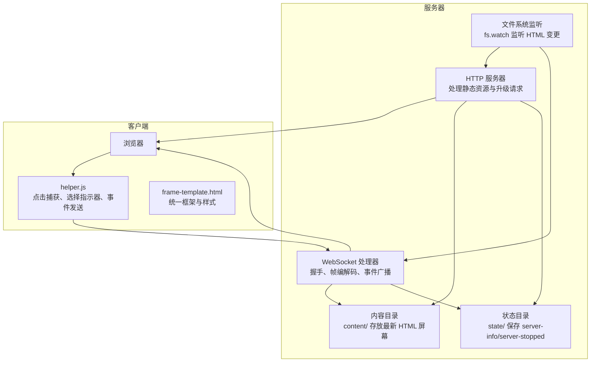
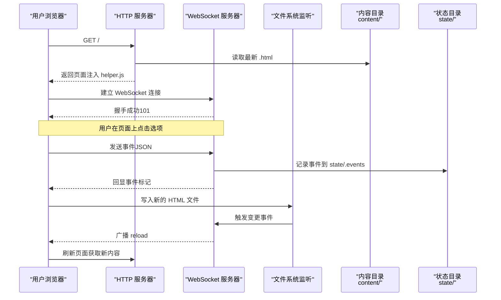
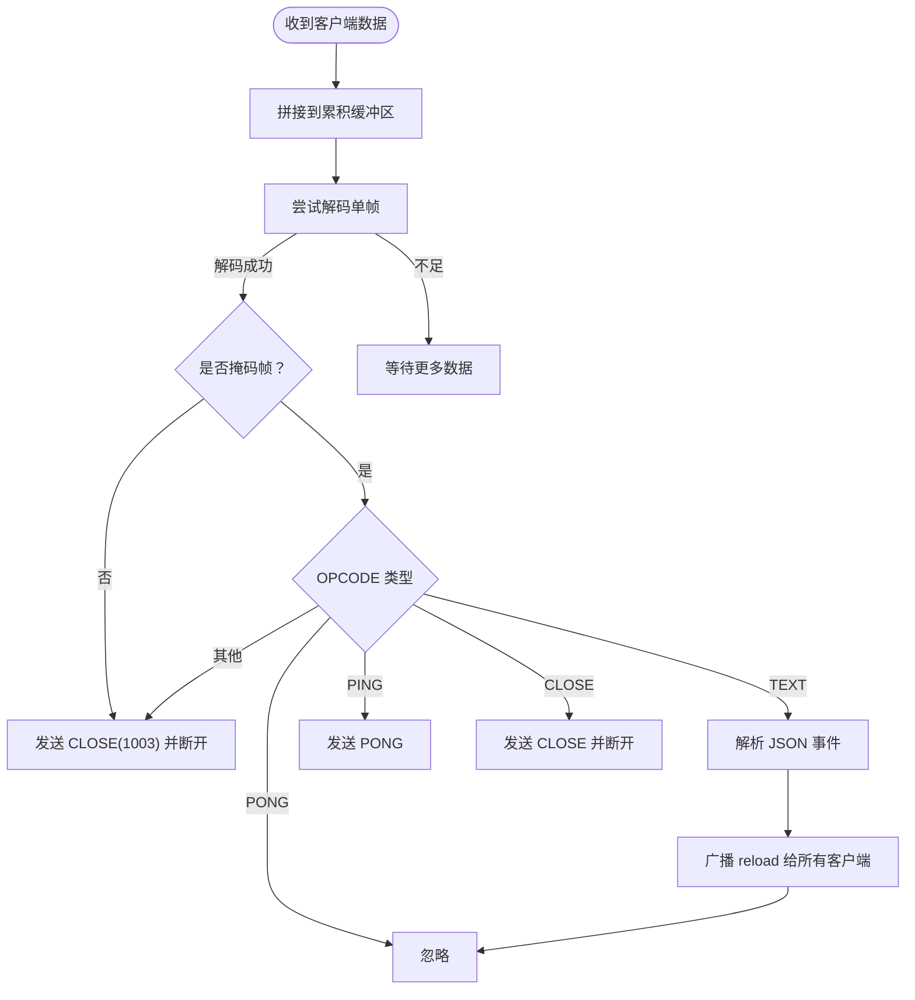
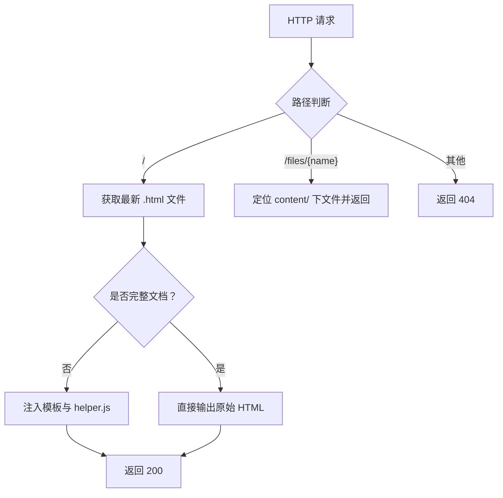
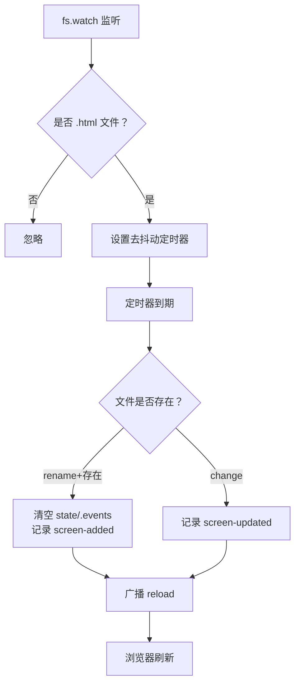
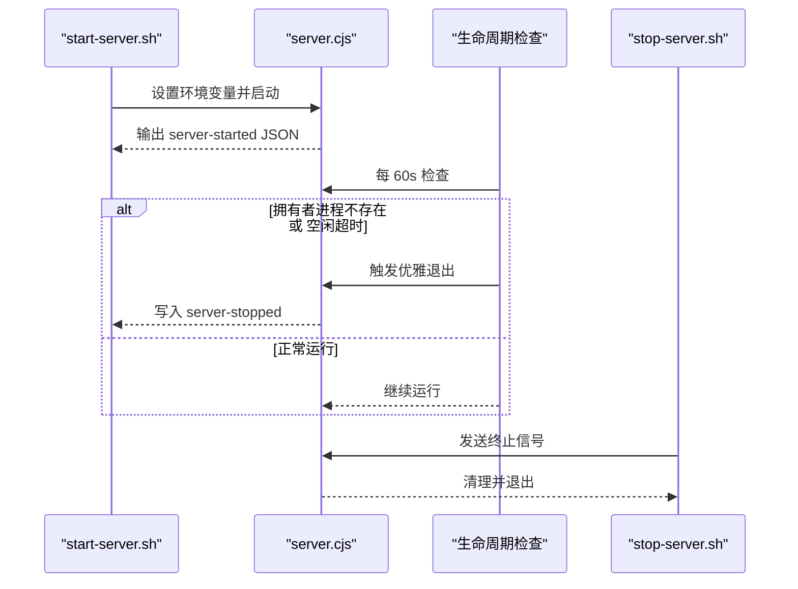
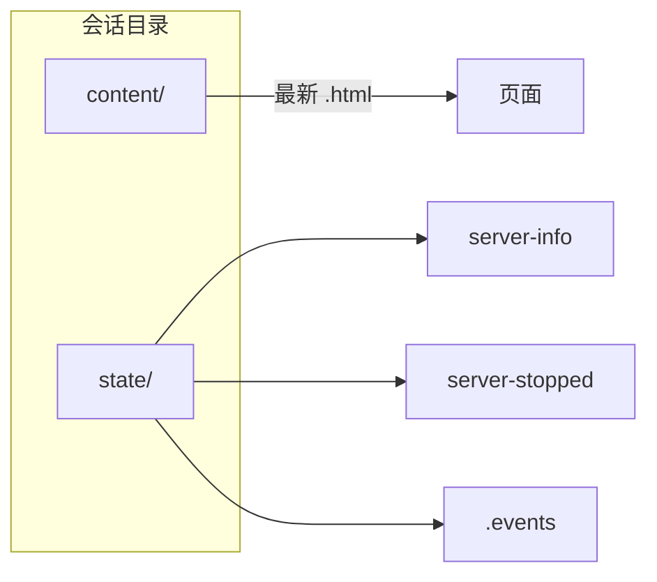
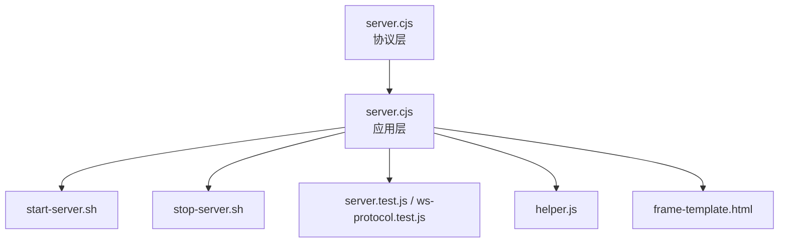

# 架构设计

<cite>
**本文引用的文件**
- [server.cjs](file://skills/brainstorming/scripts/server.cjs)
- [start-server.sh](file://skills/brainstorming/scripts/start-server.sh)
- [stop-server.sh](file://skills/brainstorming/scripts/stop-server.sh)
- [frame-template.html](file://skills/brainstorming/scripts/frame-template.html)
- [helper.js](file://skills/brainstorming/scripts/helper.js)
- [visual-companion.md](file://skills/brainstorming/visual-companion.md)
- [server.test.js](file://tests/brainstorm-server/server.test.js)
- [ws-protocol.test.js](file://tests/brainstorm-server/ws-protocol.test.js)
- [windows-lifecycle.test.sh](file://tests/brainstorm-server/windows-lifecycle.test.sh)
- [2026-03-11-zero-dep-brainstorm-server.md](file://docs/superpowers/plans/2026-03-11-zero-dep-brainstorm-server.md)
- [2026-02-19-visual-brainstorming-refactor.md](file://docs/superpowers/plans/2026-02-19-visual-brainstorming-refactor.md)
- [README.md](file://README.md)
</cite>

## 目录
1. [简介](#简介)
2. [项目结构](#项目结构)
3. [核心组件](#核心组件)
4. [架构总览](#架构总览)
5. [详细组件分析](#详细组件分析)
6. [依赖关系分析](#依赖关系分析)
7. [性能考量](#性能考量)
8. [故障排除指南](#故障排除指南)
9. [结论](#结论)
10. [附录](#附录)

## 简介
本文件面向“可视化头脑风暴组件”的服务器架构，系统化阐述基于 Node.js 的 WebSocket 服务器实现，涵盖文件监听机制、自动刷新、跨平台兼容性设计、服务器启动流程、会话管理与生命周期控制、项目持久化存储与临时清理策略、配置参数与网络绑定、安全注意事项、部署指南、性能优化与故障排除方法。目标是帮助开发者快速理解并正确使用该组件，同时为维护者提供深入的技术参考。

## 项目结构
可视化头脑风暴组件由以下关键部分组成：
- 服务器核心：基于 Node.js 内置模块实现的 HTTP/WebSocket 服务器，负责内容分发、事件收集与广播。
- 客户端脚本：浏览器侧 helper.js 提供点击捕获、选择指示器更新与 WebSocket 事件发送。
- 模板系统：frame-template.html 提供统一的页面框架与样式，支持内容片段注入。
- 启停脚本：start-server.sh 负责会话目录创建、环境变量注入、前台/后台模式切换与进程守护；stop-server.sh 负责优雅停止与目录清理。
- 测试体系：单元测试覆盖 WebSocket 协议层，集成测试覆盖 HTTP 服务、WebSocket 通信、文件监听与事件写入。

**图表来源**
- [server.cjs:129-161](file://skills/brainstorming/scripts/server.cjs#L129-L161)
- [server.cjs:167-222](file://skills/brainstorming/scripts/server.cjs#L167-L222)
- [server.cjs:276-299](file://skills/brainstorming/scripts/server.cjs#L276-L299)
- [frame-template.html:1-215](file://skills/brainstorming/scripts/frame-template.html#L1-L215)
- [helper.js:1-89](file://skills/brainstorming/scripts/helper.js#L1-L89)

**章节来源**
- [server.cjs:1-355](file://skills/brainstorming/scripts/server.cjs#L1-L355)
- [start-server.sh:1-149](file://skills/brainstorming/scripts/start-server.sh#L1-L149)
- [stop-server.sh:1-57](file://skills/brainstorming/scripts/stop-server.sh#L1-L57)
- [frame-template.html:1-215](file://skills/brainstorming/scripts/frame-template.html#L1-L215)
- [helper.js:1-89](file://skills/brainstorming/scripts/helper.js#L1-L89)
- [visual-companion.md:1-288](file://skills/brainstorming/visual-companion.md#L1-L288)

## 核心组件
- WebSocket 协议实现（RFC 6455）
  - 握手计算、文本帧编码/解码、PING/PONG、关闭帧处理。
  - 支持小/中/大长度帧，严格校验掩码位与长度字段。
- HTTP 服务器
  - 首页返回最新 HTML 屏幕（自动包装或原样直出），/files/ 路径提供静态资源访问。
  - 注入 helper.js 到页面，确保交互能力与事件上报。
- 文件监听与自动刷新
  - 使用 fs.watch 监听 content/ 下的 .html 变更，去抖动后向所有 WebSocket 客户端广播 reload。
  - 新增屏幕时清空 state/ 下的事件文件，避免历史数据污染。
- 会话管理与生命周期
  - 通过 start-server.sh 创建唯一会话目录，记录 PID 与日志。
  - 生命周期检查：定期检测拥有者进程存活与空闲超时（默认 30 分钟）。
- 配置与环境变量
  - BRAINSTORM_PORT、BRAINSTORM_HOST、BRAINSTORM_URL_HOST、BRAINSTORM_DIR、BRAINSTORM_OWNER_PID。
- 安全与兼容性
  - 仅允许本地回环绑定默认值，远程访问需显式指定主机；Windows 平台自动前台运行以避免被回收。
  - 严格校验客户端帧掩码，拒绝未掩码帧；对异常输入进行容错处理。

**章节来源**
- [server.cjs:8-72](file://skills/brainstorming/scripts/server.cjs#L8-L72)
- [server.cjs:129-161](file://skills/brainstorming/scripts/server.cjs#L129-L161)
- [server.cjs:276-299](file://skills/brainstorming/scripts/server.cjs#L276-L299)
- [server.cjs:301-347](file://skills/brainstorming/scripts/server.cjs#L301-L347)
- [start-server.sh:17-149](file://skills/brainstorming/scripts/start-server.sh#L17-L149)
- [stop-server.sh:1-57](file://skills/brainstorming/scripts/stop-server.sh#L1-L57)

## 架构总览
下图展示从浏览器到服务器再到文件系统的完整数据流与控制流：

**图表来源**
- [server.cjs:129-161](file://skills/brainstorming/scripts/server.cjs#L129-L161)
- [server.cjs:167-222](file://skills/brainstorming/scripts/server.cjs#L167-L222)
- [server.cjs:276-299](file://skills/brainstorming/scripts/server.cjs#L276-L299)
- [server.cjs:324-324](file://skills/brainstorming/scripts/server.cjs#L324-L324)
- [helper.js:26-46](file://skills/brainstorming/scripts/helper.js#L26-L46)

**章节来源**
- [server.cjs:1-355](file://skills/brainstorming/scripts/server.cjs#L1-L355)
- [helper.js:1-89](file://skills/brainstorming/scripts/helper.js#L1-L89)

## 详细组件分析

### WebSocket 协议实现（RFC 6455）
- 握手计算：基于 Sec-WebSocket-Key 与固定 Magic 字符串生成 Accept 值。
- 帧编解码：
  - 编码：根据负载长度选择 2/4/10 字节头部，服务器帧不掩码。
  - 解码：严格要求客户端帧掩码，支持 126/127 扩展长度，多帧拼接。
- 控制帧：PING/PONG 自动响应；CLOSE 正常关闭；未知操作码返回 1003 并断开。
- 错误处理：解析失败或非法帧时主动关闭连接并清理集合。

**图表来源**
- [server.cjs:39-72](file://skills/brainstorming/scripts/server.cjs#L39-L72)
- [server.cjs:167-222](file://skills/brainstorming/scripts/server.cjs#L167-L222)
- [ws-protocol.test.js:1-393](file://tests/brainstorm-server/ws-protocol.test.js#L1-L393)

**章节来源**
- [server.cjs:8-72](file://skills/brainstorming/scripts/server.cjs#L8-L72)
- [ws-protocol.test.js:1-393](file://tests/brainstorm-server/ws-protocol.test.js#L1-L393)

### HTTP 服务器与页面渲染
- 首页逻辑：
  - 若存在最新 .html，则按是否为完整文档决定直接输出或注入模板包装。
  - 注入 helper.js，确保页面具备点击捕获与事件上报能力。
- 静态资源：
  - /files/ 路径映射到 content/ 下的文件，自动推断 MIME 类型。
- 404 处理：非根路径与不存在的文件返回 404。

**图表来源**
- [server.cjs:129-161](file://skills/brainstorming/scripts/server.cjs#L129-L161)
- [frame-template.html:1-215](file://skills/brainstorming/scripts/frame-template.html#L1-L215)
- [helper.js:1-89](file://skills/brainstorming/scripts/helper.js#L1-L89)

**章节来源**
- [server.cjs:129-161](file://skills/brainstorming/scripts/server.cjs#L129-L161)
- [frame-template.html:1-215](file://skills/brainstorming/scripts/frame-template.html#L1-L215)
- [helper.js:1-89](file://skills/brainstorming/scripts/helper.js#L1-L89)

### 文件监听与自动刷新
- 监听策略：
  - 使用 fs.watch 监控 content/ 目录下的 .html 文件变更。
  - 对同文件名的多次变更进行去抖动（100ms），合并触发一次广播。
- 事件语义：
  - rename 且文件存在：判定为新增屏幕，清空 state/.events，记录 screen-added。
  - change：记录 screen-updated。
  - 广播 reload，浏览器自动刷新获取最新内容。
- 错误处理：监听器错误统一记录，不影响主流程。

**图表来源**
- [server.cjs:276-299](file://skills/brainstorming/scripts/server.cjs#L276-L299)
- [server.cjs:324-324](file://skills/brainstorming/scripts/server.cjs#L324-L324)

**章节来源**
- [server.cjs:276-299](file://skills/brainstorming/scripts/server.cjs#L276-L299)

### 会话管理与生命周期控制
- 会话目录：
  - start-server.sh 生成唯一会话 ID，创建 content/ 与 state/ 子目录。
  - 支持 --project-dir 将会话持久化至项目根目录，便于复用与版本控制。
- 进程守护与前台/后台模式：
  - 默认后台运行，捕获输出到日志文件；若检测到环境会回收后台进程（如 Windows/Git Bash、CI 环境），自动切换前台模式。
  - 前台模式下直接将 PID 写入 state/.server.pid。
- 生命周期检查：
  - 每 60 秒检查一次：若拥有者进程不存在则优雅退出；若超过空闲超时（默认 30 分钟）也退出。
  - Windows 平台由于 PID 命名空间问题，禁用 OWNER_PID 监控，仅依赖空闲超时。
- 优雅停止：
  - stop-server.sh 通过 PID 发送信号，等待最多约 2 秒；仍存活则强制 SIGKILL。
  - 清理 PID 文件与日志；仅删除 /tmp 下的临时目录，保留项目内持久化目录。

**图表来源**
- [start-server.sh:77-149](file://skills/brainstorming/scripts/start-server.sh#L77-L149)
- [server.cjs:301-347](file://skills/brainstorming/scripts/server.cjs#L301-L347)
- [windows-lifecycle.test.sh:120-351](file://tests/brainstorm-server/windows-lifecycle.test.sh#L120-L351)
- [stop-server.sh:1-57](file://skills/brainstorming/scripts/stop-server.sh#L1-L57)

**章节来源**
- [start-server.sh:1-149](file://skills/brainstorming/scripts/start-server.sh#L1-L149)
- [server.cjs:301-347](file://skills/brainstorming/scripts/server.cjs#L301-L347)
- [windows-lifecycle.test.sh:1-352](file://tests/brainstorm-server/windows-lifecycle.test.sh#L1-L352)
- [stop-server.sh:1-57](file://skills/brainstorming/scripts/stop-server.sh#L1-L57)

### 事件收集与状态目录结构
- 事件收集：
  - 浏览器点击事件通过 helper.js 发送到服务器，服务器解析后打印带 source 标记的日志，并将包含 choice 的事件追加到 state/.events。
- 状态目录：
  - server-info：服务器启动信息（URL、端口、目录等）。
  - server-stopped：服务器停止原因与时间戳。
  - .events：当前屏幕的用户交互事件流（JSON Lines）。
- 目录结构：
  - content/：存放最新 HTML 屏幕文件。
  - state/：存放 server-info、server-stopped、.events 等状态文件。

**图表来源**
- [server.cjs:232-238](file://skills/brainstorming/scripts/server.cjs#L232-L238)
- [server.cjs:303-309](file://skills/brainstorming/scripts/server.cjs#L303-L309)
- [visual-companion.md:276-288](file://skills/brainstorming/visual-companion.md#L276-L288)

**章节来源**
- [server.cjs:232-238](file://skills/brainstorming/scripts/server.cjs#L232-L238)
- [server.cjs:303-309](file://skills/brainstorming/scripts/server.cjs#L303-L309)
- [visual-companion.md:276-288](file://skills/brainstorming/visual-companion.md#L276-L288)

### 配置参数与网络绑定
- 环境变量
  - BRAINSTORM_PORT：服务器端口，默认随机高段端口。
  - BRAINSTORM_HOST：绑定地址，默认 127.0.0.1。
  - BRAINSTORM_URL_HOST：用于显示的主机名，默认根据 HOST 推断。
  - BRAINSTORM_DIR：会话目录，默认 /tmp/brainstorm。
  - BRAINSTORM_OWNER_PID：拥有者进程 PID，用于生命周期监控。
- 网络绑定
  - 默认仅绑定本地回环，远程访问需显式传入 --host 0.0.0.0，并配合 --url-host 指定可访问域名/IP。
- 安全注意事项
  - 不要将服务器暴露到公网，除非明确需要远程访问。
  - 在容器/云环境中，务必使用非回环地址绑定并限制访问源。

**章节来源**
- [server.cjs:76-82](file://skills/brainstorming/scripts/server.cjs#L76-L82)
- [start-server.sh:8-52](file://skills/brainstorming/scripts/start-server.sh#L8-L52)
- [visual-companion.md:83-93](file://skills/brainstorming/visual-companion.md#L83-L93)

### 部署指南
- 本地开发
  - 使用 start-server.sh --project-dir 指定项目目录，确保 .superpowers/brainstorm/ 不被 .gitignore 忽略。
  - 在 Windows/Codex 等环境中，遵循脚本自动检测的前台/后台模式。
- 远程/容器部署
  - 显式绑定 --host 0.0.0.0，并设置 --url-host 为可访问域名。
  - 将会话目录挂载到持久化存储，避免重启丢失。
- 平台适配
  - Windows/Git Bash：自动前台模式，避免被回收。
  - CI 环境：自动前台模式，确保服务器在对话轮次间存活。

**章节来源**
- [visual-companion.md:50-82](file://skills/brainstorming/visual-companion.md#L50-L82)
- [start-server.sh:62-75](file://skills/brainstorming/scripts/start-server.sh#L62-L75)
- [start-server.sh:63-65](file://skills/brainstorming/scripts/start-server.sh#L63-L65)

## 依赖关系分析
- 内部模块耦合
  - server.cjs 作为单一入口，导出协议函数供单元测试复用。
  - helper.js 与 frame-template.html 通过字符串注入方式集成到页面。
- 外部依赖
  - 测试阶段使用 ws 包作为 WebSocket 客户端，生产环境无需额外依赖。
- 循环依赖
  - 无循环依赖，模块职责清晰：协议层、应用层、脚本层分离。

**图表来源**
- [server.cjs:354-355](file://skills/brainstorming/scripts/server.cjs#L354-L355)
- [server.test.js:1-428](file://tests/brainstorm-server/server.test.js#L1-L428)
- [ws-protocol.test.js:1-393](file://tests/brainstorm-server/ws-protocol.test.js#L1-L393)
- [start-server.sh:1-149](file://skills/brainstorming/scripts/start-server.sh#L1-L149)
- [stop-server.sh:1-57](file://skills/brainstorming/scripts/stop-server.sh#L1-L57)

**章节来源**
- [server.cjs:354-355](file://skills/brainstorming/scripts/server.cjs#L354-L355)
- [server.test.js:1-428](file://tests/brainstorm-server/server.test.js#L1-L428)
- [ws-protocol.test.js:1-393](file://tests/brainstorm-server/ws-protocol.test.js#L1-L393)

## 性能考量
- 文件监听去抖动
  - 100ms 去抖动减少频繁广播与页面刷新，适合快速迭代场景。
- 广播模型
  - 使用 Set 维护客户端集合，广播采用同步写入，建议在高并发场景评估批量写入与背压策略。
- I/O 与磁盘
  - 事件文件采用追加写，注意磁盘空间与日志轮转策略。
- 跨平台差异
  - Windows 上 fs.watch 行为与 macOS/Linux 有差异（rename 无法区分新建与覆盖），代码通过已知文件集规避。
- 资源类型
  - 静态资源按扩展名映射 MIME 类型，避免错误的 Content-Type 导致缓存问题。

[本节为通用指导，无需特定文件引用]

## 故障排除指南
- 服务器无法启动
  - 检查端口占用与权限；确认环境变量设置正确。
  - 查看 state/server-info 是否存在；若不存在，检查日志文件。
- 页面不刷新
  - 确认 content/ 下确有 .html 文件且最近修改时间最新。
  - 检查浏览器 WebSocket 是否连接正常，控制台是否有错误。
- 事件未记录
  - 确认事件包含 choice 字段；检查 state/.events 是否被清空（新屏幕推送时会清空）。
- Windows 进程被回收
  - 自动前台模式生效；若仍失败，手动使用 --foreground 并在平台支持的后台执行机制下运行。
- 远程访问不可达
  - 确认 --host 与 --url-host 设置；检查防火墙与网络策略。

**章节来源**
- [server.test.js:94-422](file://tests/brainstorm-server/server.test.js#L94-L422)
- [windows-lifecycle.test.sh:1-352](file://tests/brainstorm-server/windows-lifecycle.test.sh#L1-L352)
- [visual-companion.md:83-93](file://skills/brainstorming/visual-companion.md#L83-L93)

## 结论
该可视化头脑风暴服务器以零依赖的 Node.js 实现，结合文件系统监听与 WebSocket 广播，构建了轻量、稳定且跨平台的“浏览器显示 + 终端交互”工作流。通过清晰的会话目录结构、完善的生命周期管理与严格的协议实现，满足从本地开发到远程部署的多种场景需求。建议在生产环境中结合持久化存储与日志轮转策略，进一步提升稳定性与可观测性。

[本节为总结性内容，无需特定文件引用]

## 附录

### 零依赖重构与设计演进
- 零依赖方案：将原有 vendored node_modules 替换为单文件 server.js，仅使用 Node 内置模块实现 WebSocket 协议与 HTTP 服务。
- 设计目标：简化部署、降低攻击面、提升可移植性。
- 测试保障：保留并扩展单元与集成测试，确保协议边界与端到端行为一致。

**章节来源**
- [2026-03-11-zero-dep-brainstorm-server.md:1-480](file://docs/superpowers/plans/2026-03-11-zero-dep-brainstorm-server.md#L1-L480)
- [2026-02-19-visual-brainstorming-refactor.md:1-524](file://docs/superpowers/plans/2026-02-19-visual-brainstorming-refactor.md#L1-L524)

### 相关文档与技能
- README 中概述了 Superpowers 的整体工作流与技能体系，可视化头脑风暴作为前置设计环节的重要组成部分。
  
**章节来源**
- [README.md:108-125](file://README.md#L108-L125)