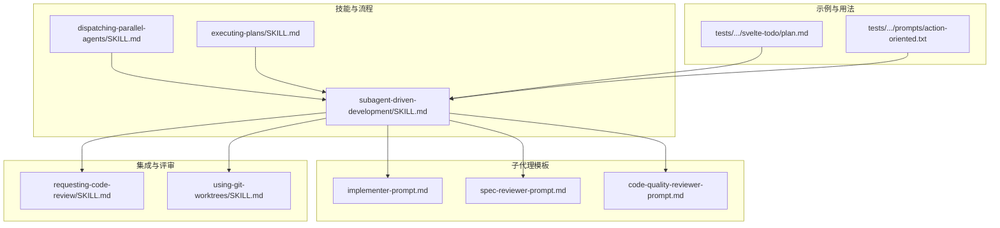
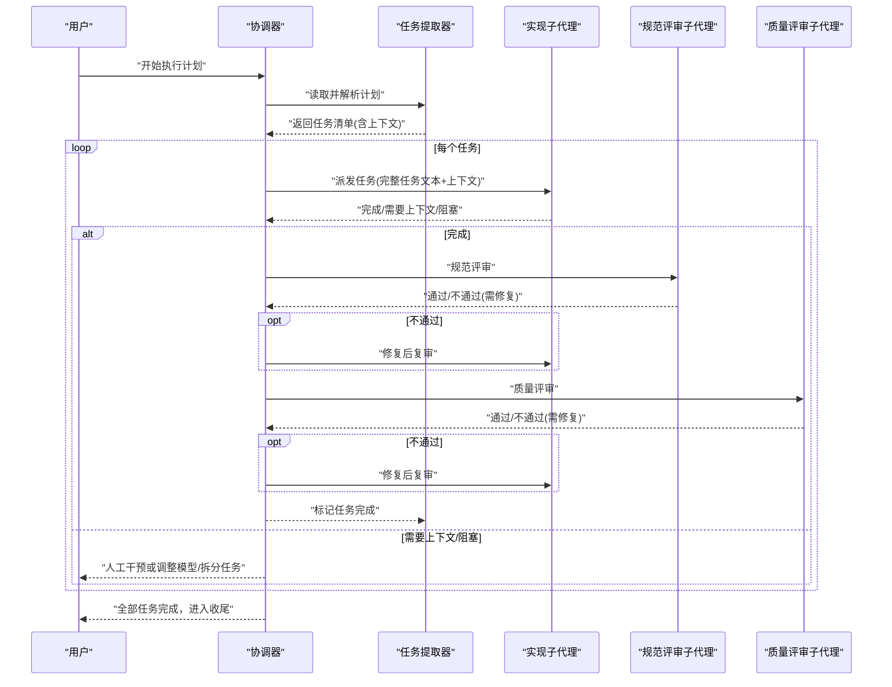
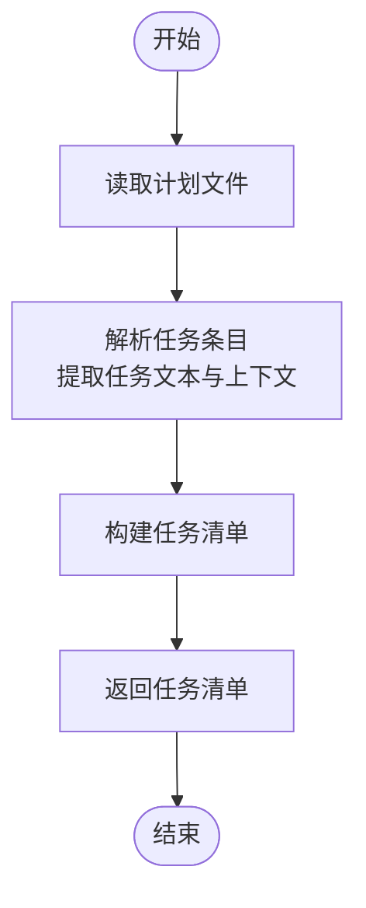
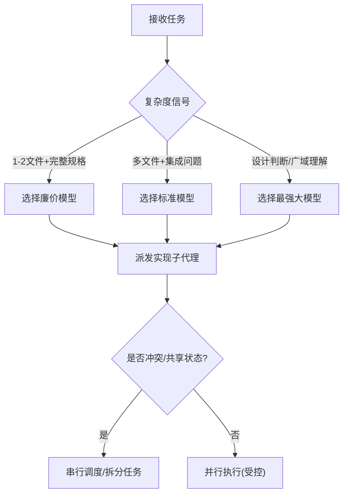
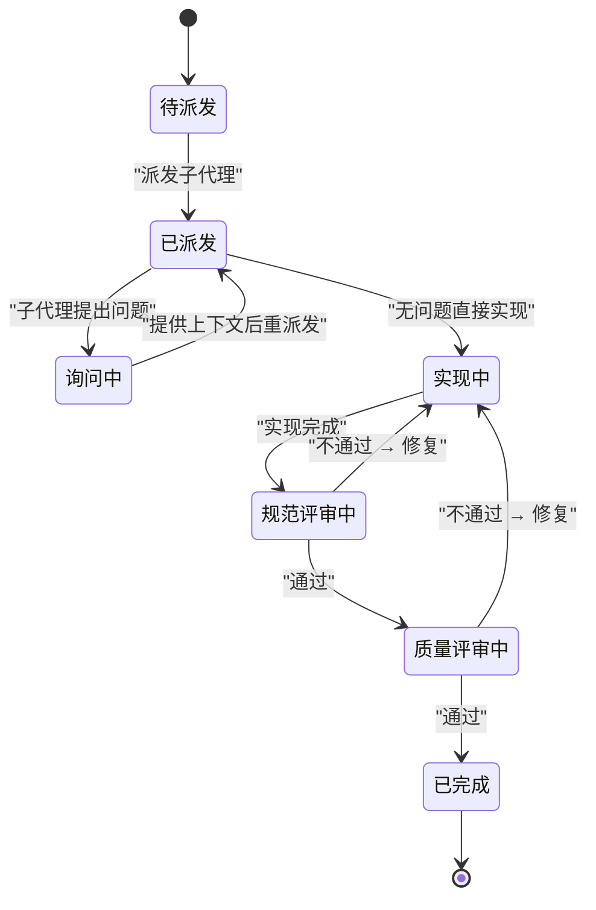
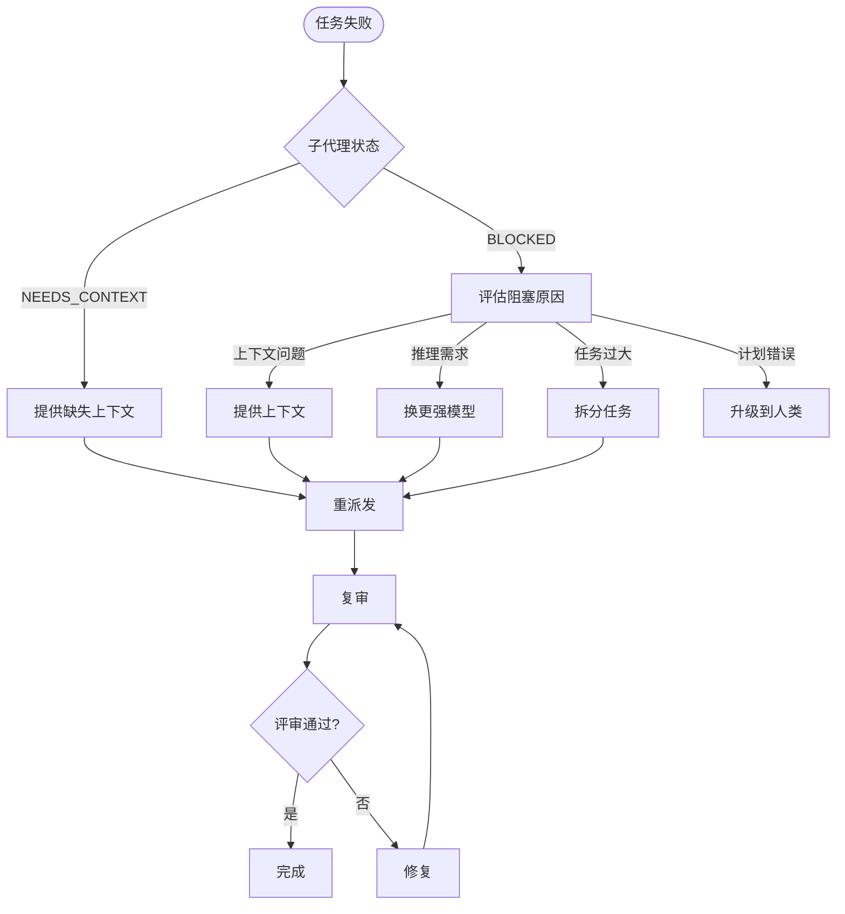
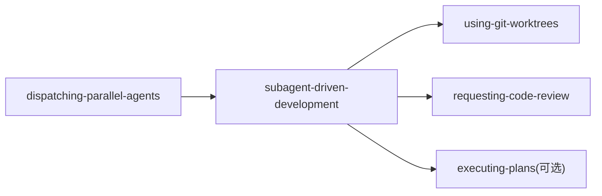

# 任务管理与分配

<cite>
**本文引用的文件**
- [skills/subagent-driven-development/SKILL.md](file://skills/subagent-driven-development/SKILL.md)
- [skills/dispatching-parallel-agents/SKILL.md](file://skills/dispatching-parallel-agents/SKILL.md)
- [skills/executing-plans/SKILL.md](file://skills/executing-plans/SKILL.md)
- [skills/subagent-driven-development/implementer-prompt.md](file://skills/subagent-driven-development/implementer-prompt.md)
- [skills/subagent-driven-development/code-quality-reviewer-prompt.md](file://skills/subagent-driven-development/code-quality-reviewer-prompt.md)
- [skills/requesting-code-review/SKILL.md](file://skills/requesting-code-review/SKILL.md)
- [skills/using-git-worktrees/SKILL.md](file://skills/using-git-worktrees/SKILL.md)
- [tests/subagent-driven-dev/svelte-todo/plan.md](file://tests/subagent-driven-dev/svelte-todo/plan.md)
- [tests/explicit-skill-requests/prompts/action-oriented.txt](file://tests/explicit-skill-requests/prompts/action-oriented.txt)
</cite>

## 目录
1. [简介](#简介)
2. [项目结构](#项目结构)
3. [核心组件](#核心组件)
4. [架构总览](#架构总览)
5. [详细组件分析](#详细组件分析)
6. [依赖分析](#依赖分析)
7. [性能考虑](#性能考虑)
8. [故障排查指南](#故障排查指南)
9. [结论](#结论)
10. [附录](#附录)

## 简介
本文件聚焦于子代理协调器在“子代理驱动开发”工作流中的任务管理与分配能力，系统性阐述以下内容：
- 任务提取算法：从实现计划中解析任务列表、抽取任务上下文、确定任务边界
- 任务分配策略：基于任务复杂度选择合适模型、处理任务依赖关系、控制并行执行
- 任务状态跟踪：任务生命周期管理、状态转换规则、进度监控
- 失败处理策略：重试机制、降级策略、人工干预触发条件

该能力以“每个任务一个子代理”的原则为核心，通过两阶段评审（规范符合性评审与代码质量评审）确保高质量交付，并在必要时进行回溯与修正。

## 项目结构
围绕任务管理与分配的关键文件组织如下：
- 技能定义与流程规范：subagent-driven-development、dispatching-parallel-agents、executing-plans
- 子代理提示模板：implementer、spec reviewer、code quality reviewer
- 集成与评审：requesting-code-review、using-git-worktrees
- 示例计划与用法：svelte-todo 计划、显式技能请求提示

**图表来源**
- [skills/subagent-driven-development/SKILL.md:1-278](file://skills/subagent-driven-development/SKILL.md#L1-L278)
- [skills/dispatching-parallel-agents/SKILL.md:1-183](file://skills/dispatching-parallel-agents/SKILL.md#L1-L183)
- [skills/executing-plans/SKILL.md:1-71](file://skills/executing-plans/SKILL.md#L1-L71)
- [skills/subagent-driven-development/implementer-prompt.md:1-114](file://skills/subagent-driven-development/implementer-prompt.md#L1-L114)
- [skills/subagent-driven-development/code-quality-reviewer-prompt.md:1-27](file://skills/subagent-driven-development/code-quality-reviewer-prompt.md#L1-L27)
- [skills/requesting-code-review/SKILL.md:49-106](file://skills/requesting-code-review/SKILL.md#L49-L106)
- [skills/using-git-worktrees/SKILL.md:209-219](file://skills/using-git-worktrees/SKILL.md#L209-L219)
- [tests/subagent-driven-dev/svelte-todo/plan.md:1-223](file://tests/subagent-driven-dev/svelte-todo/plan.md#L1-L223)
- [tests/explicit-skill-requests/prompts/action-oriented.txt:1-3](file://tests/explicit-skill-requests/prompts/action-oriented.txt#L1-L3)

**章节来源**
- [skills/subagent-driven-development/SKILL.md:1-278](file://skills/subagent-driven-development/SKILL.md#L1-L278)
- [skills/dispatching-parallel-agents/SKILL.md:1-183](file://skills/dispatching-parallel-agents/SKILL.md#L1-L183)
- [skills/executing-plans/SKILL.md:1-71](file://skills/executing-plans/SKILL.md#L1-L71)

## 核心组件
- 任务提取器：从实现计划中一次性读取并解析所有任务，保留完整文本与上下文，构建任务清单
- 任务分配器：根据任务复杂度信号选择模型（廉价/标准/最强大），并控制并发与串行
- 任务执行器：子代理执行实现、自检、提交、评审；支持问题反馈与迭代
- 评审器：规范符合性评审与代码质量评审，形成闭环
- 状态跟踪器：任务生命周期状态机与进度监控
- 失败处理器：重试、降级、人工干预与任务拆分

**章节来源**
- [skills/subagent-driven-development/SKILL.md:40-200](file://skills/subagent-driven-development/SKILL.md#L40-L200)
- [skills/subagent-driven-development/implementer-prompt.md:1-114](file://skills/subagent-driven-development/implementer-prompt.md#L1-L114)
- [skills/subagent-driven-development/code-quality-reviewer-prompt.md:1-27](file://skills/subagent-driven-development/code-quality-reviewer-prompt.md#L1-L27)

## 架构总览
下图展示子代理驱动开发的端到端流程，包括任务提取、分配、执行、评审与收尾。

**图表来源**
- [skills/subagent-driven-development/SKILL.md:40-200](file://skills/subagent-driven-development/SKILL.md#L40-L200)
- [skills/subagent-driven-development/implementer-prompt.md:1-114](file://skills/subagent-driven-development/implementer-prompt.md#L1-L114)
- [skills/subagent-driven-development/code-quality-reviewer-prompt.md:1-27](file://skills/subagent-driven-development/code-quality-reviewer-prompt.md#L1-L27)

## 详细组件分析

### 任务提取算法
- 输入：实现计划文件（包含多个任务条目）
- 输出：任务清单，每项包含：
  - 完整任务文本（避免子代理重复读取）
  - 场景设定与上下文（任务在整个方案中的位置、依赖、架构背景）
- 关键点：
  - 一次性读取，避免重复 IO
  - 为每个任务提供“场景设定”，帮助子代理理解任务边界与约束
  - 为后续评审提供可追溯的基线与 HEAD 提交信息

**图表来源**
- [skills/subagent-driven-development/SKILL.md:126-133](file://skills/subagent-driven-development/SKILL.md#L126-L133)
- [tests/subagent-driven-dev/svelte-todo/plan.md:1-223](file://tests/subagent-driven-dev/svelte-todo/plan.md#L1-L223)

**章节来源**
- [skills/subagent-driven-development/SKILL.md:126-133](file://skills/subagent-driven-development/SKILL.md#L126-L133)
- [tests/subagent-driven-dev/svelte-todo/plan.md:1-223](file://tests/subagent-driven-dev/svelte-todo/plan.md#L1-L223)

### 任务上下文提取
- 上下文包括：任务在整体方案中的作用、与其他任务的依赖关系、架构约束、文件结构建议等
- 目标：让子代理“精确入局”，无需继承会话历史，避免上下文污染
- 实践要点：
  - 将“场景设定”作为独立段落提供给子代理
  - 明确文件职责边界与接口约定
  - 对大型文件或已有复杂模块，标注关注点（如“不要重构超出任务范围”）

**章节来源**
- [skills/subagent-driven-development/implementer-prompt.md:15-18](file://skills/subagent-driven-development/implementer-prompt.md#L15-L18)
- [skills/subagent-driven-development/SKILL.md:10-12](file://skills/subagent-driven-development/SKILL.md#L10-L12)

### 任务优先级与排序机制
- 仓库未定义显式的“优先级数值”或“排序算法”
- 建议采用“按任务边界清晰度与依赖关系”进行排序：
  - 无依赖且边界清晰的任务优先
  - 逐步推进到需要跨文件/跨模块协作的任务
- 该排序策略与“每个任务一个子代理”的原则一致，便于并行化与风险隔离

**章节来源**
- [skills/subagent-driven-development/SKILL.md:14-32](file://skills/subagent-driven-development/SKILL.md#L14-L32)

### 任务分配策略
- 模型选择策略（按角色与任务复杂度）：
  - 机械实现任务（孤立函数、明确规格、1-2 文件）：使用廉价/快速模型
  - 集成与判断任务（多文件协调、模式匹配、调试）：使用标准模型
  - 架构、设计与评审任务：使用最强大模型
- 任务复杂度信号：
  - 触及 1-2 个文件且规格完整 → 廉价模型
  - 涉及多文件与集成问题 → 标准模型
  - 需要设计判断或广泛代码库理解 → 最强大模型
- 并行执行限制：
  - 同一时刻仅允许一个实现子代理执行（避免冲突）
  - 规范评审与质量评审可与实现并行但需遵循顺序约束
  - 调度器应避免同时写入同一工作区

**图表来源**
- [skills/subagent-driven-development/SKILL.md:87-101](file://skills/subagent-driven-development/SKILL.md#L87-L101)
- [skills/dispatching-parallel-agents/SKILL.md:16-46](file://skills/dispatching-parallel-agents/SKILL.md#L16-L46)

**章节来源**
- [skills/subagent-driven-development/SKILL.md:87-101](file://skills/subagent-driven-development/SKILL.md#L87-L101)
- [skills/dispatching-parallel-agents/SKILL.md:16-46](file://skills/dispatching-parallel-agents/SKILL.md#L16-L46)

### 任务状态跟踪与生命周期
- 生命周期状态机（每任务）：
  - 待派发 → 已派发 → 询问中 → 实现中 → 规范评审中 → 质量评审中 → 已完成
- 状态转换规则：
  - 仅当规范评审通过后才进入质量评审
  - 任一评审发现“不通过”，必须先修复再复审
  - 任务完成后方可继续下一个任务
- 进度监控：
  - 使用“任务清单”记录每个任务的状态
  - 在每次评审后更新进度与摘要
  - 支持“剩余任务检查”，决定是否继续或进入最终评审

**图表来源**
- [skills/subagent-driven-development/SKILL.md:40-84](file://skills/subagent-driven-development/SKILL.md#L40-L84)

**章节来源**
- [skills/subagent-driven-development/SKILL.md:40-84](file://skills/subagent-driven-development/SKILL.md#L40-L84)

### 失败处理策略
- 实现子代理状态处理：
  - DONE：进入规范评审
  - DONE_WITH_CONCERNS：先审阅担忧，再决定是否继续评审
  - NEEDS_CONTEXT：提供缺失上下文后重派发
  - BLOCKED：评估阻塞原因并采取措施（提供上下文、换更强模型、拆分任务、升级到人类）
- 评审失败处理：
  - 规范评审不通过：实现子代理修复后复审
  - 质量评审不通过：实现子代理修复后复审
- 重试与降级：
  - 避免在同一模型上反复重试而不做变更
  - 若问题源于上下文不足，优先补充上下文而非更换模型
  - 若任务过大，优先拆分为更小任务
- 人工干预触发条件：
  - 任务本身存在方向性错误
  - 子代理多次报告 BLOCKED 且无法定位根因
  - 评审发现严重问题且无法通过修复解决

**图表来源**
- [skills/subagent-driven-development/SKILL.md:102-118](file://skills/subagent-driven-development/SKILL.md#L102-L118)

**章节来源**
- [skills/subagent-driven-development/SKILL.md:102-118](file://skills/subagent-driven-development/SKILL.md#L102-L118)

### 评审与收尾
- 规范符合性评审：确保实现满足规格要求，不超不漏
- 代码质量评审：关注可维护性、测试覆盖、接口清晰度与文件职责
- 收尾：全部任务完成后，进行整体代码评审并完成分支收尾

**章节来源**
- [skills/subagent-driven-development/code-quality-reviewer-prompt.md:1-27](file://skills/subagent-driven-development/code-quality-reviewer-prompt.md#L1-L27)
- [skills/requesting-code-review/SKILL.md:49-106](file://skills/requesting-code-review/SKILL.md#L49-L106)
- [skills/subagent-driven-development/SKILL.md:195-200](file://skills/subagent-driven-development/SKILL.md#L195-L200)

## 依赖分析
- 子代理驱动开发依赖：
  - 使用 Git 工作树隔离工作区
  - 评审模板来自“请求代码评审”技能
  - 可选替代流程为“执行计划（并行会话）”
- 并行派发依赖：
  - 仅在任务相互独立、无共享状态时启用
  - 需要严格的上下文隔离与输出约束

**图表来源**
- [skills/using-git-worktrees/SKILL.md:209-219](file://skills/using-git-worktrees/SKILL.md#L209-L219)
- [skills/requesting-code-review/SKILL.md:77-91](file://skills/requesting-code-review/SKILL.md#L77-L91)
- [skills/executing-plans/SKILL.md:65-71](file://skills/executing-plans/SKILL.md#L65-L71)
- [skills/dispatching-parallel-agents/SKILL.md:1-183](file://skills/dispatching-parallel-agents/SKILL.md#L1-L183)

**章节来源**
- [skills/using-git-worktrees/SKILL.md:209-219](file://skills/using-git-worktrees/SKILL.md#L209-L219)
- [skills/requesting-code-review/SKILL.md:77-91](file://skills/requesting-code-review/SKILL.md#L77-L91)
- [skills/executing-plans/SKILL.md:65-71](file://skills/executing-plans/SKILL.md#L65-L71)
- [skills/dispatching-parallel-agents/SKILL.md:1-183](file://skills/dispatching-parallel-agents/SKILL.md#L1-L183)

## 性能考虑
- 成本优化：按角色与复杂度选择最小可用模型，减少昂贵调用次数
- 效率提升：一次性提供完整任务文本与上下文，避免子代理重复读取与提问
- 并行收益：在任务独立前提下并行执行，缩短总周期
- 风险控制：两阶段评审降低后期返工成本，避免“快但错”的路径

[本节为通用指导，无需特定文件引用]

## 故障排查指南
- 常见问题与对策：
  - 子代理频繁 NEEDS_CONTEXT：检查上下文是否完整、是否遗漏关键依赖或文件结构
  - BLOCKED 且反复：评估是否需要更强模型、任务是否过大、是否存在计划层面的问题
  - 评审反复不通过：确认修复是否真正解决问题，必要时进行复审
- 何时停止与求助：
  - 遇到阻塞、规格不清、验证反复失败时立即停止并寻求澄清
- 何时回退到替代流程：
  - 若无子代理支持，使用“执行计划（并行会话）”替代

**章节来源**
- [skills/subagent-driven-development/SKILL.md:39-55](file://skills/subagent-driven-development/SKILL.md#L39-L55)
- [skills/executing-plans/SKILL.md:39-55](file://skills/executing-plans/SKILL.md#L39-L55)

## 结论
子代理协调器通过“任务提取—分配—执行—评审—收尾”的闭环流程，实现了高可靠、可追踪、可扩展的任务管理与分配。其关键优势在于：
- 明确的任务边界与上下文传递
- 基于复杂度的模型选择与并行控制
- 两阶段评审的质量保障
- 清晰的状态机与失败处理策略

这些机制共同确保了在复杂实现计划下的稳定交付与可控风险。

[本节为总结，无需特定文件引用]

## 附录
- 示例用法参考：
  - “开始执行计划”的显式提示
  - Svelte Todo 计划示例，展示任务分解与验证步骤

**章节来源**
- [tests/explicit-skill-requests/prompts/action-oriented.txt:1-3](file://tests/explicit-skill-requests/prompts/action-oriented.txt#L1-L3)
- [tests/subagent-driven-dev/svelte-todo/plan.md:1-223](file://tests/subagent-driven-dev/svelte-todo/plan.md#L1-L223)