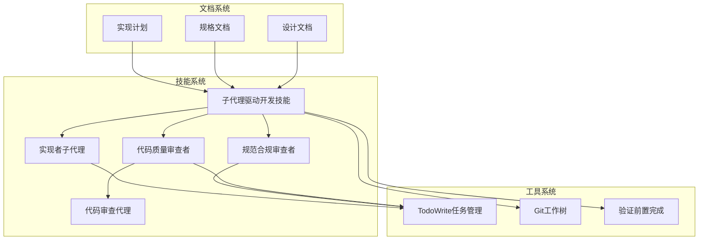
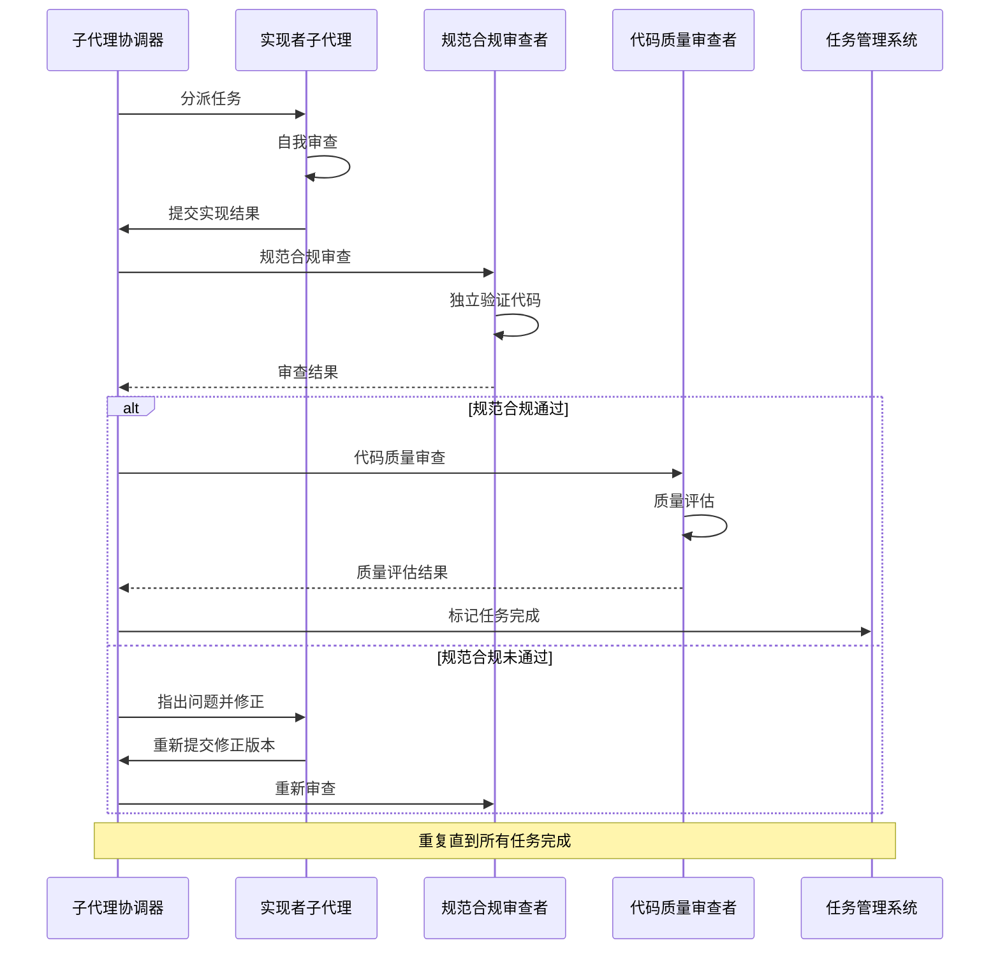
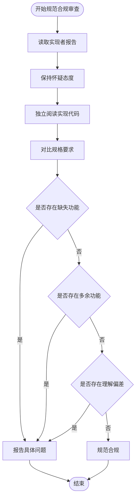
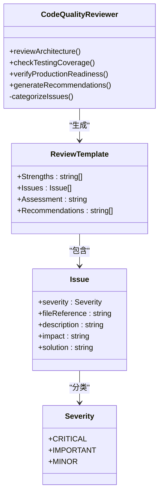
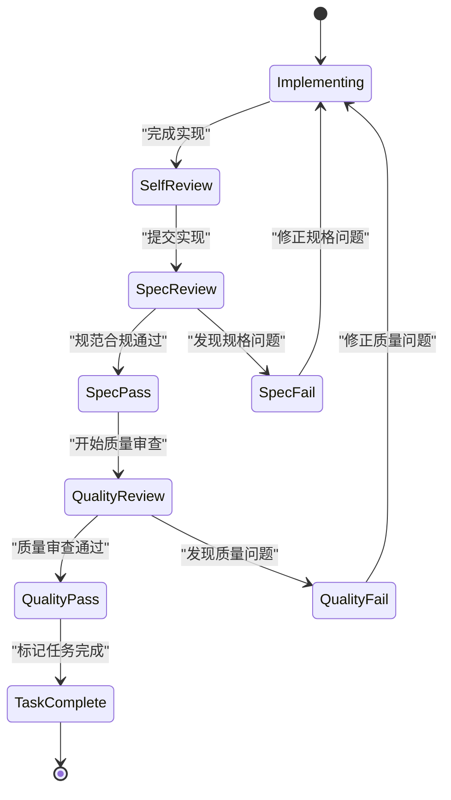
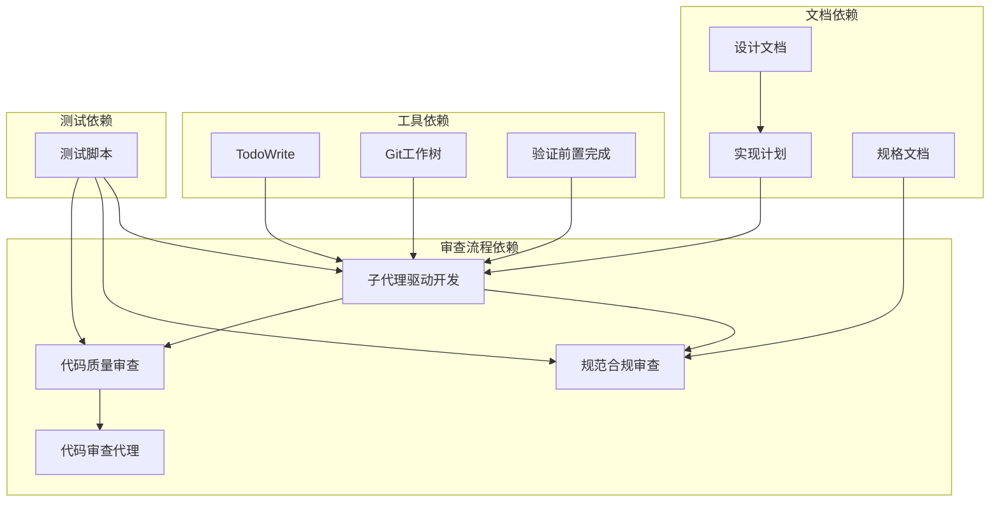

# 双重审查机制

<cite>
**本文档引用的文件**
- [技能：子代理驱动开发](file://skills/subagent-driven-development/SKILL.md)
- [实现者提示模板](file://skills/subagent-driven-development/implementer-prompt.md)
- [规范合规审查者提示模板](file://skills/subagent-driven-development/spec-reviewer-prompt.md)
- [代码质量审查者提示模板](file://skills/subagent-driven-development/code-quality-reviewer-prompt.md)
- [请求代码审查技能](file://skills/requesting-code-review/SKILL.md)
- [代码审查代理](file://skills/requesting-code-review/code-reviewer.md)
- [完成开发分支技能](file://skills/finishing-a-development-branch/SKILL.md)
- [验证前置完成技能](file://skills/verification-before-completion/SKILL.md)
- [计划文档审查者提示模板](file://skills/writing-plans/plan-document-reviewer-prompt.md)
- [规范文档审查者提示模板](file://skills/brainstorming/spec-document-reviewer-prompt.md)
- [子代理驱动开发测试脚本](file://tests/claude-code/test-subagent-driven-development.sh)
- [Svelte待办事项计划示例](file://tests/subagent-driven-dev/svelte-todo/plan.md)
- [Svelte待办事项设计示例](file://tests/subagent-driven-dev/svelte-todo/design.md)
</cite>

## 目录
1. [引言](#引言)
2. [项目结构](#项目结构)
3. [核心组件](#核心组件)
4. [架构概览](#架构概览)
5. [详细组件分析](#详细组件分析)
6. [依赖关系分析](#依赖关系分析)
7. [性能考虑](#性能考虑)
8. [故障排除指南](#故障排除指南)
9. [结论](#结论)

## 引言

双重审查机制是子代理协调器的核心质量保证体系，通过两阶段审查流程确保代码实现既满足规格要求又具备高质量标准。该机制采用"规范合规审查优先"的原则，先验证实现是否完全符合规格要求，再评估代码质量，形成完整的质量控制闭环。

## 项目结构

该项目采用基于技能（Skills）的模块化架构，每个功能由专门的技能文件定义，包含工作流程、提示模板和相关文档。

**图表来源**
- [技能：子代理驱动开发:1-232](file://skills/subagent-driven-development/SKILL.md#L1-L232)
- [请求代码审查技能:1-47](file://skills/requesting-code-review/SKILL.md#L1-L47)

**章节来源**
- [技能：子代理驱动开发:1-232](file://skills/subagent-driven-development/SKILL.md#L1-L232)

## 核心组件

双重审查机制由四个核心组件构成，每个组件都有明确的职责和交互关系：

### 实现者子代理
负责执行具体的编码任务，遵循严格的自我审查流程，确保实现质量从源头把控。

### 规范合规审查者
独立验证实现是否完全符合规格要求，采用"不信任报告"原则，通过代码审计确保规格一致性。

### 代码质量审查者
专注于代码质量评估，使用标准化的审查模板，涵盖架构、测试、生产就绪度等维度。

### 代码审查代理
提供统一的审查框架，支持多种审查场景，确保审查结果的一致性和可操作性。

**章节来源**
- [实现者提示模板:1-114](file://skills/subagent-driven-development/implementer-prompt.md#L1-L114)
- [规范合规审查者提示模板:1-62](file://skills/subagent-driven-development/spec-reviewer-prompt.md#L1-L62)
- [代码质量审查者提示模板:1-27](file://skills/subagent-driven-development/code-quality-reviewer-prompt.md#L1-L27)
- [代码审查代理:1-147](file://skills/requesting-code-review/code-reviewer.md#L1-L147)

## 架构概览

双重审查机制采用流水线式架构，每个任务都经过严格的质量控制检查点。

**图表来源**
- [技能：子代理驱动开发:40-85](file://skills/subagent-driven-development/SKILL.md#L40-L85)

## 详细组件分析

### 规范合规审查流程

规范合规审查是双重审查的第一道关卡，其核心特点是"不信任报告"原则。

#### 审查标准定义
- **完整性检查**：验证实现是否覆盖所有规格要求
- **一致性验证**：确保实现与规格描述一致
- **正确性确认**：通过代码审计而非报告验证

#### 审查范围确定
审查范围严格限定于实现代码本身，审查者必须：
- 独立阅读实现代码
- 逐行对比规格要求
- 识别缺失或多余的实现

#### 审查结果评估
评估采用二元制：完全合规或发现问题。发现问题时需提供具体的位置引用和详细说明。

**图表来源**
- [规范合规审查者提示模板:21-61](file://skills/subagent-driven-development/spec-reviewer-prompt.md#L21-L61)

**章节来源**
- [规范合规审查者提示模板:1-62](file://skills/subagent-driven-development/spec-reviewer-prompt.md#L1-L62)

### 代码质量审查流程

代码质量审查在规范合规通过后进行，重点关注实现的技术质量。

#### 代码质量指标
- **架构质量**：模块分离、接口清晰、设计合理
- **代码质量**：错误处理、类型安全、DRY原则
- **测试质量**：测试覆盖率、边界情况处理
- **生产就绪度**：迁移策略、向后兼容性

#### 审查重点
- 文件职责单一且接口明确
- 单元可以独立理解和测试
- 遵循计划中的文件结构
- 控制文件大小增长

#### 改进建议生成
审查者提供具体的问题描述、影响分析和修复建议，按严重程度分级。

**图表来源**
- [代码质量审查者提示模板:20-26](file://skills/subagent-driven-development/code-quality-reviewer-prompt.md#L20-L26)
- [代码审查代理:63-93](file://skills/requesting-code-review/code-reviewer.md#L63-L93)

**章节来源**
- [代码质量审查者提示模板:1-27](file://skills/subagent-driven-development/code-quality-reviewer-prompt.md#L1-L27)
- [代码审查代理:1-147](file://skills/requesting-code-review/code-reviewer.md#L1-L147)

### 审查循环机制

双重审查机制采用自动化的循环流程，确保问题得到彻底解决。

#### 问题发现
- 规范合规审查发现规格不匹配
- 代码质量审查发现技术债务
- 实施者自我审查发现潜在问题

#### 修复实施
- 实施者根据审查反馈进行修正
- 修复后重新提交审查
- 重复直到满足要求

#### 重新审查
- 规范合规审查：验证规格匹配
- 代码质量审查：验证质量提升
- 通过后标记任务完成

**图表来源**
- [技能：子代理驱动开发:40-85](file://skills/subagent-driven-development/SKILL.md#L40-L85)

**章节来源**
- [技能：子代理驱动开发:40-200](file://skills/subagent-driven-development/SKILL.md#L40-L200)

### 审查结果处理策略

#### 通过条件判断
- 规范合规：实现必须完全符合规格要求
- 代码质量：必须达到预定义的质量标准
- 严重问题：立即阻止继续流程

#### 问题分类和决策制定
- **关键问题**：必须立即修复，阻止合并
- **重要问题**：在继续前必须修复
- **次要问题**：可后续处理，但需记录

#### 决策制定流程
1. 评估问题严重程度
2. 判断对整体质量的影响
3. 制定修复优先级
4. 执行相应的处理措施

**章节来源**
- [代码审查代理:63-109](file://skills/requesting-code-review/code-reviewer.md#L63-L109)

### 审查顺序的重要性

规范审查在前的质量保证机制具有重要意义：

#### 规范审查优先的原因
- **防止过度工程化**：避免实现超出规格要求的功能
- **确保需求正确性**：确保解决正确的问题
- **减少返工成本**：早期发现问题比后期修改更经济
- **建立质量基线**：为后续质量审查提供明确标准

#### 质量保证机制
- **双层过滤**：规格和质量双重把关
- **渐进式改进**：从小问题开始逐步提升质量
- **自动化流程**：减少人工干预，提高效率
- **持续监控**：在整个开发周期中保持质量标准

**章节来源**
- [技能：子代理驱动开发:8-12](file://skills/subagent-driven-development/SKILL.md#L8-L12)

## 依赖关系分析

双重审查机制涉及多个组件间的复杂依赖关系：

**图表来源**
- [技能：子代理驱动开发:120-126](file://skills/subagent-driven-development/SKILL.md#L120-L126)
- [子代理驱动开发测试脚本:1-166](file://tests/claude-code/test-subagent-driven-development.sh#L1-L166)

**章节来源**
- [技能：子代理驱动开发:1-232](file://skills/subagent-driven-development/SKILL.md#L1-L232)
- [子代理驱动开发测试脚本:1-166](file://tests/claude-code/test-subagent-driven-development.sh#L1-L166)

## 性能考虑

双重审查机制在保证质量的同时也考虑了性能优化：

### 效率优化策略
- **一次性读取计划**：避免重复加载相同信息
- **并行审查**：不同任务的审查可以并行进行
- **增量验证**：只验证必要的代码变更
- **缓存机制**：复用已验证的结果

### 成本控制
- **模型选择优化**：根据任务复杂度选择合适的模型能力
- **审查次数最小化**：通过有效的审查流程减少不必要的迭代
- **自动化程度**：最大化自动化以减少人工干预

## 故障排除指南

### 常见问题及解决方案

#### 审查循环卡住
**症状**：审查结果反复出现相同问题
**原因**：修复不彻底或理解偏差
**解决方案**：
1. 仔细阅读审查反馈的具体位置
2. 重新审视规格要求
3. 寻求其他审查者的意见

#### 实施者状态异常
**症状**：实施者报告BLOCKED或NEEDS_CONTEXT
**原因**：任务过于复杂或信息不足
**解决方案**：
1. 提供更详细的上下文信息
2. 考虑分解复杂任务
3. 提升实施者的能力级别

#### 审查标准不一致
**症状**：不同审查者给出矛盾的评价
**原因**：缺乏统一的审查标准
**解决方案**：
1. 明确审查标准和权重
2. 建立审查者培训机制
3. 制定争议解决流程

**章节来源**
- [技能：子代理驱动开发:102-118](file://skills/subagent-driven-development/SKILL.md#L102-L118)

## 结论

双重审查机制通过规范合规审查和代码质量审查的有机结合，建立了全面的质量保证体系。该机制的核心优势在于：

1. **层次化质量控制**：通过两阶段审查确保质量的渐进提升
2. **自动化流程**：减少人工干预，提高审查效率
3. **持续改进**：通过审查循环不断优化实现质量
4. **风险控制**：早期发现问题，降低项目风险

这种机制特别适用于复杂的软件开发项目，能够有效平衡质量保证和开发效率，在确保代码质量的同时维持合理的开发速度。通过标准化的审查流程和明确的处理策略，双重审查机制为现代软件开发提供了可靠的质保框架。