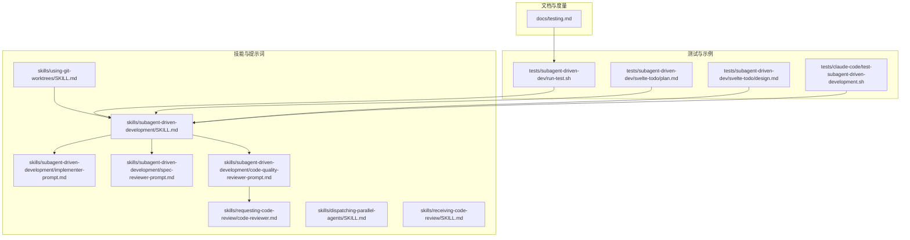
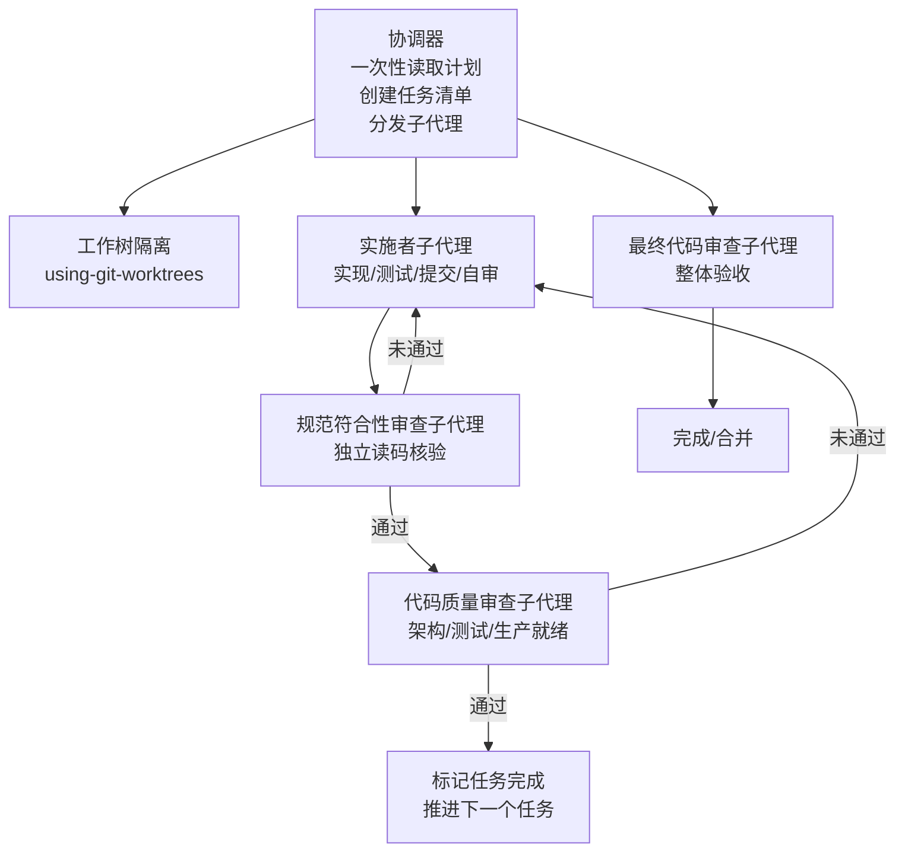
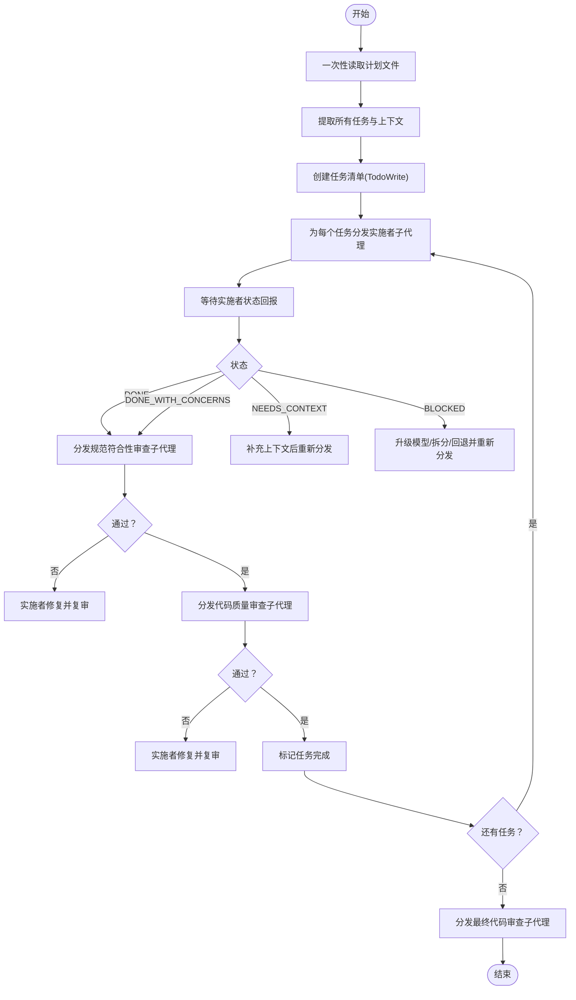
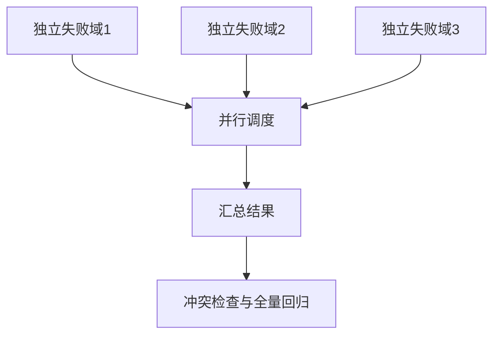
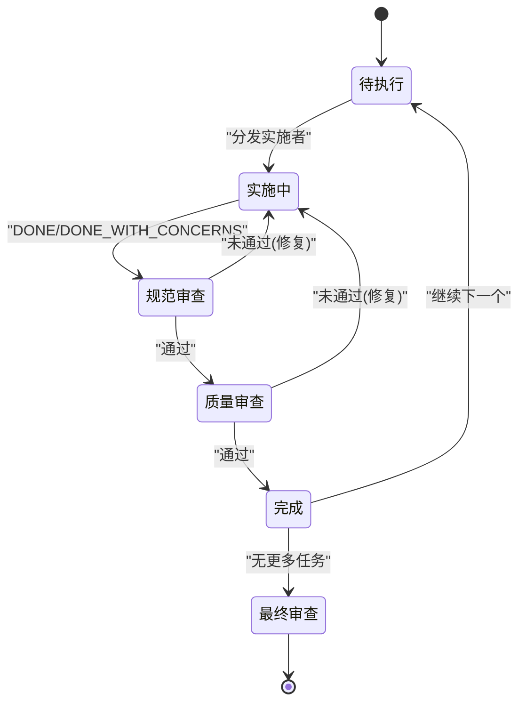
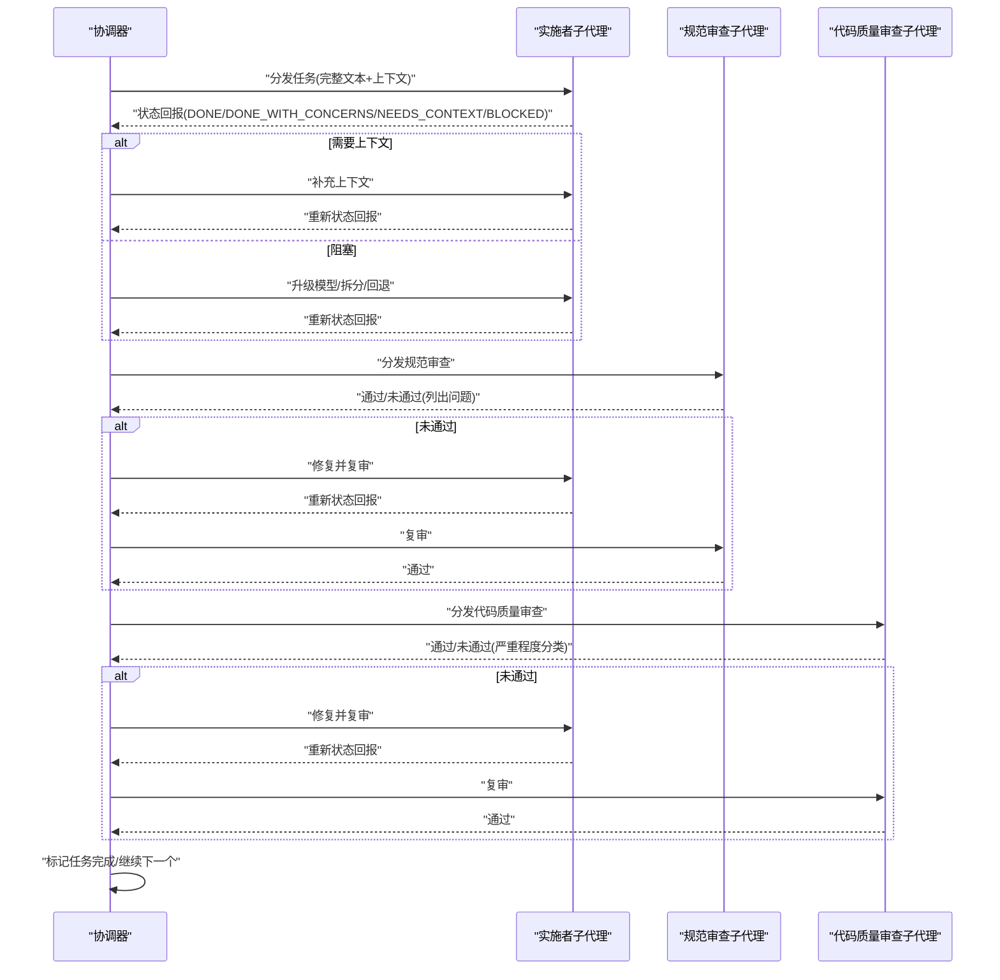
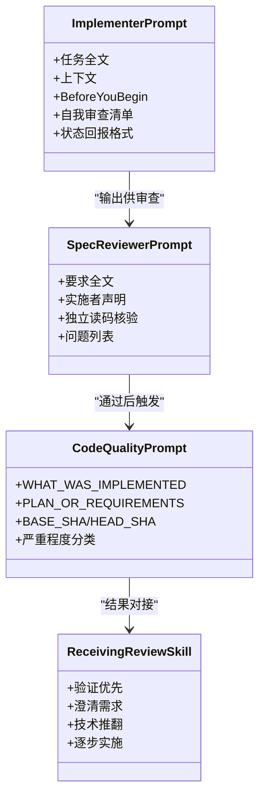
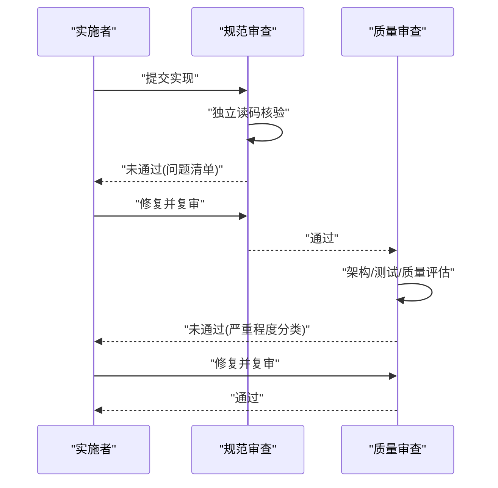
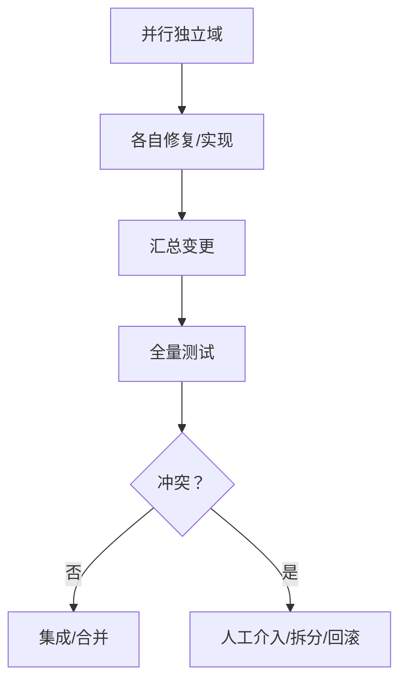
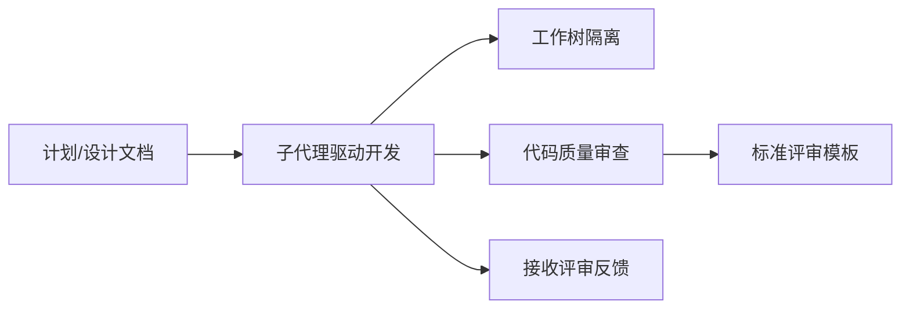

# 子代理协调器组件

<cite>
**本文引用的文件**
- [skills/subagent-driven-development/SKILL.md](file://skills/subagent-driven-development/SKILL.md)
- [skills/subagent-driven-development/implementer-prompt.md](file://skills/subagent-driven-development/implementer-prompt.md)
- [skills/subagent-driven-development/spec-reviewer-prompt.md](file://skills/subagent-driven-development/spec-reviewer-prompt.md)
- [skills/subagent-driven-development/code-quality-reviewer-prompt.md](file://skills/subagent-driven-development/code-quality-reviewer-prompt.md)
- [skills/requesting-code-review/code-reviewer.md](file://skills/requesting-code-review/code-reviewer.md)
- [skills/dispatching-parallel-agents/SKILL.md](file://skills/dispatching-parallel-agents/SKILL.md)
- [skills/receiving-code-review/SKILL.md](file://skills/receiving-code-review/SKILL.md)
- [skills/using-git-worktrees/SKILL.md](file://skills/using-git-worktrees/SKILL.md)
- [tests/subagent-driven-dev/run-test.sh](file://tests/subagent-driven-dev/run-test.sh)
- [tests/subagent-driven-dev/svelte-todo/plan.md](file://tests/subagent-driven-dev/svelte-todo/plan.md)
- [tests/subagent-driven-dev/svelte-todo/design.md](file://tests/subagent-driven-dev/svelte-todo/design.md)
- [docs/testing.md](file://docs/testing.md)
- [tests/claude-code/test-subagent-driven-development.sh](file://tests/claude-code/test-subagent-driven-development.sh)
</cite>

## 目录
1. [简介](#简介)
2. [项目结构](#项目结构)
3. [核心组件](#核心组件)
4. [架构总览](#架构总览)
5. [详细组件分析](#详细组件分析)
6. [依赖关系分析](#依赖关系分析)
7. [性能考虑](#性能考虑)
8. [故障排查指南](#故障排查指南)
9. [结论](#结论)
10. [附录](#附录)

## 简介
本文件面向 Superpowers 的“子代理协调器”组件，系统化阐述其架构设计、任务分配算法、并行执行管理、进度跟踪机制、子代理生命周期与状态同步、通信协议、双重审查（规范符合性审查与代码质量审查）的协调策略、子代理间数据共享与冲突解决、结果整合方案，以及监控指标、性能优化与故障恢复机制。该组件以“每个任务一个新鲜子代理 + 双重审查”的模式，确保高质量、高效率的迭代开发。

## 项目结构
围绕子代理协调器的关键文件组织如下：
- 技能与流程定义：位于 skills 目录，包含子代理驱动开发、并行调度、代码评审等技能文档与提示词模板
- 测试与验证：位于 tests 目录，包含端到端测试脚本与示例计划/设计文档
- 文档与度量：位于 docs 目录，包含测试报告与令牌用量统计

**图表来源**
- [skills/subagent-driven-development/SKILL.md:1-278](file://skills/subagent-driven-development/SKILL.md#L1-L278)
- [skills/dispatching-parallel-agents/SKILL.md:1-183](file://skills/dispatching-parallel-agents/SKILL.md#L1-L183)
- [skills/using-git-worktrees/SKILL.md:1-219](file://skills/using-git-worktrees/SKILL.md#L1-L219)
- [tests/subagent-driven-dev/run-test.sh:1-107](file://tests/subagent-driven-dev/run-test.sh#L1-L107)
- [tests/subagent-driven-dev/svelte-todo/plan.md:1-223](file://tests/subagent-driven-dev/svelte-todo/plan.md#L1-L223)
- [tests/subagent-driven-dev/svelte-todo/design.md:1-71](file://tests/subagent-driven-dev/svelte-todo/design.md#L1-L71)
- [docs/testing.md:66-135](file://docs/testing.md#L66-L135)

**章节来源**
- [skills/subagent-driven-development/SKILL.md:1-278](file://skills/subagent-driven-development/SKILL.md#L1-L278)
- [skills/dispatching-parallel-agents/SKILL.md:1-183](file://skills/dispatching-parallel-agents/SKILL.md#L1-L183)
- [skills/using-git-worktrees/SKILL.md:1-219](file://skills/using-git-worktrees/SKILL.md#L1-L219)
- [tests/subagent-driven-dev/run-test.sh:1-107](file://tests/subagent-driven-dev/run-test.sh#L1-L107)
- [tests/subagent-driven-dev/svelte-todo/plan.md:1-223](file://tests/subagent-driven-dev/svelte-todo/plan.md#L1-L223)
- [tests/subagent-driven-dev/svelte-todo/design.md:1-71](file://tests/subagent-driven-dev/svelte-todo/design.md#L1-L71)
- [docs/testing.md:66-135](file://docs/testing.md#L66-L135)

## 核心组件
- 协调器（Controller）
  - 职责：读取计划、提取任务、创建任务清单、分发子代理、推进审查流程、汇总结果、进行最终评审
  - 关键行为：一次性读取计划；为每个任务创建独立上下文；严格遵循“规范符合性审查优先、代码质量审查次之”的顺序；维护任务完成状态
- 实施者子代理（Implementer Subagent）
  - 职责：根据完整任务文本与上下文实现功能、自测、提交、自我审查、按状态返回
  - 关键行为：在开始前可提问；遇到不确定或复杂问题时可升级/请求上下文/拆分任务
- 规范符合性审查子代理（Spec Reviewer Subagent）
  - 职责：独立核验实现是否满足规格要求，不信任实施者报告，必须读代码验证
  - 关键行为：发现缺失/多余/误解后要求修复并复审
- 代码质量审查子代理（Code Quality Reviewer Subagent）
  - 职责：在通过规范符合性审查后，评估架构、测试、可维护性与生产就绪度
  - 关键行为：使用标准评审模板，分类严重程度并给出明确结论
- 工作树隔离（Git Worktrees）
  - 职责：为每次任务提供隔离工作空间，避免主分支污染与并发冲突
  - 关键行为：自动选择目录、安全检查、基线验证、报告位置

**章节来源**
- [skills/subagent-driven-development/SKILL.md:102-125](file://skills/subagent-driven-development/SKILL.md#L102-L125)
- [skills/subagent-driven-development/implementer-prompt.md:1-114](file://skills/subagent-driven-development/implementer-prompt.md#L1-L114)
- [skills/subagent-driven-development/spec-reviewer-prompt.md:1-62](file://skills/subagent-driven-development/spec-reviewer-prompt.md#L1-L62)
- [skills/subagent-driven-development/code-quality-reviewer-prompt.md:1-27](file://skills/subagent-driven-development/code-quality-reviewer-prompt.md#L1-L27)
- [skills/requesting-code-review/code-reviewer.md:1-147](file://skills/requesting-code-review/code-reviewer.md#L1-L147)
- [skills/using-git-worktrees/SKILL.md:16-142](file://skills/using-git-worktrees/SKILL.md#L16-L142)

## 架构总览
子代理协调器采用“控制器 + 多角色子代理”的协作架构，强调任务隔离、双轨审查与持续反馈闭环。

**图表来源**
- [skills/subagent-driven-development/SKILL.md:40-85](file://skills/subagent-driven-development/SKILL.md#L40-L85)
- [skills/using-git-worktrees/SKILL.md:75-142](file://skills/using-git-worktrees/SKILL.md#L75-L142)

**章节来源**
- [skills/subagent-driven-development/SKILL.md:40-85](file://skills/subagent-driven-development/SKILL.md#L40-L85)
- [skills/using-git-worktrees/SKILL.md:75-142](file://skills/using-git-worktrees/SKILL.md#L75-L142)

## 详细组件分析

### 任务分配算法
- 输入：完整计划文件（一次性读取），包含所有任务及其上下文
- 输出：任务清单（TodoWrite），每个任务携带完整文本与上下文
- 分配策略：
  - 每个任务对应一个新鲜实施者子代理，避免上下文污染
  - 并发安全：同一时刻仅有一个实施者在执行，防止资源竞争
  - 上下文注入：直接将任务全文与场景设定注入提示词，不强制子代理读取外部文件
- 任务状态：
  - DONE：完成
  - DONE_WITH_CONCERNS：完成但有疑虑
  - NEEDS_CONTEXT：缺少上下文
  - BLOCKED：阻塞（需升级模型/拆分/回退）

**图表来源**
- [skills/subagent-driven-development/SKILL.md:102-125](file://skills/subagent-driven-development/SKILL.md#L102-L125)
- [skills/subagent-driven-development/SKILL.md:126-200](file://skills/subagent-driven-development/SKILL.md#L126-L200)

**章节来源**
- [skills/subagent-driven-development/SKILL.md:102-125](file://skills/subagent-driven-development/SKILL.md#L102-L125)
- [skills/subagent-driven-development/SKILL.md:126-200](file://skills/subagent-driven-development/SKILL.md#L126-L200)

### 并行执行管理
- 并发原则：同一时刻仅允许一个实施者执行，避免共享状态与资源冲突
- 并行场景：当存在多个独立失败域且可并行调查时，使用“并行调度多个独立问题域”的模式（见并行调度技能）
- 调度策略：独立域识别 → 任务聚焦 → 同步启动 → 结果集成与冲突检查

**图表来源**
- [skills/dispatching-parallel-agents/SKILL.md:16-45](file://skills/dispatching-parallel-agents/SKILL.md#L16-L45)

**章节来源**
- [skills/dispatching-parallel-agents/SKILL.md:16-45](file://skills/dispatching-parallel-agents/SKILL.md#L16-L45)

### 进度跟踪机制
- 任务清单（TodoWrite）：集中记录所有任务，支持“更多任务？”判断
- 状态机：每个任务在“实施者 → 规范审查 → 质量审查 → 完成/继续/最终审查”之间流转
- 最终审查：在全部任务完成后，进行整体验收

**图表来源**
- [skills/subagent-driven-development/SKILL.md:40-85](file://skills/subagent-driven-development/SKILL.md#L40-L85)

**章节来源**
- [skills/subagent-driven-development/SKILL.md:40-85](file://skills/subagent-driven-development/SKILL.md#L40-L85)

### 子代理生命周期管理
- 生命周期阶段：
  - 初始化：接收完整任务文本与上下文，可提问澄清
  - 执行：实现、测试、提交、自我审查
  - 状态上报：DONE/DONE_WITH_CONCERNS/NEEDS_CONTEXT/BLOCKED
  - 升级与回退：根据状态调整模型能力或拆分任务
- 状态同步：
  - 协调器基于任务清单推进流程
  - 审查子代理独立核验，不依赖实施者报告
  - 修复后必须复审，直至通过

**图表来源**
- [skills/subagent-driven-development/SKILL.md:102-125](file://skills/subagent-driven-development/SKILL.md#L102-L125)
- [skills/subagent-driven-development/implementer-prompt.md:74-113](file://skills/subagent-driven-development/implementer-prompt.md#L74-L113)
- [skills/subagent-driven-development/spec-reviewer-prompt.md:21-57](file://skills/subagent-driven-development/spec-reviewer-prompt.md#L21-L57)
- [skills/subagent-driven-development/code-quality-reviewer-prompt.md:7-18](file://skills/subagent-driven-development/code-quality-reviewer-prompt.md#L7-L18)

**章节来源**
- [skills/subagent-driven-development/SKILL.md:102-125](file://skills/subagent-driven-development/SKILL.md#L102-L125)
- [skills/subagent-driven-development/implementer-prompt.md:74-113](file://skills/subagent-driven-development/implementer-prompt.md#L74-L113)
- [skills/subagent-driven-development/spec-reviewer-prompt.md:21-57](file://skills/subagent-driven-development/spec-reviewer-prompt.md#L21-L57)
- [skills/subagent-driven-development/code-quality-reviewer-prompt.md:7-18](file://skills/subagent-driven-development/code-quality-reviewer-prompt.md#L7-L18)

### 通信协议与提示词模板
- 实施者提示词：明确任务全文、上下文、Before You Begin 的提问机制、自我审查清单、状态回报格式
- 规范审查提示词：强调不信任报告，必须独立读码核验，列出缺失/多余/误解
- 代码质量审查提示词：使用标准评审模板，按严重程度分类，给出明确结论
- 接收评审反馈：技术验证优先，必要时推翻或澄清，避免表演式认同

**图表来源**
- [skills/subagent-driven-development/implementer-prompt.md:1-114](file://skills/subagent-driven-development/implementer-prompt.md#L1-L114)
- [skills/subagent-driven-development/spec-reviewer-prompt.md:1-62](file://skills/subagent-driven-development/spec-reviewer-prompt.md#L1-L62)
- [skills/subagent-driven-development/code-quality-reviewer-prompt.md:1-27](file://skills/subagent-driven-development/code-quality-reviewer-prompt.md#L1-L27)
- [skills/receiving-code-review/SKILL.md:14-25](file://skills/receiving-code-review/SKILL.md#L14-L25)

**章节来源**
- [skills/subagent-driven-development/implementer-prompt.md:1-114](file://skills/subagent-driven-development/implementer-prompt.md#L1-L114)
- [skills/subagent-driven-development/spec-reviewer-prompt.md:1-62](file://skills/subagent-driven-development/spec-reviewer-prompt.md#L1-L62)
- [skills/subagent-driven-development/code-quality-reviewer-prompt.md:1-27](file://skills/subagent-driven-development/code-quality-reviewer-prompt.md#L1-L27)
- [skills/receiving-code-review/SKILL.md:14-25](file://skills/receiving-code-review/SKILL.md#L14-L25)

### 双重审查机制与协调策略
- 规范符合性审查（Spec Review）：独立读码，核对规格，不允许“差不多”，必须列出具体缺失/多余
- 代码质量审查（Quality Review）：在通过规范审查后进行，关注架构、测试、可维护性与生产就绪度
- 审查顺序：规范审查必须先于质量审查，且必须复审修复项
- 审查态度：对实施者报告保持怀疑，必须独立验证

**图表来源**
- [skills/subagent-driven-development/SKILL.md:240-249](file://skills/subagent-driven-development/SKILL.md#L240-L249)
- [skills/subagent-driven-development/spec-reviewer-prompt.md:21-57](file://skills/subagent-driven-development/spec-reviewer-prompt.md#L21-L57)
- [skills/subagent-driven-development/code-quality-reviewer-prompt.md:7-18](file://skills/subagent-driven-development/code-quality-reviewer-prompt.md#L7-L18)

**章节来源**
- [skills/subagent-driven-development/SKILL.md:240-249](file://skills/subagent-driven-development/SKILL.md#L240-L249)
- [skills/subagent-driven-development/spec-reviewer-prompt.md:21-57](file://skills/subagent-driven-development/spec-reviewer-prompt.md#L21-L57)
- [skills/subagent-driven-development/code-quality-reviewer-prompt.md:7-18](file://skills/subagent-driven-development/code-quality-reviewer-prompt.md#L7-L18)

### 子代理间数据共享、冲突解决与结果整合
- 数据共享：通过工作树隔离与任务清单共享，避免直接共享状态；审查子代理独立核验
- 冲突解决：并行场景下，独立域识别后分别处理；集成阶段运行全量测试，检查冲突
- 结果整合：最终代码审查子代理对整体进行验收，确保一致性与完整性

**图表来源**
- [skills/dispatching-parallel-agents/SKILL.md:76-83](file://skills/dispatching-parallel-agents/SKILL.md#L76-L83)

**章节来源**
- [skills/dispatching-parallel-agents/SKILL.md:76-83](file://skills/dispatching-parallel-agents/SKILL.md#L76-L83)

### 监控指标、性能优化与故障恢复
- 监控指标：
  - 令牌用量与成本：测试报告包含消息数、输入/输出令牌、缓存读写与总成本
  - 任务完成率与平均耗时：通过任务清单推进统计
  - 审查通过率与复审次数：衡量质量门禁有效性
- 性能优化：
  - 一次性读取计划，减少重复 IO
  - 模型选型：机械实现用便宜模型，集成与判断用标准模型，架构/设计/审查用最强模型
  - 并行安全：同一时刻仅一个实施者执行，避免资源争用
- 故障恢复：
  - 工作树隔离：避免主分支污染，失败可快速切换
  - 上下文补充：NEEDS_CONTEXT 时即时补充，BLOCKED 时升级模型或拆分任务
  - 复审机制：未通过即修复并复审，直至通过

**章节来源**
- [docs/testing.md:100-135](file://docs/testing.md#L100-L135)
- [skills/subagent-driven-development/SKILL.md:87-101](file://skills/subagent-driven-development/SKILL.md#L87-L101)
- [skills/using-git-worktrees/SKILL.md:194-208](file://skills/using-git-worktrees/SKILL.md#L194-L208)

## 依赖关系分析
- 技能依赖：
  - 子代理驱动开发依赖工作树隔离（确保隔离与基线）
  - 代码质量审查依赖标准评审模板
  - 接收评审反馈依赖技术验证流程
- 文件依赖：
  - 计划文件与设计文档用于生成任务上下文
  - 测试脚本用于验证流程正确性与效率

**图表来源**
- [skills/subagent-driven-development/SKILL.md:265-278](file://skills/subagent-driven-development/SKILL.md#L265-L278)
- [skills/using-git-worktrees/SKILL.md:209-219](file://skills/using-git-worktrees/SKILL.md#L209-L219)
- [skills/requesting-code-review/code-reviewer.md:1-147](file://skills/requesting-code-review/code-reviewer.md#L1-L147)
- [skills/receiving-code-review/SKILL.md:14-25](file://skills/receiving-code-review/SKILL.md#L14-L25)

**章节来源**
- [skills/subagent-driven-development/SKILL.md:265-278](file://skills/subagent-driven-development/SKILL.md#L265-L278)
- [skills/using-git-worktrees/SKILL.md:209-219](file://skills/using-git-worktrees/SKILL.md#L209-L219)
- [skills/requesting-code-review/code-reviewer.md:1-147](file://skills/requesting-code-review/code-reviewer.md#L1-L147)
- [skills/receiving-code-review/SKILL.md:14-25](file://skills/receiving-code-review/SKILL.md#L14-L25)

## 性能考虑
- 一次性读取计划，避免重复 IO
- 模型选型与任务复杂度匹配，降低成本
- 并行安全与隔离，减少回滚与冲突成本
- 审查前置与复审闭环，降低后期调试成本

## 故障排查指南
- 常见红灯：
  - 跳过审查（规范或质量）
  - 在规范未通过时进入质量审查
  - 忽略审查问题继续推进
  - 并行执行导致冲突
- 排查步骤：
  - 检查任务清单与状态流转
  - 核对审查子代理的独立核验结果
  - 使用工作树隔离回溯与对比
  - 通过测试脚本验证流程正确性

**章节来源**
- [skills/subagent-driven-development/SKILL.md:234-260](file://skills/subagent-driven-development/SKILL.md#L234-L260)
- [tests/claude-code/test-subagent-driven-development.sh:152-162](file://tests/claude-code/test-subagent-driven-development.sh#L152-L162)

## 结论
子代理协调器通过“新鲜子代理 + 双重审查 + 隔离执行 + 复审闭环”的设计，在保证高质量的同时显著提升迭代效率。其关键在于严格的流程约束、独立核验与状态同步，辅以工作树隔离与模型选型优化，形成稳健的工程实践体系。

## 附录
- 示例计划与设计文档可用于生成任务上下文与验收标准
- 测试脚本与测试报告提供了流程验证与成本度量的参考

**章节来源**
- [tests/subagent-driven-dev/svelte-todo/plan.md:1-223](file://tests/subagent-driven-dev/svelte-todo/plan.md#L1-L223)
- [tests/subagent-driven-dev/svelte-todo/design.md:1-71](file://tests/subagent-driven-dev/svelte-todo/design.md#L1-L71)
- [tests/subagent-driven-dev/run-test.sh:1-107](file://tests/subagent-driven-dev/run-test.sh#L1-L107)
- [docs/testing.md:66-135](file://docs/testing.md#L66-L135)