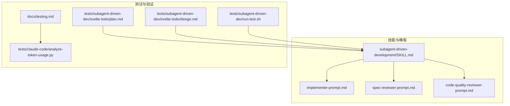
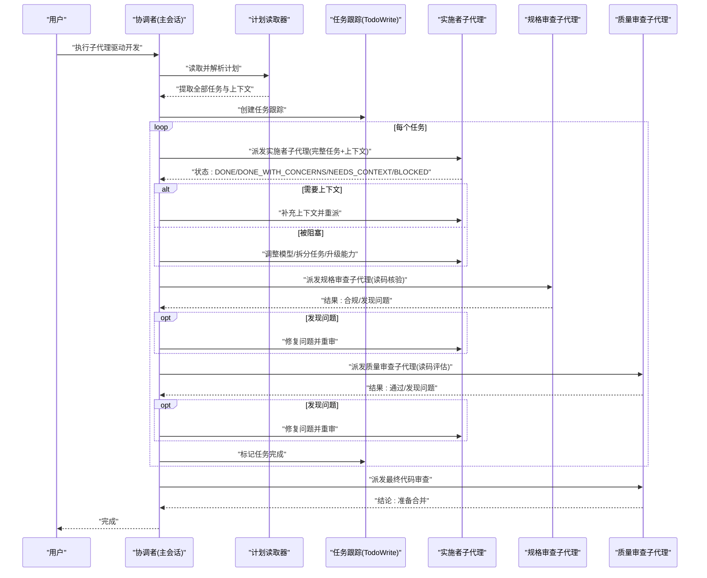
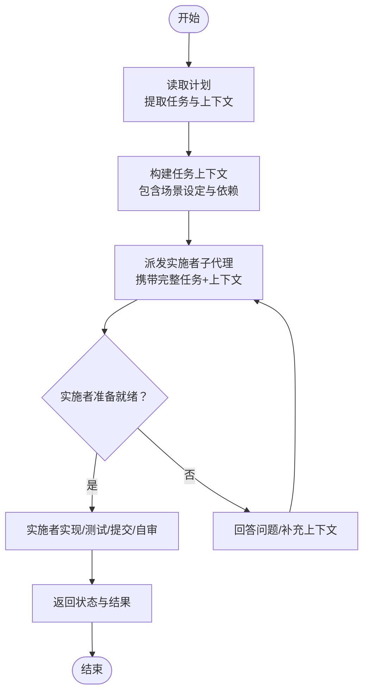
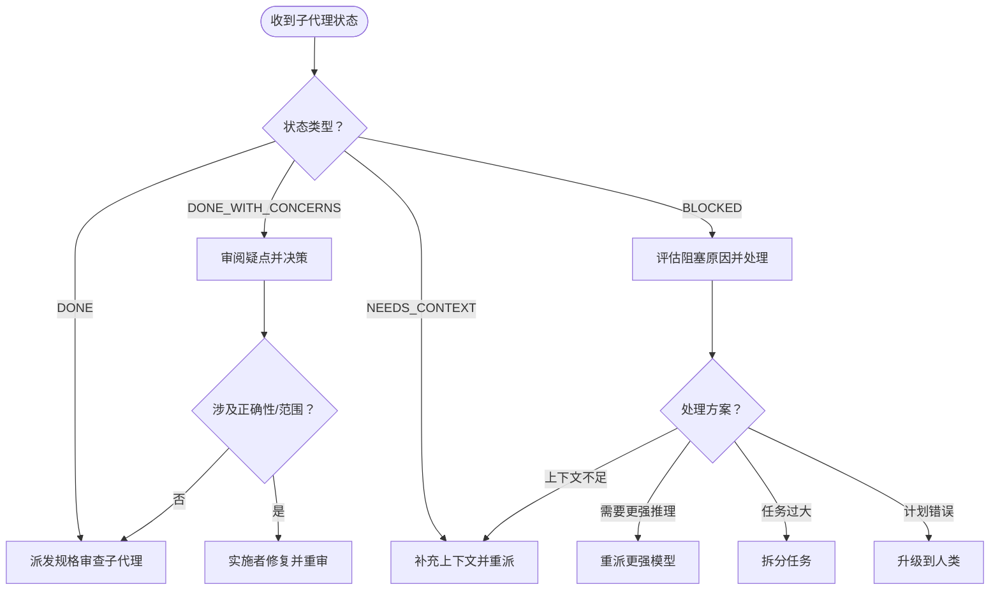
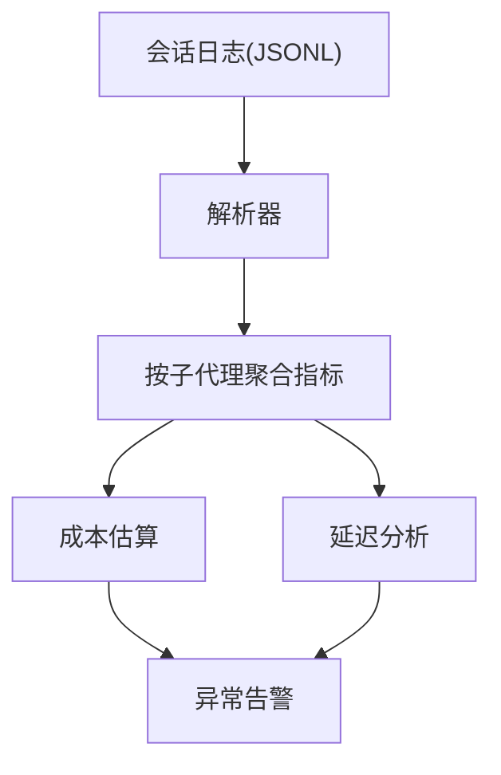
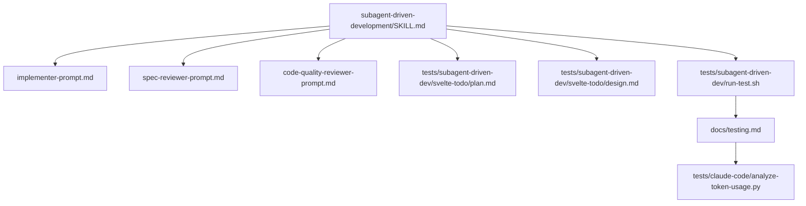

# 子代理生命周期管理

<cite>
**本文档引用的文件**
- [SKILL.md](file://skills/subagent-driven-development/SKILL.md)
- [implementer-prompt.md](file://skills/subagent-driven-development/implementer-prompt.md)
- [spec-reviewer-prompt.md](file://skills/subagent-driven-development/spec-reviewer-prompt.md)
- [code-quality-reviewer-prompt.md](file://skills/subagent-driven-development/code-quality-reviewer-prompt.md)
- [testing-skills-with-subagents.md](file://skills/writing-skills/testing-skills-with-subagents.md)
- [plan.md](file://tests/subagent-driven-dev/svelte-todo/plan.md)
- [design.md](file://tests/subagent-driven-dev/svelte-todo/design.md)
- [run-test.sh](file://tests/subagent-driven-dev/run-test.sh)
- [testing.md](file://docs/testing.md)
- [analyze-token-usage.py](file://tests/claude-code/analyze-token-usage.py)
</cite>

## 目录
1. [简介](#简介)
2. [项目结构](#项目结构)
3. [核心组件](#核心组件)
4. [架构总览](#架构总览)
5. [详细组件分析](#详细组件分析)
6. [依赖关系分析](#依赖关系分析)
7. [性能考量](#性能考量)
8. [故障排查指南](#故障排查指南)
9. [结论](#结论)
10. [附录](#附录)

## 简介
本文件系统性阐述“子代理生命周期管理”的设计与实现，围绕以下目标展开：子代理的创建流程（上下文构建、指令定制、初始化配置）、状态管理（DONE、DONE_WITH_CONCERNS、NEEDS_CONTEXT、BLOCKED 的定义与处理策略）、销毁与清理机制（资源释放、状态持久化、错误处理）、子代理间通信协议（消息格式、同步机制、冲突解决）、以及监控与诊断（性能指标采集、异常检测）。文档以仓库中的子代理驱动开发技能为核心案例，结合测试计划与集成测试工具，提供可操作的实践指导。

## 项目结构
该能力由“技能”“提示模板”“测试计划”“测试脚本”“监控工具”等模块组成，形成“计划驱动 + 子代理执行 + 双重审查 + 指标监控”的闭环。

**图表来源**
- [SKILL.md](file://skills/subagent-driven-development/SKILL.md)
- [implementer-prompt.md](file://skills/subagent-driven-development/implementer-prompt.md)
- [spec-reviewer-prompt.md](file://skills/subagent-driven-development/spec-reviewer-prompt.md)
- [code-quality-reviewer-prompt.md](file://skills/subagent-driven-development/code-quality-reviewer-prompt.md)
- [plan.md](file://tests/subagent-driven-dev/svelte-todo/plan.md)
- [design.md](file://tests/subagent-driven-dev/svelte-todo/design.md)
- [run-test.sh](file://tests/subagent-driven-dev/run-test.sh)
- [testing.md](file://docs/testing.md)
- [analyze-token-usage.py](file://tests/claude-code/analyze-token-usage.py)

**章节来源**
- [SKILL.md](file://skills/subagent-driven-development/SKILL.md)
- [plan.md](file://tests/subagent-driven-dev/svelte-todo/plan.md)
- [design.md](file://tests/subagent-driven-dev/svelte-todo/design.md)
- [run-test.sh](file://tests/subagent-driven-dev/run-test.sh)
- [testing.md](file://docs/testing.md)

## 核心组件
- 子代理驱动开发技能：定义任务拆分、上下文注入、双阶段审查、模型选择策略、状态处理规范与质量门禁。
- 实施者子代理提示模板：明确任务描述、场景设定、前置问题、工作职责、自审要求、报告格式与状态枚举。
- 规格合规审查子代理提示模板：独立验证实现是否满足规格，禁止信任报告，必须读码核对。
- 代码质量审查子代理提示模板：在规格通过后进行，关注可维护性、测试覆盖、接口清晰度与文件结构。
- 测试计划与设计：提供可执行的实现计划与验收标准，作为子代理上下文与质量基线。
- 集成测试与监控：通过真实会话运行、解析日志、统计令牌用量与成本，验证流程正确性与成本控制。

**章节来源**
- [SKILL.md](file://skills/subagent-driven-development/SKILL.md)
- [implementer-prompt.md](file://skills/subagent-driven-development/implementer-prompt.md)
- [spec-reviewer-prompt.md](file://skills/subagent-driven-development/spec-reviewer-prompt.md)
- [code-quality-reviewer-prompt.md](file://skills/subagent-driven-development/code-quality-reviewer-prompt.md)
- [plan.md](file://tests/subagent-driven-dev/svelte-todo/plan.md)
- [design.md](file://tests/subagent-driven-dev/svelte-todo/design.md)
- [testing.md](file://docs/testing.md)

## 架构总览
下图展示从“计划加载”到“最终审查”的端到端流程，以及子代理在各阶段的角色与交互。

**图表来源**
- [SKILL.md](file://skills/subagent-driven-development/SKILL.md)
- [implementer-prompt.md](file://skills/subagent-driven-development/implementer-prompt.md)
- [spec-reviewer-prompt.md](file://skills/subagent-driven-development/spec-reviewer-prompt.md)
- [code-quality-reviewer-prompt.md](file://skills/subagent-driven-development/code-quality-reviewer-prompt.md)

## 详细组件分析

### 子代理创建流程
- 上下文构建：协调者一次性读取计划，提取所有任务及其完整文本与上下文，避免子代理重复读取文件，降低开销并确保一致性。
- 指令定制：针对不同角色使用专用提示模板，明确职责边界与输出格式；实施者强调自审与问题前置；审查者强调独立验证与问题定位。
- 初始化配置：每个子代理接收“完整任务文本 + 场景设定 + 工作目录”，并在开始前允许提问，确保理解一致后再进入实现阶段。

**图表来源**
- [SKILL.md](file://skills/subagent-driven-development/SKILL.md)
- [implementer-prompt.md](file://skills/subagent-driven-development/implementer-prompt.md)

**章节来源**
- [SKILL.md](file://skills/subagent-driven-development/SKILL.md)
- [implementer-prompt.md](file://skills/subagent-driven-development/implementer-prompt.md)

### 状态管理与处理策略
四种状态的定义与处理策略如下：
- DONE：继续进行规格合规审查。
- DONE_WITH_CONCERNS：实施者已完成但有疑虑，先审阅疑点再决定是否继续或回退修正。
- NEEDS_CONTEXT：缺少必要信息，协调者补充上下文后重派。
- BLOCKED：无法完成任务，需评估原因并采取措施：提供更多信息、提升模型能力、拆分任务、或升级到人类介入。

**图表来源**
- [SKILL.md](file://skills/subagent-driven-development/SKILL.md)

**章节来源**
- [SKILL.md](file://skills/subagent-driven-development/SKILL.md)

### 销毁与清理机制
- 资源释放：子代理生命周期结束后，不继承会话历史，避免上下文污染；每次仅注入任务所需上下文，减少内存占用。
- 状态持久化：通过任务跟踪器记录任务完成状态，确保跨轮次审查的一致性与可追溯性。
- 错误处理：当子代理报告 BLOCKED 或 NEEDS_CONTEXT 时，协调者根据策略进行重试、重派或拆分，直至问题解决或升级。

**章节来源**
- [SKILL.md](file://skills/subagent-driven-development/SKILL.md)

### 子代理间通信协议
- 消息传递格式：子代理通过统一的“状态+结果+变更清单+自审要点+问题汇总”格式汇报，便于协调者快速决策。
- 同步机制：同一时刻仅派发一个实施者子代理，避免资源竞争与冲突；审查阶段严格按顺序执行（先规格后质量），并通过“问题-修复-复审”的循环保证质量。
- 冲突解决：若多个子代理同时修改同一文件，采用“先到先得 + 提交哈希对比 + 审查确认”的方式，确保变更可追踪且可回滚。

**章节来源**
- [SKILL.md](file://skills/subagent-driven-development/SKILL.md)
- [implementer-prompt.md](file://skills/subagent-driven-development/implementer-prompt.md)
- [spec-reviewer-prompt.md](file://skills/subagent-driven-development/spec-reviewer-prompt.md)
- [code-quality-reviewer-prompt.md](file://skills/subagent-driven-development/code-quality-reviewer-prompt.md)

### 监控与诊断
- 性能指标采集：通过分析会话日志，统计每个子代理的消息数、输入/输出令牌、缓存命中情况与估算成本，识别高耗时环节。
- 异常检测：关注“规格审查未发现但质量审查发现”的异常比例、“BLOCKED/NEEDS_CONTEXT”频繁出现的任务模式，定位上下文缺失或任务过大的问题。
- 成本控制：基于令牌用量与成本估算，优化任务粒度与模型选择策略，确保在质量与成本之间取得平衡。

**图表来源**
- [testing.md](file://docs/testing.md)
- [analyze-token-usage.py](file://tests/claude-code/analyze-token-usage.py)

**章节来源**
- [testing.md](file://docs/testing.md)
- [analyze-token-usage.py](file://tests/claude-code/analyze-token-usage.py)

## 依赖关系分析
- 技能依赖：子代理驱动开发技能依赖于“写计划”“请求代码审查”“完成开发分支”等前置技能，确保端到端流程闭环。
- 模板依赖：实施者与审查者提示模板分别面向不同角色，共同构成“任务执行 + 质量把关”的双轨制。
- 测试依赖：测试计划与设计文档为子代理提供明确的上下文与验收标准；集成测试脚本与监控工具保障流程可验证与可观测。

**图表来源**
- [SKILL.md](file://skills/subagent-driven-development/SKILL.md)
- [implementer-prompt.md](file://skills/subagent-driven-development/implementer-prompt.md)
- [spec-reviewer-prompt.md](file://skills/subagent-driven-development/spec-reviewer-prompt.md)
- [code-quality-reviewer-prompt.md](file://skills/subagent-driven-development/code-quality-reviewer-prompt.md)
- [plan.md](file://tests/subagent-driven-dev/svelte-todo/plan.md)
- [design.md](file://tests/subagent-driven-dev/svelte-todo/design.md)
- [run-test.sh](file://tests/subagent-driven-dev/run-test.sh)
- [testing.md](file://docs/testing.md)
- [analyze-token-usage.py](file://tests/claude-code/analyze-token-usage.py)

**章节来源**
- [SKILL.md](file://skills/subagent-driven-development/SKILL.md)
- [plan.md](file://tests/subagent-driven-dev/svelte-todo/plan.md)
- [design.md](file://tests/subagent-driven-dev/svelte-todo/design.md)
- [run-test.sh](file://tests/subagent-driven-dev/run-test.sh)
- [testing.md](file://docs/testing.md)

## 性能考量
- 令牌与成本：通过令牌用量分析工具，可量化每个子代理的成本贡献，识别高成本任务与优化空间。
- 缓存效率：高缓存读取有助于降低输入令牌消耗，建议将通用提示模板本地化并复用。
- 并行与串行：同一会话内串行派发实施者子代理，避免并发冲突；审查阶段可并行处理不同任务的审查，提高吞吐。

[本节为通用性能建议，无需特定文件引用]

## 故障排查指南
- 技能未加载：确认在插件根目录运行测试，并检查本地开发市场启用状态。
- 权限问题：使用权限绕过标志与目录授权，确保子代理可写入测试目录。
- 超时问题：适当增加超时时间，排查是否存在无限循环或任务过于复杂。
- 日志定位：通过会话目录查找最近的 JSONL 文件，使用分析工具提取令牌用量与子代理调用详情。

**章节来源**
- [testing.md](file://docs/testing.md)

## 结论
该子代理生命周期管理体系通过“计划驱动 + 专用提示 + 双重审查 + 指标监控”的闭环，实现了高质量、低成本、可追溯的自动化开发流程。状态管理策略与冲突解决机制确保了在复杂任务下的稳定性，而令牌用量与成本分析则为持续优化提供了数据支撑。建议在实际部署中结合具体任务特征，动态调整任务粒度与模型选择，以获得最佳性价比。

[本节为总结性内容，无需特定文件引用]

## 附录
- 测试计划示例：参考 Svelte 待办应用的实现计划与设计文档，了解如何将复杂需求拆解为可执行任务。
- 集成测试脚本：提供完整的端到端测试流程，包括项目脚手架、会话运行、日志解析与令牌分析。
- 技能测试方法：采用“红-绿-重构”方法论对技能进行压力测试与漏洞修补，确保在高压环境下仍能坚持规则。

**章节来源**
- [plan.md](file://tests/subagent-driven-dev/svelte-todo/plan.md)
- [design.md](file://tests/subagent-driven-dev/svelte-todo/design.md)
- [run-test.sh](file://tests/subagent-driven-dev/run-test.sh)
- [testing-skills-with-subagents.md](file://skills/writing-skills/testing-skills-with-subagents.md)