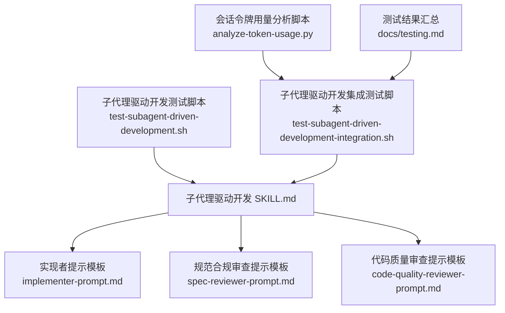
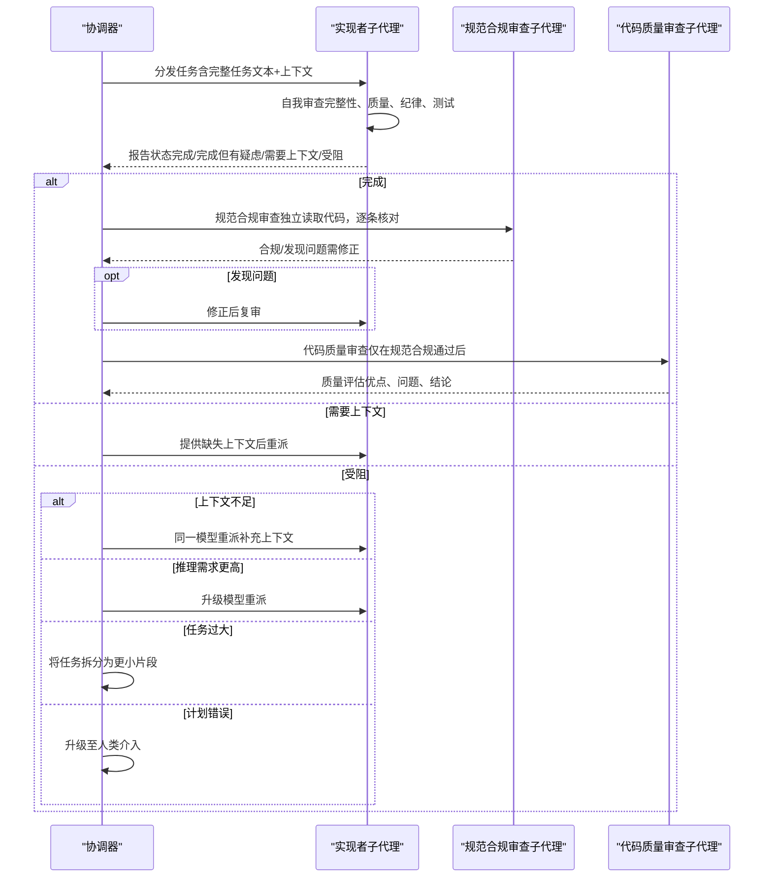
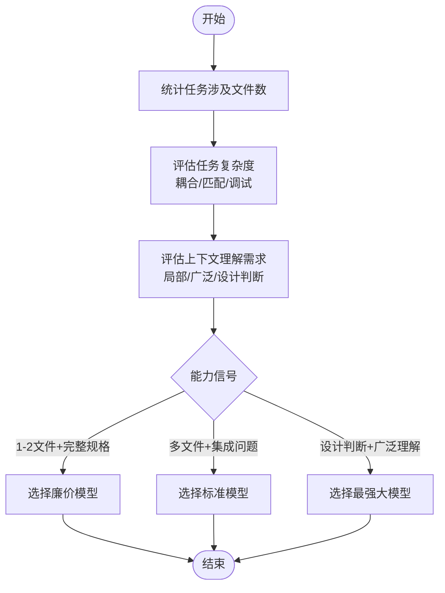
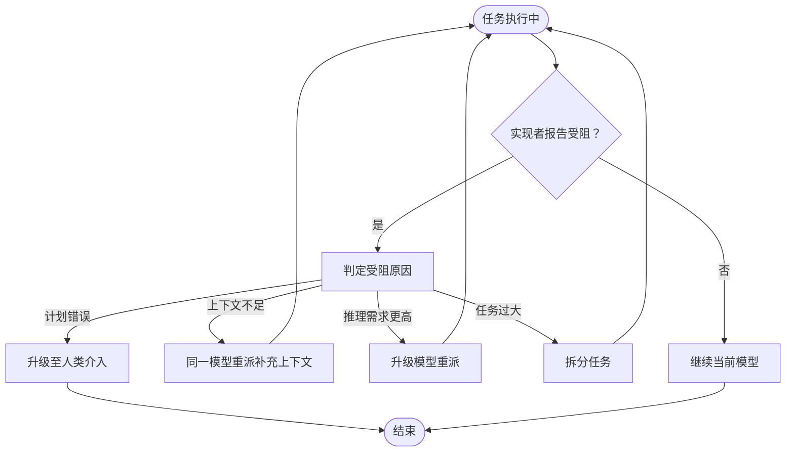
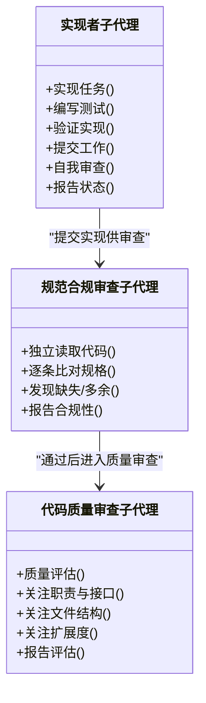
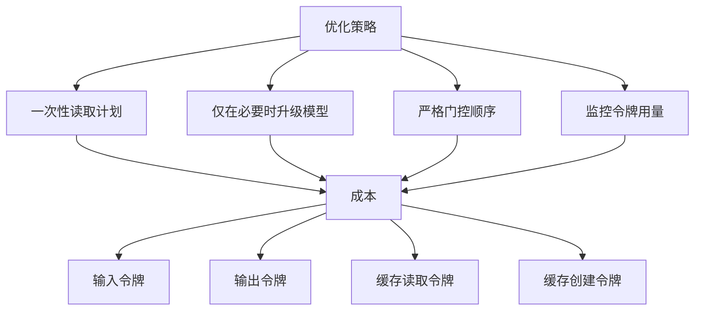
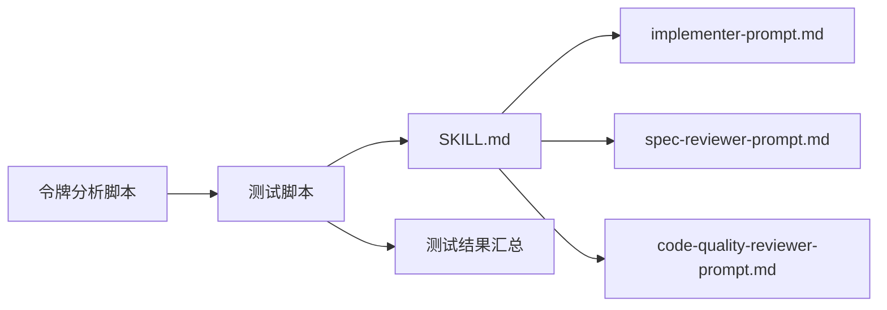

# 模型选择策略

<cite>
**本文引用的文件**
- [子代理驱动开发 SKILL.md](file://skills/subagent-driven-development/SKILL.md)
- [实现者提示模板 implementer-prompt.md](file://skills/subagent-driven-development/implementer-prompt.md)
- [规范合规审查提示模板 spec-reviewer-prompt.md](file://skills/subagent-driven-development/spec-reviewer-prompt.md)
- [代码质量审查提示模板 code-quality-reviewer-prompt.md](file://skills/subagent-driven-development/code-quality-reviewer-prompt.md)
- [子代理驱动开发测试脚本 test-subagent-driven-development.sh](file://tests/claude-code/test-subagent-driven-development.sh)
- [子代理驱动开发集成测试脚本 test-subagent-driven-development-integration.sh](file://tests/claude-code/test-subagent-driven-development-integration.sh)
- [会话令牌用量分析脚本 analyze-token-usage.py](file://tests/claude-code/analyze-token-usage.py)
- [测试结果汇总 docs/testing.md](file://docs/testing.md)
</cite>

## 目录
1. [简介](#简介)
2. [项目结构](#项目结构)
3. [核心组件](#核心组件)
4. [架构总览](#架构总览)
5. [详细组件分析](#详细组件分析)
6. [依赖关系分析](#依赖关系分析)
7. [性能考量](#性能考量)
8. [故障排查指南](#故障排查指南)
9. [结论](#结论)
10. [附录](#附录)

## 简介
本文件围绕“子代理协调器”的模型选择策略进行系统化说明，目标是帮助读者在不同任务类型中做出合适的模型能力选择，并在任务执行过程中动态调整模型等级（升级或降级），以实现质量与成本之间的最佳平衡。内容涵盖：
- 不同任务类型的模型选择标准
- 能力信号识别机制（文件数量、任务复杂度、上下文理解需求）
- 成本优化策略与资源分配优化
- 模型切换机制（升级/降级）
- 对任务质量与效率的影响评估与基准

## 项目结构
该策略由“子代理驱动开发”技能文档定义，并通过配套的子代理提示模板与测试脚本加以验证与落地。关键文件如下：
- 子代理驱动开发技能文档：定义流程、模型选择原则与状态处理
- 实现者提示模板：面向实现类任务的子代理指令
- 规范合规审查提示模板：面向“符合规格”检查的子代理指令
- 代码质量审查提示模板：面向“代码质量”检查的子代理指令
- 测试脚本：验证工作流顺序、自审要求、计划一次性读取等行为
- 令牌用量分析脚本：用于估算成本与输入/输出开销
- 测试结果汇总：展示实际运行中的成本与效率表现

**图表来源**
- [子代理驱动开发 SKILL.md:87-116](file://skills/subagent-driven-development/SKILL.md#L87-L116)
- [实现者提示模板 implementer-prompt.md:1-114](file://skills/subagent-driven-development/implementer-prompt.md#L1-L114)
- [规范合规审查提示模板 spec-reviewer-prompt.md:1-62](file://skills/subagent-driven-development/spec-reviewer-prompt.md#L1-L62)
- [代码质量审查提示模板 code-quality-reviewer-prompt.md:1-27](file://skills/subagent-driven-development/code-quality-reviewer-prompt.md#L1-L27)
- [子代理驱动开发测试脚本 test-subagent-driven-development.sh:1-166](file://tests/claude-code/test-subagent-driven-development.sh#L1-L166)
- [子代理驱动开发集成测试脚本 test-subagent-driven-development-integration.sh:1-315](file://tests/claude-code/test-subagent-driven-development-integration.sh#L1-L315)
- [会话令牌用量分析脚本 analyze-token-usage.py:76-81](file://tests/claude-code/analyze-token-usage.py#L76-L81)
- [测试结果汇总 docs/testing.md:66-135](file://docs/testing.md#L66-L135)

**章节来源**
- [子代理驱动开发 SKILL.md:1-278](file://skills/subagent-driven-development/SKILL.md#L1-L278)
- [子代理驱动开发测试脚本 test-subagent-driven-development.sh:1-166](file://tests/claude-code/test-subagent-driven-development.sh#L1-L166)
- [子代理驱动开发集成测试脚本 test-subagent-driven-development-integration.sh:1-315](file://tests/claude-code/test-subagent-driven-development-integration.sh#L1-L315)
- [会话令牌用量分析脚本 analyze-token-usage.py:76-81](file://tests/claude-code/analyze-token-usage.py#L76-L81)
- [测试结果汇总 docs/testing.md:66-135](file://docs/testing.md#L66-L135)

## 核心组件
- 模型选择原则
  - 原则：优先使用能胜任当前角色的最弱能力模型，以降低成本并提升速度。
  - 三类任务与对应模型：
    - 机械实现任务：隔离函数、明确规格、1-2个文件 → 使用快速且廉价的模型
    - 集成与判断任务：多文件协作、模式匹配、调试 → 使用标准模型
    - 架构、设计与评审任务：需要设计判断或广泛代码库理解 → 使用最强大模型
  - 任务复杂度信号：
    - 触及1-2个文件且规格完整 → 可用廉价模型
    - 触及多个文件且涉及集成问题 → 使用标准模型
    - 需要设计判断或广泛理解 → 使用最强大模型

- 子代理状态处理
  - 四种状态：完成、完成但有疑虑、需要上下文、受阻
  - 处理策略：
    - 完成：进入规范合规审查
    - 完成但有疑虑：先阅读疑虑，必要时先解决正确性/范围问题再进入审查
    - 需要上下文：补充缺失信息后重派
    - 受阻：按原因分级处理（上下文不足、推理需求更高、任务过大、计划错误）

**章节来源**
- [子代理驱动开发 SKILL.md:87-116](file://skills/subagent-driven-development/SKILL.md#L87-L116)

## 架构总览
下图展示了“子代理协调器”在任务执行过程中的模型选择与切换机制，以及各子代理的角色分工与交互。

**图表来源**
- [子代理驱动开发 SKILL.md:102-116](file://skills/subagent-driven-development/SKILL.md#L102-L116)
- [实现者提示模板 implementer-prompt.md:74-98](file://skills/subagent-driven-development/implementer-prompt.md#L74-L98)
- [规范合规审查提示模板 spec-reviewer-prompt.md:37-56](file://skills/subagent-driven-development/spec-reviewer-prompt.md#L37-L56)
- [代码质量审查提示模板 code-quality-reviewer-prompt.md:7-26](file://skills/subagent-driven-development/code-quality-reviewer-prompt.md#L7-L26)

## 详细组件分析

### 组件A：模型选择与能力信号识别
- 任务类型与模型能力要求
  - 机械实现任务：强调“隔离函数、明确规格、1-2文件”，适合快速、低成本模型
  - 集成与判断任务：强调“多文件协作、模式匹配、调试”，需要更强推理能力
  - 架构、设计与评审任务：强调“设计判断、广泛理解”，需要最强大模型
- 能力信号识别方法
  - 文件数量：1-2个文件通常可由廉价模型胜任；多文件通常需要更强模型
  - 任务复杂度：是否涉及跨模块耦合、模式匹配、调试等
  - 上下文理解需求：是否需要广泛代码库理解或高层设计判断
- 识别流程（概念示意）

**章节来源**
- [子代理驱动开发 SKILL.md:87-100](file://skills/subagent-driven-development/SKILL.md#L87-L100)

### 组件B：模型切换机制（升级/降级）
- 升级触发条件
  - 实现者报告“受阻”，且判定为“推理需求更高”
  - 协调器在复审中发现需要更高能力的任务
- 降级触发条件
  - 任务完成后，若后续阶段无需更高能力，可考虑降级以节省成本
- 切换策略
  - 同步上下文：升级/降级前后保持任务上下文一致
  - 重试规则：升级后应避免重复相同错误，必要时进行“修正后复审”

**章节来源**
- [子代理驱动开发 SKILL.md:112-116](file://skills/subagent-driven-development/SKILL.md#L112-L116)

### 组件C：子代理职责与质量门控
- 实现者子代理
  - 职责：实现任务、编写测试、验证、提交、自我审查
  - 自我审查清单：完整性、质量、纪律、测试
- 规范合规审查子代理
  - 职责：独立读取代码，逐条比对规格，发现缺失或多余
  - 心态：不信任实现者报告，必须独立验证
- 代码质量审查子代理
  - 职责：在规范合规通过后进行质量评估
  - 关注点：文件职责清晰、接口定义良好、遵循计划文件结构、避免过度扩展

**图表来源**
- [实现者提示模板 implementer-prompt.md:74-98](file://skills/subagent-driven-development/implementer-prompt.md#L74-L98)
- [规范合规审查提示模板 spec-reviewer-prompt.md:37-56](file://skills/subagent-driven-development/spec-reviewer-prompt.md#L37-L56)
- [代码质量审查提示模板 code-quality-reviewer-prompt.md:20-26](file://skills/subagent-driven-development/code-quality-reviewer-prompt.md#L20-L26)

**章节来源**
- [实现者提示模板 implementer-prompt.md:1-114](file://skills/subagent-driven-development/implementer-prompt.md#L1-L114)
- [规范合规审查提示模板 spec-reviewer-prompt.md:1-62](file://skills/subagent-driven-development/spec-reviewer-prompt.md#L1-L62)
- [代码质量审查提示模板 code-quality-reviewer-prompt.md:1-27](file://skills/subagent-driven-development/code-quality-reviewer-prompt.md#L1-L27)

### 组件D：成本优化与资源分配
- 成本构成
  - 输入/输出令牌消耗、缓存读取/创建
  - 子代理调用次数（每个任务包含实现者+2次审查）
- 优化策略
  - 一次性读取计划，避免重复IO
  - 仅在必要时升级模型，避免过度使用高成本模型
  - 在审查阶段严格执行“先规范合规，后质量审查”，减少返工
  - 使用令牌用量分析工具监控成本，持续优化

**图表来源**
- [会话令牌用量分析脚本 analyze-token-usage.py:76-81](file://tests/claude-code/analyze-token-usage.py#L76-L81)
- [测试结果汇总 docs/testing.md:117-128](file://docs/testing.md#L117-L128)

**章节来源**
- [会话令牌用量分析脚本 analyze-token-usage.py:76-81](file://tests/claude-code/analyze-token-usage.py#L76-L81)
- [测试结果汇总 docs/testing.md:117-128](file://docs/testing.md#L117-L128)

### 组件E：任务质量与效率影响评估
- 质量保障
  - 自我审查降低手交接前的缺陷率
  - 两阶段审查（规范合规+代码质量）确保实现既“做对了”又“做好了”
  - 审查循环确保问题被真正修复
- 效率影响
  - 控制器一次性提取任务，避免子代理重复读取文件
  - 子代理获得完整上下文，减少往返沟通
  - 明确的门控顺序减少无效迭代
- 性能基准与效果评估
  - 令牌用量分析显示主会话与子代理的输入/输出分布
  - 集成测试验证工作流顺序、自审要求、规范审查独立性等关键行为

**章节来源**
- [子代理驱动开发 SKILL.md:215-233](file://skills/subagent-driven-development/SKILL.md#L215-L233)
- [子代理驱动开发测试脚本 test-subagent-driven-development.sh:34-97](file://tests/claude-code/test-subagent-driven-development.sh#L34-L97)
- [子代理驱动开发集成测试脚本 test-subagent-driven-development-integration.sh:187-206](file://tests/claude-code/test-subagent-driven-development-integration.sh#L187-L206)
- [测试结果汇总 docs/testing.md:66-135](file://docs/testing.md#L66-L135)

## 依赖关系分析
- 子代理提示模板与技能文档强耦合：实现者、规范合规审查、代码质量审查三类模板分别对应三种模型能力层级
- 测试脚本与令牌分析脚本共同验证工作流与成本控制
- 依赖链路
  - 技能文档定义模型选择与状态处理
  - 提示模板承载具体角色职责
  - 测试脚本验证流程顺序与行为一致性
  - 令牌分析脚本量化成本与输入/输出

**图表来源**
- [子代理驱动开发 SKILL.md:120-124](file://skills/subagent-driven-development/SKILL.md#L120-L124)
- [实现者提示模板 implementer-prompt.md:1-114](file://skills/subagent-driven-development/implementer-prompt.md#L1-L114)
- [规范合规审查提示模板 spec-reviewer-prompt.md:1-62](file://skills/subagent-driven-development/spec-reviewer-prompt.md#L1-L62)
- [代码质量审查提示模板 code-quality-reviewer-prompt.md:1-27](file://skills/subagent-driven-development/code-quality-reviewer-prompt.md#L1-L27)
- [子代理驱动开发测试脚本 test-subagent-driven-development.sh:1-166](file://tests/claude-code/test-subagent-driven-development.sh#L1-L166)
- [子代理驱动开发集成测试脚本 test-subagent-driven-development-integration.sh:1-315](file://tests/claude-code/test-subagent-driven-development-integration.sh#L1-L315)
- [会话令牌用量分析脚本 analyze-token-usage.py:76-81](file://tests/claude-code/analyze-token-usage.py#L76-L81)
- [测试结果汇总 docs/testing.md:66-135](file://docs/testing.md#L66-L135)

**章节来源**
- [子代理驱动开发 SKILL.md:120-124](file://skills/subagent-driven-development/SKILL.md#L120-L124)
- [子代理驱动开发测试脚本 test-subagent-driven-development.sh:1-166](file://tests/claude-code/test-subagent-driven-development.sh#L1-L166)
- [子代理驱动开发集成测试脚本 test-subagent-driven-development-integration.sh:1-315](file://tests/claude-code/test-subagent-driven-development-integration.sh#L1-L315)
- [会话令牌用量分析脚本 analyze-token-usage.py:76-81](file://tests/claude-code/analyze-token-usage.py#L76-L81)
- [测试结果汇总 docs/testing.md:66-135](file://docs/testing.md#L66-L135)

## 性能考量
- 模型选择对吞吐与延迟的影响
  - 廉价模型：更快响应、更低延迟，适合机械实现任务
  - 标准模型：平衡推理与成本，适合集成与判断任务
  - 最强大模型：更强推理与理解能力，适合架构与设计任务
- 成本与性能权衡
  - 通过一次性读取计划与明确门控顺序减少令牌消耗
  - 仅在必要时升级模型，避免不必要的高成本调用
- 资源分配优化建议
  - 将高复杂度任务集中在少数高能力模型上
  - 将大量简单任务分配给廉价模型，提高整体吞吐
  - 使用令牌用量分析工具定期校准模型分配策略

## 故障排查指南
- 常见问题与处理
  - 忽略“需要上下文”状态：补充缺失信息后重派
  - 忽视“受阻”状态：按原因分级处理（上下文不足、推理需求更高、任务过大、计划错误）
  - 跳过审查门控：必须先规范合规审查，再进行代码质量审查
  - 忽视自审要求：实现者必须在报告前完成自我审查
- 验证要点
  - 测试脚本验证工作流顺序、自审要求、计划一次性读取等
  - 令牌用量分析用于识别异常高消耗环节

**章节来源**
- [子代理驱动开发 SKILL.md:102-116](file://skills/subagent-driven-development/SKILL.md#L102-L116)
- [子代理驱动开发测试脚本 test-subagent-driven-development.sh:34-97](file://tests/claude-code/test-subagent-driven-development.sh#L34-L97)
- [子代理驱动开发集成测试脚本 test-subagent-driven-development-integration.sh:187-206](file://tests/claude-code/test-subagent-driven-development-integration.sh#L187-L206)

## 结论
本策略通过明确的任务类型划分与能力信号识别，结合严格的子代理职责与审查门控，实现了在质量与成本之间的稳健平衡。通过一次性读取计划、明确的模型选择与切换机制、以及令牌用量监控，能够在保证高质量交付的同时，有效控制成本并提升整体执行效率。

## 附录
- 相关测试与成本分析
  - 集成测试验证工作流顺序与行为一致性
  - 令牌用量分析提供成本估算与优化依据
  - 测试结果汇总展示实际运行中的成本与效率表现

**章节来源**
- [子代理驱动开发集成测试脚本 test-subagent-driven-development-integration.sh:187-206](file://tests/claude-code/test-subagent-driven-development-integration.sh#L187-L206)
- [会话令牌用量分析脚本 analyze-token-usage.py:76-81](file://tests/claude-code/analyze-token-usage.py#L76-L81)
- [测试结果汇总 docs/testing.md:66-135](file://docs/testing.md#L66-L135)