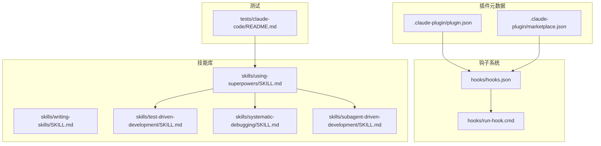
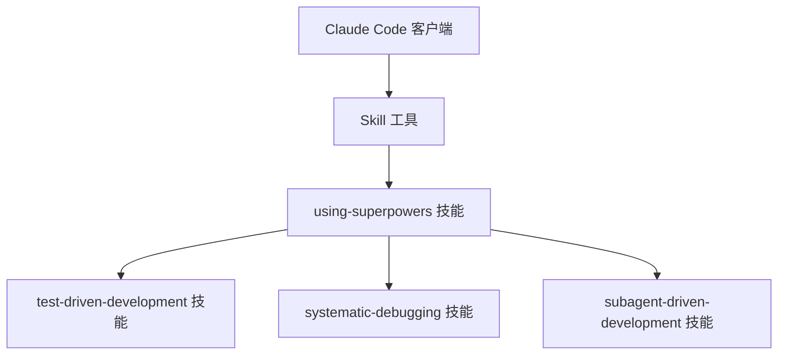
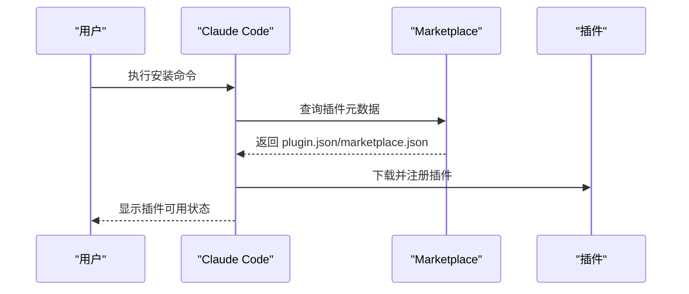
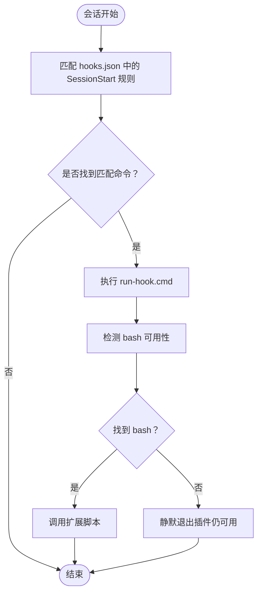
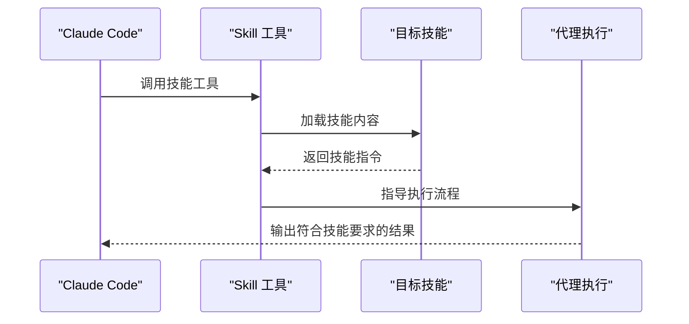
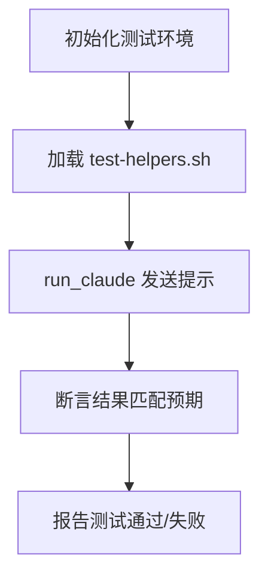
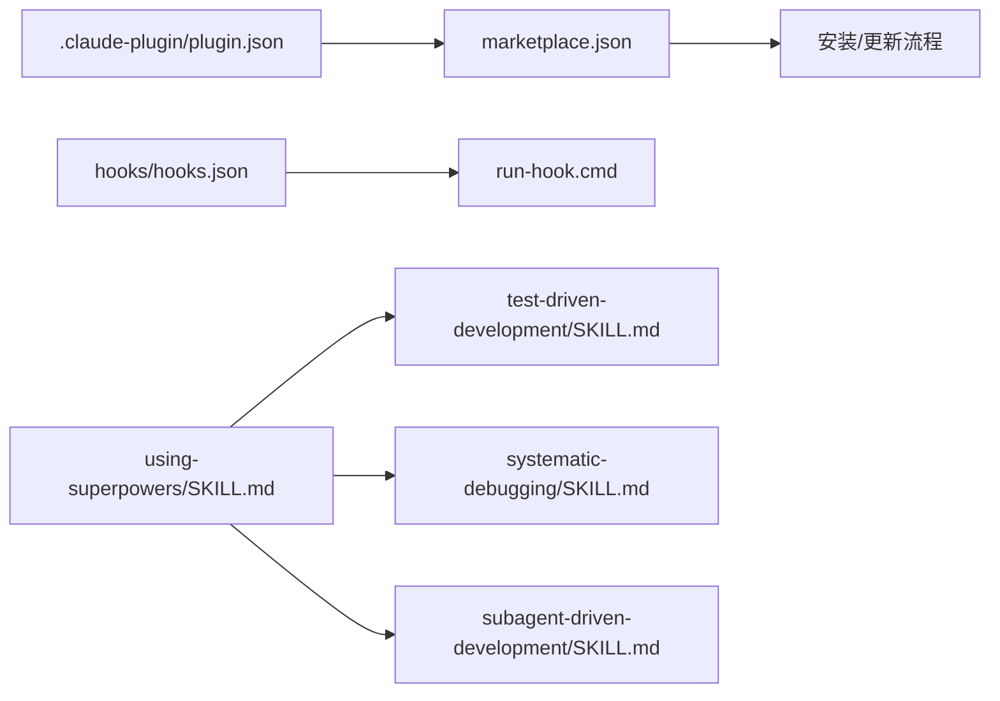

# Claude Code 平台适配器

<cite>
**本文档引用的文件**
- [plugin.json](file://.claude-plugin/plugin.json)
- [marketplace.json](file://.claude-plugin/marketplace.json)
- [hooks.json](file://hooks/hooks.json)
- [run-hook.cmd](file://hooks/run-hook.cmd)
- [README.md](file://README.md)
- [package.json](file://package.json)
- [using-superpowers/SKILL.md](file://skills/using-superpowers/SKILL.md)
- [writing-skills/SKILL.md](file://skills/writing-skills/SKILL.md)
- [test-driven-development/SKILL.md](file://skills/test-driven-development/SKILL.md)
- [systematic-debugging/SKILL.md](file://skills/systematic-debugging/SKILL.md)
- [subagent-driven-development/SKILL.md](file://skills/subagent-driven-development/SKILL.md)
- [tests/claude-code/README.md](file://tests/claude-code/README.md)
- [polyglot-hooks.md](file://docs/windows/polyglot-hooks.md)
</cite>

## 目录
1. [简介](#简介)
2. [项目结构](#项目结构)
3. [核心组件](#核心组件)
4. [架构总览](#架构总览)
5. [详细组件分析](#详细组件分析)
6. [依赖关系分析](#依赖关系分析)
7. [性能考虑](#性能考虑)
8. [故障排除指南](#故障排除指南)
9. [结论](#结论)
10. [附录](#附录)

## 简介
本文件为 Claude Code 平台适配器的技术文档，聚焦于 Superpowers 插件在 Claude Code 中的架构设计与集成机制。内容涵盖：
- 插件配置文件结构（plugin.json、marketplace.json）
- Marketplace 集成与钩子系统（hooks.json、run-hook.cmd）
- Claude Code API 适配策略（会话管理、消息传递、工具调用封装）
- 插件启动流程、命令执行机制与错误处理策略
- 平台特定配置选项、性能优化建议与故障排除指南

该文档旨在帮助开发者快速理解 Superpowers 在 Claude Code 中的工作原理，并提供可操作的实践指导。

## 项目结构
Superpowers 仓库采用“技能库 + 工具链 + 测试”的分层组织方式：
- 插件元数据：.claude-plugin 目录包含 marketplace.json 与 plugin.json
- 钩子系统：hooks 目录包含 hooks.json 与跨平台运行脚本 run-hook.cmd
- 技能库：skills 目录按功能划分多个技能，每个技能以 SKILL.md 作为主参考
- 测试体系：tests/claude-code 提供针对 Claude Code 的自动化测试
- 文档与支持：docs 目录包含平台适配与钩子跨平台说明

**图表来源**
- [.claude-plugin/plugin.json:1-21](file://.claude-plugin/plugin.json#L1-L21)
- [.claude-plugin/marketplace.json:1-21](file://.claude-plugin/marketplace.json#L1-L21)
- [hooks/hooks.json:1-17](file://hooks/hooks.json#L1-L17)
- [hooks/run-hook.cmd:1-47](file://hooks/run-hook.cmd#L1-L47)
- [skills/using-superpowers/SKILL.md:1-118](file://skills/using-superpowers/SKILL.md#L1-L118)
- [tests/claude-code/README.md:1-159](file://tests/claude-code/README.md#L1-L159)

**章节来源**
- [.claude-plugin/plugin.json:1-21](file://.claude-plugin/plugin.json#L1-L21)
- [.claude-plugin/marketplace.json:1-21](file://.claude-plugin/marketplace.json#L1-L21)
- [hooks/hooks.json:1-17](file://hooks/hooks.json#L1-L17)
- [hooks/run-hook.cmd:1-47](file://hooks/run-hook.cmd#L1-L47)
- [README.md:1-191](file://README.md#L1-L191)
- [package.json:1-7](file://package.json#L1-L7)

## 核心组件
- 插件元数据与 Marketplace 集成
  - plugin.json：定义插件名称、版本、作者、关键词等元信息，用于在 Claude Code Marketplace 中展示与安装
  - marketplace.json：声明市场名称、所有者、插件列表及其源路径，支持从本地目录安装
- 钩子系统
  - hooks.json：定义会话生命周期钩子（如 SessionStart），绑定到命令执行
  - run-hook.cmd：跨平台 polyglot 包装器，兼容 Windows CMD 与 Unix shell，自动定位 bash 并执行扩展脚本
- 技能系统
  - using-superpowers：技能加载与使用规则，强调在任何响应前必须先调用技能工具
  - test-driven-development：TDD 流程与反例清单，确保测试先行
  - systematic-debugging：系统化调试四阶段流程，强调根因调查优先
  - subagent-driven-development：基于子代理的任务执行与两阶段评审流程
  - writing-skills：技能创作的 TDD 化方法论与搜索优化（CSO）原则
- 测试体系
  - tests/claude-code/README.md：提供 Claude Code CLI 自动化测试框架，验证技能加载与行为一致性

**章节来源**
- [plugin.json:1-21](file://.claude-plugin/plugin.json#L1-L21)
- [marketplace.json:1-21](file://.claude-plugin/marketplace.json#L1-L21)
- [hooks.json:1-17](file://hooks/hooks.json#L1-L17)
- [run-hook.cmd:1-47](file://hooks/run-hook.cmd#L1-L47)
- [using-superpowers/SKILL.md:1-118](file://skills/using-superpowers/SKILL.md#L1-L118)
- [test-driven-development/SKILL.md:1-372](file://skills/test-driven-development/SKILL.md#L1-L372)
- [systematic-debugging/SKILL.md:1-297](file://skills/systematic-debugging/SKILL.md#L1-L297)
- [subagent-driven-development/SKILL.md:1-278](file://skills/subagent-driven-development/SKILL.md#L1-L278)
- [writing-skills/SKILL.md:1-656](file://skills/writing-skills/SKILL.md#L1-L656)
- [tests/claude-code/README.md:1-159](file://tests/claude-code/README.md#L1-L159)

## 架构总览
Superpowers 在 Claude Code 中的适配遵循“技能即工具”的理念：通过 Claude Code 的 Skill 工具加载技能内容；通过 hooks.json 定义会话级上下文注入；通过 marketplace.json 与 plugin.json 实现 Marketplace 集成与本地安装。

**图表来源**
- [using-superpowers/SKILL.md:30-36](file://skills/using-superpowers/SKILL.md#L30-L36)
- [test-driven-development/SKILL.md:1-15](file://skills/test-driven-development/SKILL.md#L1-L15)
- [systematic-debugging/SKILL.md:1-20](file://skills/systematic-debugging/SKILL.md#L1-L20)
- [subagent-driven-development/SKILL.md:1-12](file://skills/subagent-driven-development/SKILL.md#L1-L12)

## 详细组件分析

### 组件 A：插件配置与 Marketplace 集成
- plugin.json
  - 定义插件标识、版本、作者、主页、仓库、许可证与关键词，用于 Marketplace 展示与安装
- marketplace.json
  - 定义市场名称、所有者与插件条目，支持从本地路径 source 指向插件根目录
- 安装与更新
  - README 提供 Claude Code 官方 Marketplace 与自建 marketplace 的安装步骤
  - 更新可通过 /plugin update 命令完成

**图表来源**
- [.claude-plugin/plugin.json:1-21](file://.claude-plugin/plugin.json#L1-L21)
- [.claude-plugin/marketplace.json:1-21](file://.claude-plugin/marketplace.json#L1-L21)
- [README.md:27-106](file://README.md#L27-L106)

**章节来源**
- [.claude-plugin/plugin.json:1-21](file://.claude-plugin/plugin.json#L1-L21)
- [.claude-plugin/marketplace.json:1-21](file://.claude-plugin/marketplace.json#L1-L21)
- [README.md:27-106](file://README.md#L27-L106)

### 组件 B：钩子系统与跨平台执行
- hooks.json
  - 定义 SessionStart 钩子，匹配 startup|clear|compact 关键词，异步执行命令
- run-hook.cmd
  - 跨平台 polyglot 包装器：Windows 使用 CMD 解析 heredoc 后段，Unix 直接执行
  - 自动查找 Git for Windows bash 或 PATH 中的 bash，否则静默退出（不中断插件工作）

**图表来源**
- [hooks/hooks.json:1-17](file://hooks/hooks.json#L1-L17)
- [hooks/run-hook.cmd:1-47](file://hooks/run-hook.cmd#L1-L47)

**章节来源**
- [hooks/hooks.json:1-17](file://hooks/hooks.json#L1-L17)
- [hooks/run-hook.cmd:1-47](file://hooks/run-hook.cmd#L1-L47)
- [polyglot-hooks.md:1-50](file://docs/windows/polyglot-hooks.md#L1-L50)

### 组件 C：技能系统与工具调用封装
- using-superpowers
  - 强调在任何响应或行动前必须调用技能工具，即使只有 1% 的适用概率也应先调用
  - 用户指令优先于技能，技能优先于默认系统提示
- test-driven-development
  - TDD 循环：RED（写失败测试）→ GREEN（最小实现）→ REFACTOR（清理）
  - 提供反例清单与红灯清单，防止理性化规避
- systematic-debugging
  - 四阶段：根因调查 → 模式分析 → 假设与测试 → 实施修复
  - 强调在提出修复前必须完成根因调查
- subagent-driven-development
  - 每个任务派发新子代理，两阶段评审：规范符合性评审 → 代码质量评审
  - 明确模型选择策略与子代理状态处理

**图表来源**
- [using-superpowers/SKILL.md:44-76](file://skills/using-superpowers/SKILL.md#L44-L76)
- [test-driven-development/SKILL.md:47-69](file://skills/test-driven-development/SKILL.md#L47-L69)
- [systematic-debugging/SKILL.md:46-87](file://skills/systematic-debugging/SKILL.md#L46-L87)
- [subagent-driven-development/SKILL.md:40-84](file://skills/subagent-driven-development/SKILL.md#L40-L84)

**章节来源**
- [using-superpowers/SKILL.md:18-46](file://skills/using-superpowers/SKILL.md#L18-L46)
- [test-driven-development/SKILL.md:31-46](file://skills/test-driven-development/SKILL.md#L31-L46)
- [systematic-debugging/SKILL.md:16-23](file://skills/systematic-debugging/SKILL.md#L16-L23)
- [subagent-driven-development/SKILL.md:87-101](file://skills/subagent-driven-development/SKILL.md#L87-L101)

### 组件 D：测试与验证
- tests/claude-code/README.md
  - 提供 Claude Code CLI 自动化测试框架，支持快速测试与集成测试
  - 测试结构：test-helpers.sh 提供 run_claude、断言函数；各技能测试文件验证关键要求
  - 支持设置超时、详细输出与 CI 集成

**图表来源**
- [tests/claude-code/README.md:41-79](file://tests/claude-code/README.md#L41-L79)

**章节来源**
- [tests/claude-code/README.md:1-159](file://tests/claude-code/README.md#L1-L159)

## 依赖关系分析
- 插件元数据依赖
  - plugin.json 与 marketplace.json 共同决定插件在 Marketplace 中的可见性与安装入口
- 钩子系统依赖
  - hooks.json 依赖 run-hook.cmd 的跨平台执行能力
- 技能系统依赖
  - using-superpowers 为其他技能提供使用前置条件与优先级规则
  - test-driven-development 与 systematic-debugging 为实现类技能提供基础约束
  - subagent-driven-development 依赖 using-git-worktrees、writing-plans、requesting-code-review 等技能

**图表来源**
- [.claude-plugin/plugin.json:1-21](file://.claude-plugin/plugin.json#L1-L21)
- [.claude-plugin/marketplace.json:1-21](file://.claude-plugin/marketplace.json#L1-L21)
- [hooks/hooks.json:1-17](file://hooks/hooks.json#L1-L17)
- [hooks/run-hook.cmd:1-47](file://hooks/run-hook.cmd#L1-L47)
- [using-superpowers/SKILL.md:1-118](file://skills/using-superpowers/SKILL.md#L1-L118)
- [test-driven-development/SKILL.md:1-372](file://skills/test-driven-development/SKILL.md#L1-L372)
- [systematic-debugging/SKILL.md:1-297](file://skills/systematic-debugging/SKILL.md#L1-L297)
- [subagent-driven-development/SKILL.md:1-278](file://skills/subagent-driven-development/SKILL.md#L1-L278)

**章节来源**
- [.claude-plugin/plugin.json:1-21](file://.claude-plugin/plugin.json#L1-L21)
- [.claude-plugin/marketplace.json:1-21](file://.claude-plugin/marketplace.json#L1-L21)
- [hooks/hooks.json:1-17](file://hooks/hooks.json#L1-L17)
- [hooks/run-hook.cmd:1-47](file://hooks/run-hook.cmd#L1-L47)
- [using-superpowers/SKILL.md:18-46](file://skills/using-superpowers/SKILL.md#L18-L46)

## 性能考虑
- 技能加载与上下文注入
  - using-superpowers 强制在会话早期注入技能上下文，避免重复加载与上下文污染
- 子代理执行效率
  - subagent-driven-development 通过一次性读取完整计划与提供完整任务文本，减少子代理往返与上下文切换开销
- 模型选择策略
  - 根据任务复杂度选择最合适的模型，降低成本并提升速度
- 测试执行
  - 快速测试优先，集成测试仅在必要时运行，合理设置超时参数

**章节来源**
- [using-superpowers/SKILL.md:44-76](file://skills/using-superpowers/SKILL.md#L44-L76)
- [subagent-driven-development/SKILL.md:87-101](file://skills/subagent-driven-development/SKILL.md#L87-L101)
- [tests/claude-code/README.md:126-131](file://tests/claude-code/README.md#L126-L131)

## 故障排除指南
- 安装与 Marketplace 集成问题
  - 确认 plugin.json 与 marketplace.json 字段完整且正确
  - 检查 README 中的安装步骤与命令是否匹配当前平台
- 钩子执行失败
  - run-hook.cmd 在未找到 bash 时会静默退出，不影响插件功能
  - 确保 Windows 上 Git for Windows 的 bash 路径存在或 PATH 中有 bash
- 技能加载与使用异常
  - using-superpowers 要求在任何响应前调用技能工具，检查 Skill 工具是否可用
  - 若出现理性化规避，参考 test-driven-development 与 systematic-debugging 的红灯清单
- 测试失败
  - 使用 tests/claude-code/README.md 提供的参数（如 --verbose、--timeout）进行调试
  - 确保 Claude Code CLI 可用且版本满足要求

**章节来源**
- [hooks/run-hook.cmd:37-39](file://hooks/run-hook.cmd#L37-L39)
- [using-superpowers/SKILL.md:78-96](file://skills/using-superpowers/SKILL.md#L78-L96)
- [tests/claude-code/README.md:133-140](file://tests/claude-code/README.md#L133-L140)

## 结论
Superpowers 在 Claude Code 中通过标准化的插件元数据、健壮的钩子系统与严谨的技能体系，实现了可发现、可加载、可验证的自动化工作流。借助 using-superpowers 的前置规则、test-driven-development 的纪律约束、systematic-debugging 的系统化方法与 subagent-driven-development 的并行执行模式，开发者可以构建高质量、可维护的工程化流程。配合完善的测试与故障排除指南，Superpowers 能够稳定地适配不同平台与场景。

## 附录
- 平台特定配置选项
  - 插件元数据字段：名称、版本、作者、主页、仓库、许可证、关键词
  - Marketplace 条目：名称、描述、版本、源路径、作者信息
  - 钩子规则：匹配器、命令、异步标志
- 推荐最佳实践
  - 在会话开始时注入 using-superpowers 上下文
  - 使用 Skill 工具加载技能，严格遵循技能触发条件
  - 对关键流程（TDD、系统化调试、子代理执行）编写自动化测试
  - 合理设置超时与日志级别，便于 CI 集成与问题定位

**章节来源**
- [.claude-plugin/plugin.json:1-21](file://.claude-plugin/plugin.json#L1-L21)
- [.claude-plugin/marketplace.json:1-21](file://.claude-plugin/marketplace.json#L1-L21)
- [hooks/hooks.json:1-17](file://hooks/hooks.json#L1-L17)
- [using-superpowers/SKILL.md:18-46](file://skills/using-superpowers/SKILL.md#L18-L46)
- [tests/claude-code/README.md:142-150](file://tests/claude-code/README.md#L142-L150)