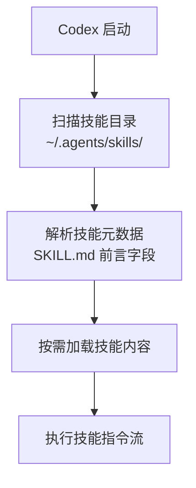
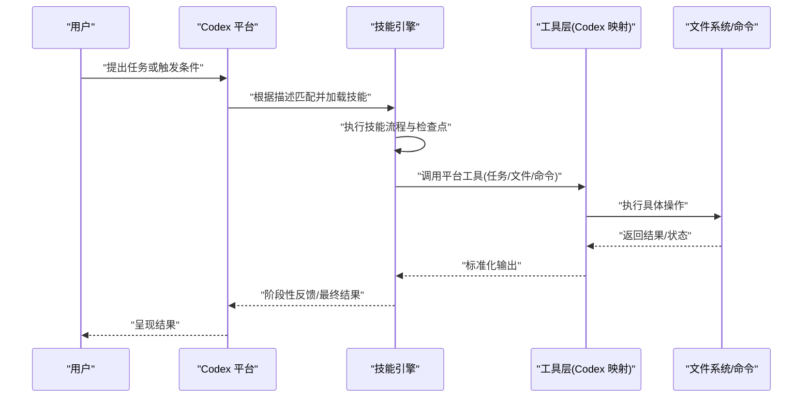
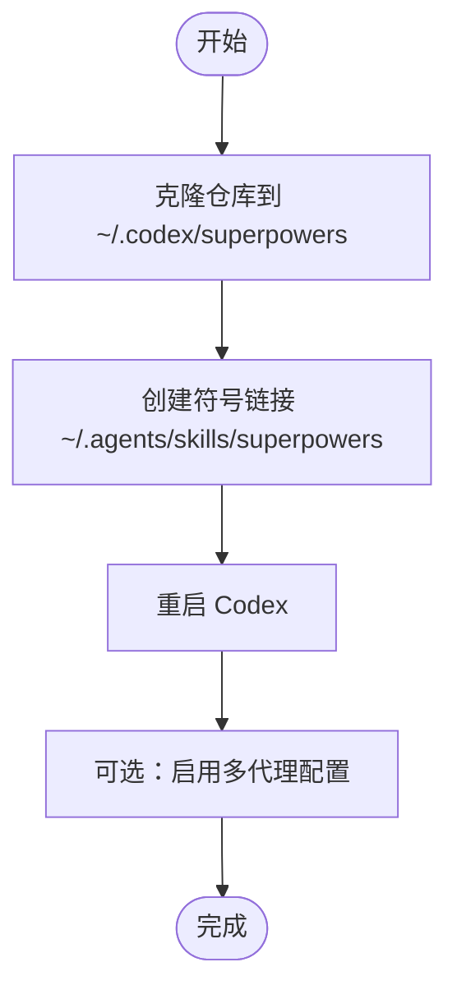
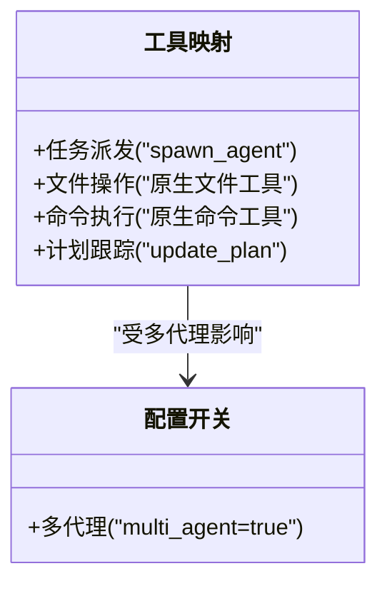
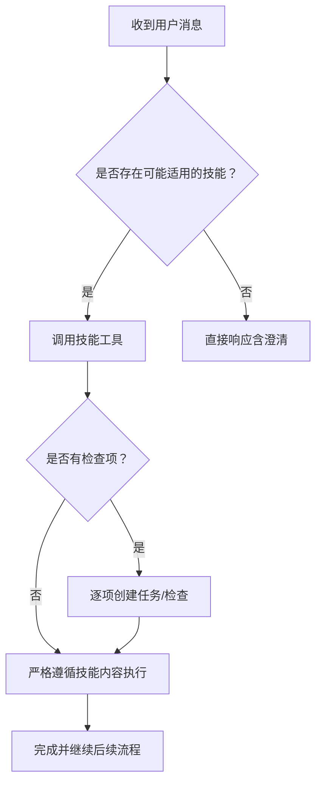
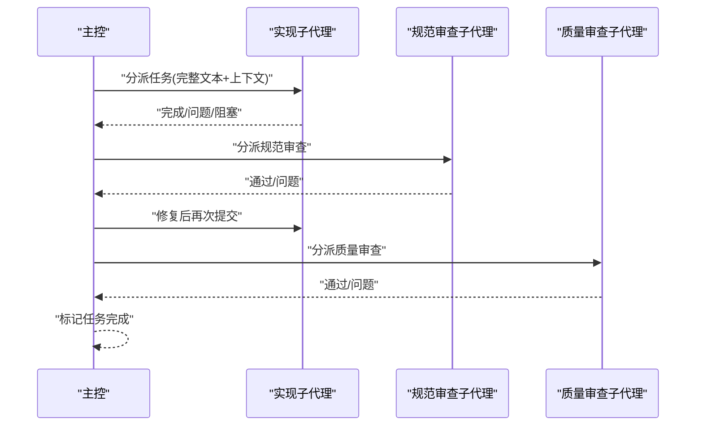
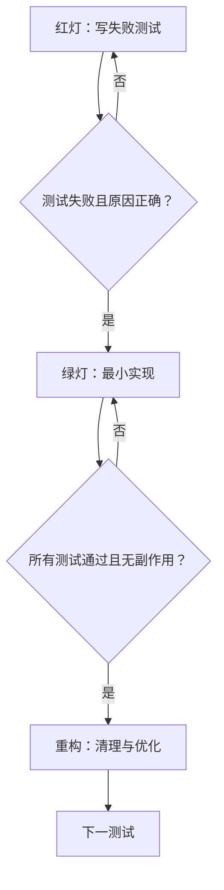
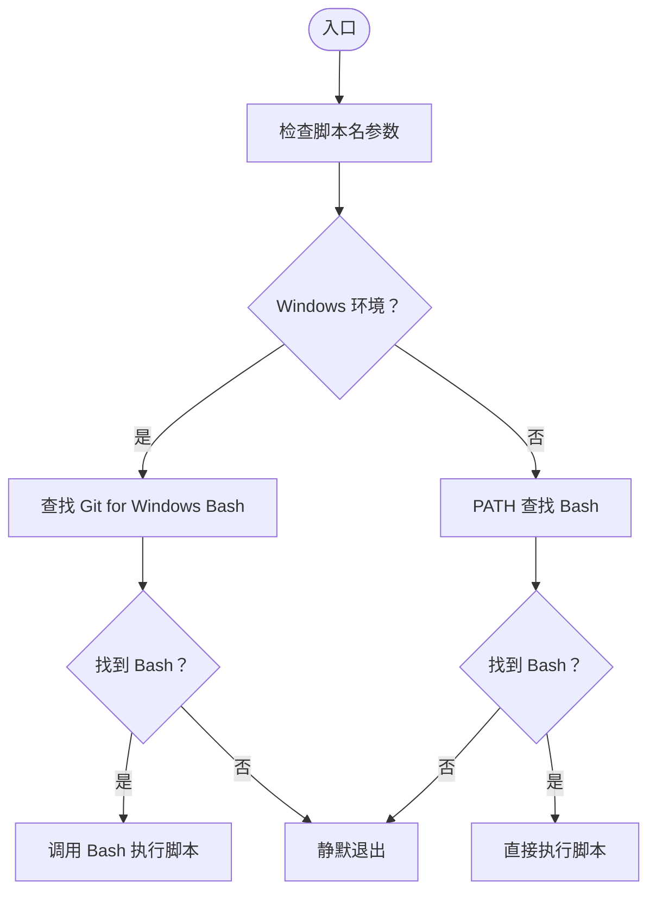
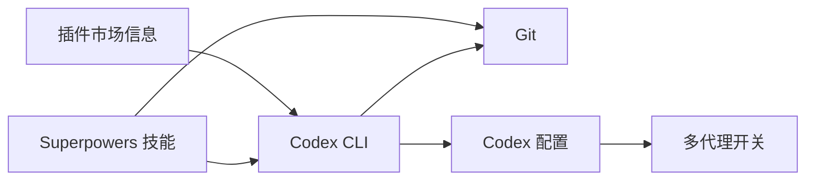

# Codex 平台适配器

<cite>
**本文引用的文件**
- [README.md](file://README.md)
- [docs/README.codex.md](file://docs/README.codex.md)
- [.claude-plugin/marketplace.json](file://.claude-plugin/marketplace.json)
- [.claude-plugin/plugin.json](file://.claude-plugin/plugin.json)
- [hooks/hooks.json](file://hooks/hooks.json)
- [hooks/run-hook.cmd](file://hooks/run-hook.cmd)
- [skills/using-superpowers/SKILL.md](file://skills/using-superpowers/SKILL.md)
- [skills/using-superpowers/references/codex-tools.md](file://skills/using-superpowers/references/codex-tools.md)
- [skills/brainstorming/SKILL.md](file://skills/brainstorming/SKILL.md)
- [skills/subagent-driven-development/SKILL.md](file://skills/subagent-driven-development/SKILL.md)
- [skills/test-driven-development/SKILL.md](file://skills/test-driven-development/SKILL.md)
</cite>

## 目录
1. [简介](#简介)
2. [项目结构](#项目结构)
3. [核心组件](#核心组件)
4. [架构总览](#架构总览)
5. [详细组件分析](#详细组件分析)
6. [依赖关系分析](#依赖关系分析)
7. [性能考量](#性能考量)
8. [故障排除指南](#故障排除指南)
9. [结论](#结论)
10. [附录](#附录)

## 简介
本文件面向在 OpenAI Codex 平台上使用 Superpowers 技能体系的用户与平台适配者，系统化阐述 Codex 平台适配器的集成架构、安装与使用方法、命令行工具封装与配置管理、以及 Codex API 的适配策略（命令执行、输出解析与错误处理）。同时总结 Codex 平台特定的功能限制、性能考虑与最佳实践，并提供安装指南、使用示例与故障排除方法。

## 项目结构
Superpowers 在 Codex 上通过“技能发现”机制加载：将技能目录以符号链接方式挂载到 Codex 的技能搜索路径，即可由平台自动扫描并按需激活相应技能。该仓库提供了 Codex 官方安装与使用说明、技能清单与参考映射，以及与平台钩子相关的辅助脚本。

图表来源
- [docs/README.codex.md:50-58](file://docs/README.codex.md#L50-L58)
- [skills/using-superpowers/SKILL.md:28-36](file://skills/using-superpowers/SKILL.md#L28-L36)

章节来源
- [docs/README.codex.md:13-58](file://docs/README.codex.md#L13-L58)
- [README.md:65-73](file://README.md#L65-L73)

## 核心组件
- 技能发现与加载
  - Codex 通过扫描用户主目录下的技能目录进行自动发现，无需额外配置即可启用 Superpowers 技能。
- 技能清单与触发条件
  - 每个技能以独立目录存放，包含技能定义文件与可选的提示模板与脚本。
- 平台工具映射
  - 针对 Codex 的工具等价映射（如任务派发、文件与命令操作）在参考文档中给出。
- 钩子与跨平台包装
  - 提供跨平台钩子脚本，支持在 Windows 与类 Unix 环境下调用 Bash 脚本。

章节来源
- [docs/README.codex.md:50-58](file://docs/README.codex.md#L50-L58)
- [skills/using-superpowers/SKILL.md:28-36](file://skills/using-superpowers/SKILL.md#L28-L36)
- [skills/using-superpowers/references/codex-tools.md:1-26](file://skills/using-superpowers/references/codex-tools.md#L1-L26)
- [hooks/run-hook.cmd:1-47](file://hooks/run-hook.cmd#L1-L47)

## 架构总览
Codex 适配器的核心在于“技能即服务”的架构：平台负责发现与调度，技能内部定义明确的流程与检查点，平台通过工具映射完成实际操作。下图展示了从用户请求到技能执行的关键交互：

图表来源
- [skills/using-superpowers/SKILL.md:44-76](file://skills/using-superpowers/SKILL.md#L44-L76)
- [skills/using-superpowers/references/codex-tools.md:1-26](file://skills/using-superpowers/references/codex-tools.md#L1-L26)

## 详细组件分析

### 安装与配置管理
- 手动安装步骤
  - 克隆仓库至用户主目录下的 Codex 可见位置。
  - 创建符号链接指向技能目录，使 Codex 在启动时扫描到 Superpowers 技能。
  - Windows 使用目录连接替代符号链接。
- 多代理支持（可选）
  - 若使用需要多代理的技能（如并行子代理开发），需在 Codex 配置中启用多代理功能。
- 更新与卸载
  - 更新：在克隆目录执行拉取更新；由于采用符号链接，技能即时生效。
  - 卸载：删除符号链接与可选的克隆目录。

图表来源
- [docs/README.codex.md:20-40](file://docs/README.codex.md#L20-L40)
- [docs/README.codex.md:90-110](file://docs/README.codex.md#L90-L110)

章节来源
- [docs/README.codex.md:13-58](file://docs/README.codex.md#L13-L58)
- [docs/README.codex.md:90-110](file://docs/README.codex.md#L90-L110)

### 命令行接口封装与平台工具映射
- 工具映射概览
  - 任务派发：使用平台提供的通用派发工具替代原平台命名代理类型。
  - 文件与命令：使用平台原生文件与 Shell 工具。
  - 计划跟踪：使用平台计划更新工具替代专用任务跟踪工具。
- 多代理支持
  - 需要在配置中开启多代理功能，以便使用并行子代理相关技能。
- 消息框架建议
  - 将代理消息以“你的任务是…”的形式组织，明确指令边界，避免总结性输出。

图表来源
- [skills/using-superpowers/references/codex-tools.md:1-26](file://skills/using-superpowers/references/codex-tools.md#L1-L26)
- [skills/using-superpowers/references/codex-tools.md:46-65](file://skills/using-superpowers/references/codex-tools.md#L46-L65)

章节来源
- [skills/using-superpowers/references/codex-tools.md:1-26](file://skills/using-superpowers/references/codex-tools.md#L1-L26)
- [skills/using-superpowers/references/codex-tools.md:46-65](file://skills/using-superpowers/references/codex-tools.md#L46-L65)

### 技能工作流与控制流
- 使用技能的前置规则
  - 在任何响应或行动之前必须先调用可能适用的技能，即使仅 1% 的可能性也要先检查。
- 流程图
  - 技能选择与执行遵循“是否可能适用 → 调用技能 → 是否有检查项 → 严格遵循”的决策链路。

图表来源
- [skills/using-superpowers/SKILL.md:44-76](file://skills/using-superpowers/SKILL.md#L44-L76)

章节来源
- [skills/using-superpowers/SKILL.md:44-76](file://skills/using-superpowers/SKILL.md#L44-L76)

### 子代理驱动开发（并行会话 vs 同会话）
- 适用场景
  - 同会话内执行：每个任务分配新子代理，两阶段审查（规范符合性 → 代码质量）。
  - 并行会话：适合跨会话的任务执行与上下文切换。
- 关键流程
  - 读取计划 → 提取任务与上下文 → 创建任务跟踪 → 分派实现子代理 → 规范审查 → 质量审查 → 完成标记 → 最终评审 → 结束开发分支。

图表来源
- [skills/subagent-driven-development/SKILL.md:40-85](file://skills/subagent-driven-development/SKILL.md#L40-L85)
- [skills/subagent-driven-development/SKILL.md:120-125](file://skills/subagent-driven-development/SKILL.md#L120-L125)

章节来源
- [skills/subagent-driven-development/SKILL.md:40-85](file://skills/subagent-driven-development/SKILL.md#L40-L85)
- [skills/subagent-driven-development/SKILL.md:120-125](file://skills/subagent-driven-development/SKILL.md#L120-L125)

### 测试驱动开发（TDD）与质量门禁
- 核心原则
  - 先写失败测试，再写最小实现，最后重构。
- 循环与验证
  - 红灯（写失败测试）→ 绿灯（最小实现）→ 回归（测试通过）→ 重构（清理）。
- 质量门禁
  - 严格遵循“先失败后通过”的证据链，杜绝“测试之后再写”与“已有代码参考”。

图表来源
- [skills/test-driven-development/SKILL.md:47-69](file://skills/test-driven-development/SKILL.md#L47-L69)

章节来源
- [skills/test-driven-development/SKILL.md:47-69](file://skills/test-driven-development/SKILL.md#L47-L69)

### 钩子与跨平台包装
- 设计目标
  - 在 Windows 上通过批处理定位 Bash 并转发调用，在类 Unix 系统上直接执行脚本。
- 行为特征
  - 若未找到 Bash，静默退出但不影响插件整体运行。
- 使用场景
  - 与平台钩子系统配合，在会话开始等事件触发时执行扩展逻辑。

图表来源
- [hooks/run-hook.cmd:1-47](file://hooks/run-hook.cmd#L1-L47)

章节来源
- [hooks/run-hook.cmd:1-47](file://hooks/run-hook.cmd#L1-L47)
- [hooks/hooks.json:1-17](file://hooks/hooks.json#L1-L17)

## 依赖关系分析
- 平台依赖
  - Codex CLI 与 Git 为基本前提。
  - 多代理能力取决于 Codex 配置开关。
- 内部依赖
  - 技能之间存在工作流依赖（如开发前的头脑风暴、实现前的计划写作、结束前的分支收尾）。
- 外部依赖
  - 插件市场信息用于平台侧的识别与分发。

图表来源
- [docs/README.codex.md:15-19](file://docs/README.codex.md#L15-L19)
- [skills/using-superpowers/references/codex-tools.md:18-23](file://skills/using-superpowers/references/codex-tools.md#L18-L23)
- [.claude-plugin/marketplace.json:1-21](file://.claude-plugin/marketplace.json#L1-L21)

章节来源
- [docs/README.codex.md:15-19](file://docs/README.codex.md#L15-L19)
- [skills/using-superpowers/references/codex-tools.md:18-23](file://skills/using-superpowers/references/codex-tools.md#L18-L23)
- [.claude-plugin/marketplace.json:1-21](file://.claude-plugin/marketplace.json#L1-L21)

## 性能考量
- 成本与速度权衡
  - 子代理驱动开发在同会话内执行，减少上下文切换成本；但子代理数量与审查循环会增加调用次数。
  - 不同角色使用不同模型等级以平衡成本与能力。
- 资源占用
  - 多代理与并行任务会提升并发资源消耗，建议在任务规模与复杂度允许范围内合理拆分。
- 稳定性
  - 严格遵循技能流程与检查点，有助于早期发现问题，降低后期调试成本。

章节来源
- [skills/subagent-driven-development/SKILL.md:87-101](file://skills/subagent-driven-development/SKILL.md#L87-L101)
- [skills/subagent-driven-development/SKILL.md:228-233](file://skills/subagent-driven-development/SKILL.md#L228-L233)

## 故障排除指南
- 技能未显示
  - 检查符号链接是否存在与有效。
  - 确认技能目录内容完整。
  - 重启 Codex 以重新扫描技能。
- Windows 连接问题
  - 使用目录连接替代符号链接；必要时以管理员权限运行。
- 多代理不可用
  - 在 Codex 配置中启用多代理功能后再使用相关技能。
- 钩子脚本无法执行
  - 确认系统已安装 Bash（Git for Windows 或 PATH 中的 Bash）；若缺失则静默降级。

章节来源
- [docs/README.codex.md:111-122](file://docs/README.codex.md#L111-L122)
- [docs/README.codex.md:98-110](file://docs/README.codex.md#L98-L110)
- [skills/using-superpowers/references/codex-tools.md:16-25](file://skills/using-superpowers/references/codex-tools.md#L16-L25)
- [hooks/run-hook.cmd:20-39](file://hooks/run-hook.cmd#L20-L39)

## 结论
Codex 平台适配器以“技能即服务”为核心，通过符号链接实现零配置的技能发现与加载；借助工具映射与配置开关，将平台差异抽象为统一的执行语义。结合严格的流程控制与质量门禁，Superpowers 在 Codex 上实现了可复用、可扩展且高可靠的工作流体系。建议在生产环境中优先采用同会话子代理驱动开发模式，并根据任务复杂度与成本约束选择合适的模型等级与并行策略。

## 附录
- 快速安装指引
  - 在 Codex 中执行安装说明，随后创建符号链接并重启平台。
- 使用示例
  - 在对话中提及“使用头脑风暴”或“使用子代理驱动开发”，平台将按技能定义自动加载并执行。
- 平台信息
  - 插件市场与版本信息由平台侧维护，确保与仓库同步更新。

章节来源
- [README.md:65-73](file://README.md#L65-L73)
- [docs/README.codex.md:5-12](file://docs/README.codex.md#L5-L12)
- [.claude-plugin/plugin.json:1-21](file://.claude-plugin/plugin.json#L1-L21)