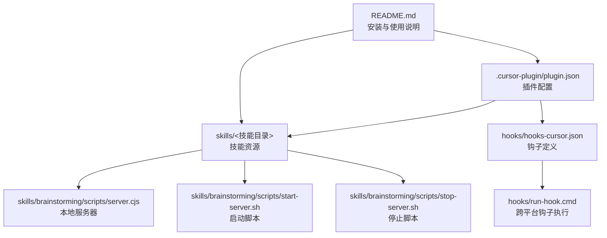
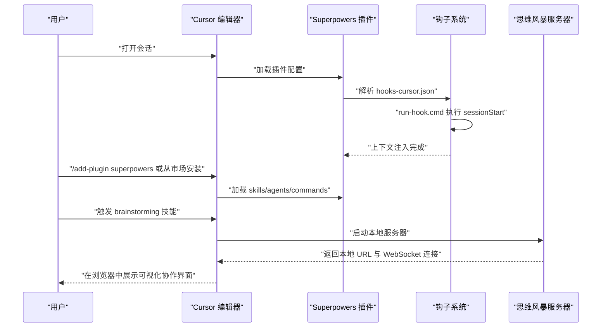
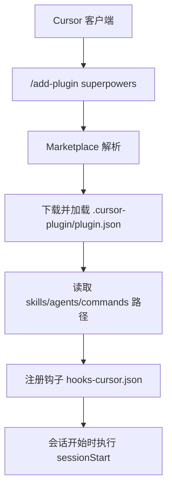
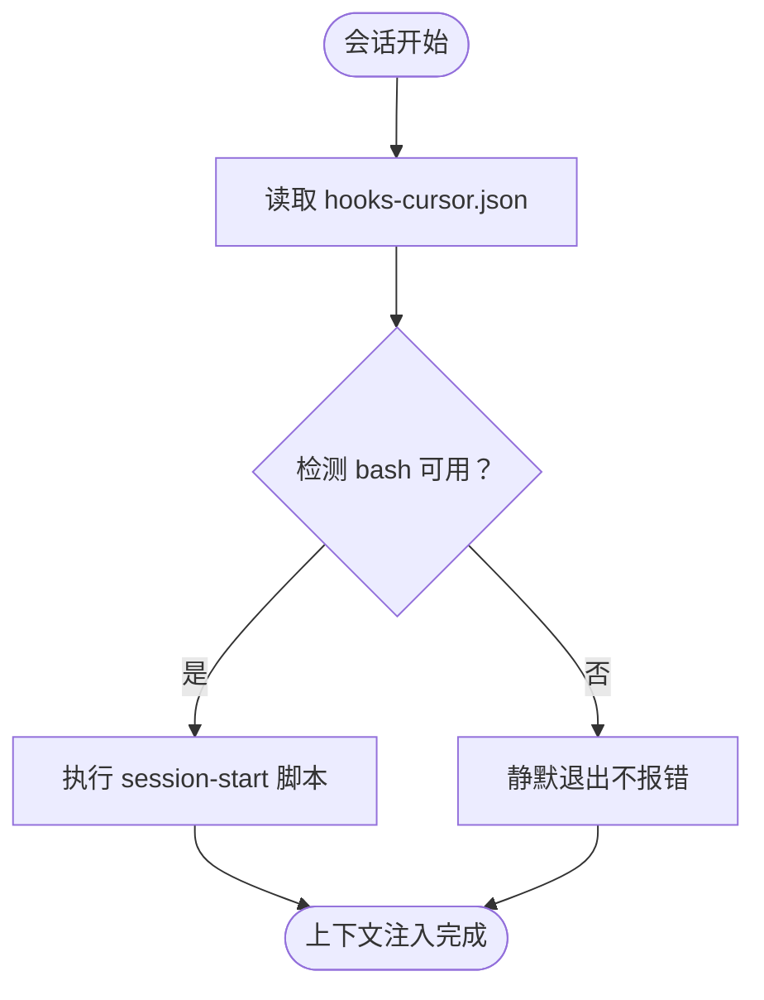
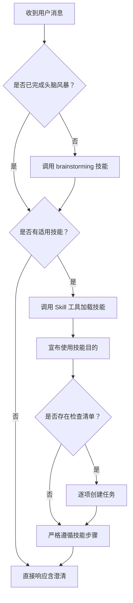
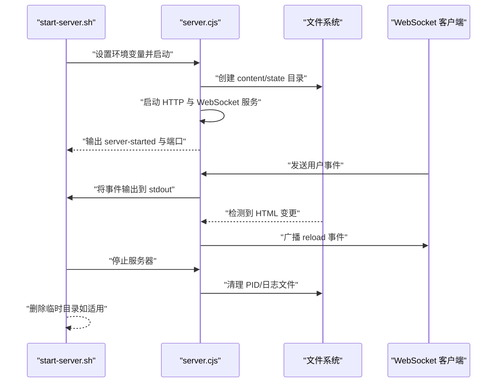
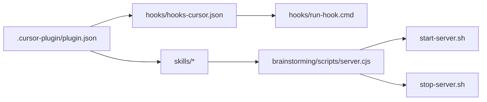

# Cursor 平台适配器

<cite>
**本文档引用的文件**
- [plugin.json](file://.cursor-plugin/plugin.json)
- [hooks-cursor.json](file://hooks/hooks-cursor.json)
- [run-hook.cmd](file://hooks/run-hook.cmd)
- [README.md](file://README.md)
- [SKILL.md（brainstorming）](file://skills/brainstorming/SKILL.md)
- [start-server.sh](file://skills/brainstorming/scripts/start-server.sh)
- [stop-server.sh](file://skills/brainstorming/scripts/stop-server.sh)
- [server.cjs](file://skills/brainstorming/scripts/server.cjs)
- [SKILL.md（using-superpowers）](file://skills/using-superpowers/SKILL.md)
- [find-polluter.sh](file://skills/systematic-debugging/find-polluter.sh)
- [server.test.js](file://tests/brainstorm-server/server.test.js)
</cite>

## 目录
1. [简介](#简介)
2. [项目结构](#项目结构)
3. [核心组件](#核心组件)
4. [架构总览](#架构总览)
5. [组件详解](#组件详解)
6. [依赖关系分析](#依赖关系分析)
7. [性能考量](#性能考量)
8. [故障排查指南](#故障排查指南)
9. [结论](#结论)
10. [附录](#附录)

## 简介
本文件面向 Cursor 平台的 Superpowers 插件适配器，系统化阐述其架构设计、配置文件结构、Marketplace 集成方式、平台特定功能映射、API 适配策略以及开发与部署流程。内容覆盖编辑器集成、代码补全与文件操作封装、钩子机制、可视化协作工具（思维风暴服务器）、测试与调试方法，并提供可操作的开发指南。

## 项目结构
- Cursor 适配器的核心配置位于 .cursor-plugin/plugin.json，声明插件元数据、资源路径与钩子入口。
- 钩子机制通过 hooks/hooks-cursor.json 定义，配合 hooks/run-hook.cmd 实现跨平台脚本执行。
- 技能库（skills）包含多类工程化工作流，其中 brainstorming 提供可视化协作能力；using-superpowers 作为使用引导技能。
- 可视化协作工具由 brainstorming 子目录下的 server.cjs、start-server.sh、stop-server.sh 组成，提供本地 HTTP/WebSocket 服务与文件监听刷新能力。
- 测试用例覆盖服务器启动、HTTP 响应、WebSocket 事件转发与文件变更通知等场景。

**图表来源**
- [.cursor-plugin/plugin.json:1-26](file://.cursor-plugin/plugin.json#L1-L26)
- [hooks/hooks-cursor.json:1-11](file://hooks/hooks-cursor.json#L1-L11)
- [hooks/run-hook.cmd:1-47](file://hooks/run-hook.cmd#L1-L47)
- [skills/brainstorming/scripts/server.cjs:1-278](file://skills/brainstorming/scripts/server.cjs#L1-L278)
- [skills/brainstorming/scripts/start-server.sh:1-149](file://skills/brainstorming/scripts/start-server.sh#L1-L149)
- [skills/brainstorming/scripts/stop-server.sh:1-57](file://skills/brainstorming/scripts/stop-server.sh#L1-L57)
- [README.md:1-191](file://README.md#L1-L191)

**章节来源**
- [.cursor-plugin/plugin.json:1-26](file://.cursor-plugin/plugin.json#L1-L26)
- [hooks/hooks-cursor.json:1-11](file://hooks/hooks-cursor.json#L1-L11)
- [hooks/run-hook.cmd:1-47](file://hooks/run-hook.cmd#L1-L47)
- [README.md:27-84](file://README.md#L27-L84)

## 核心组件
- 插件配置文件：定义插件名称、版本、作者、关键词、资源路径（skills、agents、commands、hooks），并指向 Cursor 钩子文件。
- 钩子系统：在会话开始时触发 sessionStart 钩子，调用扩展脚本实现上下文注入或初始化。
- 技能系统：以 Markdown 技能文件形式组织，包含流程图、检查清单与平台适配说明。
- 可视化协作工具：本地 HTTP+WebSocket 服务器，支持浏览器端 mockups/草图展示与实时刷新。
- 调试与测试：提供服务器集成测试与污染定位脚本，保障稳定性与可维护性。

**章节来源**
- [.cursor-plugin/plugin.json:21-24](file://.cursor-plugin/plugin.json#L21-L24)
- [hooks/hooks-cursor.json:3-9](file://hooks/hooks-cursor.json#L3-L9)
- [skills/brainstorming/SKILL.md:1-165](file://skills/brainstorming/SKILL.md#L1-L165)
- [skills/brainstorming/scripts/start-server.sh:1-149](file://skills/brainstorming/scripts/start-server.sh#L1-L149)
- [tests/brainstorm-server/server.test.js:177-210](file://tests/brainstorm-server/server.test.js#L177-L210)

## 架构总览
Cursor 平台适配器通过以下链路实现与编辑器的深度集成：
- 插件注册：.cursor-plugin/plugin.json 指定资源路径与钩子入口。
- 钩子触发：会话开始时执行 sessionStart，调用 run-hook.cmd 执行对应脚本。
- 技能加载：Cursor 加载 skills、agents、commands 目录中的内容，按需激活。
- 协作工具：可视化思维风暴服务器随技能启用而启动，提供本地 URL 与 WebSocket 事件通道。
- 市场集成：README 中提供 Cursor Marketplace 安装指引，便于用户一键获取。

**图表来源**
- [.cursor-plugin/plugin.json:21-24](file://.cursor-plugin/plugin.json#L21-L24)
- [hooks/hooks-cursor.json:3-9](file://hooks/hooks-cursor.json#L3-L9)
- [hooks/run-hook.cmd:1-47](file://hooks/run-hook.cmd#L1-L47)
- [skills/brainstorming/scripts/start-server.sh:110-149](file://skills/brainstorming/scripts/start-server.sh#L110-L149)
- [README.md:55-63](file://README.md#L55-L63)

## 组件详解

### 插件配置与 Marketplace 集成
- 配置文件结构要点
  - 元数据：name、displayName、description、version、author、homepage、repository、license、keywords。
  - 资源路径：skills、agents、commands、hooks。
  - 钩子入口：hooks 指向 hooks/hooks-cursor.json。
- Marketplace 安装
  - README 提供 Cursor Marketplace 安装命令与搜索方式，确保用户可直接添加与安装插件。

**图表来源**
- [.cursor-plugin/plugin.json:1-26](file://.cursor-plugin/plugin.json#L1-L26)
- [README.md:55-63](file://README.md#L55-L63)

**章节来源**
- [.cursor-plugin/plugin.json:1-26](file://.cursor-plugin/plugin.json#L1-L26)
- [README.md:55-63](file://README.md#L55-L63)

### 钩子机制与跨平台执行
- 钩子定义：hooks/hooks-cursor.json 声明版本与 hooks 映射，当前包含 sessionStart。
- 跨平台执行：run-hook.cmd 在 Windows 上优先查找 Git for Windows 的 bash，其次尝试 PATH 中的 bash；若无 bash 则静默退出但不影响插件整体运行。
- 作用：在会话开始时注入上下文或执行初始化脚本，为后续技能调用提供环境准备。

**图表来源**
- [hooks/hooks-cursor.json:3-9](file://hooks/hooks-cursor.json#L3-L9)
- [hooks/run-hook.cmd:20-39](file://hooks/run-hook.cmd#L20-L39)

**章节来源**
- [hooks/hooks-cursor.json:1-11](file://hooks/hooks-cursor.json#L1-L11)
- [hooks/run-hook.cmd:1-47](file://hooks/run-hook.cmd#L1-L47)

### 技能系统与平台适配
- 使用引导技能（using-superpowers）
  - 强调“在任何对话开始前必须先调用技能”，明确指令优先级与技能类型（刚性 vs 灵活）。
  - 提供平台工具映射参考，指导非 CC 平台使用等价工具。
- 思维风暴技能（brainstorming）
  - 包含硬性门禁（未获得设计批准不得进入实现阶段）、检查清单与可视化协作指南。
  - 与可视化服务器联动，提供浏览器端 mockups 展示与用户事件回传。

**图表来源**
- [skills/using-superpowers/SKILL.md:42-76](file://skills/using-superpowers/SKILL.md#L42-L76)
- [skills/brainstorming/SKILL.md:12-66](file://skills/brainstorming/SKILL.md#L12-L66)

**章节来源**
- [skills/using-superpowers/SKILL.md:1-118](file://skills/using-superpowers/SKILL.md#L1-L118)
- [skills/brainstorming/SKILL.md:1-165](file://skills/brainstorming/SKILL.md#L1-L165)

### 可视化协作工具（思维风暴服务器）
- 启动流程
  - start-server.sh 解析参数（项目目录、绑定主机、URL 主机、前台/后台模式），生成唯一会话目录，写入 PID 文件与日志。
  - 自动检测 CI/Windows 环境并强制前台运行，避免进程被回收。
  - 启动后等待 server-started 输出，确认服务器存活。
- 服务器能力
  - HTTP 服务：提供 HTML 页面与 WebSocket 升级。
  - WebSocket：接收浏览器端用户事件（点击、表单提交、输入），并将其输出到标准输出，便于上游工具捕获。
  - 文件监听：监控 content 目录下 HTML 文件变化，向连接的客户端广播 reload 事件。
- 停止流程
  - stop-server.sh 读取 PID，优雅终止；超时则强制 SIGKILL；清理状态文件；仅删除临时 /tmp 目录，保留持久化目录以便复盘。

**图表来源**
- [skills/brainstorming/scripts/start-server.sh:77-149](file://skills/brainstorming/scripts/start-server.sh#L77-L149)
- [skills/brainstorming/scripts/server.cjs:262-278](file://skills/brainstorming/scripts/server.cjs#L262-L278)
- [skills/brainstorming/scripts/stop-server.sh:19-56](file://skills/brainstorming/scripts/stop-server.sh#L19-L56)

**章节来源**
- [skills/brainstorming/scripts/start-server.sh:1-149](file://skills/brainstorming/scripts/start-server.sh#L1-L149)
- [skills/brainstorming/scripts/server.cjs:236-278](file://skills/brainstorming/scripts/server.cjs#L236-L278)
- [skills/brainstorming/scripts/stop-server.sh:1-57](file://skills/brainstorming/scripts/stop-server.sh#L1-L57)

### API 适配策略与编辑器集成
- 工具映射与兼容性
  - using-superpowers 指导不同平台使用等价工具，确保 Cursor 环境下技能可用。
  - README 提供 Cursor Marketplace 安装命令，简化用户接入。
- 编辑器集成
  - 插件通过 skills、agents、commands 目录暴露能力，Cursor 加载后即可在聊天中调用。
  - sessionStart 钩子用于会话初始化，保证上下文一致性。
- 代码补全与文件操作
  - 技能文件本身不直接提供补全 API，但通过技能触发与可视化协作，间接提升代码设计与评审效率。
  - 文件操作由 server.cjs 与 start/stop 脚本负责，提供本地文件监听与事件广播。

**章节来源**
- [skills/using-superpowers/SKILL.md:38-40](file://skills/using-superpowers/SKILL.md#L38-L40)
- [README.md:55-63](file://README.md#L55-L63)
- [hooks/hooks-cursor.json:3-9](file://hooks/hooks-cursor.json#L3-L9)

## 依赖关系分析
- 组件耦合
  - 插件配置文件与钩子系统强耦合：hooks-cursor.json 决定钩子行为，run-hook.cmd 决定执行环境。
  - 技能系统与可视化服务器弱耦合：仅在触发相关技能时启动服务器，降低资源占用。
- 外部依赖
  - Node.js 运行时（server.cjs）。
  - bash（Windows 通过 Git for Windows 或 PATH 检测）。
  - 浏览器 WebSocket 客户端（用于可视化协作）。

**图表来源**
- [.cursor-plugin/plugin.json:1-26](file://.cursor-plugin/plugin.json#L1-L26)
- [hooks/hooks-cursor.json:1-11](file://hooks/hooks-cursor.json#L1-L11)
- [hooks/run-hook.cmd:1-47](file://hooks/run-hook.cmd#L1-L47)
- [skills/brainstorming/scripts/server.cjs:1-278](file://skills/brainstorming/scripts/server.cjs#L1-L278)
- [skills/brainstorming/scripts/start-server.sh:1-149](file://skills/brainstorming/scripts/start-server.sh#L1-L149)
- [skills/brainstorming/scripts/stop-server.sh:1-57](file://skills/brainstorming/scripts/stop-server.sh#L1-L57)

**章节来源**
- [.cursor-plugin/plugin.json:1-26](file://.cursor-plugin/plugin.json#L1-L26)
- [hooks/hooks-cursor.json:1-11](file://hooks/hooks-cursor.json#L1-L11)
- [hooks/run-hook.cmd:1-47](file://hooks/run-hook.cmd#L1-L47)

## 性能考量
- 进程管理
  - start-server.sh 在 Windows/Git Bash 环境自动切换前台模式，避免后台进程被系统回收导致服务中断。
  - 停止流程包含优雅关闭与强制终止的双重保障，减少僵尸进程风险。
- I/O 与网络
  - server.cjs 使用文件系统监听与 WebSocket 广播，事件处理逻辑简单高效，适合本地协作场景。
- 资源占用
  - 仅在需要时启动服务器，避免常驻进程带来的资源消耗；持久化目录保留便于复盘，临时目录自动清理。

[本节为通用性能讨论，无需具体文件分析]

## 故障排查指南
- 钩子执行失败
  - 现象：会话开始后无上下文注入。
  - 排查：确认 run-hook.cmd 是否找到 bash；Windows 环境建议安装 Git for Windows 并确保 bash 在 PATH 中。
- 服务器无法启动
  - 现象：start-server.sh 输出错误或超时。
  - 排查：检查环境变量（绑定主机、URL 主机、项目目录）；确认前台模式已启用；查看日志文件（PID 文件所在 state 目录）。
- WebSocket 无事件
  - 现象：浏览器交互无回传。
  - 排查：确认浏览器已连接；检查 server.cjs 输出；验证事件格式与过滤逻辑。
- 文件变更未触发刷新
  - 现象：修改 HTML 后浏览器未刷新。
  - 排查：确认 content 目录监听正常；检查文件权限与路径；验证 reload 事件广播逻辑。
- 污染定位
  - 使用 systematic-debugging/find-polluter.sh 快速定位产生副作用的测试文件，结合测试用例进行隔离与修复。

**章节来源**
- [hooks/run-hook.cmd:20-39](file://hooks/run-hook.cmd#L20-L39)
- [skills/brainstorming/scripts/start-server.sh:62-75](file://skills/brainstorming/scripts/start-server.sh#L62-L75)
- [skills/brainstorming/scripts/server.cjs:240-245](file://skills/brainstorming/scripts/server.cjs#L240-L245)
- [skills/systematic-debugging/find-polluter.sh:1-64](file://skills/systematic-debugging/find-polluter.sh#L1-L64)

## 结论
Cursor 平台适配器通过清晰的配置文件、稳健的钩子机制与可选的可视化协作工具，实现了与编辑器的无缝集成。其设计强调可移植性（跨平台钩子执行）、可维护性（服务器生命周期管理与测试覆盖）与可扩展性（技能系统与 Marketplace 安装）。遵循本文档的开发与部署流程，可在 Cursor 环境中稳定地提供 Superpowers 的核心能力。

[本节为总结性内容，无需具体文件分析]

## 附录

### 开发指南
- 目录结构
  - .cursor-plugin/plugin.json：插件元数据与资源路径。
  - hooks/hooks-cursor.json：钩子定义。
  - hooks/run-hook.cmd：跨平台钩子执行脚本。
  - skills/：技能文件与脚本。
- 开发步骤
  - 修改插件配置后，重新安装至 Cursor Marketplace 进行验证。
  - 在 hooks-cursor.json 中新增钩子时，同步完善 run-hook.cmd 的执行逻辑。
  - 新增技能时，编写对应的 SKILL.md 并在 README 中补充安装说明。
  - 对 server.cjs 的改动需配套更新 start/stop 脚本与测试用例。

**章节来源**
- [.cursor-plugin/plugin.json:1-26](file://.cursor-plugin/plugin.json#L1-L26)
- [hooks/hooks-cursor.json:1-11](file://hooks/hooks-cursor.json#L1-L11)
- [hooks/run-hook.cmd:1-47](file://hooks/run-hook.cmd#L1-L47)
- [README.md:27-84](file://README.md#L27-L84)

### 测试方法
- 集成测试
  - tests/brainstorm-server/server.test.js 覆盖服务器启动、HTTP 响应、WebSocket 事件与文件变更通知。
- 单元测试
  - 使用 find-polluter.sh 对测试集进行污染定位，确保测试隔离性。
- 手工验证
  - 在 Cursor 中安装插件，触发 sessionStart 钩子与 brainstorming 技能，验证本地 URL 与事件回传。

**章节来源**
- [tests/brainstorm-server/server.test.js:177-210](file://tests/brainstorm-server/server.test.js#L177-L210)
- [skills/systematic-debugging/find-polluter.sh:1-64](file://skills/systematic-debugging/find-polluter.sh#L1-L64)

### 部署流程
- 本地开发
  - 修改配置与脚本后，在 Cursor 中重新安装插件进行验证。
- Marketplace 发布
  - 更新 .cursor-plugin/plugin.json 版本号与 keywords，确保 README 中的安装命令正确。
- 回归测试
  - 运行集成测试与手工验证，确保钩子、技能与服务器功能正常。

**章节来源**
- [.cursor-plugin/plugin.json:5-20](file://.cursor-plugin/plugin.json#L5-L20)
- [README.md:55-63](file://README.md#L55-L63)