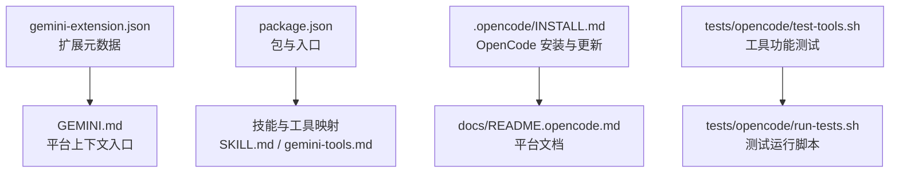
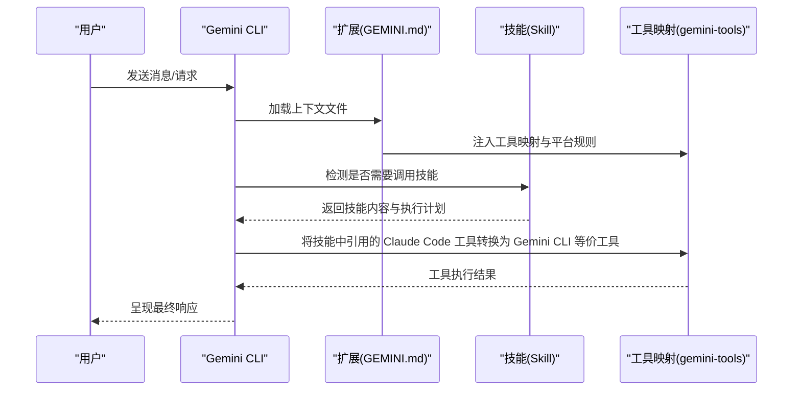
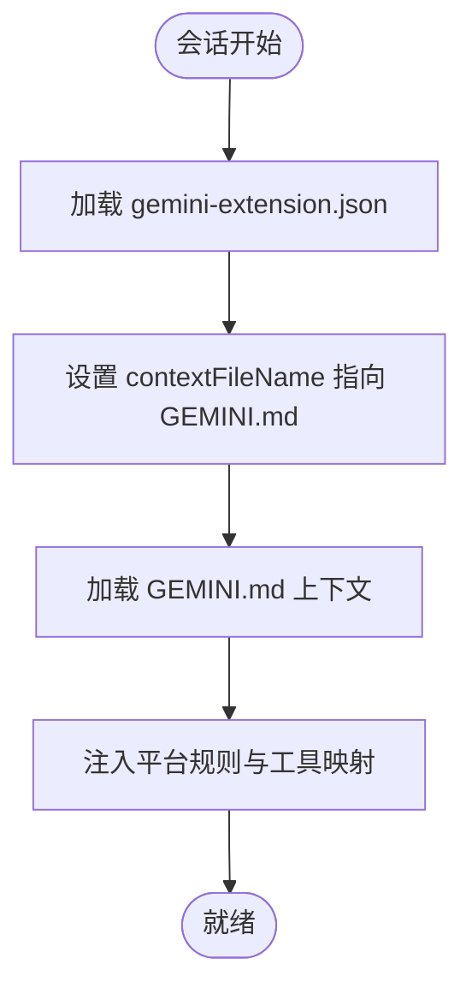
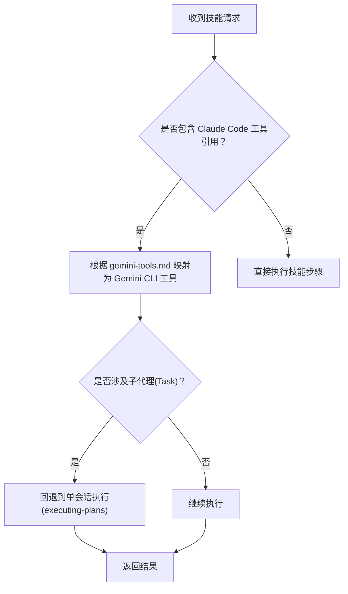
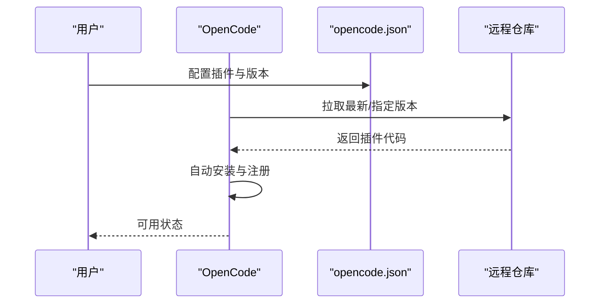
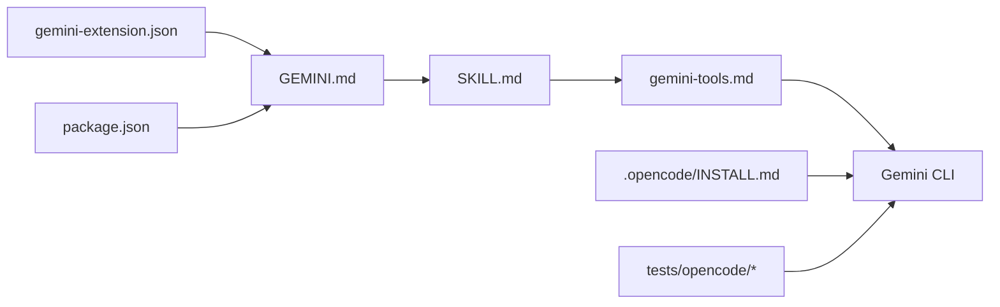

# Gemini 平台适配器

<cite>
**本文引用的文件**
- [GEMINI.md](file://GEMINI.md)
- [gemini-extension.json](file://gemini-extension.json)
- [package.json](file://package.json)
- [skills/using-superpowers/SKILL.md](file://skills/using-superpowers/SKILL.md)
- [skills/using-superpowers/references/gemini-tools.md](file://skills/using-superpowers/references/gemini-tools.md)
- [.opencode/INSTALL.md](file://.opencode/INSTALL.md)
- [docs/README.opencode.md](file://docs/README.opencode.md)
- [tests/opencode/test-tools.sh](file://tests/opencode/test-tools.sh)
- [tests/opencode/run-tests.sh](file://tests/opencode/run-tests.sh)
</cite>

## 目录
1. [简介](#简介)
2. [项目结构](#项目结构)
3. [核心组件](#核心组件)
4. [架构总览](#架构总览)
5. [详细组件分析](#详细组件分析)
6. [依赖关系分析](#依赖关系分析)
7. [性能考量](#性能考量)
8. [故障排查指南](#故障排查指南)
9. [结论](#结论)
10. [附录](#附录)

## 简介
本文件面向 Gemini 平台适配器，系统性阐述 Superpowers 技能库在 Gemini CLI 中的适配与集成机制。内容涵盖：
- 扩展配置文件结构与加载方式
- CLI 工具集成与技能激活流程
- 更新与版本管理策略
- Gemini API 适配策略（工具映射、参数映射与响应处理）
- 平台特性、性能优化与安全注意事项
- 配置指南、使用方法与维护流程

## 项目结构
Superpowers 在 Gemini 平台上的适配主要通过以下文件与目录组织：
- 扩展元数据：gemini-extension.json
- 平台上下文入口：GEMINI.md
- 包与入口：package.json
- 技能与工具映射：skills/using-superpowers/SKILL.md、skills/using-superpowers/references/gemini-tools.md
- OpenCode 插件安装与测试参考：.opencode/INSTALL.md、docs/README.opencode.md
- 测试脚本：tests/opencode/test-tools.sh、tests/opencode/run-tests.sh

**图表来源**
- [gemini-extension.json:1-7](file://gemini-extension.json#L1-L7)
- [GEMINI.md:1-3](file://GEMINI.md#L1-L3)
- [package.json:1-7](file://package.json#L1-L7)
- [skills/using-superpowers/SKILL.md:1-118](file://skills/using-superpowers/SKILL.md#L1-L118)
- [skills/using-superpowers/references/gemini-tools.md:1-34](file://skills/using-superpowers/references/gemini-tools.md#L1-L34)
- [.opencode/INSTALL.md:1-84](file://.opencode/INSTALL.md#L1-L84)
- [docs/README.opencode.md](file://docs/README.opencode.md)
- [tests/opencode/test-tools.sh:1-36](file://tests/opencode/test-tools.sh#L1-L36)
- [tests/opencode/run-tests.sh:17-68](file://tests/opencode/run-tests.sh#L17-L68)

**章节来源**
- [gemini-extension.json:1-7](file://gemini-extension.json#L1-L7)
- [GEMINI.md:1-3](file://GEMINI.md#L1-L3)
- [package.json:1-7](file://package.json#L1-L7)
- [skills/using-superpowers/SKILL.md:1-118](file://skills/using-superpowers/SKILL.md#L1-L118)
- [skills/using-superpowers/references/gemini-tools.md:1-34](file://skills/using-superpowers/references/gemini-tools.md#L1-L34)
- [.opencode/INSTALL.md:1-84](file://.opencode/INSTALL.md#L1-L84)
- [docs/README.opencode.md](file://docs/README.opencode.md)
- [tests/opencode/test-tools.sh:1-36](file://tests/opencode/test-tools.sh#L1-L36)
- [tests/opencode/run-tests.sh:17-68](file://tests/opencode/run-tests.sh#L17-L68)

## 核心组件
- 扩展元数据与入口
  - gemini-extension.json：定义扩展名称、描述、版本与上下文文件名（contextFileName），用于平台识别与加载。
  - GEMINI.md：作为平台上下文入口，加载后自动注入工具映射与平台规则。
- 技能与工具映射
  - SKILL.md：定义技能优先级、触发规则与执行流程；强调“先调用技能再响应”的原则。
  - gemini-tools.md：提供 Claude Code 工具到 Gemini CLI 的等价映射，以及平台特有工具清单。
- 包与入口
  - package.json：声明包名、版本、模块类型与主入口路径，便于平台解析与加载。

**章节来源**
- [gemini-extension.json:1-7](file://gemini-extension.json#L1-L7)
- [GEMINI.md:1-3](file://GEMINI.md#L1-L3)
- [skills/using-superpowers/SKILL.md:18-46](file://skills/using-superpowers/SKILL.md#L18-L46)
- [skills/using-superpowers/references/gemini-tools.md:1-34](file://skills/using-superpowers/references/gemini-tools.md#L1-L34)
- [package.json:1-7](file://package.json#L1-L7)

## 架构总览
Gemini 适配器的架构围绕“扩展元数据 → 平台上下文 → 技能与工具映射 → CLI 工具集成”展开。其核心流程如下：

**图表来源**
- [GEMINI.md:1-3](file://GEMINI.md#L1-L3)
- [skills/using-superpowers/SKILL.md:28-46](file://skills/using-superpowers/SKILL.md#L28-L46)
- [skills/using-superpowers/references/gemini-tools.md:1-34](file://skills/using-superpowers/references/gemini-tools.md#L1-L34)

## 详细组件分析

### 组件一：扩展配置与加载机制
- 扩展元数据
  - 名称、描述、版本与上下文文件名由 gemini-extension.json 提供，确保平台正确识别与加载。
- 上下文入口
  - GEMINI.md 作为 contextFileName 指向的文件，在会话开始时被加载，自动注入工具映射与平台规则，使技能在 Gemini 环境中可用。

**图表来源**
- [gemini-extension.json:1-7](file://gemini-extension.json#L1-L7)
- [GEMINI.md:1-3](file://GEMINI.md#L1-L3)

**章节来源**
- [gemini-extension.json:1-7](file://gemini-extension.json#L1-L7)
- [GEMINI.md:1-3](file://GEMINI.md#L1-L3)

### 组件二：CLI 工具集成与技能激活
- 技能激活
  - 在 Gemini CLI 中，使用 activate_skill 工具激活技能；技能内容按需加载并在会话中生效。
- 工具映射
  - gemini-tools.md 提供 Claude Code 工具到 Gemini CLI 的等价映射，如 Read→read_file、Write→write_file、Edit→replace、Bash→run_shell_command 等。
- 子代理支持差异
  - Gemini CLI 不支持 Task 工具（子代理调度）。对于依赖子代理的技能（如 subagent-driven-development、dispatching-parallel-agents），将回退至单会话执行 via executing-plans。

**图表来源**
- [skills/using-superpowers/SKILL.md:34-46](file://skills/using-superpowers/SKILL.md#L34-L46)
- [skills/using-superpowers/references/gemini-tools.md:14-22](file://skills/using-superpowers/references/gemini-tools.md#L14-L22)

**章节来源**
- [skills/using-superpowers/SKILL.md:34-46](file://skills/using-superpowers/SKILL.md#L34-L46)
- [skills/using-superpowers/references/gemini-tools.md:14-22](file://skills/using-superpowers/references/gemini-tools.md#L14-L22)

### 组件三：更新与版本管理
- 版本与入口
  - package.json 声明包名、版本与主入口，便于平台解析与加载。
- 更新策略
  - OpenCode 平台采用 Git 插件形式安装与更新。可通过 opencode.json 指定版本或让平台自动更新。
  - .opencode/INSTALL.md 提供安装、迁移与更新指引，并建议重启 OpenCode 以应用变更。

**图表来源**
- [.opencode/INSTALL.md:9-17](file://.opencode/INSTALL.md#L9-L17)
- [.opencode/INSTALL.md:47-57](file://.opencode/INSTALL.md#L47-L57)
- [package.json:1-7](file://package.json#L1-L7)

**章节来源**
- [.opencode/INSTALL.md:9-17](file://.opencode/INSTALL.md#L9-L17)
- [.opencode/INSTALL.md:47-57](file://.opencode/INSTALL.md#L47-L57)
- [package.json:1-7](file://package.json#L1-L7)

### 组件四：平台特定功能与限制
- 平台工具集
  - gemini-tools.md 列出 Gemini CLI 特有的工具，如 list_directory、save_memory、ask_user、tracker_create_task、enter_plan_mode/exit_plan_mode 等。
- 子代理限制
  - 由于 Gemini CLI 缺少 Task 工具，相关技能需回退到单会话执行策略。

**章节来源**
- [skills/using-superpowers/references/gemini-tools.md:23-34](file://skills/using-superpowers/references/gemini-tools.md#L23-L34)
- [skills/using-superpowers/references/gemini-tools.md:17-22](file://skills/using-superpowers/references/gemini-tools.md#L17-L22)

### 组件五：测试与验证
- 工具功能测试
  - tests/opencode/test-tools.sh 验证 find_skills 与 use_skill 等工具在 OpenCode 环境下的行为。
- 测试运行
  - tests/opencode/run-tests.sh 支持集成测试开关与详细输出，便于定位问题。

**章节来源**
- [tests/opencode/test-tools.sh:1-36](file://tests/opencode/test-tools.sh#L1-L36)
- [tests/opencode/run-tests.sh:17-68](file://tests/opencode/run-tests.sh#L17-L68)

## 依赖关系分析
- 扩展与平台
  - gemini-extension.json 与 GEMINI.md 共同决定平台上下文加载与注入。
- 包与入口
  - package.json 决定平台如何解析与加载插件入口。
- 技能与工具映射
  - SKILL.md 与 gemini-tools.md 形成技能执行与工具转换的契约。
- 测试与平台
  - OpenCode 安装文档与测试脚本共同保障适配器在真实环境中的可用性。

**图表来源**
- [gemini-extension.json:1-7](file://gemini-extension.json#L1-L7)
- [GEMINI.md:1-3](file://GEMINI.md#L1-L3)
- [package.json:1-7](file://package.json#L1-L7)
- [skills/using-superpowers/SKILL.md:1-118](file://skills/using-superpowers/SKILL.md#L1-L118)
- [skills/using-superpowers/references/gemini-tools.md:1-34](file://skills/using-superpowers/references/gemini-tools.md#L1-L34)
- [.opencode/INSTALL.md:1-84](file://.opencode/INSTALL.md#L1-L84)
- [tests/opencode/test-tools.sh:1-36](file://tests/opencode/test-tools.sh#L1-L36)
- [tests/opencode/run-tests.sh:17-68](file://tests/opencode/run-tests.sh#L17-L68)

**章节来源**
- [gemini-extension.json:1-7](file://gemini-extension.json#L1-L7)
- [GEMINI.md:1-3](file://GEMINI.md#L1-L3)
- [package.json:1-7](file://package.json#L1-L7)
- [skills/using-superpowers/SKILL.md:1-118](file://skills/using-superpowers/SKILL.md#L1-L118)
- [skills/using-superpowers/references/gemini-tools.md:1-34](file://skills/using-superpowers/references/gemini-tools.md#L1-L34)
- [.opencode/INSTALL.md:1-84](file://.opencode/INSTALL.md#L1-L84)
- [tests/opencode/test-tools.sh:1-36](file://tests/opencode/test-tools.sh#L1-L36)
- [tests/opencode/run-tests.sh:17-68](file://tests/opencode/run-tests.sh#L17-L68)

## 性能考量
- 工具映射与延迟
  - 将 Claude Code 工具映射为 Gemini CLI 等价工具时，应尽量减少不必要的往返与重复调用，避免在技能执行中引入额外等待时间。
- 单会话回退策略
  - 对于依赖子代理的技能，采用单会话执行可降低复杂度，但需注意长任务的超时与资源占用。
- 缓存与持久化
  - 利用 save_memory 等平台工具进行事实持久化，有助于减少重复输入与上下文重建成本。

## 故障排查指南
- 插件未加载
  - 使用日志过滤与 opencode.json 配置检查插件行；确认 OpenCode 版本兼容性。
- 技能不可见
  - 使用 skill 工具列出已发现的技能，核对插件是否成功加载。
- 工具映射异常
  - 当技能引用 Claude Code 工具时，确认 gemini-tools.md 的映射是否正确；若平台无等价工具，需调整技能或回退策略。
- 子代理相关错误
  - 若出现 Task 工具相关报错，确认当前平台不支持子代理，按回退策略执行。

**章节来源**
- [.opencode/INSTALL.md:61-79](file://.opencode/INSTALL.md#L61-L79)
- [skills/using-superpowers/references/gemini-tools.md:17-22](file://skills/using-superpowers/references/gemini-tools.md#L17-L22)

## 结论
Gemini 平台适配器通过扩展元数据、上下文入口与工具映射实现对 Superpowers 技能库的无缝集成。尽管存在子代理支持差异，但通过单会话回退与平台特有工具的合理利用，仍可在 Gemini CLI 中高效完成技能驱动的任务执行。配合 OpenCode 的安装与测试体系，可确保适配器在实际使用中的稳定性与可维护性。

## 附录
- 配置指南
  - 在 opencode.json 中添加插件条目并重启 OpenCode，即可自动安装与注册插件。
  - 如需固定版本，可在插件条目中指定版本标签。
- 使用方法
  - 使用 skill 工具列出与加载技能；在技能中引用的 Claude Code 工具将自动映射为 Gemini CLI 等价工具。
- 维护流程
  - 通过 tests/opencode/test-tools.sh 与 tests/opencode/run-tests.sh 进行工具与集成测试，确保变更不影响现有功能。

**章节来源**
- [.opencode/INSTALL.md:9-17](file://.opencode/INSTALL.md#L9-L17)
- [.opencode/INSTALL.md:47-57](file://.opencode/INSTALL.md#L47-L57)
- [tests/opencode/test-tools.sh:1-36](file://tests/opencode/test-tools.sh#L1-L36)
- [tests/opencode/run-tests.sh:17-68](file://tests/opencode/run-tests.sh#L17-L68)